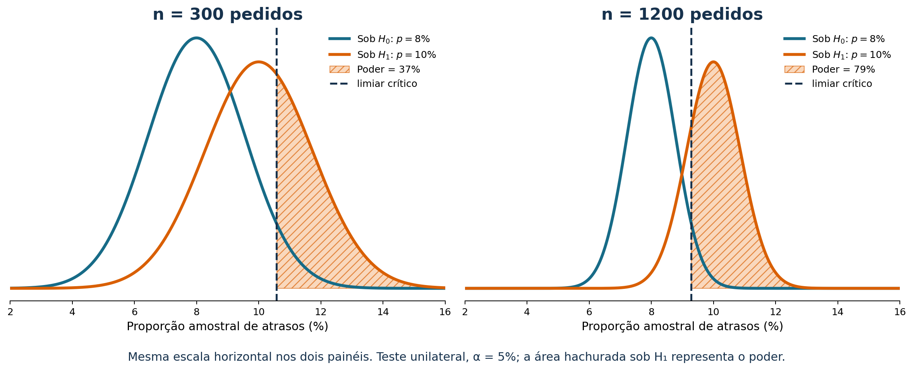

# Objetivos

Este notebook transforma a pergunta operacional da Aula 11 em um teste completo.
Você irá formular hipóteses, construir a distribuição nula, comparar três formas
de calcular o valor-p e estudar erros tipo I, poder e importância prática.

## Como estudar este capítulo

Um teste de hipóteses é um procedimento para medir compatibilidade entre dados e uma afirmação de referência. Ele começa antes do cálculo: definimos a população, o parâmetro, a hipótese nula, a alternativa e uma estatística que represente o afastamento relevante.

Depois construímos o comportamento da estatística **se a hipótese nula fosse verdadeira**. O valor observado é comparado com essa distribuição de referência. O valor-p corresponde à proporção de resultados nulos tão ou mais extremos que o observado, na direção definida pela alternativa.

O capítulo apresenta cálculo exato, aproximação Normal e simulação para a mesma pergunta. Compare os métodos e observe que todos dependem do mesmo modelo nulo. Ao final, separe claramente evidência estatística, tamanho do efeito e importância prática: rejeitar $H_0$ não informa, por si só, se a diferença é grande ou útil.

# 1. A base e a pergunta

Usaremos o **Brazilian E-Commerce Public Dataset by Olist**, disponível no
Kaggle. Cada linha da tabela de pedidos representa um pedido. As colunas centrais
são as datas de compra, entrega efetiva e entrega prevista. A pergunta é:

> A taxa de pedidos atrasados excede o limite operacional de 8%?

# 2. Download e preparação

```{python}
import kagglehub
from pathlib import Path
import matplotlib.pyplot as plt
import numpy as np
import pandas as pd
import seaborn as sns
from scipy.stats import binom, norm

path = kagglehub.dataset_download("olistbr/brazilian-ecommerce")
orders_path = next(Path(path).rglob("olist_orders_dataset.csv"))
orders = pd.read_csv(orders_path)

date_cols = ["order_purchase_timestamp", "order_delivered_customer_date",
             "order_estimated_delivery_date"]
orders[date_cols] = orders[date_cols].apply(pd.to_datetime)
orders = orders.dropna(subset=date_cols).copy()
orders["delay_days"] = (
    orders["order_delivered_customer_date"]
    - orders["order_estimated_delivery_date"]
).dt.total_seconds() / 86400
orders["late"] = (orders["delay_days"] > 0).astype(int)
```


# 3. Descrição rápida

```{python}
orders[["delay_days", "late"]].describe()
```


```{python}
sns.histplot(orders["delay_days"], bins=80)
plt.axvline(0, color="darkorange", linewidth=2)
plt.xlim(-40, 30)
plt.xlabel("Dias após a data prevista")
plt.show()
```

::: {.callout-note title="Interpretação"}
Interprete o resultado sob H0: o valor-p mede quão extremo seria o observado no modelo nulo. Ele não é a probabilidade de H0 e deve ser lido junto com efeito, incerteza e regra de decisão.
:::


Interprete a unidade: `late=1` indica pedido entregue depois da previsão, e não
pedido cancelado ou ainda em trânsito. Observe também que a base contém apenas
pedidos com as três datas disponíveis.

# 4. População didática e amostra

Trataremos os pedidos válidos como uma população didática e retiraremos uma
amostra de 1.200 pedidos. Isso permite repetir o experimento em simulações.

```{python}
rng = np.random.default_rng(20260824)
late = orders["late"].to_numpy()
sample = rng.choice(late, size=1200, replace=False)
n = len(sample)
k = int(sample.sum())
p_hat = sample.mean()
print(f"n={n}; atrasados={k}; taxa={p_hat:.2%}")
```

::: {.callout-note title="Interpretação"}
A taxa amostral é a evidência observada que será comparada aos 8% de $H_0$. Uma nova amostra produziria outro valor; o teste precisa quantificar se a diferença atual é grande em relação à variabilidade esperada.
:::


# 5. Hipóteses e estatística

$$
H_0:p=0{,}08
\qquad\text{contra}\qquad
H_1:p>0{,}08
$$

A estatística será $\widehat p$, a proporção de atrasos. Sob $H_0$, o número de
atrasos em $n$ pedidos segue uma Binomial com parâmetros $n$ e $p_0=0{,}08$.

# 6. Distribuição nula por simulação

```{python}
p0 = 0.08
null_counts = rng.binomial(n=n, p=p0, size=100_000)
null_proportions = null_counts / n

sns.histplot(null_proportions, bins=35)
plt.axvline(p_hat, color="darkorange", linewidth=3, label="observado")
plt.xlabel("Taxa de atraso sob H0")
plt.legend()
plt.show()
```

::: {.callout-note title="Interpretação"}
A distribuição nula mostra as taxas que surgiriam apenas por flutuação amostral se $p=8\%$. A posição da linha observada nessa distribuição determina quão incompatíveis são os dados com $H_0$.
:::


# 7. Três p-valores

```{python}
p_sim = (1 + np.sum(null_proportions >= p_hat)) / (len(null_proportions) + 1)
p_exact = binom.sf(k - 1, n=n, p=p0)
se0 = np.sqrt(p0 * (1-p0) / n)
z = (p_hat-p0) / se0
p_normal = norm.sf(z)

pd.Series({"simulação": p_sim, "Binomial exata": p_exact,
           "aproximação Normal": p_normal})
```


Explique por que os resultados são próximos e em quais amostras a aproximação
Normal poderia falhar.

::: {.callout-note title="Interpretação"}
O cálculo exato usa a distribuição binomial; a simulação a reproduz com erro de Monte Carlo; e a Normal é uma aproximação. A concordância é esperada quando $np_0$ e $n(1-p_0)$ não são pequenos, mas pode falhar com amostras pequenas ou probabilidades próximas de zero ou um.
:::

# 8. Regra de decisão

```{python}
alpha = 0.05
decision = "rejeitar H0" if p_exact < alpha else "não rejeitar H0"
print(decision)
```

“Não rejeitar” não significa aceitar que a taxa seja exatamente 8%. Significa
que a amostra não forneceu evidência suficiente contra esse modelo no nível
escolhido.

# 9. Erro tipo I

```{python}
def rejection_rate(true_p, n=1200, reps=10000, alpha=.05):
    counts = rng.binomial(n, true_p, size=reps)
    p_values = binom.sf(counts - 1, n=n, p=.08)
    return np.mean(p_values < alpha)

print("Erro tipo I sob p=8%:", rejection_rate(.08))
```

::: {.callout-note title="Interpretação"}
Sob $H_0$, qualquer rejeição é um erro tipo I. A taxa simulada próxima de 5% confirma que $\alpha$ limita a frequência de falsos positivos no longo prazo, e não a probabilidade de esta decisão específica estar errada.
:::


# 10. Poder

```{python}
effects = np.array([.08, .085, .09, .10, .11, .12])
power = [rejection_rate(p) for p in effects]
plt.plot(100*effects, power, marker="o")
plt.axhline(.80, color="darkorange", linestyle="--")
plt.xlabel("Taxa verdadeira de atraso (%)")
plt.ylabel("Poder")
plt.show()
```

::: {.callout-note title="Interpretação"}
O poder é baixo para alternativas muito próximas de 8% e cresce com o tamanho do efeito. A linha de 80% é uma referência de planejamento, não uma garantia de detectar toda diferença relevante.
:::

## Visualizando poder sob $H_0$ e $H_1$

Fixemos um teste unilateral com $H_0:p=0{,}08$, uma alternativa específica $p_1=0{,}10$ e $\alpha=0{,}05$. O limiar crítico aproximado para cada tamanho amostral é

$$c_n=p_0+z_{1-\alpha}\sqrt{\frac{p_0(1-p_0)}{n}},$$

em que $c_n$ é a menor proporção que leva à rejeição, $p_0$ é a taxa nula, $z_{1-\alpha}$ é o quantil da Normal padrão e $n$ é o tamanho da amostra. Sob a alternativa, o poder aproximado é

$$\pi(p_1;n)=P_{p_1}(\widehat p\geq c_n).$$

$P_{p_1}$ indica que a probabilidade é calculada quando a taxa verdadeira é $p_1$; geometricamente, ela corresponde à área da distribuição alternativa à direita do limiar.

```{python}
#| eval: false
p0, p1, alpha = .08, .10, .05
z_critical = norm.ppf(1 - alpha)
fig, axes = plt.subplots(1, 2, figsize=(13.2, 5.3), sharex=True)
common_x = np.linspace(.02, .16, 800)

for ax, n_current in zip(axes, [300, 1200]):
    se0_current = np.sqrt(p0 * (1-p0) / n_current)
    se1_current = np.sqrt(p1 * (1-p1) / n_current)
    critical = p0 + z_critical * se0_current
    x = common_x
    y0 = norm.pdf(x, p0, se0_current)
    y1 = norm.pdf(x, p1, se1_current)
    power_current = norm.sf(critical, p1, se1_current)
    ax.plot(100*x, y0, label=r"Sob $H_0$: $p=8\%$")
    ax.plot(100*x, y1, label=r"Sob $H_1$: $p=10\%$")
    mask = x >= critical
    ax.fill_between(100*x[mask], 0, y1[mask], alpha=.5, hatch="///",
                    label=f"Poder = {power_current:.0%}")
    ax.axvline(100*critical, linestyle="--", label="limiar crítico")
    ax.set_title(f"n = {n_current}")
    ax.set_xlim(2, 16)
    ax.legend()
plt.show()
```

{fig-alt="Distribuições da proporção amostral sob H0 e H1 para duas amostras, com a área de poder hachurada."}

::: {.callout-note title="Interpretação"}
Com 300 pedidos, as distribuições sob 8% e 10% se sobrepõem bastante e apenas 37% da distribuição alternativa ultrapassa o limiar. Com 1.200 pedidos, ambas ficam mais estreitas, a sobreposição diminui e o poder sobe para aproximadamente 79%. O efeito verdadeiro não mudou; aumentou apenas a capacidade de distingui-lo da flutuação amostral.
:::


# 11. Significância e relevância

Calcule também a diferença $\widehat p-0{,}08$ e traduza-a para atrasos extras
por mil pedidos. Uma decisão operacional deve considerar o tamanho do efeito,
custos e um intervalo de confiança, não apenas o valor-p.

# 12. Exercícios

1. Repita o teste com amostras de 300, 1.200 e 5.000 pedidos.
2. Transforme o teste em bilateral e explique a mudança no valor-p.
3. Compare o erro tipo I para $\alpha=0{,}01$, 0,05 e 0,10.
4. Encontre o menor $n$ que atinge 80% de poder quando $p=0{,}10$.
5. Discuta se os pedidos podem ser tratados como independentes quando um mesmo
   cliente realiza várias compras.

# Fonte e limitações

Base `olistbr/brazilian-ecommerce`, Kaggle. Os dados são históricos e
anonimizados; o limite de 8% é uma referência didática, não uma meta declarada
pela empresa. O notebook não deve ser interpretado como auditoria operacional
da Olist.

# Guia teórico consolidado

## A lógica de um teste

Um teste começa antes dos cálculos: defina estimando, hipótese nula $H_0$, alternativa $H_A$, estatística e direção. A distribuição nula descreve valores que a estatística poderia assumir se $H_0$ fosse verdadeira. O valor-p é a probabilidade, calculada sob $H_0$, de obter resultado tão ou mais extremo que o observado.

O valor-p não é $P(H_0\mid\text{dados})$, não mede o tamanho do efeito e não é a probabilidade de o resultado ter ocorrido por acaso.

Formalmente, seja $T=T(X_1,\ldots,X_n)$ uma estatística cuja direção de extremidade foi definida antes da análise. Em um teste unilateral à direita,

$$p(X)=P_{H_0}\{T(X^{rep})\geq T(X^{obs})\},$$

em que $X^{obs}$ são os dados observados, $X^{rep}$ representa uma nova amostra gerada pelo modelo nulo e $P_{H_0}$ indica que a probabilidade é calculada assumindo $H_0$. No teste bilateral, a região extrema deve incluir desvios relevantes nas duas direções, frequentemente por meio de $|T|$ quando a distribuição nula é centrada em zero.

Uma região crítica $\mathcal R_\alpha$ é escolhida para satisfazer $P_{H_0}(T\in\mathcal R_\alpha)\leq\alpha$. A regra é rejeitar $H_0$ quando $T_{obs}\in\mathcal R_\alpha$, de modo que $\alpha$ limita a probabilidade de rejeição quando a nula é verdadeira.

## Decisão e erros

O nível $\alpha$ controla a probabilidade de erro tipo I sob as condições do teste. Erro tipo II é não rejeitar $H_0$ quando uma alternativa relevante é verdadeira. Poder é $1-\beta$: a chance de detectar essa alternativa específica.

Para um valor alternativo $\theta_1$, $\beta(\theta_1)=P_{\theta_1}(T\notin\mathcal R_\alpha)$ e $\pi(\theta_1)=1-\beta(\theta_1)$ é a função poder. Portanto, poder não é um único atributo do teste: ele varia com o efeito verdadeiro $\theta_1$.

Reduzir $\alpha$ diminui falsos positivos, mas pode reduzir poder. Poder cresce com tamanho do efeito, tamanho amostral, menor variabilidade e, mantendo o restante, um limiar menos rigoroso.

## Significância e importância

“Rejeitar $H_0$” não significa provar $H_A$; “não rejeitar” não prova equivalência. Com amostras grandes, efeitos irrelevantes podem ser significativos. Sempre reporte estimativa, intervalo e consequência substantiva, além do valor-p.

Testes unilaterais só são defensáveis quando a direção foi escolhida antes de observar os dados e efeitos na direção oposta não levariam à mesma ação. Fazer muitos testes aumenta a chance de falsos positivos e exige definir uma família e uma estratégia de correção.

# Questões de revisão da Aula 11

1. O que um valor-p de 0,02 afirma — e o que ele não afirma?
2. Por que aumentar $n$ eleva o poder quando $p_0$, $p_1$ e $\alpha$ permanecem fixos?

<details><summary>Respostas comentadas</summary>

1. Sob $H_0$, resultados tão ou mais extremos ocorreriam com probabilidade 2%. Isso não significa que $P(H_0\mid\text{dados})=0{,}02$ nem mede relevância prática.
2. O erro padrão diminui, as distribuições sob $H_0$ e $H_1$ ficam mais estreitas e sua sobreposição diminui.
</details>
