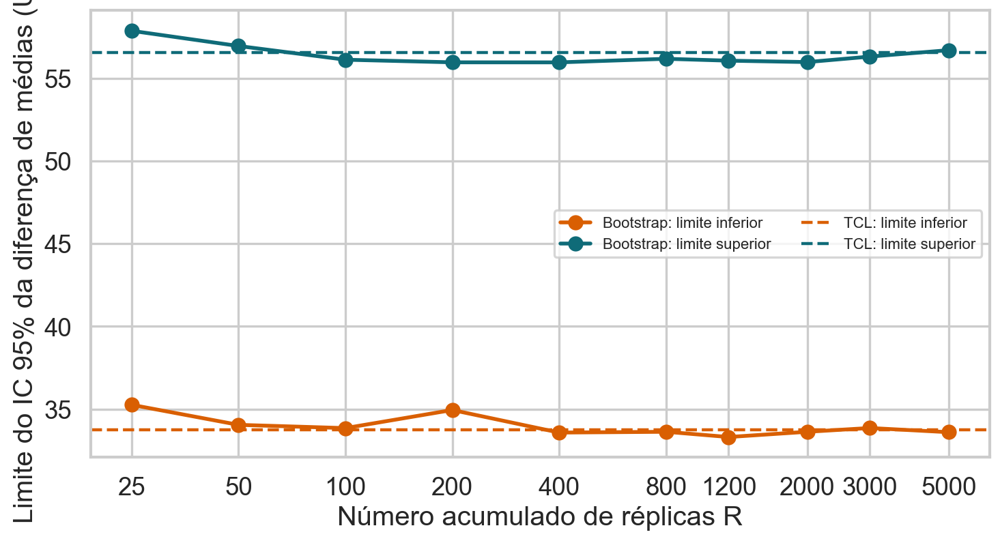

## A base

A base Airbnb NYC 2019 descreve anúncios disponíveis na cidade de Nova York. A
unidade de observação é um anúncio. Usaremos distrito, tipo de acomodação, preço
por noite e identificador do anfitrião.

```{python}
import kagglehub
import numpy as np
import pandas as pd
import seaborn as sns
import matplotlib.pyplot as plt

path = kagglehub.dataset_download(
    "dgomonov/new-york-city-airbnb-open-data"
)
airbnb = pd.read_csv(f"{path}/AB_NYC_2019.csv")
airbnb.shape
```

::: {.callout-note title="Interpretação"}
Antes de interpretar resultados, confirme o que cada linha representa, o período coberto e as colunas realmente disponíveis. Essa definição determina quais agregações e comparações são válidas.
:::


## Panorama descritivo

```{python}
airbnb[["price", "minimum_nights", "availability_365"]].describe()
```


```{python}
airbnb["neighbourhood_group"].value_counts()
```


```{python}
airbnb[["price", "neighbourhood_group", "room_type", "host_id"]].isna().sum()
```

::: {.callout-note title="Interpretação"}
Os resumos devem ser lidos em conjunto: preço e noites mínimas são assimétricos, os bairros têm tamanhos diferentes e valores ausentes podem alterar a população efetivamente analisada. Esses fatos orientam o filtro, a escolha da mediana e a forma de reamostrar.
:::


## Limpeza e população-alvo

Removemos preços zero e o 1% superior. A análise compara acomodações inteiras em
Manhattan e Brooklyn. Os filtros fazem parte da definição da população-alvo.

```{python}
limite = airbnb["price"].quantile(.99)

focus = airbnb[
    airbnb["price"].between(1, limite)
    & airbnb["room_type"].eq("Entire home/apt")
    & airbnb["neighbourhood_group"].isin(["Manhattan", "Brooklyn"])
].copy()

sample = focus.groupby("neighbourhood_group", group_keys=False).sample(
    n=600, random_state=1105
)
```

::: {.callout-note title="Interpretação"}
O bootstrap descreve incerteza condicionada à amostra observada. Sua validade depende de representatividade, independência adequada e escolha correta da unidade de reamostragem.
:::


## Estimativa observada

```{python}
prices = {
    borough: group["price"].to_numpy()
    for borough, group in sample.groupby("neighbourhood_group")
}

theta_hat = (
    np.median(prices["Manhattan"])
    - np.median(prices["Brooklyn"])
)
theta_hat
```

::: {.callout-note title="Interpretação"}
A diferença observada é o centro da análise, mas não informa sozinha sua precisão. O bootstrap aproxima essa incerteza reamostrando unidades comparáveis da amostra.
:::


## Réplicas bootstrap

Formalmente, substituímos a distribuição populacional desconhecida $F$ pela
distribuição empírica $\widehat F_n$, que atribui probabilidade $1/n$ a cada
observação. Cada amostra bootstrap é sorteada de $\widehat F_n$ com reposição e
tem o mesmo tamanho da amostra original.

```{python}
rng = np.random.default_rng(1105)
B = 5000
replicas = np.empty(B)

for b in range(B):
    manhattan_star = rng.choice(
        prices["Manhattan"], len(prices["Manhattan"]), replace=True
    )
    brooklyn_star = rng.choice(
        prices["Brooklyn"], len(prices["Brooklyn"]), replace=True
    )
    replicas[b] = np.median(manhattan_star) - np.median(brooklyn_star)
```

::: {.callout-note title="Interpretação"}
Cada réplica refaz a comparação como se a distribuição empírica fosse a população. A nuvem de diferenças não representa novos dados reais; ela aproxima a variabilidade da estatística provocada pelo processo amostral.
:::


## Erro padrão e intervalo percentil

```{python}
se_boot = replicas.std(ddof=1)
ci_percentil = np.quantile(replicas, [.025, .975])
se_boot, ci_percentil
```


O erro padrão descreve quanto a estatística varia entre réplicas. O intervalo
percentil usa diretamente os quantis 2,5% e 97,5%. Sua interpretação é sobre o
procedimento repetido: em condições adequadas, aproximadamente 95% dos
intervalos construídos cobririam o parâmetro-alvo.

```{python}
sns.histplot(replicas, bins=35)
plt.axvline(ci_percentil[0], color="tab:orange", linestyle="--")
plt.axvline(ci_percentil[1], color="tab:orange", linestyle="--")
plt.xlabel("Diferença de medianas (US$)")
plt.show()
```

::: {.callout-note title="Interpretação"}
O centro da distribuição bootstrap deve ficar próximo da diferença observada. Sua dispersão fornece o erro padrão, e os quantis delimitam uma faixa de valores compatíveis com a incerteza amostral sob as condições assumidas.
:::

## Diferença de médias: bootstrap versus TCL

Para comparar os métodos sobre a mesma estatística, agora usamos a diferença de médias

$$\widehat\Delta=\bar X_M-\bar X_B,$$

em que $\bar X_M$ e $\bar X_B$ são os preços médios observados em Manhattan e Brooklyn. Sob independência entre as unidades e amostras suficientemente grandes, o TCL fornece o erro padrão estimado

$$\widehat{SE}_{TCL}(\widehat\Delta)
=\sqrt{\frac{s_M^2}{n_M}+\frac{s_B^2}{n_B}},$$

onde $s_g^2$ e $n_g$ são a variância amostral e o tamanho do grupo $g$. O intervalo aproximado de 95% é $\widehat\Delta\pm1{,}96\widehat{SE}_{TCL}$.

No bootstrap, cada réplica calcula $\widehat\Delta_b^*=\bar X_{M,b}^*-\bar X_{B,b}^*$ e o intervalo percentil usa os quantis 2,5% e 97,5% das primeiras $B$ réplicas.

```{python}
#| eval: false
mean_hat = prices["Manhattan"].mean() - prices["Brooklyn"].mean()
se_tcl = np.sqrt(
    prices["Manhattan"].var(ddof=1) / len(prices["Manhattan"])
    + prices["Brooklyn"].var(ddof=1) / len(prices["Brooklyn"])
)
ci_tcl = np.array([mean_hat - 1.96*se_tcl,
                   mean_hat + 1.96*se_tcl])

B_max = 5000
mean_boot = (
    rng.choice(prices["Manhattan"], (B_max, len(prices["Manhattan"])),
               replace=True).mean(axis=1)
    - rng.choice(prices["Brooklyn"], (B_max, len(prices["Brooklyn"])),
                 replace=True).mean(axis=1)
)
checkpoints = np.array([25, 50, 100, 200, 400, 800,
                        1200, 2000, 3000, 5000])
ci_boot_B = np.array([
    np.quantile(mean_boot[:B], [.025, .975]) for B in checkpoints
])

plt.plot(checkpoints, ci_boot_B[:, 0], "o-", label="Bootstrap: inferior")
plt.plot(checkpoints, ci_boot_B[:, 1], "o-", label="Bootstrap: superior")
plt.axhline(ci_tcl[0], linestyle="--", label="TCL: inferior")
plt.axhline(ci_tcl[1], linestyle="--", label="TCL: superior")
plt.xscale("log")
plt.legend()
plt.show()
```

{fig-alt="Limites do intervalo bootstrap da diferença de médias conforme aumenta B, comparados aos limites do intervalo obtido pelo TCL."}

::: {.callout-note title="Interpretação"}
Com poucas réplicas, os quantis bootstrap oscilam por erro de Monte Carlo. À medida que $B$ cresce, os limites se estabilizam próximos aos limites do TCL. Essa proximidade decorre da aproximação Normal para a diferença de médias nesta amostra; aumentar $B$ apenas estabiliza o cálculo bootstrap e não garante igualdade entre os métodos.
:::


## Bootstrap por anfitrião

Se anúncios do mesmo anfitrião são dependentes, a unidade de reamostragem deve
ser o anfitrião. Em cada réplica, sorteamos `host_id` e carregamos todos os seus
anúncios.

```{python}
def cluster_sample(group, rng):
    hosts = group["host_id"].unique()
    chosen = rng.choice(hosts, len(hosts), replace=True)
    return pd.concat([
        group[group["host_id"].eq(host)] for host in chosen
    ], ignore_index=True)
```

::: {.callout-note title="Interpretação"}
Sortear anúncios individualmente trataria unidades do mesmo anfitrião como independentes. O bootstrap por conglomerados preserva essa dependência interna e faz a incerteza refletir melhor a unidade que efetivamente foi amostrada.
:::


## Quando o bootstrap é válido?

O bootstrap comum funciona melhor quando a amostra representa a população, as
observações são aproximadamente i.i.d. e a estatística muda de maneira regular
quando a distribuição é perturbada. Ele não corrige viés de seleção, não cria
eventos que não apareceram na amostra e pode falhar para máximos, caudas raras,
amostras pequenas ou dados dependentes.

Antes de reamostrar, verifique:

1. qual é a população-alvo;
2. qual é a unidade independente;
3. se o esquema de reamostragem imita a coleta;
4. se os limites são estáveis quando $B$ aumenta;
5. se conclusões mudam sob métodos de intervalo alternativos.

## Erros comuns

- confundir $B$, número de réplicas, com $n$, tamanho da amostra;
- sortear sem reposição;
- interpretar o intervalo como probabilidade posterior do parâmetro;
- reamostrar linhas quando a independência ocorre por anfitrião, escola ou dia;
- acreditar que milhares de réplicas compensam poucos dados ou coleta enviesada.

## Perguntas

1. Por que o bootstrap comum sorteia com reposição?
2. O que muda quando aumentamos $B$? E quando aumentamos $n$?
3. Por que reamostrar anúncios pode subestimar a incerteza?
4. Em quais situações o bootstrap percentil seria inadequado?

# Guia teórico consolidado

## O princípio do bootstrap

A distribuição empírica é

$$\widehat F_n(x)=\frac1n\sum_{i=1}^n\mathbb 1(X_i\leq x),$$

em que $X_i$ é a observação $i$, $x$ é um ponto da escala e $\mathbb 1(\cdot)$ é a função indicadora. Ela coloca massa $1/n$ em cada observação. O bootstrap trata essa distribuição como uma aproximação da população e gera amostras de tamanho $n$ com reposição. Para cada amostra calculamos

$$\widehat\theta^{*b}=T(X_1^{*b},\ldots,X_n^{*b}),\qquad b=1,\ldots,B.$$

$T$ é a função estatística escolhida; $X_i^{*b}$ é a observação $i$ da réplica $b$; $B$ é o número de réplicas; e o asterisco identifica quantidades geradas condicionalmente à amostra original. Se $\theta=T(F)$ é o parâmetro e $\widehat\theta=T(\widehat F_n)$ é a estimativa observada, o bootstrap usa a distribuição de $\widehat\theta^* - \widehat\theta$ para aproximar a distribuição de $\widehat\theta-\theta$.

Uma formulação assintótica da validade é

$$
\mathcal L\!\left(\sqrt n(\widehat\theta^*-\widehat\theta)\mid X_1,\ldots,X_n\right)
\Rightarrow
\mathcal L\!\left(\sqrt n(\widehat\theta-\theta)\right),
$$

Para qualquer variável aleatória genérica $Z$, $\mathcal L(Z)$ denota sua distribuição de probabilidade. Na expressão acima, o operador $\mathcal L$ é aplicado a duas variáveis aleatórias específicas: o erro bootstrap padronizado $\sqrt n(\widehat\theta^*-\widehat\theta)$ e o erro amostral padronizado $\sqrt n(\widehat\theta-\theta)$. A barra vertical indica condicionamento nos dados observados e $\Rightarrow$ significa convergência em distribuição.

A distribuição das réplicas aproxima, condicionalmente à amostra observada, a distribuição amostral do estimador. Seu desvio-padrão estima o erro padrão; quantis podem formar um intervalo percentil.

Para nível $1-\alpha$, o intervalo percentil é $[q_{\alpha/2},q_{1-\alpha/2}]$, em que $q_\gamma$ é o quantil de ordem $\gamma$ das réplicas. Para 95%, $\alpha=0{,}05$ e usamos os quantis 2,5% e 97,5%.

## Viés do estimador e viés estimado pelo bootstrap

O viés frequentista de um estimador é

$$\operatorname{Bias}(\widehat\theta)=E_F(\widehat\theta)-\theta,$$

em que $E_F$ é a esperança sob repetidas amostras da população $F$, $\theta=T(F)$ é o parâmetro e $\widehat\theta$ é o estimador. Não podemos calcular essa quantidade diretamente com uma única amostra porque $F$ e $\theta$ são desconhecidos.

No mundo bootstrap, substituímos $F$ por $\widehat F_n$ e estimamos

$$\widehat{\operatorname{Bias}}_{boot}
=E_*(\widehat\theta^*\mid X_1,\ldots,X_n)-\widehat\theta
\approx\overline{\theta^*}-\widehat\theta,$$

onde $E_*$ é a esperança sobre reamostragens condicionadas nos dados observados e $\overline{\theta^*}=B^{-1}\sum_{b=1}^B\widehat\theta^{*b}$ é a média das réplicas. Uma correção pontual simples seria

$$\widehat\theta_{corr}=\widehat\theta-\widehat{\operatorname{Bias}}_{boot}
=2\widehat\theta-\overline{\theta^*}.$$

Essa correção não deve ser aplicada automaticamente. A estimativa do viés também tem erro de Monte Carlo e erro amostral; em estimadores irregulares ou amostras pequenas, subtrair o viés estimado pode aumentar o MSE. Além disso, esse cálculo trata apenas do viés que a distribuição empírica consegue reproduzir.

É essencial distinguir:

- **viés do estimador:** deslocamento médio provocado pela regra estatística sob amostras repetidas;
- **viés bootstrap estimado:** aproximação desse deslocamento condicionada à amostra observada;
- **viés de seleção ou mensuração:** diferença causada por uma amostra não representativa ou dados medidos incorretamente, que o bootstrap comum geralmente replica em vez de corrigir.

### Exemplo numérico: corrigindo o estimador do máximo

Considere a amostra observada

$$x=(2,4)$$

e suponha que queremos estimar o maior valor da população com

$$\widehat\theta=\max(x_1,x_2)=4.$$

A distribuição empírica coloca probabilidade $1/2$ em 2 e $1/2$ em 4. Ao sortear duas observações com reposição, existem quatro amostras bootstrap ordenadas igualmente prováveis:

| amostra bootstrap $x^*$ | $\widehat\theta^*=\max(x^*)$ |
|---|---:|
| $(2,2)$ | 2 |
| $(2,4)$ | 4 |
| $(4,2)$ | 4 |
| $(4,4)$ | 4 |

Como todas têm probabilidade $1/4$, a esperança bootstrap do estimador é

$$
E_*(\widehat\theta^*)
=\overline{\theta^*}
=\frac{2+4+4+4}{4}
=3{,}5.
$$

Logo, o viés bootstrap estimado é

$$
\widehat{\operatorname{Bias}}_{boot}
=\overline{\theta^*}-\widehat\theta
=3{,}5-4
=-0{,}5.
$$

O sinal negativo indica que, no mundo bootstrap, o máximo tende a ficar abaixo do máximo observado. Aplicando a correção usual,

$$
\widehat\theta_{corr}
=\widehat\theta-\widehat{\operatorname{Bias}}_{boot}
=4-(-0{,}5)
=4{,}5.
$$

Equivalentemente,

$$
\widehat\theta_{corr}
=2\widehat\theta-\overline{\theta^*}
=2(4)-3{,}5
=4{,}5.
$$

```{python}
from itertools import product

x_simples = np.array([2, 4])
amostras_possiveis = np.array(list(product(x_simples, repeat=2)))
maximos_bootstrap = amostras_possiveis.max(axis=1)

theta_hat_simples = x_simples.max()
bias_simples = maximos_bootstrap.mean() - theta_hat_simples
theta_corrigido_simples = theta_hat_simples - bias_simples

pd.DataFrame({
    "amostra bootstrap": [tuple(v) for v in amostras_possiveis],
    "máximo": maximos_bootstrap,
}), pd.Series({
    "estimativa observada": theta_hat_simples,
    "média bootstrap": maximos_bootstrap.mean(),
    "viés bootstrap": bias_simples,
    "estimativa corrigida": theta_corrigido_simples,
})
```

::: {.callout-note title="O que o exemplo ensina"}
A correção desloca a estimativa na direção oposta ao viés estimado. Entretanto, o máximo é um estimador pouco regular e a amostra tem apenas duas observações: obter 4,5 não garante melhora em MSE nem revela valores da população que nunca apareceram na amostra. O exemplo serve para tornar a fórmula transparente, não para recomendar correção automática.
:::

```{python}
bias_boot = replicas.mean() - theta_hat
theta_corrigido = theta_hat - bias_boot
pd.Series({
    "estimativa observada": theta_hat,
    "viés bootstrap estimado": bias_boot,
    "estimativa corrigida": theta_corrigido,
})
```

Com a semente usada neste material, o resultado é:

| quantidade | valor (US$) |
|---|---:|
| estimativa observada | 40,00 |
| viés bootstrap estimado | −0,26 |
| estimativa corrigida | 40,26 |

::: {.callout-note title="Interpretação"}
Um centro bootstrap próximo de $\widehat\theta$ sugere pouco viés estimável para essa estatística e essa distribuição empírica. Isso não demonstra que a amostra Airbnb represente todos os anúncios, nem corrige dependência entre anúncios do mesmo anfitrião.
:::

## O percentil não é o único intervalo

Considere $B$ réplicas $\widehat\theta^{*1},\ldots,\widehat\theta^{*B}$. Denote por $q_\gamma^*$ o quantil de ordem $\gamma$ dessas réplicas, por $\widehat\theta$ a estimativa observada e por $z_\gamma=\Phi^{-1}(\gamma)$ o quantil de ordem $\gamma$ da Normal padrão. Os métodos abaixo usam a mesma reamostragem, mas transformam a distribuição bootstrap de formas diferentes.

### Intervalo percentil

O intervalo percentil de nível $1-\alpha$ é

$$IC_{perc}=\left[q_{\alpha/2}^*,\ q_{1-\alpha/2}^*\right].$$

Ele usa diretamente os quantis da distribuição de $\widehat\theta^*$.

**Vantagens:** é simples, respeita transformações monótonas e pode produzir limites assimétricos quando as réplicas são assimétricas. Sua interpretação computacional é direta.

**Desvantagens:** não corrige explicitamente o viés de $\widehat\theta$ e pode ter cobertura ruim quando a distribuição bootstrap está deslocada, a amostra é pequena ou o estimador é pouco regular.

### Intervalo básico

O intervalo básico reflete os quantis bootstrap em torno da estimativa observada:

$$IC_{bas}=\left[2\widehat\theta-q_{1-\alpha/2}^*,\ 2\widehat\theta-q_{\alpha/2}^*\right].$$

A motivação é aproximar a distribuição do erro $\widehat\theta-\theta$ pela distribuição de $\widehat\theta^*-\widehat\theta$ e inverter os limites para isolar $\theta$.

**Vantagens:** faz uma correção simples de deslocamento e está diretamente ligado à distribuição bootstrap do erro do estimador.

**Desvantagens:** não é invariante a transformações monótonas. Um intervalo calculado para $\log(\theta)$ e depois transformado de volta pode diferir daquele calculado diretamente para $\theta$. Também não corrige adequadamente assimetria complexa.

### Intervalo Normal com erro padrão bootstrap

O intervalo Normal é

$$IC_{N}=\left[\widehat\theta-z_{1-\alpha/2}\widehat{SE}_{boot},\ \widehat\theta+z_{1-\alpha/2}\widehat{SE}_{boot}\right],$$

com


$$\widehat{SE}_{boot}=\sqrt{\frac{1}{B-1}\sum_{b=1}^B\left(\widehat\theta^{*b}-\overline{\theta^*}\right)^2},$$

onde $\overline{\theta^*}=B^{-1}\sum_b\widehat\theta^{*b}$ é a média das réplicas.

**Vantagens:** é familiar, fácil de comunicar e costuma funcionar bem quando a distribuição do estimador é aproximadamente Normal, simétrica e com viés pequeno. Para médias em amostras grandes, aproxima-se naturalmente do intervalo derivado pelo TCL.

**Desvantagens:** força simetria ao redor de $\widehat\theta$, mesmo quando a distribuição bootstrap é assimétrica. Pode gerar limites impossíveis para parâmetros restritos, como probabilidades próximas de zero ou um.

### Intervalo BCa

BCa significa *bias-corrected and accelerated*, ou **corrigido por viés e aceleração**. Ele continua usando quantis bootstrap, mas substitui $\alpha/2$ e $1-\alpha/2$ por probabilidades ajustadas:

$$
\alpha_j^{BCa}=\Phi\!\left[z_0+
\frac{z_0+z_{\alpha_j}}{1-a(z_0+z_{\alpha_j})}\right],
\qquad \alpha_1=\alpha/2,\quad \alpha_2=1-\alpha/2,
$$

e constrói

$$IC_{BCa}=\left[q_{\alpha_1^{BCa}}^*,\ q_{\alpha_2^{BCa}}^*\right].$$

Na fórmula, $\Phi$ é a CDF da Normal padrão; $z_0$ é a correção de viés, estimada pela posição de $\widehat\theta$ entre as réplicas; e $a$ é a aceleração, que mede como o erro padrão muda com o parâmetro. Uma estimativa usual de $z_0$ é

$$z_0=\Phi^{-1}\!\left(\frac{\#\{\widehat\theta^{*b}<\widehat\theta\}}{B}\right).$$

A aceleração é normalmente calculada por *jackknife*: removemos uma observação por vez, calculamos $\widehat\theta_{(-i)}$ e usamos

$$
a=\frac{\sum_{i=1}^n(\overline\theta_{(-\cdot)}-\widehat\theta_{(-i)})^3}
{6\left[\sum_{i=1}^n(\overline\theta_{(-\cdot)}-\widehat\theta_{(-i)})^2\right]^{3/2}},
$$

onde $\widehat\theta_{(-i)}$ é a estimativa sem a observação $i$ e $\overline\theta_{(-\cdot)}=n^{-1}\sum_i\widehat\theta_{(-i)}$ é a média das estimativas *jackknife*.

**Vantagens:** corrige deslocamento e assimetria, é invariante a transformações monótonas e costuma apresentar melhor precisão de cobertura em problemas regulares.

**Desvantagens:** é mais custoso e menos transparente, pois exige bootstrap e *jackknife*. Pode ser instável em amostras pequenas, com estatísticas não suaves, parâmetros na fronteira ou observações extremamente influentes. “Mais sofisticado” não compensa uma amostra não representativa ou uma unidade de reamostragem incorreta.

| Método | Melhor cenário | Principal limitação |
|---|---|---|
| Percentil | distribuição bootstrap com pouco viés | não corrige deslocamento |
| Básico | erro bootstrap aproximadamente bem representado | não é invariante a transformações |
| Normal | estimador aproximadamente Normal e simétrico | ignora assimetria e restrições do parâmetro |
| BCa | problema regular com viés ou assimetria moderados | maior custo e possível instabilidade |

::: {.callout-note title="Como escolher"}
Não existe um intervalo universalmente melhor. Compare métodos, examine a distribuição bootstrap e verifique cobertura por simulação quando possível. Discordâncias relevantes são diagnóstico de viés, assimetria, pouca informação ou falta de regularidade — não um convite para escolher apenas o intervalo que produz a conclusão desejada.
:::

## O que torna a aproximação válida

O bootstrap costuma funcionar quando a amostra representa a população, a unidade reamostrada corresponde à unidade independente e a estatística varia de maneira suficientemente regular. Ele pode falhar em amostras pequenas, extremos, parâmetros na fronteira, caudas não observadas, forte dependência ou seleção enviesada.

Reposição é indispensável: sem ela, toda réplica seria apenas uma reordenação da mesma amostra. Mais réplicas reduzem erro de Monte Carlo, mas não criam informação nem compensam poucos dados.

## Unidade de reamostragem

Anúncios do mesmo anfitrião podem ser dependentes. Reamostrar anúncios individualmente pressupõe independência entre anúncios; reamostrar anfitriões preserva a dependência interna. Séries temporais podem exigir blocos; amostras estratificadas podem exigir reamostragem dentro dos estratos.

O método de intervalo não corrige uma unidade de reamostragem inadequada. Percentil, básico, Normal e BCa podem discordar, especialmente quando a distribuição bootstrap é assimétrica ou enviesada.

# Questões de revisão da Aula 12

1. Por que uma réplica bootstrap de tamanho $n$ é sorteada com reposição?
2. Se anúncios do mesmo anfitrião são dependentes, qual deve ser a unidade de reamostragem?

<details><summary>Respostas comentadas</summary>

1. Com reposição, algumas observações se repetem e outras ficam ausentes, fazendo a estatística variar. Sem reposição, teríamos apenas uma reordenação da amostra.
2. O anfitrião deve ser reamostrado como conglomerado, carregando seus anúncios. Aumentar $B$ não corrige dependência ignorada.
</details>
