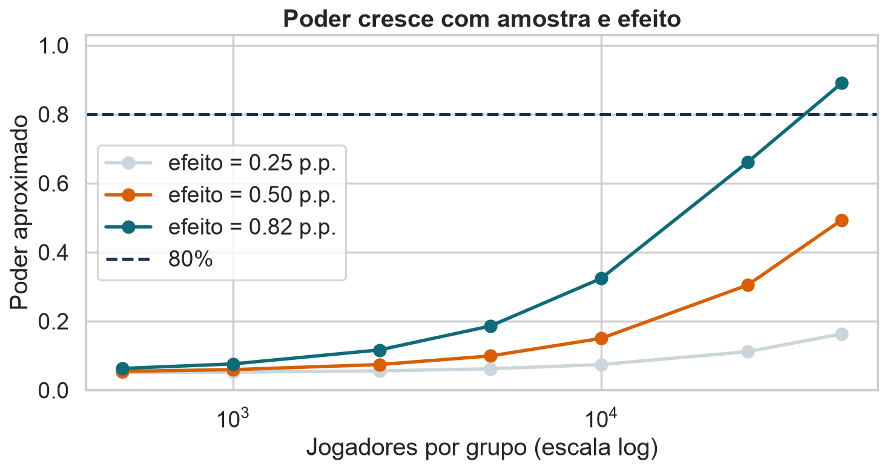
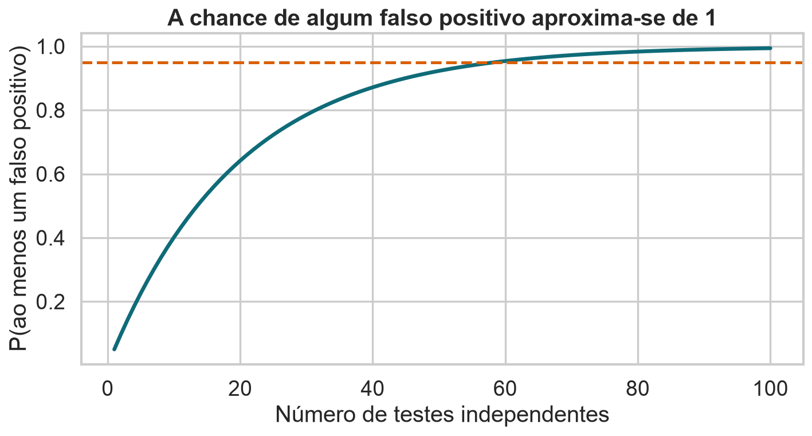

# Objetivos

Este notebook usa um experimento A/B em um jogo móvel para conectar quatro ideias:

1. permutação como construção natural da hipótese nula;
2. bootstrap recentralizado como outra forma de simular $H_0$;
3. bootstrap usual como construção natural da incerteza sob $H_A$;
4. poder e múltiplos testes como problemas de planejamento.

# 1. Download da base

```{python}
import kagglehub
from pathlib import Path
import matplotlib.pyplot as plt
import numpy as np
import pandas as pd
import seaborn as sns
from scipy.stats import norm
from statsmodels.stats.multitest import multipletests

path = kagglehub.dataset_download("matinmahmoudi/rounds-and-retention")
csv_path = next(Path(path).rglob("*.csv"))
df = pd.read_csv(csv_path)
df.head()
```

# 2. O que é a base?

Cada linha representa um jogador. A intervenção move a primeira porta que
interrompe o avanço do nível 30 para o nível 40. Os jogadores foram atribuídos
aleatoriamente às versões durante o experimento.

```{python}
print(df.shape)
print(df.isna().sum())
print("IDs duplicados:", df["userid"].duplicated().sum())
df.groupby("version").agg(
    jogadores=("userid", "size"),
    rodadas_média=("sum_gamerounds", "mean"),
    rodadas_mediana=("sum_gamerounds", "median"),
    retenção_1=("retention_1", "mean"),
    retenção_7=("retention_7", "mean"),
)
```

# 3. Análise descritiva

```{python}
fig, axes = plt.subplots(1, 2, figsize=(11, 4))
df["version"].value_counts().plot.bar(ax=axes[0])
df.groupby("version")[["retention_1", "retention_7"]].mean().T.plot.bar(ax=axes[1])
axes[0].set_title("Tamanho dos grupos")
axes[1].set_title("Retenção observada")
plt.show()
```

{fig-alt="Retenção observada em 1 e 7 dias nos dois grupos."}

```{python}
df["sum_gamerounds"].describe(percentiles=[.50, .90, .95, .99, .999])
```

Existe um valor extremo de 49.854 rodadas. Não o remova silenciosamente: a
decisão sobre exclusões deve ser anterior ao teste e acompanhada por análise de
sensibilidade.

# 4. Métrica primária e efeito

Usaremos retenção em 7 dias como métrica primária:

$$
\Delta=p_{30}-p_{40}
$$

```{python}
y30 = df.loc[df.version.eq("gate_30"), "retention_7"].astype(float).to_numpy()
y40 = df.loc[df.version.eq("gate_40"), "retention_7"].astype(float).to_numpy()
observed = y30.mean() - y40.mean()
print(f"Diferença observada: {observed:.4%}")
```

# 5. $H_0$ por permutação

Sob $H_0$, os rótulos são trocáveis. O código transparente abaixo é adequado
para uma amostra didática; depois usamos um atalho eficiente para a base completa.

```{python}
rng = np.random.default_rng(1414)
y = np.r_[y30, y40]
group = np.array(["gate_30"]*len(y30) + ["gate_40"]*len(y40))

def statistic(values, labels):
    return values[labels == "gate_30"].mean() - values[labels == "gate_40"].mean()

small_index = rng.choice(len(y), 10000, replace=False)
y_small, g_small = y[small_index], group[small_index]
observed_small = statistic(y_small, g_small)
null_small = np.array([
    statistic(y_small, rng.permutation(g_small))
    for _ in range(3000)
])
```

Para uma resposta binária, o número de sucessos que cai no primeiro grupo segue
uma distribuição hipergeométrica quando condicionamos o total de sucessos.

```{python}
n30, n40 = len(y30), len(y40)
success = int(y30.sum() + y40.sum())
B = 100_000
s30 = rng.hypergeometric(success, n30+n40-success, n30, size=B)
null_perm = s30/n30 - (success-s30)/n40
p_perm = (1 + np.sum(np.abs(null_perm) >= abs(observed))) / (B+1)
print(f"p-valor por permutação: {p_perm:.5f}")
```

# 6. $H_A$ por bootstrap

O bootstrap usual reamostra separadamente em cada grupo. Ele preserva o efeito
observado e, portanto, é uma construção natural para estudar efeitos plausíveis.

```{python}
boot30 = rng.binomial(n30, y30.mean(), size=B) / n30
boot40 = rng.binomial(n40, y40.mean(), size=B) / n40
boot_alt = boot30 - boot40
ci = np.quantile(boot_alt, [.025, .975])
print(f"IC bootstrap 95%: [{ci[0]:.4%}, {ci[1]:.4%}]")
```

# 7. $H_0$ também pode ser feita por bootstrap

Bootstrap não é exclusivo de $H_A$. Para simular $H_0$, precisamos retirar a
diferença observada antes de reamostrar.

Para dados contínuos, uma recentralização típica é:

```{python}
def recenter(a, b):
    pooled_mean = np.r_[a, b].mean()
    return a-a.mean()+pooled_mean, b-b.mean()+pooled_mean

r30, r40 = recenter(y30, y40)
print(r30.mean()-r40.mean())
```

Como retenção é Bernoulli, a forma mais simples é gerar ambos os grupos usando a
proporção combinada sob a nula:

```{python}
pooled = (y30.sum()+y40.sum())/(n30+n40)
null30 = rng.binomial(n30, pooled, size=B)/n30
null40 = rng.binomial(n40, pooled, size=B)/n40
null_boot = null30-null40
p_boot_null = (1 + np.sum(np.abs(null_boot) >= abs(observed))) / (B+1)
print(f"p-valor bootstrap sob H0: {p_boot_null:.5f}")
```

# 8. Compare os três mundos

```{python}
fig, axes = plt.subplots(1, 3, figsize=(13, 4), sharex=True, sharey=True)
for ax, values, title in zip(
    axes,
    [null_perm, null_boot, boot_alt],
    ["Permutação: H0", "Bootstrap recentrado: H0", "Bootstrap usual: HA"],
):
    sns.histplot(values, bins=40, ax=ax)
    ax.axvline(observed, color="darkorange", linewidth=2)
    ax.set_title(title)
plt.show()
```

Explique por que as duas primeiras distribuições são centradas em zero e a
terceira é centrada em $\widehat\Delta$.

{fig-alt="Comparação entre permutação sob H0, bootstrap recentralizado sob H0 e bootstrap sob HA."}

# 9. Poder sob uma alternativa específica

```{python}
def simulated_power(p0, effect, n_each, reps=5000, alpha=.05, seed=1414):
    local_rng = np.random.default_rng(seed+n_each)
    a = local_rng.binomial(n_each, p0+effect, size=reps)/n_each
    b = local_rng.binomial(n_each, p0, size=reps)/n_each
    se0 = np.sqrt(2*p0*(1-p0)/n_each)
    reject = np.abs(a-b) > norm.ppf(1-alpha/2)*se0
    return reject.mean()

effects = [.0025, .005, observed]
sizes = [500, 1000, 2500, 5000, 10000, 25000, 45000]
power_table = pd.DataFrame({
    f"efeito={100*e:.2f} p.p.": [simulated_power(y40.mean(), e, n) for n in sizes]
    for e in effects
}, index=sizes)
power_table
```

```{python}
power_table.plot(marker="o")
plt.axhline(.80, color="darkorange", linestyle="--")
plt.xscale("log")
plt.xlabel("Jogadores por grupo")
plt.ylabel("Poder")
plt.show()
```

{fig-alt="Poder em função do tamanho amostral e do efeito verdadeiro."}

# 10. Muitos testes sob uma nula global

```{python}
m = 100
p_values_null = rng.uniform(size=m)
print("Valores-p abaixo de 0,05:", (p_values_null < .05).sum())
print("FWER teórica:", 1-(1-.05)**m)
```

{fig-alt="Probabilidade de ao menos um falso positivo conforme aumenta o número de testes."}

# 11. Bonferroni, Holm e BH

```{python}
p_values = np.array([.0004, .001, .004, .009, .015, .03, .08, .20, .50, .90])

for method in ["bonferroni", "holm", "fdr_bh"]:
    reject, adjusted, _, _ = multipletests(p_values, alpha=.05, method=method)
    print(method)
    print(pd.DataFrame({"p": p_values, "p_ajustado": adjusted, "rejeitar": reject}))
```

Bonferroni e Holm controlam a chance de qualquer falso positivo na família. BH
controla a proporção esperada de falsos entre as descobertas. Escolha o método
com base no objetivo, não no número de rejeições que ele produz.

# 12. As três métricas de Cookie Cats

Construa uma família com retenção em 1 dia, retenção em 7 dias e uma estatística
robusta para rodadas. Aplique permutação a cada métrica e ajuste os valores-p.

```{python}
metrics = ["retention_1", "retention_7"]
results = []
for metric in metrics:
    a = df.loc[df.version.eq("gate_30"), metric].astype(float).to_numpy()
    b = df.loc[df.version.eq("gate_40"), metric].astype(float).to_numpy()
    obs = a.mean()-b.mean()
    pooled_success = int(a.sum()+b.sum())
    sa = rng.hypergeometric(pooled_success, len(a)+len(b)-pooled_success,
                            len(a), size=50_000)
    null = sa/len(a)-(pooled_success-sa)/len(b)
    p = (1+np.sum(np.abs(null)>=abs(obs)))/(len(null)+1)
    results.append((metric, obs, p))

result = pd.DataFrame(results, columns=["métrica", "efeito", "p"])
result["p_bonferroni"] = multipletests(result.p, method="bonferroni")[1]
result["p_bh"] = multipletests(result.p, method="fdr_bh")[1]
result
```

# 13. Exercícios

1. Compare os p-valores obtidos por permutação e bootstrap recentralizado.
2. Calcule poder para efeitos de 0,25, 0,50 e 1,00 p.p.
3. Encontre o tamanho amostral aproximado para 80% de poder em 0,50 p.p.
4. Simule famílias com 10, 50, 100 e 500 hipóteses nulas.
5. Compare Bonferroni, Holm e BH quando há 5 efeitos reais entre 100 testes.
6. Mostre por simulação o *winner's curse* ao reter apenas testes significativos.
7. Discuta qual métrica deveria ser primária e quais seriam métricas de proteção.

# Fonte e limitações

Base Cookie Cats, versão `matinmahmoudi/rounds-and-retention` no Kaggle, licença
Apache 2.0. O conjunto é uma republicação educacional e não traz todos os detalhes
operacionais do experimento original. As conclusões devem ser tratadas como um
estudo de caso didático, não como recomendação atual para o produto.
