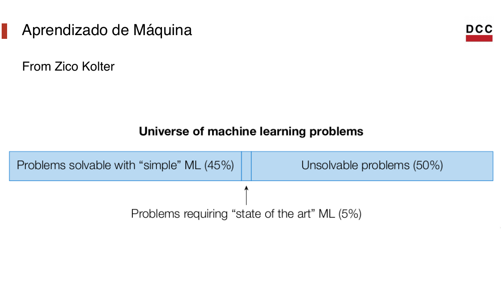
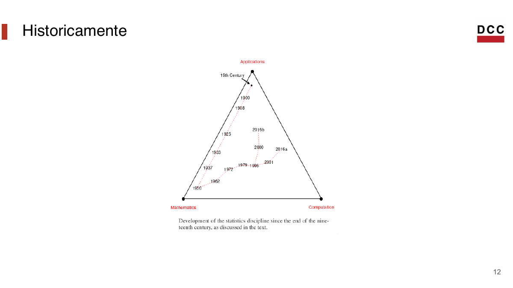
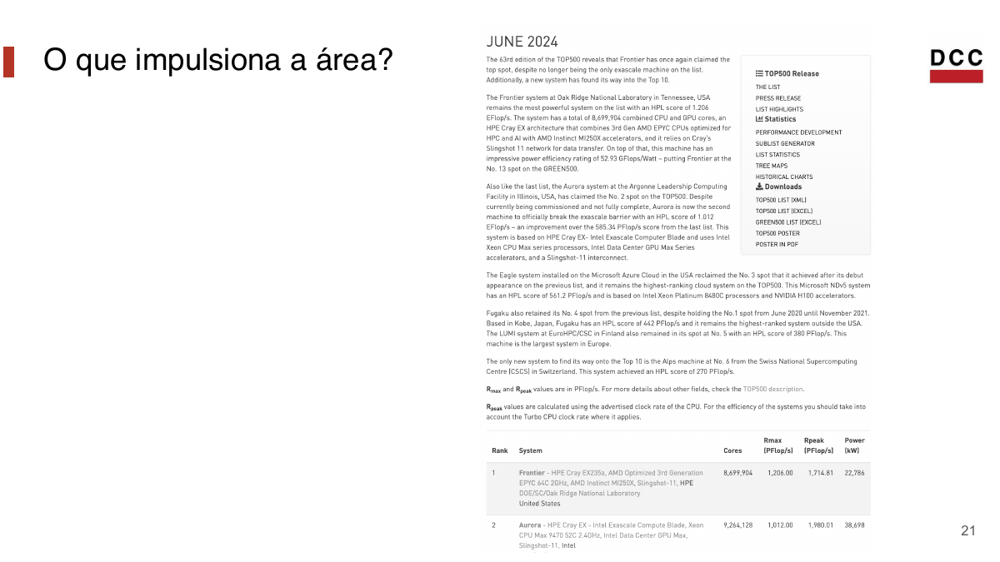
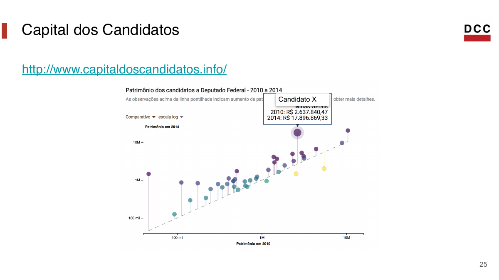
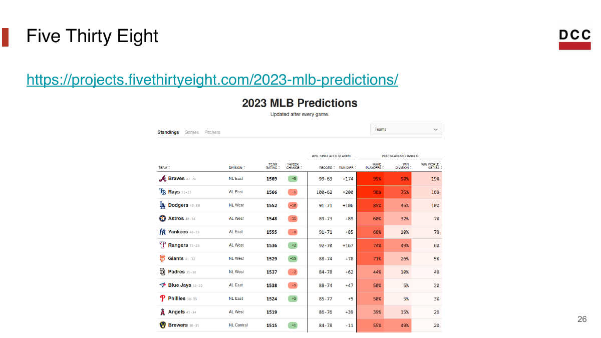
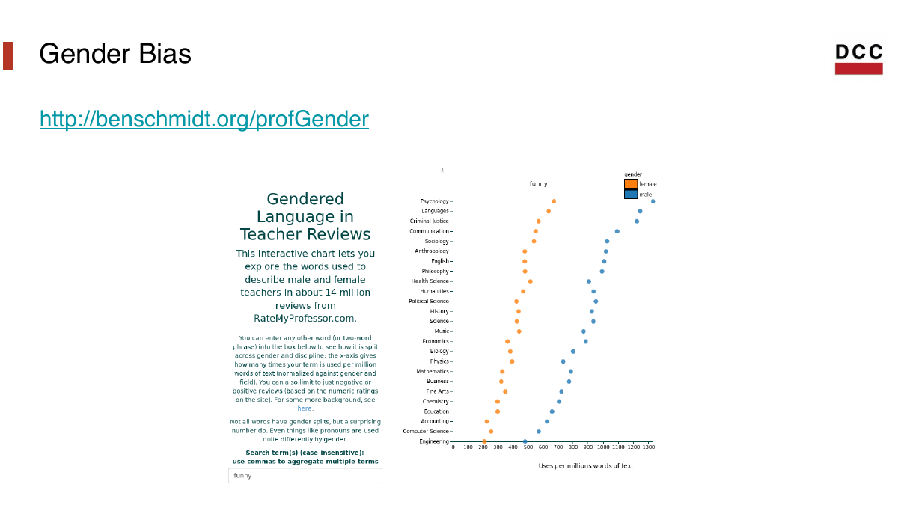
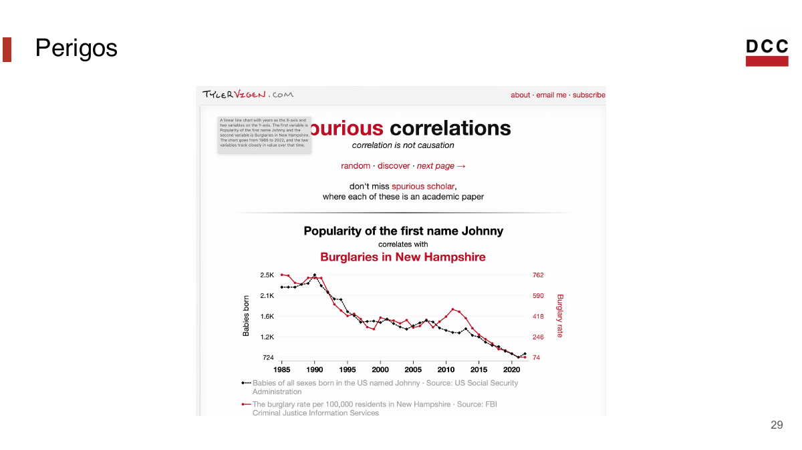

## Introdução

Introdução à Ciência de Dados

::: {.muted}
Material em reconstrução: mesma estrutura pedagógica, exemplos atualizados e
notebooks documentados para estudo.
:::

## Professor

- Heitor Ramos
  - Professor do DCC/UFMG
  - <http://dcc.ufmg.br/~heitor>
  - <heitor@dcc.ufmg.br>

## Dúvidas?

- Sala de aula
- Fórum do Moodle
- Monitoria

::: {.callout-note}
Procure ajuda cedo. Em ciência de dados, pequenos bloqueios acumulam rápido.
:::

## Nosso curso

::: {.columns}
::: {.column width="50%"}
**Aulas teóricas**

- conceitos;
- intuição estatística;
- solução de problemas;
- discussão de exemplos.
:::

::: {.column width="50%"}
**Aulas práticas**

- programação;
- notebooks;
- exercícios no computador;
- VPLs no Moodle.
:::
:::

## Hoje

- O que é ciência de dados?
- O que a área usa, mas não é?
- Exemplos modernos
- Objetivos do curso
- Logística

## Ciência de Dados

::: {.statement}
Aplicação de computação e estatística para entender fenômenos do mundo real.
:::

## Ciência de Dados

::: {.statement}
Transformar perguntas em evidência usando dados, computação, estatística e
conhecimento de contexto.
:::

::: {.muted}
Essa será a definição operacional do curso.
:::

## Probabilidade

Ciência de dados **não é** probabilidade.

::: {.fragment}
Mas usa probabilidade para lidar com acaso, incerteza e variabilidade.
:::

## Álgebra Linear

Ciência de dados **não é** álgebra linear.

::: {.fragment}
Mas usa álgebra linear em vetores, matrizes, modelos e representações de dados.
:::

## Aprendizado de Máquina

Ciência de dados **não é** aprendizado de máquina.

::: {.fragment}
Mas usa aprendizado de máquina para previsão, classificação e descoberta de
padrões.
:::

## Estatística vs. Ciência de Dados

A diferença foi surgindo ao longo dos anos.

- Grandes massas de dados aproximaram estatística e computação.
- O pensamento computacional virou parte central do trabalho.
- A pergunta estatística continua importante: o que os dados permitem concluir?

## Aprendizado de Máquina

{fig-align="center" width="88%"}

## Historicamente

{fig-align="center" width="88%"}

## Historicamente

```{mermaid}
timeline
  title Ciência de dados como encontro de áreas
  Estatística : variabilidade
  Computação : escala e automação
  Bancos de dados : organização
  Aprendizado de máquina : previsão
  Comunicação : impacto
```

## Receita

1. Boa computação
2. Boa estatística
3. Entendimento e uso de aprendizado de máquina
4. Entendimento de probabilidade
5. Entendimento de álgebra linear

::: {.fragment}
E, acima de tudo: **ótimas perguntas**.
:::

## Principal: ótimas perguntas!

::: {.statement}
Uma pergunta boa organiza dados, métodos, visualizações e conclusões.
:::

## Qual o motivo deste curso existir?

::: {.statement}
Ensinar uma base de estatística com ponto de vista prático e computacional.
:::

## O que impulsiona a área?

{fig-align="center" width="88%"}

## O que impulsiona a área?

{fig-align="center" width="88%"}

## O que impulsiona a área?

{fig-align="center" width="88%"}

## O que impulsiona a área?

{fig-align="center" width="88%"}

## O que impulsiona a área?

{fig-align="center" width="88%"}

## O que impulsiona a área?

{fig-align="center" width="88%"}

## O que impulsiona a área?

::: {.icd-grid}
::: {.icd-card}
**Dados**

Mais registros digitais.
:::

::: {.icd-card}
**Computação**

Mais capacidade de processar.
:::

::: {.icd-card}
**Problemas**

Mais decisões mediadas por dados.
:::
:::

## O que impulsiona a área?

::: {.bar-chart .wide-bars}
::: {.bar-row}
<span>Coleta de dados</span><div class="bar"><div style="width: 95%"></div></div><strong>cresce</strong>
:::
::: {.bar-row}
<span>Ferramentas computacionais</span><div class="bar orange"><div style="width: 88%"></div></div><strong>melhoram</strong>
:::
::: {.bar-row}
<span>Demanda por decisão</span><div class="bar green"><div style="width: 82%"></div></div><strong>aumenta</strong>
:::
:::

::: {.muted}
Figura conceitual: o objetivo é discutir forças que tornaram a área importante.
:::

## Exemplos

Vamos priorizar exemplos que tenham:

- pergunta clara;
- dados tabulares;
- visualização útil;
- limite interpretativo explícito;
- conexão com exercícios.

## Capital dos Candidatos

{fig-align="center" width="88%"}

## Five Thirty Eight

{fig-align="center" width="88%"}

## Gender Bias

{fig-align="center" width="88%"}

## Salários

{fig-align="center" width="88%"}

## Exemplo: acesso a serviços

::: {.statement}
O acesso a equipamentos públicos varia entre regiões?
:::

Esse exemplo aparece no notebook da Aula 01.

## Visualização inicial

::: {.bar-chart}
::: {.bar-row}
<span>Centro-Sul</span><div class="bar"><div style="width: 100%"></div></div><strong>4,9</strong>
:::
::: {.bar-row}
<span>Pampulha</span><div class="bar"><div style="width: 86%"></div></div><strong>4,2</strong>
:::
::: {.bar-row}
<span>Norte</span><div class="bar"><div style="width: 60%"></div></div><strong>2,9</strong>
:::
::: {.bar-row}
<span>Barreiro</span><div class="bar"><div style="width: 59%"></div></div><strong>2,9</strong>
:::
::: {.bar-row}
<span>Venda Nova</span><div class="bar"><div style="width: 58%"></div></div><strong>2,8</strong>
:::
:::

Equipamentos por 10 mil habitantes.

## Exemplo: experimento A/B

::: {.statement}
Um lembrete no Moodle aumenta entregas no prazo?
:::

Será usado na Aula 02 para discutir tratamento, controle e comparação.

## Exemplo: John Snow

::: {.statement}
Receber água de uma fonte contaminada aumentava o risco de morrer por cólera?
:::

Será usado na Aula 02 para discutir estudos observacionais e confundimento.

## Perigos

{fig-align="center" width="88%"}

## Perigos

- Dados podem carregar vieses.
- Visualizações podem sugerir conclusões exageradas.
- Correlação não implica causalidade.
- Modelos podem parecer mais confiáveis do que são.

::: {.callout-warning}
O curso vai insistir na diferença entre resultado computacional e conclusão
defensável.
:::

## Plano de Curso

## Ementa

::: {.columns}
::: {.column width="50%"}
**Exploração de Dados**

- tabelas;
- pandas;
- tipos de dados;
- visualização;
- estatística básica.
:::

::: {.column width="50%"}
**Regressão e ML**

- regressão linear;
- mínimos quadrados;
- viés e variância;
- classificação;
- avaliação de modelos.
:::
:::

## Ementa

::: {.columns}
::: {.column width="50%"}
**Testes de Hipóteses**

- teorema central do limite;
- valores-p;
- intervalos de confiança;
- simulação;
- testes de permutação.
:::

::: {.column width="50%"}
**Aprendizado de Máquina**

- regressão logística;
- KNN;
- treino, validação e teste;
- regularização.
:::
:::

## Material e livros

- Um notebook Jupyter por aula.
- Slides em Quarto, publicados no hotsite.
- Listas e VPLs no Moodle.
- Livros abertos sempre que possível.

## Bibliografia

1. Learning Data Science
2. OpenIntro Modern Statistics
3. Computational and Inferential Thinking
4. Data Science from Scratch
5. Fundamentos Estatísticos para Ciência da Computação
6. An Introduction to Statistical Learning

## Formato

Tudo no site:

<https://heitorramos.github.io/icd/>

- Quizzes: Moodle
- Listas: Moodle
- Projeto: entregas parciais e apresentação final

## Cada aula

- Aula presencial de 100 minutos.
- Um notebook documentado por aula.
- Uma lista aproximadamente a cada duas aulas.
- Um quiz curto por aula ou módulo.

## Bem-estar

Cursos de universidade podem gerar um ambiente estressante.

- Não sacrifique bem-estar pelo curso.
- Comece tarefas cedo.
- Avise problemas o quanto antes.
- Use monitoria, fórum e atendimento.

## Projeto

- Equipes de aproximadamente 4 estudantes.
- Tema definido com antecedência.
- Entregas parciais.
- Entrevistas/checkpoints obrigatórios.
- Produto final com notebook, comunicação e vídeo curto.

## Próxima aula

::: {.statement}
Causalidade: quando podemos dizer que X mudou Y?
:::

Experimentos, estudos observacionais, confundimento e John Snow.
