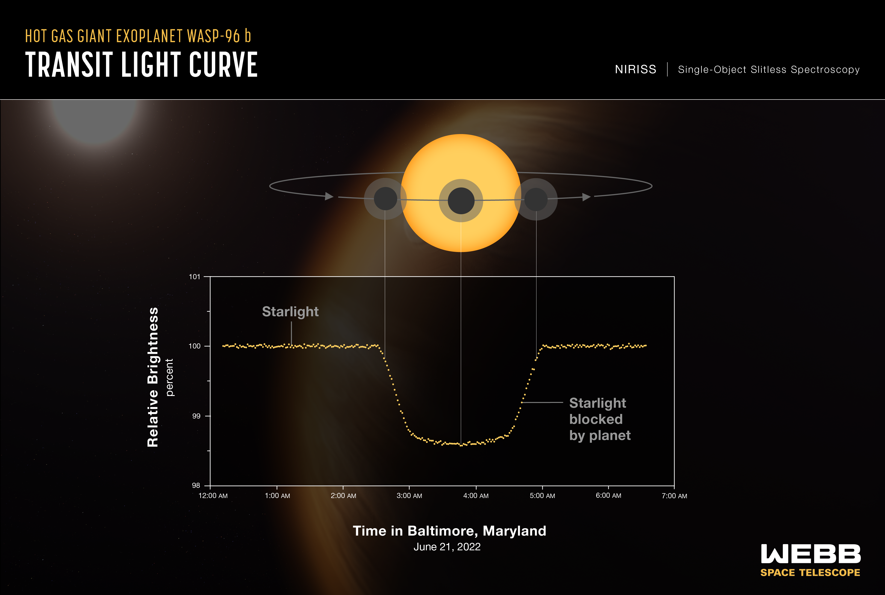
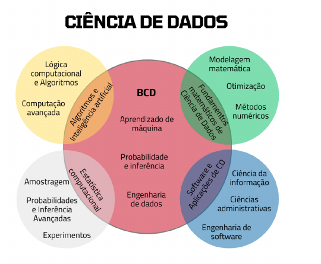
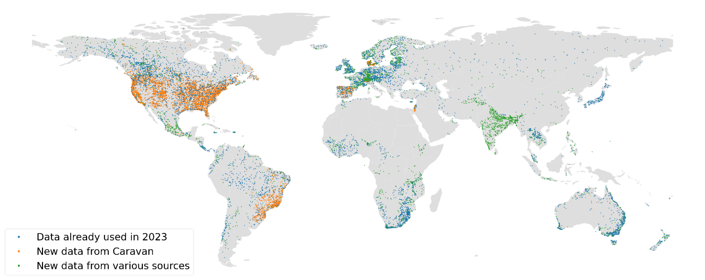
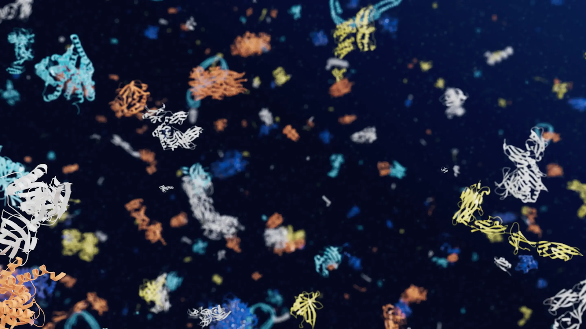
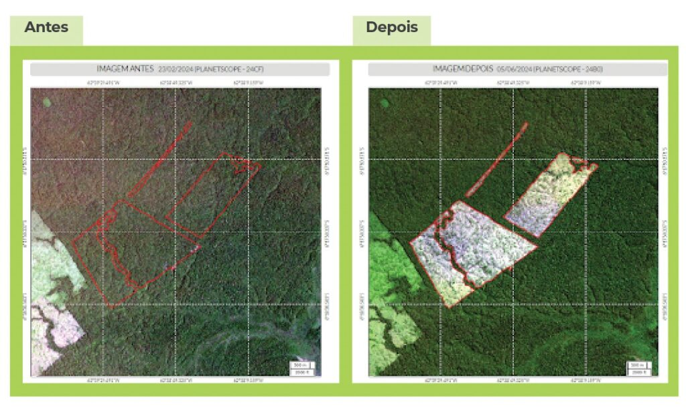

## Há um planeta escondido nestes dados?

::: notes
Antes de explicar a figura, peça à turma que procure algo incomum nos dados.
Fonte: NASA, ESA, CSA e STScI, curva de luz do WASP-96 b.
https://science.nasa.gov/asset/webb/exoplanet-wasp-96-b-niriss-transit-light-curve/
:::

## O sinal é uma queda de apenas 1,5%

Durante algumas horas, a estrela parece ficar um pouco menos brilhante.

::: {.statement}
Um planeta passou entre o telescópio e a estrela.
:::

Não vimos o planeta diretamente. Vimos o efeito que ele produziu nos dados.

::: notes
A observação contém 280 medições. A diferença entre os pontos mais claros e
mais escuros é inferior a 1,5%. Fonte: NASA, ESA, CSA e STScI.
https://science.nasa.gov/asset/webb/exoplanet-wasp-96-b-niriss-transit-light-curve/
:::

## O planeta está a 1.150 anos-luz

O WASP-96 b não aparece como uma fotografia com contornos bem definidos.

Ele é conhecido por meio de **medições**, **padrões** e **comparações**.

::: {.statement}
Ciência de dados amplia aquilo que conseguimos enxergar.
:::

::: notes
WASP-96 b é um gigante gasoso que orbita uma estrela semelhante ao Sol, a
aproximadamente 1.150 anos-luz. Fonte: NASA.
https://science.nasa.gov/asset/webb/exoplanet-wasp-96-b-niriss-transit-light-curve/
:::

## Este curso começa com perguntas

Não começaremos escolhendo uma ferramenta.

::: {.statement}
O que queremos descobrir, prever ou decidir?
:::

## Ciência de dados está por toda parte

- Na ciência, ajuda a enxergar mundos distantes.
- Em emergências, ajuda a antecipar riscos.
- Na saúde, ajuda a compreender moléculas.
- No ambiente, ajuda a observar mudanças no planeta.
- No cotidiano, ajuda a escolher o que aparece na sua tela.

## Um curso sobre evidência

::: {.statement}
Ciência de dados é a prática de transformar perguntas em evidência usando
dados, computação, estatística e conhecimento de contexto.
:::

Nenhuma dessas partes funciona bem isoladamente.

## Uma área construída em encontros

::: notes
Figura preservada do slide 05 do material original. Use-a para destacar que
ciência de dados ocupa uma interseção: computação, estatística, conhecimento de
domínio, comunicação e responsabilidade.
:::

## A análise de dados veio antes do nome

Em 1962, John Tukey defendeu que **análise de dados** deveria ser reconhecida
como uma atividade científica própria: observar dados, formular hipóteses e
criar novas formas de investigação.

::: notes
Fonte: John Tukey, “The Future of Data Analysis”, 1962.
https://projecteuclid.org/journals/annals-of-mathematical-statistics/volume-33/issue-1/The-Future-of-Data-Analysis/10.1214/aoms/1177704711.full
:::

## O termo ganhou significado aos poucos

- **1974:** Peter Naur descreve “data science” como o estudo dos dados e de seus
  processos.
- **2001:** William Cleveland propõe ampliar a estatística com computação,
  visualização e trabalho aplicado.
- **2012:** a *Harvard Business Review* ajuda a popularizar a expressão
  “cientista de dados”.

::: notes
Fontes: Peter Naur, Concise Survey of Computer Methods, 1974;
William Cleveland, “Data Science: An Action Plan”, 2001; Thomas Davenport e
D. J. Patil, Harvard Business Review, 2012.
https://www.naur.com/Conc.Surv.html
https://doi.org/10.1111/j.1751-5823.2001.tb00477.x
https://hbr.org/2012/10/data-scientist-the-sexiest-job-of-the-21st-century
:::

## Três forças aceleraram a área

::: {.icd-grid}
::: {.icd-card}
**Mais dados**

Internet, redes sociais, sensores e serviços digitais passaram a registrar
atividades em enorme escala.
:::
::: {.icd-card}
**Mais computação**

GPUs, computação paralela e nuvem tornaram análises antes inviáveis muito mais
rápidas e acessíveis.
:::
::: {.icd-card}
**Melhores métodos**

Novos algoritmos, técnicas estatísticas e ferramentas de software permitiram
extrair padrões de dados maiores e mais variados.
:::
:::

::: {.statement}
A área cresceu porque dados, computação e métodos avançaram juntos.
:::

::: notes
Explique que nenhum fator isolado é suficiente. Dados sem capacidade de
processamento são difíceis de explorar; hardware sem dados não aprende padrões;
e ambos dependem de técnicas, software e perguntas adequadas.
:::

## Podemos avisar uma enchente antes dela acontecer?

::: notes
Mapa das estações usadas na avaliação global do sistema de previsão.
Fonte: Google Research, 2024.
https://research.google/blog/a-flood-forecasting-ai-model-trained-and-evaluated-globally/
:::

## Prever exige combinar mundos

::: {.icd-grid}
::: {.icd-card}
**Céu**

Chuva e temperatura.
:::
::: {.icd-card}
**Terra**

Relevo, solo e bacias.
:::
::: {.icd-card}
**Rios**

Nível e vazão ao longo do tempo.
:::
:::

::: notes
O sistema usa séries meteorológicas, atributos das bacias e vazão.
https://research.google/blog/a-flood-forecasting-ai-model-trained-and-evaluated-globally/
:::

## A saída não é apenas um número

Uma previsão pode se transformar em:

- mapa da área ameaçada;
- aviso enviado antes do desastre;
- tempo para retirar pessoas;
- decisão sobre onde posicionar equipes.

## Sete dias podem mudar uma decisão

O sistema global produz previsões de enchentes fluviais com até sete dias de
antecedência.

::: {.statement}
O valor dos dados aparece quando alguém consegue agir melhor.
:::

::: notes
Antecedência e cobertura descritas pelo Google Research, 2024.
https://research.google/blog/a-flood-forecasting-ai-model-trained-and-evaluated-globally/
:::

## Mas onde não há sensores?

Os lugares mais vulneráveis nem sempre possuem as melhores medições.

::: {.statement}
Como avaliar uma previsão justamente onde faltam observações confiáveis?
:::

## Como uma sequência vira uma forma?

::: notes
Universo de estruturas de proteínas previsto pelo AlphaFold.
Fonte: Google DeepMind e EMBL-EBI.
https://deepmind.google/science/alphafold/
:::

## A forma ajuda a entender a função

Conhecer a estrutura tridimensional de proteínas ajuda a investigar:

- doenças;
- medicamentos;
- resistência de plantas;
- enzimas capazes de decompor materiais.

::: notes
Aplicações descritas pelo Google DeepMind.
https://deepmind.google/science/alphafold/
:::

## O desafio levou cerca de 50 anos

Durante décadas, prever a estrutura de uma proteína a partir de sua sequência
foi um grande problema científico.

Em 2020, o AlphaFold alcançou precisão comparável a métodos experimentais em
uma avaliação internacional.

::: notes
Resultado do CASP14 e contexto histórico: Google DeepMind.
https://deepmind.google/science/alphafold/
:::

## Mais de 200 milhões de estruturas

A AlphaFold DB disponibiliza gratuitamente previsões para quase todas as
proteínas catalogadas pela ciência.

::: {.statement}
Dados transformam uma descoberta em infraestrutura para outras descobertas.
:::

::: notes
A base reúne mais de 200 milhões de estruturas previstas.
https://deepmind.google/science/alphafold/
:::

## Conseguimos observar uma floresta mudando?

::: notes
Imagens de antes e depois e refinamento de um alerta.
Fonte: MapBiomas Alerta, metodologia, 2025.
https://alerta.mapbiomas.org/metodo-mapbiomas-alerta/
:::

## Um alerta começa com imagens

Satélites observam repetidamente o território.

Mudanças podem indicar perda de vegetação — mas também nuvens, sazonalidade,
agricultura ou outro fenômeno.

## Detectar não é o mesmo que confirmar

1. Diferentes sistemas produzem alertas.
2. Analistas verificam imagens de alta resolução.
3. O contorno da área é refinado.
4. O resultado passa por auditoria.
5. O alerta e seu laudo são publicados.

::: notes
Resumo da metodologia do MapBiomas Alerta.
https://alerta.mapbiomas.org/metodo-mapbiomas-alerta/
:::

## O dado ganha contexto quando é cruzado

O polígono de um alerta pode ser relacionado a:

- município, estado e bioma;
- bacia hidrográfica;
- unidades de conservação;
- terras indígenas;
- cadastros territoriais.

::: notes
Cruzamentos descritos na metodologia do MapBiomas Alerta.
https://alerta.mapbiomas.org/metodo-mapbiomas-alerta/
:::

## O que une os quatro casos?

Os dados e as perguntas são diferentes.

Mas o trabalho sempre conecta:

::: {.statement}
pergunta + dados + método + contexto + comunicação
:::

## E no seu bolso?

Ao abrir um aplicativo de música, vídeo ou compras, você recebe uma seleção
diferente da seleção de outras pessoas.

::: {.statement}
Como o sistema decide o que mostrar a você?
:::

## Cada ação pode virar um registro

- Você ouviu até o fim?
- Pulou nos primeiros segundos?
- Repetiu a música?
- Salvou em uma playlist?
- Voltou no dia seguinte?

Isoladamente, cada ação diz pouco. Em conjunto, elas formam padrões.

## Prever gosto ou moldar gosto?

Uma recomendação pode ajudar você a encontrar algo novo.

Mas também pode reforçar preferências, privilegiar conteúdos e alterar seu
comportamento futuro.

## Quando duas coisas variam juntas

Vendas de sorvete e casos de queimadura solar aumentam na mesma época.

Isso não significa que sorvete cause queimaduras: **dias quentes** ajudam a
explicar os dois fenômenos.

::: {.statement}
Correlação é uma pista — não uma prova de causa e efeito.
:::

::: notes
Use um exemplo deliberadamente simples antes de apresentar casos clássicos de
correlações espúrias. O objetivo é preparar a pergunta da Aula 02: o que seria
necessário para sustentar uma conclusão causal?
:::

## Um sistema pode acertar e ainda ser injusto

Imagine uma tecnologia com 95% de acerto no total.

Isso parece excelente — até descobrirmos que ela erra muito mais para um grupo
específico de pessoas.

## A média pode esconder quem ficou para trás

::: {.columns}
::: {.column width="38%"}

:::
::: {.column width="62%"}
No vídeo **“7 Billion: Are You Typical?”**, a National Geographic combinou duas
ideias:

- o perfil mais frequente: homem, 28 anos, chinês da etnia Han;
- uma face composta pela sobreposição de muitas fotografias.

O resultado não retrata uma pessoa real — e depende de quem entrou na base.
:::
:::

::: {.statement}
“Típico”, moda e média não são a mesma coisa.
:::

::: notes
Use o exemplo para discutir como a média suaviza características individuais.
O perfil “mais típico” usa categorias mais frequentes, portanto está mais
próximo da moda. Já a imagem é apresentada como uma face composta por médias de
posições e dimensões de traços faciais. O próprio enquadramento recebeu críticas:
uma face construída a partir de fotografias de chineses Han não representa a
“média da humanidade”.

Vídeo/caso: National Geographic, série Population 7 Billion, 2011.
Contexto: https://flowingdata.com/2011/03/03/most-typical-person-in-the-world/
Imagem: reprodução de Ephert, Wikimedia Commons, CC BY-SA 3.0.
https://commons.wikimedia.org/wiki/File:Average_man_global_person_National_Geographic_Chinese_Han.png
:::

## Responsabilidade acompanha todo o ciclo

Ao trabalhar com dados pessoais, a LGPD exige princípios como:

- **finalidade:** explicar por que os dados serão usados;
- **necessidade:** coletar apenas o necessário;
- **segurança e prevenção:** proteger dados e reduzir danos;
- **não discriminação:** impedir usos ilícitos ou abusivos;
- **prestação de contas:** demonstrar as medidas adotadas.

::: notes
Síntese didática dos princípios do art. 6º da Lei nº 13.709/2018. Além dos itens
mostrados, a LGPD inclui adequação, livre acesso, qualidade e transparência.
Fontes: texto compilado da LGPD e página de princípios do governo federal.
https://www.planalto.gov.br/ccivil_03/_ato2015-2018/2018/lei/l13709compilado.htm
https://www.gov.br/saude/pt-br/acesso-a-informacao/lgpd/principios/principios/
:::

## Ciência de dados não é apenas tecnologia

::: {.icd-grid}
::: {.icd-card}
**Computação**

Torna a análise possível e reproduzível.
:::
::: {.icd-card}
**Estatística**

Ajuda a lidar com variação e incerteza.
:::
::: {.icd-card}
**Contexto**

Dá significado aos números.
:::
:::

## O pensamento computacional é uma lente

- Decompor perguntas grandes.
- Representar problemas com dados.
- Automatizar tarefas repetitivas.
- Verificar resultados.
- Comunicar o que sabemos — e o que não sabemos.

## O ciclo de uma análise

::: {.icd-grid}
::: {.icd-card}
**1. Perguntar**

Definir o problema.
:::
::: {.icd-card}
**2. Obter**

Conhecer e preparar os dados.
:::
::: {.icd-card}
**3. Investigar**

Comparar, visualizar e modelar.
:::
::: {.icd-card}
**4. Comunicar**

Transformar resultado em evidência.
:::
:::

## Como o curso funciona

::: {.statement}
Uma base estatística com um olhar prático, computacional e responsável.
:::

O curso combina conceitos, dados reais, notebooks reproduzíveis e um projeto
desenvolvido ao longo do semestre.

## Ementa: compreender os dados

::: {.columns}
::: {.column width="50%"}
**Exploração de dados**

- tabelas e organização;
- medidas e visualizações;
- variabilidade e amostragem.
:::
::: {.column width="50%"}
**Inferência**

- estimadores;
- intervalos de confiança;
- testes, bootstrap e permutação.
:::
:::

## Ementa: aprender com os dados

::: {.columns}
::: {.column width="50%"}
**Modelagem**

- regressão;
- previsão e explicação;
- avaliação de resultados.
:::
::: {.column width="50%"}
**Prática responsável**

- reprodutibilidade;
- limitações e vieses;
- comunicação de evidências.
:::
:::

## Aulas teóricas e práticas

::: {.columns}
::: {.column width="50%"}
**Teoria**

Conceitos, intuição, derivações e perguntas para discussão.
:::
::: {.column width="50%"}
**Prática**

Notebooks documentados, código visível, simulações e bases reais.
:::
:::

::: {.statement}
Uma parte existe para tornar a outra mais significativa.
:::

## Ritmo do curso

- Aproximadamente uma lista de slides por aula.
- Material de apoio em notebook para cada sequência de conteúdo.
- Atividades curtas no Moodle quando indicadas.
- Entregas parciais do projeto ao longo do semestre.
- Espaço para dúvidas, retomadas e discussão em sala.

## Material e livros

- Um notebook Jupyter por aula ou sequência.
- Hotsite com slides, materiais e orientações.
- Moodle para avisos, atividades e entregas.
- Livros abertos sempre que possível.

::: {.statement}
O notebook é material de estudo, não apenas demonstração de código.
:::

## Bibliografia principal

1. Lau, Gonzalez e Nolan — *Learning Data Science*.
2. Çetinkaya-Rundel e Hardin — *Introduction to Modern Statistics*.
3. Adhikari, DeNero e Wagner — *Computational and Inferential Thinking*.
4. Joel Grus — *Data Science from Scratch*.

::: notes
Os itens 1, 2 e 3 possuem versões abertas na web. Os links estão disponíveis
no hotsite da disciplina.
:::

## Bibliografia complementar e site

5. Renato Assunção — *Fundamentos Estatísticos para Ciência da Computação*.
6. James, Witten, Hastie, Tibshirani e Taylor — *An Introduction to Statistical Learning*.
7. **Hotsite desta disciplina:** <https://heitorramos.github.io/icd/>

::: notes
O item 07 substitui o hotsite antigo da disciplina do Prof. Flávio.
:::

## Avaliação

| Componente | Peso |
|---|---:|
| Prova 1 | **30%** |
| Prova 2 | **30%** |
| Listas (Moodle/VPL) | **10%** |
| Projeto final (TP) | **30%** |

::: notes
Distribuição informada pelo professor para a oferta atual.
:::

## Projeto final

- Equipes de **[SUBSTITUIR]** pessoas, formadas pelos próprios estudantes.
- Cada equipe escolhe um tema e uma pergunta investigável.
- Times um pouco maiores podem ser acomodados; uma equipe por pessoa não é uma
  estratégia viável.
- A presença nas entrevistas parciais é obrigatória.

## O projeto entrega uma investigação completa

- Pergunta e motivação.
- Descrição da base e de suas principais colunas.
- Análise exploratória e método adequado.
- Resultados, limitações e conclusão.
- Notebook final reproduzível e vídeo de apresentação.

## Cronograma do projeto

| Etapa | Entrega |
|---:|---|
| 01 | Definição da equipe e do tema |
| 02 | Entrevista parcial 01 |
| 03 | Entrevista parcial 02 |
| 04 | Entrevista parcial 03 |
| 05 | Vídeo e notebook final |

As datas serão publicadas no Moodle e no hotsite.

## Onde encontrar o material

- Novo hotsite: <https://heitorramos.github.io/icd/>
- Slides e materiais organizados por aula.
- Notebooks Jupyter para estudo e reprodução.
- Moodle para atividades, entregas e avisos.

## Bem-estar

- Cursos universitários já são exigentes: não sacrifique seu bem-estar pelo
  curso.
- Cuide da carga de disciplinas e comece as tarefas com antecedência.
- Avise problemas o quanto antes ao professor e à monitoria.
- Pedir ajuda faz parte da vida acadêmica.

## Links de apoio

- [Acolhimento do ICEx/UFMG](https://www.icex.ufmg.br/icex_novo/acolhimento/)
- [Setor de Acolhimento e Orientação da PRAE](https://www.ufmg.br/prae/setor-de-orientacao-e-acolhimento/)
- [Rede de saúde mental da UFMG](https://www.ufmg.br/saudemental/rede-de-apoio/)

::: notes
Links institucionais verificados em agosto de 2026. O EspaçAMente e o plantão
psicológico do ICEx estão descritos na página de acolhimento do instituto.
:::

## Para explorar os exemplos: espaço e enchentes

- [NASA Exoplanet Watch](https://science.nasa.gov/citizen-science/exoplanet-watch/exoplanet-watch-overview/)
- [Como analisar uma curva de luz](https://science.nasa.gov/citizen-science/exoplanet-watch/how-to-contribute/how-to-analyze-your-data/)
- [Previsão global de enchentes](https://research.google/blog/a-flood-forecasting-ai-model-trained-and-evaluated-globally/)
- [Flood Hub](https://sites.research.google/floodforecasting/)

## Para explorar os exemplos: vida e florestas

- [AlphaFold e seu impacto](https://deepmind.google/science/alphafold/)
- [AlphaFold Protein Structure Database](https://alphafold.ebi.ac.uk/)
- [MapBiomas Alerta](https://alerta.mapbiomas.org/)
- [Metodologia do MapBiomas Alerta](https://alerta.mapbiomas.org/metodo-mapbiomas-alerta/)

## Seu primeiro desafio

Pense em uma pergunta que você gostaria de responder com dados.

::: {.icd-grid}
::: {.icd-card}
**Importa?**

Alguém se beneficia da resposta?
:::
::: {.icd-card}
**É observável?**

Que dados trariam evidência?
:::
::: {.icd-card}
**É honesta?**

O que os dados não sustentariam?
:::
:::

## Ciência de dados começa com curiosidade

O planeta estava escondido em uma pequena queda de luminosidade.

::: {.statement}
Que outros fenômenos estão escondidos nos dados ao nosso redor?
:::

## Próxima aula

::: {.statement}
Quando uma mudança em **X** realmente causa uma mudança em **Y**?
:::

Na Aula 02, vamos separar associação de causa e efeito.
