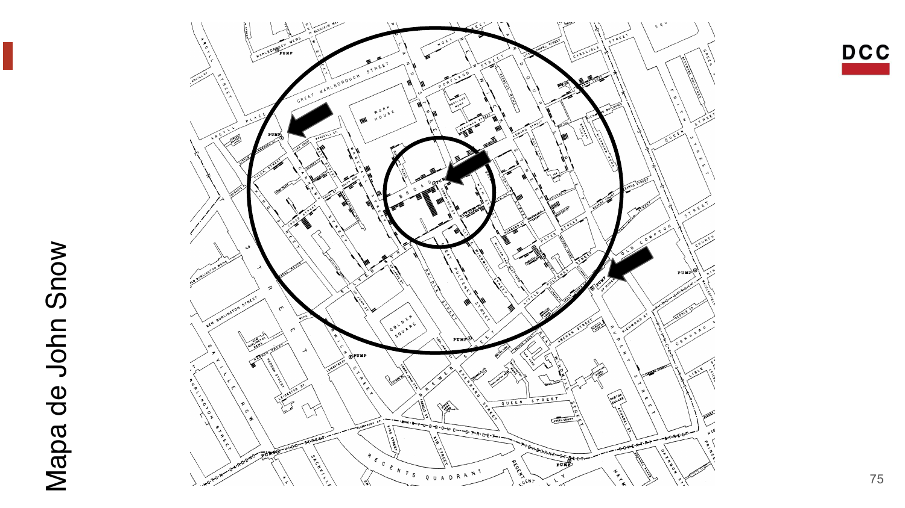
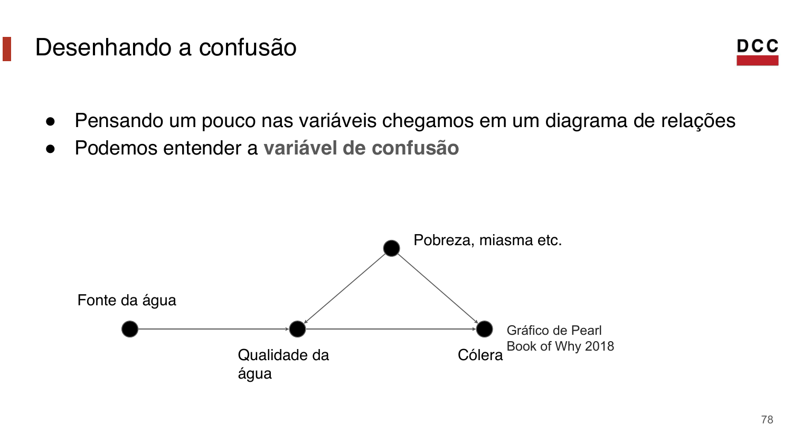
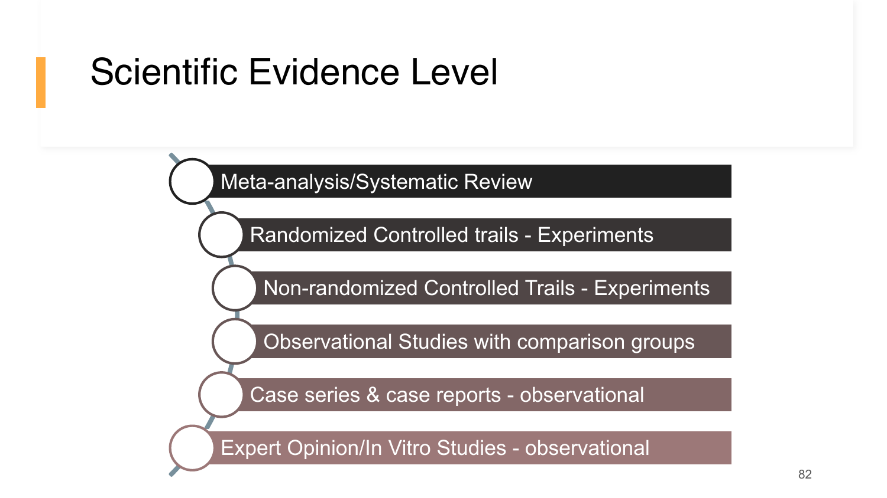

## Causalidade

## Alguns problemas atuais

- Uma mudança de interface aumenta conversão?
- Um lembrete aumenta entregas no prazo?
- Um programa público melhora frequência escolar?
- Um aumento de desemprego induz aumento de crimes?
- Uma mudança no código deixou o sistema mais rápido?

## Qual é o nosso problema?

Estudos estatísticos frequentemente perguntam como uma variável aleatória
`Y` responde a mudanças em uma ou mais variáveis `X`.

- `X`: intervenção, exposição ou característica.
- `Y`: resultado observado.

## Exemplos

- Qual o efeito do design de uma página (`X`) na compra de produtos (`Y`)?
- Qual o efeito de uma política educacional (`X`) na frequência escolar (`Y`)?
- Qual o efeito de um lembrete (`X`) na entrega de listas (`Y`)?

## O ciclo de trabalho do cientista de dados

```{mermaid}
flowchart LR
  A["Formular perguntas"] --> B["Adquirir dados"]
  B --> C["Análise exploratória"]
  C --> D["Previsões e inferência"]
  D --> E["Comunicação"]
  E --> A
```

## Formular perguntas

- Qual problema queremos resolver?
- Quais são nossas hipóteses?
- Que comparação seria convincente?
- O que os dados podem ou não sustentar?

## Qual o problema que queremos resolver?

O padrão ouro da ciência de dados é a causalidade.

::: {.statement}
Queremos comparar o que aconteceu com o que teria acontecido sem a intervenção.
:::

## Perguntas causais

- Chocolate faz bem para a saúde?
- Carnaval faz bem para a economia?
- O release 5.2 deixou o código mais rápido?
- Um lembrete aumenta entregas no prazo?

Todas tentam estabelecer uma noção de causa e efeito.

## Causa e Efeito

- Em sistemas físicos, causa e efeito vêm de interações e leis.
- Em ciência de dados, raramente temos um modelo completo do mundo.
- Quando possível, fazemos experimentos.

## Fisher

Ronald Fisher é uma figura central da estatística moderna.

Em *The Design of Experiments*, consolidou ideias como:

- controle;
- randomização;
- replicação.

## Experimento

Queremos estudar o efeito de um tratamento.

::: {.columns}
::: {.column width="50%"}
**Controle**

Grupo que não recebe a intervenção.
:::

::: {.column width="50%"}
**Tratamento**

Grupo que recebe a intervenção.
:::
:::

## Controle, randomização e replicação

- **Controle:** todo o resto deve ficar o mais parecido possível.
- **Randomização:** a escolha dos grupos não deve seguir um viés.
- **Replicação:** precisamos de várias unidades para observar variabilidade.

## Estudos Randomizados

Do inglês *Randomized Controlled Trial* (RCT).

- Parte do grupo recebe o tratamento.
- Outra parte fica no controle.
- Depois comparamos o resultado.

## Exemplo: lembrete no Moodle

::: {.statement}
Enviar um lembrete dois dias antes do prazo aumenta entregas no prazo?
:::

Esse exemplo substitui o ensaio de vacina por um cenário mais próximo da
disciplina.

## Desenho do experimento

```{mermaid}
flowchart LR
  A["Turma"] --> B["Sorteio"]
  B --> C["Controle"]
  B --> D["Lembrete"]
  C --> E["Entregou no prazo?"]
  D --> F["Entregou no prazo?"]
  E --> G["Comparação"]
  F --> G
```

## Os grupos ficaram parecidos?

::: {.bar-chart}
::: {.bar-row}
<span>Controle: listas anteriores</span><div class="bar"><div style="width: 61%"></div></div><strong>2,4</strong>
:::
::: {.bar-row}
<span>Lembrete: listas anteriores</span><div class="bar orange"><div style="width: 64%"></div></div><strong>2,5</strong>
:::
::: {.bar-row}
<span>Controle: créditos</span><div class="bar"><div style="width: 78%"></div></div><strong>20,1</strong>
:::
::: {.bar-row}
<span>Lembrete: créditos</span><div class="bar orange"><div style="width: 80%"></div></div><strong>20,6</strong>
:::
:::

Primeiro olhamos se há desequilíbrios óbvios.

## Resultado observado

::: {.bar-chart .wide-bars}
::: {.bar-row}
<span>Controle</span><div class="bar"><div style="width: 62%"></div></div><strong>62%</strong>
:::
::: {.bar-row}
<span>Lembrete</span><div class="bar orange"><div style="width: 75%"></div></div><strong>75%</strong>
:::
:::

Diferença observada: **13 pontos percentuais**.

## Problemas do experimento

- O resultado vale em outros semestres?
- O lembrete ajuda todos os estudantes igualmente?
- Houve vazamento entre grupos?
- Entregar no prazo mede aprendizagem?
- O efeito é grande o suficiente para importar?

## Quando não podemos fazer estudo controlado?

Como prosseguir?

::: {.statement}
Muitas perguntas importantes exigem estudos observacionais.
:::

## Ciência observacional

Uma ciência observacional é aquela em que não é possível construir experimentos
controlados na área em estudo.

Em muitos problemas, temos apenas dados gerados pelo mundo.

## Observação

Exemplo:

- indivíduos: população de interesse;
- tratamento: comer chocolate;
- efeito: doença cardíaca.

## Então é impossível ter insights causais?

Não.

Mas, sem controle experimental, precisamos lidar com **variáveis de confusão**.

## Variáveis de confusão

Afetam tanto o tratamento quanto o resultado.

- Idade pode afetar dieta e saúde.
- Renda pode afetar acesso a saúde e hábitos.
- Exercício pode afetar dieta e doença cardíaca.

## Correlação e Causalidade

::: {.statement}
Correlação não é causalidade.
:::

Mas boa parte do trabalho em ciência de dados começa observando associações.
Quando bem desenhado, esse trabalho pode sugerir hipóteses causais.

## John Snow

Médico inglês, frequentemente associado ao início da epidemiologia moderna.

Viveu entre 1813 e 1858.

## Londres na época

- Saneamento precário.
- Surtos graves de cólera.
- Teoria miasmática como explicação dominante.

## Teoria Miasmática

- A origem das doenças seriam os miasmas.
- Em outras palavras: odores ruins.
- Soluções propostas atacavam o cheiro, não necessariamente a causa.

## O trabalho de detetive

O cientista de dados trabalha com evidências disponíveis.

Às vezes, a variável mais visível é apenas um confundidor.

::: {.fragment}
No caso da cólera, odor era um sinal do ambiente, mas não a causa principal.
:::

## John Snow

- A doença era intestinal.
- A água poderia ser parte do mecanismo.
- Pequenas observações levaram a uma hipótese forte.

## Mapa de John Snow

{fig-align="center" width="88%"}

## Lembrando de Fisher

- Precisamos de grupo de controle.
- Precisamos de grupo de tratamento.
- Mas não podemos mudar pessoas de local.

::: {.fragment}
Snow procurou uma comparação justa dentro dos dados observacionais.
:::

## Desenhando a confusão

{fig-align="center" width="86%"}

## O experimento de John Snow

Parte de Londres recebia água de duas companhias diferentes.

Se as casas eram parecidas em outros aspectos, a fonte da água criava uma
comparação próxima de um experimento natural.

## A Tabela de John Snow

| Fonte de água | Casas | Mortes por cólera | Mortes por 10.000 casas |
|---|---:|---:|---:|
| Southwark & Vauxhall | 40.046 | 1.263 | 315 |
| Lambeth | 26.107 | 98 | 37 |
| Resto de Londres | 256.423 | 1.422 | 59 |

## Visualizando a diferença

::: {.bar-chart .wide-bars}
::: {.bar-row}
<span>S&V</span><div class="bar red"><div style="width: 100%"></div></div><strong>315</strong>
:::
::: {.bar-row}
<span>Lambeth</span><div class="bar green"><div style="width: 12%"></div></div><strong>37</strong>
:::
::: {.bar-row}
<span>Resto de Londres</span><div class="bar"><div style="width: 19%"></div></div><strong>59</strong>
:::
:::

Mortes por 10.000 casas.

## Importância de John Snow

- A cólera continuou letal por muitos anos.
- A hipótese da água demorou a convencer.
- A ciência é lenta, mas acumula evidências.

## Scientific Evidence Level

{fig-align="center" width="80%"}

## RCT

Um ensaio randomizado controlado divide indivíduos aleatoriamente entre controle
e tratamento.

Benefícios:

- comparação mais justa;
- raciocínio matemático sobre diferenças entre grupos;
- conclusões mais defensáveis sobre efeito.

## Conclusões

- O principal trabalho do cientista de dados é fazer boas perguntas.
- Causalidade é central, mas nem sempre é possível fazer experimentos.
- Estudos observacionais exigem cuidado com variáveis de confusão.
- Bons dados, bom desenho e boas visualizações ajudam a construir evidência.

## Referências e leitura

- Computational and Inferential Thinking, capítulo 2: Causality and Experiments.
- Judea Pearl e Dana Mackenzie. *The Book of Why*, 2018.
