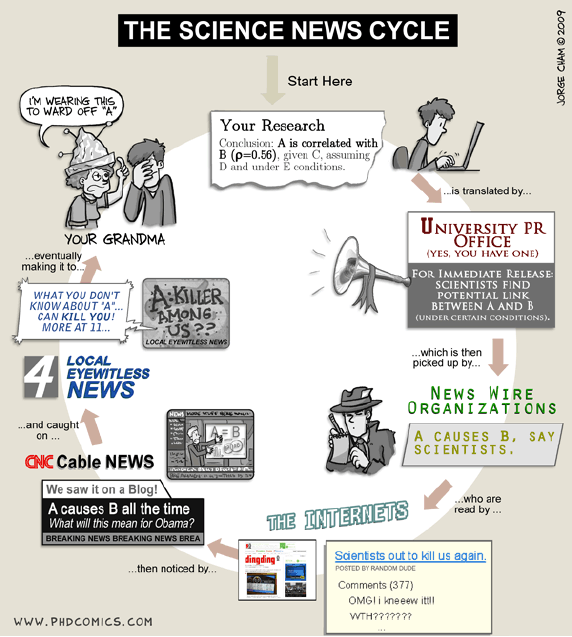
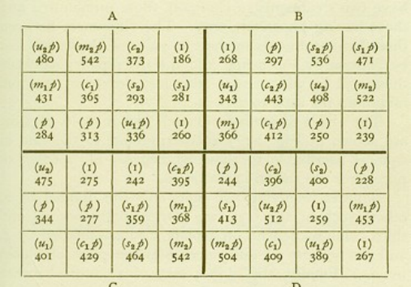
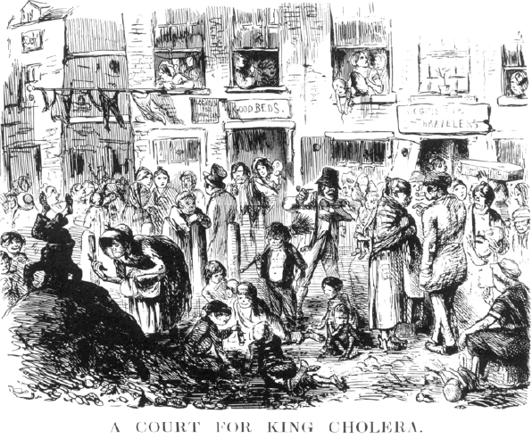
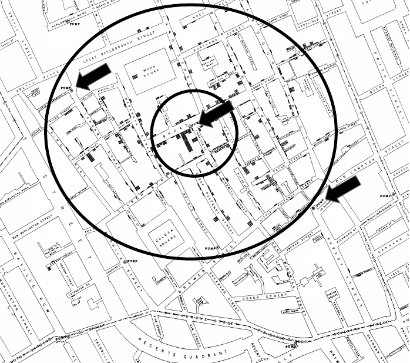
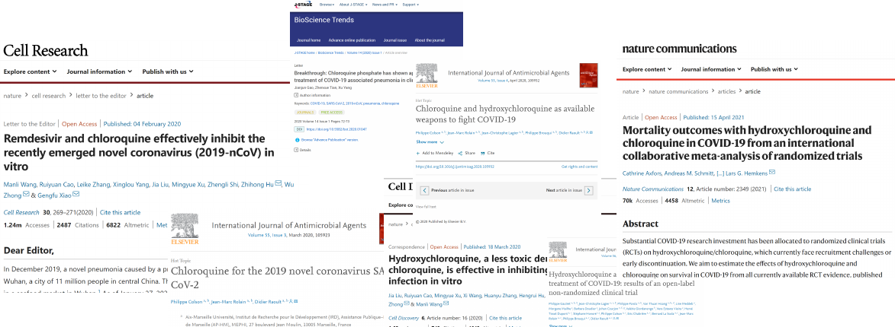

## Módulo 0 · Motivação

::: {.statement}
Como distinguir uma coincidência interessante de uma relação de causa e efeito?
:::

## Alguns problemas atuais

- Uma mudança de interface aumenta conversão?
- Um lembrete aumenta entregas no prazo?
- Um programa público melhora frequência escolar?
- Um aumento de desemprego induz aumento de crimes?
- Uma mudança no código deixou o sistema mais rápido?

## O ciclo das notícias { .news-cycle-slide}

::: {.columns}
::: {.column width="50%"}
{fig-align="center" width="100%"}
:::

::: {.column width="50%"}
- Um estudo é divulgado com um resultado chamativo.

- A manchete simplifica e generaliza o que o estudo realmente mostrou.

- Meses depois, réplicas ou revisões corrigem — ou derrubam — o resultado original.

- O público, em geral, só viu a primeira manchete.
:::
:::

## Qual é o nosso problema?

Estudos estatísticos frequentemente perguntam como uma variável aleatória
`Y` responde a mudanças em uma ou mais variáveis `X`.

- `X`: intervenção, exposição ou característica.
- `Y`: resultado observado.

## Exemplos

- Qual o efeito do design de uma página (`X`) na compra de produtos (`Y`)?
- Qual o efeito de uma política educacional (`X`) na frequência escolar (`Y`)?
- Qual o efeito de um lembrete (`X`) na entrega de listas (`Y`)?

## Associação não é intervenção

- **Associação:** quem recebeu `X` apresentou valores diferentes de `Y`.
- **Causalidade:** mudar `X`, mantendo o restante comparável, mudaria `Y`.

::: {.statement}
Perguntas causais imaginam uma intervenção no mundo.
:::

## O contrafactual

Para uma mesma unidade `i`, definimos dois resultados potenciais:

$$Y_i(1)=\text{resultado se tratada}$$
$$Y_i(0)=\text{resultado se não tratada}$$

O efeito individual seria $Y_i(1)-Y_i(0)$.

## O resultado que nunca vemos

Observamos apenas um dos dois cenários:

$$Y_i=T_iY_i(1)+(1-T_i)Y_i(0)$$

O outro é o **contrafactual**.

::: {.fragment}
Um grupo de comparação tenta representar esse resultado ausente.
:::

## O problema fundamental

Não podemos observar a mesma pessoa, no mesmo instante, vacinada e não
vacinada.

Por isso buscamos o efeito médio:

$$ATE=\mathbb{E}[Y(1)-Y(0)]$$

**ATE — *Average Treatment Effect* (Efeito Médio do Tratamento):** média, na
população, da diferença entre o resultado com tratamento e o resultado sem
tratamento.

## O ciclo de trabalho do cientista de dados

::: {.data-cycle}
::: {.cycle-step}
<span>01</span>

**Formular**<br>perguntas
:::

<div class="cycle-arrow">→</div>

::: {.cycle-step}
<span>02</span>

**Adquirir**<br>dados
:::

<div class="cycle-arrow">→</div>

::: {.cycle-step}
<span>03</span>

**Explorar**<br>e visualizar
:::

<div class="cycle-arrow">→</div>

::: {.cycle-step}
<span>04</span>

**Inferir**<br>e prever
:::

<div class="cycle-arrow">→</div>

::: {.cycle-step}
<span>05</span>

**Comunicar**<br>e decidir
:::
:::

::: {.cycle-return}
↖ novas evidências geram novas perguntas
:::

## Formular perguntas

- Qual problema queremos resolver?
- Quais são nossas hipóteses?
- Que comparação seria convincente?
- O que os dados podem ou não sustentar?

## Qual o problema que queremos resolver?

O padrão ouro da ciência de dados é a causalidade.

::: {.statement}
Queremos comparar o que aconteceu com o que teria acontecido sem a intervenção.
:::

## Perguntas causais

- Chocolate faz bem para a saúde?
- Carnaval faz bem para a economia?
- O release 5.2 deixou o código mais rápido?
- Um lembrete aumenta entregas no prazo?

Todas tentam estabelecer uma noção de causa e efeito.

## Causa e Efeito

- Em sistemas físicos, causa e efeito vêm de interações e leis.
- Em ciência de dados, raramente temos um modelo completo do mundo.
- Quando possível, fazemos experimentos.

## Fisher transformou comparação em desenho

::: {.columns}
::: {.column width="39%"}
{fig-align="center" width="100%"}
:::

::: {.column width="55%"}
**Ronald A. Fisher (1890–1962)**

Ao trabalhar com experimentos agrícolas, Fisher percebeu que não bastava
comparar colheitas: era preciso **planejar como a comparação seria criada**.

::: {.statement}
O desenho do estudo vem antes da análise dos dados.
:::
:::
:::

## Fisher

Ronald Fisher é uma figura central da estatística moderna.

Em *The Design of Experiments*, consolidou ideias como:

- controle;
- randomização;
- replicação.

## Experimento {}

::: {.columns}
::: {.column width="64%"}
{fig-align="center" width="100%"}
:::

::: {.column width="30%"}
<div class="fisher-experiment-copy">

**Pergunta:** reagentes alteram a colheita?

Cada quadrado representa uma parcela. Os tratamentos são distribuídos pelo
campo para separar seu efeito das diferenças naturais do terreno.

**Ideia central:** organizar onde medir é parte do método estatístico.

</div>
:::
:::

## Experimento

Queremos estudar o efeito de um tratamento.

::: {.columns}
::: {.column width="50%"}
::: {.experiment-group-card .control-card}
<div class="experiment-card-title">Controle</div>

Não recebe a intervenção.

Representa o que aconteceria **sem** o tratamento.
:::
:::

::: {.column width="50%"}
::: {.experiment-group-card .treatment-card}
<div class="experiment-card-title">Tratamento</div>

Recebe a intervenção.

Representa o resultado **com** o tratamento.
:::
:::
:::

## Controle, randomização e replicação

- **Controle:** todo o resto deve ficar o mais parecido possível.
- **Randomização:** a escolha dos grupos não deve seguir um viés.
- **Replicação:** precisamos de várias unidades para observar variabilidade.

## Estudos Randomizados

Do inglês *Randomized Controlled Trial* (RCT).

- Parte do grupo recebe o tratamento.
- Outra parte fica no controle.
- Depois comparamos o resultado.

## Um experimento que mudou a saúde pública

Em 1954, o ensaio da vacina de Jonas Salk contra a poliomielite envolveu cerca
de **1,8 milhão de crianças**.

::: {.statement}
A vacina de vírus inativado previne pólio paralítica?
:::

::: notes
Fonte: CDC, Dateline: CDC, https://stacks.cdc.gov/view/cdc/21420/cdc_21420_DS1.pdf
:::

## Dois desenhos no mesmo estudo

::: {.columns}
::: {.column width="50%"}
::: {.experiment-group-card .control-card}
**Placebo randomizado**

Vacina e placebo foram atribuídos em desenho cego.
:::
:::
::: {.column width="50%"}
::: {.experiment-group-card .treatment-card}
**Controle observado**

Em outras regiões, crianças vacinadas foram comparadas às não vacinadas.
:::
:::
:::

O primeiro desenho produzia grupos mais comparáveis.

## Por que o controle observado preocupa?

Famílias que autorizavam a vacinação poderiam diferir das demais em:

- renda e acesso à saúde;
- exposição ao vírus;
- procura por diagnóstico;
- condições anteriores de saúde.

Randomizar reduz esse viés de seleção.

## O resultado do ensaio

- Os resultados foram anunciados em 12 de abril de 1955.
- No estudo com placebo, a eficácia contra pólio paralítica foi de cerca de
  **72%**.
- A vacina foi rapidamente licenciada.

::: notes
Fonte: NIH/PMC, Lessons from the Salk Polio Vaccine, https://pmc.ncbi.nlm.nih.gov/articles/PMC2928990/
:::

## Exemplo: lembrete no Moodle

::: {.statement}
Enviar um lembrete dois dias antes do prazo aumenta entregas no prazo?
:::

Esse exemplo substitui o ensaio de vacina por um cenário mais próximo da
disciplina.

## Desenho do experimento

```{mermaid}
flowchart LR
  A["Turma"] --> B["Sorteio"]
  B --> C["Controle"]
  B --> D["Lembrete"]
  C --> E["Entregou no prazo?"]
  D --> F["Entregou no prazo?"]
  E --> G["Comparação"]
  F --> G
```

## Os grupos ficaram parecidos?

::: {.bar-chart}
::: {.bar-row}
<span>Controle: listas anteriores</span><div class="bar"><div style="width: 61%"></div></div><strong>2,4</strong>
:::
::: {.bar-row}
<span>Lembrete: listas anteriores</span><div class="bar orange"><div style="width: 64%"></div></div><strong>2,5</strong>
:::
::: {.bar-row}
<span>Controle: créditos</span><div class="bar"><div style="width: 78%"></div></div><strong>20,1</strong>
:::
::: {.bar-row}
<span>Lembrete: créditos</span><div class="bar orange"><div style="width: 80%"></div></div><strong>20,6</strong>
:::
:::

Primeiro olhamos se há desequilíbrios óbvios.

## Resultado observado

::: {.bar-chart .wide-bars}
::: {.bar-row}
<span>Controle</span><div class="bar"><div style="width: 62%"></div></div><strong>62%</strong>
:::
::: {.bar-row}
<span>Lembrete</span><div class="bar orange"><div style="width: 75%"></div></div><strong>75%</strong>
:::
:::

Diferença observada: **13 pontos percentuais**.

## Problemas do experimento

- O resultado vale em outros semestres?
- O lembrete ajuda todos os estudantes igualmente?
- Houve vazamento entre grupos?
- Entregar no prazo mede aprendizagem?
- O efeito é grande o suficiente para importar?

## Quando não podemos fazer estudo controlado?

Como prosseguir?

::: {.statement}
Muitas perguntas importantes exigem estudos observacionais.
:::

## Ciência observacional

Uma ciência observacional é aquela em que não é possível construir experimentos
controlados na área em estudo.

Em muitos problemas, temos apenas dados gerados pelo mundo.

## Observação

Exemplo:

- indivíduos: população de interesse;
- tratamento: comer chocolate;
- efeito: doença cardíaca.

## Então é impossível ter insights causais?

Não.

Mas, sem controle experimental, precisamos lidar com **variáveis de confusão**.

## Variáveis de confusão

Afetam tanto o tratamento quanto o resultado.

- Idade pode afetar dieta e saúde.
- Renda pode afetar acesso a saúde e hábitos.
- Exercício pode afetar dieta e doença cardíaca.

## Correlação e Causalidade

::: {.statement}
Correlação não é causalidade.
:::

Mas boa parte do trabalho em ciência de dados começa observando associações.
Quando bem desenhado, esse trabalho pode sugerir hipóteses causais.

## Antes de John Snow…

{fig-align="center" width="92%"}

## John Snow

Médico inglês, frequentemente associado ao início da epidemiologia moderna.

Viveu entre 1813 e 1858.

## Londres na época {.smaller}

::: {.columns}
::: {.column width="61%"}
{fig-align="center" width="100%"}
:::

::: {.column width="33%"}
**Londres, 1852**

A charge *A Court for King Cholera*, da revista *Punch*, retrata aglomeração,
esgoto e pobreza como parte do cotidiano urbano.

::: {.statement}
O ambiente oferecia muitas explicações plausíveis — e confundidas entre si.
:::
:::
:::

## Londres na época

- Saneamento precário.
- Surtos graves de cólera.
- Teoria miasmática como explicação dominante.

## Teoria Miasmática

- A origem das doenças seriam os miasmas.
- Em outras palavras: odores ruins.
- Soluções propostas atacavam o cheiro, não necessariamente a causa.

## O trabalho de detetive

O cientista de dados trabalha com evidências disponíveis.

Às vezes, a variável mais visível é apenas um confundidor.

::: {.fragment}
No caso da cólera, odor era um sinal do ambiente, mas não a causa principal.
:::

## John Snow

- A doença era intestinal.
- A água poderia ser parte do mecanismo.
- Pequenas observações levaram a uma hipótese forte.

## Mapa de John Snow

::: {.columns}
::: {.column width="66%"}
{fig-align="center" width="88%"}
:::

::: {.column width="28%"}
Cada pequena barra registra uma morte por cólera.

As barras se concentram ao redor da bomba da **Broad Street**.

::: {.statement}
O mapa transforma localização em evidência.
:::
:::
:::

## Lembrando de Fisher

- Precisamos de grupo de controle.
- Precisamos de grupo de tratamento.
- Mas não podemos mudar pessoas de local.

::: {.fragment}
Snow procurou uma comparação justa dentro dos dados observacionais.
:::

## Desenhando a confusão

```{mermaid}
%%| fig-width: 10
%%| fig-height: 4.4
flowchart LR
  C["Pobreza e condições urbanas"]:::confounder
  A["Companhia / fonte da água"]:::exposure
  M["Qualidade da água"]:::mediator
  Y["Cólera"]:::outcome

  A -->|altera| M
  M -->|afeta| Y
  C -.->|influencia a exposição| A
  C -.->|também afeta o risco| Y

  classDef confounder fill:#fff0e8,stroke:#d95f02,stroke-width:3px,color:#17324d
  classDef exposure fill:#eef3f5,stroke:#0f6b78,stroke-width:3px,color:#17324d
  classDef mediator fill:#eef3f5,stroke:#0f6b78,stroke-width:3px,color:#17324d
  classDef outcome fill:#e9f5f1,stroke:#16826c,stroke-width:3px,color:#17324d
  linkStyle 0,1 stroke:#17324d,stroke-width:3px
  linkStyle 2,3 stroke:#d95f02,stroke-width:3px,stroke-dasharray:8 6
```

::: {.statement}
Comparar as companhias exige casas semelhantes em pobreza e condições urbanas.
:::

## O experimento de John Snow {.smaller}

::: {.snow-natural-experiment}
::: {.snow-stage .snow-population}
<span>01</span>

**Casas misturadas**<br>
na mesma região de Londres
:::

<div class="snow-split">↙ &nbsp;&nbsp; ↘</div>

::: {.snow-branches}
::: {.snow-stage .snow-dirty}
<span>02A</span>

**Southwark & Vauxhall**<br>
captação mais contaminada
:::

::: {.snow-stage .snow-clean}
<span>02B</span>

**Lambeth**<br>
captação mais limpa
:::
:::

<div class="snow-merge">↘ &nbsp;&nbsp; ↙</div>

::: {.snow-stage .snow-outcome}
<span>03</span>

**Comparar mortalidade por cólera**<br>
entre as duas redes de abastecimento
:::
:::

::: {.statement}
Como as redes atendiam casas próximas, a companhia de água criou uma comparação
próxima de um experimento natural.
:::

## A Tabela de John Snow

| Fonte de água | Casas | Mortes por cólera | Mortes por 10.000 casas |
|---|---:|---:|---:|
| Southwark & Vauxhall | 40.046 | 1.263 | 315 |
| Lambeth | 26.107 | 98 | 37 |
| Resto de Londres | 256.423 | 1.422 | 59 |

## Visualizando a diferença

::: {.bar-chart .wide-bars}
::: {.bar-row}
<span>S&V</span><div class="bar red"><div style="width: 100%"></div></div><strong>315</strong>
:::
::: {.bar-row}
<span>Lambeth</span><div class="bar green"><div style="width: 12%"></div></div><strong>37</strong>
:::
::: {.bar-row}
<span>Resto de Londres</span><div class="bar"><div style="width: 19%"></div></div><strong>59</strong>
:::
:::

Mortes por 10.000 casas.

## Importância de John Snow

- A cólera continuou letal por muitos anos.
- A hipótese da água demorou a convencer.
- A ciência é lenta, mas acumula evidências.

## Níveis de evidência científica {.smaller}

::: {.evidence-ladder}
::: {.evidence-rung .evidence-high}
**Sínteses** · revisões sistemáticas e meta-análises
:::
::: {.evidence-rung}
**Experimentos randomizados** · comparação criada pelo sorteio
:::
::: {.evidence-rung}
**Experimentos não randomizados** · comparação controlada, mas vulnerável à seleção
:::
::: {.evidence-rung}
**Estudos observacionais comparativos** · ajuste e desenho tentam reduzir confundimento
:::
::: {.evidence-rung}
**Séries e relatos de casos** · descrevem sinais, sem contrafactual forte
:::
::: {.evidence-rung .evidence-base}
**Opinião e laboratório** · mecanismo e plausibilidade, ainda longe do efeito na população
:::
:::

**Atenção:** subir na hierarquia ajuda, mas qualidade, transparência e contexto
continuam essenciais.

## Evidência científica em movimento

::: {.evidence-flow-native}
<span>In vitro</span><b>→</b><span>Observacional</span><b>→</b><span>Randomizado</span><b>→</b><span>Meta-análise</span>
:::

::: {.evidence-articles-wide}
{fig-align="center"}
:::

::: notes
Slide 44 preservado do deck original: a progressão dos estudos sobre
hidroxicloroquina durante a pandemia ilustra como conclusões mudam quando o
nível e a quantidade de evidência aumentam.
:::

## RCT

Um ensaio randomizado controlado divide indivíduos aleatoriamente entre controle
e tratamento.

Benefícios:

- comparação mais justa;
- raciocínio matemático sobre diferenças entre grupos;
- conclusões mais defensáveis sobre efeito.

## Checklist causal

1. Qual é a unidade, o tratamento e o resultado?
2. Qual é o contrafactual relevante?
3. Como os grupos foram formados?
4. Que confundidores permanecem?
5. Como tratamento e resultado foram medidos?
6. Para quem e onde a conclusão vale?

## Conclusões

- O principal trabalho do cientista de dados é fazer boas perguntas.
- Causalidade é central, mas nem sempre é possível fazer experimentos.
- Estudos observacionais exigem cuidado com variáveis de confusão.
- Bons dados, bom desenho e boas visualizações ajudam a construir evidência.

## Referências e leitura

- Computational and Inferential Thinking, capítulo 2: Causality and Experiments.
- Judea Pearl e Dana Mackenzie. *The Book of Why*, 2018.
- Miguel Hernán e James Robins. *Causal Inference: What If*, 2020.
- CDC. [50º aniversário da primeira vacina eficaz contra pólio](https://www.cdc.gov/mmwr/preview/mmwrhtml/mm5413a5.htm).
