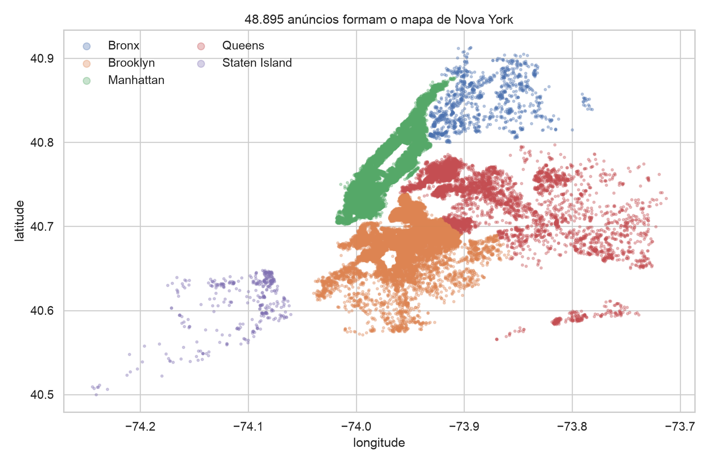
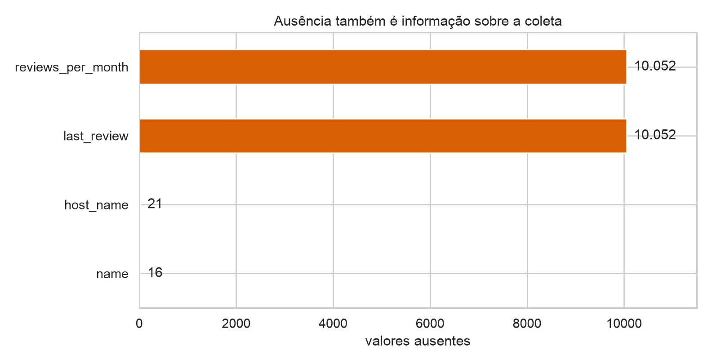
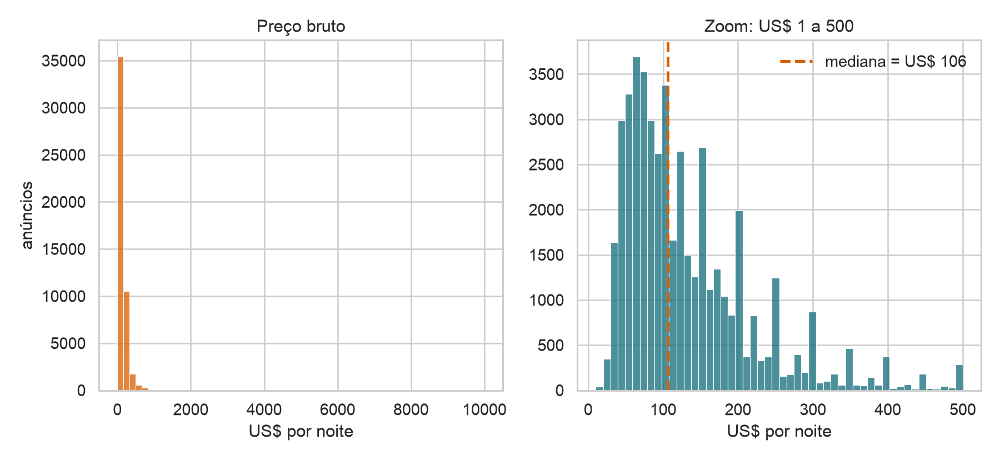
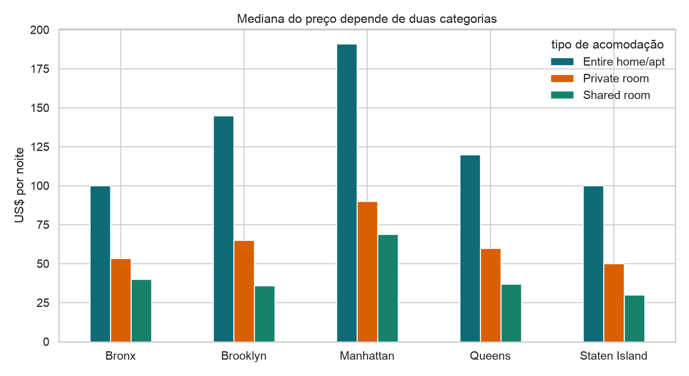

## Módulo 1 · Análise Exploratória

::: {.statement}
Antes de calcular, precisamos saber o que cada linha, coluna e valor representa.
:::

## Quanto custa ficar em Nova York?

Uma tabela parece responder rapidamente.

Mas antes precisamos decidir:

- o que é uma observação;
- o que significa “preço”;
- quais valores são comparáveis;
- como tratar datas, categorias e ausências.

## Hoje

- coleta, população e amostra;
- anatomia de uma tabela;
- tipos semânticos e tipos computacionais;
- CSV e leitura com pandas;
- seleção, filtragem e transformação;
- valores ausentes e validação;
- `groupby`, agregação e encadeamento.

## A base da aula

**New York City Airbnb Open Data (2019)**

- 48.895 anúncios;
- 16 colunas;
- cinco distritos de Nova York;
- preços, disponibilidade, avaliações e localização;
- licença pública na versão usada.

Fonte: [Kaggle — Airbnb in NYC](https://www.kaggle.com/datasets/thedevastator/airbnbs-nyc-overview).

## O que a base descreve?

::: {.statement}
Cada linha representa um **anúncio**, não uma reserva, uma pessoa ou uma noite.
:::

O objetivo é descrever a oferta anunciada em uma fotografia do mercado de 2019.

## Principais colunas

| coluna | significado | papel inicial |
|---|---|---|
| `id` | identificador do anúncio | identificador |
| `neighbourhood_group` | distrito | categoria |
| `room_type` | tipo de acomodação | categoria |
| `price` | preço anunciado por noite | quantidade |
| `last_review` | última avaliação | data |
| `latitude`, `longitude` | localização | coordenadas |

## Uma linha vira um ponto

{fig-alt="Mapa de dispersão dos anúncios do Airbnb em Nova York, coloridos por distrito."}

<details class="code-fold">
<summary>Código do gráfico</summary>

```python
for borough, part in airbnb.groupby("neighbourhood_group"):
    ax.scatter(part.longitude, part.latitude, s=5, alpha=.32,
               label=borough)
```
</details>

## Linha, coluna e célula

::: {.columns .table-unit-row}
::: {.column .table-unit-block width="31%"}
**Linha**

Uma unidade observacional.
:::
::: {.column .table-unit-block width="31%"}
**Coluna**

Uma característica medida.
:::
::: {.column .table-unit-block width="31%"}
**Célula**

Um valor para uma unidade e variável.
:::
:::

## Uma tabela bem formada

1. Cada linha representa uma observação.
2. Cada coluna representa uma variável.
3. Cada célula contém um valor atômico sempre que possível.
4. O nome da coluna não deve carregar valores.
5. A unidade deve permanecer consistente.

## Dados são produzidos por um processo

::: {.data-collection-flow}
::: {.collection-step}
**Mundo de interesse**

Hospedagens de curta duração em Nova York
:::
<div class="collection-arrow">→</div>
::: {.collection-step}
**Registro na plataforma**

O anfitrião informa preço, localização e regras
:::
<div class="collection-arrow">→</div>
::: {.collection-step}
**Sistemas do Airbnb**

Validação, avaliações e disponibilidade
:::
<div class="collection-arrow">→</div>
::: {.collection-step}
**Recorte de 2019**

Uma fotografia com 48.895 anúncios
:::
:::

::: {.statement}
Cada etapa decide quem aparece, o que é medido e quais erros podem entrar.
:::

## População, quadro amostral e amostra

::: {.sampling-frame-flow}
::: {.sampling-layer .population-layer}
**População-alvo** · todas as hospedagens que gostaríamos de compreender
:::
::: {.sampling-layer .frame-layer}
**Quadro amostral** · anúncios acessíveis na plataforma e na extração
:::
::: {.sampling-layer .sample-layer}
**Amostra observada** · 48.895 anúncios presentes no arquivo de 2019
:::
:::

Anúncios publicados não representam automaticamente hotéis, hospedagens
informais fora da plataforma ou ofertas removidas antes da coleta.

## Quatro processos de amostragem {.smaller}

::: {.sampling-grid}
::: {.sampling-method}
**Aleatória simples**

Sortear anúncios com a mesma probabilidade.

`airbnb.sample(n=1000)`
:::
::: {.sampling-method}
**Sistemática**

Após uma ordem, escolher um início e cada $k$-ésimo anúncio.

Pode herdar padrões da ordenação.
:::
::: {.sampling-method}
**Estratificada**

Sortear dentro de cada distrito e tipo de acomodação.

Preserva grupos pequenos na análise.
:::
::: {.sampling-method}
**Por conglomerados**

Sortear bairros e observar seus anúncios.

É mais barata, mas unidades do mesmo bairro se parecem.
:::
:::

::: {.statement}
Para comparar distritos e tipos, a estratificação evita que grupos pequenos quase desapareçam. Mais linhas não corrigem exclusões sistemáticas.
:::

## A base combina mecanismos de coleta

::: {.collection-source-grid}
::: {.collection-source}
**Cadastro e autodeclaração**

O anfitrião informa nome, preço, mínimo de noites e localização.

Pode haver erro, omissão ou estratégia comercial.
:::
::: {.collection-source}
**Observação de interações**

Avaliações e datas registram ações realizadas na plataforma.

Quem não interage deixa menos rastros.
:::
::: {.collection-source}
**Registros administrativos**

Identificadores e disponibilidade são mantidos pelo sistema.

As regras da plataforma definem seu significado.
:::
:::

::: {.statement}
Uma mesma linha pode reunir respostas humanas, comportamento observado e logs automáticos.
:::

## Lendo com pandas

```python
import pandas as pd

airbnb = pd.read_csv("data/AB_NYC_2019.csv")
```

`read_csv` interpreta cabeçalho, delimitador, ausências e tipos iniciais.

O CSV guarda texto separado por delimitadores; tipos e unidades precisam ser reconstruídos na leitura.

::: {.code-result}
**Resultado:** `airbnb` é um `DataFrame` com **48.895 linhas × 16 colunas**.
:::

## As primeiras perguntas {.smaller}

```python
airbnb.shape
airbnb.head(3)
airbnb.columns
airbnb.info()
```

::: {.code-result}
```text
(48895, 16)

  id  neighbourhood_group       room_type  price
2539              Brooklyn    Private room    149
2595             Manhattan Entire home/apt    225
3647             Manhattan    Private room    150
```
:::

- Quantas linhas e colunas existem?
- Os nomes são compreensíveis?
- Os tipos fazem sentido?
- Há ausências?

## Quatro tipos semânticos de dados {.smaller}

::: {.data-type-grid}
::: {.data-type-block .type-nominal}
**Categórico nominal**

Rótulos sem ordem natural.

`neighbourhood_group`, `room_type`
:::
::: {.data-type-block .type-ordinal}
**Categórico ordinal**

Categorias ordenadas, sem distância garantida.

Faixas criadas: baixo < médio < alto
:::
::: {.data-type-block .type-discrete}
**Numérico discreto**

Contagens em valores separados.

`number_of_reviews`, `minimum_nights`
:::
::: {.data-type-block .type-continuous}
**Numérico contínuo**

Medições em um intervalo.

`latitude`, `longitude`, `reviews_per_month`
:::
:::

## Armazenamento não determina significado

| pandas inferiu | variável | interpretação correta |
|---|---|---|
| `int64` | `id` | identificador categórico |
| `int64` | `price` | quantidade monetária registrada em dólares inteiros |
| `object` | `room_type` | categoria nominal |
| `object` | `last_review` | data ainda armazenada como texto |

::: {.statement}
O computador conhece a representação; o analista precisa conhecer a variável.
:::

## Identificadores

- distinguem unidades;
- podem ser numéricos ou textuais;
- não são quantidades;
- devem ser únicos quando identificam linhas.

```python
airbnb["id"].is_unique
airbnb["id"].duplicated().sum()
```

::: {.code-result}
**Resultado:** `True` e `0` — todos os identificadores são únicos.
:::

## Tipos numéricos {.smaller}

Contagens assumem valores separados:

- `number_of_reviews`;
- `minimum_nights`;
- `availability_365`.

Podemos somar e comparar, mas precisamos conhecer o intervalo válido.

Medições contínuas podem assumir valores em um intervalo:

- latitude;
- longitude;
- taxas e proporções;
- duração e distância.

A precisão registrada não é a precisão real do fenômeno.

## Categorias nominais e ordinais

Categorias sem ordem intrínseca:

- distrito;
- bairro;
- tipo de acomodação.

```python
airbnb["room_type"] = airbnb["room_type"].astype("category")
```

::: {.code-result}
**Resultado:** `airbnb["room_type"].dtype` → `category`.
:::

Categorias **ordinais** possuem ordem, mas não distância numérica garantida:

```text
ruim < regular < bom < ótimo
```

Codificar como `1, 2, 3, 4` não prova que as distâncias sejam constantes.

## Datas

```python
airbnb["last_review"] = pd.to_datetime(
    airbnb["last_review"], errors="coerce"
)
```

::: {.code-result}
**Resultado:** datas válidas de **28/03/2011** a **08/07/2019**; 10.052 valores continuam ausentes.
:::

Depois da conversão, podemos extrair ano, mês, dia da semana e diferenças de
tempo.

## Texto e coordenadas

`name` e `host_name` são texto livre: capitalização, idiomas, ausências e
privacidade importam.

Latitude e longitude são números, mas possuem semântica espacial.

- médias podem produzir um ponto pouco útil;
- distância em graus não é distância em quilômetros;
- mapas exigem projeção e contexto geográfico.

## O DDD de uma cidade é número?

`31`, `11` e `21` usam dígitos, mas funcionam como rótulos.

Não faz sentido calcular:

- média de DDD;
- dobro de um CEP;
- soma de matrículas.

::: {.statement}
A aparência do valor não determina o tipo semântico.
:::

O mesmo cuidado vale para notas de 1 a 5: podem representar apenas uma ordem,
não uma medida contínua com distâncias iguais.

## Valores ausentes {.smaller}

{fig-alt="Contagem de valores ausentes em quatro colunas da base Airbnb." width="72%"}

<details class="code-fold">
<summary>Código do gráfico</summary>

```python
missing = airbnb.isna().sum().sort_values()
missing[missing > 0].plot.barh()
```
</details>

`last_review` e `reviews_per_month` faltam exatamente nas mesmas 10.052 linhas.

Hipótese plausível: anúncios sem avaliações não possuem data nem taxa mensal.

```python
airbnb[["last_review", "reviews_per_month"]].isna().all(axis=1).sum()
```

::: {.code-result}
**Resultado:** `10052` linhas têm as duas informações ausentes.
:::

## Ausente não é zero

- `reviews_per_month = 0`: medimos uma taxa igual a zero.
- `reviews_per_month = NaN`: a taxa não está disponível.

Preencher tudo com zero altera o significado e pode criar resultados artificiais.

## Duplicatas e regras de validade

```python
airbnb.duplicated().sum()
airbnb["id"].duplicated().sum()
```

::: {.code-result}
**Resultado:** `0` linhas duplicadas e `0` identificadores repetidos.
:::

Duplicata de linha, duplicata de identificador e anúncios semelhantes são
problemas diferentes.

```python
airbnb["price"].between(1, 10_000)
airbnb["availability_365"].between(0, 365)
airbnb["latitude"].between(40, 41)
```

::: {.code-result}
**Resultado:** preço inválido em **11** linhas; disponibilidade e latitude válidas nas **48.895** linhas.
:::

Validação transforma conhecimento do domínio em testes verificáveis.

## Preço revela problemas

- mínimo: US$ 0;
- mediana: US$ 106;
- média: US$ 152,72;
- máximo: US$ 10.000;
- 11 anúncios com preço zero;
- 239 acima de US$ 1.000.

## Visualizar antes de resumir

{.price-distribution-chart fig-alt="Dois histogramas do preço: escala completa e zoom até 500 dólares."}

<details class="code-fold">
<summary>Código do gráfico</summary>

```python
sns.histplot(airbnb.price, bins=60)
sns.histplot(airbnb.loc[airbnb.price.between(1, 500), "price"], bins=50)
```
</details>

## Series e DataFrame

```python
airbnb["price"]                 # Series
airbnb[["price", "room_type"]] # DataFrame
```

::: {.code-result}
**Resultado:** `Series` com forma `(48895,)`; `DataFrame` com forma `(48895, 2)`.
:::

- `Series`: uma dimensão e um índice;
- `DataFrame`: várias colunas alinhadas pelo índice.

O **índice** rotula linhas e participa do alinhamento:

```python
airbnb.index
airbnb.set_index("id")
airbnb.reset_index()
```

::: {.code-result}
`RangeIndex(start=0, stop=48895, step=1)`
:::

Não transforme uma coluna em índice sem saber por quê.

## Selecionando linhas e colunas

```python
airbnb["price"]
airbnb[["neighbourhood_group", "room_type", "price"]]
```

Uma lista dentro dos colchetes mantém o resultado como tabela.

```python
airbnb.iloc[0:3]                 # posição
airbnb.loc[0:2, ["id", "price"]] # rótulo
```

::: {.code-result}
```text
     id  price
0  2539    149
1  2595    225
2  3647    150
```
:::

`iloc` usa posição; `loc` usa rótulos e condições.

## Filtrando

```python
manhattan_inteiro = airbnb.query(
    "neighbourhood_group == 'Manhattan' and "
    "room_type == 'Entire home/apt' and price <= 500"
)
```

::: {.code-result}
**Resultado:** **12.524 anúncios × 16 colunas**; os três primeiros custam US$ 225, US$ 80 e US$ 200.
:::

O filtro deve ser legível e refletir uma pergunta concreta.

## Cópia ou visão?

```python
recorte = airbnb.loc[airbnb["price"] <= 500].copy()
recorte["price_brl"] = recorte["price"] * 5.0
```

::: {.code-result}
**Resultado:** `recorte.shape` → `(47851, 17)`; os primeiros preços convertidos são R$ 745, R$ 1.125 e R$ 750.
:::

Usar `.copy()` explicita que o recorte será modificado de forma independente.

## Vetorização

```python
airbnb["ocupacao_potencial"] = 365 - airbnb["availability_365"]
```

::: {.code-result}
**Resultado:** primeiros valores `0, 10, 0`; mediana igual a `320` dias.
:::

Operações colunares são mais concisas, rápidas e verificáveis que loops linha a
linha.

```python
airbnb = airbnb.assign(
    teve_review=airbnb["number_of_reviews"].gt(0),
    preco_valido=airbnb["price"].gt(0)
)
```

::: {.code-result}
**Resultado:** 38.843 anúncios tiveram avaliações; 48.884 possuem preço positivo.
:::

O nome deve registrar claramente a regra aplicada.

## Groupby: dividir, aplicar e combinar {.smaller}

::: {.statement}
Qual é o preço típico por distrito e tipo de acomodação?
:::

::: {.groupby-airbnb-flow}
::: {.groupby-stage .groupby-input}
**1 · Tabela**

| distrito | tipo | preço |
|---|---|---:|
| Manhattan | inteiro | 225 |
| Manhattan | inteiro | 80 |
| Brooklyn | privado | 149 |
| Brooklyn | privado | 60 |
| Queens | privado | 130 |
| Queens | privado | 70 |
:::
<div class="groupby-arrow">→</div>
::: {.groupby-stage .groupby-split}
**2 · Dividir**

`Manhattan + inteiro`<br>225, 80

`Brooklyn + privado`<br>149, 60

`Queens + privado`<br>130, 70
:::
<div class="groupby-arrow">→</div>
::: {.groupby-stage .groupby-apply}
**3 · Aplicar**

Calcular a mediana dentro de cada grupo.

152,5<br>104,5<br>100
:::
<div class="groupby-arrow">→</div>
::: {.groupby-stage .groupby-output}
**4 · Combinar**

| grupo | mediana |
|---|---:|
| Manhattan + inteiro | 152,5 |
| Brooklyn + privado | 104,5 |
| Queens + privado | 100 |
:::
:::

```python
airbnb.groupby(["neighbourhood_group", "room_type"])["price"].median()
```

## Series ou DataFrame após agrupar?

```python
g1 = airbnb.groupby("room_type")["price"].median()    # Series
g2 = airbnb.groupby("room_type")[["price"]].median() # DataFrame
```

::: {.code-result}
| `room_type` | mediana (US$) |
|---|---:|
| Entire home/apt | 160 |
| Private room | 70 |
| Shared room | 45 |
:::

Os colchetes determinam a dimensionalidade do resultado.

## Agregando várias medidas {.smaller}

```python
resumo = (
    airbnb.groupby("room_type")
    .agg(
        anuncios=("id", "size"),
        preco_mediano=("price", "median"),
        disponibilidade_mediana=("availability_365", "median")
    )
)
```

::: {.code-result}
| tipo | anúncios | preço mediano | disponibilidade mediana |
|---|---:|---:|---:|
| Entire home/apt | 25.409 | 160 | 42 |
| Private room | 22.326 | 70 | 45 |
| Shared room | 1.160 | 45 | 90 |
:::

## Duas categorias, uma comparação

{fig-alt="Preço mediano por distrito e tipo de acomodação."}

<details class="code-fold">
<summary>Código do gráfico</summary>

```python
med = airbnb.groupby(
    ["neighbourhood_group", "room_type"]
).price.median().unstack()
med.plot.bar()
```
</details>

## Encadeamento de métodos {.smaller}

```python
resumo = (
    airbnb
    .query("price > 0 and price <= 500")
    .groupby(["neighbourhood_group", "room_type"])
    .agg(n=("id", "size"), mediana=("price", "median"))
    .reset_index()
    .sort_values("mediana", ascending=False)
)
```

::: {.code-result}
| distrito | tipo | `n` | mediana |
|---|---|---:|---:|
| Manhattan | Entire home/apt | 12.523 | 185 |
| Brooklyn | Entire home/apt | 9.367 | 144 |
| Queens | Entire home/apt | 2.078 | 120 |
:::

## Erros comuns

- confundir identificador com quantidade;
- tratar data como texto para sempre;
- preencher toda ausência com zero;
- filtrar sem registrar a regra;
- calcular média antes de olhar a distribuição;
- esquecer a unidade observacional;
- modificar uma visão sem `.copy()`.

## Checklist de entrada

1. O que representa uma linha?
2. Qual é a população e como ocorreu a coleta?
3. Qual é o significado e a unidade de cada coluna?
4. Os tipos computacionais correspondem aos tipos semânticos?
5. Onde estão ausências, duplicatas e valores impossíveis?
6. Quais transformações foram aplicadas?

## Atividade

Escolha três colunas da base:

1. classifique o tipo computacional e o tipo semântico;
2. proponha uma regra de validade;
3. explique o que significa um valor ausente;
4. formule uma agregação útil com `groupby`.

## O que aprendemos

- tabelas são modelos de observações e variáveis;
- tipos carregam significado, não apenas armazenamento;
- coleta e unidade observacional limitam conclusões;
- pandas permite selecionar, validar, transformar e agrupar;
- uma análise confiável começa antes do primeiro gráfico.

## Material de apoio

O notebook da aula contém:

- leitura e dicionário da base;
- diagnóstico reproduzível;
- exercícios sobre tipos;
- datas, ausências e validação;
- seleção, filtros, `groupby` e encadeamento;
- desafios com respostas sugeridas.

## Próxima aula

::: {.statement}
Depois de tornar a tabela confiável, podemos perguntar como visualizar seus
padrões sem enganar o leitor.
:::

Próxima aula: exploração e visualização de dados.
