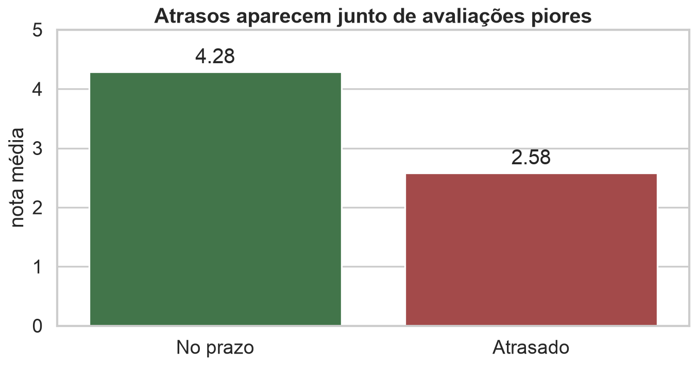
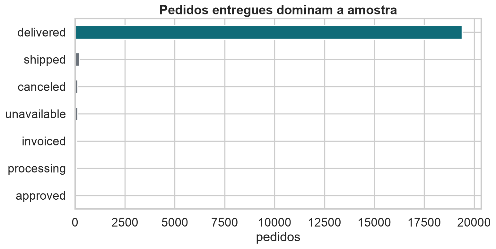
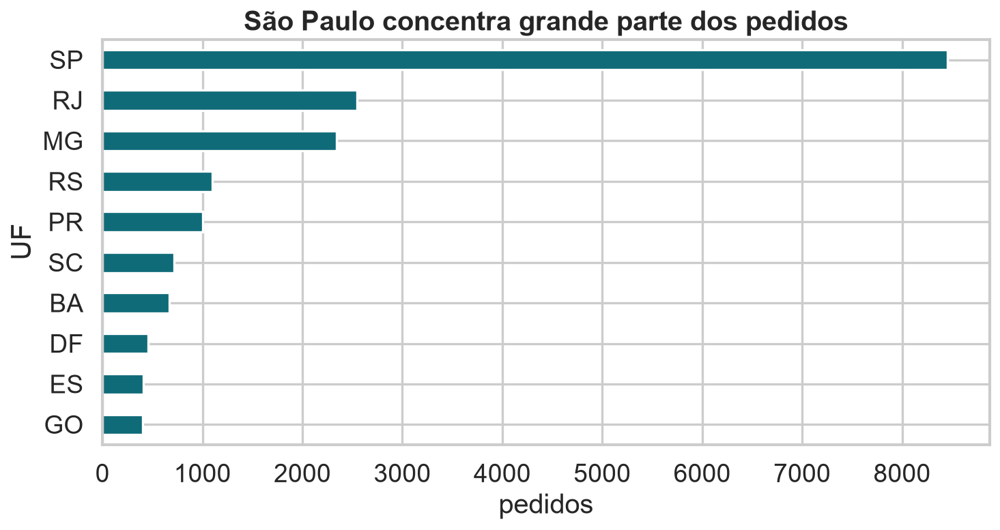
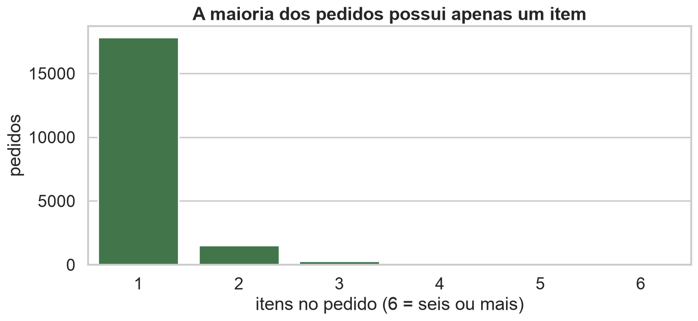
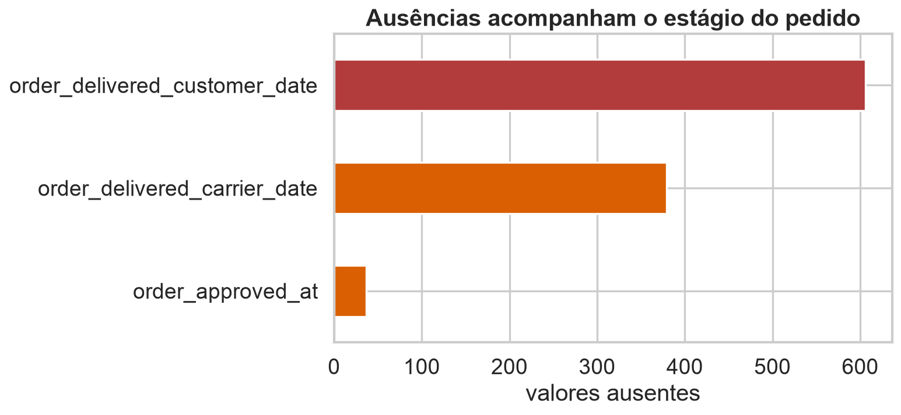
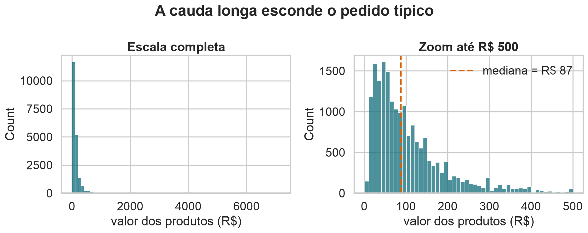
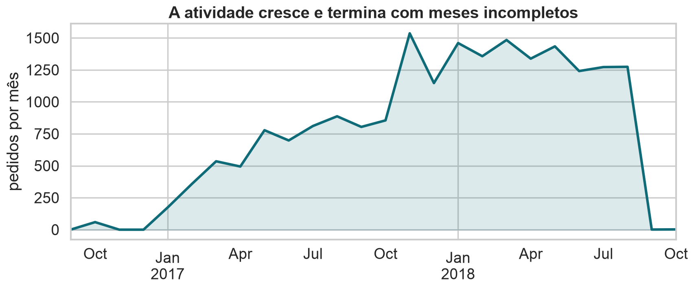
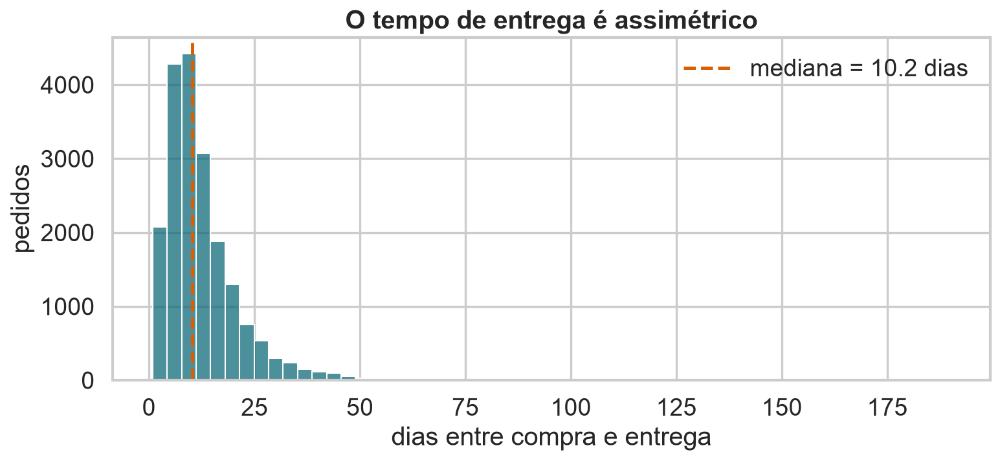
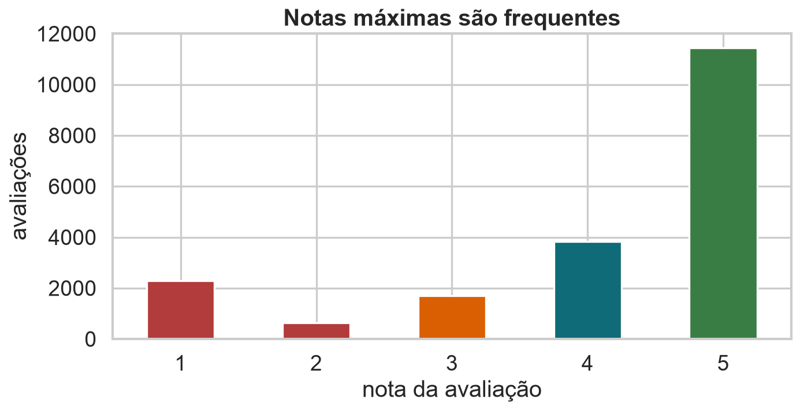

## Módulo 1 · Análise Exploratória

::: {.statement}
Antes de resumir uma base, precisamos descobrir o que suas linhas realmente significam.
:::

## Um atraso aparece na avaliação?

{.wide-chart fig-alt="Nota média de pedidos entregues no prazo e atrasados."}

<details class="code-fold">
<summary>Código do gráfico</summary>

```python
entregues.groupby("atrasou")["nota"].mean()
```
</details>

::: notes
Resultado descritivo, não causal. Atrasos podem estar associados a outros problemas do pedido.
:::

## Hoje

1. Entender a estrutura de uma base relacional.
2. Verificar granularidade, escopo, temporalidade e corretude.
3. Juntar tabelas sem duplicar silenciosamente as observações.
4. Tratar ausências como informação sobre o processo.
5. Construir uma análise exploratória reproduzível.

## A base da aula

**Brazilian E-Commerce Public Dataset by Olist**

- cerca de 100 mil pedidos no conjunto original;
- compras realizadas entre 2016 e 2018;
- clientes, pedidos, itens, pagamentos e avaliações;
- dados comerciais anonimizados;
- amostra didática reprodutível de 20 mil pedidos nesta aula.

Fonte: [Kaggle — Olist Brazilian E-Commerce](https://www.kaggle.com/datasets/olistbr/brazilian-ecommerce).

## O que queremos compreender?

::: {.statement}
Como estrutura, prazo de entrega e experiência do cliente aparecem nos registros da plataforma?
:::

Não tentaremos prever nem afirmar causalidade. O objetivo é aprender a transformar registros em evidência descritiva confiável.

## Uma linha muda de significado entre tabelas

::: {.icd-grid}
::: {.icd-card}
**`orders`**

Uma linha = um pedido.
:::
::: {.icd-card}
**`order_items`**

Uma linha = um item dentro do pedido.
:::
::: {.icd-card}
**`payments`**

Uma linha = uma parcela ou forma de pagamento.
:::
::: {.icd-card}
**`reviews`**

Uma linha = uma avaliação registrada.
:::
:::

## Principais tabelas e chaves {.smaller}

| tabela | linhas na amostra | chave principal | ligação |
|---|---:|---|---|
| `orders` | 20.000 | `order_id` | `customer_id` |
| `customers` | 20.000 | `customer_id` | pedido → cliente |
| `order_items` | 22.735 | `order_id + order_item_id` | item → pedido |
| `payments` | 20.979 | `order_id + payment_sequential` | pagamento → pedido |
| `reviews` | 19.921 | `review_id` | avaliação → pedido |

::: {.code-result}
Há mais itens que pedidos e menos avaliações que pedidos. Essa diferença já revela granularidade e ausência.
:::

## Entregues dominam a amostra

{.wide-chart fig-alt="Quantidade de pedidos por status."}

<details class="code-fold">
<summary>Código do gráfico</summary>

```python
orders["order_status"].value_counts().plot.barh()
```
</details>

::: {.code-result}
**Resultado:** aproximadamente 97% dos pedidos estão marcados como entregues.
:::

## A distribuição geográfica é desigual

{.wide-chart fig-alt="Pedidos nos dez estados com maior frequência."}

<details class="code-fold">
<summary>Código do gráfico</summary>

```python
base["customer_state"].value_counts().head(10).plot.barh()
```
</details>

São Paulo responde por cerca de 42% dos pedidos da amostra.

## EDA é investigação, não decoração

John Tukey popularizou a análise exploratória como uma forma de descobrir estrutura antes de formalizar modelos.

::: {.statement}
Uma visualização é útil quando muda a próxima pergunta que fazemos aos dados.
:::

## Cinco lentes para investigar uma base

::: {.icd-grid}
::: {.icd-card}
**Estrutura** · como os registros se organizam?
:::
::: {.icd-card}
**Granularidade** · o que representa uma linha?
:::
::: {.icd-card}
**Escopo** · quem e o que ficaram de fora?
:::
::: {.icd-card}
**Temporalidade** · quando cada variável foi registrada?
:::
::: {.icd-card}
**Corretude** · os valores respeitam as regras do domínio?
:::
:::

## EDA ocupa o centro do ciclo

```{mermaid}
flowchart LR
  A["Pergunta"] --> B["Coleta"]
  B --> C["Limpeza"]
  C --> D["EDA"]
  D --> E["Modelagem"]
  E --> F["Comunicação"]
  D --> A
  D --> C
```

A exploração frequentemente nos faz voltar à pergunta ou à limpeza.

## Estrutura começa pelos arquivos

Uma base pode chegar como:

- CSV ou TSV;
- JSON;
- planilha;
- banco relacional;
- API;
- logs ou eventos.

O formato físico não define a unidade de observação nem garante qualidade.

## Dados retangulares facilitam operações

Em uma tabela retangular:

- linhas representam observações;
- colunas representam atributos;
- células guardam valores;
- nomes de colunas descrevem variáveis.

::: {.statement}
Retangular é uma forma conveniente, não uma propriedade natural do fenômeno.
:::

## Chaves conectam tabelas

```{mermaid}
flowchart LR
  C["customers<br>customer_id"] --> O["orders<br>order_id"]
  O --> I["order_items<br>order_id + item"]
  O --> P["payments<br>order_id + sequência"]
  O --> R["reviews<br>review_id"]
```

Uma chave deve identificar linhas ou permitir uma ligação com cardinalidade conhecida.

## Granularidade responde “uma linha de quê?”

```python
orders["order_id"].is_unique
items["order_id"].is_unique
```

::: {.code-result}
```text
True
False
```
:::

`order_id` identifica pedidos em `orders`, mas se repete em `order_items`.

## Um pedido pode possuir muitos itens

{.wide-chart fig-alt="Distribuição do número de itens por pedido."}

<details class="code-fold">
<summary>Código do gráfico</summary>

```python
items.groupby("order_id").size().clip(upper=6).value_counts()
```
</details>

Na amostra, a mediana é um item e o máximo chega a 20 itens.

## Um merge pode multiplicar linhas

```python
orders.merge(items, on="order_id").shape
```

::: {.code-result}
```text
(22735, 14)
```
:::

O resultado possui granularidade de **item**, não mais de pedido.

::: {.statement}
Somar pedidos depois desse merge contaria pedidos com vários itens mais de uma vez.
:::

## Agregue antes de voltar ao pedido

```python
item_agg = (
    items.groupby("order_id")
    .agg(
        itens=("order_item_id", "size"),
        valor_produtos=("price", "sum"),
        frete=("freight_value", "sum")
    )
    .reset_index()
)
```

::: {.code-result}
**Resultado:** 19.838 pedidos com itens, uma linha por `order_id`.
:::

## Tipos de junção respondem perguntas diferentes

::: {.join-grid}
::: {.join-card}
**`inner`**

Mantém apenas chaves presentes nos dois lados.
:::
::: {.join-card}
**`left`**

Preserva todas as linhas da tabela principal.
:::
::: {.join-card}
**`right`**

Preserva todas as linhas da tabela adicionada.
:::
::: {.join-card}
**`outer`**

Preserva todas as chaves dos dois lados.
:::
:::

## Declare a cardinalidade esperada

```python
base = orders.merge(
    customers,
    on="customer_id",
    how="left",
    validate="many_to_one"
)
```

::: {.code-result}
**Resultado:** `(20000, 12)` — nenhum pedido foi perdido e cada `customer_id` encontrou no máximo um registro.
:::

`validate` transforma uma suposição silenciosa em teste executável.

## O merge analítico preserva pedidos

```python
analysis = (
    base
    .merge(item_agg, on="order_id", how="left", validate="one_to_one")
    .merge(review_agg, on="order_id", how="left", validate="one_to_one")
)
```

::: {.code-result}
**Resultado:** `analysis.shape` → `(20000, 20)`.
:::

Cada linha continua representando um pedido.

## Escopo define até onde podemos concluir

A base registra pedidos:

- realizados na plataforma Olist;
- em múltiplos marketplaces brasileiros;
- entre setembro de 2016 e outubro de 2018;
- com clientes e vendedores anonimizados.

Ela não representa automaticamente todo o comércio eletrônico brasileiro.

## Ausência pode descrever o processo

{.wide-chart fig-alt="Valores ausentes nas datas de aprovação, envio e entrega."}

<details class="code-fold">
<summary>Código do gráfico</summary>

```python
orders.isna().sum().loc[lambda x: x > 0].plot.barh()
```
</details>

Datas posteriores ao pedido faltam mais frequentemente.

## O status explica parte das ausências

```python
pd.crosstab(
    orders["order_status"],
    orders["order_delivered_customer_date"].isna()
)
```

::: {.code-result}
Pedidos cancelados, enviados ou indisponíveis frequentemente não possuem data de entrega — como esperado pelo processo.
:::

## Três estratégias, três significados

::: {.icd-grid}
::: {.icd-card}
**Manter `NaN`**

Quando a ausência tem significado e a análise aceita valores faltantes.
:::
::: {.icd-card}
**Remover linhas**

Quando a unidade não serve à pergunta e a perda é explicitada.
:::
::: {.icd-card}
**Preencher**

Quando existe uma regra defensável — nunca apenas para “sumir com o NaN”.
:::
:::

## `dropna()` pode mudar a população

```python
orders.dropna().shape
```

::: {.code-result}
O resultado mantém sobretudo pedidos entregues e elimina muitos pedidos interrompidos.
:::

::: {.statement}
Limpar sem registrar a regra redefine silenciosamente o fenômeno estudado.
:::

## Corretude vira um conjunto de testes

```python
assert orders["order_id"].is_unique
assert items["price"].ge(0).all()
assert items["freight_value"].ge(0).all()
assert reviews["review_score"].between(1, 5).all()
```

Testes simples capturam violações antes que entrem em gráficos e resumos.

## Duplicata depende da chave

```python
orders.duplicated().sum()
reviews["order_id"].duplicated().sum()
```

::: {.code-result}
```text
0
112
```
:::

Alguns pedidos possuem mais de uma avaliação. Precisamos agregar antes do merge por pedido.

## A cauda longa esconde o pedido típico

{.wide-chart fig-alt="Histogramas do valor dos pedidos na escala completa e com zoom."}

<details class="code-fold">
<summary>Código do gráfico</summary>

```python
sns.histplot(analysis["valor_produtos"], bins=70)
sns.histplot(analysis.query("valor_produtos <= 500")["valor_produtos"])
```
</details>

::: {.code-result}
**Resultado:** mediana de R$ 86,99; a média é maior por causa da cauda à direita.
:::

## Outlier não é sinônimo de erro

Um valor extremo pode ser:

- erro de digitação;
- unidade incorreta;
- pedido legítimo de alto valor;
- composição de muitos itens;
- evento raro que interessa à análise.

Investigue o registro e o processo antes de remover.

## Temporalidade começa convertendo datas

```python
date_cols = [c for c in orders if c.endswith(("timestamp", "date", "at"))]
orders[date_cols] = orders[date_cols].apply(pd.to_datetime)
```

::: {.code-result}
**Resultado:** compras registradas entre 04/09/2016 e 17/10/2018.
:::

Datas como texto não permitem diferenças, ordenação temporal segura ou reamostragem.

## Os meses finais estão incompletos

{.wide-chart fig-alt="Quantidade mensal de pedidos ao longo do período."}

<details class="code-fold">
<summary>Código do gráfico</summary>

```python
orders.set_index("order_purchase_timestamp").resample("MS").size()
```
</details>

Setembro e outubro de 2018 não devem ser comparados como meses completos.

## A granularidade temporal muda a história

```python
diario = orders.resample("D", on="order_purchase_timestamp").size()
mensal = orders.resample("MS", on="order_purchase_timestamp").size()
```

- diário: revela picos e ruído;
- semanal: suaviza o calendário;
- mensal: mostra tendência, mas esconde eventos curtos.

Escolha a escala que corresponde à pergunta.

## O tempo de entrega é assimétrico

{.wide-chart fig-alt="Distribuição do tempo entre compra e entrega."}

<details class="code-fold">
<summary>Código do gráfico</summary>

```python
entregues["entrega_dias"] = (
    entregues["order_delivered_customer_date"]
    - entregues["order_purchase_timestamp"]
).dt.total_seconds() / 86400
```
</details>

::: {.code-result}
**Resultado:** mediana de 10,2 dias; a média é maior por causa de entregas longas.
:::

## Atraso exige duas datas

```python
entregues["atraso_dias"] = (
    entregues["order_delivered_customer_date"]
    - entregues["order_estimated_delivery_date"]
).dt.total_seconds() / 86400

entregues["atrasou"] = entregues["atraso_dias"] > 0
```

::: {.code-result}
**Resultado:** 8,1% dos pedidos entregues chegaram depois da estimativa.
:::

## Avaliações também são seletivas

{.wide-chart fig-alt="Contagem das notas de avaliação de um a cinco."}

<details class="code-fold">
<summary>Código do gráfico</summary>

```python
reviews["review_score"].value_counts().sort_index().plot.bar()
```
</details>

Notas 5 são frequentes, mas nem todo pedido possui avaliação disponível.

## Atraso e nota se movem juntos

{.wide-chart fig-alt="Nota média segundo atraso da entrega."}

::: {.code-result}
**No prazo:** 4,28 · **Atrasado:** 2,58
:::

A diferença é grande o suficiente para motivar novas perguntas sobre logística e satisfação.

## Associação não fecha a investigação

Pedidos atrasados podem também:

- percorrer distâncias maiores;
- envolver certos vendedores ou produtos;
- ocorrer em períodos de pico;
- sofrer outros problemas não registrados.

::: {.statement}
EDA revela padrões e hipóteses; causalidade exige um desenho de estudo apropriado.
:::

## Um pipeline reproduzível

```python
analysis = (
    orders
    .merge(customers, on="customer_id", validate="many_to_one")
    .merge(item_agg, on="order_id", how="left", validate="one_to_one")
    .merge(review_agg, on="order_id", how="left", validate="one_to_one")
    .assign(
        entrega_dias=lambda d: (
            d.order_delivered_customer_date - d.order_purchase_timestamp
        ).dt.days
    )
)
```

## Atividade: audite uma pergunta

Pergunta: **pedidos com frete mais caro recebem notas piores?**

1. Qual deve ser a unidade de observação?
2. Quais tabelas precisam ser agregadas antes do merge?
3. Que ausências alteram a população analisada?
4. Frete deve ser comparado em reais ou como proporção do pedido?
5. Que fatores confundidores você investigaria?

## Checklist de EDA

1. O que representa cada linha em cada tabela?
2. Quais chaves são únicas e quais se repetem?
3. O merge preservou a granularidade desejada?
4. Quem ficou dentro e fora do escopo?
5. Por que cada valor está ausente?
6. As datas cobrem períodos completos?
7. Quais regras de validade podem ser testadas?
8. O gráfico mostra o padrão e também as exceções?

## O que aprendemos

- EDA investiga como os dados foram produzidos e organizados.
- Granularidade deve ser definida antes de agregar ou juntar.
- Ausência, duplicação e extremos podem conter informação.
- Escala temporal e escopo limitam as conclusões.
- `validate` e testes de domínio tornam a preparação verificável.
- Padrões exploratórios geram hipóteses, não provas causais.

## Material de apoio {.smaller}

- Notebook executado com a análise completa da Olist.
- Dicionário das cinco tabelas usadas na aula.
- Exercícios sobre merge, granularidade, ausências e temporalidade.
- Respostas comentadas e desafios adicionais.
- [Kaggle — base original da Olist](https://www.kaggle.com/datasets/olistbr/brazilian-ecommerce).
- [Computational and Inferential Thinking — Visualization](https://inferentialthinking.com/chapters/07/Visualization.html).

::: {.statement}
**Próxima aula:** como transformar distribuições em comparações visuais honestas?
:::

Na próxima aula, avançaremos de auditoria e preparação para princípios de visualização e descrição de distribuições.
