## Módulo 1 · Análise Exploratória

::: {.statement}
Visualizar é transformar dados em marcas que o sistema perceptivo consegue comparar.
:::

## Hoje

1. Entender por que visualizamos dados.
2. Relacionar tipos de variáveis a marcas e canais visuais.
3. Comparar barras, histogramas, ECDFs, boxplots e dispersões.
4. Entender percepção de posição, comprimento, área e cor.
5. Usar visualização como parte da investigação.

## Visualização serve a três trabalhos

::: {.icd-grid}
::: {.icd-card}
**Explorar** · encontrar estrutura e formular perguntas.
:::
::: {.icd-card}
**Verificar** · detectar erros, ausências e valores improváveis.
:::
::: {.icd-card}
**Comunicar** · tornar uma conclusão examinável por outras pessoas.
:::
:::

## Antes dos gráficos modernos, havia perguntas urgentes

O mapa de cólera de John Snow combinou localização e mortalidade para investigar um surto em Londres.

::: {.statement}
A força do mapa não estava na decoração, mas em aproximar uma pergunta de um padrão espacial.
:::

## Uma visualização é uma codificação

```{mermaid}
flowchart LR
  D[Dados] --> T[Transformação]
  T --> M[Marcas]
  M --> C[Canais visuais]
  C --> P[Percepção]
  P --> I[Interpretação]
```

Pontos, linhas e áreas recebem posição, comprimento, tamanho, forma e cor.

## A palavra-chave é percepção

Uma visualização não é lida como uma tabela. O cérebro compara propriedades visuais antes da interpretação consciente.

::: {.statement}
O gráfico precisa trabalhar com a percepção humana, não exigir que ela seja perfeita.
:::

## Visualização é para pessoas

- Atenção é limitada.
- Comparações precisam ser fáceis de localizar.
- Memória de curto prazo não deve carregar dezenas de valores.
- Convenções ajudam, mas precisam combinar com o dado.

## A base principal da aula

**Palmer Archipelago Penguins**

- 344 pinguins observados entre 2007 e 2009;
- espécies Adelie, Chinstrap e Gentoo;
- ilha, sexo, massa corporal e medidas de bico e nadadeira;
- dados coletados pelo programa Palmer Station LTER.

Fonte: [Kaggle — Palmer Penguins](https://www.kaggle.com/datasets/parulpandey/palmer-archipelago-antarctica-penguin-data).

## O que representa uma linha?

Uma linha corresponde a um pinguim observado.

| coluna | significado | tipo |
|---|---|---|
| `species` | espécie | categórica |
| `island` | ilha | categórica |
| `body_mass_g` | massa corporal | numérica contínua |
| `flipper_length_mm` | comprimento da nadadeira | numérica contínua |
| `sex` | sexo registrado | categórica |

## Uma descrição rápida da base

```python
penguins.shape
penguins["species"].value_counts()
```

::: {.code-result}
**Resultado:** 344 linhas e 7 colunas; 152 Adelie, 124 Gentoo e 68 Chinstrap.
:::

Algumas medidas corporais e registros de sexo estão ausentes.

## Anatomia de um gráfico no Matplotlib

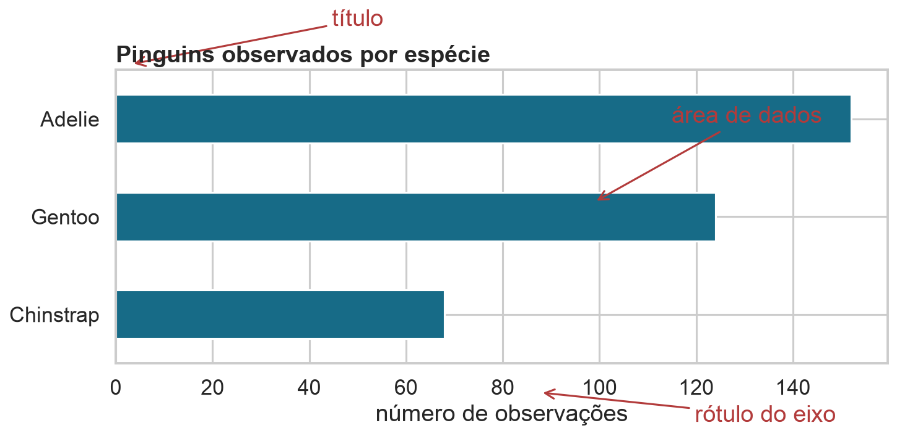{.wide-chart fig-alt="Gráfico de barras anotado com título, área de dados e rótulo do eixo."}

<details class="code-fold" open><summary>Código do gráfico</summary>

```python
fig, ax = plt.subplots()
ax.barh(contagens.index, contagens.values)
ax.set_title("Pinguins observados por espécie")
ax.set_xlabel("número de observações")
```
</details>

`Figure` contém a composição; `Axes` contém a escala, as marcas e os rótulos.

## Categorias pedem contagens comparáveis

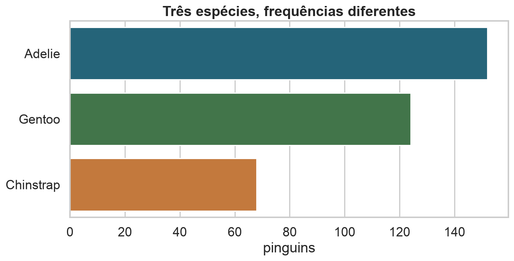{.wide-chart fig-alt="Contagem de pinguins por espécie."}

<details class="code-fold" open><summary>Código do gráfico</summary>

```python
sns.countplot(data=penguins, y="species", order=penguins.species.value_counts().index)
```
</details>

## Barras codificam magnitude por comprimento

- todas partem de uma referência comum;
- o eixo categórico separa grupos;
- ordenar pode revelar hierarquia;
- barras não são histogramas.

::: {.statement}
Para comparar categorias, comprimento alinhado é um canal perceptivo forte.
:::

## Linhas pedem uma variável ordenada

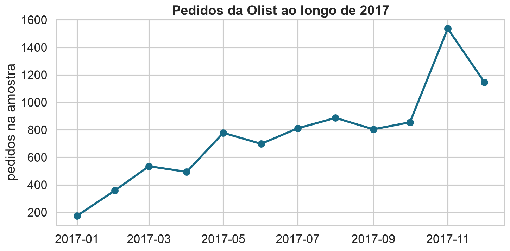{.wide-chart fig-alt="Série mensal de pedidos da Olist durante 2017."}

<details class="code-fold" open><summary>Código do gráfico</summary>

```python
mensal = orders.set_index("order_purchase_timestamp").resample("MS").size()
mensal.plot.line(marker="o")
```
</details>

Conectar meses faz sentido porque o tempo define uma ordem; conectar espécies inventaria um caminho.

## Uma variável numérica pede uma distribuição

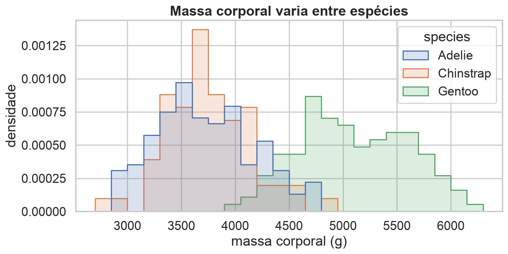{.wide-chart fig-alt="Histogramas da massa corporal por espécie."}

<details class="code-fold" open><summary>Código do gráfico</summary>

```python
sns.histplot(data=penguins, x="body_mass_g", hue="species",
             bins=24, element="step", stat="density", common_norm=False)
```
</details>

Para um valor $x$, cada bin $[a,b)$ conta quantas observações satisfazem $a \le x < b$.

::: {.statement}
O histograma mostra forma, centro, dispersão, caudas e possíveis lacunas.
:::

## O número de bins muda o que vemos

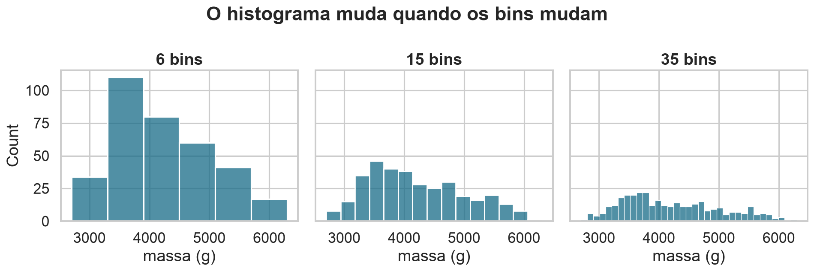{.wide-chart fig-alt="Três histogramas da mesma variável com diferentes quantidades de bins."}

<details class="code-fold" open><summary>Código do gráfico</summary>

```python
for bins in [6, 15, 35]:
    sns.histplot(penguins["body_mass_g"], bins=bins)
```
</details>

- Freedman-Diaconis: $h = 2\,IQR(x)n^{-1/3}$.
- Scott: $h = 3{,}49\,s\,n^{-1/3}$.
- Sturges: $k = 1 + \log_2(n)$.

Nenhuma regra substitui olhar versões alternativas e considerar a resolução relevante para o fenômeno.

## A ECDF evita escolher bins {.smaller}

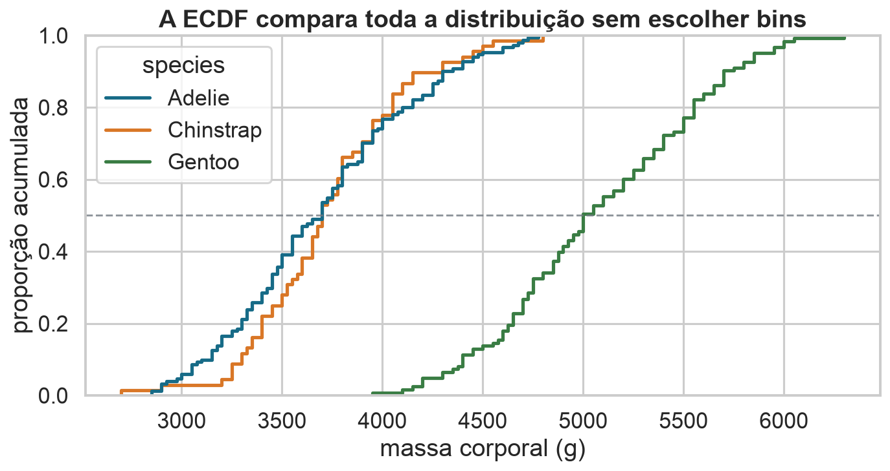{.wide-chart fig-alt="Funções de distribuição empíricas da massa corporal dos pinguins, separadas por espécie."}

<details class="code-fold" open><summary>Código do gráfico</summary>

```python
sns.ecdfplot(data=penguins, x="body_mass_g", hue="species")
```
</details>

$$\widehat F(x)=\frac{1}{n}\sum_{i=1}^n \mathbf{1}(X_i\le x).$$

Ela responde: **qual proporção tem massa menor ou igual a $x$?**

## KDE constrói uma densidade suave {.smaller}

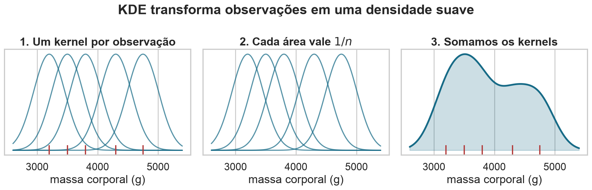{.wide-chart fig-alt="Construção de uma KDE em três passos: kernels nas observações, normalização e soma."}

$$\widehat f_h(x)=\frac{1}{nh}\sum_{i=1}^{n}K\!\left(\frac{x-x_i}{h}\right),\qquad
K(u)=\frac{1}{\sqrt{2\pi}}e^{-u^2/2}.$$

Aqui, $K$ é a Normal padrão, com variância 1. A transformação
$K_h(x-x_i)=h^{-1}K((x-x_i)/h)$ coloca em $x_i$ uma Normal com
**desvio-padrão $h$ e variância $h^2$**. Normalizar e somar produz uma densidade cuja área total é 1.

<details class="code-fold" open><summary>Código do gráfico</summary>

```python
sns.kdeplot(data=penguins, x="body_mass_g", fill=True)
```
</details>

## A largura de banda muda a história

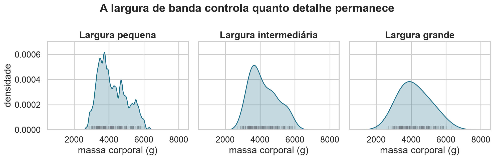{.wide-chart fig-alt="Três KDEs da massa corporal usando larguras de banda pequena, intermediária e grande."}

- $h$ é a largura de banda — o desvio-padrão de cada kernel gaussiano;
- portanto, a variância de cada kernel é $h^2$;
- $h$ pequeno preserva oscilações — inclusive ruído;
- $h$ grande pode apagar grupos e assimetrias;
- como nos bins do histograma, compare escolhas plausíveis.

<details class="code-fold" open><summary>Código do gráfico</summary>

```python
for ajuste in [0.25, 1, 2.5]:
    sns.kdeplot(x=massa, bw_adjust=ajuste)
```
</details>

No Seaborn, `bw_adjust` **multiplica** a largura de banda calculada automaticamente; ele não é necessariamente o $h$ medido em gramas.

## Boxplot e violinplot respondem perguntas diferentes

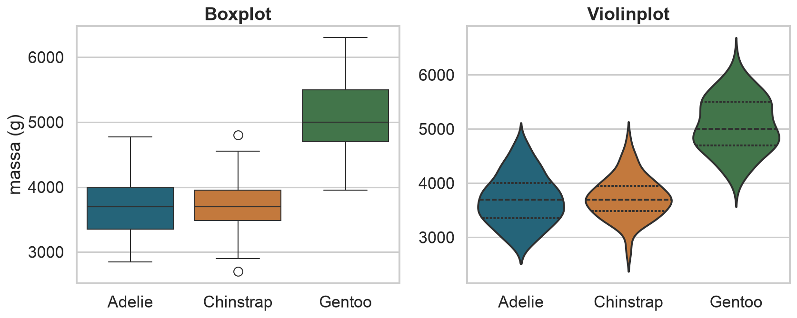{.wide-chart fig-alt="Comparação entre boxplots e violinplots da massa dos pinguins."}

<details class="code-fold" open><summary>Código do gráfico</summary>

```python
sns.boxplot(data=penguins, x="species", y="body_mass_g")
sns.violinplot(data=penguins, x="species", y="body_mass_g", inner="quart")
```
</details>

::: {.code-result}
**Boxplot:** resume mediana, quartis e valores afastados. **Violinplot:** acrescenta a forma estimada da distribuição e pode revelar multimodalidade, mas depende da suavização escolhida.
:::

## Duas variáveis numéricas pedem posição

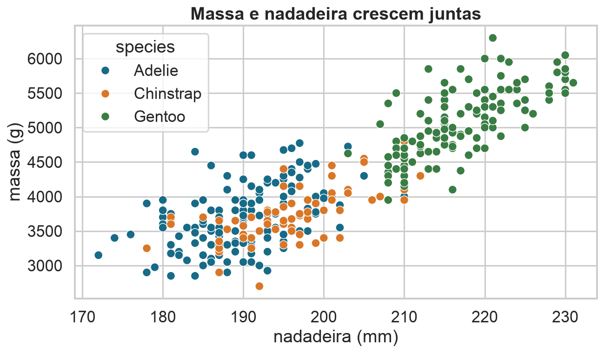{.wide-chart fig-alt="Dispersão entre comprimento da nadadeira e massa corporal."}

<details class="code-fold" open><summary>Código do gráfico</summary>

```python
sns.scatterplot(data=penguins, x="flipper_length_mm", y="body_mass_g", hue="species")
```
</details>

Procure:

- direção;
- intensidade;
- forma;
- grupos;
- valores isolados;
- variação desigual.

Correlação resume apenas parte dessa estrutura.

## Cor acrescenta uma terceira variável

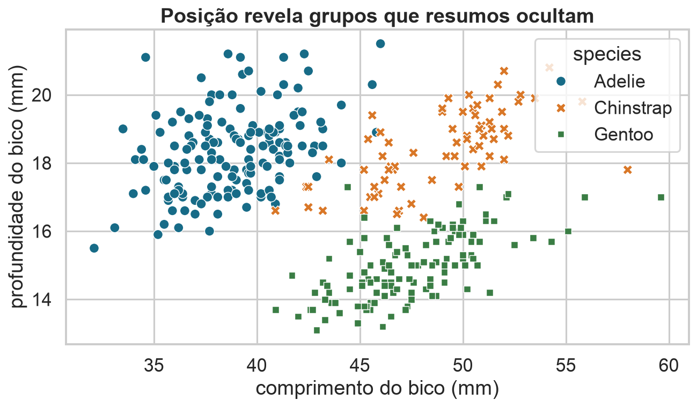{.wide-chart fig-alt="Medidas de bico de três espécies de pinguim."}

<details class="code-fold" open><summary>Código do gráfico</summary>

```python
sns.scatterplot(data=penguins, x="bill_length_mm", y="bill_depth_mm",
                hue="species", style="species")
```
</details>

## Customização deve servir à mensagem

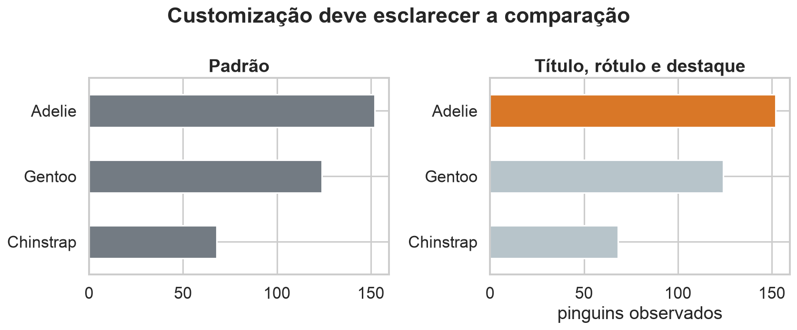{.wide-chart fig-alt="Comparação entre gráfico padrão e gráfico com título, rótulo e destaque visual."}

<details class="code-fold" open><summary>Código do gráfico</summary>

```python
ax.set_title("Pinguins observados por espécie")
ax.set_xlabel("pinguins observados")
ax.barh(..., color=[cinza, cinza, destaque])
```
</details>

Título, eixos e legenda reduzem ambiguidade; destaque orienta a comparação principal.

## De `df.plot()` à figura exportada {.smaller}

```python
ax = penguins["species"].value_counts().plot.barh(color="#176b87")
ax.set_title("Pinguins observados por espécie")
ax.set_xlabel("observações")
fig = ax.get_figure()
fig.savefig("especies.png", dpi=300, bbox_inches="tight")
```

`df.plot()` prepara rapidamente o gráfico; Matplotlib controla a apresentação e a exportação. PNG é adequado para tela; SVG/PDF preservam vetores.

## Posição é percebida com grande precisão

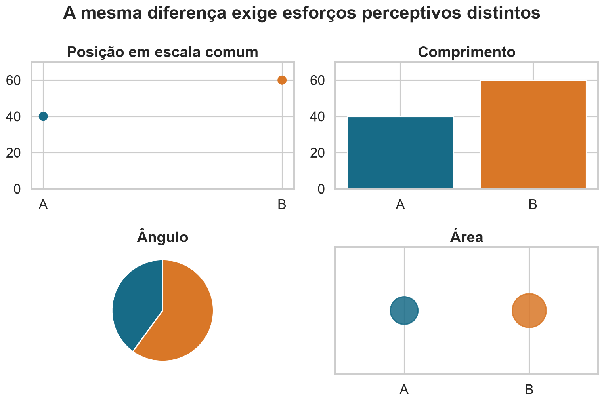{.wide-chart fig-alt="Quatro representações da mesma diferença usando posição, comprimento, ângulo e área."}

<details class="code-fold" open><summary>Código do gráfico</summary>

```python
# Os mesmos valores, 40 e 60, codificados por quatro canais
```
</details>

Posição em escala comum e comprimento permitem comparações mais precisas que ângulo e área.

## Comprimento é mais fácil que área

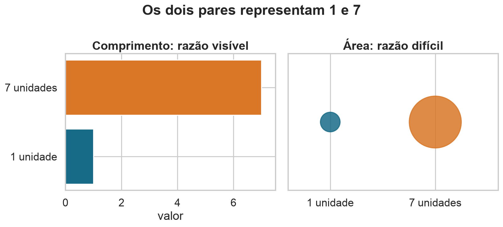{.wide-chart fig-alt="Valores um e sete representados por barras e áreas de círculos."}

<details class="code-fold" open><summary>Código do gráfico</summary>

```python
ax.barh(["1", "7"], [1, 7])
ax.scatter([0, 1], [0, 0], s=np.array([1, 7]) * 900)
```
</details>

Comprimento expõe a razão; comparar áreas exige uma estimativa visual muito menos precisa.

## Ângulos dificultam comparações próximas

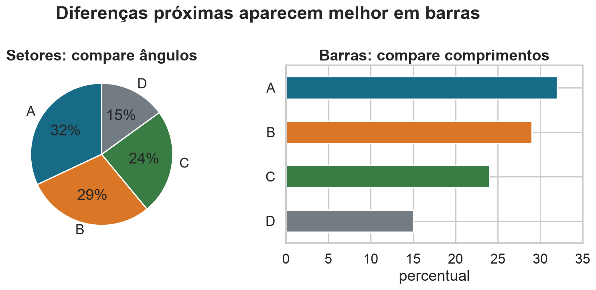{.wide-chart fig-alt="A mesma composição apresentada como gráfico de setores e barras."}

<details class="code-fold" open><summary>Código do gráfico</summary>

```python
ax.pie([32, 29, 24, 15])
ax.barh(["D", "C", "B", "A"], [15, 24, 29, 32])
```
</details>

Setores funcionam melhor com poucas partes e diferenças grandes; barras revelam diferenças próximas.

## Forma distingue categorias, não magnitude

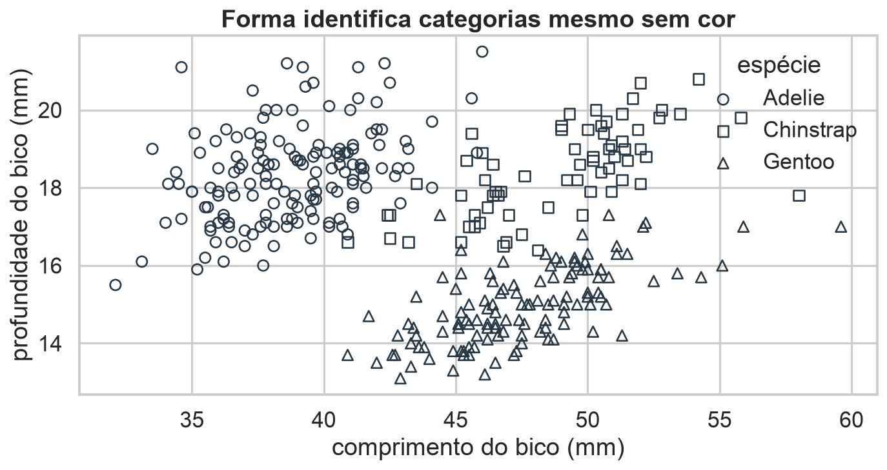{.wide-chart fig-alt="Dispersão de medidas dos pinguins usando círculos, quadrados e triângulos sem preenchimento colorido."}

<details class="code-fold" open><summary>Código do gráfico</summary>

```python
markers = {"Adelie": "o", "Chinstrap": "s", "Gentoo": "^"}
```
</details>

Formas ajudam com poucos grupos e funcionam sem cor, mas não possuem ordem natural.

## Cor possui funções diferentes

::: {.icd-grid}
::: {.icd-card}
**Qualitativa** · distinguir categorias.
:::
::: {.icd-card}
**Sequencial** · representar baixo → alto.
:::
::: {.icd-card}
**Divergente** · mostrar desvios em torno de um centro.
:::
:::

## Luminância cria ordem

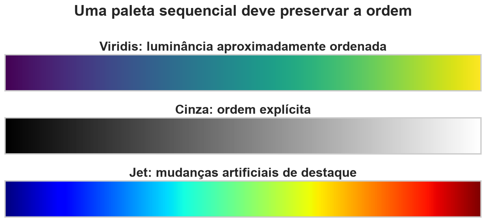{.wide-chart fig-alt="Comparação de gradientes Viridis, cinza e Jet."}

<details class="code-fold" open><summary>Código do gráfico</summary>

```python
ax.imshow(gradient, cmap="viridis", aspect="auto")
```
</details>

`viridis` preserva melhor a progressão perceptiva; `jet` cria faixas de destaque que não existem nos dados.

## Vermelho e verde não bastam

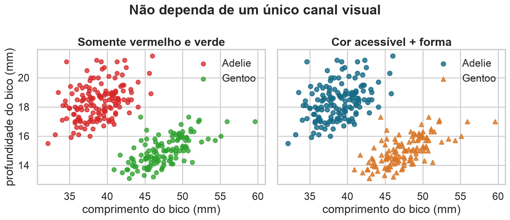{.wide-chart fig-alt="Comparação entre codificação vermelho-verde e alternativa azul-laranja acompanhada de formas."}

<details class="code-fold" open><summary>Código do gráfico</summary>

```python
sns.scatterplot(..., hue="species", style="species", palette="colorblind")
```
</details>

Cor acompanhada de forma permanece legível quando a distinção cromática falha.

## O mesmo resumo pode esconder um dinossauro {.smaller}

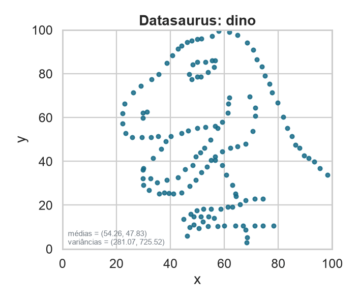{.wide-chart fig-alt="Animação do Datasaurus Dozen alternando conjuntos com resumos semelhantes e formas distintas."}

::: {.statement}
O algoritmo move pontos preservando aproximadamente os resumos: estatísticas são projeções da base; visualizar revela o que foi perdido.
:::

::: notes
Fonte: Matejka e Fitzmaurice (2017), dados do pacote `datasauRus`.
:::

## O Datasaurus formaliza o alerta

Para quase todos os treze conjuntos:

$$\bar x\approx54{,}27,\quad \bar y\approx47{,}83,$$
$$s_x^2\approx281,\quad s_y^2\approx726,\quad r\approx-0{,}06.$$

Os números concordam; as formas não.

## As formas aparecem quando plotamos

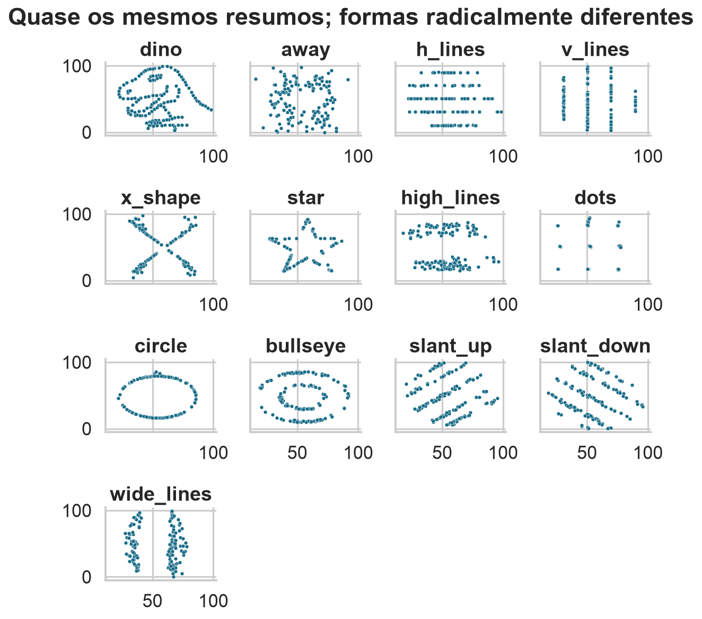{.wide-chart fig-alt="Grade com treze conjuntos Datasaurus de formas distintas."}

<details class="code-fold" open><summary>Código do gráfico</summary>

```python
sns.relplot(data=datasaurus, x="x", y="y", col="dataset", col_wrap=4)
```
</details>

## Agregar é perder informação

Médias, medianas e correlações são úteis, mas não mostram sozinhas:

- multimodalidade;
- não linearidade;
- grupos;
- lacunas;
- valores influentes;
- heterogeneidade.

## Visualização também detecta erros

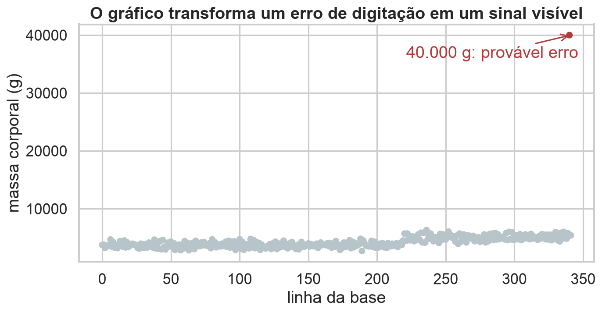{.wide-chart fig-alt="Massas de pinguins por linha, com um valor impossível de quarenta mil gramas destacado."}

<details class="code-fold" open><summary>Código do gráfico</summary>

```python
plt.scatter(base.index, base["body_mass_g"])
plt.annotate("provável erro", xy=(linha, 40000))
```
</details>

::: {.statement}
Um zero extra produz um ponto impossível: o gráfico é parte da auditoria.
:::

## Comparações pedem domínio comum

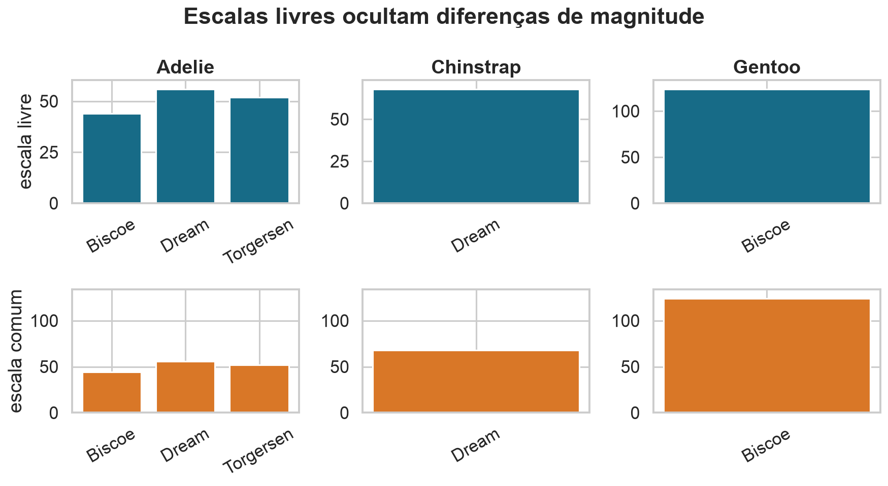{.wide-chart fig-alt="Contagens por ilha e espécie usando escalas livres e escala vertical comum."}

<details class="code-fold" open><summary>Código do gráfico</summary>

```python
g = sns.catplot(..., col="species", sharey=True)
```
</details>

Escalas independentes fazem diferenças pequenas parecerem equivalentes a mudanças grandes.

## Facetas condicionam sem misturar

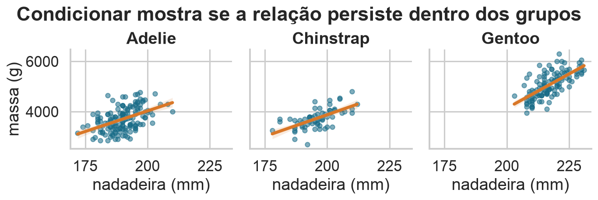{.wide-chart fig-alt="Relação entre nadadeira e massa corporal em facetas separadas por espécie."}

<details class="code-fold" open><summary>Código do gráfico</summary>

```python
sns.lmplot(data=penguins, x="flipper_length_mm", y="body_mass_g",
           col="species", sharex=True, sharey=True)
```
</details>

Use facetas para perguntar: **o padrão permanece dentro de cada grupo?**

## Relação não implica mecanismo

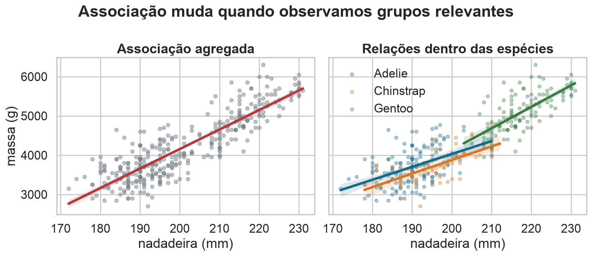{.wide-chart fig-alt="Comparação da associação agregada entre massa e nadadeira com associações separadas por espécie."}

<details class="code-fold" open><summary>Código do gráfico</summary>

```python
sns.regplot(data=penguins, x="flipper_length_mm", y="body_mass_g")
sns.lmplot(..., col="species")
```
</details>

Condicionar muda a relação visual, mas ainda não identifica um mecanismo causal.

## Uma escolha de gráfico é uma escolha de pergunta

| pergunta | gráfico inicial |
|---|---|
| quantas observações por categoria? | barras |
| qual é a forma de uma variável? | histograma ou ECDF |
| como grupos diferem? | box/violin + pontos |
| duas medidas variam juntas? | dispersão |
| como algo muda no tempo? | linha |

## Checklist de leitura

1. O que representa uma linha?
2. Quais variáveis estão codificadas?
3. Por qual canal visual?
4. Há escala, unidade e referência comuns?
5. O que o gráfico mostra — e o que ele omite?

## Síntese

- Visualização complementa estatísticas.
- Posição e comprimento sustentam comparações precisas.
- Histogramas dependem dos bins; ECDFs não.
- Área, ângulo e cor exigem cautela.
- O gráfico deve responder a uma pergunta explícita.

## Material de apoio

- Notebook executado com Palmer Penguins e Datasaurus.
- Código de todos os gráficos da aula.
- Exercícios sobre canais, distribuições e escolhas de representação.
- [Palmer Penguins no Kaggle](https://www.kaggle.com/datasets/parulpandey/palmer-archipelago-antarctica-penguin-data).
- [Same Stats, Different Graphs](https://www.autodesk.com/research/publications/same-stats-different-graphs).

::: {.statement}
**Próxima aula:** como transformar esses fundamentos em boas práticas de comunicação?
:::
