## Módulo 1 · Análise Exploratória

::: {.statement}
Um bom gráfico torna a comparação correta mais fácil e a interpretação errada mais difícil.
:::

## Hoje

1. Definir a mensagem antes de desenhar.
2. Escolher escalas, ordem e contexto honestos.
3. Usar cor e destaque com intenção.
4. Reduzir ruído sem apagar evidência.
5. Comparar representações da mesma base.

## A base principal da aula

**TMDB 5000 Movie Dataset**

- 4.803 filmes;
- orçamento, receita, popularidade, votos, duração e data;
- gêneros e produtoras em campos estruturados;
- dados oriundos da API do The Movie Database.

Fonte: [Kaggle — TMDB 5000](https://www.kaggle.com/datasets/tmdb/tmdb-movie-metadata).

Para condicionamento espacial e temporal, retomaremos também a amostra da **Olist**, com pedidos brasileiros de 2017 ligados ao estado do cliente.

## O objetivo da base

Investigar como escolhas visuais alteram conclusões sobre:

- composição por gênero;
- notas e popularidade;
- orçamento, receita e lucro;
- mudanças ao longo do tempo.

Uma linha representa um filme.

## Principais colunas

| coluna | significado | cuidado |
|---|---|---|
| `budget` | orçamento informado | zero pode significar ausência |
| `revenue` | receita informada | cobertura desigual |
| `vote_average` | média das notas | depende de `vote_count` |
| `genres` | gêneros em JSON | um filme pode ter vários |
| `release_date` | lançamento | base incompleta no tempo |

## Descrição rápida

```python
movies.shape
movies[["budget", "revenue", "vote_average"]].describe()
```

::: {.code-result}
**Resultado:** 4.803 filmes. Para relações financeiras, usamos 3.157 registros com orçamento e receita acima de US$ 100 mil.
:::

## Comece pela pergunta, não pelo gráfico

Perguntas distintas pedem representações distintas:

- **ranking:** quem está acima?
- **distribuição:** como os valores se espalham?
- **relação:** duas medidas variam juntas?
- **composição:** como um total se divide?
- **mudança:** como evolui no tempo?

## O título deve entregar o ponto

“Receita por gênero” apenas nomeia variáveis.

“A dispersão dentro dos gêneros supera a diferença entre suas medianas” comunica uma leitura verificável.

::: {.statement}
Título bom é uma afirmação sustentada pelo gráfico.
:::

## Barras ordenadas reduzem trabalho mental

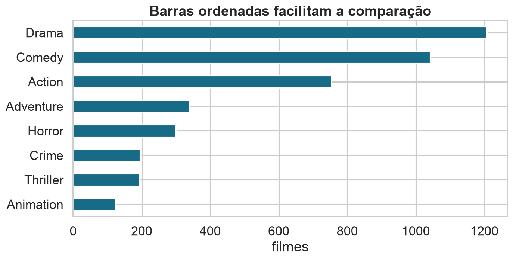{.wide-chart fig-alt="Gêneros de filmes ordenados por contagem."}

<details class="code-fold"><summary>Código do gráfico</summary>

```python
movies["main_genre"].value_counts().head(8).sort_values().plot.barh()
```
</details>

## Barras precisam de zero

O comprimento da barra codifica a magnitude desde uma origem.

Se o eixo começa perto do menor valor, a parte visível deixa de representar corretamente a razão entre categorias.

Linhas e pontos não têm a mesma obrigação quando a pergunta é sobre variação em torno de um nível.

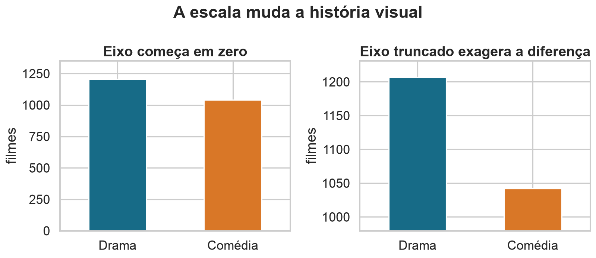{.wide-chart fig-alt="Comparação entre barras com eixo correto e eixo truncado."}

<details class="code-fold"><summary>Código do gráfico</summary>

```python
pair = movies["main_genre"].value_counts().loc[["Drama", "Comedy"]]
ax.set_ylim(0, pair.max())          # comparação honesta
ax.set_ylim(pair.min() * .94, ...)  # diferença exagerada
```
</details>

Os valores são os mesmos nos dois painéis: **1.207 dramas e 1.042 comédias**.

## Escalas duplas confundem comparações

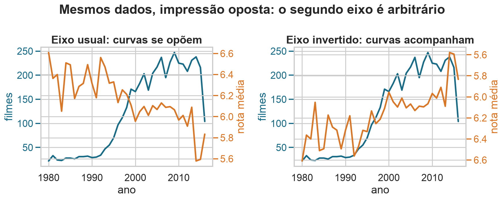{.wide-chart fig-alt="Os mesmos dados de filmes e notas parecem se opor com o segundo eixo usual e acompanhar-se quando esse eixo é invertido."}

<details class="code-fold"><summary>Código do gráfico</summary>

```python
ax2 = ax.twinx()
ax.plot(annual["year"], annual["filmes"])
ax2.plot(annual["year"], annual["nota"], color="orange")
ax2.invert_yaxis()  # escolha possível, mas enganosa
```
</details>

Dois eixos verticais permitem que qualquer par de curvas pareça acompanhar-se. Aqui, **os dados são idênticos nos dois painéis**; apenas o segundo eixo foi invertido.

Prefira:

- índices com uma base comum;
- painéis alinhados;
- variação percentual claramente definida;
- uma relação direta em dispersão.

## Escala linear esconde caudas longas

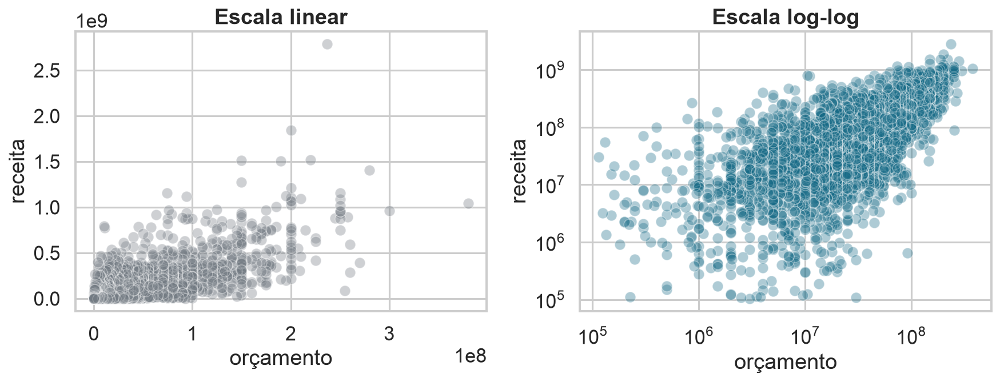{.wide-chart fig-alt="Orçamento e receita de filmes em escalas linear e logarítmica."}

<details class="code-fold"><summary>Código do gráfico</summary>

```python
sns.scatterplot(data=valid, x="budget", y="revenue")
plt.xscale("log"); plt.yscale("log")
```
</details>

## Log transforma razões em distâncias

Em escala logarítmica, multiplicações iguais ocupam distâncias iguais:

$$\log(ab)=\log(a)+\log(b).$$

Passar de 1 para 10 ocupa o mesmo espaço que passar de 10 para 100.

## Log exige contexto

- informe a transformação;
- use marcas em valores interpretáveis;
- não aplique log a zero sem decidir o significado;
- explique se a relação relevante é multiplicativa.

Transformar pode revelar estrutura, mas muda a pergunta visual.

## Tempo possui ordem

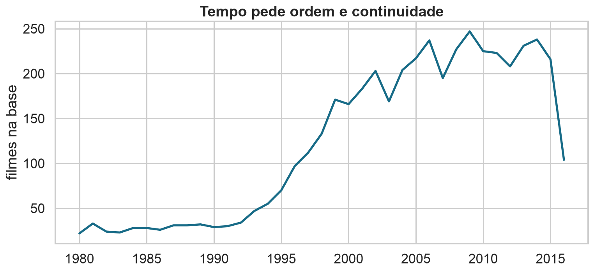{.wide-chart fig-alt="Número de filmes por ano na base TMDB."}

<details class="code-fold"><summary>Código do gráfico</summary>

```python
movies.groupby("year").size().loc[1980:2016].plot.line()
```
</details>

## Linhas sugerem continuidade

Use linha quando:

- o eixo possui ordem;
- intervalos adjacentes são comparáveis;
- conectar pontos tem significado.

Não conecte categorias nominais: a linha inventaria um caminho entre elas.

## Datas precisam refletir o processo

Data de lançamento, data de registro e data de atualização não são intercambiáveis.

::: {.statement}
O eixo temporal deve representar o acontecimento que a pergunta menciona.
:::

## Observar uma razão muda a pergunta

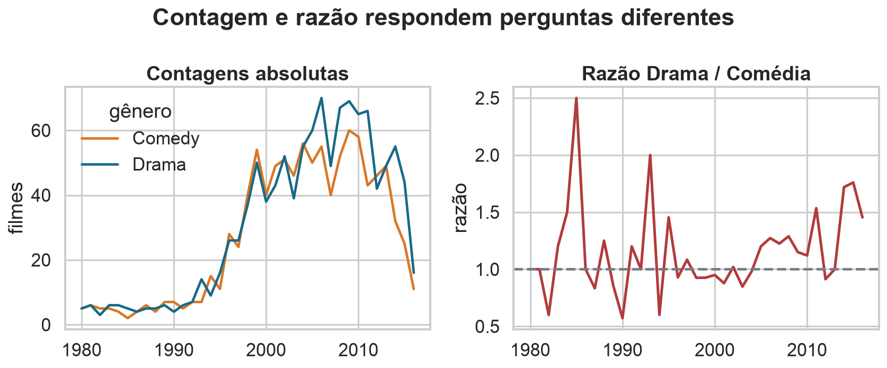{.wide-chart fig-alt="Contagens anuais de dramas e comédias ao lado da razão entre as duas contagens."}

<details class="code-fold"><summary>Código do gráfico</summary>

```python
contagens = movies.groupby(["year", "main_genre"]).size().unstack()
razao = contagens["Drama"] / contagens["Comedy"]
```
</details>

Contagem mede volume; razão mede a composição relativa entre dois gêneros.

## Justaposição: mesmo domínio, lado a lado

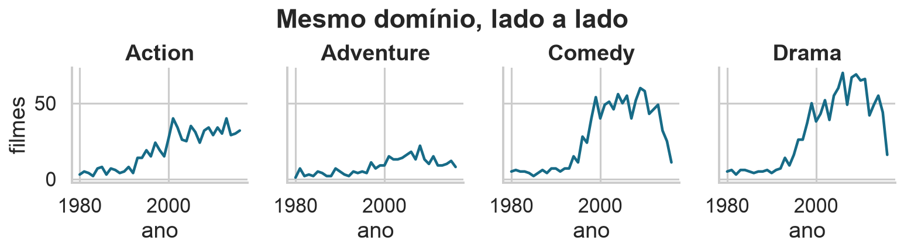{.wide-chart fig-alt="Quatro séries anuais de filmes apresentadas lado a lado com os mesmos eixos."}

<details class="code-fold"><summary>Código do gráfico</summary>

```python
sns.relplot(data=annual, x="year", y="filmes", col="main_genre",
            kind="line", sharex=True, sharey=True)
```
</details>

A escala comum permite comparar tendência e magnitude sem misturar as séries.

## Condicionando por espaço e tempo

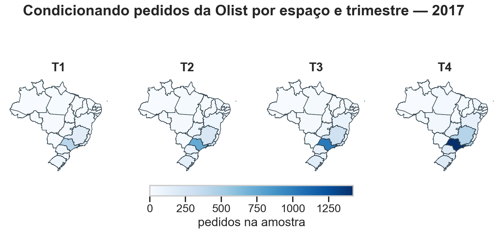{.wide-chart fig-alt="Quatro mapas do Brasil mostrando pedidos da Olist por estado e trimestre de 2017."}

<details class="code-fold"><summary>Código do gráfico</summary>

```python
pedidos = olist.groupby(["trimestre", "customer_state"]).size()
# quatro mapas, mesmo domínio de cores e contornos visíveis
PatchCollection(estados, edgecolor="#34454f", linewidth=.8)
```
</details>

O contorno dos estados mantém a forma do Brasil legível mesmo nas regiões com preenchimento claro.

Um mapa anual esconderia quando a concentração ocorreu; um gráfico temporal sem mapa esconderia onde.

## Distribuições contam mais que médias

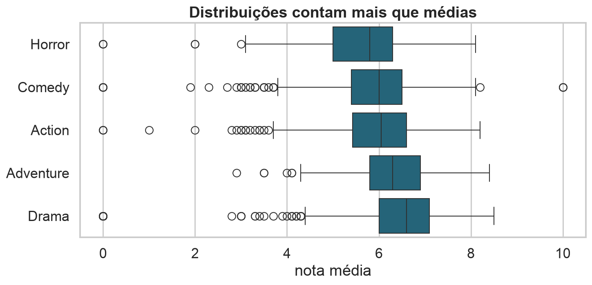{.wide-chart fig-alt="Boxplots de notas de filmes por gênero."}

<details class="code-fold"><summary>Código do gráfico</summary>

```python
sns.boxplot(data=movies, x="vote_average", y="main_genre")
```
</details>

## Mostre a incerteza quando ela importa

Uma média baseada em 20 votos não tem a mesma estabilidade que outra baseada em 20 mil.

Use intervalos, pontos brutos, tamanho da amostra ou transparência sobre a cobertura.

## Comparar partes: ângulos ou comprimentos?

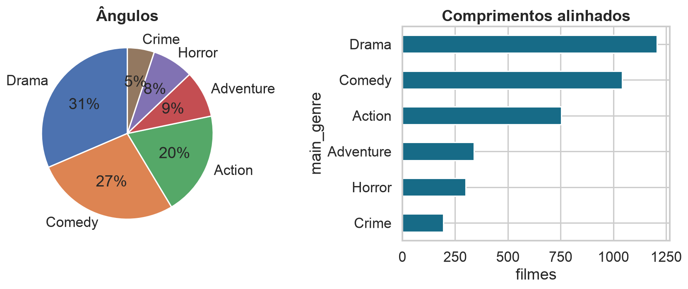{.wide-chart fig-alt="A mesma composição de gêneros em pizza e barras."}

<details class="code-fold"><summary>Código do gráfico</summary>

```python
ax.pie(share, labels=share.index)
share.sort_values().plot.barh()
```
</details>

## Cor qualitativa separa grupos

Use matizes diferentes para categorias sem ordem.

- limite o número de cores;
- preserve contraste;
- não atribua gradiente a categorias nominais;
- mantenha o mesmo significado entre painéis.

## Cor sequencial mostra magnitude

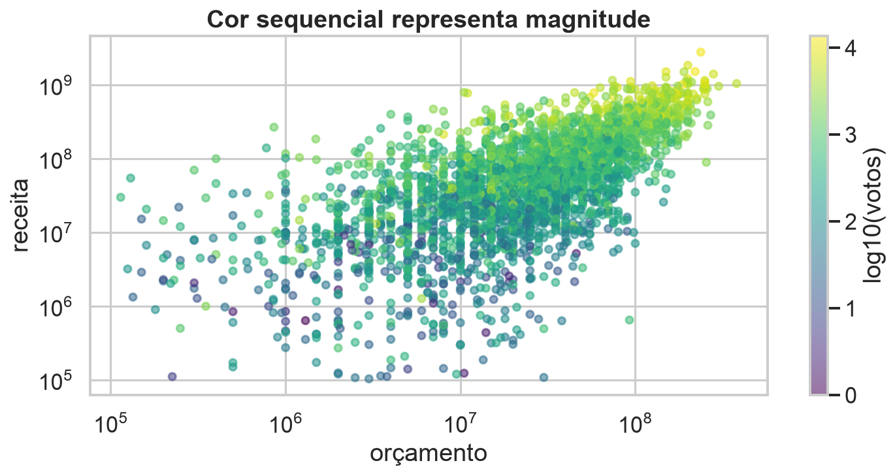{.wide-chart fig-alt="Dispersão de orçamento e receita colorida pela quantidade de votos."}

<details class="code-fold"><summary>Código do gráfico</summary>

```python
plt.scatter(valid.budget, valid.revenue,
            c=np.log10(valid.vote_count), cmap="viridis")
```
</details>

## Cor divergente precisa de um centro

Use uma escala divergente quando existe um ponto de referência significativo:

- zero;
- média;
- meta;
- ausência de mudança.

Sem centro, duas cores opostas inventam uma ruptura.

## Destaque orienta a atenção

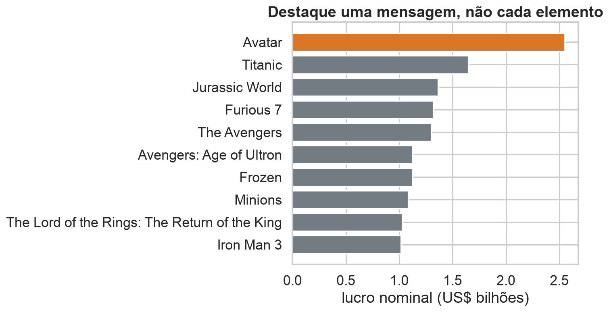{.wide-chart fig-alt="Ranking de filmes por lucro com um único destaque em laranja."}

<details class="code-fold"><summary>Código do gráfico</summary>

```python
colors = ["#b7c4ca"] * 9 + ["#d97727"]
plt.barh(best["original_title"], best["profit"], color=colors)
```
</details>

## Cinza é parte da paleta

Quando tudo tem cor forte, nada se destaca.

Use cinza para contexto e uma cor de acento para a observação ligada ao título.

::: {.statement}
Destaque é hierarquia, não ornamentação.
:::

## Ruído compete com os dados

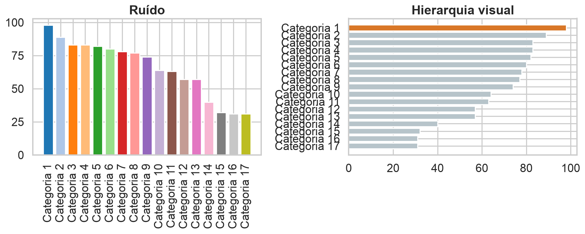{.wide-chart fig-alt="Comparação entre gráfico carregado e versão com hierarquia visual."}

<details class="code-fold"><summary>Código do gráfico</summary>

```python
ax.barh(categorias, valores, color=[acento if foco else cinza])
```
</details>

## Remova o que não ajuda a comparação

- bordas pesadas;
- fundos saturados;
- grades em excesso;
- efeitos 3D;
- legendas distantes;
- casas decimais sem significado;
- rótulos repetidos.

## Mas simplificar não é apagar contexto

Todo gráfico compartilhado precisa, conforme o caso, de:

- título informativo;
- unidades;
- período e população;
- fonte;
- definição da métrica;
- tamanho da amostra;
- notas sobre filtros ou transformações.

## Anotação aproxima evidência e interpretação

Uma linha de referência ou rótulo direto pode substituir uma explicação distante.

Anote exceções relevantes, mudanças de regime e valores ligados ao argumento — não cada ponto.

## Legendas aumentam a distância visual

Quando possível, rotule linhas e categorias diretamente.

Se a legenda for necessária:

- preserve a mesma ordem do gráfico;
- aproxime-a da área de dados;
- use nomes legíveis;
- evite códigos que exigem decifração.

## Razão de aspecto altera inclinações

Um gráfico muito estreito torna curvas mais íngremes; um gráfico largo as achata.

Use proporções estáveis entre comparações e evite escolher o formato apenas porque ele dramatiza a mudança.

## Sobreposição pede transparência ou agregação

Para muitos pontos:

- reduza tamanho;
- use transparência;
- aplique `hexbin` ou densidade;
- amostre com transparência;
- faça facetas.

Não confunda saturação visual com concentração real.

## Muitos dados não significam muitos elementos

Uma boa visualização de milhões de observações pode ser simples se a agregação preserva a pergunta.

O risco é esconder grupos pequenos ou variações internas. Sempre examine a granularidade antes de agregar.

## Acessibilidade faz parte da precisão

- contraste suficiente;
- fonte legível;
- descrição alternativa;
- cor acompanhada de outro canal;
- animação com ritmo compreensível;
- linguagem direta.

## Ética: o gráfico também argumenta

Escolhas de filtro, escala, ordem e destaque influenciam a conclusão.

::: {.statement}
Não existe visualização neutra, mas existe visualização transparente e auditável.
:::

## Um fluxo de trabalho reproduzível

```{mermaid}
flowchart LR
  P[Pergunta] --> D[Dados]
  D --> E[Esboço]
  E --> V[Verificação]
  V --> C[Contexto]
  C --> R[Revisão]
```

Revise o gráfico na escala em que será apresentado.

## Checklist antes de publicar

1. A mensagem corresponde aos dados?
2. Escalas e unidades são honestas?
3. O gráfico permite a comparação desejada?
4. Há contexto suficiente para interpretar?
5. Cor e destaque têm função?
6. O resultado funciona sem explicação oral?

## Crítica guiada

Ao encontrar um gráfico ruim, não pare em “está feio”. Pergunte:

- qual tarefa ficou difícil?
- qual canal visual falhou?
- que contexto está ausente?
- que representação resolveria o problema?

## Síntese

- Defina a pergunta e a comparação.
- Preserve escalas e referências honestas.
- Use ordem, posição e destaque para reduzir esforço.
- Acrescente contexto sem poluir.
- Mostre limitações, filtros e incerteza.

## O Módulo 1 fecha aqui

Nas aulas 03–06, passamos de tabelas e tipos de dados para EDA e visualização.

::: {.statement}
Agora sabemos estruturar, investigar e comunicar padrões antes de avançar para probabilidade e inferência.
:::

## Material de apoio

- Notebook executado com TMDB 5000.
- Comparações entre representações boas e problemáticas.
- Exercícios de crítica e redesenho.
- [TMDB 5000 no Kaggle](https://www.kaggle.com/datasets/tmdb/tmdb-movie-metadata).
- [Fundamentals of Data Visualization](https://clauswilke.com/dataviz/).
- [Visualization Analysis and Design](https://www.cs.ubc.ca/~tmm/vadbook/).
