## Tendências Centrais

::: {.statement}
Como resumir uma coluna numérica sem apagar a história que ela conta?
:::

Exemplo da aula: duração de músicas no dataset Billboard Hits Songs.

## Hoje

- Amostra e população
- Análise descritiva inicial da base
- Visualização antes de agregação
- Histograma e CDF empírica
- Média, mediana e outliers
- Quartis, boxplot e quantis
- Dispersão
- Transformações
- Médias geométrica e harmônica

## O problema da aula

Queremos responder:

::: {.statement}
Qual é uma duração "típica" de uma faixa?
:::

Parece simples, mas depende da distribuição, dos outliers e da pergunta de
comunicação.

## Exemplo central

No notebook, cada linha é uma música.

| coluna | significado |
|---|---|
| `Title` | título da música |
| `Artist` | artista |
| `Genre` | gênero musical |
| `Duration` | duração no formato minuto:segundo |
| `Popularity` | escore de popularidade |

Fonte: Kaggle, `dem0nking/billboard-hits-songs-dataset`.

## Conhecendo a base

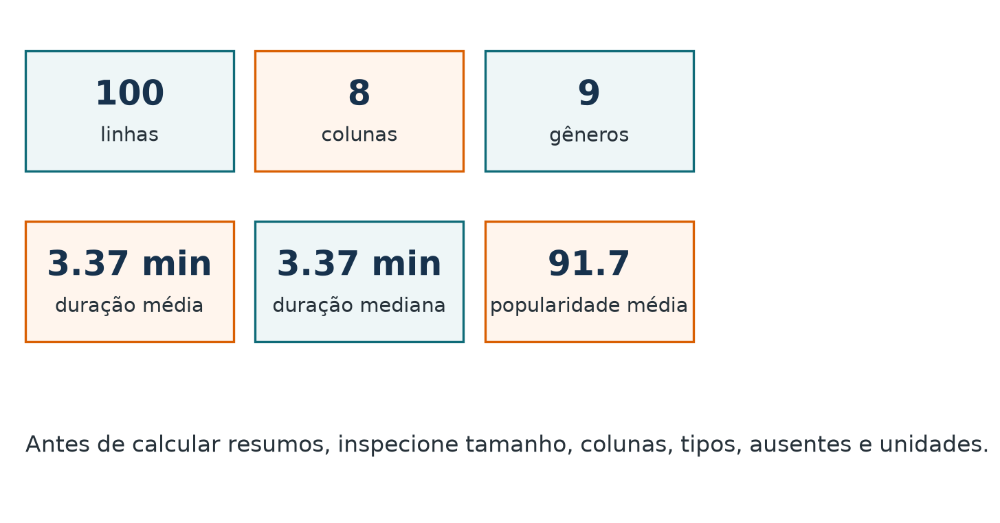{fig-alt="Resumo descritivo do dataset Billboard com número de linhas, colunas, gêneros, duração média, duração mediana e popularidade média."}

<details class="code-fold">
<summary>Código do gráfico</summary>

```python
metrics = [
    ("linhas", len(songs)),
    ("colunas", songs.shape[1]),
    ("gêneros", songs["Genre"].nunique()),
    ("duração média", f"{songs['duration_min'].mean():.2f} min"),
    ("duração mediana", f"{songs['duration_min'].median():.2f} min"),
    ("popularidade média", f"{songs['Popularity'].mean():.1f}"),
]
```

</details>

Antes de calcular qualquer resumo, precisamos saber o tamanho, as variáveis e as
unidades da base.

## Diagnóstico inicial

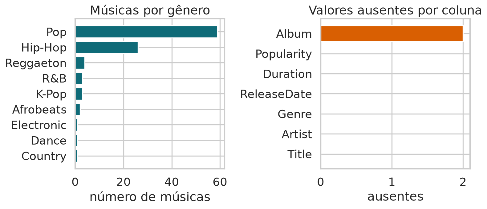{fig-alt="Gráficos de barras com número de músicas por gênero e valores ausentes por coluna."}

<details class="code-fold">
<summary>Código do gráfico</summary>

```python
fig, axes = plt.subplots(1, 2, figsize=(10, 4.6))

songs["Genre"].value_counts().sort_values().plot.barh(
    ax=axes[0], color="#0f6b78"
)
raw.isna().sum().sort_values().plot.barh(
    ax=axes[1], color="#d95f02"
)
```

</details>

Análise descritiva começa com perguntas simples: há categorias dominantes? Há
valores ausentes? A variável numérica está na unidade certa?

## Amostra e população

::: {.sample-figure}
::: {.population-bubble}
**População**

Todas as músicas que gostaríamos de entender
:::

::: {.sample-bubble}
**Amostra**

Músicas observadas
:::

::: {.sample-caption}
Hoje descrevemos a amostra. Em aulas futuras, perguntaremos quando ela permite
generalizar para a população.
:::
:::

## A grande pergunta estatística

::: {.statement}
As estimativas feitas na amostra capturam tendências populacionais?
:::

Antes de generalizar, precisamos aprender a descrever bem a amostra.

## Regra da aula

::: {.viz-rule}
::: {.viz-rule-main}
**Visualize primeiro**
:::

::: {.viz-rule-side}
Depois calcule médias, medianas, quartis e desvios.
:::
:::

Agregações são úteis, mas escondem forma, caudas e valores extremos.

## Pipeline descritivo

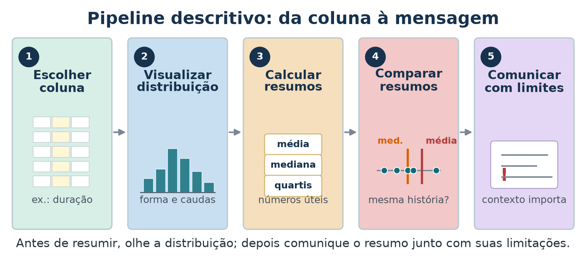{fig-alt="Pipeline descritivo em cinco etapas: escolher coluna, visualizar distribuição, calcular resumos, comparar resumos e comunicar com limites."}

O resumo final depende das escolhas feitas antes dele.

## Histograma

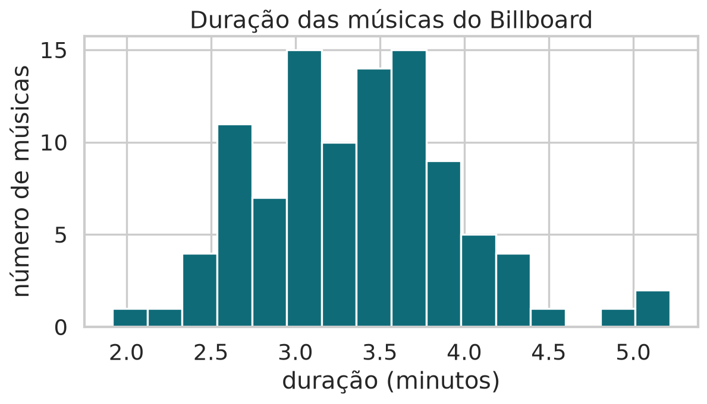{fig-alt="Histograma da duração das músicas do dataset Billboard."}

<details class="code-fold">
<summary>Código do gráfico</summary>

```python
fig, ax = plt.subplots(figsize=(8, 4.5))
ax.hist(
    songs["duration_min"],
    bins=16,
    color="#0f6b78",
    edgecolor="white"
)
ax.set_xlabel("duração (minutos)")
ax.set_ylabel("número de músicas")
```

</details>

Um histograma conta quantas observações caem em cada faixa de valores.

## Lendo um histograma

- Onde os dados se concentram?
- Há cauda à direita ou à esquerda?
- Há valores extremos?
- O zero tem significado?
- O resumo por um número parece razoável?

## Escolha de bins

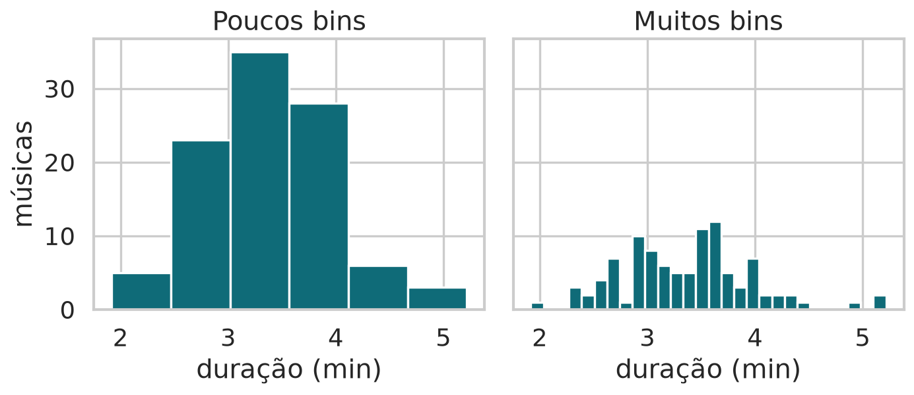{fig-alt="Dois histogramas da duração das músicas usando poucos bins e muitos bins."}

<details class="code-fold">
<summary>Código do gráfico</summary>

```python
fig, axes = plt.subplots(1, 2, figsize=(10, 4), sharey=True)

for ax, bins, title in zip(axes, [6, 28], ["Poucos bins", "Muitos bins"]):
    ax.hist(songs["duration_min"], bins=bins, color="#0f6b78", edgecolor="white")
    ax.set_title(title)
```

</details>

Quando os bins mudam a história, complemente com CDF e quantis.

## CDF empírica

```text
entrada: valores x_1, x_2, ..., x_n

1. ordenar os valores: x_(1) <= x_(2) <= ... <= x_(n)
2. para cada posição i, calcular p_i = i / n
3. plotar os pontos (x_(i), p_i)
4. ler p_i como a fração da amostra com valor <= x_(i)
```

A CDF empírica transforma cada valor observado em uma pergunta acumulada:
"que fração da amostra já apareceu até aqui?".

Ela não mostra quantas músicas existem em cada intervalo, como o histograma.
Ela mostra a fração de músicas com duração menor ou igual a cada ponto.

## Lendo a CDF

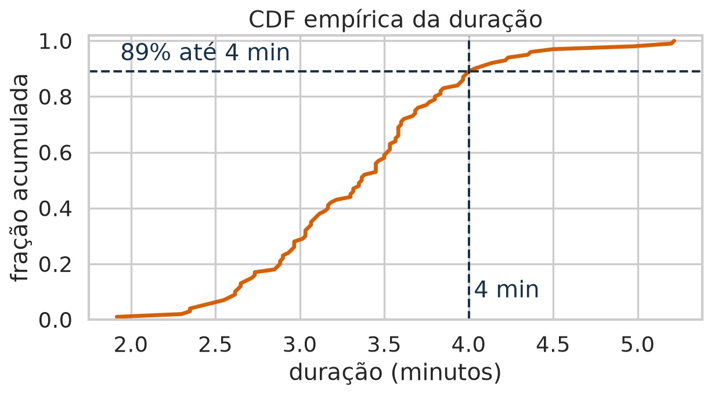{fig-alt="CDF empírica da duração das músicas com marcação em 4 minutos."}

<details class="code-fold">
<summary>Código do gráfico</summary>

```python
x = np.sort(songs["duration_min"])
y = np.arange(1, len(x) + 1) / len(x)

fig, ax = plt.subplots(figsize=(8, 4.5))
ax.plot(x, y, color="#d95f02", linewidth=2.5)
ax.axvline(4, color="#17324d", linestyle="--")
ax.set_xlabel("duração (minutos)")
ax.set_ylabel("fração acumulada")
```

</details>

Leitura: a curva mostra diretamente a fração acumulada até cada duração.

## Centro dos dados

Normalmente queremos dizer onde os dados estão centralizados.

Duas respostas comuns:

- média;
- mediana.

## Média

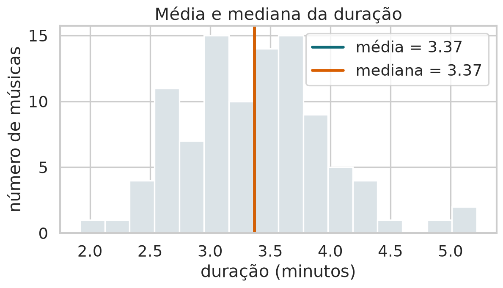{fig-alt="Histograma da duração com linhas verticais marcando média e mediana."}

<details class="code-fold">
<summary>Código do gráfico</summary>

```python
mean_duration = songs["duration_min"].mean()
median_duration = songs["duration_min"].median()

fig, ax = plt.subplots(figsize=(8, 4.5))
ax.hist(songs["duration_min"], bins=16, color="#dbe3e7", edgecolor="white")
ax.axvline(mean_duration, color="#0f6b78", linewidth=3, label="média")
ax.axvline(median_duration, color="#d95f02", linewidth=3, label="mediana")
ax.legend()
```

</details>

A média é o ponto de equilíbrio aritmético dos dados.

## Mediana

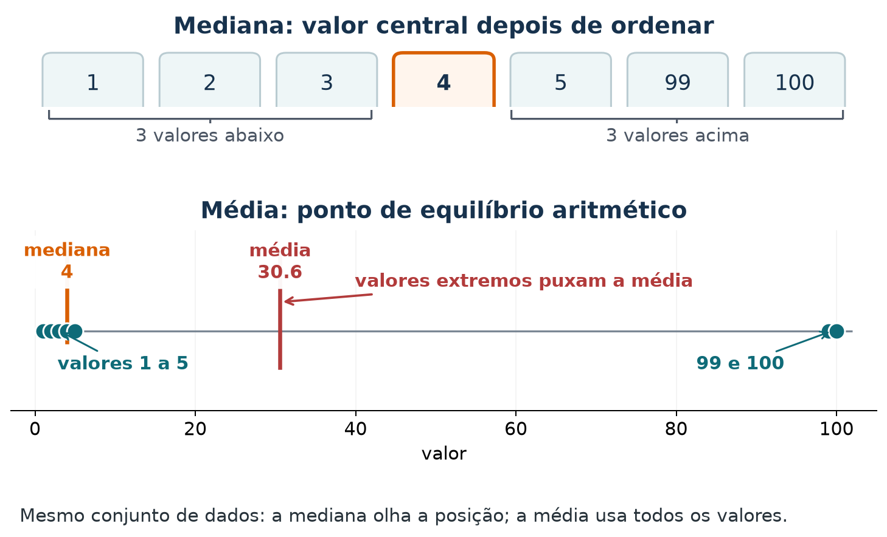{fig-alt="Comparação entre mediana e média no conjunto de valores 1, 2, 3, 4, 5, 99 e 100. A mediana é 4, no centro dos dados ordenados; a média é 30,6, puxada pelos valores extremos."}

<details class="code-fold">
<summary>Código do gráfico</summary>

```python
valores = np.array([1, 2, 3, 4, 5, 99, 100])
media = valores.mean()
mediana = np.median(valores)

fig, (ax1, ax2) = plt.subplots(2, 1, figsize=(10, 4.8))

# Mediana: ordene os valores e escolha o centro.
for i, valor in enumerate(valores):
    destaque = valor == mediana
    ax1.text(i, 0, valor, ha="center", va="center",
             fontweight="bold" if destaque else "normal")

# Média: ponto de equilíbrio aritmético.
ax2.scatter(valores, np.zeros_like(valores))
ax2.axvline(mediana, label=f"mediana = {mediana:.0f}")
ax2.axvline(media, label=f"média = {media:.1f}")
```

</details>

A mediana divide os dados ordenados em duas metades.

## Média vs. mediana

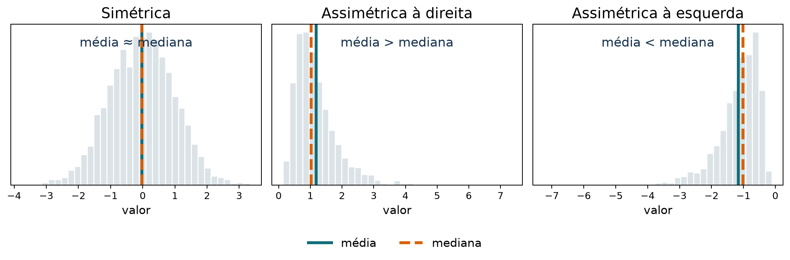{fig-alt="Três histogramas comparando média e mediana em uma distribuição simétrica, uma distribuição assimétrica à direita e uma distribuição assimétrica à esquerda."}

<details class="code-fold">
<summary>Código do gráfico</summary>

```python
rng = np.random.default_rng(2026)

dados = {
    "Simétrica": rng.normal(0, 1, 3000),
    "Assimétrica à direita": rng.lognormal(0, 0.55, 3000),
    "Assimétrica à esquerda": -rng.lognormal(0, 0.55, 3000),
}

for titulo, valores in dados.items():
    media = valores.mean()
    mediana = np.median(valores)
    ax.hist(valores, bins=35, density=True)
    ax.axvline(media, label="média")
    ax.axvline(mediana, linestyle="--", label="mediana")
```

</details>

Em distribuições simétricas, média e mediana tendem a ficar próximas. Em
distribuições assimétricas, a cauda puxa a média.

## Outlier

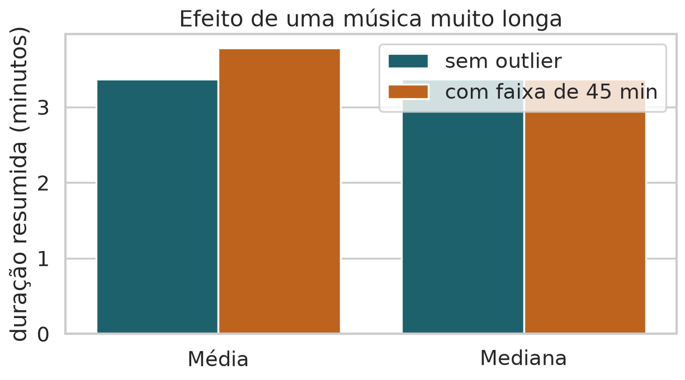{fig-alt="Barras comparando média e mediana antes e depois de adicionar uma música de 45 minutos."}

<details class="code-fold">
<summary>Código do gráfico</summary>

```python
with_outlier = pd.concat(
    [songs["duration_min"], pd.Series([45.0])],
    ignore_index=True
)

outlier_summary = pd.DataFrame({
    "Resumo": ["Média", "Mediana"] * 2,
    "Cenário": ["sem outlier", "sem outlier", "com faixa de 45 min", "com faixa de 45 min"],
    "Valor": [
        songs["duration_min"].mean(),
        songs["duration_min"].median(),
        with_outlier.mean(),
        with_outlier.median(),
    ],
})
sns.barplot(data=outlier_summary, x="Resumo", y="Valor", hue="Cenário")
```

</details>

O problema não é o outlier existir. O problema é resumi-lo sem perceber.

## Regra de leitura

- Média e mediana próximas sugerem distribuição mais equilibrada.
- Média maior que mediana sugere cauda à direita.
- Mediana é mais robusta a valores extremos.
- Média usa todos os valores e é mais sensível.

## Quartis

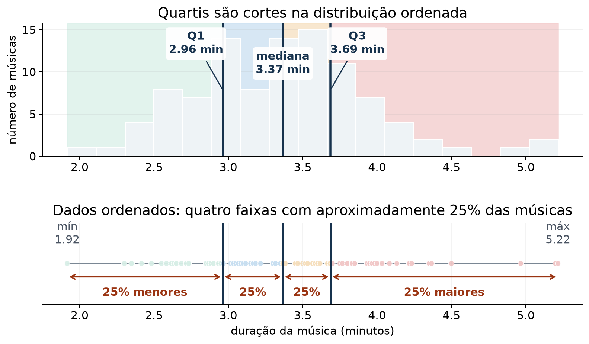{fig-alt="Histograma e régua ordenada da duração das músicas, com Q1, mediana e Q3 dividindo os dados em quatro partes com aproximadamente 25% das observações."}

<details class="code-fold">
<summary>Código do gráfico</summary>

```python
x = songs["duration_min"].dropna().sort_values().to_numpy()
q1, mediana, q3 = np.quantile(x, [0.25, 0.50, 0.75])

fig, (ax, ax2) = plt.subplots(
    2, 1, figsize=(10, 5.4), height_ratios=[2, 1.2], sharex=True
)

for lo, hi in [(x.min(), q1), (q1, mediana), (mediana, q3), (q3, x.max())]:
    ax.axvspan(lo, hi, alpha=0.7)

ax.hist(x, bins=18, edgecolor="white")

for value, label in [(q1, "Q1"), (mediana, "mediana"), (q3, "Q3")]:
    ax.axvline(value)
    ax.text(value, ax.get_ylim()[1], f"{label}\n{value:.2f} min")

quartis = np.searchsorted([q1, mediana, q3], x, side="right")
ax2.scatter(x, np.zeros_like(x), c=quartis)
ax2.set_xlabel("duração da música (minutos)")
```

</details>

Quartis separam os dados ordenados em quatro partes.

## Boxplot

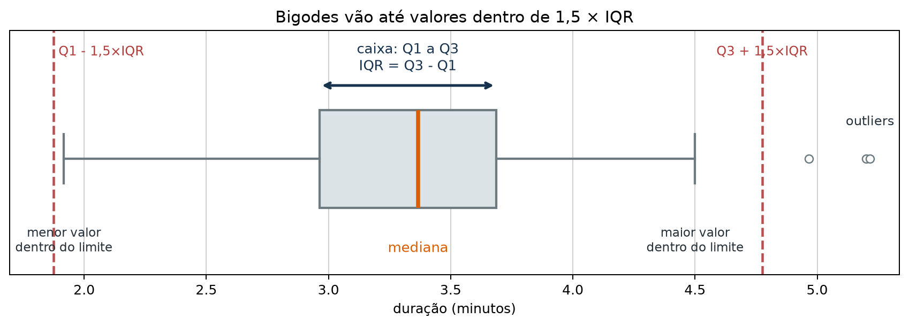{fig-alt="Boxplot horizontal da duração das músicas."}

<details class="code-fold">
<summary>Código do gráfico</summary>

```python
q1, mediana, q3 = np.quantile(songs["duration_min"], [0.25, 0.50, 0.75])
iqr = q3 - q1
limite_inf = q1 - 1.5 * iqr
limite_sup = q3 + 1.5 * iqr

fig, ax = plt.subplots(figsize=(8, 2.8))
sns.boxplot(data=songs, x="duration_min", color="#dbe3e7", ax=ax)
ax.axvline(limite_inf, linestyle="--", color="#b23b3b")
ax.axvline(limite_sup, linestyle="--", color="#b23b3b")
ax.set_xlabel("duração (minutos)")
```

</details>

Boxplot mostra centro, dispersão e possíveis valores extremos.

## Boxplot por grupo

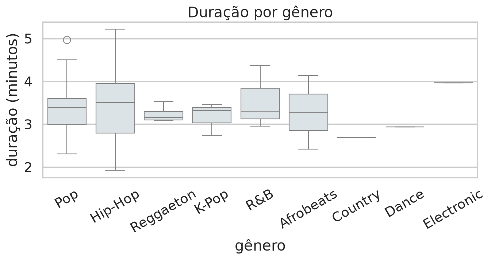{fig-alt="Boxplots da duração das músicas por gênero."}

<details class="code-fold">
<summary>Código do gráfico</summary>

```python
order = songs["Genre"].value_counts().index

fig, ax = plt.subplots(figsize=(9, 4.8))
sns.boxplot(
    data=songs,
    x="Genre",
    y="duration_min",
    order=order,
    color="#dbe3e7",
    ax=ax
)
ax.set_ylabel("duração (minutos)")
```

</details>

Compare distribuições, não apenas médias.

## Quantis

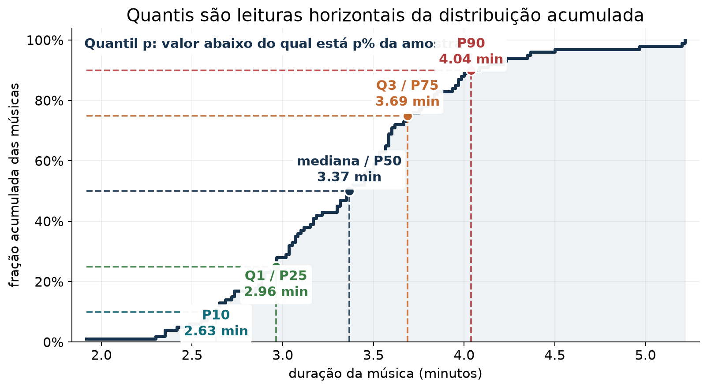{fig-alt="CDF empírica da duração das músicas com marcações em P10, Q1, mediana, Q3 e P90."}

<details class="code-fold">
<summary>Código do gráfico</summary>

```python
x = np.sort(songs["duration_min"].dropna().to_numpy())
y = np.arange(1, len(x) + 1) / len(x)

ps = np.array([0.10, 0.25, 0.50, 0.75, 0.90])
qs = np.quantile(x, ps)

fig, ax = plt.subplots(figsize=(10, 5))
ax.step(x, y, where="post", label="CDF empírica")

for p, q in zip(ps, qs):
    ax.plot([x.min(), q], [p, p], linestyle="--")
    ax.plot([q, q], [0, p], linestyle="--")
    ax.scatter(q, p)
    ax.text(q, p, f"P{int(p * 100)}\n{q:.2f} min")
```

</details>

Quantis generalizam quartis: para um percentual `p`, como 25%, 50% ou 90%, o
quantil é o valor abaixo do qual está essa fração da amostra.

## Dispersão

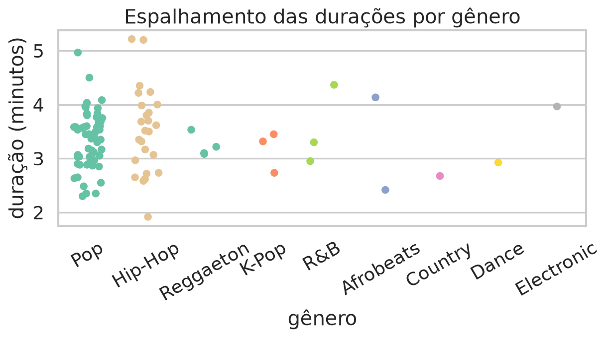{fig-alt="Gráfico de pontos mostrando o espalhamento das durações por gênero."}

<details class="code-fold">
<summary>Código do gráfico</summary>

```python
order = songs["Genre"].value_counts().index

fig, ax = plt.subplots(figsize=(8, 4.5))
sns.stripplot(
    data=songs,
    x="Genre",
    y="duration_min",
    order=order,
    jitter=0.25,
    ax=ax
)
```

</details>

Duas amostras podem ter centros parecidos e dispersões muito diferentes.

## Intervalo

::: {.range-figure}
<span class="min">mínimo</span>
<span class="max">máximo</span>
<div></div>
<strong>range = máximo - mínimo</strong>
:::

Simples, mas depende apenas de dois valores.

## Variância

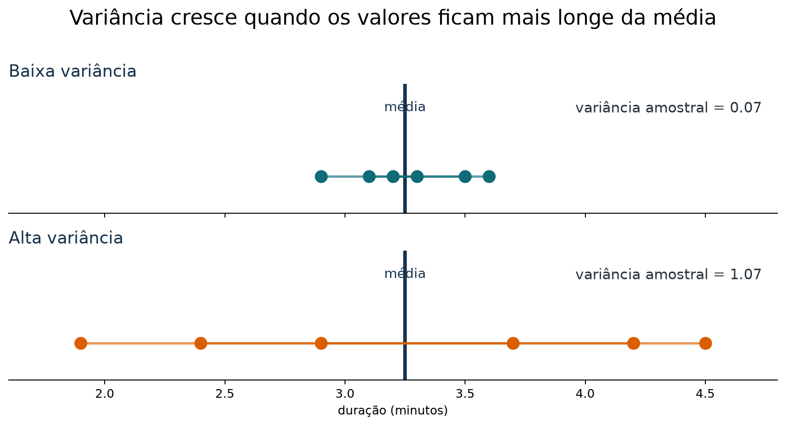{fig-alt="Duas linhas de pontos com a mesma média: uma com baixa variância e valores próximos da média; outra com alta variância e valores mais afastados."}

<details class="code-fold">
<summary>Código do gráfico</summary>

```python
baixa = np.array([2.9, 3.1, 3.2, 3.3, 3.5, 3.6])
alta = np.array([1.9, 2.4, 2.9, 3.7, 4.2, 4.5])
media = 3.25

for valores in [baixa, alta]:
    ax.axvline(media, color="#17324d", label="média")
    ax.scatter(valores, np.ones_like(valores))
    for x in valores:
        ax.plot([media, x], [1, 1])
    print(np.var(valores, ddof=1))
```

</details>

A variância cresce quando os valores ficam, em média, mais longe da média.

## População e amostra: variâncias diferentes

Se conhecemos toda a população de tamanho $N$:

$$
\sigma^2=\frac{1}{N}\sum_{i=1}^{N}(x_i-\mu)^2.
$$

Se temos uma amostra de tamanho $n$ e queremos estimar $\sigma^2$:

$$
s^2=\frac{1}{n-1}\sum_{i=1}^{n}(x_i-\bar{x})^2.
$$

A troca de $n$ por $n-1$ corrige o uso da média estimada $\bar{x}$ no lugar da média desconhecida $\mu$.

## Caminho 1: um grau de liberdade a menos

Depois de calcular $\bar{x}$, os desvios obedecem:

$$
\sum_{i=1}^{n}(x_i-\bar{x})=0.
$$

Se conhecemos $n-1$ desvios, o último já está determinado para que a soma seja zero.

::: {.statement}
Há apenas $n-1$ desvios livres para estimar a dispersão.
:::

Por isso dividimos a soma dos quadrados por $n-1$.

## Caminho 2: decomponha os desvios

A média populacional $\mu$ permite escrever o desvio em relação à média amostral como:

$$
X_i-\bar X=(X_i-\mu)-(\bar X-\mu).
$$

Elevando ao quadrado:

$$
(X_i-\bar X)^2
=(X_i-\mu)^2
-2(X_i-\mu)(\bar X-\mu)
+(\bar X-\mu)^2.
$$

Somando para $i=1,\ldots,n$:

$$
\begin{aligned}
\sum_{i=1}^{n}(X_i-\bar X)^2
={}&\sum_{i=1}^{n}(X_i-\mu)^2\\
&-2(\bar X-\mu)\sum_{i=1}^{n}(X_i-\mu)\\
&+\sum_{i=1}^{n}(\bar X-\mu)^2.
\end{aligned}
$$

Agora usamos duas simplificações:

$$
\sum_{i=1}^{n}(X_i-\mu)
=\sum_{i=1}^{n}X_i-n\mu
=n\bar X-n\mu
=n(\bar X-\mu),
$$

e, como $(\bar X-\mu)^2$ não depende de $i$,

$$
\sum_{i=1}^{n}(\bar X-\mu)^2=n(\bar X-\mu)^2.
$$

Substituindo essas duas expressões:

$$
\begin{aligned}
\sum_{i=1}^{n}(X_i-\bar X)^2
={}&\sum_{i=1}^{n}(X_i-\mu)^2
-2n(\bar X-\mu)^2
+n(\bar X-\mu)^2\\
={}&\boxed{\sum_{i=1}^{n}(X_i-\mu)^2
-n(\bar X-\mu)^2}.
\end{aligned}
$$

Equivalentemente:

$$
\sum_{i=1}^{n}(X_i-\mu)^2
=
\underbrace{\sum_{i=1}^{n}(X_i-\bar X)^2}_{\text{dispersão em torno de }\bar X}
+
\underbrace{n(\bar X-\mu)^2}_{\text{distância entre os centros}}.
$$

A dispersão em torno de $\bar X$ é menor porque a média amostral é o centro que melhor se ajusta aos próprios dados.

## Tomar a esperança revela n − 1

Para observações i.i.d. com variância $\sigma^2$:

$$
\mathbb E\!\left[\sum_{i=1}^{n}(X_i-\mu)^2\right]=n\sigma^2
$$

e, como $\mathbb E[\bar X]=\mu$ e $\operatorname{Var}(\bar X)=\sigma^2/n$:

$$
\mathbb E\!\left[n(\bar X-\mu)^2\right]
=n\operatorname{Var}(\bar X)=\sigma^2.
$$

Portanto, combinando os dois termos da decomposição:

$$
\begin{aligned}
\mathbb E\!\left[\sum_{i=1}^{n}(X_i-\bar X)^2\right]
&=
\mathbb E\!\left[\sum_{i=1}^{n}(X_i-\mu)^2\right]
-\mathbb E\!\left[n(\bar X-\mu)^2\right]\\
&=n\sigma^2-\sigma^2\\
&=(n-1)\sigma^2.
\end{aligned}
$$

## A correção remove o viés para baixo

Se dividíssemos por $n$:

$$
\mathbb E\!\left[\frac{1}{n}\sum_{i=1}^{n}(X_i-\bar X)^2\right]
=\frac{n-1}{n}\sigma^2<\sigma^2.
$$

Mas, dividindo por $n-1$:

$$
\mathbb E[s^2]
=\frac{1}{n-1}(n-1)\sigma^2
=\sigma^2.
$$

Essa é a correção de Bessel.

## Desvio padrão

::: {.statement}
O desvio padrão volta para a unidade original dos dados.
:::

Se a duração está em minutos, o desvio padrão também está em minutos.

## Transformações

Transformações não "consertam" os dados automaticamente.

Elas ajudam a enxergar a distribuição em outra escala, especialmente quando há
assimetria forte ou valores muito grandes.

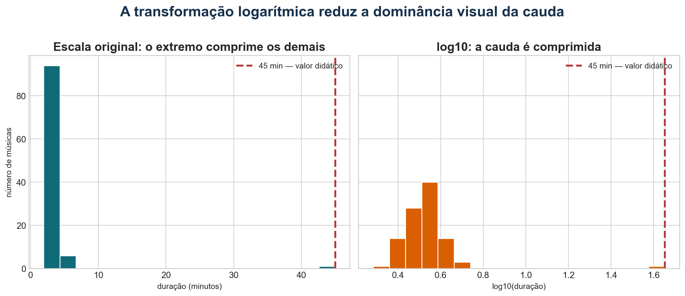{fig-alt="Comparação entre histograma da duração em escala original e histograma de log10 da duração."}

<details class="code-fold">
<summary>Código do gráfico</summary>

```python
fig, axes = plt.subplots(1, 2, figsize=(10, 4), sharey=True)

axes[0].hist(songs["duration_min"], bins=16)
axes[0].set_title("Escala original")

axes[1].hist(np.log10(songs["duration_min"]), bins=16)
axes[1].set_title("log10(duração)")
```

</details>

Como o log é monotônico, ele preserva a ordem dos valores.

O que muda é a escala das diferenças: valores grandes ficam visualmente menos
dominantes.

## Popularidade

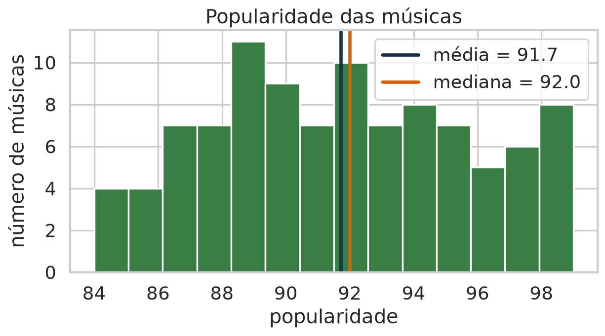{fig-alt="Histograma da popularidade das músicas com linhas de média e mediana."}

<details class="code-fold">
<summary>Código do gráfico</summary>

```python
fig, ax = plt.subplots(figsize=(8, 4.5))
ax.hist(songs["Popularity"], bins=14, color="#3a7d44", edgecolor="white")
ax.axvline(songs["Popularity"].mean(), label="média")
ax.axvline(songs["Popularity"].median(), label="mediana")
ax.legend()
```

</details>

O mesmo roteiro vale para outra variável numérica: visualize, calcule resumos e
compare média e mediana.

## Outras médias

Além da média aritmética:

- média geométrica;
- média harmônica.

Elas respondem a perguntas diferentes.

## Média geométrica

::: {.rating-figure}
<div><strong>Amazon</strong><span>3/5 = 60%</span></div>
<div><strong>Netflix</strong><span>70% likes</span></div>
<div class="merge"><strong>combinar escalas</strong></div>
:::

$$
G = \sqrt[n]{x_1 x_2 \cdots x_n}
  = \left(\prod_{i=1}^{n} x_i\right)^{1/n}
$$

Boa para valores normalizados ou grandezas multiplicativas.

## Média harmônica

::: {.road-figure}
<div>20 km a 20 km/h</div>
<div>20 km a 30 km/h</div>
<div class="result"><strong>velocidade média = 24 km/h</strong></div>
:::

$$
H = \frac{n}{\frac{1}{x_1} + \frac{1}{x_2} + \cdots + \frac{1}{x_n}}
  = \frac{n}{\sum_{i=1}^{n} \frac{1}{x_i}}
$$

Boa para taxas quando as distâncias ou quantidades-base são comparáveis.

## Quando usar cada uma?

- Soma na mesma unidade: média aritmética ou mediana.
- Dados com outliers: prefira mediana.
- Escalas normalizadas ou crescimento: média geométrica.
- Taxas: média harmônica.

## Fechamento

Para resumir dados, pergunte:

- visualizei a distribuição?
- há outliers?
- média e mediana contam histórias diferentes?
- preciso comunicar centro, dispersão ou ambos?
- a escala original é adequada?

## Referências

- Computational and Inferential Thinking, capítulo 10: Sampling and Empirical Distributions.
- Fundamentos Estatísticos de Ciência dos Dados, capítulos 2 e 4.
- Kaggle: Billboard Hits Songs Dataset, `dem0nking/billboard-hits-songs-dataset`.
