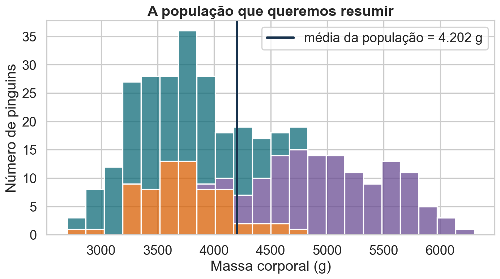
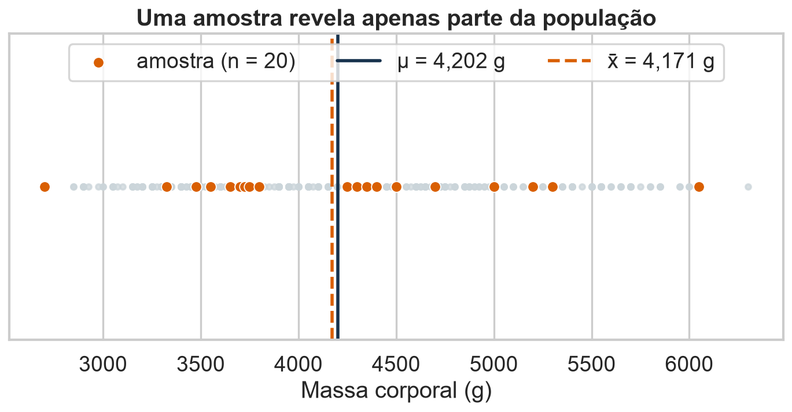
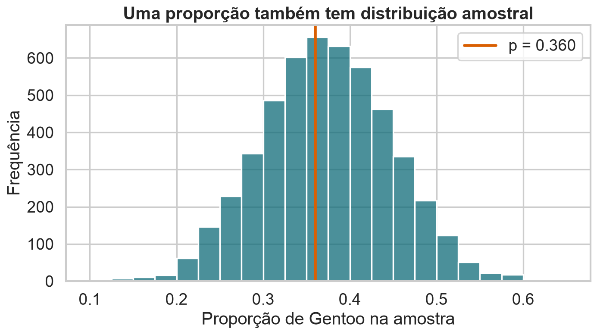
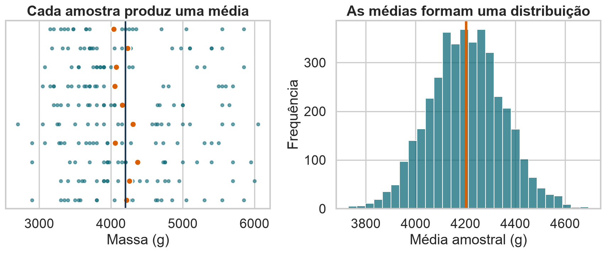
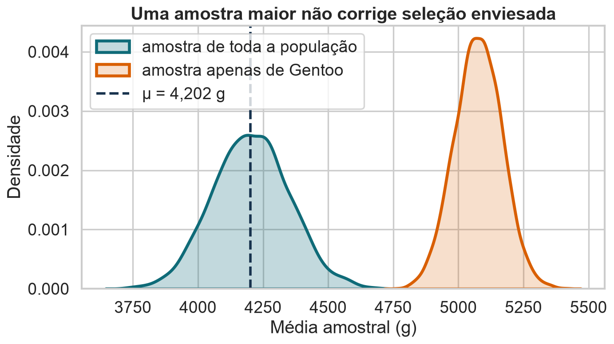
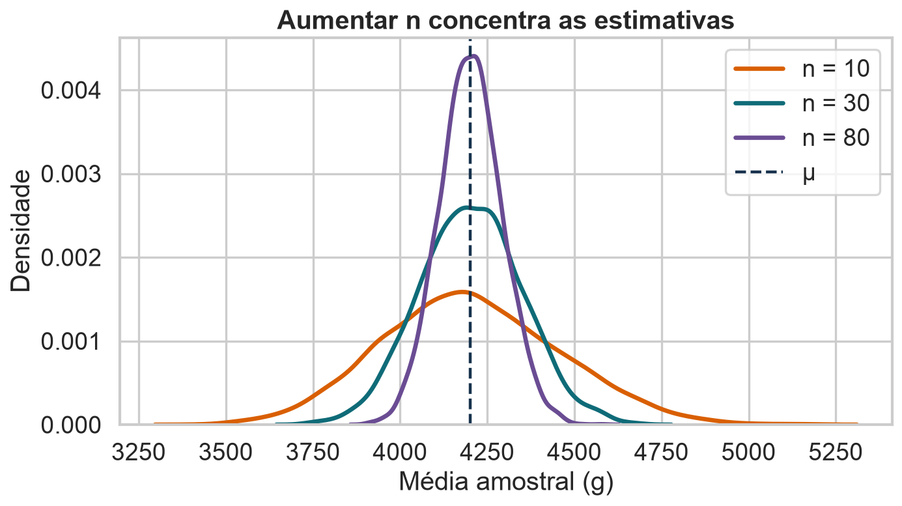
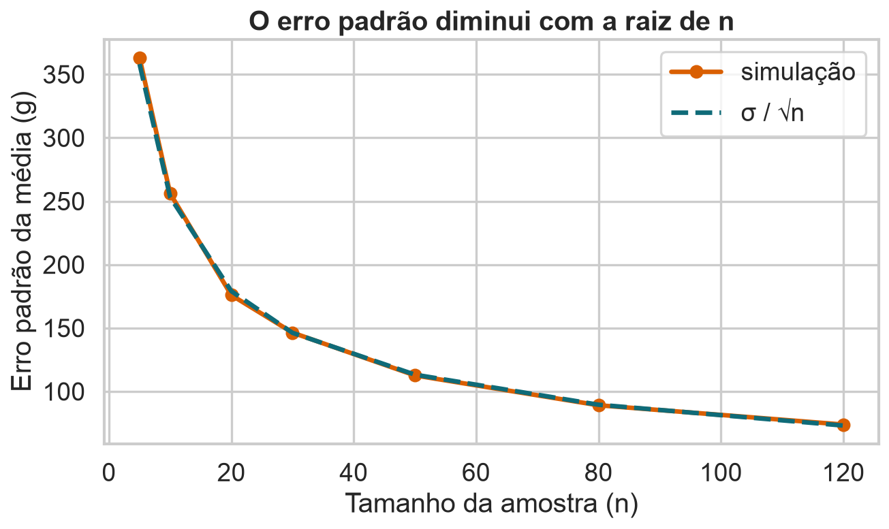
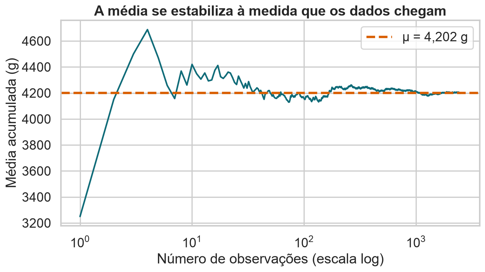
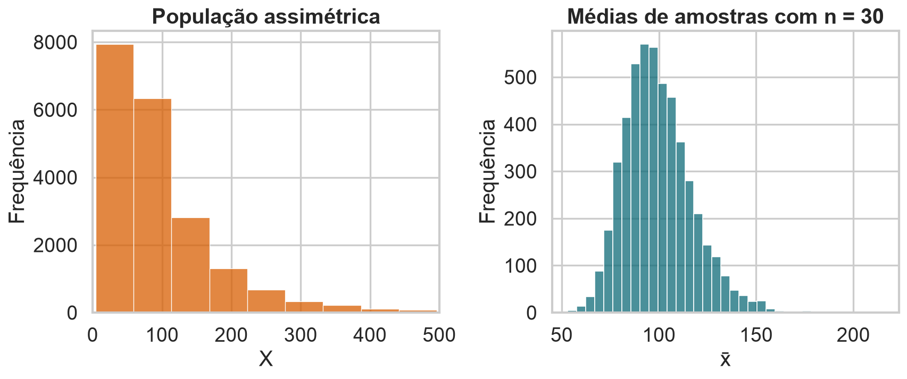

## Estimadores

::: {.statement}
Como aprender sobre uma população observando apenas uma amostra?
:::

Exemplo da aula: massa corporal dos pinguins do arquipélago Palmer.

## Hoje

- população, amostra e mecanismo de amostragem;
- parâmetro, estatística e estimador;
- distribuição amostral;
- viés e variância;
- tamanho da amostra e erro padrão;
- Teorema Central do Limite.

## O problema da aula

::: {.statement}
Qual é a massa corporal média dos pinguins observados no arquipélago Palmer?
:::

Imagine que medir todos seja caro, lento ou inviável.

## Palmer Penguins

::: {.columns}
::: {.column width="52%"}
- 344 registros coletados entre 2007 e 2009;
- três espécies;
- três ilhas;
- medidas corporais e sexo;
- dados públicos sob licença CC0.
:::

::: {.column width="48%"}
```{python}
#| echo: true
import kagglehub

path = kagglehub.dataset_download(
    "parulpandey/palmer-archipelago-antarctica-penguin-data"
)
```
:::
:::

## Cada linha descreve um pinguim

| Coluna | Significado |
|---|---|
| `species` | espécie: Adelie, Chinstrap ou Gentoo |
| `island` | ilha de observação |
| `bill_length_mm`, `bill_depth_mm` | medidas do bico |
| `flipper_length_mm` | comprimento da nadadeira |
| `body_mass_g` | massa corporal usada na aula |
| `sex` | sexo registrado |

Dos 344 registros, 342 têm massa corporal observada. Esses 342 formam nossa população didática.

## Nossa população didática

{fig-alt="Histograma da massa corporal dos pinguins, empilhado por espécie, com a média da população marcada em 4202 gramas."}

::: {.callout-note}
Nesta aula, os registros completos serão nossa **população conhecida**. Assim podemos verificar se as estimativas funcionam.
:::

<details class="code-fold">
<summary>Código do gráfico</summary>

```python
plt.figure(figsize=(9, 5.2))
sns.histplot(data=penguins, x="body_mass_g", hue="species", bins=22,
             palette=COLORS, multiple="stack", edgecolor="white")
plt.axvline(mu, color=INK, lw=3, label=f"média da população = {mu:,.0f} g")
plt.xlabel("Massa corporal (g)")
plt.ylabel("Número de pinguins")
plt.title("A população que queremos resumir")
plt.legend(title="")
finish("populacao-massa.png")
```

</details>

## População finita ou processo gerador?

::: {.columns}
::: {.column width="48%"}
### População finita

Os 342 pinguins com massa registrada.

O parâmetro descreve exatamente esse conjunto.
:::

::: {.column width="48%"}
### Superpopulação

O processo biológico que poderia gerar outros pinguins semelhantes.

O parâmetro descreve um modelo mais amplo.
:::
:::

## Por que não medir todos?

- custo de deslocamento e equipe;
- tempo limitado da temporada de campo;
- medições invasivas ou destrutivas;
- população muito grande ou em mudança;
- necessidade de decidir antes do censo terminar.

::: {.statement}
Amostragem troca completude por velocidade — e exige quantificar a incerteza.
:::

## População e amostra

::: {.columns}
::: {.column width="48%"}
### População

Conjunto sobre o qual queremos concluir.

Aqui: todos os pinguins registrados na base.
:::

::: {.column width="48%"}
### Amostra

Subconjunto efetivamente observado.

Aqui: pinguins selecionados para medição.
:::
:::

## Uma amostra é uma visão parcial

{fig-alt="Pontos de massa corporal da população, com uma amostra de 20 pinguins destacada e linhas para a média populacional e a média amostral."}

Uma amostra aleatória com $n=20$ produziu $\bar{x}=4.171$ g, enquanto $\mu=4.202$ g.

<details class="code-fold">
<summary>Código do gráfico</summary>

```python
sample_idx = rng.choice(penguins.index.to_numpy(), size=20, replace=False)
ordered = penguins.sort_values("body_mass_g").reset_index()
ordered["sample"] = ordered["index"].isin(sample_idx)
plt.figure(figsize=(9, 4.8))
plt.scatter(ordered["body_mass_g"], np.zeros(len(ordered)), s=18, color="#cbd5da", alpha=.75)
chosen = ordered[ordered["sample"]]
plt.scatter(chosen["body_mass_g"], np.zeros(len(chosen)), s=70, color=ORANGE,
            edgecolor="white", linewidth=.8, label="amostra (n = 20)")
plt.axvline(mu, color=INK, lw=2.5, label=f"μ = {mu:,.0f} g")
plt.axvline(chosen["body_mass_g"].mean(), color=ORANGE, lw=2.5, ls="--",
            label=f"x̄ = {chosen['body_mass_g'].mean():,.0f} g")
plt.yticks([])
plt.xlabel("Massa corporal (g)")
plt.title("Uma amostra revela apenas parte da população")
plt.legend(ncol=3, loc="upper center")
finish("uma-amostra.png")

# Simulações reutilizadas.
def sample_means(values, n, reps=4000):
    return np.array([rng.choice(values, size=n, replace=True).mean() for _ in range(reps)])

means_10 = sample_means(masses, 10)
means_30 = sample_means(masses, 30)
means_80 = sample_means(masses, 80)
```

</details>

## Três objetos diferentes

| Objeto | Símbolo | O que representa? |
|---|---:|---|
| Parâmetro | $\mu$ | valor fixo e geralmente desconhecido da população |
| Estimador | $\widehat{\mu}=\bar{X}$ | regra aplicada a qualquer amostra |
| Estimativa | $\bar{x}=4.171$ g | valor obtido em uma amostra específica |

::: {.statement}
O estimador é uma função; a estimativa é o resultado.
:::

## Duas linhas de estimação

::: {.columns}
::: {.column width="48%"}
### Paramétrica

Assumimos uma família de distribuições com poucos parâmetros.

Exemplo: $X\sim N(\mu,\sigma^2)$.
:::

::: {.column width="48%"}
### Não paramétrica

Evitamos especificar uma família completa.

Exemplo: CDF empírica e bootstrap.
:::
:::

## O parâmetro depende da pergunta

Na mesma população, podemos querer estimar:

- massa média: $\mu=E[X]$;
- proporção de Gentoo: $p=P(Y=1)$;
- mediana da massa: $q_{0.5}$;
- diferença média entre espécies: $\mu_G-\mu_A$.

::: {.statement}
Não existe estimador sem um alvo bem definido.
:::

## A média amostral como estimador

Para uma amostra $X_1,\ldots,X_n$:

$$
\widehat{\mu}=\bar{X}=\frac{1}{n}\sum_{i=1}^{n}X_i
$$

```{python}
#| echo: true
amostra = penguins["body_mass_g"].sample(n=20, random_state=7)
estimativa = amostra.mean()
```

## Outra pergunta: qual proporção é Gentoo?

Defina, para cada pinguim:

$$
Y_i=
\begin{cases}
1, & \text{se é Gentoo}\\
0, & \text{caso contrário}
\end{cases}
$$

Então $Y_i\sim Bernoulli(p)$, onde $p$ é a proporção populacional.

## Bernoulli modela uma resposta binária

$$
P(Y=y)=p^y(1-p)^{1-y},\qquad y\in\{0,1\}
$$

Propriedades:

$$
E[Y]=p,
\qquad
\operatorname{Var}(Y)=p(1-p)
$$

## A proporção amostral é uma média

$$
\widehat{p}=\frac{1}{n}\sum_{i=1}^{n}Y_i
$$

Como cada $Y_i$ vale zero ou um, a média conta a fração de sucessos.

$$
E[\widehat{p}]=p,
\qquad
\operatorname{Var}(\widehat{p})=\frac{p(1-p)}{n}
$$

## Proporções também variam entre amostras

{fig-alt="Histograma das proporções de pinguins Gentoo em cinco mil amostras de tamanho 40, centrado na proporção populacional."}

Com $n=40$, os valores possíveis avançam em passos de $1/40=0{,}025$.

<details class="code-fold">
<summary>Código do gráfico</summary>

```python
p_gentoo = (penguins["species"] == "Gentoo").mean()
prop_samples = np.array([
    (rng.choice(penguins["species"].to_numpy(), size=40, replace=True) == "Gentoo").mean()
    for _ in range(5000)
])
plt.figure(figsize=(9, 5.2))
sns.histplot(prop_samples, bins=np.arange(0.1, 0.66, 0.025), color=BLUE)
plt.axvline(p_gentoo, color=ORANGE, lw=3, label=f"p = {p_gentoo:.3f}")
plt.xlabel("Proporção de Gentoo na amostra")
plt.ylabel("Frequência")
plt.title("Uma proporção também tem distribuição amostral")
plt.legend()
finish("proporcao-gentoo.png")
```

</details>

## Da Bernoulli à Binomial

O número de Gentoo em uma amostra de tamanho $n$ é:

$$
K=\sum_{i=1}^{n}Y_i \sim Binomial(n,p)
$$

$$
P(K=k)=\binom{n}{k}p^k(1-p)^{n-k}
$$

E como $\widehat{p}=K/n$, a Binomial também descreve a proporção.

## O que varia entre amostras? {.quiz-question}

Ao repetir amostras aleatórias de mesmo tamanho, qual afirmação está correta?

- [O parâmetro populacional muda a cada amostra]{data-explanation="O parâmetro é uma característica fixa da população ou do processo gerador definido."}
- [A estimativa muda, embora o parâmetro permaneça fixo]{.correct data-explanation="A variabilidade entre estimativas é justamente o objeto descrito pela distribuição amostral."}
- [Um estimador não viesado produz sempre o valor exato]{data-explanation="Não viés é uma propriedade média do procedimento; amostras individuais ainda produzem erro."}
- [Toda amostra de mesmo tamanho produz a mesma estimativa]{data-explanation="A composição aleatória da amostra faz a estimativa variar."}

## Uma amostra não basta para avaliar a regra

Se repetirmos a coleta, os pinguins mudam.

Logo, a estimativa também muda:

$$
\bar{x}_1 \neq \bar{x}_2 \neq \bar{x}_3
$$

::: {.statement}
Para estudar um estimador, precisamos imaginar muitas amostras possíveis.
:::

## A distribuição amostral

{fig-alt="À esquerda, dez amostras e suas médias; à direita, histograma de quatro mil médias amostrais."}

Não é a distribuição dos dados. É a distribuição de uma **estatística** entre amostras repetidas.

<details class="code-fold">
<summary>Código do gráfico</summary>

```python
fig, axes = plt.subplots(1, 2, figsize=(11, 4.8))
for i in range(10):
    sample = rng.choice(masses, size=20, replace=True)
    axes[0].scatter(sample, np.full(20, i), s=13, color=BLUE, alpha=.55)
    axes[0].scatter(sample.mean(), i, s=65, color=ORANGE, edgecolor="white")
axes[0].axvline(mu, color=INK, lw=2)
axes[0].set_yticks([])
axes[0].set_xlabel("Massa (g)")
axes[0].set_title("Cada amostra produz uma média")
sns.histplot(means_30, bins=28, color=BLUE, ax=axes[1])
axes[1].axvline(mu, color=ORANGE, lw=3)
axes[1].set_xlabel("Média amostral (g)")
axes[1].set_ylabel("Frequência")
axes[1].set_title("As médias formam uma distribuição")
finish("distribuicao-amostral.png")
```

</details>

## Teoria e simulação se complementam

::: {.columns}
::: {.column width="48%"}
### Teoria

Deriva propriedades válidas para uma classe de populações e amostras.
:::

::: {.column width="48%"}
### Simulação

Torna o comportamento visível e testa cenários específicos.
:::
:::

Concordância entre as duas aumenta nossa confiança no raciocínio.

## O centro da distribuição importa

Um estimador é **não viesado** quando, em média, acerta o parâmetro:

$$
E[\widehat{\theta}] = \theta
$$

Seu viés é:

$$
B(\widehat{\theta})=E[\widehat{\theta}]-\theta
$$

## Consistência olha para amostras crescentes

Um estimador é **consistente** quando se aproxima do parâmetro à medida que $n$ cresce:

$$
\widehat{\theta}_n \xrightarrow{P} \theta
$$

- não viés é uma propriedade para um $n$ fixo;
- consistência descreve o comportamento quando $n\to\infty$;
- um estimador pode ser viesado em amostras finitas e ainda ser consistente.

## A média amostral é não viesada

Se cada observação tem média $\mu$:

$$
\begin{aligned}
E[\bar{X}]
&=E\left[\frac{1}{n}\sum_{i=1}^{n}X_i\right]\\
&=\frac{1}{n}\sum_{i=1}^{n}E[X_i]\\
&=\frac{1}{n}(n\mu)=\mu
\end{aligned}
$$

Não viesado não significa correto em toda amostra.

## Um estimador pode errar sem ter viés

::: {.columns}
::: {.column width="48%"}
### Erro de uma estimativa

$$
\widehat{\theta}-\theta
$$

Depende da amostra sorteada.
:::

::: {.column width="48%"}
### Viés do estimador

$$
E[\widehat{\theta}]-\theta
$$

É uma propriedade da regra sob repetições.
:::
:::

## Há outro tipo de viés

{fig-alt="Distribuições das médias de amostras aleatórias de toda a população e de amostras apenas de pinguins Gentoo, mostrando forte deslocamento."}

Selecionar apenas pinguins Gentoo desloca toda a distribuição das estimativas.

<details class="code-fold">
<summary>Código do gráfico</summary>

```python
gentoo = penguins.loc[penguins["species"] == "Gentoo", "body_mass_g"].to_numpy()
biased_means = sample_means(gentoo, 30)
plt.figure(figsize=(9, 5.2))
sns.kdeplot(means_30, fill=True, alpha=.25, color=BLUE, lw=3, label="amostra de toda a população")
sns.kdeplot(biased_means, fill=True, alpha=.20, color=ORANGE, lw=3, label="amostra apenas de Gentoo")
plt.axvline(mu, color=INK, lw=2.5, ls="--", label=f"μ = {mu:,.0f} g")
plt.xlabel("Média amostral (g)")
plt.ylabel("Densidade")
plt.title("Uma amostra maior não corrige seleção enviesada")
plt.legend()
finish("amostragem-enviesada.png")
```

</details>

## Viés de seleção não é viés algébrico

::: {.columns}
::: {.column width="48%"}
### Estimador viesado

A própria regra produz um valor esperado diferente do parâmetro.
:::

::: {.column width="48%"}
### Amostra enviesada

O mecanismo de coleta representa mal a população.
:::
:::

::: {.callout-warning}
Uma fórmula não corrige uma amostra que exclui sistematicamente parte da população.
:::

## Precisão também importa

Duas regras podem acertar o centro, mas variar de forma diferente.

$$
\operatorname{Var}(\widehat{\theta})=E\left[(\widehat{\theta}-E[\widehat{\theta}])^2\right]
$$

::: {.statement}
Menor variância significa estimativas mais estáveis entre amostras.
:::

## O tamanho da amostra controla a precisão

{fig-alt="Curvas de densidade das médias amostrais para amostras de tamanho 10, 30 e 80, cada vez mais concentradas em torno da média populacional."}

Todas se concentram em torno de $\mu$, mas amostras maiores oscilam menos.

<details class="code-fold">
<summary>Código do gráfico</summary>

```python
plt.figure(figsize=(9, 5.2))
for values, label, color in [(means_10, "n = 10", ORANGE), (means_30, "n = 30", BLUE),
                             (means_80, "n = 80", "#6a4c93")]:
    sns.kdeplot(values, label=label, color=color, fill=False, linewidth=3)
plt.axvline(mu, color=INK, lw=2, ls="--", label="μ")
plt.xlabel("Média amostral (g)")
plt.ylabel("Densidade")
plt.title("Aumentar n concentra as estimativas")
plt.legend()
finish("tamanho-amostra.png")
```

</details>

## Variância da média amostral

Para observações independentes com variância $\sigma^2$:

$$
\begin{aligned}
\operatorname{Var}(\bar{X})
&=Var\left(\frac{1}{n}\sum_{i=1}^{n}X_i\right)\\
&=\frac{1}{n^2}\sum_{i=1}^{n}\operatorname{Var}(X_i)\\
&=\frac{\sigma^2}{n}
\end{aligned}
$$

## Erro padrão

O desvio padrão da distribuição amostral é o **erro padrão**:

$$
\operatorname{SE}(\bar{X})=\frac{\sigma}{\sqrt{n}}
$$

::: {.callout-note}
Para reduzir o erro padrão pela metade, precisamos multiplicar $n$ por quatro.
:::

## A simulação confirma a fórmula

{fig-alt="Linhas quase coincidentes comparando o erro padrão simulado e a fórmula sigma sobre raiz de n para diferentes tamanhos de amostra."}

O padrão empírico acompanha $\sigma/\sqrt{n}$.

<details class="code-fold">
<summary>Código do gráfico</summary>

```python
ns = np.array([5, 10, 20, 30, 50, 80, 120])
empirical_se = np.array([sample_means(masses, int(n), 2500).std(ddof=1) for n in ns])
theoretical_se = masses.std(ddof=0) / np.sqrt(ns)
plt.figure(figsize=(8.5, 5.2))
plt.plot(ns, empirical_se, "o-", lw=3, ms=8, color=ORANGE, label="simulação")
plt.plot(ns, theoretical_se, "--", lw=3, color=BLUE, label="σ / √n")
plt.xlabel("Tamanho da amostra (n)")
plt.ylabel("Erro padrão da média (g)")
plt.title("O erro padrão diminui com a raiz de n")
plt.legend()
finish("erro-padrao.png")
```

</details>

## Lei dos Grandes Números

Quando $n$ cresce, a média amostral converge para a média da população:

$$
\bar{X}_n \xrightarrow{P} \mu
$$

::: {.statement}
Mais dados reduzem a variabilidade aleatória — se o mecanismo de amostragem for adequado.
:::

## A convergência não é monotônica

{fig-alt="Média acumulada da massa corporal ao longo de 2500 observações, oscilando e depois se estabilizando perto da média populacional."}

A média pode se afastar temporariamente de $\mu$, mas suas oscilações tendem a diminuir.

<details class="code-fold">
<summary>Código do gráfico</summary>

```python
sequence = rng.choice(masses, size=2500, replace=True)
running_mean = np.cumsum(sequence) / np.arange(1, len(sequence) + 1)
plt.figure(figsize=(9, 5.2))
plt.plot(np.arange(1, len(sequence) + 1), running_mean, color=BLUE, lw=2)
plt.axhline(mu, color=ORANGE, lw=3, ls="--", label=f"μ = {mu:,.0f} g")
plt.xscale("log")
plt.xlabel("Número de observações (escala log)")
plt.ylabel("Média acumulada (g)")
plt.title("A média se estabiliza à medida que os dados chegam")
plt.legend()
finish("convergencia-media.png")
```

</details>

## O que uma amostra maior não corrige? {.quiz-question}

Queremos a massa média de todas as espécies, mas coletamos apenas pinguins Gentoo. O que ocorre ao aumentar muito $n$?

- [A estimativa necessariamente converge para a média de todas as espécies]{data-explanation="Mais observações do grupo errado não tornam a amostra representativa da população-alvo."}
- [A variância pode diminuir, mas o viés de seleção permanece]{.correct data-explanation="A amostra fica mais precisa em torno da média de Gentoo, não em torno da média de todas as espécies."}
- [O viés desaparece porque a média amostral é sempre não viesada]{data-explanation="A não tendenciosidade da média exige amostragem compatível com a população-alvo."}
- [O erro padrão aumenta com o tamanho da amostra]{data-explanation="Em condições usuais, o erro padrão diminui aproximadamente como 1/√n."}

## Mais dados não curam seleção ruim

::: {.columns}
::: {.column width="48%"}
### Aumentar $n$

- reduz a variância;
- reduz o erro padrão;
- concentra a distribuição amostral.
:::

::: {.column width="48%"}
### Não necessariamente

- representa grupos ausentes;
- remove erros de medição;
- corrige o desenho da coleta.
:::
:::

## Teorema Central do Limite

Sob condições usuais, para $n$ suficientemente grande:

$$
\frac{\bar{X}-\mu}{\sigma/\sqrt{n}} \approx N(0,1)
$$

O formato da população não precisa ser Normal.

## Médias podem parecer normais

{fig-alt="Uma população fortemente assimétrica à direita e uma distribuição aproximadamente normal de médias de amostras de tamanho 30."}

O TCL descreve a distribuição das **médias**, não transforma os dados originais.

<details class="code-fold">
<summary>Código do gráfico</summary>

```python
right_skew = np.exp(rng.normal(0, .8, 20000))
right_skew = right_skew / right_skew.mean() * 100
clt_means = sample_means(right_skew, 30, 5000)
fig, axes = plt.subplots(1, 2, figsize=(11, 4.8))
sns.histplot(right_skew, bins=45, color=ORANGE, ax=axes[0])
axes[0].set_xlim(0, 500)
axes[0].set_title("População assimétrica")
axes[0].set_xlabel("X")
axes[0].set_ylabel("Frequência")
sns.histplot(clt_means, bins=35, color=BLUE, ax=axes[1])
axes[1].set_title("Médias de amostras com n = 30")
axes[1].set_xlabel("x̄")
axes[1].set_ylabel("Frequência")
finish("tcl-assimetria.png")
```

</details>

## O que aprendemos

1. Um estimador é uma regra aplicada à amostra.
2. Sua distribuição amostral revela centro e variabilidade.
3. Viés mede erro sistemático; variância mede instabilidade.
4. $\operatorname{SE}(\bar{X})=\sigma/\sqrt{n}$.
5. Amostras maiores ajudam, mas não corrigem seleção ruim.

## Atividade: desenhe a amostragem

Queremos estimar a proporção de pinguins de cada espécie no arquipélago.

1. Qual é a população de interesse?
2. Como selecionar locais e indivíduos?
3. Que grupos podem ficar sub-representados?
4. Qual estimador você usaria?
5. O que aumentar $n$ resolve — e o que não resolve?

## Próxima aula

::: {.statement}
Se existem vários estimadores, como decidir qual é melhor?
:::

Na Aula 09, usaremos funções de perda e risco para comparar média, mediana e média aparada.

## Fonte dos dados {.smaller}

- Gorman, K. B.; Williams, T. D.; Fraser, W. R. (2014). *Ecological Sexual Dimorphism and Environmental Variability within a Community of Antarctic Penguins*.
- Dataset Palmer Penguins no Kaggle: `parulpandey/palmer-archipelago-antarctica-penguin-data`.
- Licença dos dados: CC0.
