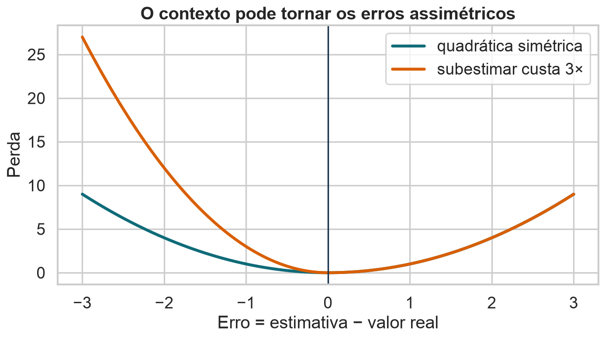
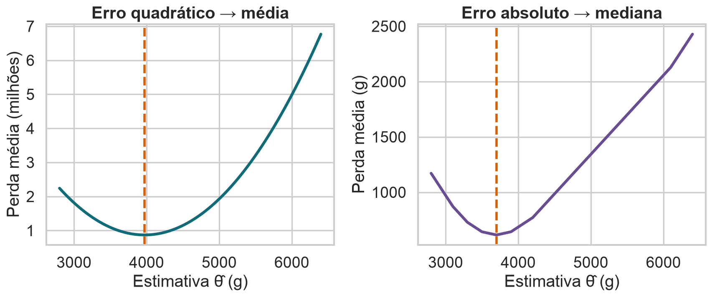
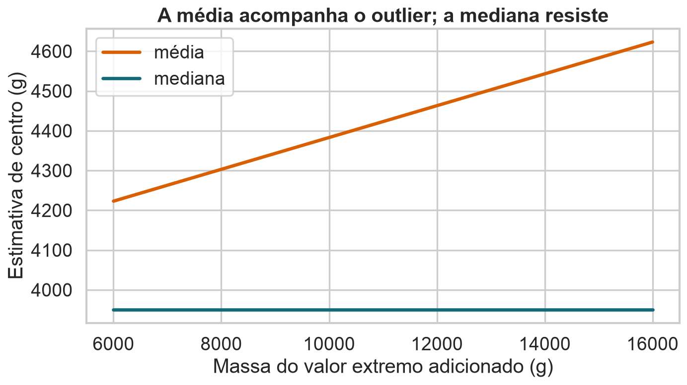
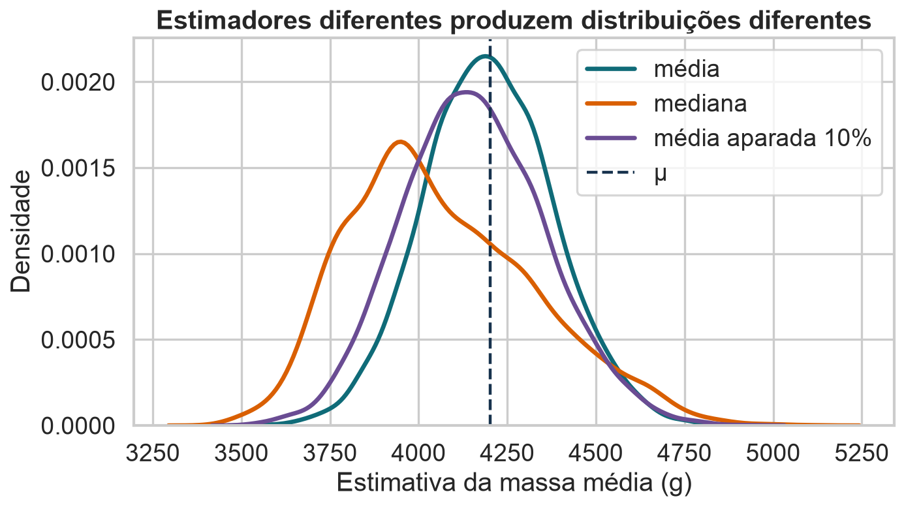
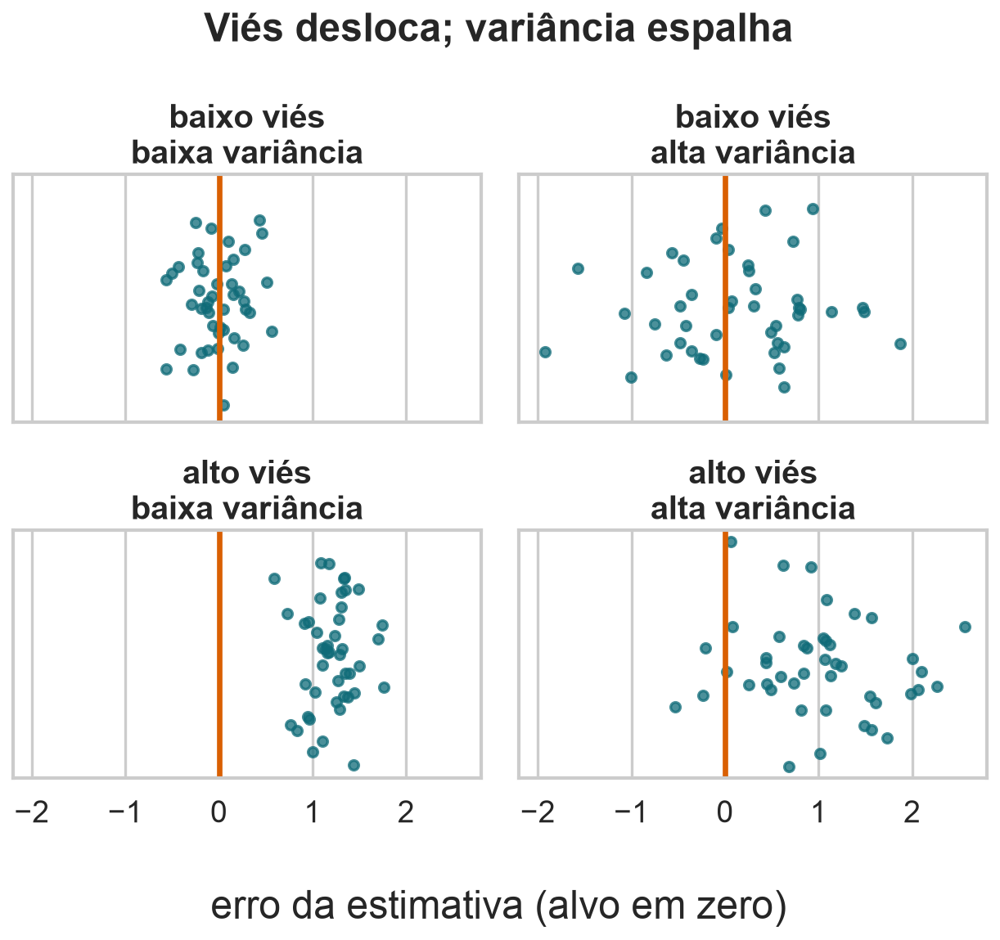
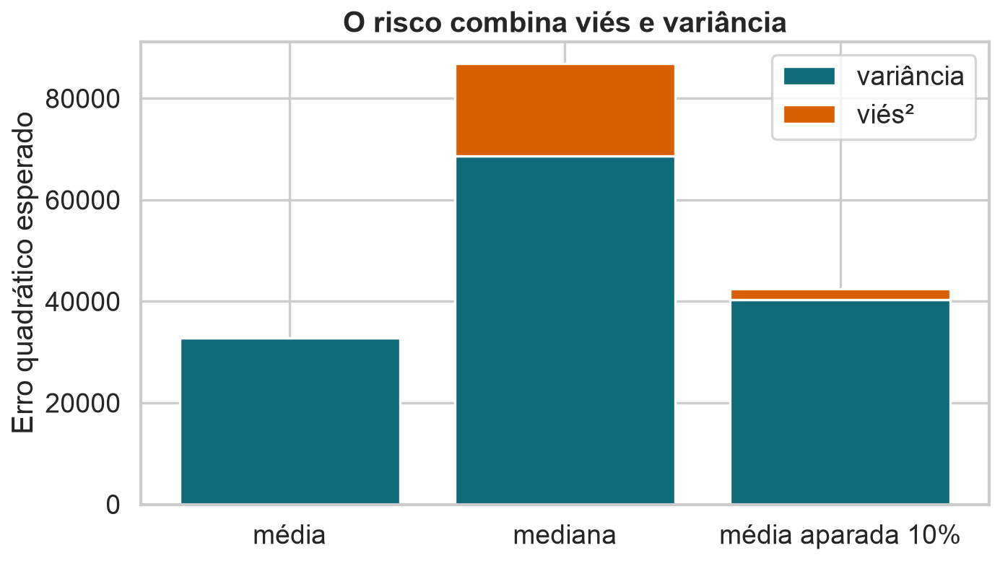

## Escolhendo estimadores

::: {.statement}
O que significa dizer que um estimador é “melhor”?
:::

Continuação do estudo da massa corporal dos pinguins Palmer.

## Retomada

Na Aula 08, caracterizamos um estimador por sua distribuição amostral:

- **viés:** distância sistemática até o parâmetro;
- **variância:** quanto a estimativa muda entre amostras;
- **erro padrão:** escala dessa variação.

Hoje precisamos transformar essas propriedades em um critério de escolha.

## Estimar é tomar uma decisão

A estimativa será usada para alguma ação:

- dimensionar alimento para uma colônia;
- detectar mudança no tamanho corporal;
- comparar espécies ou ilhas;
- planejar uma nova coleta.

O custo de errar depende dessa decisão.

## A base continua sendo Palmer Penguins

- unidade de observação: um pinguim medido entre 2007 e 2009;
- 344 registros, três espécies e três ilhas;
- 342 valores observados de `body_mass_g`;
- principais colunas: espécie, ilha, sexo, bico, nadadeira e massa;
- nesta aula, a massa permite comparar estimadores sob caudas e valores extremos.

O objetivo agora não é estimar apenas a média, mas escolher uma regra adequada ao custo do erro.

## Existem várias respostas plausíveis

Para resumir uma variável numérica, poderíamos usar:

- média;
- mediana;
- média aparada;
- ponto médio dos extremos;
- média geométrica.

::: {.statement}
Sem definir o custo dos erros, “melhor” não tem significado.
:::

## Um pequeno exemplo

Considere as massas, em gramas:

$$
3100,\ 3300,\ 3500,\ 3700,\ 3900,\ 4200,\ 6100
$$

- média: $3.986$ g;
- mediana: $3.700$ g.

Qual valor representa melhor o grupo?

## Medir o erro exige uma perda

Uma função de perda atribui um custo à diferença entre estimativa e observação:

$$
L(\widehat{\theta},x)
$$

Duas escolhas comuns:

$$
(\widehat{\theta}-x)^2
\qquad\text{e}\qquad
|\widehat{\theta}-x|
$$

## O mesmo erro pode ter custos diferentes

Subestimar a massa necessária de alimento pode ser mais grave que superestimar.

Em outros problemas, ocorre o contrário:

- estoque insuficiente versus excedente;
- falso negativo versus falso positivo;
- atraso versus capacidade ociosa.

## Perdas podem ser assimétricas

{fig-alt="Comparação entre uma perda quadrática simétrica e uma perda que penaliza subestimações três vezes mais."}

<details class="code-fold" open>
<summary>Código do gráfico</summary>

```python
errors = np.linspace(-3, 3, 500)
symmetric = errors ** 2
asymmetric = np.where(errors < 0, 3 * errors ** 2, errors ** 2)
plt.figure(figsize=(9, 5.2))
plt.plot(errors, symmetric, color=BLUE, lw=3, label="quadrática simétrica")
plt.plot(errors, asymmetric, color=ORANGE, lw=3, label="subestimar custa 3×")
plt.axvline(0, color=INK, lw=1.5)
plt.xlabel("Erro = estimativa − valor real")
plt.ylabel("Perda")
plt.title("O contexto pode tornar os erros assimétricos")
plt.legend()
finish("perda-assimetrica.png")
```

</details>

Quando subestimar custa mais, a estimativa ótima se desloca para cima.

## Erro quadrático

$$
L_2(\widehat{\theta})
=\frac{1}{n}\sum_{i=1}^{n}(\widehat{\theta}-x_i)^2
$$

- penaliza fortemente erros grandes;
- é suave e fácil de otimizar;
- dá grande influência a valores extremos.

## Derivamos cada erro quadrático

Como $x_i$ é constante em relação a $\widehat\theta$, cada termo satisfaz:

$$
\frac{d}{d\widehat\theta}(\widehat\theta-x_i)^2
=2(\widehat\theta-x_i).
$$

Aplicando ao somatório:

$$
\frac{dL_2}{d\widehat\theta}
=\frac{2}{n}\sum_{i=1}^{n}(\widehat\theta-x_i)
=\frac{2}{n}\left(n\widehat\theta-\sum_{i=1}^{n}x_i\right).
$$

## Zerar a derivada revela a média

No ponto estacionário, a derivada é zero:

$$
\begin{aligned}
0
&=\frac{2}{n}\left(n\widehat\theta-\sum_{i=1}^{n}x_i\right),\\[4pt]
n\widehat\theta
&=\sum_{i=1}^{n}x_i,\\[4pt]
\widehat\theta
&=\frac{1}{n}\sum_{i=1}^{n}x_i
=\bar{x}.
\end{aligned}
$$

## A curvatura confirma o mínimo

Para qualquer valor de $\widehat\theta$:

$$
\frac{d^2L_2}{d\widehat{\theta}^2}=2>0.
$$

Logo, $L_2$ é estritamente convexa. O ponto estacionário
$\widehat\theta=\bar{x}$ é o único mínimo global.

::: {.statement}
A média não foi escolhida por convenção: ela resolve exatamente o problema de minimizar erros quadráticos.
:::

## Erro absoluto

$$
L_1(\widehat{\theta})
=\frac{1}{n}\sum_{i=1}^{n}|\widehat{\theta}-x_i|
$$

- cresce linearmente com o erro;
- reduz a influência de valores extremos;
- muda de inclinação em cada observação.

## A inclinação conta observações de cada lado

Fora dos pontos $x_i$, podemos derivar cada termo:

$$
\frac{d}{d\widehat\theta}|\widehat\theta-x_i|
=
\begin{cases}
-1, & \widehat\theta<x_i,\\
+1, & \widehat\theta>x_i.
\end{cases}
$$

Assim:

$$
\frac{dL_1}{d\widehat\theta}
=\frac{N_{<}(\widehat\theta)-N_{>}(\widehat\theta)}{n}.
$$

## A mediana equilibra a inclinação

À esquerda da mediana, a derivada é negativa; à direita, é positiva.

Nos pontos $x_i$, usamos a condição de subgradiente:

$$
0\in\partial L_1(\widehat\theta).
$$

Neste problema, isso equivale a:

$$
N_{<}(\widehat\theta)\leq n/2
\quad\text{e}\quad
N_{>}(\widehat\theta)\leq n/2.
$$

As medianas satisfazem essa condição. Se $n$ é par, todo valor entre as duas observações centrais também minimiza a perda.

## A perda decide o vencedor

{fig-alt="Duas curvas de perda: o erro quadrático atinge o mínimo na média e o erro absoluto atinge o mínimo na mediana."}

<details class="code-fold" open>
<summary>Código do gráfico</summary>

```python
example = np.array([3100, 3300, 3500, 3700, 3900, 4200, 6100])
candidates = np.linspace(2800, 6400, 500)
mse = np.array([np.mean((example - t) ** 2) for t in candidates])
mae = np.array([np.mean(np.abs(example - t)) for t in candidates])
fig, axes = plt.subplots(1, 2, figsize=(11, 4.8))
axes[0].plot(candidates, mse / 1e6, color=BLUE, lw=3)
axes[0].axvline(example.mean(), color=ORANGE, lw=2.5, ls="--")
axes[0].set_title("Erro quadrático → média")
axes[0].set_ylabel("Perda média (milhões)")
axes[1].plot(candidates, mae, color="#6a4c93", lw=3)
axes[1].axvline(np.median(example), color=ORANGE, lw=2.5, ls="--")
axes[1].set_title("Erro absoluto → mediana")
axes[1].set_ylabel("Perda média (g)")
for ax in axes:
    ax.set_xlabel("Estimativa θ̂ (g)")
finish("funcoes-perda.png")
```

</details>

Média e mediana resolvem problemas de otimização diferentes.

## Por que a média sente o outlier?

No erro quadrático, dobrar o erro multiplica o custo por quatro:

$$
(2e)^2=4e^2
$$

Mover a média em direção ao extremo pode reduzir muito essa penalidade.

## Robustez

{fig-alt="Linhas mostrando a média crescendo à medida que um valor extremo aumenta, enquanto a mediana permanece praticamente constante."}

<details class="code-fold" open>
<summary>Código do gráfico</summary>

```python
base = penguins["body_mass_g"].dropna().sample(24, random_state=7).to_numpy()
outliers = np.arange(6000, 16001, 500)
mean_values = np.array([np.append(base, x).mean() for x in outliers])
median_values = np.array([np.median(np.append(base, x)) for x in outliers])
plt.figure(figsize=(9, 5.2))
plt.plot(outliers, mean_values, lw=3, color=ORANGE, label="média")
plt.plot(outliers, median_values, lw=3, color=BLUE, label="mediana")
plt.xlabel("Massa do valor extremo adicionado (g)")
plt.ylabel("Estimativa de centro (g)")
plt.title("A média acompanha o outlier; a mediana resiste")
plt.legend()
finish("robustez-outlier.png")
```

</details>

::: {.statement}
Robustez é a capacidade de resistir a pequenas contaminações ou valores extremos.
:::

## Nenhum resumo vence sempre

::: {.columns}
::: {.column width="48%"}
### Média

- usa todos os valores;
- eficiente em distribuições simétricas;
- sensível a outliers;
- minimiza erro quadrático.
:::

::: {.column width="48%"}
### Mediana

- depende da ordem;
- robusta a extremos;
- pode variar mais entre amostras;
- minimiza erro absoluto.
:::
:::

## Um estimador constante é perfeitamente estável

Considere a regra:

$$
\widehat{\mu}=4.000\text{ g}
$$

Ela tem variância zero porque ignora a amostra.

::: {.statement}
Baixa variância, sozinha, não garante uma boa estimativa.
:::

## Um meio-termo: média aparada

Ordenamos os dados, removemos uma fração de cada cauda e calculamos a média do restante.

```{python}
#| echo: true
from scipy.stats import trim_mean

estimativa = trim_mean(amostra, proportiontocut=0.10)
```

Ela troca um pouco de viés por menor sensibilidade a extremos.

## Compare distribuições, não um resultado

{fig-alt="Curvas de densidade das estimativas produzidas pela média, mediana e média aparada em muitas amostras."}

<details class="code-fold" open>
<summary>Código do gráfico</summary>

```python
plt.figure(figsize=(9, 5.2))
for (name, vals), color in zip(estimators.items(), [BLUE, ORANGE, "#6a4c93"]):
    sns.kdeplot(vals, lw=3, label=name, color=color)
plt.axvline(mu, color=INK, lw=2, ls="--", label="μ")
plt.xlabel("Estimativa da massa média (g)")
plt.ylabel("Densidade")
plt.title("Estimadores diferentes produzem distribuições diferentes")
plt.legend()
finish("comparacao-estimadores.png")
```

</details>

Cada regra tem centro, dispersão e formato próprios.

## Viés e variância puxam em direções diferentes

::: {.columns}
::: {.column width="48%"}
### Baixo viés

O centro da distribuição amostral fica próximo de $\theta$.
:::

::: {.column width="48%"}
### Baixa variância

As estimativas ficam próximas umas das outras.
:::
:::

Uma regra pode melhorar uma propriedade e piorar a outra.

## Quatro comportamentos possíveis

{fig-alt="Quatro painéis mostrando combinações de baixo e alto viés com baixa e alta variância em torno de um alvo zero."}

<details class="code-fold" open>
<summary>Código do gráfico</summary>

```python
fig, axes = plt.subplots(2, 2, figsize=(8, 7.2), sharex=True, sharey=True)
settings = [
    (0, .25, "baixo viés\nbaixa variância"),
    (0, .75, "baixo viés\nalta variância"),
    (1.2, .25, "alto viés\nbaixa variância"),
    (1.2, .75, "alto viés\nalta variância"),
]
for ax, (center, spread, title) in zip(axes.flat, settings):
    vals = rng.normal(center, spread, 45)
    ax.scatter(vals, rng.normal(0, .05, len(vals)), s=28, color=BLUE, alpha=.75)
    ax.axvline(0, color=ORANGE, lw=3)
    ax.set_title(title)
    ax.set_yticks([])
    ax.set_xlim(-2.2, 2.8)
fig.supxlabel("erro da estimativa (alvo em zero)")
fig.suptitle("Viés desloca; variância espalha", fontweight="bold")
finish("vies-variancia-quadrantes.png")

print(f"Figuras geradas em {OUT}")
print(metrics.round(1).to_string(index=False))
```

</details>

Viés desloca o centro; variância espalha as estimativas.

## Eficiência: menor variância

Entre dois estimadores não viesados de $\theta$, preferimos o de menor variância:

$$
\operatorname{Var}(\widehat{\theta}_1)<\operatorname{Var}(\widehat{\theta}_2)
$$

Nesse caso, $\widehat{\theta}_1$ é mais **eficiente**.

Eficiência sempre depende do modelo e das suposições.

## Não viés e consistência não são sinônimos

::: {.columns}
::: {.column width="48%"}
### Não viesado

Acerta em média para um tamanho $n$ específico.
:::

::: {.column width="48%"}
### Consistente

Converge para o parâmetro quando $n\to\infty$.
:::
:::

Uma pequena correção viesada pode reduzir muito o risco em amostras finitas.

## Precisamos de um critério combinado

O **risco** é a perda esperada ao repetir a amostragem:

$$
R(\widehat{\theta},\theta)
=E\left[L(\widehat{\theta},\theta)\right]
$$

Para perda quadrática:

$$
R=E[(\widehat{\theta}-\theta)^2]
$$

## O risco quadrático é o MSE

$$
\operatorname{MSE}(\widehat{\theta})
=E[(\widehat{\theta}-\theta)^2]
$$

Ele mede o erro quadrático médio que esperamos antes de observar a amostra.

Unidade: o quadrado da unidade do parâmetro.

## RMSE volta à unidade original

$$
\operatorname{RMSE}(\widehat{\theta})=\sqrt{\operatorname{MSE}(\widehat{\theta})}
$$

Se estimamos massa em gramas:

- MSE é medido em $\text{g}^2$;
- RMSE é medido em gramas;
- a interpretação volta à escala do problema.

## Decomposição do risco

Somando e subtraindo $E[\widehat{\theta}]$:

$$
\begin{aligned}
\operatorname{MSE}(\widehat{\theta})
&=E[(\widehat{\theta}-\theta)^2]\\
&=\operatorname{Var}(\widehat{\theta})+B(\widehat{\theta})^2
\end{aligned}
$$

::: {.statement}
Risco = variância + viés².
:::

## A decomposição fica visível

{fig-alt="Barras empilhadas decompondo o erro quadrático esperado em variância e viés ao quadrado para média, mediana e média aparada."}

<details class="code-fold" open>
<summary>Código do gráfico</summary>

```python
reps = 5000
samples = rng.choice(masses, size=(reps, 20), replace=True)
estimators = {
    "média": samples.mean(axis=1),
    "mediana": np.median(samples, axis=1),
    "média aparada 10%": np.sort(samples, axis=1)[:, 2:-2].mean(axis=1),
}
rows = []
for name, vals in estimators.items():
    bias = vals.mean() - mu
    variance = vals.var()
    rows.append((name, bias, variance, bias ** 2 + variance))
metrics = pd.DataFrame(rows, columns=["estimador", "vies", "variancia", "mse"])
x = np.arange(len(metrics))
plt.figure(figsize=(9, 5.2))
plt.bar(x, metrics["variancia"], color=BLUE, label="variância")
plt.bar(x, metrics["vies"] ** 2, bottom=metrics["variancia"], color=ORANGE, label="viés²")
plt.xticks(x, metrics["estimador"])
plt.ylabel("Erro quadrático esperado")
plt.title("O risco combina viés e variância")
plt.legend()
finish("risco-estimadores.png")
```

</details>

Neste problema e sob amostragem aleatória, a média tem o menor MSE.

## O vencedor depende da população

Na população Palmer completa:

- a distribuição mistura espécies com massas diferentes;
- a média é não viesada para a média populacional;
- a mediana apresenta viés para esse parâmetro;
- a média ainda tem menor risco quadrático na simulação.

Com contaminação severa, o resultado pode mudar.

## Robustez pode ser medida por contaminação

Substitua uma fração $\varepsilon$ da amostra por valores extremos e observe:

$$
\widehat{\theta}(\varepsilon)
$$

- a média reage desde o primeiro extremo;
- a média aparada resiste até a fração removida;
- a mediana tolera contaminação próxima de 50%.

## Ponto de ruptura

É a menor fração de contaminação capaz de levar a estimativa arbitrariamente longe.

| Estimador | Ponto de ruptura aproximado |
|---|---:|
| Média | $0\%$ |
| Média aparada 10% | $10\%$ |
| Mediana | $50\%$ |

Robustez tem custo: frequentemente, maior variância sob dados bem comportados.

## Simulação como laboratório

```{python}
#| echo: true
estimativas = []

for _ in range(5000):
    amostra = rng.choice(massas, size=20, replace=True)
    estimativas.append(amostra.mean())
```

Quando a teoria é difícil, simular ajuda a enxergar a distribuição amostral.

## A própria simulação tem incerteza

Com poucas repetições, o MSE simulado também oscila.

Boas práticas:

- usar uma semente reproduzível;
- aumentar o número de repetições;
- verificar estabilidade dos resultados;
- comparar com casos em que há solução teórica.

## Mas simulação não substitui o desenho

Uma simulação herda nossas suposições:

- população usada;
- mecanismo de amostragem;
- independência;
- tamanho da amostra;
- presença de outliers.

::: {.callout-warning}
Resultados precisos para uma simulação errada continuam errados.
:::

## Aumentar a amostra muda o trade-off

Para a média amostral:

$$
B(\bar{X})=0,
\qquad
\operatorname{Var}(\bar{X})=\frac{\sigma^2}{n}
$$

Aumentar $n$ reduz a variância, mas não altera um viés provocado pelo mecanismo de coleta.

## A mesma lógica aparece em regressão

Ao prever $Y$ a partir de $X$:

- modelos simples podem ter maior viés;
- modelos flexíveis podem ter maior variância;
- regularização aceita algum viés para reduzir variância;
- validação estima o risco fora da amostra.

O trade-off viés–variância reaparece em aprendizado de máquina.

## Como escolher um estimador

1. Defina o parâmetro de interesse.
2. Explicite a função de perda.
3. Verifique o mecanismo de amostragem.
4. Compare viés e variância.
5. Avalie robustez a violações plausíveis.
6. Comunique o que a estimativa não captura.

## Perguntas para cada análise

- Qual população queremos representar?
- O que seria um erro caro?
- Há grupos sub-representados?
- Valores extremos são erro ou parte do fenômeno?
- A estabilidade muda com o tamanho da amostra?
- A conclusão depende da função de perda?

## Atividade: escolha sob contaminação

Uma balança apresenta leituras extremas em cerca de 8% das medições.

1. Qual perda representa o uso da estimativa?
2. Média, mediana ou média aparada?
3. Que simulação compararia as opções?
4. Qual medida reportar: viés, variância, MSE ou MAE?
5. O que mudaria se os extremos fossem biologicamente reais?

## Fechamento

::: {.statement}
Não existe “o melhor estimador” fora de um problema bem definido.
:::

Uma escolha defensável conecta parâmetro, coleta, perda, viés, variância e contexto.

## Fonte dos dados {.smaller}

- Gorman, K. B.; Williams, T. D.; Fraser, W. R. (2014). *Ecological Sexual Dimorphism and Environmental Variability within a Community of Antarctic Penguins*.
- Dataset Palmer Penguins no Kaggle: `parulpandey/palmer-archipelago-antarctica-penguin-data`.
- Licença dos dados: CC0.
