## Teorema Central do Limite

::: {.statement}
Como transformar a variabilidade entre amostras em uma margem de erro?
:::

Exemplo da aula: tempo de entrega de pedidos do e-commerce brasileiro Olist.

## Hoje

- distribuição amostral da média;
- Teorema Central do Limite;
- padronização e estatística z;
- erro padrão;
- intervalo e nível de confiança;
- cobertura, largura e tamanho amostral.

## O problema da aula

::: {.statement}
Quanto tempo um pedido leva para chegar — e quão precisa é nossa estimativa?
:::

Não basta reportar uma média. Precisamos comunicar sua incerteza.

## Olist: e-commerce brasileiro

- cerca de 100 mil pedidos entre 2016 e 2018;
- dados comerciais reais e anonimizados;
- compra, aprovação, envio e entrega;
- data prometida e data efetiva;
- múltiplos marketplaces no Brasil.

```{python}
#| echo: true
path = kagglehub.dataset_download("olistbr/brazilian-ecommerce")
```

## Cada linha acompanha um pedido

| Coluna | Significado |
|---|---|
| `order_purchase_timestamp` | instante da compra |
| `order_delivered_customer_date` | entrega efetiva |
| `order_estimated_delivery_date` | entrega prometida |
| `order_status` | situação do pedido |

A unidade de observação é um pedido. A partir das datas, calculamos tempo de entrega e indicador de atraso.

## Nossa população didática

Após remover pedidos sem datas completas:

| Medida | Valor |
|---|---:|
| Pedidos | 96.476 |
| Tempo médio | 12,56 dias |
| Desvio padrão | 9,55 dias |
| Entregas atrasadas | 8,11% |

Trataremos esses pedidos como uma população conhecida para validar os métodos.

## A distribuição não parece Normal

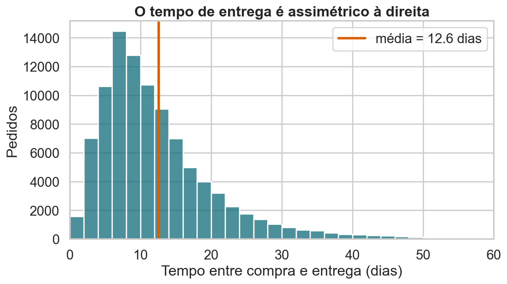{fig-alt="Histograma assimétrico à direita do tempo de entrega dos pedidos Olist, com média de 12,6 dias."}

<details class="code-fold">
<summary>Código do gráfico</summary>

```python
plt.figure(figsize=(9, 5.2))
sns.histplot(delivery, bins=np.arange(0, 61, 2), color=BLUE)
plt.axvline(mu, color=ORANGE, lw=3, label=f"média = {mu:.1f} dias")
plt.xlim(0, 60)
plt.xlabel("Tempo entre compra e entrega (dias)")
plt.ylabel("Pedidos")
plt.title("O tempo de entrega é assimétrico à direita")
plt.legend()
finish("populacao-entrega.png")
```

</details>

Há uma cauda longa: poucos pedidos demoram muito mais que o típico.

## Uma amostra é imperfeita

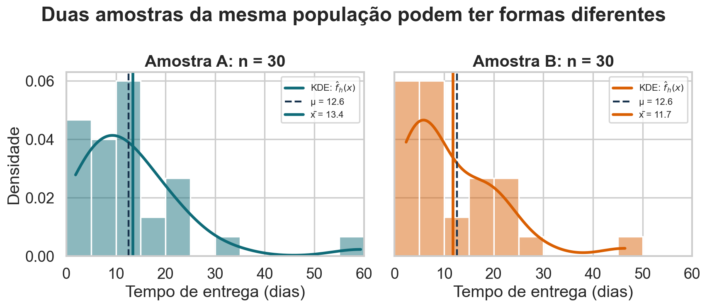{fig-alt="Distribuição populacional do tempo de entrega comparada a um histograma de uma amostra de 50 pedidos."}

<details class="code-fold">
<summary>Código do gráfico</summary>

```python
sample = rng.choice(delivery, size=50, replace=False)
plt.figure(figsize=(9, 5.2))
sns.kdeplot(delivery, color=LIGHT, lw=4, label="população")
sns.histplot(sample, bins=12, stat="density", color=ORANGE, alpha=.45, label="amostra n = 50")
plt.axvline(mu, color=INK, lw=2, ls="--", label=f"μ = {mu:.1f}")
plt.axvline(sample.mean(), color=ORANGE, lw=3, label=f"x̄ = {sample.mean():.1f}")
plt.xlim(0, 60)
plt.xlabel("Tempo de entrega (dias)")
plt.ylabel("Densidade")
plt.title("Uma amostra não reproduz perfeitamente a população")
plt.legend()
finish("amostra-entrega.png")
```

</details>

Outra amostra produziria outro histograma e outra média.

## Parâmetro, estimador e estimativa

| Objeto | Exemplo |
|---|---:|
| Parâmetro | média populacional $\mu=12{,}56$ |
| Estimador | $\bar{X}=n^{-1}\sum X_i$ |
| Estimativa | valor de $\bar{x}$ obtido na amostra |

O parâmetro é fixo; o estimador varia com a amostra.

## Repetir a coleta revela a incerteza

Imagine retirar muitas amostras de mesmo tamanho:

$$
\bar{x}_1,\ \bar{x}_2,\ \ldots,\ \bar{x}_R
$$

::: {.statement}
A distribuição desses valores é a distribuição amostral da média.
:::

## A distribuição amostral tem outro formato

Ela responde perguntas sobre o **estimador**, não sobre pedidos individuais:

- onde as médias amostrais se concentram?
- quanto variam entre amostras?
- qual formato descreve essa variação?
- quão provável é uma estimativa distante de $\mu$?

## O erro padrão mede a oscilação

Para observações independentes com variância $\sigma^2$:

$$
\operatorname{Var}(\bar{X})=\frac{\sigma^2}{n}
$$

$$
\operatorname{SE}(\bar{X})=\frac{\sigma}{\sqrt{n}}
$$

## Aumentar n concentra as médias

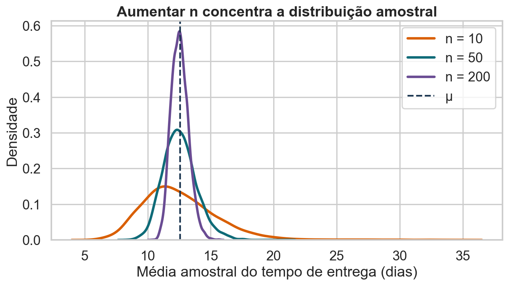{fig-alt="Distribuições amostrais da média do tempo de entrega para amostras de tamanho 10, 50 e 200."}

<details class="code-fold">
<summary>Código do gráfico</summary>

```python
means_10 = sample_means(delivery, 10)
means_50 = sample_means(delivery, 50)
means_200 = sample_means(delivery, 200)
plt.figure(figsize=(9, 5.2))
for vals, label, color in [(means_10, "n = 10", ORANGE), (means_50, "n = 50", BLUE), (means_200, "n = 200", PURPLE)]:
    sns.kdeplot(vals, lw=3, color=color, label=label)
plt.axvline(mu, color=INK, lw=2, ls="--", label="μ")
plt.xlabel("Média amostral do tempo de entrega (dias)")
plt.ylabel("Densidade")
plt.title("Aumentar n concentra a distribuição amostral")
plt.legend()
finish("tcl-tamanhos.png")
```

</details>

O centro permanece em $\mu$; a dispersão diminui.

## LGN e TCL respondem perguntas diferentes

::: {.icd-grid .theorem-grid}
::: {.icd-card .lgn-card}
<p class="theorem-card-title">Lei dos Grandes Números</p>

$${\bar X}_n \xrightarrow{P} \mu$$

**Pergunta:** para onde a média amostral vai?

**Resposta:** $\bar X_n$ se aproxima de $\mu$ quando $n$ cresce.

**Não informa:** o formato aproximado da distribuição de $\bar X_n$.
:::

::: {.icd-card .tcl-card}
<p class="theorem-card-title">Teorema Central do Limite</p>

$$\frac{\bar X_n-\mu}{\sigma/\sqrt n}\xrightarrow{d}N(0,1)$$

**Pergunta:** como $\bar X_n$ oscila ao redor de $\mu$?

**Resposta:** descreve o formato aproximadamente Normal e a escala $\sigma/\sqrt n$.

**Não afirma:** que os dados originais sejam Normais.
:::
:::

::: {.statement}
LGN fala de **convergência ao alvo**; TCL, da **distribuição do erro**.
:::

## O Teorema Central do Limite

Sob condições usuais, quando $n$ é suficientemente grande:

$$
\frac{\bar{X}-\mu}{\sigma/\sqrt{n}}
\xrightarrow{d}N(0,1)
$$

Equivalentemente:

$$
\bar{X}\approx N\left(\mu,\frac{\sigma^2}{n}\right)
$$

## Independência é uma condição central

O TCL clássico pressupõe observações independentes ou fracamente dependentes.

Pode falhar quando:

- medimos repetidamente o mesmo indivíduo;
- eventos vizinhos influenciam uns aos outros;
- séries temporais têm forte autocorrelação;
- a coleta agrupa unidades muito semelhantes.

## A amostra deve representar a população

O TCL descreve variabilidade aleatória **dentro do mecanismo assumido**.

Ele não corrige:

- viés de seleção;
- grupos ausentes;
- erros sistemáticos de medição;
- mudanças da população ao longo do tempo.

## Amostragem sem reposição exige cuidado

Quando amostramos grande parte de uma população finita:

$$
\operatorname{SE}(\bar{X})
=\frac{\sigma}{\sqrt{n}}
\sqrt{\frac{N-n}{N-1}}
$$

Se $n/N<10\%$, a correção costuma ser pequena.

## O formato inicial pode ser muito diferente

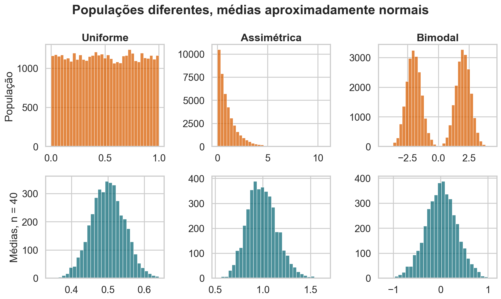{fig-alt="Populações uniforme, assimétrica e bimodal, com distribuições de médias amostrais aproximadamente normais."}

<details class="code-fold">
<summary>Código do gráfico</summary>

```python
fig, axes = plt.subplots(2, 3, figsize=(12, 7.2))
populations = [
    (rng.uniform(0, 1, 40000), "Uniforme"),
    (rng.exponential(1, 40000), "Assimétrica"),
    (np.r_[rng.normal(-2, .6, 20000), rng.normal(2, .6, 20000)], "Bimodal"),
]
for col, (pop, title) in enumerate(populations):
    sns.histplot(pop, bins=35, color=ORANGE, ax=axes[0, col])
    axes[0, col].set_title(title)
    axes[0, col].set_ylabel("População" if col == 0 else "")
    means = sample_means(pop, 40, 4000)
    sns.histplot(means, bins=30, color=BLUE, ax=axes[1, col])
    axes[1, col].set_ylabel("Médias, n = 40" if col == 0 else "")
fig.suptitle("Populações diferentes, médias aproximadamente normais", fontweight="bold")
finish("tcl-tres-populacoes.png")
```

</details>

O TCL atua sobre as médias, não transforma os dados originais.

## Assimetria exige amostras maiores

Não existe um número mágico universal como $n=30$.

O tamanho adequado depende de:

- assimetria e caudas;
- presença de outliers;
- dependência entre observações;
- estatística utilizada;
- precisão desejada.

## Padronizar remove unidade e escala

$$
Z=\frac{\bar{X}-\mu}{\sigma/\sqrt{n}}
$$

$Z$ mede quantos erros padrão a média amostral está distante de $\mu$.

Valores próximos de zero são comuns; valores extremos são raros.

## A Normal padrão vira referência

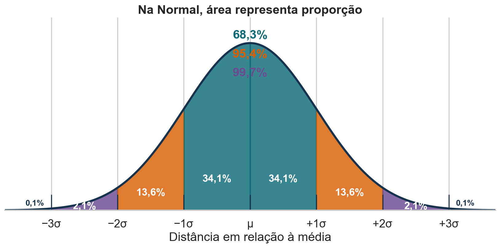{fig-alt="Curva Normal dividida em faixas de desvios padrão. A área central até um desvio padrão contém 68,3%, até dois contém 95,4% e até três contém 99,7%."}

<details class="code-fold">
<summary>Código do gráfico</summary>

```python
x = np.linspace(-3.7, 3.7, 1200)
densidade = np.exp(-x**2 / 2) / np.sqrt(2 * np.pi)

fig, ax = plt.subplots(figsize=(10.5, 5.4))
ax.plot(x, densidade, color="#17324d", lw=3)

faixas = [
    (-3, -2, "#6a4c93", "2,1%"),
    (-2, -1, "#d95f02", "13,6%"),
    (-1,  0, "#0f6b78", "34,1%"),
    ( 0,  1, "#0f6b78", "34,1%"),
    ( 1,  2, "#d95f02", "13,6%"),
    ( 2,  3, "#6a4c93", "2,1%"),
]

for inicio, fim, cor, rotulo in faixas:
    trecho = (x >= inicio) & (x <= fim)
    ax.fill_between(x[trecho], 0, densidade[trecho], color=cor, alpha=.82)
```

</details>

Área sob a curva representa a proporção esperada de observações.

## A simulação acompanha a Normal

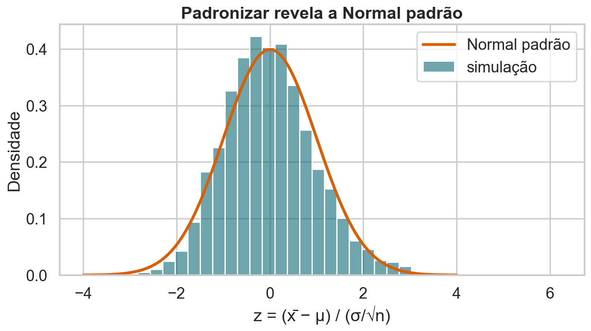{fig-alt="Histograma das médias padronizadas do tempo de entrega sobreposto à densidade Normal padrão."}

<details class="code-fold">
<summary>Código do gráfico</summary>

```python
z_means = (means_50 - mu) / (sigma / np.sqrt(50))
x = np.linspace(-4, 4, 400)
normal_pdf = np.exp(-x**2 / 2) / np.sqrt(2 * np.pi)
plt.figure(figsize=(9, 5.2))
sns.histplot(z_means, bins=35, stat="density", color=BLUE, alpha=.6, label="simulação")
plt.plot(x, normal_pdf, color=ORANGE, lw=3, label="Normal padrão")
plt.xlabel("z = (x̄ − μ) / (σ/√n)")
plt.ylabel("Densidade")
plt.title("Padronizar revela a Normal padrão")
plt.legend()
finish("padronizacao-tcl.png")
```

</details>

A unidade “dias” desaparece após a padronização.

## A fórmula do erro padrão funciona

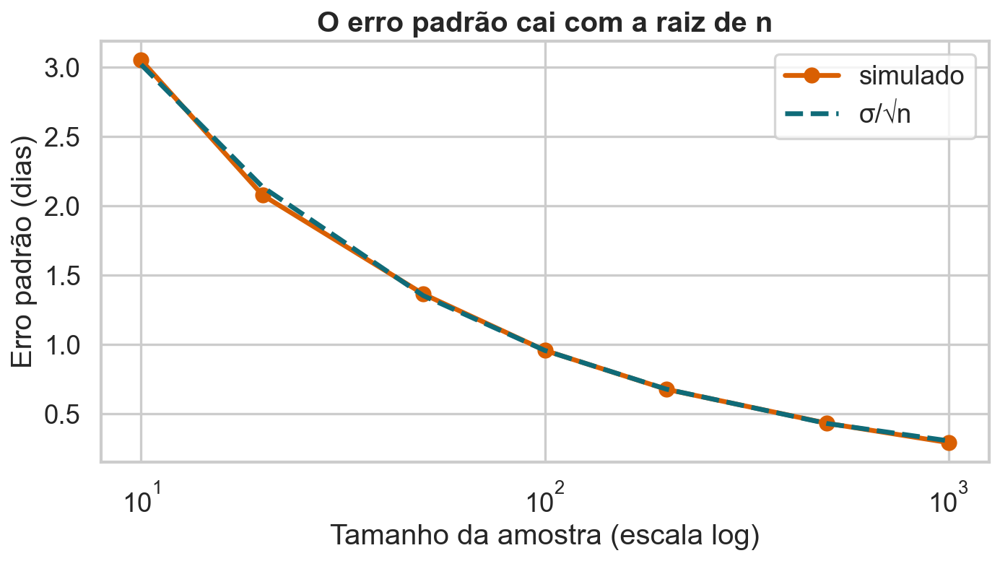{fig-alt="Erro padrão simulado e teórico do tempo médio de entrega em função do tamanho da amostra."}

<details class="code-fold">
<summary>Código do gráfico</summary>

```python
ns = np.array([10, 20, 50, 100, 200, 500, 1000])
se_emp = np.array([sample_means(delivery, int(n), 1800).std(ddof=1) for n in ns])
se_theory = sigma / np.sqrt(ns)
plt.figure(figsize=(9, 5.2))
plt.plot(ns, se_emp, "o-", color=ORANGE, lw=3, label="simulado")
plt.plot(ns, se_theory, "--", color=BLUE, lw=3, label="σ/√n")
plt.xscale("log")
plt.xlabel("Tamanho da amostra (escala log)")
plt.ylabel("Erro padrão (dias)")
plt.title("O erro padrão cai com a raiz de n")
plt.legend()
finish("erro-padrao-entrega.png")
```

</details>

O padrão simulado coincide com $\sigma/\sqrt{n}$.

## Do TCL para uma faixa plausível

Se aproximadamente 95% das médias satisfazem:

$$
-1{,}96<\frac{\bar{X}-\mu}{\sigma/\sqrt{n}}<1{,}96
$$

podemos reorganizar a desigualdade para isolar $\mu$.

## Estimativa pontual não mostra precisão

Uma média amostral de 12,6 dias pode vir de:

- uma amostra pequena e instável;
- uma amostra grande e precisa;
- dados independentes;
- observações fortemente agrupadas.

::: {.statement}
O mesmo número pode carregar incertezas muito diferentes.
:::

## Estimamos o erro padrão

Como $\sigma$ normalmente é desconhecido, usamos o desvio padrão amostral $s$:

$$
\widehat{\operatorname{SE}}(\bar{X})=\frac{s}{\sqrt{n}}
$$

Para amostras pequenas, a distribuição t substitui a Normal.

## Valor crítico define a cobertura

Para um intervalo bilateral:

| Confiança | Valor crítico Normal |
|---:|---:|
| 80% | 1,282 |
| 90% | 1,645 |
| 95% | 1,960 |
| 99% | 2,576 |

Mais confiança exige alcançar uma área maior da distribuição.

## Intervalo de confiança para a média

Uma aproximação de 95% é:

$$
\bar{x}\ \pm\ 1{,}96\frac{s}{\sqrt{n}}
$$

ou:

$$
[\bar{x}-1{,}96\operatorname{SE},\ \bar{x}+1{,}96\operatorname{SE}]
$$

## Um intervalo com n = 100

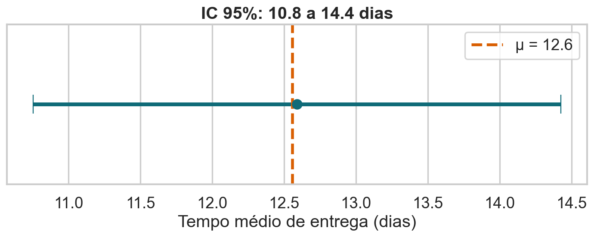{fig-alt="Intervalo de confiança de 95 por cento para o tempo médio de entrega, com a média populacional marcada."}

<details class="code-fold">
<summary>Código do gráfico</summary>

```python
n_ci = 100
sample_ci = rng.choice(delivery, n_ci, replace=False)
mean_ci = sample_ci.mean()
se_ci = sample_ci.std(ddof=1) / np.sqrt(n_ci)
lo, hi = mean_ci - 1.96 * se_ci, mean_ci + 1.96 * se_ci
plt.figure(figsize=(9, 3.8))
plt.errorbar(mean_ci, 0, xerr=1.96 * se_ci, fmt="o", color=BLUE, capsize=10, lw=4, ms=10)
plt.axvline(mu, color=ORANGE, lw=3, ls="--", label=f"μ = {mu:.1f}")
plt.yticks([])
plt.xlabel("Tempo médio de entrega (dias)")
plt.title(f"IC 95%: {lo:.1f} a {hi:.1f} dias")
plt.legend()
finish("intervalo-exemplo.png")
```

</details>

Esta amostra produziu um intervalo de aproximadamente 10,8 a 14,4 dias.

## O parâmetro não é aleatório

Depois de calcular o intervalo, $\mu$ está ou não está dentro dele.

Evite dizer:

> Há 95% de probabilidade de $\mu$ estar neste intervalo.

Na interpretação frequencista, a aleatoriedade está no procedimento.

## Confiança descreve repetição

::: {.statement}
Se repetíssemos a amostragem muitas vezes, cerca de 95% dos intervalos construídos pelo mesmo método cobririam $\mu$.
:::

Não esperamos que todos cubram o parâmetro.

## Alguns intervalos falham

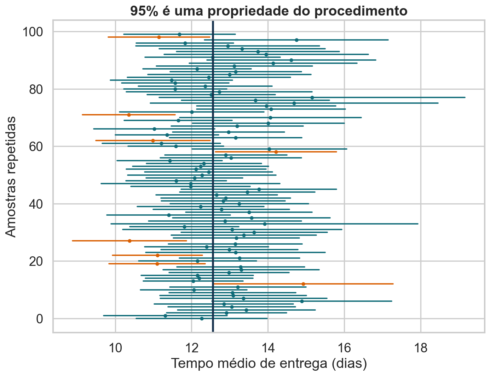{fig-alt="Cem intervalos de confiança simulados, com os que não cobrem a média populacional destacados em laranja."}

<details class="code-fold">
<summary>Código do gráfico</summary>

```python
intervals = []
for _ in range(100):
    s = rng.choice(delivery, n_ci, replace=True)
    m = s.mean()
    se = s.std(ddof=1) / np.sqrt(n_ci)
    intervals.append((m - 1.96 * se, m + 1.96 * se, m))
plt.figure(figsize=(9, 7))
for i, (lo_i, hi_i, m_i) in enumerate(intervals):
    covered = lo_i <= mu <= hi_i
    color = BLUE if covered else ORANGE
    plt.plot([lo_i, hi_i], [i, i], color=color, lw=1.7)
    plt.scatter(m_i, i, color=color, s=10)
plt.axvline(mu, color=INK, lw=2.5)
plt.xlabel("Tempo médio de entrega (dias)")
plt.ylabel("Amostras repetidas")
plt.title("95% é uma propriedade do procedimento")
finish("cobertura-intervalos.png")
```

</details>

Os intervalos laranja são erros esperados do procedimento.

## Mais confiança produz mais largura

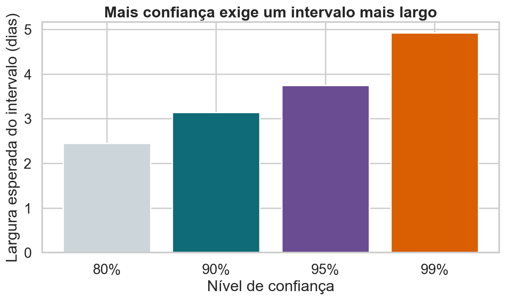{fig-alt="Barras mostrando intervalos mais largos para níveis de confiança de 80, 90, 95 e 99 por cento."}

<details class="code-fold">
<summary>Código do gráfico</summary>

```python
levels = np.array([0.80, 0.90, 0.95, 0.99])
z_values = np.array([1.282, 1.645, 1.960, 2.576])
widths = 2 * z_values * sigma / np.sqrt(100)
plt.figure(figsize=(8.5, 5.2))
plt.bar(["80%", "90%", "95%", "99%"], widths, color=[LIGHT, BLUE, PURPLE, ORANGE])
plt.ylabel("Largura esperada do intervalo (dias)")
plt.xlabel("Nível de confiança")
plt.title("Mais confiança exige um intervalo mais largo")
finish("confianca-largura.png")
```

</details>

Não ganhamos cobertura gratuitamente.

## Margem de erro

Para 95% de confiança:

$$
ME=1{,}96\frac{s}{\sqrt{n}}
$$

Ela diminui quando:

- $n$ aumenta;
- a variabilidade dos dados diminui;
- aceitamos menor nível de confiança.

## Planejar a amostra pela precisão

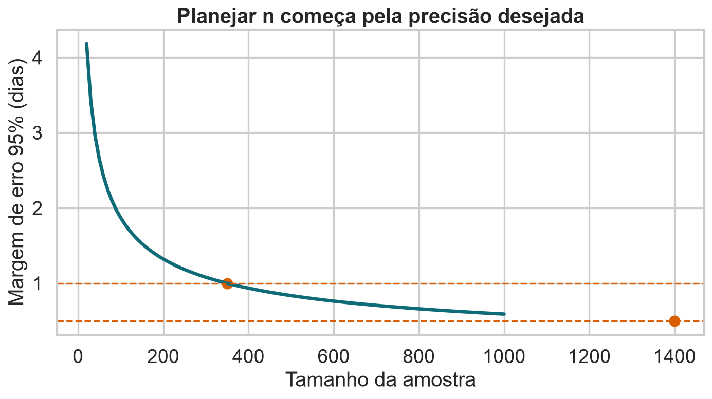{fig-alt="Curva decrescente da margem de erro em função do tamanho da amostra."}

<details class="code-fold">
<summary>Código do gráfico</summary>

```python
ns_margin = np.arange(20, 1001, 10)
margin = 1.96 * sigma / np.sqrt(ns_margin)
plt.figure(figsize=(9, 5.2))
plt.plot(ns_margin, margin, color=BLUE, lw=3)
for target in [1.0, .5]:
    need = (1.96 * sigma / target) ** 2
    plt.axhline(target, color=ORANGE, lw=1.5, ls="--")
    plt.scatter(need, target, color=ORANGE, s=70)
plt.xlabel("Tamanho da amostra")
plt.ylabel("Margem de erro 95% (dias)")
plt.title("Planejar n começa pela precisão desejada")
finish("margem-tamanho.png")
```

</details>

Dobrar a precisão exige aproximadamente quadruplicar $n$.

## Fórmula para planejar n

Se desejamos margem máxima $m$:

$$
n\approx\left(\frac{z^*\sigma}{m}\right)^2
$$

Na prática, usamos:

- estudo piloto para estimar $\sigma$;
- valor conservador;
- dados históricos comparáveis.

## A validade depende das suposições

Antes de reportar um intervalo, verifique:

- como a amostra foi selecionada;
- independência ou estrutura de grupos;
- tamanho e assimetria;
- outliers e erros de registro;
- estabilidade da população no período.

## Bootstrap é uma alternativa útil

Quando a fórmula analítica é difícil:

1. reamostramos os dados com reposição;
2. calculamos a estatística em cada reamostra;
3. usamos a distribuição simulada;
4. extraímos percentis para formar uma faixa.

O bootstrap não corrige uma amostra enviesada.

## Intervalo para uma proporção

Para uma proporção amostral $\widehat{p}$:

$$
\widehat{\operatorname{SE}}(\widehat{p})
=\sqrt{\frac{\widehat{p}(1-\widehat{p})}{n}}
$$

Aproximação Normal:

$$
\widehat{p}\pm1{,}96\widehat{\operatorname{SE}}(\widehat{p})
$$

## Atividade: comunique a incerteza

Uma amostra de 100 pedidos tem média de 13,1 dias e desvio padrão de 9 dias.

1. Calcule o erro padrão.
2. Construa um IC de 95%.
3. Interprete sem atribuir probabilidade ao parâmetro.
4. Como reduzir a margem pela metade?
5. Que suposição seria mais preocupante?

## O que aprendemos

1. O TCL descreve a distribuição amostral da média.
2. O erro padrão mede a variação entre amostras.
3. Um IC combina estimativa, erro padrão e valor crítico.
4. Confiança é cobertura em repetições.
5. Precisão depende de variabilidade, $n$ e confiança.

## Próxima aula

::: {.statement}
Um intervalo mostra valores plausíveis. Como avaliar uma afirmação específica?
:::

Na Aula 11, construiremos testes de hipóteses, p-valores e poder estatístico.

## Fonte dos dados {.smaller}

- Brazilian E-Commerce Public Dataset by Olist, Kaggle: `olistbr/brazilian-ecommerce`.
- Cerca de 100 mil pedidos reais e anonimizados, de 2016 a 2018.
- Material conceitual adaptado do PDF fornecido para a disciplina.
