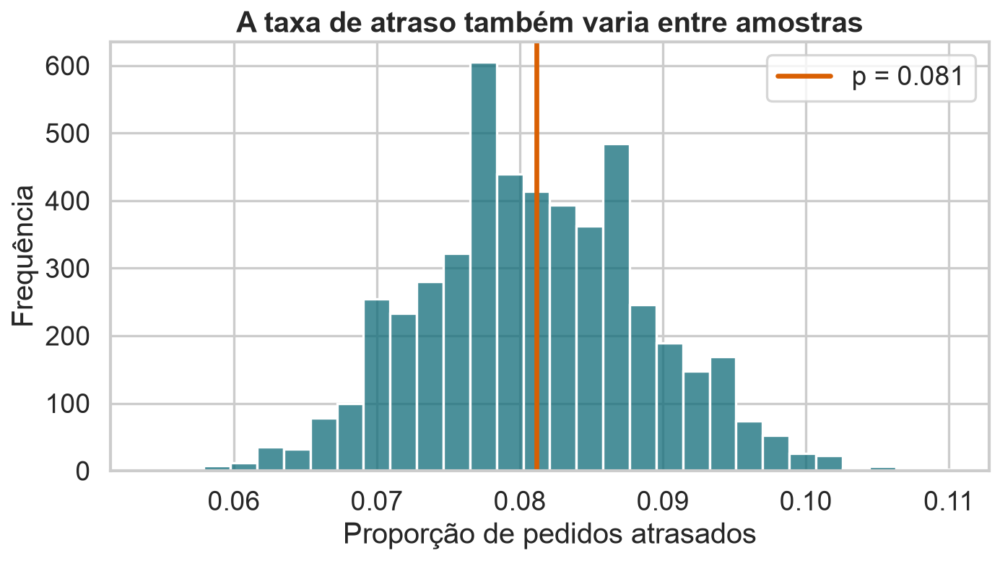
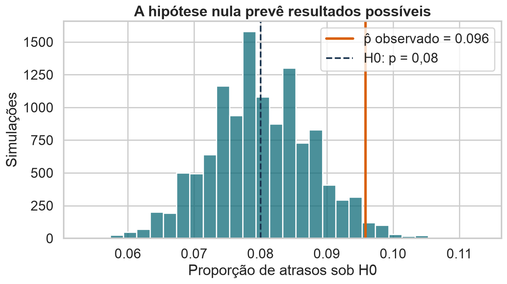
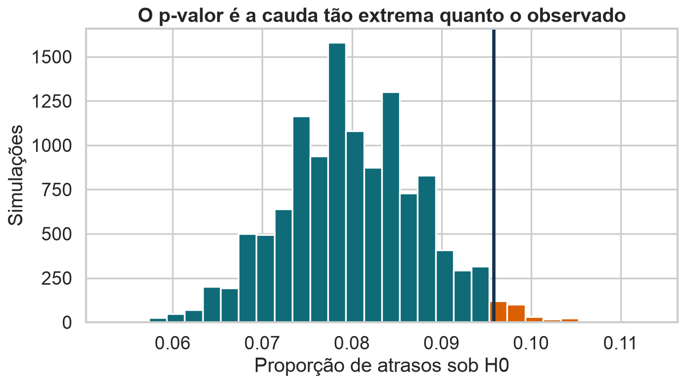
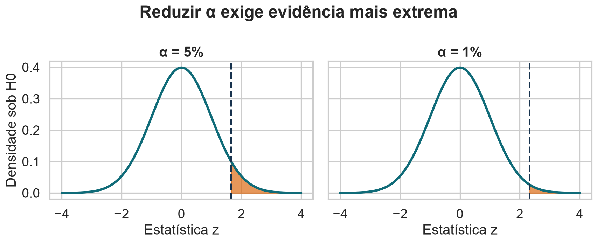
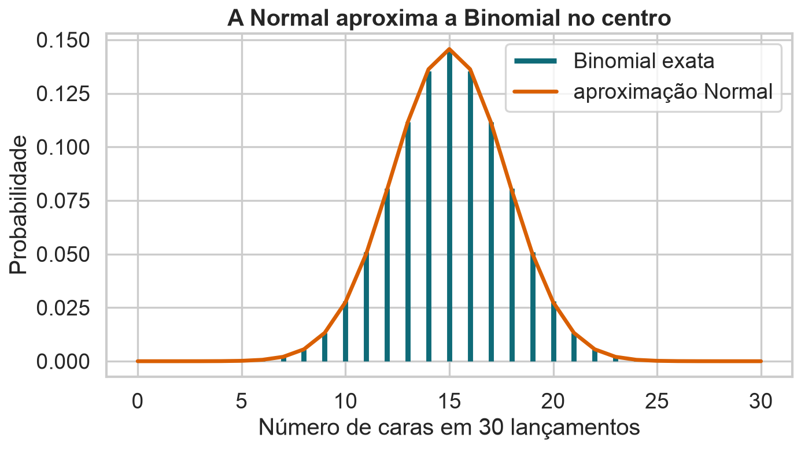
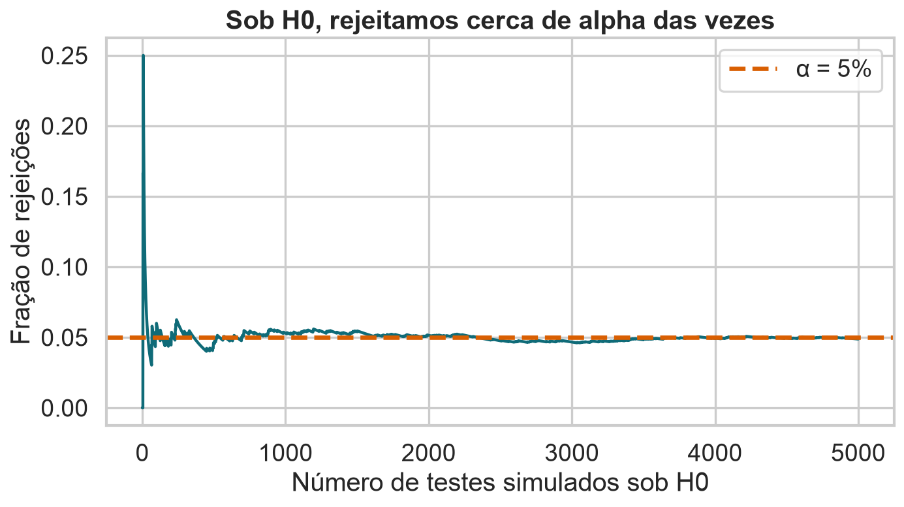
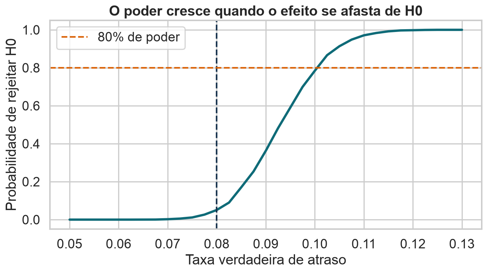

## Testes de hipóteses

::: {.statement}
Quando uma diferença observada é grande demais para atribuir apenas ao acaso?
:::

Exemplo da aula: taxa de pedidos entregues depois da data prevista.

## Hoje

- hipótese nula e alternativa;
- distribuição nula;
- estatística de teste;
- p-valor e nível de significância;
- erros tipo I e II;
- poder, tamanho amostral e efeito;
- teste exato, aproximação e simulação.

## O problema da aula

Um limite operacional considera aceitável uma taxa de atraso de 8%.

::: {.statement}
Há evidência de que a taxa de atrasos excede 8%?
:::

Precisamos separar diferença real de variação amostral.

## O recorte vem da base Olist

- unidade de observação: um pedido do e-commerce brasileiro;
- aproximadamente 100 mil pedidos entre 2016 e 2018;
- 96.476 pedidos com datas de compra, previsão e entrega completas;
- variável da aula: `late`, igual a 1 quando a entrega supera a data prevista;
- taxa descritiva na população didática: 8,11% de atrasos.

A amostra de 1.200 pedidos será usada para testar uma referência operacional de 8%.

## Atraso vira uma variável binária

Para cada pedido:

$$
Y_i=
\begin{cases}
1, & \text{entregue depois da data prevista}\\
0, & \text{entregue até a data prevista}
\end{cases}
$$

O parâmetro $p=P(Y=1)$ é a taxa populacional de atraso.

## A estimativa é uma proporção

$$
\widehat{p}=\frac{1}{n}\sum_{i=1}^{n}Y_i
$$

Em uma amostra de 1.200 pedidos:

$$
k=115,
\qquad
\widehat{p}=115/1200=0{,}0958
$$

Observamos 9,58% de atrasos.

## Proporções variam entre amostras

{fig-alt="Histograma da proporção de atrasos em muitas amostras de 1200 pedidos, centrado na taxa populacional."}

<details class="code-fold">
<summary>Código do gráfico</summary>

```python
prop_means = np.array([rng.choice(late, size=1200, replace=True).mean() for _ in range(5000)])
plt.figure(figsize=(9, 5.2))
sns.histplot(prop_means, bins=30, color=BLUE)
plt.axvline(p_late, color=ORANGE, lw=3, label=f"p = {p_late:.3f}")
plt.xlabel("Proporção de pedidos atrasados")
plt.ylabel("Frequência")
plt.title("A taxa de atraso também varia entre amostras")
plt.legend()
finish("distribuicao-taxa-atraso.png")

# Amostra observada usada na Aula 10.
obs = np.random.default_rng(13).choice(late, 1200, replace=False)
k_obs = int(obs.sum())
p_hat = obs.mean()
p0 = .08
se0 = np.sqrt(p0 * (1 - p0) / len(obs))
z_obs = (p_hat - p0) / se0
```

</details>

Uma diferença observada precisa ser comparada a essa variabilidade.

## Afirmações precisam ser formalizadas

“A taxa parece alta” é ambíguo.

Um teste exige:

- parâmetro de interesse;
- valor de referência;
- direção relevante;
- modelo para a amostragem;
- regra de decisão.

## Hipótese nula

A hipótese nula representa o valor de referência:

$$
H_0:p=0{,}08
$$

Ela é o modelo que usamos para calcular quão surpreendente é a amostra.

## Hipótese alternativa

Nossa pergunta é direcional:

$$
H_1:p>0{,}08
$$

Se a pergunta fosse “diferente de 8%”, usaríamos:

$$
H_1:p\neq0{,}08
$$

## H0 prevê resultados possíveis

Sob $H_0$, o número de atrasos segue:

$$
K\sim\operatorname{Binomial}(n=1200,p=0{,}08)
$$

Logo:

$$
E[\widehat{p}]=0{,}08,
\quad
\operatorname{SE}_0=\sqrt{\frac{0{,}08(0{,}92)}{1200}}
$$

## A distribuição nula

{fig-alt="Distribuição simulada da proporção de atrasos sob hipótese nula de 8 por cento, com o valor observado de 9,58 por cento marcado."}

<details class="code-fold">
<summary>Código do gráfico</summary>

```python
null_props = rng.binomial(len(obs), p0, size=12000) / len(obs)
plt.figure(figsize=(9, 5.2))
sns.histplot(null_props, bins=30, color=BLUE)
plt.axvline(p_hat, color=ORANGE, lw=3, label=f"p̂ observado = {p_hat:.3f}")
plt.axvline(p0, color=INK, lw=2, ls="--", label="H0: p = 0,08")
plt.xlabel("Proporção de atrasos sob H0")
plt.ylabel("Simulações")
plt.title("A hipótese nula prevê resultados possíveis")
plt.legend()
finish("distribuicao-nula.png")
```

</details>

O valor observado está à direita do centro previsto por $H_0$.

## Estatística de teste

Padronizamos a distância até o valor nulo:

$$
Z=\frac{\widehat{p}-p_0}
{\sqrt{p_0(1-p_0)/n}}
$$

$Z$ mede quantos erros padrão separam a amostra de $H_0$.

## Aplicando aos pedidos

$$
Z=
\frac{0{,}0958-0{,}08}
{\sqrt{0{,}08(0{,}92)/1200}}
=2{,}02
$$

Se $H_0$ fosse verdadeira, a estimativa estaria 2,02 erros padrão acima do esperado.

## O p-valor mede extremidade

Para o teste unilateral:

$$
p\text{-valor}=P(Z\ge2{,}02\mid H_0)
$$

Neste exemplo:

$$
p\text{-valor}\approx0{,}0216
$$

## A cauda representa o p-valor

{fig-alt="Distribuição nula da taxa de atraso com a região tão extrema quanto o resultado observado destacada em laranja."}

<details class="code-fold">
<summary>Código do gráfico</summary>

```python
counts, bins = np.histogram(null_props, bins=30)
centers = (bins[:-1] + bins[1:]) / 2
plt.figure(figsize=(9, 5.2))
colors = [ORANGE if c >= p_hat else BLUE for c in centers]
plt.bar(centers, counts, width=np.diff(bins), color=colors, align="center")
plt.axvline(p_hat, color=INK, lw=3)
plt.xlabel("Proporção de atrasos sob H0")
plt.ylabel("Simulações")
plt.title("O p-valor é a cauda tão extrema quanto o observado")
finish("pvalor-cauda.png")
```

</details>

Contamos resultados tão ou mais favoráveis a $H_1$ que o observado.

## O p-valor não é

- a probabilidade de $H_0$ ser verdadeira;
- a probabilidade de o resultado ter ocorrido por acaso;
- o tamanho do efeito;
- a importância prática da diferença;
- a chance de replicação do estudo.

::: {.statement}
É uma probabilidade calculada assumindo $H_0$.
:::

## Nível de significância

Escolhemos antes do teste um limite $\alpha$ para o erro tipo I.

Regra comum:

$$
p\text{-valor}<\alpha\quad\Rightarrow\quad\text{rejeitar }H_0
$$

Com $\alpha=0{,}05$, rejeitaríamos $H_0$ neste exemplo.

## Alpha define a região de rejeição

{fig-alt="Duas curvas normais com regiões de rejeição unilaterais para níveis de significância de 5 e 1 por cento."}

<details class="code-fold">
<summary>Código do gráfico</summary>

```python
xz = np.linspace(-4, 4, 500)
pdf = np.exp(-xz**2 / 2) / np.sqrt(2 * np.pi)
fig, axes = plt.subplots(1, 2, figsize=(11, 4.5), sharey=True)
for ax, cutoff, alpha in [(axes[0], 1.645, "5%"), (axes[1], 2.326, "1%")]:
    ax.plot(xz, pdf, color=BLUE, lw=3)
    ax.fill_between(xz, 0, pdf, where=xz >= cutoff, color=ORANGE, alpha=.65)
    ax.axvline(cutoff, color=INK, ls="--")
    ax.set_title(f"α = {alpha}")
    ax.set_xlabel("Estatística z")
axes[0].set_ylabel("Densidade sob H0")
fig.suptitle("Reduzir α exige evidência mais extrema", fontweight="bold")
finish("regioes-rejeicao.png")
```

</details>

Reduzir $\alpha$ exige uma estatística mais extrema.

## Rejeitar não significa provar

Conclusão adequada:

> Os dados fornecem evidência contra uma taxa de atraso de 8%, em favor de uma taxa maior.

Evite:

> Provamos que a taxa verdadeira é maior que 8%.

## Não rejeitar também não prova H0

Um resultado não significativo pode ocorrer porque:

- $H_0$ é compatível com os dados;
- a amostra é pequena;
- o efeito é menor que o detectável;
- a variabilidade é alta;
- o desenho viola suposições.

“Ausência de evidência” não é “evidência de ausência”.

## Intervalo e teste contam a mesma história

Em um teste bilateral com $\alpha=5\%$:

- rejeitamos $H_0:\theta=\theta_0$;
- exatamente quando $\theta_0$ fica fora do IC de 95% correspondente.

O intervalo acrescenta uma faixa de efeitos plausíveis.

## Teste exato Binomial

Sob $H_0$:

$$
K\sim\operatorname{Binomial}(1200,0{,}08)
$$

O p-valor exato unilateral é:

$$
P(K\ge115\mid p=0{,}08)
$$

Não precisamos aproximar uma variável discreta por uma Normal.

## Aproximação Normal

Podemos usar a Normal quando os números esperados de sucessos e falhas são suficientes:

$$
np_0\ge10,
\qquad
n(1-p_0)\ge10
$$

Aqui: 96 atrasos e 1.104 não atrasos são esperados sob $H_0$.

## A Normal aproxima a Binomial

{fig-alt="Probabilidades da Binomial para número de caras em 30 lançamentos e curva da aproximação Normal."}

<details class="code-fold">
<summary>Código do gráfico</summary>

```python
n_small, p_small = 30, .5
k = np.arange(n_small + 1)
from math import comb
pmf = np.array([comb(n_small, int(i)) * p_small**i * (1-p_small)**(n_small-i) for i in k])
normal = np.exp(-((k-n_small*p_small)/np.sqrt(n_small*p_small*(1-p_small)))**2/2)
normal = normal / normal.sum()
plt.figure(figsize=(9, 5.2))
plt.vlines(k, 0, pmf, color=BLUE, lw=4, label="Binomial exata")
plt.plot(k, normal, color=ORANGE, lw=3, label="aproximação Normal")
plt.xlabel("Número de caras em 30 lançamentos")
plt.ylabel("Probabilidade")
plt.title("A Normal aproxima a Binomial no centro")
plt.legend()
finish("binomial-normal.png")

print(f"Figuras geradas em {OUT}")
print(f"N={len(orders)}; média={mu:.3f}; sigma={sigma:.3f}; atraso={p_late:.5f}")
print(f"Amostra teste: n={len(obs)}, k={k_obs}, p_hat={p_hat:.5f}, z={z_obs:.3f}, p-valor={1-normal_cdf(z_obs):.4f}")
```

</details>

A aproximação é melhor no centro e com contagens esperadas grandes.

## Simulação sob a hipótese nula

Também podemos gerar muitas amostras com $p=0{,}08$:

```{python}
#| echo: true
nulos = rng.binomial(n=1200, p=0.08, size=10000) / 1200
pvalor = (nulos >= p_observado).mean()
```

Simulação torna a lógica visível e generaliza para estatísticas complexas.

## Três caminhos, mesma pergunta

| Método | Vantagem | Limite |
|---|---|---|
| Exato | sem aproximação | pode ser difícil |
| Normal/TCL | fórmula rápida | depende de condições |
| Simulação | flexível e visual | tem erro Monte Carlo |

Resultados próximos aumentam nossa confiança na implementação.

## Toda decisão pode errar

| Realidade | Não rejeitar $H_0$ | Rejeitar $H_0$ |
|---|---|---|
| $H_0$ verdadeira | decisão correta | erro tipo I |
| $H_1$ verdadeira | erro tipo II | decisão correta |

Não existe regra que elimine os dois erros simultaneamente.

## Erro tipo I

Rejeitar $H_0$ quando ela é verdadeira.

No contexto:

> Concluir que a taxa excede 8% quando ela é exatamente 8%.

Sua probabilidade é controlada por $\alpha$.

## Alpha aparece nas repetições

{fig-alt="Fração acumulada de rejeições em cinco mil testes simulados sob a hipótese nula, convergindo para 5 por cento."}

<details class="code-fold">
<summary>Código do gráfico</summary>

```python
rejections = []
running = []
for i in range(1, 5001):
    ph = rng.binomial(1200, p0) / 1200
    z = (ph - p0) / se0
    rejections.append(z > 1.645)
    running.append(np.mean(rejections))
plt.figure(figsize=(9, 5.2))
plt.plot(running, color=BLUE, lw=2)
plt.axhline(.05, color=ORANGE, lw=3, ls="--", label="α = 5%")
plt.xlabel("Número de testes simulados sob H0")
plt.ylabel("Fração de rejeições")
plt.title("Sob H0, rejeitamos cerca de alpha das vezes")
plt.legend()
finish("erro-tipo-i.png")
```

</details>

Com $H_0$ verdadeira, cerca de 5% dos testes rejeitam por acaso quando $\alpha=5\%$.

## Reduzir alpha tem um custo

Um $\alpha$ menor:

- reduz falsos positivos;
- exige evidência mais extrema;
- aumenta a chance de não detectar efeitos reais;
- pode exigir amostras maiores.

A escolha deve refletir o custo dos erros.

## Erro tipo II

Não rejeitar $H_0$ quando $H_1$ é verdadeira.

No contexto:

> Não detectar uma taxa realmente superior a 8%.

Sua probabilidade é $\beta$.

## Poder estatístico

$$
\text{poder}=1-\beta
$$

É a probabilidade de rejeitar $H_0$ quando um efeito específico é verdadeiro.

O poder depende do valor verdadeiro sob a alternativa.

## O poder cresce com o efeito

{fig-alt="Curva de poder do teste em função da taxa verdadeira de atraso, crescendo à medida que se afasta de 8 por cento."}

<details class="code-fold">
<summary>Código do gráfico</summary>

```python
true_ps = np.linspace(.05, .13, 33)
critical = p0 + 1.645 * se0
power = []
for p in true_ps:
    simulated = rng.binomial(1200, p, size=5000) / 1200
    power.append(np.mean(simulated > critical))
plt.figure(figsize=(9, 5.2))
plt.plot(true_ps, power, color=BLUE, lw=3)
plt.axvline(p0, color=INK, ls="--", lw=2)
plt.axhline(.8, color=ORANGE, ls="--", lw=2, label="80% de poder")
plt.xlabel("Taxa verdadeira de atraso")
plt.ylabel("Probabilidade de rejeitar H0")
plt.title("O poder cresce quando o efeito se afasta de H0")
plt.legend()
finish("curva-poder.png")
```

</details>

É mais fácil detectar 12% que 8,5% de atrasos.

## Tamanho da amostra aumenta o poder

Com mais observações:

- o erro padrão diminui;
- uma mesma diferença produz $|Z|$ maior;
- efeitos pequenos tornam-se detectáveis;
- resultados muito pequenos podem ficar significativos.

Planejar $n$ exige definir o menor efeito relevante.

## Tamanho do efeito importa

A diferença observada foi:

$$
0{,}0958-0{,}08=0{,}0158
$$

Ou 1,58 ponto percentual.

Pergunta operacional: essa diferença justifica uma ação?

## Significância não é importância

::: {.columns}
::: {.column width="48%"}
### Estatística

O resultado seria raro sob $H_0$?
:::

::: {.column width="48%"}
### Prática

O efeito tem magnitude e consequência relevantes?
:::
:::

Sempre reporte estimativa e intervalo, não apenas p-valor.

## Muitos testes aumentam falsos positivos

Se fazemos 20 testes independentes com $\alpha=5\%$:

$$
P(\text{ao menos um falso positivo})
=1-0{,}95^{20}\approx64\%
$$

Pré-registo, correções e validação externa ajudam a controlar o problema.

## Teste unilateral ou bilateral?

Use unilateral somente quando:

- a direção foi definida antes dos dados;
- o efeito oposto não levaria à mesma ação;
- a justificativa é substantiva, não conveniência.

Caso contrário, prefira o teste bilateral.

## Condições do teste de proporção

Verifique:

- amostra representativa;
- observações independentes;
- resultado realmente binário;
- valor nulo definido antes da análise;
- contagens esperadas adequadas para a aproximação.

## Fluxo de um teste

1. Defina parâmetro e pergunta.
2. Especifique $H_0$ e $H_1$.
3. Escolha estatística e $\alpha$.
4. Verifique condições.
5. Calcule p-valor ou simule sob $H_0$.
6. Conclua no contexto e reporte efeito e intervalo.

## Atividade: tome uma decisão

Em 800 pedidos, 76 atrasaram. Teste $H_0:p=0{,}08$ contra $H_1:p>0{,}08$.

1. Calcule $\widehat{p}$ e o erro padrão nulo.
2. Calcule $Z$.
3. Interprete o p-valor.
4. Decida para $\alpha=5\%$ e $1\%$.
5. Discuta a importância prática.

## O que aprendemos

1. Um teste compara o observado ao previsto por $H_0$.
2. O p-valor mede extremidade sob $H_0$.
3. $\alpha$ controla o erro tipo I.
4. Poder mede a chance de detectar um efeito real.
5. Significância não substitui tamanho do efeito e contexto.

## Fechamento

::: {.statement}
Inferência não elimina a incerteza; ela torna explícito como decidimos dentro dela.
:::

Boas conclusões combinam desenho, estimativa, intervalo, p-valor e consequência prática.

## Fonte dos dados {.smaller}

- Brazilian E-Commerce Public Dataset by Olist, Kaggle: `olistbr/brazilian-ecommerce`.
- Cerca de 100 mil pedidos reais e anonimizados, de 2016 a 2018.
- Material conceitual adaptado do PDF fornecido para a disciplina.
