## Bootstrap

::: {.statement}
Como medir a incerteza quando só temos uma amostra e nenhuma fórmula conveniente?
:::

## A pergunta da aula

Em 2019, quanto mais cara era uma acomodação inteira **típica** em Manhattan do que no Brooklyn?

Não queremos apenas uma diferença observada. Queremos saber quão precisa ela é.

## Hoje

- conhecer e descrever a base Airbnb NYC 2019;
- entender por que a mediana é útil neste problema;
- construir réplicas bootstrap;
- estimar erro padrão e intervalo de confiança;
- formalizar o método;
- reconhecer quando o bootstrap é — e não é — válido.

## Airbnb NYC 2019

- 48.895 anúncios disponíveis em Nova York em 2019;
- preços, localização, tipo de acomodação e atividade dos anúncios;
- dados públicos disponibilizados no Kaggle sob licença CC0;
- unidade de observação: **um anúncio**, não uma reserva nem um hóspede.

Fonte: Kaggle, `dgomonov/new-york-city-airbnb-open-data`.

## As colunas que usaremos

| Coluna | Significado |
|---|---|
| `neighbourhood_group` | distrito da cidade |
| `room_type` | acomodação inteira, quarto privado ou compartilhado |
| `price` | preço anunciado por noite, em dólares |
| `host_id` | identificador do anfitrião |
| `availability_365` | dias disponíveis no ano |

O preço é anunciado: não observamos se a estadia realmente ocorreu.

## Dois distritos dominam a base

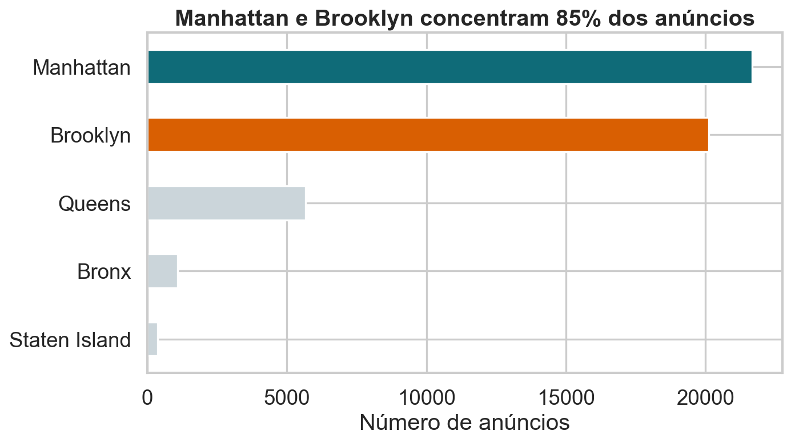{fig-alt="Barras com o número de anúncios por distrito de Nova York, destacando Manhattan e Brooklyn como os maiores grupos."}

<details class="code-fold">
<summary>Código do gráfico</summary>

```python
counts = raw["neighbourhood_group"].value_counts().sort_values()
plt.figure(figsize=(9, 5.2))
counts.plot.barh(color=[LIGHT, LIGHT, LIGHT, ORANGE, BLUE])
plt.xlabel("Número de anúncios")
plt.ylabel("")
plt.title("Manhattan e Brooklyn concentram 85% dos anúncios")
finish("anuncios-distrito.png")
```

</details>

Manhattan e Brooklyn somam aproximadamente 85% dos anúncios.

## Uma limpeza mínima e explícita

- 11 anúncios têm preço igual a zero;
- o preço máximo chega a US$ 10.000 por noite;
- para visualização e análise, removemos preços zero e o 1% superior;
- permanecem 48.410 anúncios, 99% da base original.

::: {.statement}
Limpar a cauda muda a população-alvo: agora estudamos anúncios entre US$ 1 e US$ 799.
:::

## A média é puxada pela cauda

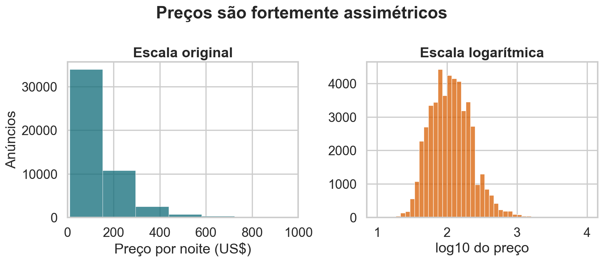{fig-alt="Dois histogramas dos preços dos anúncios Airbnb, em escala original e logarítmica, mostrando forte assimetria à direita."}

<details class="code-fold">
<summary>Código do gráfico</summary>

```python
fig, axes = plt.subplots(1, 2, figsize=(11, 4.8))
sns.histplot(raw.loc[raw["price"] > 0, "price"], bins=70, color=BLUE, ax=axes[0])
axes[0].set_xlim(0, 1000)
axes[0].set_xlabel("Preço por noite (US$)")
axes[0].set_ylabel("Anúncios")
axes[0].set_title("Escala original")
sns.histplot(np.log10(raw.loc[raw["price"] > 0, "price"]), bins=45, color=ORANGE, ax=axes[1])
axes[1].set_xlabel("log10 do preço")
axes[1].set_ylabel("")
axes[1].set_title("Escala logarítmica")
fig.suptitle("Preços são fortemente assimétricos", fontweight="bold")
finish("distribuicao-precos.png")
```

</details>

Na base original, a mediana é US$ 106 e a média é US$ 153.

## Localização importa

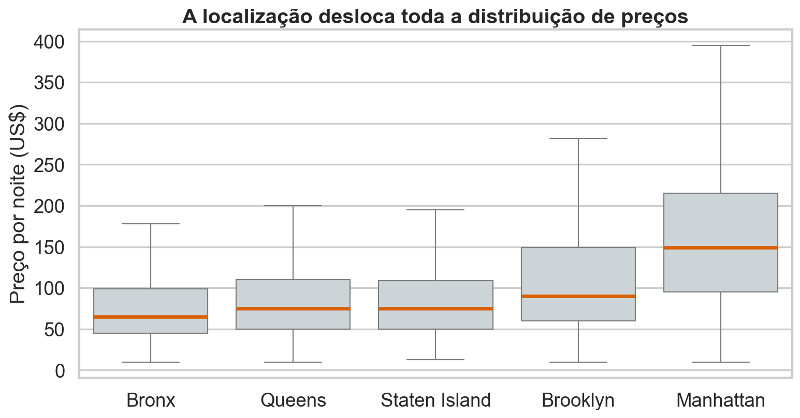{fig-alt="Boxplots de preço por noite nos cinco distritos de Nova York, sem exibir pontos extremos."}

<details class="code-fold">
<summary>Código do gráfico</summary>

```python
order = ["Bronx", "Queens", "Staten Island", "Brooklyn", "Manhattan"]
plt.figure(figsize=(10, 5.4))
sns.boxplot(data=airbnb, x="neighbourhood_group", y="price", order=order,
            showfliers=False, color=LIGHT, medianprops={"color": ORANGE, "linewidth": 3})
plt.xlabel("")
plt.ylabel("Preço por noite (US$)")
plt.title("A localização desloca toda a distribuição de preços")
finish("precos-distrito.png")
```

</details>

Mas comparar todos os anúncios mistura localização e tipo de acomodação.

## O tipo de acomodação também importa

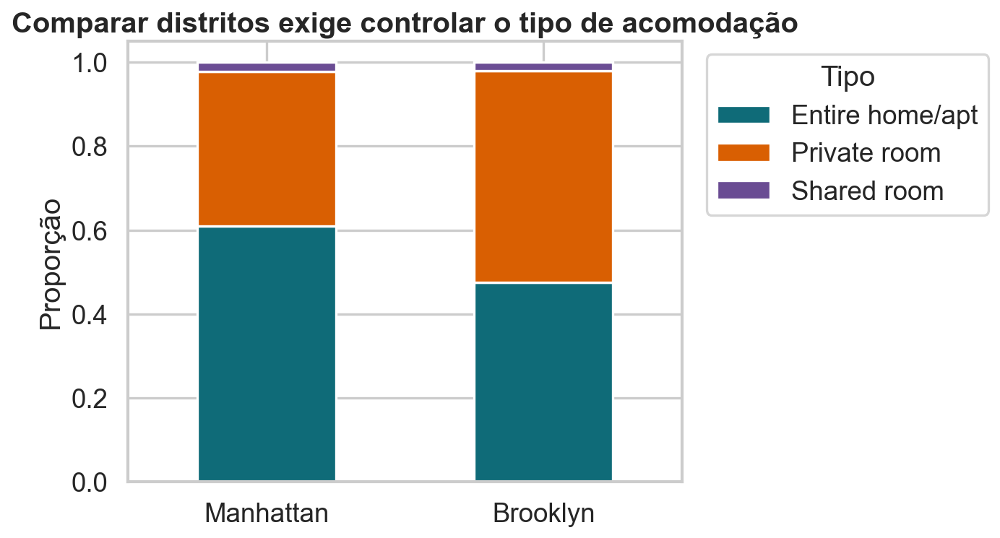{fig-alt="Barras empilhadas com a composição dos anúncios de Manhattan e Brooklyn por tipo de acomodação."}

<details class="code-fold">
<summary>Código do gráfico</summary>

```python
composition = pd.crosstab(raw["neighbourhood_group"], raw["room_type"], normalize="index")
composition = composition.loc[["Manhattan", "Brooklyn"], ["Entire home/apt", "Private room", "Shared room"]]
composition.plot.bar(stacked=True, figsize=(8.8, 5), color=[BLUE, ORANGE, PURPLE])
plt.xticks(rotation=0)
plt.xlabel("")
plt.ylabel("Proporção")
plt.title("Comparar distritos exige controlar o tipo de acomodação")
plt.legend(title="Tipo", bbox_to_anchor=(1.02, 1), loc="upper left")
finish("composicao-tipo.png")
```

</details>

Manhattan tem uma proporção maior de acomodações inteiras.

## Nossa comparação será mais justa

Vamos restringir a pergunta a:

- acomodações inteiras;
- Manhattan e Brooklyn;
- preços entre US$ 1 e US$ 799;
- uma amostra didática de 600 anúncios por distrito.

Isso evita atribuir ao distrito uma diferença que vem apenas do tipo de quarto.

## A amostra observada

| Distrito | $n$ | Média | Mediana |
|---|---:|---:|---:|
| Brooklyn | 600 | US$ 167 | US$ 140 |
| Manhattan | 600 | US$ 211 | US$ 180 |

Estimativa observada:

$$
\widehat{\Delta}=180-140=\text{US\$ }40
$$

## A mediana acompanha o anúncio típico

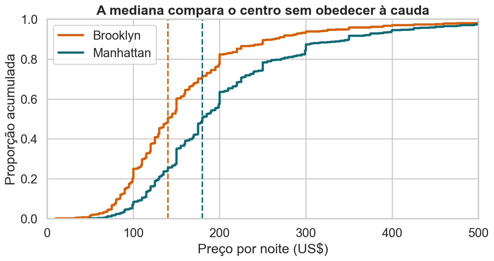{fig-alt="Curvas de distribuição acumulada dos preços de acomodações inteiras em Brooklyn e Manhattan, com as medianas marcadas."}

<details class="code-fold">
<summary>Código do gráfico</summary>

```python
plt.figure(figsize=(9.5, 5.2))
for values, label, color in [(brooklyn, "Brooklyn", ORANGE), (manhattan, "Manhattan", BLUE)]:
    sns.ecdfplot(values, label=label, color=color, lw=3)
    plt.axvline(np.median(values), color=color, ls="--", lw=2)
plt.xlim(0, 500)
plt.xlabel("Preço por noite (US$)")
plt.ylabel("Proporção acumulada")
plt.title("A mediana compara o centro sem obedecer à cauda")
plt.legend()
finish("ecdf-amostra.png")
```

</details>

A cauda extrema afeta pouco o ponto em que a curva acumulada cruza 50%.

## Por que não usar o intervalo clássico?

Para a média, o TCL fornece uma aproximação conhecida.

Para a diferença de medianas:

- a distribuição amostral pode ser irregular;
- o erro padrão depende da densidade perto da mediana;
- uma fórmula fechada exige hipóteses adicionais.

O bootstrap oferece uma aproximação computacional.

## Uma estimativa não mostra sua estabilidade

Se repetíssemos a coleta, obteríamos exatamente US$ 40 outra vez?

::: {.statement}
Precisamos imaginar muitas amostras semelhantes — mas só observamos uma.
:::

## A amostra vira uma população provisória

O bootstrap substitui a distribuição desconhecida $F$ pela distribuição empírica:

$$
\widehat F_n(x)=\frac{1}{n}\sum_{i=1}^{n}\mathbb{1}(X_i\leq x)
$$

Cada observação recebe probabilidade $1/n$.

## Reposição é indispensável

Sortear $n$ observações **sem reposição** apenas reorganiza a amostra.

Com reposição:

- algumas observações aparecem várias vezes;
- outras não aparecem;
- a estatística muda de uma réplica para outra.

Essa variação imita a incerteza amostral.

## Uma reamostragem parece imperfeita

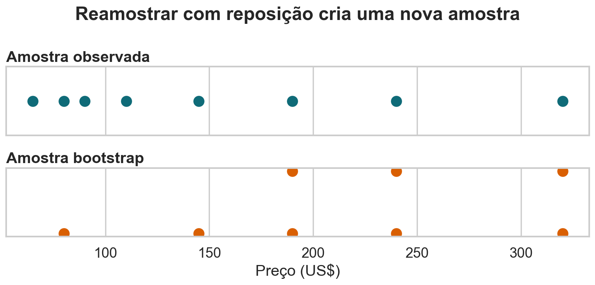{fig-alt="Pontos representando uma amostra de preços e uma reamostragem bootstrap com valores repetidos e ausentes."}

<details class="code-fold">
<summary>Código do gráfico</summary>

```python
toy = np.array([65, 80, 90, 110, 145, 190, 240, 320])
toy_boot = np.random.default_rng(7).choice(toy, len(toy), replace=True)
fig, axes = plt.subplots(2, 1, figsize=(10, 4.8), sharex=True)
for ax, values, title, color in [(axes[0], toy, "Amostra observada", BLUE),
                                  (axes[1], toy_boot, "Amostra bootstrap", ORANGE)]:
    unique, multiplicity = np.unique(values, return_counts=True)
    for x, count in zip(unique, multiplicity):
        ax.scatter([x] * count, np.arange(1, count + 1), s=130, color=color)
    ax.set_yticks([])
    ax.set_title(title, loc="left")
axes[1].set_xlabel("Preço (US$)")
fig.suptitle("Reamostrar com reposição cria uma nova amostra", fontweight="bold")
finish("reamostragem-reposicao.png")
```

</details>

Em média, uma réplica contém cerca de 63,2% das observações distintas.

## Uma réplica produz outra estimativa

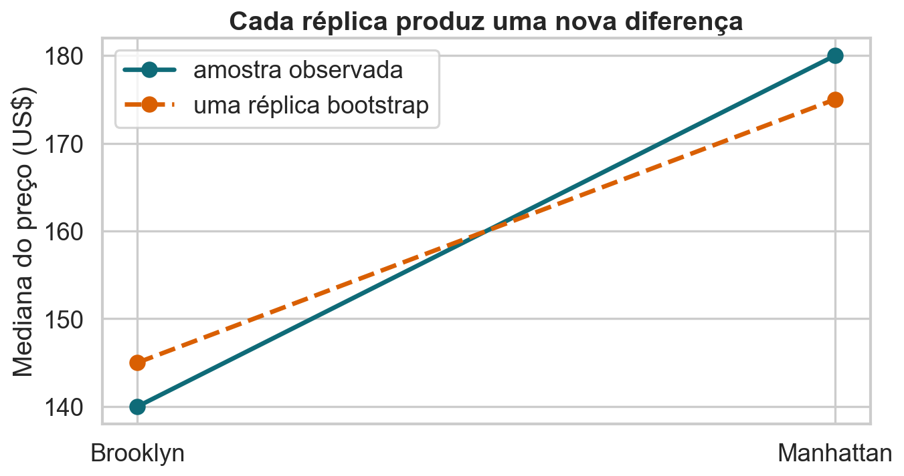{fig-alt="Medianas observadas e medianas de uma réplica bootstrap em Brooklyn e Manhattan."}

<details class="code-fold">
<summary>Código do gráfico</summary>

```python
one_m = rng.choice(manhattan, len(manhattan), replace=True)
one_b = rng.choice(brooklyn, len(brooklyn), replace=True)
observed = [np.median(brooklyn), np.median(manhattan)]
replica = [np.median(one_b), np.median(one_m)]
xpos = np.arange(2)
plt.figure(figsize=(8.8, 4.8))
plt.plot(xpos, observed, "o-", color=BLUE, lw=3, ms=10, label="amostra observada")
plt.plot(xpos, replica, "o--", color=ORANGE, lw=3, ms=10, label="uma réplica bootstrap")
plt.xticks(xpos, ["Brooklyn", "Manhattan"])
plt.ylabel("Mediana do preço (US$)")
plt.title("Cada réplica produz uma nova diferença")
plt.legend()
finish("uma-replica.png")
```

</details>

Repetir esse processo revela quais diferenças são plausíveis.

## O algoritmo em cinco passos

1. Calcule $\widehat\theta=s(X_1,\ldots,X_n)$.
2. Sorteie $X_1^*,\ldots,X_n^*$ de $\widehat F_n$, com reposição.
3. Calcule $\widehat\theta^*=s(X_1^*,\ldots,X_n^*)$.
4. Repita os passos 2–3 por $B$ vezes.
5. Use a distribuição das $\widehat\theta_b^*$ para quantificar a incerteza.

## O bootstrap em notação formal

Se $X_1,\ldots,X_n\overset{iid}{\sim}F$ e $\widehat\theta=T(\widehat F_n)$, então:

$$
X_1^*,\ldots,X_n^*\mid X_1,\ldots,X_n
\overset{iid}{\sim}\widehat F_n
$$

e

$$
\widehat\theta^*=T(\widehat F_n^*).
$$

O método aproxima a lei de $\widehat\theta-\theta$ pela lei condicional de $\widehat\theta^*-\widehat\theta$.

## O alvo é uma distribuição condicional

Formalmente, esperamos que:

$$
\mathcal L\!\left(\sqrt n(\widehat\theta^*-\widehat\theta)\mid X_1,\ldots,X_n\right)
\Rightarrow
\mathcal L\!\left(\sqrt n(\widehat\theta-\theta)\right).
$$

A convergência não é automática para toda estatística ou processo de dados.

## O código mínimo é curto

```python
rng = np.random.default_rng(1105)
replicas = []

for _ in range(5000):
    m = rng.choice(manhattan, len(manhattan), replace=True)
    b = rng.choice(brooklyn, len(brooklyn), replace=True)
    replicas.append(np.median(m) - np.median(b))
```

O raciocínio estatístico é mais importante que o laço.

## O tamanho da réplica continua sendo n

- $n$ é o tamanho de cada amostra bootstrap;
- $B$ é o número de réplicas;
- aumentar $B$ reduz erro de simulação;
- aumentar $n$ reduz incerteza estatística.

Esses dois papéis não devem ser confundidos.

## A incerteza ganha forma

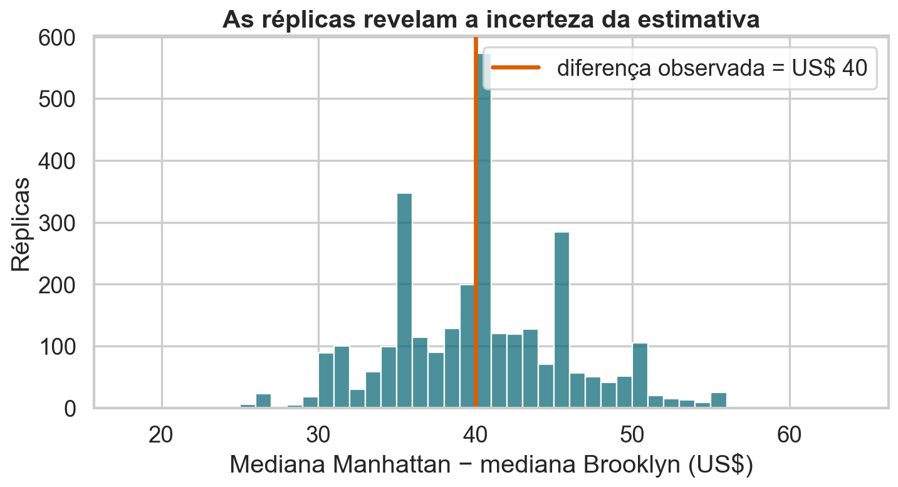{fig-alt="Histograma de três mil diferenças bootstrap entre as medianas de Manhattan e Brooklyn."}

<details class="code-fold">
<summary>Código do gráfico</summary>

```python
plt.figure(figsize=(9.3, 5.2))
sns.histplot(boot, bins=np.arange(18, 65, 1), color=BLUE)
plt.axvline(theta_hat, color=ORANGE, lw=3, label=f"diferença observada = US$ {theta_hat:.0f}")
plt.xlabel("Mediana Manhattan − mediana Brooklyn (US$)")
plt.ylabel("Réplicas")
plt.title("As réplicas revelam a incerteza da estimativa")
plt.legend()
finish("distribuicao-bootstrap.png")
```

</details>

A distribuição não precisa ser perfeitamente Normal para ser útil.

## O erro padrão vem das réplicas

Se $\widehat\theta_1^*,\ldots,\widehat\theta_B^*$ são as réplicas:

$$
\widehat{\operatorname{SE}}_{boot}(\widehat\theta)
=\sqrt{\frac{1}{B-1}\sum_{b=1}^{B}
(\widehat\theta_b^*-\overline{\theta^*})^2}.
$$

Aqui, o erro padrão bootstrap é aproximadamente US$ 5,5.

## O intervalo percentil é direto

Um intervalo bootstrap percentil de nível $1-\alpha$ é:

$$
\left[
q_{\alpha/2}(\widehat\theta^*),
q_{1-\alpha/2}(\widehat\theta^*)
\right].
$$

Ele usa os quantis da própria distribuição bootstrap.

## Os 95% centrais vão de 30 a 51

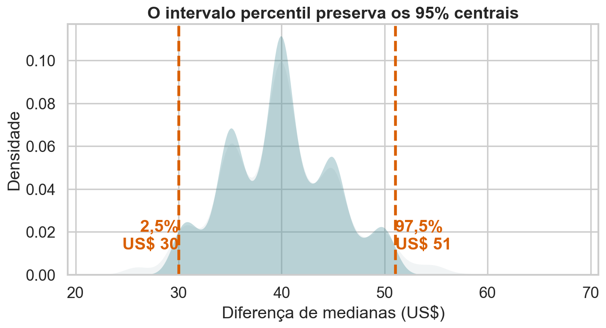{fig-alt="Densidade bootstrap da diferença de medianas com o intervalo percentil de 95 por cento destacado entre 30 e 51 dólares."}

<details class="code-fold">
<summary>Código do gráfico</summary>

```python
plt.figure(figsize=(9.3, 5.2))
sns.kdeplot(boot, fill=True, color=LIGHT, linewidth=0)
inside = (boot >= ci[0]) & (boot <= ci[1])
sns.kdeplot(boot[inside], fill=True, color=BLUE, linewidth=0)
plt.axvline(ci[0], color=ORANGE, ls="--", lw=3)
plt.axvline(ci[1], color=ORANGE, ls="--", lw=3)
plt.text(ci[0], .012, f"2,5%\nUS$ {ci[0]:.0f}", ha="right", color=ORANGE, fontweight="bold")
plt.text(ci[1], .012, f"97,5%\nUS$ {ci[1]:.0f}", ha="left", color=ORANGE, fontweight="bold")
plt.xlabel("Diferença de medianas (US$)")
plt.ylabel("Densidade")
plt.title("O intervalo percentil preserva os 95% centrais")
finish("intervalo-percentil.png")
```

</details>

O intervalo permanece totalmente acima de zero.

## Interprete o procedimento, não a probabilidade

::: {.statement}
Em repetições do procedimento, cerca de 95% dos intervalos construídos dessa forma cobririam a diferença-alvo.
:::

Depois de observar o intervalo, o parâmetro não passa a ter 95% de probabilidade frequentista de estar nele.

## Quantas réplicas são suficientes?

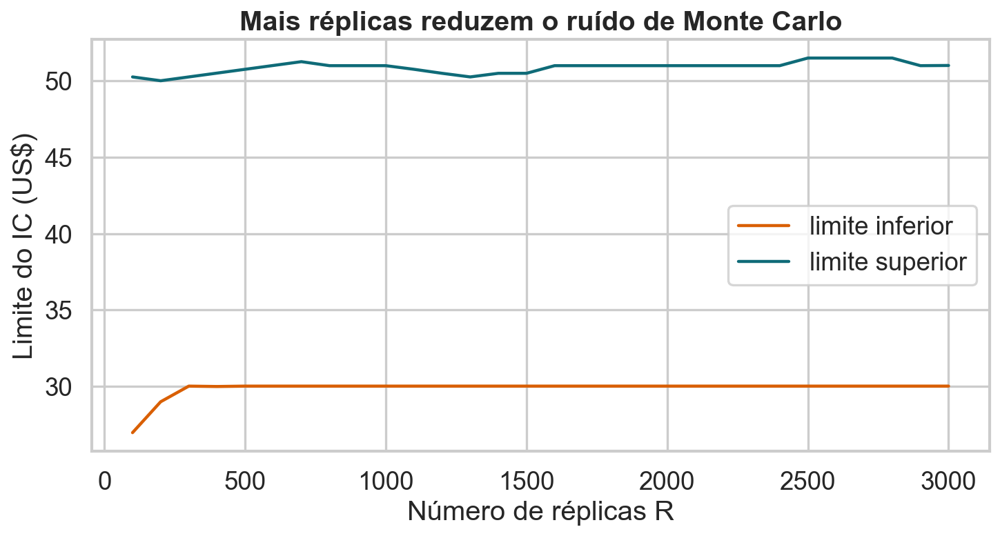{fig-alt="Limites inferior e superior do intervalo bootstrap conforme cresce o número de réplicas."}

<details class="code-fold">
<summary>Código do gráfico</summary>

```python
checkpoints = np.arange(100, 3001, 100)
lower = np.array([np.quantile(boot[:b], .025) for b in checkpoints])
upper = np.array([np.quantile(boot[:b], .975) for b in checkpoints])
plt.figure(figsize=(9.4, 5.2))
plt.plot(checkpoints, lower, color=ORANGE, lw=2, label="limite inferior")
plt.plot(checkpoints, upper, color=BLUE, lw=2, label="limite superior")
plt.xlabel("Número de réplicas B")
plt.ylabel("Limite do IC (US$)")
plt.title("Mais réplicas reduzem o ruído de Monte Carlo")
plt.legend()
finish("estabilidade-b.png")
```

</details>

Para intervalos, alguns milhares de réplicas costumam ser um ponto de partida prático.

## Mais dados ajudam mais que mais réplicas

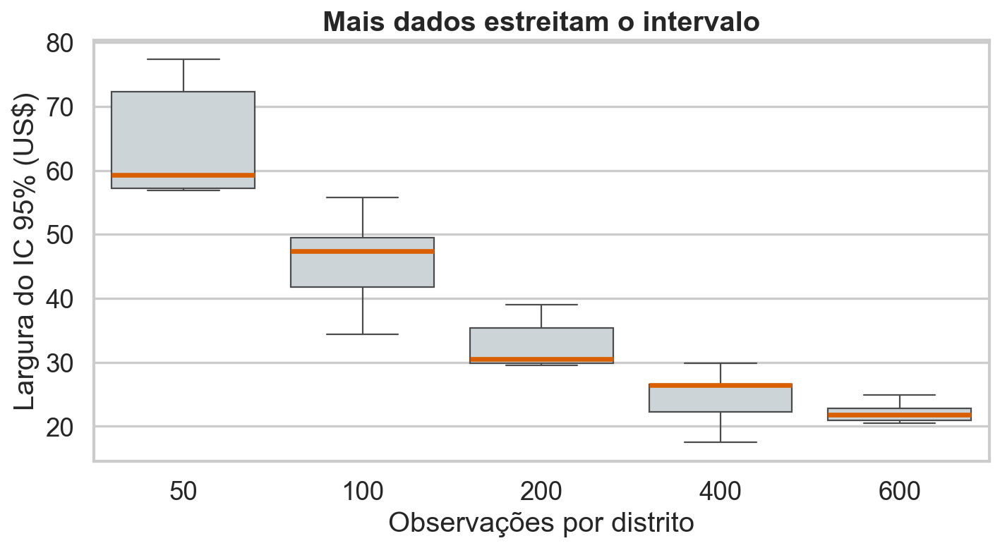{fig-alt="Boxplots da largura do intervalo bootstrap para diferentes tamanhos de amostra por distrito."}

<details class="code-fold">
<summary>Código do gráfico</summary>

```python
sizes = np.array([50, 100, 200, 400, 600])
widths = []
for n in sizes:
    widths_n = []
    for repeat in range(6):
        m = rng.choice(manhattan, n, replace=False)
        b = rng.choice(brooklyn, n, replace=False)
        values = bootstrap_difference(m, b, B=250, seed=1000 + repeat + n)
        q = np.quantile(values, [.025, .975])
        widths_n.append(q[1] - q[0])
    widths.append(widths_n)
plt.figure(figsize=(9.2, 5.2))
sns.boxplot(data=pd.DataFrame(widths, index=sizes).T, color=LIGHT,
            medianprops={"color": ORANGE, "linewidth": 3})
plt.xlabel("Observações por distrito")
plt.ylabel("Largura do IC 95% (US$)")
plt.title("Mais dados estreitam o intervalo")
finish("tamanho-largura.png")
```

</details>

Depois de estabilizar $B$, ampliar a amostra é o que realmente estreita o intervalo.

## Percentil não é o único intervalo

| Método | Ideia | Atenção |
|---|---|---|
| Percentil | usa quantis de $\widehat\theta^*$ | simples, mas sensível a viés |
| Básico | reflete os quantis em torno de $\widehat\theta$ | corrige deslocamento de forma simples |
| Normal | $\widehat\theta\pm z\,SE_{boot}$ | supõe simetria aproximada |
| BCa | corrige viés e aceleração | mais sofisticado e geralmente preferível |

## Métodos podem discordar

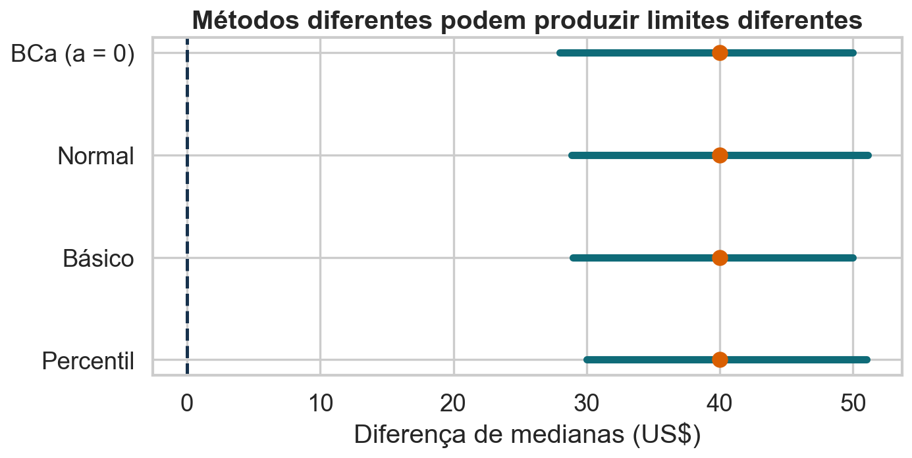{fig-alt="Comparação dos intervalos percentil, básico e Normal para a diferença de medianas."}

<details class="code-fold">
<summary>Código do gráfico</summary>

```python
se_boot = boot.std(ddof=1)
intervals = {
    "Percentil": ci,
    "Básico": np.array([2 * theta_hat - ci[1], 2 * theta_hat - ci[0]]),
    "Normal": np.array([theta_hat - 1.96 * se_boot, theta_hat + 1.96 * se_boot]),
}
plt.figure(figsize=(9, 4.7))
for y, (name, limits) in enumerate(intervals.items()):
    plt.plot(limits, [y, y], color=BLUE, lw=5)
    plt.scatter(theta_hat, y, color=ORANGE, s=90, zorder=3)
plt.yticks(range(3), intervals.keys())
plt.axvline(0, color=INK, ls="--")
plt.xlabel("Diferença de medianas (US$)")
plt.title("Métodos diferentes podem produzir limites diferentes")
finish("metodos-intervalo.png")
```

</details>

Discordância relevante é um sinal para investigar assimetria, viés e tamanho amostral.

## Validade é uma propriedade repetida

Um intervalo é válido quando sua cobertura real se aproxima do nível nominal:

$$
P_F\{\theta\in CI(X_1,\ldots,X_n)\}\approx 1-\alpha.
$$

Não basta que o histograma bootstrap pareça suave ou convincente.

## Podemos testar a cobertura didaticamente

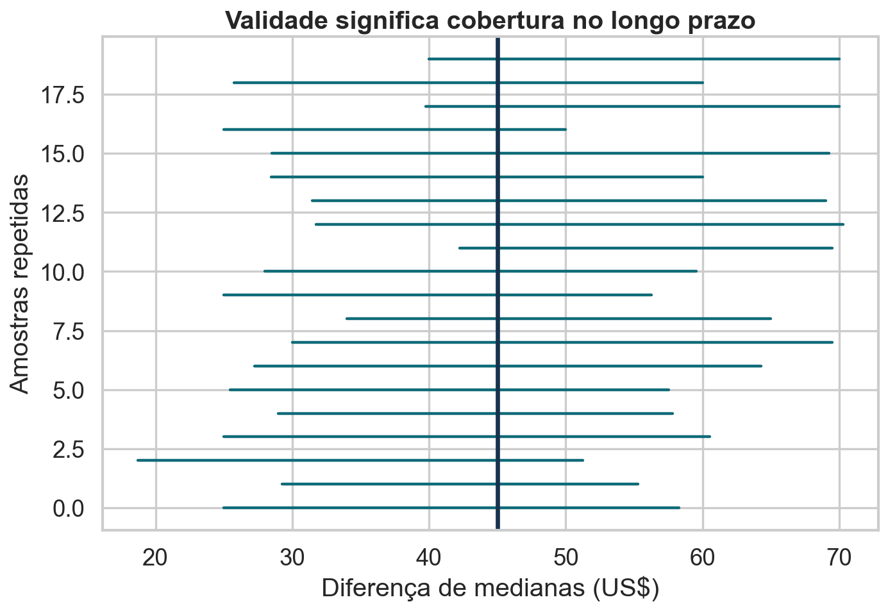{fig-alt="Vinte intervalos bootstrap obtidos de amostras repetidas, comparados à diferença de medianas na população didática."}

<details class="code-fold">
<summary>Código do gráfico</summary>

```python
population_median = np.median(focus.loc[focus["neighbourhood_group"].eq("Manhattan"), "price"])
population_median -= np.median(focus.loc[focus["neighbourhood_group"].eq("Brooklyn"), "price"])
cover = []
for i in range(20):
    m = rng.choice(focus.loc[focus["neighbourhood_group"].eq("Manhattan"), "price"], 250, replace=False)
    b = rng.choice(focus.loc[focus["neighbourhood_group"].eq("Brooklyn"), "price"], 250, replace=False)
    values = bootstrap_difference(m, b, B=300, seed=3000 + i)
    lo, hi = np.quantile(values, [.025, .975])
    cover.append((lo, hi, lo <= population_median <= hi))
plt.figure(figsize=(9, 6.3))
for i, (lo, hi, covered) in enumerate(cover):
    plt.plot([lo, hi], [i, i], color=BLUE if covered else ORANGE, lw=2)
plt.axvline(population_median, color=INK, lw=3)
plt.xlabel("Diferença de medianas (US$)")
plt.ylabel("Amostras repetidas")
plt.title("Validade significa cobertura no longo prazo")
finish("cobertura-bootstrap.png")
```

</details>

Na prática, a população verdadeira não está disponível para essa verificação.

## Quando o bootstrap costuma funcionar

- a amostra representa a população-alvo;
- as observações são independentes e identicamente distribuídas, ou o esquema respeita a dependência;
- a estatística varia de forma regular quando $F$ muda um pouco;
- há dados suficientes perto da característica estimada;
- o mecanismo de coleta não é ignorado.

## O bootstrap não cria informação

- amostra enviesada continua enviesada;
- eventos nunca observados recebem probabilidade zero;
- amostras pequenas não representam bem caudas raras;
- outliers podem dominar muitas réplicas;
- parâmetros na fronteira e estatísticas não regulares podem quebrar a aproximação.

::: {.statement}
Muitas réplicas não compensam poucos dados ruins.
:::

## Independência precisa ser examinada

Anúncios do mesmo anfitrião podem compartilhar:

- estratégia de preço;
- localização e padrão de imóvel;
- regras de disponibilidade;
- decisões de gestão.

Reamostrar anúncios como se fossem independentes pode subestimar a incerteza.

## A unidade de reamostragem importa

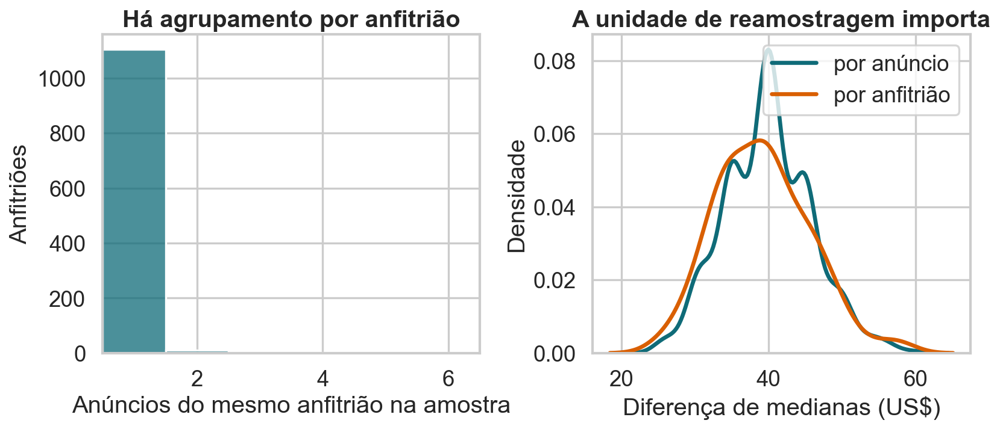{fig-alt="Distribuição do número de anúncios por anfitrião e comparação entre bootstrap por anúncio e por anfitrião."}

<details class="code-fold">
<summary>Código do gráfico</summary>

```python
host_counts = sample.groupby(["neighbourhood_group", "host_id"]).size()
fig, axes = plt.subplots(1, 2, figsize=(10.5, 4.8))
sns.histplot(host_counts, discrete=True, color=BLUE, ax=axes[0])
axes[0].set_xlim(.5, 6.5)
axes[0].set_xlabel("Anúncios do mesmo anfitrião na amostra")
axes[0].set_ylabel("Anfitriões")
axes[0].set_title("Há agrupamento por anfitrião")
naive = bootstrap_difference(manhattan, brooklyn, B=1000, seed=9)
cluster_estimates = []
for _ in range(100):
    pieces = []
    for borough in ["Manhattan", "Brooklyn"]:
        group = sample[sample["neighbourhood_group"].eq(borough)]
        hosts = group["host_id"].unique()
        chosen = rng.choice(hosts, len(hosts), replace=True)
        values = np.concatenate([group.loc[group["host_id"].eq(h), "price"].to_numpy() for h in chosen])
        pieces.append(np.median(values))
    cluster_estimates.append(pieces[0] - pieces[1])
sns.kdeplot(naive, color=BLUE, lw=3, label="por anúncio", ax=axes[1])
sns.kdeplot(cluster_estimates, color=ORANGE, lw=3, label="por anfitrião", ax=axes[1])
axes[1].set_xlabel("Diferença de medianas (US$)")
axes[1].set_ylabel("Densidade")
axes[1].set_title("A unidade de reamostragem importa")
axes[1].legend()
finish("dependencia-host.png")

print(f"linhas={len(raw)}; análise={len(airbnb)}; foco={len(focus)}")
print(f"medianas: Manhattan={np.median(manhattan):.0f}; Brooklyn={np.median(brooklyn):.0f}")
print(f"diferença={theta_hat:.0f}; IC95%=[{ci[0]:.0f}, {ci[1]:.0f}]")
```

</details>

Quando a dependência ocorre por anfitrião, reamostramos **anfitriões inteiros**.

## Casos que exigem outra estratégia

| Estrutura dos dados | Alternativa |
|---|---|
| série temporal | block bootstrap |
| dados espaciais | blocos espaciais ou modelo explícito |
| grupos e turmas | cluster bootstrap |
| amostragem estratificada | reamostrar dentro dos estratos |
| eventos extremos raros | teoria de extremos ou modelo paramétrico |
| máximo da distribuição | métodos específicos; bootstrap comum pode falhar |

## Um checklist antes de reamostrar

1. Qual é a população-alvo?
2. Qual é a unidade independente?
3. A amostra representa essa população?
4. A estatística é regular neste problema?
5. O esquema bootstrap imita a coleta original?
6. Os resultados são estáveis em $B$ e em análises de sensibilidade?

## A conclusão substantiva

Na amostra didática, a acomodação inteira mediana foi:

- US$ 180 em Manhattan;
- US$ 140 no Brooklyn;
- diferença estimada de US$ 40;
- IC bootstrap percentil de 95%: **US$ 30 a US$ 51**.

O resultado descreve anúncios de 2019 após os filtros — não preços atuais nem reservas efetivas.

## O que o bootstrap realmente oferece

::: {.statement}
O bootstrap transforma uma amostra em um laboratório para estudar a estabilidade de uma estatística.
:::

Ele é poderoso quando o laboratório preserva a estrutura que gerou os dados — e enganoso quando essa estrutura é ignorada.

## Pratique

Com a mesma amostra:

1. estime a diferença entre os percentis 75 dos dois distritos;
2. construa um intervalo bootstrap percentil;
3. compare-o ao intervalo da diferença de medianas;
4. repita reamostrando anfitriões;
5. explique qual resultado responde melhor a uma pergunta sobre o anúncio típico.
