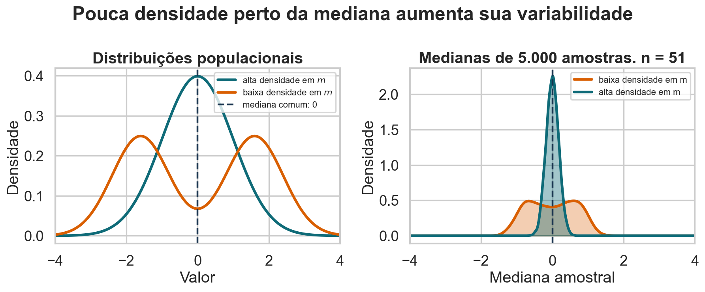
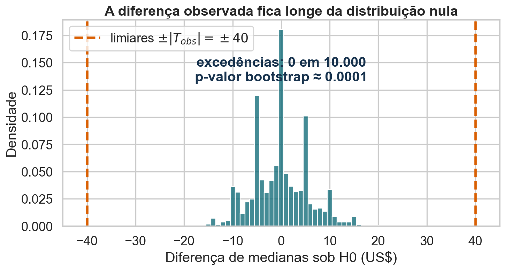

## Bootstrap

::: {.statement}
Como medir a incerteza quando só temos uma amostra e nenhuma fórmula conveniente?
:::

## A pergunta da aula

Em 2019, quanto mais cara era uma acomodação inteira **típica** em Manhattan do que no Brooklyn?

Não queremos apenas uma diferença observada. Queremos saber quão precisa ela é.

## Hoje

- conhecer e descrever a base Airbnb NYC 2019;
- entender por que a mediana é útil neste problema;
- construir réplicas bootstrap;
- formalizar o método;
- estimar erro padrão, intervalo de confiança e p-valor;
- reconhecer quando o bootstrap é — e não é — válido.

## Airbnb NYC 2019

- 48.895 anúncios disponíveis em Nova York em 2019;
- preços, localização, tipo de acomodação e atividade dos anúncios;
- dados públicos disponibilizados no Kaggle sob licença CC0;
- unidade de observação: **um anúncio**, não uma reserva nem um hóspede.

Fonte: Kaggle, `dgomonov/new-york-city-airbnb-open-data`.

## As colunas que usaremos

| Coluna | Significado |
|---|---|
| `neighbourhood_group` | distrito da cidade |
| `room_type` | acomodação inteira, quarto privado ou compartilhado |
| `price` | preço anunciado por noite, em dólares |
| `host_id` | identificador do anfitrião |
| `availability_365` | dias disponíveis no ano |

O preço é anunciado: não observamos se a estadia realmente ocorreu.

## Dois distritos dominam a base

{fig-alt="Barras com o número de anúncios por distrito de Nova York, destacando Manhattan e Brooklyn como os maiores grupos."}

Manhattan e Brooklyn somam aproximadamente 85% dos anúncios.

<details class="code-fold">
<summary>Código do gráfico</summary>

```python
counts = raw["neighbourhood_group"].value_counts().sort_values()
plt.figure(figsize=(9, 5.2))
counts.plot.barh(color=[LIGHT, LIGHT, LIGHT, ORANGE, BLUE])
plt.xlabel("Número de anúncios")
plt.ylabel("")
plt.title("Manhattan e Brooklyn concentram 85% dos anúncios")
finish("anuncios-distrito.png")
```

</details>

## Uma limpeza mínima e explícita

- 11 anúncios têm preço igual a zero;
- o preço máximo chega a US$ 10.000 por noite;
- para visualização e análise, removemos preços zero e o 1% superior;
- permanecem 48.410 anúncios, 99% da base original.

::: {.statement}
Limpar a cauda muda a população-alvo: agora estudamos anúncios entre US$ 1 e US$ 799.
:::

## A média é puxada pela cauda

{fig-alt="Dois histogramas dos preços dos anúncios Airbnb, em escala original e logarítmica, mostrando forte assimetria à direita."}

Na base original, a mediana é US$ 106 e a média é US$ 153.

<details class="code-fold">
<summary>Código do gráfico</summary>

```python
fig, axes = plt.subplots(1, 2, figsize=(11, 4.8))
sns.histplot(raw.loc[raw["price"] > 0, "price"], bins=70, color=BLUE, ax=axes[0])
axes[0].set_xlim(0, 1000)
axes[0].set_xlabel("Preço por noite (US$)")
axes[0].set_ylabel("Anúncios")
axes[0].set_title("Escala original")
sns.histplot(np.log10(raw.loc[raw["price"] > 0, "price"]), bins=45, color=ORANGE, ax=axes[1])
axes[1].set_xlabel("log10 do preço")
axes[1].set_ylabel("")
axes[1].set_title("Escala logarítmica")
fig.suptitle("Preços são fortemente assimétricos", fontweight="bold")
finish("distribuicao-precos.png")
```

</details>

## Localização importa

{fig-alt="Boxplots de preço por noite nos cinco distritos de Nova York, sem exibir pontos extremos."}

Mas comparar todos os anúncios mistura localização e tipo de acomodação.

<details class="code-fold">
<summary>Código do gráfico</summary>

```python
order = ["Bronx", "Queens", "Staten Island", "Brooklyn", "Manhattan"]
plt.figure(figsize=(10, 5.4))
sns.boxplot(data=airbnb, x="neighbourhood_group", y="price", order=order,
            showfliers=False, color=LIGHT, medianprops={"color": ORANGE, "linewidth": 3})
plt.xlabel("")
plt.ylabel("Preço por noite (US$)")
plt.title("A localização desloca toda a distribuição de preços")
finish("precos-distrito.png")
```

</details>

## O tipo de acomodação também importa

{fig-alt="Barras empilhadas com a composição dos anúncios de Manhattan e Brooklyn por tipo de acomodação."}

Manhattan tem uma proporção maior de acomodações inteiras.

<details class="code-fold">
<summary>Código do gráfico</summary>

```python
composition = pd.crosstab(raw["neighbourhood_group"], raw["room_type"], normalize="index")
composition = composition.loc[["Manhattan", "Brooklyn"], ["Entire home/apt", "Private room", "Shared room"]]
composition.plot.bar(stacked=True, figsize=(8.8, 5), color=[BLUE, ORANGE, PURPLE])
plt.xticks(rotation=0)
plt.xlabel("")
plt.ylabel("Proporção")
plt.title("Comparar distritos exige controlar o tipo de acomodação")
plt.legend(title="Tipo", bbox_to_anchor=(1.02, 1), loc="upper left")
finish("composicao-tipo.png")
```

</details>

## Nossa comparação será mais justa

Vamos restringir a pergunta a:

- acomodações inteiras;
- Manhattan e Brooklyn;
- preços entre US$ 1 e US$ 799;
- uma amostra didática de 600 anúncios por distrito.

Isso evita atribuir ao distrito uma diferença que vem apenas do tipo de quarto.

## A amostra observada

| Distrito | $n$ | Média | Mediana |
|---|---:|---:|---:|
| Brooklyn | 600 | US$ 167 | US$ 140 |
| Manhattan | 600 | US$ 211 | US$ 180 |

Estimativa observada:

$$
\widehat{\Delta}=180-140=\text{US\$ }40
$$

## A mediana acompanha o anúncio típico

{fig-alt="Curvas de distribuição acumulada dos preços de acomodações inteiras em Brooklyn e Manhattan, com as medianas marcadas."}

A cauda extrema afeta pouco o ponto em que a curva acumulada cruza 50%.

<details class="code-fold">
<summary>Código do gráfico</summary>

```python
plt.figure(figsize=(9.5, 5.2))
for values, label, color in [(brooklyn, "Brooklyn", ORANGE), (manhattan, "Manhattan", BLUE)]:
    sns.ecdfplot(values, label=label, color=color, lw=3)
    plt.axvline(np.median(values), color=color, ls="--", lw=2)
plt.xlim(0, 500)
plt.xlabel("Preço por noite (US$)")
plt.ylabel("Proporção acumulada")
plt.title("A mediana compara o centro sem obedecer à cauda")
plt.legend()
finish("ecdf-amostra.png")
```

</details>

## Por que o intervalo para medianas é mais difícil? {.smaller}

Para médias, o TCL fornece um erro padrão conhecido. Para medianas de duas amostras independentes, uma aproximação assintótica é

$$
\widehat{SE}(\widetilde X_1-\widetilde X_2)
\approx
\sqrt{
\frac{1}{4n_1\widehat f_1(\widetilde X_1)^2}
+
\frac{1}{4n_2\widehat f_2(\widetilde X_2)^2}
}.
$$

$\widetilde X_g$ é a mediana amostral do grupo $g$; $n_g$ é seu tamanho; e $\widehat f_g(\widetilde X_g)$ estima a densidade dos dados perto da mediana.

::: {.callout-warning title="O que a fórmula exige"}
As amostras devem ser independentes; cada distribuição deve ser contínua, ter mediana única e densidade positiva e regular nessa região. Além disso, precisamos escolher como estimar $f_g$, inclusive a largura de banda.
:::

## A densidade na mediana controla a precisão

{fig-alt="À esquerda, duas distribuições com mediana zero, uma concentrada e outra bimodal com pouca densidade no centro. À direita, as medianas de amostras da distribuição concentrada ficam próximas de zero, enquanto as medianas da distribuição bimodal variam muito mais."}

As duas populações têm mediana zero. Com pouca massa perto do centro, pequenas mudanças na amostra fazem a mediana saltar entre valores distantes.

::: {.statement}
O bootstrap evita estimar explicitamente essas densidades, mas ainda exige uma amostra representativa e uma reamostragem compatível com a coleta.
:::

<details class="code-fold">
<summary>Código do gráfico</summary>

```python
def normal_pdf(x, mean, sd):
    return np.exp(-0.5 * ((x - mean) / sd) ** 2) / (sd * np.sqrt(2 * np.pi))

x_grid = np.linspace(-4, 4, 800)
pdf_concentrada = normal_pdf(x_grid, 0, 1)
pdf_bimodal = (0.5 * normal_pdf(x_grid, -1.6, 0.8)
               + 0.5 * normal_pdf(x_grid, 1.6, 0.8))

median_rng = np.random.default_rng(1205)
n_rep_median, n_median = 5000, 51
sample_concentrada = median_rng.normal(0, 1, (n_rep_median, n_median))
componentes = median_rng.integers(0, 2, (n_rep_median, n_median))
medias_bimodais = np.where(componentes == 0, -1.6, 1.6)
sample_bimodal = median_rng.normal(medias_bimodais, 0.8)
medianas_concentrada = np.median(sample_concentrada, axis=1)
medianas_bimodal = np.median(sample_bimodal, axis=1)

fig, axes = plt.subplots(1, 2, figsize=(11.5, 4.8), sharex=True)
axes[0].plot(x_grid, pdf_concentrada, color=BLUE, lw=3,
             label=r"alta densidade em $m$")
axes[0].plot(x_grid, pdf_bimodal, color=ORANGE, lw=3,
             label=r"baixa densidade em $m$")
axes[0].axvline(0, color=INK, ls="--", lw=2, label="mediana comum: 0")
axes[0].set_title("Distribuições populacionais")
axes[0].set_xlabel("Valor")
axes[0].set_ylabel("Densidade")

def kde_on_grid(values, grid):
    bandwidth = 1.06 * values.std(ddof=1) * len(values) ** (-1 / 5)
    z = (grid[:, None] - values[None, :]) / bandwidth
    return np.exp(-0.5 * z**2).mean(axis=1) / (bandwidth * np.sqrt(2*np.pi))

kde_concentrada = kde_on_grid(medianas_concentrada, x_grid)
kde_bimodal = kde_on_grid(medianas_bimodal, x_grid)
axes[1].fill_between(x_grid, kde_bimodal, color=ORANGE, alpha=0.30)
axes[1].plot(x_grid, kde_bimodal, color=ORANGE, lw=3,
             label="baixa densidade em m")
axes[1].fill_between(x_grid, kde_concentrada, color=BLUE, alpha=0.38)
axes[1].plot(x_grid, kde_concentrada, color=BLUE, lw=3,
             label="alta densidade em m")
axes[1].axvline(0, color=INK, ls="--", lw=2)
axes[1].set_title("Medianas de 5.000 amostras, n = 51")
axes[1].set_xlabel("Mediana amostral")
axes[1].set_ylabel("Densidade")
for ax in axes:
    ax.set_xlim(-4, 4)
    ax.legend()
fig.suptitle("Pouca densidade perto da mediana aumenta sua variabilidade",
             fontweight="bold")
finish("densidade-mediana-precisao.png")
```

</details>

## Uma estimativa não mostra sua estabilidade

Se repetíssemos a coleta, obteríamos exatamente US$ 40 outra vez?

::: {.statement}
Precisamos imaginar muitas amostras semelhantes — mas só observamos uma.
:::

## A amostra vira uma população provisória

$F$ representa a distribuição populacional desconhecida, cuja CDF é $F(x)=P(X\leq x)$. O bootstrap a substitui pela CDF empírica:

$$
\widehat F_n(x)=\frac{1}{n}\sum_{i=1}^{n}\mathbb{1}(X_i\leq x)
$$

$X_i$ é a $i$-ésima observação, $x$ é um ponto da escala e $\mathbb 1(\cdot)$ vale 1 quando a condição é verdadeira e 0 caso contrário. Assim, $\widehat F_n(x)$ é a proporção observada de valores menores ou iguais a $x$; ela é a **CDF empírica** e atribui massa $1/n$ a cada observação.

## Reposição é indispensável

Sortear $n$ observações **sem reposição** apenas reorganiza a amostra.

Com reposição:

- algumas observações aparecem várias vezes;
- outras não aparecem;
- a estatística muda de uma réplica para outra.

Essa variação imita a incerteza amostral.

## Por que sortear com reposição? {.quiz-question}

Por que o bootstrap comum reamostra $n$ observações com reposição?

- [Para que toda réplica contenha exatamente os mesmos valores uma vez]{data-explanation="Isso ocorreria sem reposição e produziria apenas uma reordenação da amostra."}
- [Para permitir repetições e ausências, fazendo a estatística variar entre réplicas]{.correct data-explanation="Essa variabilidade aproxima a incerteza amostral usando a distribuição empírica."}
- [Para aumentar artificialmente o tamanho da amostra]{data-explanation="Cada réplica continua tendo tamanho n; R controla o número de réplicas, não o tamanho amostral."}
- [Para corrigir automaticamente viés de seleção]{data-explanation="O bootstrap herda a representatividade e as limitações da amostra observada."}

## A origem dos 63,2% no bootstrap {.smaller}

::: {.columns}
::: {.column width="42%"}
{fig-alt="Pontos representando uma amostra de preços e uma reamostragem bootstrap com valores repetidos e ausentes."}

Repetições e ausências surgem porque o sorteio ocorre com reposição.
:::

::: {.column width="58%"}
Para uma observação específica, a probabilidade de não aparecer em nenhum dos $n$ sorteios é

$$
P(\text{ausente})=\left(1-\frac{1}{n}\right)^n.
$$

Se $D_n$ é o número de observações distintas, escrevemos $D_n=\sum_{i=1}^n I_i$, onde $I_i=1$ quando a observação $i$ aparece. Logo,

$$
\begin{aligned}
\mathbb{E}(D_n)
&=\sum_{i=1}^n\mathbb{E}(I_i) \\
&=n\left[1-\left(1-\frac{1}{n}\right)^n\right].
\end{aligned}
$$

Portanto,

$$
\frac{\mathbb{E}(D_n)}{n}\longrightarrow 1-e^{-1}\approx 0{,}632.
$$
:::
:::

::: {.callout-note title="Exemplo com n = 8"}
Uma réplica possível é $(A,C,C,D,F,F,F,H)$: aparecem 5 das 8 observações originais. Considerando todas as réplicas possíveis,

$$
\begin{aligned}
\mathbb{E}(D_8)
&=8\left[1-\left(\frac{7}{8}\right)^8\right] \\
&\approx 5{,}25.
\end{aligned}
$$

Assim, $\mathbb{E}(D_8)\approx5{,}25$ significa que muitas réplicas de tamanho 8 terão, em média, 5,25 observações distintas, ou 65,6%. Os 63,2% são a aproximação para $n$ grande.
:::

<details class="code-fold">
<summary>Código do gráfico</summary>

```python
toy = np.array([65, 80, 90, 110, 145, 190, 240, 320])
toy_boot = np.random.default_rng(7).choice(toy, len(toy), replace=True)
fig, axes = plt.subplots(2, 1, figsize=(10, 4.8), sharex=True)
for ax, values, title, color in [(axes[0], toy, "Amostra observada", BLUE),
                                  (axes[1], toy_boot, "Amostra bootstrap", ORANGE)]:
    unique, multiplicity = np.unique(values, return_counts=True)
    for x, count in zip(unique, multiplicity):
        ax.scatter([x] * count, np.arange(1, count + 1), s=130, color=color)
    ax.set_yticks([])
    ax.set_title(title, loc="left")
axes[1].set_xlabel("Preço (US$)")
fig.suptitle("Reamostrar com reposição cria uma nova amostra", fontweight="bold")
finish("reamostragem-reposicao.png")
```

</details>

## Uma réplica produz outra estimativa

{fig-alt="Medianas observadas e medianas de uma réplica bootstrap em Brooklyn e Manhattan."}

Repetir esse processo revela quais diferenças são plausíveis.

<details class="code-fold">
<summary>Código do gráfico</summary>

```python
one_m = rng.choice(manhattan, len(manhattan), replace=True)
one_b = rng.choice(brooklyn, len(brooklyn), replace=True)
observed = [np.median(brooklyn), np.median(manhattan)]
replica = [np.median(one_b), np.median(one_m)]
xpos = np.arange(2)
plt.figure(figsize=(8.8, 4.8))
plt.plot(xpos, observed, "o-", color=BLUE, lw=3, ms=10, label="amostra observada")
plt.plot(xpos, replica, "o--", color=ORANGE, lw=3, ms=10, label="uma réplica bootstrap")
plt.xticks(xpos, ["Brooklyn", "Manhattan"])
plt.ylabel("Mediana do preço (US$)")
plt.title("Cada réplica produz uma nova diferença")
plt.legend()
finish("uma-replica.png")
```

</details>

## O algoritmo em cinco passos {.smaller}

1. Escolha a estatística $T$ e calcule $\widehat\theta=T(X_1,\ldots,X_n)$.
2. Sorteie $X_1^*,\ldots,X_n^*$ de $\widehat F_n$, com reposição.
3. Calcule $\widehat\theta_b^*=T(X_1^*,\ldots,X_n^*)$.
4. Repita os passos 2–3 por $R$ vezes.
5. Use a distribuição das $\widehat\theta_b^*$ para quantificar a incerteza.

$T$ é a regra de cálculo mantida fixa, como média, mediana ou diferença de medianas. O índice $b$ identifica uma réplica bootstrap e $R$ é o número total de réplicas. Reservamos $B(\widehat\theta)$ para denotar o viés, como nas aulas anteriores.

::: {.callout-note title="Exemplo da aula"}
Aqui, $T(\text{dados})=\operatorname{mediana}(\text{Manhattan})-\operatorname{mediana}(\text{Brooklyn})$. Em cada réplica, reamostramos os anúncios dentro de cada distrito e aplicamos novamente a mesma regra $T$.
:::

## O bootstrap em notação formal

Escrevendo $T$ como funcional de uma distribuição, se $X_1,\ldots,X_n\overset{iid}{\sim}F$ e $\widehat\theta=T(\widehat F_n)$, então:

$$
X_1^*,\ldots,X_n^*\mid X_1,\ldots,X_n
\overset{iid}{\sim}\widehat F_n
$$

e

$$
\widehat\theta^*=T(\widehat F_n^*).
$$

O método aproxima a lei de $\widehat\theta-\theta$ pela lei condicional de $\widehat\theta^*-\widehat\theta$.

$F$ é a distribuição populacional desconhecida; $\widehat F_n$ é sua versão empírica; e $\widehat F_n^*$ é a distribuição empírica da réplica. A notação i.i.d. significa independentes e identicamente distribuídas. O funcional $T$ é a mesma regra do slide anterior: $\theta=T(F)$, $\widehat\theta=T(\widehat F_n)$ e $\widehat\theta^*=T(\widehat F_n^*)$.

## O alvo é uma distribuição condicional

Formalmente, esperamos que:

$$
\mathcal L\!\left(\sqrt n(\widehat\theta^*-\widehat\theta)\mid X_1,\ldots,X_n\right)
\Rightarrow
\mathcal L\!\left(\sqrt n(\widehat\theta-\theta)\right).
$$

Para qualquer variável aleatória genérica $Z$, $\mathcal L(Z)$ denota sua distribuição de probabilidade. Na fórmula, aplicamos esse operador aos erros padronizados do estimador bootstrap e do estimador original. A barra $\mid X_1,\ldots,X_n$ indica que condicionamos nos dados observados; $\Rightarrow$ indica convergência em distribuição.

Essa aproximação é assintótica: descreve o que ocorre à medida que $n$ cresce. Em amostras finitas, sua qualidade depende da estatística, da distribuição e do esquema de reamostragem.

## O código mínimo é curto

```python
rng = np.random.default_rng(1105)
replicas = []

for _ in range(5000):
    boot_m = rng.choice(manhattan, len(manhattan), replace=True)
    boot_b = rng.choice(brooklyn, len(brooklyn), replace=True)
    replicas.append(np.median(boot_m) - np.median(boot_b))
```

O raciocínio estatístico é mais importante que o laço.

## O tamanho da réplica continua sendo n

- $n$ é o tamanho de cada amostra bootstrap;
- $R$ é o número de réplicas;
- aumentar $R$ reduz erro de simulação;
- aumentar $n$ reduz incerteza estatística.

Esses dois papéis não devem ser confundidos.

## A incerteza ganha forma

{fig-alt="Histograma de três mil diferenças bootstrap entre as medianas de Manhattan e Brooklyn."}

A distribuição não precisa ser perfeitamente Normal para ser útil.

<details class="code-fold">
<summary>Código do gráfico</summary>

```python
plt.figure(figsize=(9.3, 5.2))
sns.histplot(boot, bins=np.arange(18, 65, 1), color=BLUE)
plt.axvline(theta_hat, color=ORANGE, lw=3, label=f"diferença observada = US$ {theta_hat:.0f}")
plt.xlabel("Mediana Manhattan − mediana Brooklyn (US$)")
plt.ylabel("Réplicas")
plt.title("As réplicas revelam a incerteza da estimativa")
plt.legend()
finish("distribuicao-bootstrap.png")
```

</details>

## O erro padrão vem das réplicas

Se $\widehat\theta_1^*,\ldots,\widehat\theta_R^*$ são as réplicas:

$$
\widehat{\operatorname{SE}}_{boot}(\widehat\theta)
=\sqrt{\frac{1}{R-1}\sum_{b=1}^{R}
(\widehat\theta_b^*-\overline{\theta^*})^2}.
$$

Aqui, o erro padrão bootstrap é aproximadamente US$ 5,5.

$R$ é o número de réplicas, $\widehat\theta_b^*$ é a estimativa da réplica $b$ e $\overline{\theta^*}=R^{-1}\sum_b\widehat\theta_b^*$ é a média das réplicas.

## O bootstrap também pode estimar viés

O viés de um estimador é

$$B_F(\widehat\theta)=\mathbb{E}_F(\widehat\theta)-\theta.$$

$\mathbb{E}_F$ é a esperança em amostras repetidas da população $F$. Como $\theta$ e essa esperança são desconhecidos, o bootstrap aproxima:

$$\widehat B_{boot}(\widehat\theta)
=\overline{\theta^*}-\widehat\theta,$$

onde $\overline{\theta^*}=R^{-1}\sum_b\widehat\theta_b^*$ é a média das réplicas. Valor próximo de zero sugere pouco deslocamento **capturável pela amostra**.

::: {.statement}
O bootstrap pode diagnosticar viés do estimador; não detecta nem corrige viés de seleção que a amostra não revela.
:::

## O intervalo percentil é direto

Um intervalo bootstrap percentil de nível $1-\alpha$ é:

$$
\left[
q_{\alpha/2}(\widehat\theta^*),
q_{1-\alpha/2}(\widehat\theta^*)
\right].
$$

Ele usa os quantis da própria distribuição bootstrap.

$q_\gamma(\widehat\theta^*)$ é o quantil de ordem $\gamma$ das réplicas e $\alpha$ é a probabilidade total deixada fora do intervalo; para 95%, $\alpha=0{,}05$.

## Os 95% centrais vão de 30 a 51

{fig-alt="Densidade bootstrap da diferença de medianas com o intervalo percentil de 95 por cento destacado entre 30 e 51 dólares."}

O intervalo permanece totalmente acima de zero.

<details class="code-fold">
<summary>Código do gráfico</summary>

```python
plt.figure(figsize=(9.3, 5.2))
sns.kdeplot(boot, fill=True, color=LIGHT, linewidth=0)
inside = (boot >= ci[0]) & (boot <= ci[1])
sns.kdeplot(boot[inside], fill=True, color=BLUE, linewidth=0)
plt.axvline(ci[0], color=ORANGE, ls="--", lw=3)
plt.axvline(ci[1], color=ORANGE, ls="--", lw=3)
plt.text(ci[0], .012, f"2,5%\nUS$ {ci[0]:.0f}", ha="right", color=ORANGE, fontweight="bold")
plt.text(ci[1], .012, f"97,5%\nUS$ {ci[1]:.0f}", ha="left", color=ORANGE, fontweight="bold")
plt.xlabel("Diferença de medianas (US$)")
plt.ylabel("Densidade")
plt.title("O intervalo percentil preserva os 95% centrais")
finish("intervalo-percentil.png")
```

</details>

## Interprete o procedimento, não a probabilidade

::: {.statement}
Em repetições do procedimento, cerca de 95% dos intervalos construídos dessa forma cobririam a diferença-alvo.
:::

Depois de observar o intervalo, o parâmetro não passa a ter 95% de probabilidade frequentista de estar nele.

## Quantas réplicas são suficientes?

{fig-alt="Limites inferior e superior do intervalo bootstrap conforme cresce o número de réplicas."}

Para intervalos, alguns milhares de réplicas costumam ser um ponto de partida prático.

<details class="code-fold">
<summary>Código do gráfico</summary>

```python
checkpoints = np.arange(100, 3001, 100)
lower = np.array([np.quantile(boot[:b], .025) for b in checkpoints])
upper = np.array([np.quantile(boot[:b], .975) for b in checkpoints])
plt.figure(figsize=(9.4, 5.2))
plt.plot(checkpoints, lower, color=ORANGE, lw=2, label="limite inferior")
plt.plot(checkpoints, upper, color=BLUE, lw=2, label="limite superior")
plt.xlabel("Número de réplicas R")
plt.ylabel("Limite do IC (US$)")
plt.title("Mais réplicas reduzem o ruído de Monte Carlo")
plt.legend()
finish("estabilidade-b.png")
```

</details>

## Para médias, bootstrap e TCL ficam próximos

{fig-alt="Limites inferior e superior do intervalo bootstrap para a diferença de médias conforme cresce o número de réplicas, estabilizando próximos aos limites horizontais obtidos pelo Teorema Central do Limite." width="100%"}

Com a amostra fixa, aumentar $R$ reduz a oscilação de Monte Carlo. A proximidade com o TCL ocorre porque a diferença de médias tem distribuição aproximadamente Normal — não porque $R$ obrigue os métodos a coincidir.

<details class="code-fold">
<summary>Código do gráfico</summary>

```python
mean_hat = manhattan.mean() - brooklyn.mean()
se_tcl = np.sqrt(
    manhattan.var(ddof=1) / len(manhattan)
    + brooklyn.var(ddof=1) / len(brooklyn)
)
ci_tcl = np.array([mean_hat - 1.96*se_tcl,
                   mean_hat + 1.96*se_tcl])

n_rep_max = 5000
mean_boot = (
    rng.choice(manhattan, (n_rep_max, len(manhattan)), replace=True).mean(axis=1)
    - rng.choice(brooklyn, (n_rep_max, len(brooklyn)), replace=True).mean(axis=1)
)
checkpoints = np.array([25, 50, 100, 200, 400, 800,
                        1200, 2000, 3000, 5000])
ci_boot_by_rep = np.array([
    np.quantile(mean_boot[:n_rep], [.025, .975]) for n_rep in checkpoints
])

plt.plot(checkpoints, ci_boot_by_rep[:, 0], "o-", label="Bootstrap: inferior")
plt.plot(checkpoints, ci_boot_by_rep[:, 1], "o-", label="Bootstrap: superior")
plt.axhline(ci_tcl[0], ls="--", label="TCL: inferior")
plt.axhline(ci_tcl[1], ls="--", label="TCL: superior")
plt.xscale("log"); plt.legend()
finish("estabilidade-media-bootstrap-tcl.png")
```

</details>

## Mais dados ajudam mais que mais réplicas

{fig-alt="Boxplots da largura do intervalo bootstrap para diferentes tamanhos de amostra por distrito."}

Depois de estabilizar $R$, ampliar a amostra é o que realmente estreita o intervalo.

<details class="code-fold">
<summary>Código do gráfico</summary>

```python
sizes = np.array([50, 100, 200, 400, 600])
widths = []
for n in sizes:
    widths_n = []
    for repeat in range(6):
        m = rng.choice(manhattan, n, replace=False)
        b = rng.choice(brooklyn, n, replace=False)
        values = bootstrap_difference(m, b, n_rep=250, seed=1000 + repeat + n)
        q = np.quantile(values, [.025, .975])
        widths_n.append(q[1] - q[0])
    widths.append(widths_n)
plt.figure(figsize=(9.2, 5.2))
sns.boxplot(data=pd.DataFrame(widths, index=sizes).T, color=LIGHT,
            medianprops={"color": ORANGE, "linewidth": 3})
plt.xlabel("Observações por distrito")
plt.ylabel("Largura do IC 95% (US$)")
plt.title("Mais dados estreitam o intervalo")
finish("tamanho-largura.png")
```

</details>

## Correção pontual do viés bootstrap {.smaller}

::: {.columns}
::: {.column width="49%"}
::: {.callout-note title="1. Detecte o deslocamento"}
Compare a média das réplicas com a estimativa original:

$$
\widehat B_{boot}(\widehat\theta)
=\overline{\theta^*}-\widehat\theta.
$$

Se $\widehat B_{boot}>0$, as réplicas ficam, em média, acima de $\widehat\theta$. Se $\widehat B_{boot}<0$, ficam abaixo.
:::
:::

::: {.column width="49%"}
::: {.callout-tip title="2. Corrija na direção oposta"}
Uma correção pontual usual é

$$
\widehat\theta_{corr}
=\widehat\theta-\widehat B_{boot}(\widehat\theta)
=2\widehat\theta-\overline{\theta^*}.
$$

No exemplo: $\widehat\theta=40$, $\overline{\theta^*}=39{,}74$ e $\widehat B_{boot}=-0{,}26$. Assim, $\widehat\theta_{corr}=40{,}26$ dólares.
:::
:::
:::

::: {.callout-warning title="A correção não é automática"}
Compare o viés estimado com o erro padrão e verifique sua estabilidade. A correção pode aumentar o MSE quando o viés é pequeno ou estimado com muito ruído. Ela também não corrige viés de seleção ou de mensuração ausente da amostra.
:::

## Exercício: diagnóstico e correção do viés {.quiz-question .smaller}

Foram geradas $R=2.000$ réplicas para uma estimativa $\widehat\theta=50$. A média das réplicas foi $\overline{\theta^*}=52$ e o erro padrão bootstrap foi $\widehat{SE}_{boot}=1$.

Qual é o diagnóstico e qual é a estimativa corrigida?

- [$\widehat B_{boot}=-2$ e $\widehat\theta_{corr}=52$]{data-explanation="O viés estimado usa média das réplicas menos estimativa original: 52 − 50 = 2."}
- [$\widehat B_{boot}=2$ e $\widehat\theta_{corr}=48$]{.correct data-explanation="As réplicas ficam 2 unidades acima da estimativa. A correção desloca no sentido oposto: 50 − 2 = 48. Como o deslocamento equivale a dois erros padrão, merece investigação."}
- [$\widehat B_{boot}=2$ e $\widehat\theta_{corr}=52$]{data-explanation="A correção subtrai, em vez de somar, o viés estimado."}
- [$\widehat B_{boot}=1$ e $\widehat\theta_{corr}=49$]{data-explanation="O erro padrão mede dispersão entre réplicas; ele não substitui o deslocamento usado para estimar o viés."}

## A correção pontual não garante a cobertura {.smaller .correction-motivation}

Corrigir $\widehat\theta$ trata o deslocamento da **estimativa pontual**. Um intervalo também precisa posicionar corretamente suas duas caudas. O intervalo percentil funciona bem quando as réplicas representam a posição e a forma da distribuição amostral. Duas diferenças podem prejudicar sua cobertura.

::: {.columns}
::: {.column width="49%"}
::: {.callout-warning title="Deslocamento"}
O centro das réplicas pode não coincidir com a estimativa observada:

$$\mathbb E_*(\widehat\theta^*)-\widehat\theta\neq0.$$

Nesse caso, os quantis bootstrap carregam esse deslocamento. A correção deve considerar onde $\widehat\theta$ aparece dentro da distribuição das réplicas.
:::
:::

::: {.column width="49%"}
::: {.callout-note title="Variabilidade não constante"}
A sensibilidade do estimador pode mudar conforme os dados mudam. Uma cauda pode se alongar mais do que a outra, de modo que um único erro-padrão não descreve igualmente as duas direções.

O *jackknife* ajuda a detectar essa mudança de variabilidade.
:::
:::
:::

::: {.callout-tip title="Consequência para os intervalos"}
Quando deslocamento e mudança de variabilidade são pequenos, os métodos tendem a concordar. Quando são relevantes, usar os quantis sem ajuste ou impor simetria pode produzir cobertura diferente do nível nominal.
:::

## Quatro formas de construir o intervalo {.smaller .method-overview}

Partimos de $\widehat\theta$ e das réplicas $\widehat\theta_1^*,\ldots,\widehat\theta_R^*$. Aqui, $q_\gamma^*$ é o quantil de ordem $\gamma$ dessas réplicas.

| Método | Informação usada | Cálculo dos limites | O que o método faz |
|---|---|---|---|
| **Percentil** | quantis de $\widehat\theta_b^*$ | $[q_{\alpha/2}^*,q_{1-\alpha/2}^*]$ | toma os 95% centrais das réplicas; acompanha a assimetria, mas conserva o deslocamento |
| **Básico** | quantis do erro $\widehat\theta_b^*-\widehat\theta$ | $[2\widehat\theta-q_{1-\alpha/2}^*,2\widehat\theta-q_{\alpha/2}^*]$ | reflete as distâncias das caudas em torno de $\widehat\theta$ |
| **Normal** | $\widehat{SE}_{boot}$, o desvio-padrão das réplicas | $\widehat\theta\pm z_{1-\alpha/2}\widehat{SE}_{boot}$ | constrói uma faixa simétrica; funciona melhor com pouco viés e forma aproximadamente Normal |
| **BCa** (*bias-corrected and accelerated*, corrigido por viés e aceleração) | posição de $\widehat\theta$ e estimativas *jackknife* | $[q_{\alpha_1^{BCa}}^*,q_{\alpha_2^{BCa}}^*]$ | troca 2,5% e 97,5% por níveis ajustados para viés e mudança de variabilidade |

## Como o intervalo básico corrige o deslocamento {.smaller}

O bootstrap aproxima o erro amostral pelo erro observado nas réplicas:

$$\widehat\theta-\theta\ \approx\ \widehat\theta^*-\widehat\theta.$$

Se $q_{\alpha/2}^*$ e $q_{1-\alpha/2}^*$ são quantis de $\widehat\theta^*$, então os quantis do erro bootstrap são $q_\gamma^*-\widehat\theta$. Ao isolar $\theta$:

$$
IC_{bas}
=\left[\widehat\theta-(q_{1-\alpha/2}^*-\widehat\theta),\
\widehat\theta-(q_{\alpha/2}^*-\widehat\theta)\right]
=\left[2\widehat\theta-q_{1-\alpha/2}^*,\
2\widehat\theta-q_{\alpha/2}^*\right].
$$

::: {.callout-note title="A reflexão das distâncias"}
Se $\widehat\theta=10$ e os quantis bootstrap são $[8,13]$, os erros nas caudas são $-2$ e $+3$. O intervalo básico reflete essas distâncias:

$$IC_{bas}=[10-3,\ 10-(-2)]=[7,12].$$

A cauda que avançava 3 unidades acima de $\widehat\theta$ passa a avançar 3 unidades abaixo, e a distância de 2 unidades abaixo passa para cima.
:::

## O BCa ajusta os níveis dos quantis {.smaller .bca-detail}

::: {.columns}
::: {.column width="49%"}
**1. Correção de viés**

$$p_0=\frac{\#\{\widehat\theta_b^*<\widehat\theta\}}{R},
\qquad z_0=\Phi^{-1}(p_0).$$

Se $p_0=0{,}5$, então $z_0=0$. Outro valor indica que $\widehat\theta$ está deslocado dentro da distribuição bootstrap.

**2. Aceleração**

Removemos uma observação por vez e calculamos $\widehat\theta_{(-i)}$:

$$a=\frac{\sum_i(\overline\theta_{(-\cdot)}-\widehat\theta_{(-i)})^3}
{6[\sum_i(\overline\theta_{(-\cdot)}-\widehat\theta_{(-i)})^2]^{3/2}}$$

$\widehat\theta_{(-i)}$ é a estimativa sem a observação $i$; $\overline\theta_{(-\cdot)}=n^{-1}\sum_{i=1}^n\widehat\theta_{(-i)}$ é a média das $n$ estimativas *jackknife*. O valor de $a$ mede mudanças na variabilidade e permite ajustes diferentes nas duas caudas.
:::

::: {.column width="49%"}
**3. Novos níveis dos quantis**

Para $\alpha_1=\alpha/2$ e $\alpha_2=1-\alpha/2$:

$$\alpha_j^{BCa}=\Phi\!\left[z_0+\frac{z_0+z_{\alpha_j}}{1-a(z_0+z_{\alpha_j})}\right].$$

Depois selecionamos os quantis nesses novos níveis:

$$IC_{BCa}=[q_{\alpha_1^{BCa}}^*,q_{\alpha_2^{BCa}}^*].$$

$\Phi$ é a CDF Normal padrão e $z_\gamma=\Phi^{-1}(\gamma)$.

::: {.callout-important title="Nesta aula"}
Obtivemos $z_0=-0{,}159$ e $a=0$ por causa dos empates nas medianas. Os níveis 2,5% e 97,5% tornam-se 1,13% e 94,96%, produzindo aproximadamente $[28,50]$ dólares.
:::
:::
:::

## Exercício: um BCa simplificado {.smaller}

Em um bootstrap com $R=1.000$ réplicas, 600 estimativas ficaram abaixo de $\widehat\theta$. Considere aceleração $a=0$ e um intervalo de 95%.

1. Calcule $p_0$ e $z_0=\Phi^{-1}(p_0)$.
2. Calcule os níveis ajustados:

   $$\alpha_j^{BCa}=\Phi(z_0+z_0+z_{\alpha_j}),
   \qquad \alpha_1=0{,}025,\quad \alpha_2=0{,}975.$$

3. Sabendo que $q_{0{,}073}^*=18{,}4$ e $q_{0{,}993}^*=27{,}9$, encontre o intervalo BCa.

::: {.callout-note title="Valores para a conta"}
$\Phi^{-1}(0{,}60)\approx0{,}253$, $z_{0{,}025}\approx-1{,}96$, $z_{0{,}975}\approx1{,}96$, $\Phi(-1{,}454)\approx0{,}073$ e $\Phi(2{,}466)\approx0{,}993$.
:::

## Solução: os percentis se deslocam {.smaller}

**1. Posição da estimativa observada**

$$p_0=\frac{600}{1.000}=0{,}60,
\qquad z_0=\Phi^{-1}(0{,}60)\approx0{,}253.$$

**2. Níveis ajustados**, usando $a=0$:

$$\alpha_1^{BCa}=\Phi(2\times0{,}253-1{,}96)
=\Phi(-1{,}454)\approx0{,}073,$$

$$\alpha_2^{BCa}=\Phi(2\times0{,}253+1{,}96)
=\Phi(2{,}466)\approx0{,}993.$$

**3. Intervalo**

$$IC_{BCa}=[q_{0{,}073}^*,q_{0{,}993}^*]=[18{,}4,27{,}9].$$

::: {.callout-tip title="Interpretação"}
Como $z_0>0$, $\widehat\theta$ está acima do centro das réplicas. Por isso, os dois níveis dos quantis se deslocam para cima: de 2,5% e 97,5% para 7,3% e 99,3%.
:::

## Resumo das técnicas de intervalo

| Método | Ideia | Atenção |
|---|---|---|
| Percentil | usa quantis de $\widehat\theta^*$ | simples, mas sensível a viés |
| Básico | reflete os quantis em torno de $\widehat\theta$ | corrige deslocamento de forma simples |
| Normal | $\widehat\theta\pm z\,SE_{boot}$ | supõe simetria aproximada |
| BCa | corrige viés e aceleração | mais sofisticado e geralmente preferível |

## Métodos podem discordar

{height=300 fig-alt="Comparação dos intervalos percentil, básico, Normal e BCa para a diferença de medianas."}

Discordância relevante é um sinal para investigar assimetria, viés e tamanho amostral. Nesta amostra, os empates tornam o *jackknife* da mediana degenerado; usamos $a=0$, e o BCa conserva apenas a correção de viés.

<details class="code-fold">
<summary>Código do gráfico</summary>

```python
from statistics import NormalDist

se_boot = boot.std(ddof=1)

# BCa: z0 vem das réplicas e a vem do jackknife
normal = NormalDist()
prop_below = np.clip(
    np.mean(boot < theta_hat),
    1 / (2 * len(boot)),
    1 - 1 / (2 * len(boot)),
)
z0 = normal.inv_cdf(prop_below)

jack_m = np.array([
    np.median(np.delete(manhattan, i)) - np.median(brooklyn)
    for i in range(len(manhattan))
])
jack_b = np.array([
    np.median(manhattan) - np.median(np.delete(brooklyn, i))
    for i in range(len(brooklyn))
])
jack = np.concatenate([jack_m, jack_b])
jack_center = jack.mean()
jack_diff = jack_center - jack
jack_scale = np.sum(jack_diff**2)
a = 0.0 if jack_scale == 0 else (
    np.sum(jack_diff**3) / (6 * jack_scale**1.5)
)

z_alpha = [normal.inv_cdf(.025), normal.inv_cdf(.975)]
alpha_bca = [
    normal.cdf(z0 + (z0 + z) / (1 - a * (z0 + z)))
    for z in z_alpha
]
ci_bca = np.quantile(boot, alpha_bca)

intervals = {
    "Percentil": ci,
    "Básico": np.array([2 * theta_hat - ci[1], 2 * theta_hat - ci[0]]),
    "Normal": np.array([theta_hat - 1.96 * se_boot, theta_hat + 1.96 * se_boot]),
    "BCa (a = 0)": ci_bca,
}
plt.figure(figsize=(9, 4.7))
for y, (name, limits) in enumerate(intervals.items()):
    plt.plot(limits, [y, y], color=BLUE, lw=5)
    plt.scatter(theta_hat, y, color=ORANGE, s=90, zorder=3)
plt.yticks(range(len(intervals)), intervals.keys())
plt.axvline(0, color=INK, ls="--")
plt.xlabel("Diferença de medianas (US$)")
plt.title("Métodos diferentes podem produzir limites diferentes")
finish("metodos-intervalo.png")
```

</details>

## Recentrar os dados impõe a hipótese nula {.smaller}

Queremos testar a diferença entre as medianas populacionais de Manhattan e Brooklyn:

$$
H_0:\Delta=m_M-m_B=0
\qquad\text{contra}\qquad
H_A:\Delta\neq0.
$$

O bootstrap usual reamostra os dados observados e reproduz uma diferença próxima de $\widehat\Delta=40$. Para simular sob $H_0$, recentralizamos cada grupo:

$$X_{gi}^{(0)}=X_{gi}-\widetilde X_g,
\qquad g\in\{M,B\}.$$

$m_M$ e $m_B$ são as medianas populacionais; $\widetilde X_g$ é a mediana amostral do grupo $g$. Após a recentralização, ambos os grupos têm mediana zero. Reamostramos separadamente os valores $X_{gi}^{(0)}$ e recalculamos a diferença de medianas.

::: {.statement}
O bootstrap aproxima naturalmente a distribuição sob a alternativa observada. O teste exige modificar os dados para impor $H_0$.
:::

## O p-valor vem da distribuição bootstrap sob H0 {.smaller}

{height=300 fig-alt="Histograma da distribuição bootstrap da diferença de medianas após recentralização sob a hipótese nula, com os limiares mais ou menos 40 dólares muito distantes da distribuição simulada."}

Com $R=10.000$ réplicas, nenhuma diferença nula atingiu $|T_{obs}|=40$. Usando a correção de Monte Carlo,

$$
\widehat p_{boot}
=\frac{1+\sum_{b=1}^{R}\mathbb 1\{|T_b^{*(0)}|\geq|T_{obs}|\}}{R+1}
=\frac{1}{10.001}\approx0{,}0001.
$$

$T_{obs}$ é a diferença observada; $T_b^{*(0)}$ é a diferença na réplica $b$ gerada sob $H_0$; e $R$ é o total de réplicas. O resultado fornece forte evidência contra a igualdade das medianas, sob as hipóteses de amostragem e independência adotadas.

<details class="code-fold">
<summary>Código do gráfico e do p-valor</summary>

```python
manhattan_h0 = manhattan - np.median(manhattan)
brooklyn_h0 = brooklyn - np.median(brooklyn)
test_rng = np.random.default_rng(1212)
n_rep_test = 10_000
idx_m = test_rng.integers(0, len(manhattan_h0), (n_rep_test, len(manhattan_h0)))
idx_b = test_rng.integers(0, len(brooklyn_h0), (n_rep_test, len(brooklyn_h0)))
boot_h0 = (np.median(manhattan_h0[idx_m], axis=1)
           - np.median(brooklyn_h0[idx_b], axis=1))
extreme_h0 = np.abs(boot_h0) >= np.abs(theta_hat)
p_boot = (1 + extreme_h0.sum()) / (len(boot_h0) + 1)
```

</details>

## Validade é uma propriedade repetida

Um intervalo é válido quando sua cobertura real se aproxima do nível nominal:

$$
P_F\{\theta\in CI(X_1,\ldots,X_n)\}\approx 1-\alpha.
$$

Não basta que o histograma bootstrap pareça suave ou convincente.

$P_F$ é a probabilidade sob amostras repetidas de $F$; $CI(X_1,\ldots,X_n)$ é o intervalo calculado com a amostra; e $1-\alpha$ é a cobertura nominal.

## Podemos testar a cobertura didaticamente

{fig-alt="Vinte intervalos bootstrap obtidos de amostras repetidas, comparados à diferença de medianas na população didática."}

Na prática, a população verdadeira não está disponível para essa verificação.

<details class="code-fold">
<summary>Código do gráfico</summary>

```python
population_median = np.median(focus.loc[focus["neighbourhood_group"].eq("Manhattan"), "price"])
population_median -= np.median(focus.loc[focus["neighbourhood_group"].eq("Brooklyn"), "price"])
cover = []
for i in range(20):
    m = rng.choice(focus.loc[focus["neighbourhood_group"].eq("Manhattan"), "price"], 250, replace=False)
    b = rng.choice(focus.loc[focus["neighbourhood_group"].eq("Brooklyn"), "price"], 250, replace=False)
    values = bootstrap_difference(m, b, n_rep=300, seed=3000 + i)
    lo, hi = np.quantile(values, [.025, .975])
    cover.append((lo, hi, lo <= population_median <= hi))
plt.figure(figsize=(9, 6.3))
for i, (lo, hi, covered) in enumerate(cover):
    plt.plot([lo, hi], [i, i], color=BLUE if covered else ORANGE, lw=2)
plt.axvline(population_median, color=INK, lw=3)
plt.xlabel("Diferença de medianas (US$)")
plt.ylabel("Amostras repetidas")
plt.title("Validade significa cobertura no longo prazo")
finish("cobertura-bootstrap.png")
```

</details>

## Quando o bootstrap costuma funcionar

- a amostra representa a população-alvo;
- as observações são independentes e identicamente distribuídas, ou o esquema respeita a dependência;
- a estatística varia de forma regular quando $F$ muda um pouco;
- há dados suficientes perto da característica estimada;
- o mecanismo de coleta não é ignorado.

## O bootstrap não cria informação

- amostra enviesada continua enviesada;
- eventos nunca observados recebem probabilidade zero;
- amostras pequenas não representam bem caudas raras;
- outliers podem dominar muitas réplicas;
- parâmetros na fronteira e estatísticas não regulares podem quebrar a aproximação.

::: {.statement}
Muitas réplicas não compensam poucos dados ruins.
:::

## Independência precisa ser examinada

Anúncios do mesmo anfitrião podem compartilhar:

- estratégia de preço;
- localização e padrão de imóvel;
- regras de disponibilidade;
- decisões de gestão.

Reamostrar anúncios como se fossem independentes pode subestimar a incerteza.

## A unidade de reamostragem importa

{fig-alt="Distribuição do número de anúncios por anfitrião e comparação entre bootstrap por anúncio e por anfitrião."}

Quando a dependência ocorre por anfitrião, reamostramos **anfitriões inteiros**.

<details class="code-fold">
<summary>Código do gráfico</summary>

```python
host_counts = sample.groupby(["neighbourhood_group", "host_id"]).size()
fig, axes = plt.subplots(1, 2, figsize=(10.5, 4.8))
sns.histplot(host_counts, discrete=True, color=BLUE, ax=axes[0])
axes[0].set_xlim(.5, 6.5)
axes[0].set_xlabel("Anúncios do mesmo anfitrião na amostra")
axes[0].set_ylabel("Anfitriões")
axes[0].set_title("Há agrupamento por anfitrião")
naive = bootstrap_difference(manhattan, brooklyn, n_rep=1000, seed=9)
cluster_estimates = []
for _ in range(100):
    pieces = []
    for borough in ["Manhattan", "Brooklyn"]:
        group = sample[sample["neighbourhood_group"].eq(borough)]
        hosts = group["host_id"].unique()
        chosen = rng.choice(hosts, len(hosts), replace=True)
        values = np.concatenate([group.loc[group["host_id"].eq(h), "price"].to_numpy() for h in chosen])
        pieces.append(np.median(values))
    cluster_estimates.append(pieces[0] - pieces[1])
sns.kdeplot(naive, color=BLUE, lw=3, label="por anúncio", ax=axes[1])
sns.kdeplot(cluster_estimates, color=ORANGE, lw=3, label="por anfitrião", ax=axes[1])
axes[1].set_xlabel("Diferença de medianas (US$)")
axes[1].set_ylabel("Densidade")
axes[1].set_title("A unidade de reamostragem importa")
axes[1].legend()
finish("dependencia-host.png")

print(f"linhas={len(raw)}; análise={len(airbnb)}; foco={len(focus)}")
print(f"medianas: Manhattan={np.median(manhattan):.0f}; Brooklyn={np.median(brooklyn):.0f}")
print(f"diferença={theta_hat:.0f}; IC95%=[{ci[0]:.0f}, {ci[1]:.0f}]")
```

</details>

## Qual unidade deve ser reamostrada? {.quiz-question}

Vários anúncios pertencem ao mesmo anfitrião e podem ser dependentes. Qual estratégia é mais adequada?

- [Reamostrar anúncios individualmente e ignorar o anfitrião]{data-explanation="Isso trata unidades dependentes como independentes e pode subestimar a incerteza."}
- [Reamostrar anfitriões e carregar seus anúncios em cada réplica]{.correct data-explanation="O bootstrap por conglomerados preserva a dependência interna e imita melhor a coleta."}
- [Aumentar apenas o número de réplicas $R$]{data-explanation="Mais réplicas reduzem erro de Monte Carlo, mas não corrigem a unidade de reamostragem."}
- [Remover anfitriões com mais de um anúncio]{data-explanation="Excluir unidades muda a população-alvo e não é uma correção geral para dependência."}

## Casos que exigem outra estratégia

| Estrutura dos dados | Alternativa |
|---|---|
| série temporal | block bootstrap |
| dados espaciais | blocos espaciais ou modelo explícito |
| grupos e turmas | cluster bootstrap |
| amostragem estratificada | reamostrar dentro dos estratos |
| eventos extremos raros | teoria de extremos ou modelo paramétrico |
| máximo da distribuição | métodos específicos; bootstrap comum pode falhar |

## Um checklist antes de reamostrar

1. Qual é a população-alvo?
2. Qual é a unidade independente?
3. A amostra representa essa população?
4. A estatística é regular neste problema?
5. O esquema bootstrap imita a coleta original?
6. Os resultados são estáveis em $R$ e em análises de sensibilidade?

## A conclusão substantiva

Na amostra didática, a acomodação inteira mediana foi:

- US$ 180 em Manhattan;
- US$ 140 no Brooklyn;
- diferença estimada de US$ 40;
- IC bootstrap percentil de 95%: **US$ 30 a US$ 51**;
- teste bootstrap recentralizado: **$\widehat p\approx0{,}0001$**.

O resultado descreve anúncios de 2019 após os filtros — não preços atuais nem reservas efetivas.

## O que o bootstrap realmente oferece

::: {.statement}
O bootstrap transforma uma amostra em um laboratório para estudar a estabilidade de uma estatística.
:::

Ele é poderoso quando o laboratório preserva a estrutura que gerou os dados — e enganoso quando essa estrutura é ignorada.

## Pratique

Com a mesma amostra:

1. estime a diferença entre os percentis 75 dos dois distritos;
2. construa um intervalo bootstrap percentil;
3. compare-o ao intervalo da diferença de medianas;
4. repita reamostrando anfitriões;
5. teste $H_0:\Delta=0$ por bootstrap recentralizado;
6. explique qual resultado responde melhor a uma pergunta sobre o anúncio típico.
