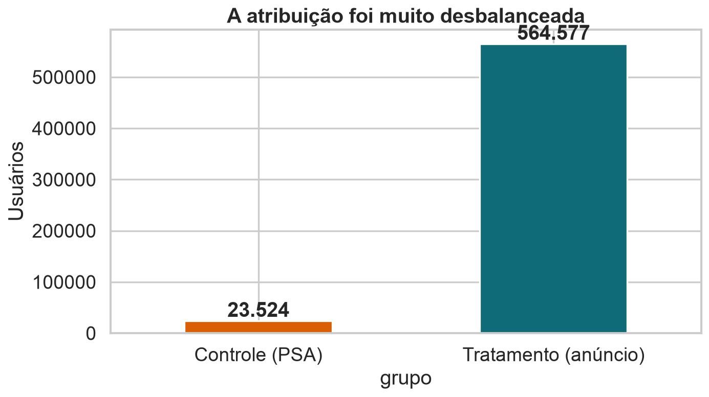
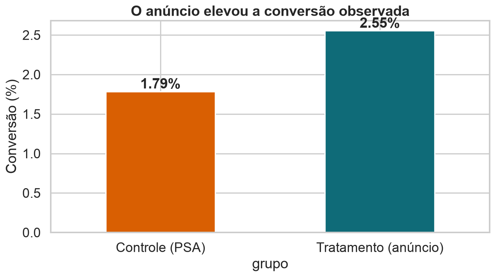
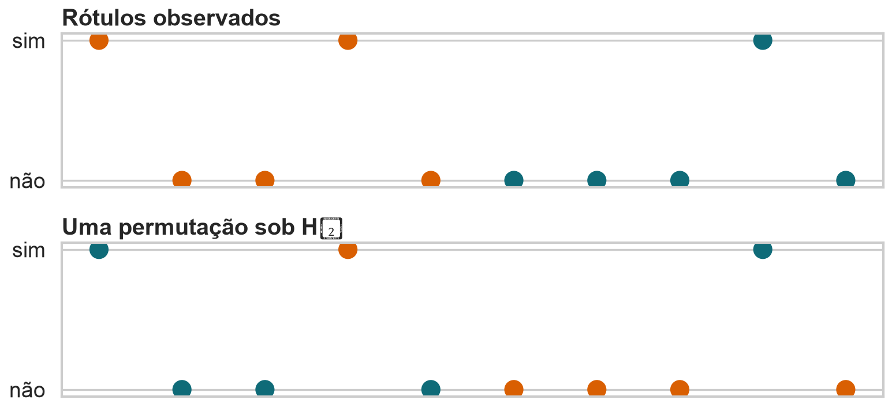
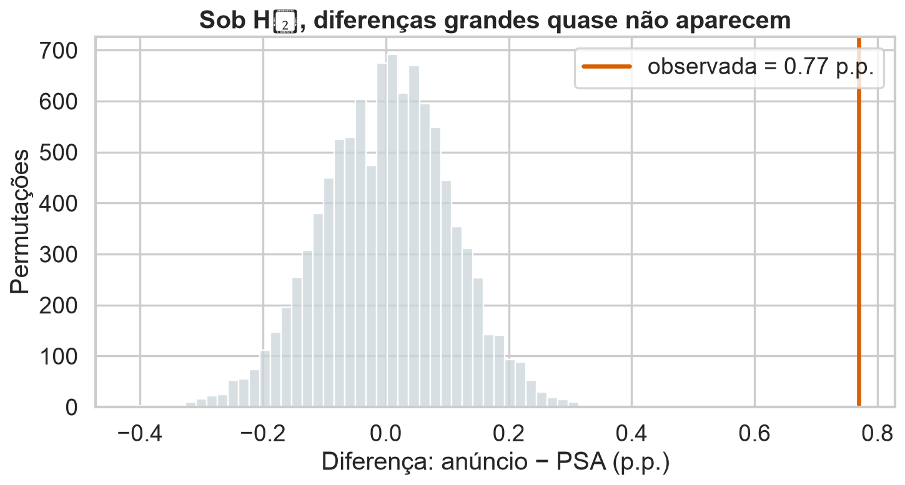
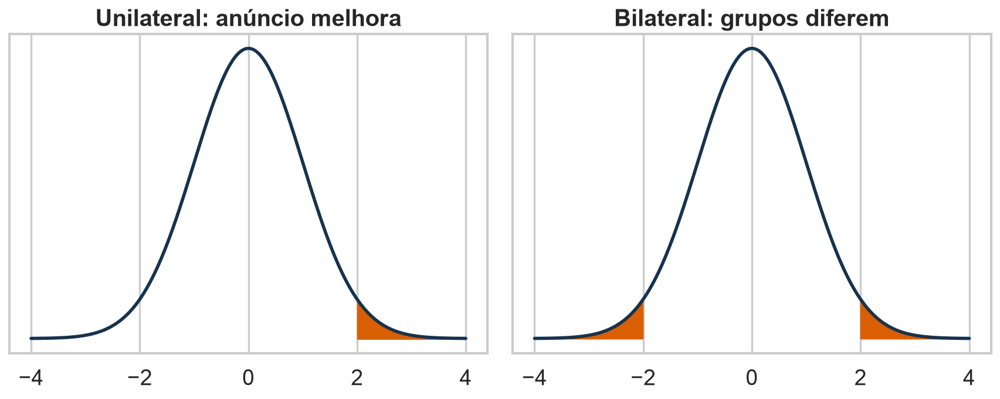
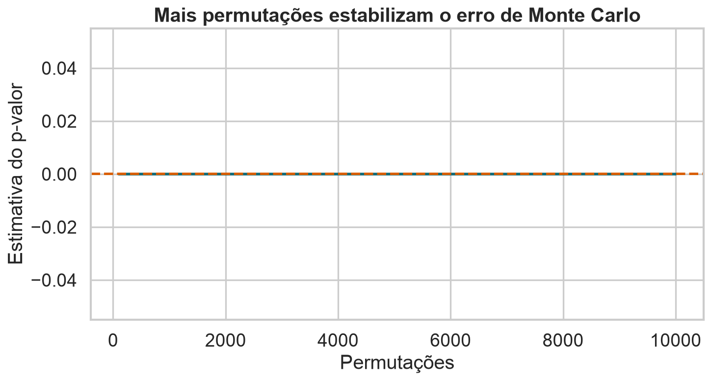
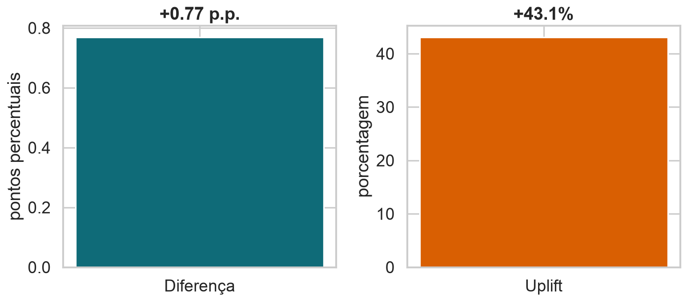

## Uma pergunta experimental

::: {.statement}
Exibir um anúncio aumenta a probabilidade de conversão?
:::

Não basta observar dois números diferentes. Precisamos medir quanta diferença o acaso produz.

## O caso que guiará a aula

Uma campanha compara:

- **A — PSA:** anúncio de utilidade pública, nosso controle;
- **B — anúncio:** campanha comercial, nosso tratamento;
- **resposta:** a pessoa converteu ou não.

## Hoje

- conhecer e auditar a base;
- transformar a pergunta em hipóteses;
- escolher uma estatística de teste;
- construir o mundo nulo por permutação;
- calcular e interpretar o valor-p;
- separar significância estatística de efeito prático.

## A base Marketing A/B Testing

- 588.101 usuários de uma campanha digital;
- uma linha por usuário;
- disponibilizada no Kaggle sob licença **CC0**;
- compara anúncio comercial com PSA;
- registra conversão e intensidade de exposição.

Fonte: Kaggle, `faviovaz/marketing-ab-testing`.

## As colunas principais

| Coluna | Significado |
|---|---|
| `user id` | identificador único |
| `test group` | `ad` ou `psa` |
| `converted` | conversão: verdadeiro/falso |
| `total ads` | total de exposições |
| `most ads day` | dia de maior exposição |
| `most ads hour` | hora de maior exposição |

## A base está limpa, mas não perfeita

- nenhuma célula ausente;
- nenhum `user id` duplicado;
- resposta binária bem definida;
- 7 colunas, uma delas apenas índice exportado;
- não há documentação detalhada do mecanismo de randomização.

::: {.statement}
Uma base limpa não garante um experimento válido.
:::

## Os grupos são muito desbalanceados

{fig-alt="Barras mostrando 23.524 usuários no controle PSA e 564.577 no tratamento anúncio."}

<details class="code-fold"><summary>Código do gráfico</summary>

```python
counts = df["grupo"].value_counts().reindex(["Controle (PSA)", "Tratamento (anúncio)"])
counts.plot.bar(color=[ORANGE, BLUE])
plt.ylabel("Usuários")
plt.title("A atribuição foi muito desbalanceada")
```
</details>

## Desbalanceamento não é viés automaticamente

Uma randomização 96%/4% ainda pode ser válida.

Mas ela:

- reduz a precisão do grupo menor;
- torna a auditoria da atribuição essencial;
- desperdiça informação quando o custo por unidade é semelhante.

## A conversão observada é maior com anúncio

{fig-alt="Taxas de conversão de 1,79% no PSA e 2,55% no anúncio."}

<details class="code-fold"><summary>Código do gráfico</summary>

```python
rates = df.groupby("grupo")["converted"].mean()
(100 * rates).plot.bar(color=[ORANGE, BLUE])
plt.ylabel("Conversão (%)")
plt.title("O anúncio elevou a conversão observada")
```
</details>

## O efeito observado

$$
\widehat\Delta=\widehat p_{ad}-\widehat p_{psa}
=0{,}02555-0{,}01785=0{,}00769
$$

O anúncio está associado a **+0,77 ponto percentual** de conversão.

## Antes do teste: qual é o estimando?

Queremos a diferença entre as probabilidades de conversão que surgiriam se a população fosse exposta a:

$$
\Delta=p_{ad}-p_{psa}
$$

O estimando vem antes do algoritmo.

## A hipótese nula

$$
H_0:p_{ad}=p_{psa}
$$

Sob $H_0$, o rótulo `ad` ou `psa` não carrega informação sobre a conversão.

## A hipótese alternativa

Se a pergunta foi definida antes dos dados:

$$
H_1:p_{ad}>p_{psa}
$$

Se qualquer diferença importa:

$$
H_1:p_{ad}\neq p_{psa}
$$

## A estatística resume a evidência

Escolhemos:

$$
T=\widehat p_{ad}-\widehat p_{psa}
$$

Valores positivos favorecem o anúncio; valores próximos de zero são compatíveis com ausência de efeito.

## O que $H_0$ autoriza trocar?

Se a atribuição foi aleatória e o tratamento não tem efeito, os rótulos de grupo são **permutáveis**.

Mantemos fixos:

- os resultados observados;
- os tamanhos dos grupos.

Embaralhamos apenas os rótulos.

## Permutar quebra a associação

{fig-alt="Exemplo pequeno em que resultados permanecem fixos e rótulos A e B são embaralhados."}

<details class="code-fold"><summary>Código do gráfico</summary>

```python
toy["grupo_permutado"] = rng.permutation(toy["grupo"])
for col in ["grupo", "grupo_permutado"]:
    plt.scatter(range(len(toy)), toy["resultado"], c=toy[col].map(colors))
```
</details>

## Uma permutação, passo a passo

1. Junte as conversões dos dois grupos.
2. Embaralhe os rótulos `ad` e `psa`.
3. Preserve 564.577 usuários em `ad` e 23.524 em `psa`.
4. Recalcule $T$.
5. Repita muitas vezes.

## O algoritmo

```python
observed = rate_ad - rate_psa
null = []

for _ in range(B):
    shuffled = rng.permutation(group)
    t = converted[shuffled == "ad"].mean() \
        - converted[shuffled == "psa"].mean()
    null.append(t)
```

## A distribuição nula é uma pergunta contrafactual

Ela descreve:

> Quais diferenças veríamos se os mesmos resultados fossem redistribuídos entre os grupos apenas pelo acaso da atribuição?

Não é a distribuição dos dados originais.

## A diferença observada está na cauda

{fig-alt="Histograma da distribuição nula concentrada em zero e diferença observada de 0,77 ponto percentual na cauda direita."}

<details class="code-fold"><summary>Código do gráfico</summary>

```python
conv_ad = rng.hypergeometric(n_conv, n_total-n_conv, n_ad, size=10000)
null_diff = conv_ad/n_ad - (n_conv-conv_ad)/(n_total-n_ad)
sns.histplot(100*null_diff, bins=45)
plt.axvline(100*observed, color=ORANGE)
```
</details>

## O valor-p unilateral

Para $H_1:p_{ad}>p_{psa}$:

$$
p=P(T^{perm}\geq T_{obs}\mid H_0)
$$

É a proporção de permutações tão favoráveis ao anúncio quanto o resultado observado.

## O valor-p bilateral

Para $H_1:p_{ad}\neq p_{psa}$:

$$
p=P(|T^{perm}|\geq |T_{obs}|\mid H_0)
$$

As duas caudas contam porque diferenças negativas também contradizem a igualdade.

## Uma ou duas caudas?

{fig-alt="Comparação visual entre região extrema unilateral e bilateral."}

<details class="code-fold"><summary>Código do gráfico</summary>

```python
axes[0].fill_between(x, 0, y, where=x >= cutoff, color=ORANGE)
axes[1].fill_between(x, 0, y, where=np.abs(x) >= cutoff, color=ORANGE)
```
</details>

## A direção deve ser escolhida antes

Escolher uma cauda depois de olhar o sinal observado reduz artificialmente o valor-p.

::: {.statement}
A hipótese alternativa é uma decisão de desenho, não um ajuste oportunista.
:::

## Nunca retorne valor-p exatamente zero

Com $B$ permutações de Monte Carlo:

$$
\widehat p=\frac{1+\#\{T_b\text{ tão extremo quanto }T_{obs}\}}{B+1}
$$

A correção reconhece que a permutação observada também pertence ao espaço possível.

## Mais permutações estabilizam a estimativa

{fig-alt="Curva do valor-p estimado conforme cresce o número de permutações."}

<details class="code-fold"><summary>Código do gráfico</summary>

```python
extreme = np.abs(null_diff) >= abs(observed)
check = np.arange(100, B+1, 100)
p_running = np.cumsum(extreme)[check-1] / check
plt.plot(check, p_running)
```
</details>

## Exato ou Monte Carlo?

- **Exato:** enumera todas as atribuições possíveis.
- **Monte Carlo:** sorteia uma parte delas.
- Exato é viável em amostras pequenas.
- Monte Carlo é prático em bases grandes.
- O erro computacional diminui com $B$.

## Resultado da campanha

Em 10.000 permutações, nenhuma diferença bilateral sorteada foi tão extrema quanto a observada.

Com a correção:

$$
\widehat p\approx 0{,}0001
$$

Há forte evidência contra $H_0$.

## O que o valor-p não diz

Ele **não** é:

- a probabilidade de $H_0$ ser verdadeira;
- a probabilidade de o resultado ter ocorrido “por acaso”;
- o tamanho do efeito;
- a chance de replicação;
- prova de causalidade sem randomização válida.

## Significância exige um limiar

Antes da análise, escolhemos $\alpha$.

Se $p<\alpha$, rejeitamos $H_0$.

Mas $\alpha=0{,}05$ é convenção: expressa uma tolerância a falso positivo, não uma lei natural.

## Estatisticamente significativo não significa grande

Com 588 mil usuários, efeitos pequenos podem produzir valores-p minúsculos.

Por isso, sempre relate:

- diferença absoluta;
- efeito relativo;
- intervalo de confiança;
- consequência prática.

## Duas formas de contar o mesmo efeito

{fig-alt="Comparação entre aumento absoluto de 0,77 ponto percentual e uplift relativo de aproximadamente 43%."}

<details class="code-fold"><summary>Código do gráfico</summary>

```python
absolute = treatment - control
relative = treatment / control - 1
axes[0].bar(["Diferença"], [100*absolute])
axes[1].bar(["Uplift"], [100*relative])
```
</details>

## O denominador muda a narrativa

- **+0,77 p.p.**: cerca de 8 conversões extras por mil usuários.
- **+43% relativo**: compara o ganho com uma base de apenas 1,79%.

As duas medidas são corretas; isoladamente, podem induzir leituras diferentes.

## Teste de permutação e teste clássico

Para diferença de proporções, o teste de permutação e o teste-z tendem a concordar em amostras grandes.

A vantagem da permutação é tornar explícito:

- o modelo nulo;
- o mecanismo de atribuição;
- a estatística escolhida.

## Permutação não é bootstrap

| Permutação | Bootstrap |
|---|---|
| testa uma hipótese nula | estima incerteza |
| embaralha rótulos | reamostra observações |
| simula ausência de associação | aproxima repetição da amostragem |
| distribuição centrada em $H_0$ | distribuição centrada na estimativa |

## A conexão com a randomização

O teste é mais convincente quando reproduz o sorteio real do experimento.

Se a atribuição foi feita em blocos, por exemplo dentro de cada dia, a permutação também deve ocorrer **dentro dos blocos**.

## Quando a permutação é válida?

- unidades foram atribuídas aleatoriamente;
- unidades são independentes na escala do sorteio;
- rótulos são trocáveis sob $H_0$;
- a estatística foi definida antes da análise;
- a permutação respeita blocos, pares ou clusters do desenho.

## Quando dois grupos não formam um A/B

Comparar clientes que **escolheram** ver um anúncio com clientes que não viram cria grupos observacionais.

Nesse caso, engajamento, horário e perfil podem explicar a diferença.

::: {.statement}
Dois grupos são A/B apenas quando a exposição foi atribuída pelo experimento.
:::

## Uma auditoria mínima

Antes de testar:

1. confirme a unidade de randomização;
2. procure usuários duplicados;
3. verifique perdas após a atribuição;
4. compare covariáveis pré-tratamento;
5. cheque se a proporção dos grupos coincide com o plano.

## O que aprendemos

- $H_0$ define quais rótulos podem ser trocados;
- a distribuição nula vem de repetir a atribuição;
- o valor-p mede extremidade sob esse modelo;
- o efeito prático deve acompanhar a significância;
- validade depende do desenho, não apenas do código.

## Próxima aula

Na Aula 14, a mesma campanha responderá perguntas mais difíceis:

- qual estatística usar para variáveis assimétricas?
- como permutar dentro de estratos?
- como tratar muitas métricas?
- como planejar poder e reconhecer violações?

## Para pensar

Se a campanha foi randomizada, mas usuários influenciam amigos, os rótulos individuais ainda são permutáveis?

E se a empresa sorteou cidades, mas registrou pessoas?

## Encerramento

::: {.statement}
Um teste de permutação não “embaralha dados”. Ele reconstrói, sob $H_0$, o acaso que o desenho experimental realmente permitia.
:::
