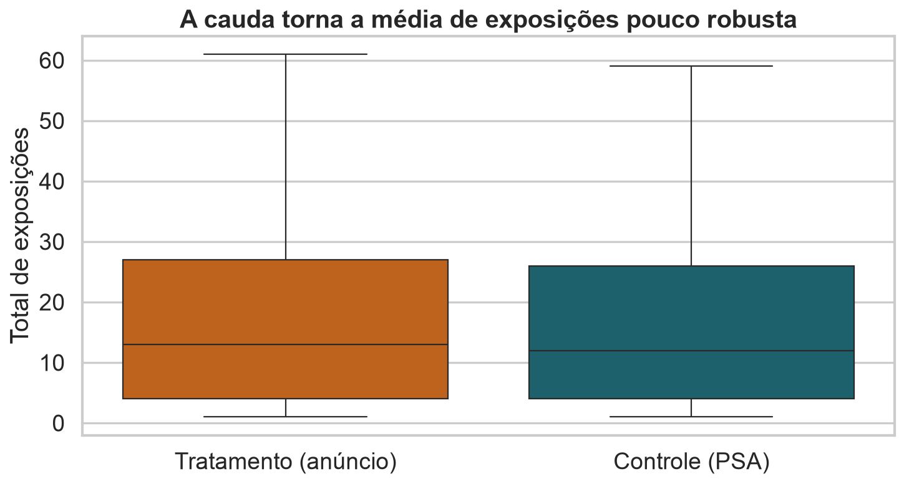
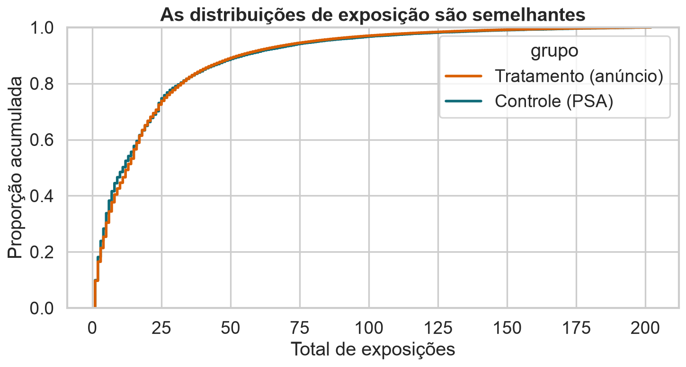
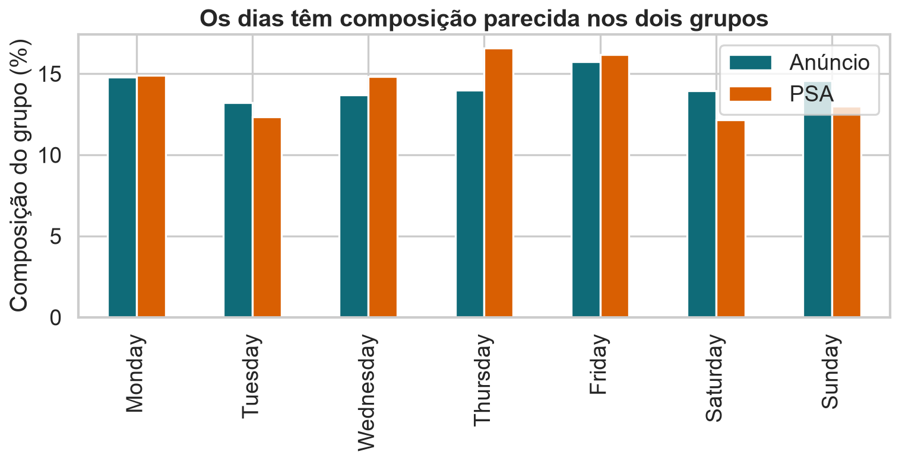
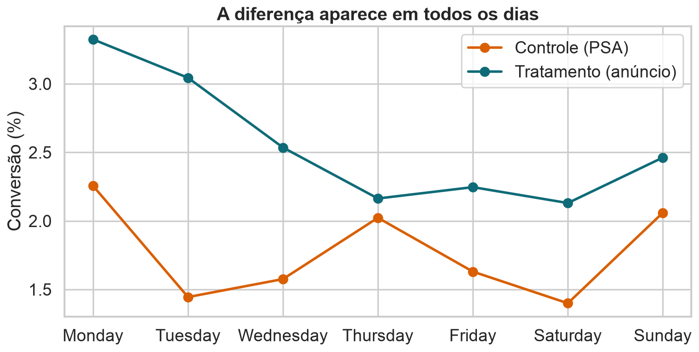
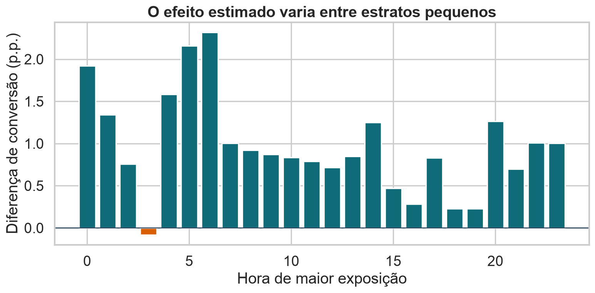
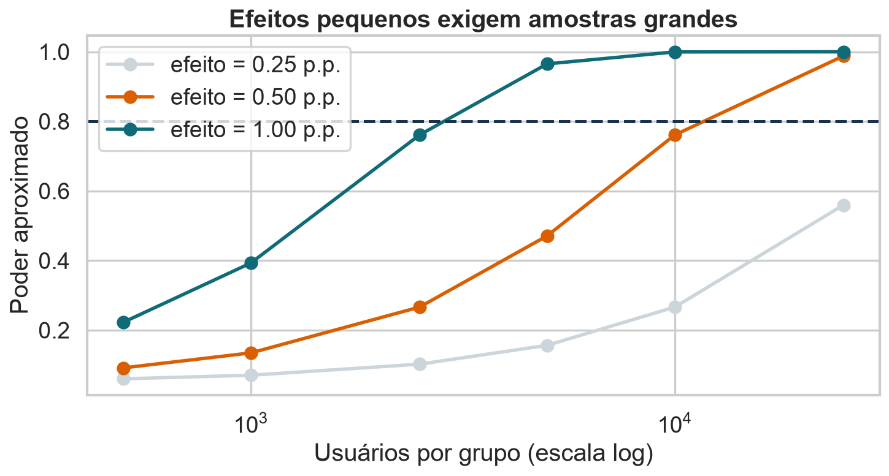

## O algoritmo é simples; o desenho não

::: {.statement}
O teste correto permuta exatamente aquilo que poderia ter sido sorteado no experimento.
:::

## Retomando a campanha

- 588.101 usuários;
- anúncio versus PSA;
- conversão principal: 2,55% versus 1,79%;
- diferença: +0,77 p.p.;
- forte evidência contra igualdade de conversão.

Agora vamos tensionar essa conclusão.

## Hoje

- escolher estatísticas para diferentes perguntas;
- lidar com distribuições assimétricas;
- usar permutação estratificada, pareada e por clusters;
- distinguir análise confirmatória e exploratória;
- discutir múltiplos testes, poder e validade.

## A intensidade de exposição é assimétrica

{fig-alt="Boxplots do total de exposições nos grupos, evidenciando cauda longa."}

<details class="code-fold"><summary>Código do gráfico</summary>

```python
ads = df[df["total ads"] <= df["total ads"].quantile(.995)]
sns.boxplot(data=ads, x="grupo", y="total ads", showfliers=False)
plt.title("A cauda torna a média de exposições pouco robusta")
```
</details>

## A média responde a uma pergunta específica

$$
T_{média}=\bar x_{ad}-\bar x_{psa}
$$

Ela compara o total médio de exposições por usuário e dá peso alto a usuários extremos.

Isso pode ser desejável se o total agregado de impressões importa.

## A mediana responde a outra

$$
T_{mediana}=\widetilde x_{ad}-\widetilde x_{psa}
$$

Ela compara o usuário típico e resiste à cauda.

Não existe uma estatística universalmente “melhor”: existe uma pergunta bem alinhada.

## Uma alternativa robusta: média aparada

Remova, por exemplo, 10% de cada cauda e calcule a média restante.

$$
T_{trim}=\bar x^{(10\%)}_{ad}-\bar x^{(10\%)}_{psa}
$$

É um compromisso entre eficiência e robustez.

## Permutação aceita estatísticas incomuns

Podemos testar diferenças de:

- medianas;
- quantis;
- médias aparadas;
- variâncias;
- correlações;
- distância entre distribuições.

Não precisamos conhecer uma fórmula fechada para a distribuição nula.

## A estatística precisa ser recalculada

Em cada permutação:

```python
labels = rng.permutation(group)
t_b = statistic(y[labels == "ad"], y[labels == "psa"])
```

Não se permuta a estatística pronta; permutam-se os rótulos e refaz-se todo o cálculo.

## Mesma exposição, distribuições semelhantes

{fig-alt="Curvas acumuladas do total de exposições para anúncio e PSA quase sobrepostas."}

<details class="code-fold"><summary>Código do gráfico</summary>

```python
plot_df = df[df["total ads"] <= df["total ads"].quantile(.99)]
sns.ecdfplot(data=plot_df, x="total ads", hue="grupo")
plt.title("As distribuições de exposição são semelhantes")
```
</details>

## Cuidado: exposição pode ser pós-tratamento

`total ads` é medido depois da atribuição.

Se converter encerra ou altera a exposição, controlar por essa variável pode:

- bloquear parte do efeito;
- criar viés de seleção;
- transformar uma checagem descritiva em ajuste causal inválido.

## Pré-tratamento versus pós-tratamento

**Pré-tratamento:** existe antes do sorteio; pode formar blocos e melhorar precisão.

**Pós-tratamento:** pode ter sido causada pelo tratamento; exige interpretação cuidadosa.

Dia e hora de maior exposição também podem ser pós-tratamento.

## Por que estratificar?

Se o experimento sorteou usuários separadamente por dia, comparar dentro de cada dia:

- respeita o desenho;
- evita misturar composições distintas;
- pode reduzir variabilidade.

## Os dias têm composição parecida

{fig-alt="Barras mostrando composição percentual por dia semelhante nos grupos anúncio e PSA."}

<details class="code-fold"><summary>Código do gráfico</summary>

```python
composition = pd.crosstab(df["most ads day"], df["test group"], normalize="columns")
(100 * composition).plot.bar(color=[BLUE, ORANGE])
plt.title("Os dias têm composição parecida nos dois grupos")
```
</details>

## Permutação estratificada

```python
def permute_within(frame, strata, group, rng):
    return frame.groupby(strata)[group].transform(
        lambda x: rng.permutation(x.to_numpy())
    )
```

Cada rótulo troca de lugar apenas com unidades do mesmo estrato.

## A estatística estratificada

Calcule a diferença dentro de cada estrato e combine com pesos pré-definidos:

$$
T=\sum_{s=1}^S w_s(\widehat p_{ad,s}-\widehat p_{psa,s})
$$

Pesos pelo tamanho do estrato respondem ao efeito médio na população observada.

$s=1,\ldots,S$ indexa os estratos; $\widehat p_{g,s}$ é a proporção no grupo $g$ dentro do estrato $s$; $w_s\geq0$ é um peso fixado antes da permutação, com $\sum_sw_s=1$. Os rótulos são permutados apenas dentro de cada $s$.

## Quando a permutação deve ser estratificada? {.quiz-question}

O tratamento foi sorteado separadamente dentro de cada dia. Como os rótulos devem ser permutados?

- [Livremente entre todos os usuários]{data-explanation="Isso cria atribuições incompatíveis com o desenho original."}
- [Apenas entre usuários do mesmo dia]{.correct data-explanation="A permutação deve reproduzir a randomização e preservar os tamanhos dentro de cada estrato."}
- [Somente entre usuários que converteram]{data-explanation="Condicionar na resposta quebra a lógica da atribuição aleatória."}
- [Não é possível usar permutação com estratos]{data-explanation="É possível, desde que as trocas sejam restritas aos estratos adequados."}

## A diferença aparece em todos os dias

{fig-alt="Linhas de conversão por dia para anúncio e PSA, com anúncio acima do PSA."}

<details class="code-fold"><summary>Código do gráfico</summary>

```python
by_day = df.groupby(["most ads day", "grupo"])["converted"].mean().mul(100).unstack()
by_day.plot(marker="o", color=[ORANGE, BLUE])
plt.title("A diferença aparece em todos os dias")
```
</details>

## Subgrupos são tentadores

Depois de ver o efeito médio, é natural perguntar:

- funciona melhor em algum dia?
- em alguma hora?
- para usuários muito expostos?

Cada pergunta adicional aumenta a chance de descobrir um padrão apenas por acaso.

## Efeitos por hora oscilam

{fig-alt="Barras da diferença de conversão por hora, com variação entre estratos."}

<details class="code-fold"><summary>Código do gráfico</summary>

```python
hour = df.groupby(["most ads hour", "grupo"])["converted"].mean().mul(100).unstack()
hour["diferença"] = hour["Tratamento (anúncio)"] - hour["Controle (PSA)"]
plt.bar(hour.index, hour["diferença"])
```
</details>

## Heterogeneidade ou ruído?

Uma diferença entre subgrupos não prova que os efeitos diferem.

O teste relevante é uma **interação**:

$$
T_{int}=\widehat\Delta_{hora\ 1}-\widehat\Delta_{hora\ 2}
$$

Não basta testar um grupo significativo e outro não significativo.

$\widehat\Delta_h$ é o efeito estimado no subgrupo $h$; $T_{int}$ compara diretamente dois efeitos. Testar a interação corresponde a testar $H_0:\Delta_{hora\ 1}=\Delta_{hora\ 2}$.

## Múltiplos testes inflam falsos positivos

Com 20 hipóteses verdadeiramente nulas e $\alpha=0{,}05$:

$$
P(\text{ao menos um falso positivo})=1-0{,}95^{20}\approx64\%
$$

Exploração precisa ser rotulada como exploração.

## Duas famílias de correção

- **FWER:** controla a chance de qualquer falso positivo; Bonferroni é simples e conservador.
- **FDR:** controla a proporção esperada de descobertas falsas; útil em exploração com muitas hipóteses.

Idealmente, defina uma métrica primária.

## Teste máximo por permutação

Para testar vários subgrupos preservando dependência:

1. calcule todas as estatísticas em cada permutação;
2. guarde o maior valor absoluto;
3. compare cada estatística observada com essa distribuição de máximos.

É uma correção simultânea alinhada ao desenho.

## Dados pareados exigem trocas pareadas

Se cada usuário vê A e B em momentos distintos, não embaralhe observações livremente.

Sob $H_0$, troque A/B **dentro de cada usuário** ou inverta aleatoriamente o sinal da diferença individual.

## Teste de sinais aleatórios

Para diferenças pareadas $d_i$:

$$
T=\frac{1}{n}\sum_i d_i
$$

Sob uma nula simétrica, sorteie $s_i\in\{-1,+1\}$ e calcule:

$$
T_b=\frac{1}{n}\sum_i s_i d_i
$$

$d_i=Y_{iA}-Y_{iB}$ é a diferença do par $i$; $s_i$ é um sinal independente com probabilidades iguais de $-1$ e $+1$ sob a nula; $T_b$ é a média após a $b$-ésima inversão aleatória.

## Clusters mudam a unidade do acaso

Se escolas, cidades ou contas foram sorteadas, pessoas dentro do mesmo cluster não são permutáveis individualmente.

Permute o tratamento entre **clusters** e calcule a estatística com todos os indivíduos associados.

## Interferência quebra a independência

Se usuários tratados influenciam usuários-controle:

- o resultado de uma unidade depende do tratamento de outra;
- a hipótese de “nenhum efeito individual” fica mais complexa;
- a permutação individual pode produzir um mundo impossível.

## Attrition pode destruir a randomização

Se a resposta só é observada para quem permaneceu no estudo, e a permanência depende do tratamento, os grupos analisados deixam de ser comparáveis.

Permutar apenas casos completos não corrige esse problema.

## A hipótese nula pode ser mais forte do que parece

O teste aleatorizado clássico é exato para a **nula aguda de Fisher**:

$$
H_0:Y_i(1)=Y_i(0)\quad\forall i
$$

Nenhuma unidade é afetada. Isso é mais forte que afirmar apenas efeito médio zero.

$Y_i(1)$ e $Y_i(0)$ são os resultados potenciais da unidade $i$ sob tratamento e controle. O quantificador $\forall i$ exige igualdade para cada unidade, não apenas em média.

## Qual hipótese é mais forte? {.quiz-question}

Qual afirmação descreve a nula aguda de Fisher?

- [O efeito médio é zero, embora efeitos individuais possam existir]{data-explanation="Essa é uma hipótese nula sobre o efeito médio."}
- [$Y_i(1)=Y_i(0)$ para toda unidade $i$]{.correct data-explanation="A nula aguda afirma ausência de efeito para cada unidade, permitindo imputar todos os resultados potenciais."}
- [As médias observadas dos grupos são exatamente iguais]{data-explanation="Igualdade amostral não define a hipótese causal sobre resultados potenciais."}
- [As distribuições têm apenas a mesma variância]{data-explanation="A nula aguda é uma afirmação sobre resultados potenciais individuais, não apenas dispersão."}

## Nula aguda versus nula média

- **Nula aguda:** permite imputar todos os resultados potenciais e reproduzir exatamente a atribuição.
- **Nula média:** efeitos positivos e negativos podem se cancelar.

Um teste exato para a primeira não é automaticamente exato para a segunda.

## Permutação sob igualdade de distribuições

No caso de duas amostras independentes, permutar livremente costuma testar:

$$
H_0:F_{ad}=F_{psa}
$$

Isso é mais forte que igualdade apenas de médias, especialmente se variâncias diferem.

$F_{ad}$ e $F_{psa}$ são as funções de distribuição completas dos resultados nos dois grupos. A igualdade exige mesma localização, dispersão, caudas e demais características.

## Studentizar ajuda

Uma estatística studentizada escala a diferença por sua incerteza:

$$
T=\frac{\bar X_{ad}-\bar X_{psa}}
{\sqrt{s^2_{ad}/n_{ad}+s^2_{psa}/n_{psa}}}
$$

Ela costuma ser mais estável quando tamanhos e variâncias diferem.

$\bar X_g$, $s_g^2$ e $n_g$ são, respectivamente, média, variância amostral e tamanho do grupo $g$. O denominador estima o erro padrão da diferença.

## O forte desbalanceamento importa aqui

O grupo PSA tem apenas 23.524 usuários contra 564.577 no anúncio.

Para uma diferença de proporções, a variância é dominada pelo grupo menor:

$$
SE(\widehat\Delta)\approx\sqrt{\frac{p_A(1-p_A)}{n_A}+\frac{p_B(1-p_B)}{n_B}}
$$

## Poder é chance de detectar um efeito real

Poder depende de:

- efeito verdadeiro;
- variabilidade da métrica;
- tamanhos dos grupos;
- nível $\alpha$;
- teste unilateral ou bilateral.

## Efeitos pequenos exigem muitos usuários

{fig-alt="Curvas aproximadas de poder para três diferenças de conversão e tamanhos amostrais crescentes."}

<details class="code-fold"><summary>Código do gráfico</summary>

```python
se0 = np.sqrt(2 * base * (1-base) / sizes)
power = 1 - norm.cdf(1.96-effect/se0) + norm.cdf(-1.96-effect/se0)
plt.plot(sizes, power, marker="o")
```
</details>

## Planeje antes de observar

Um plano A/B deve fixar:

- métrica primária;
- menor efeito relevante;
- $\alpha$ e poder desejado;
- tamanho da amostra ou horizonte;
- regra de parada;
- análises de subgrupo previstas.

## Espiar repetidamente aumenta o erro

Parar assim que $p<0{,}05$ não preserva o nível de 5%.

Alternativas:

- tamanho fixo;
- testes sequenciais apropriados;
- funções de gasto de alfa;
- métodos sempre válidos.

## Intervalos complementam o teste

O teste responde se os dados contradizem uma nula.

O intervalo responde quais efeitos permanecem plausíveis.

Para decisão, pergunte se o intervalo exclui efeitos pequenos demais para justificar o custo.

## Randomização permite causalidade — com condições

Precisamos de:

- atribuição efetivamente aleatória;
- adesão e mensuração comparáveis;
- ausência de interferência relevante;
- análise coerente com a unidade sorteada;
- estimando definido para a população do experimento.

## Validade externa é outra pergunta

Mesmo um experimento interno impecável pode não generalizar para:

- outra campanha;
- outro período;
- novos usuários;
- outra frequência de anúncios;
- outro produto.

## Um roteiro de análise responsável

1. documente o desenho;
2. descreva a base e perdas;
3. defina estimando e estatística;
4. reproduza a randomização nas permutações;
5. reporte efeito, incerteza e valor-p;
6. faça análises de sensibilidade.

## Decisão para a campanha

Os dados mostram aumento claro de conversão, mas a recomendação ainda depende de:

- receita por conversão;
- custo e saturação do anúncio;
- validade da alegação de randomização;
- efeitos de longo prazo;
- métricas de proteção, como cancelamento ou reclamação.

## O que aprendemos

- a estatística deve representar a pergunta;
- a permutação deve espelhar blocos, pares e clusters;
- subgrupos exigem testes de interação e controle de multiplicidade;
- poder e regras de parada pertencem ao desenho;
- validade causal nunca vem apenas de um valor-p pequeno.

## Checklist final

Antes de confiar em um teste de permutação, pergunte:

> O que foi sorteado? O que pode ser trocado? Qual efeito estamos estimando? Quantas perguntas fizemos? A decisão mudaria com um efeito pequeno?

## Encerramento

::: {.statement}
Permutação é uma linguagem para transformar o desenho experimental em uma distribuição nula — e não um atalho que dispensa pensar no desenho.
:::
