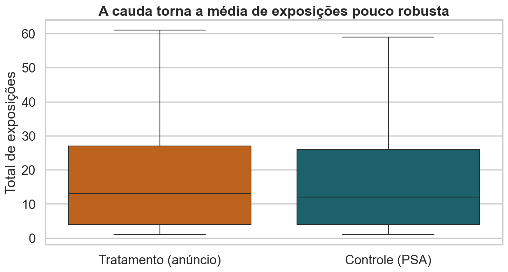

## O algoritmo é simples; o desenho não

::: {.statement}
O teste correto permuta exatamente aquilo que poderia ter sido sorteado no experimento.
:::

## Retomando a campanha

- 588.101 usuários;
- anúncio versus PSA;
- conversão principal: 2,55% versus 1,79%;
- diferença: +0,77 p.p.;
- forte evidência contra igualdade de conversão.

Agora vamos tensionar essa conclusão.

## Hoje

- escolher estatísticas para diferentes perguntas;
- reproduzir o sorteio em estratos, pares e clusters;
- reconhecer situações em que a permutação simples falha.

## A intensidade de exposição é assimétrica

{fig-alt="Boxplots do total de exposições nos grupos, evidenciando cauda longa."}

<details class="code-fold"><summary>Código do gráfico</summary>

```python
ads = df[df["total ads"] <= df["total ads"].quantile(.995)]
sns.boxplot(data=ads, x="grupo", y="total ads", showfliers=False)
plt.title("A cauda torna a média de exposições pouco robusta")
```
</details>

## A média responde a uma pergunta específica

$$
T_{média}=\bar x_{ad}-\bar x_{psa}
$$

Ela compara o total médio de exposições por usuário e dá peso alto a usuários extremos.

Isso pode ser desejável se o total agregado de impressões importa.

## A mediana responde a outra

$$
T_{mediana}=\widetilde x_{ad}-\widetilde x_{psa}
$$

Ela compara o usuário típico e resiste à cauda.

Não existe uma estatística universalmente “melhor”: existe uma pergunta bem alinhada.

## Uma alternativa robusta: média aparada

Remova, por exemplo, 10% de cada cauda e calcule a média restante.

$$
T_{trim}=\bar x^{(10\%)}_{ad}-\bar x^{(10\%)}_{psa}
$$

É um compromisso entre eficiência e robustez.

## Permutação aceita estatísticas incomuns

Podemos testar diferenças de:

- medianas;
- quantis;
- médias aparadas;
- variâncias;
- correlações;
- distância entre distribuições.

Não precisamos conhecer uma fórmula fechada para a distribuição nula.

## A estatística precisa ser recalculada

Em cada permutação:

```python
labels = rng.permutation(group)
t_b = statistic(y[labels == "ad"], y[labels == "psa"])
```

Não se permuta a estatística pronta; permutam-se os rótulos e refaz-se todo o cálculo.

## Por que `total ads` é pós-tratamento

`test group` é fixado no sorteio. `total ads` acumula-se **durante** a campanha.

::: {.columns .concept-cards}
::: {.column width="50%"}
### O tratamento pode mudar a exposição

Anúncio e PSA podem produzir diferentes níveis de interesse e permanência:

$$T\longrightarrow \text{total ads}\longrightarrow Y$$
:::

::: {.column width="50%"}
### A conversão pode mudar a exposição

Se converter encerra ou altera a campanha, a resposta afeta exposições posteriores:

$$T\longrightarrow Y\longrightarrow \text{total ads}$$
:::
:::

::: {.statement}
Controlar por `total ads` pode remover parte do efeito total ou selecionar usuários diferentes nos dois grupos.
:::

## Pré e pós-tratamento na campanha

::: {.columns .concept-cards}
::: {.column width="50%"}
### Antes da atribuição

Exemplos seriam dia de entrada, dispositivo ou histórico do usuário. Podem formar blocos **se fizerem parte do sorteio**.
:::

::: {.column width="50%"}
### Durante a campanha

`total ads`, `most ads day` e `most ads hour` são construídos a partir da exposição observada. Servem para descrição, mas exigem cautela causal.
:::
:::

::: {.statement}
`most ads day` não é o dia da randomização. Estratificar por ele é uma análise exploratória, não a reprodução exata do desenho.
:::

## Quando a estratificação é válida

Se o experimento sorteou usuários separadamente por uma variável pré-tratamento, como o dia de entrada, comparar dentro de cada estrato:

- respeita o desenho;
- evita misturar composições distintas;
- pode reduzir variabilidade.

## Permutação estratificada

```python
def permute_within(frame, strata, group, rng):
    return frame.groupby(strata)[group].transform(
        lambda x: rng.permutation(x.to_numpy())
    )
```

Cada rótulo troca de lugar apenas com unidades do mesmo estrato.

## Estratos: compare dentro, combine depois

Calcule a diferença em cada estrato e combine as comparações:

$$
T=\sum_{s=1}^S w_s\widehat\Delta_s
$$

::: {.callout-note title="Exemplo"}
Se a diferença for $+0{,}5$ p.p. na segunda e $+0{,}9$ p.p. na terça, com estratos do mesmo tamanho, a combinação é $(0{,}5+0{,}9)/2=+0{,}7$ p.p.
:::

$\widehat\Delta_s$ é a diferença no estrato $s$; $w_s$ é seu peso e os pesos somam 1.

## Quando a permutação deve ser estratificada? {.quiz-question}

O tratamento foi sorteado separadamente dentro de cada dia. Como os rótulos devem ser permutados?

- [Livremente entre todos os usuários]{data-explanation="Isso cria atribuições incompatíveis com o desenho original."}
- [Apenas entre usuários do mesmo dia]{.correct data-explanation="A permutação deve reproduzir a randomização e preservar os tamanhos dentro de cada estrato."}
- [Somente entre usuários que converteram]{data-explanation="Condicionar na resposta quebra a lógica da atribuição aleatória."}
- [Não é possível usar permutação com estratos]{data-explanation="É possível, desde que as trocas sejam restritas aos estratos adequados."}

## Dados pareados exigem trocas pareadas

Se cada usuário vê A e B em momentos distintos, não embaralhe observações livremente.

Sob $H_0$, troque A/B **dentro de cada usuário** ou inverta aleatoriamente o sinal da diferença individual.

::: {.callout-note title="Exemplo"}
Cada aluno resolve uma tarefa com e sem dica. As duas notas do mesmo aluno formam um par. A troca permitida apenas decide qual nota recebe o rótulo “com dica”.
:::

## Clusters mudam a unidade do acaso

Se escolas, cidades ou contas foram sorteadas, pessoas dentro do mesmo cluster não são permutáveis individualmente.

Permute o tratamento entre **clusters** e calcule a estatística com todos os indivíduos associados.

::: {.callout-note title="Exemplo"}
Em oito escolas, quatro recebem um novo método de ensino. O sorteio ocorreu entre as oito escolas; todos os alunos de uma escola devem mudar de rótulo juntos.
:::

## Interferência quebra a independência

O resultado de uma unidade passa a depender também do tratamento recebido por outras unidades.

::: {.callout-note title="Exemplo"}
Em uma rede social, um usuário tratado recebe um recurso de convite e chama um amigo do grupo controle. O comportamento do amigo foi afetado pelo tratamento de outra pessoa.
:::

Uma permutação individual que ignora a rede pode representar um experimento que nunca ocorreu.

## Attrition pode destruir a randomização

::: {.columns .concept-cards}
::: {.column width="33.3%"}
### Perdas

Tratamento: $30/100=30\%$

Controle: $5/100=5\%$
:::

::: {.column width="33.3%"}
### Casos completos

Se saem mais alunos com baixo desempenho no tratamento, a média dos restantes sobe por seleção.
:::

::: {.column width="33.3%"}
### Prática recomendada

Reporte as perdas por grupo e teste cenários plausíveis para os resultados ausentes.
:::
:::

::: {.statement}
Permutar apenas quem permaneceu não recupera a comparabilidade inicial.
:::

## A permutação mantém os resultados fixos {.smaller}

O algoritmo troca os grupos, mas não altera os valores observados.

| pessoa | dados observados | após permutar os rótulos |
|:---|:---|:---|
| Ana | tratamento, resultado 10 | controle, resultado **10** |
| Bruno | controle, resultado 4 | tratamento, resultado **4** |

::: {.statement}
Quando essa nova tabela representa um experimento que realmente poderia ter ocorrido?
:::

Somente quando mudar o tratamento não mudaria o resultado de nenhuma pessoa. Essa é a razão para introduzir a nula estrita de Fisher.

## Duas hipóteses nulas {.smaller}

::: {.columns .concept-cards}
::: {.column width="50%"}
### Nula estrita de Fisher

$$H_0^F:Y_i(1)=Y_i(0)\quad\text{para todo }i$$

Cada unidade teria o mesmo resultado sob tratamento e controle. Portanto, podemos trocar seu grupo e manter o valor observado.
:::

::: {.column width="50%"}
### Nula de efeito médio

$$H_0^\mu:\frac1n\sum_i\tau_i=0,
\qquad \tau_i=Y_i(1)-Y_i(0)$$

Os efeitos individuais podem existir. Por exemplo, $+4$ para Ana e $-4$ para Bruno produzem efeito médio zero.
:::
:::

$Y_i(1)$ e $Y_i(0)$ são os resultados potenciais da unidade $i$ sob tratamento e controle. A nula estrita implica efeito médio zero, mas o contrário não é verdadeiro.

## A garantia depende da hipótese {.smaller}

::: {.columns .concept-cards}
::: {.column width="50%"}
### Sob a nula estrita

Se Ana mudar de grupo, seu resultado continuará 10. Manter os resultados fixos em todas as atribuições é coerente.

**Conclusão:** o teste de randomização é exato.
:::

::: {.column width="50%"}
### Sob a nula média

Ana pode melhorar e Bruno piorar. Ao trocar seus grupos, os resultados poderiam mudar, mas não observamos esses valores alternativos.

**Conclusão:** a permutação simples não é automaticamente exata.
:::
:::

Para testar efeito médio zero, uma opção é permutar uma estatística studentizada:

$$T=\frac{\bar Y_1-\bar Y_0}{\sqrt{s_1^2/n_1+s_0^2/n_0}}.$$

$\bar Y_g$, $s_g^2$ e $n_g$ são a média, a variância amostral e o tamanho do grupo $g$. A validade costuma ser assintótica.

## Quando usar cada hipótese? {.smaller}

::: {.columns .concept-cards}
::: {.column width="50%"}
### Nula estrita de Fisher

Use quando a pergunta for:

> **O tratamento deixou todas as unidades inalteradas?**

É adequada para um teste de randomização exato, especialmente quando conhecemos o mecanismo de sorteio e queremos detectar qualquer efeito individual.

Rejeitá-la indica que **alguma unidade foi afetada**. Isso não garante que o efeito médio seja diferente de zero.
:::

::: {.column width="50%"}
### Nula de efeito médio

Use quando a pergunta for:

> **O tratamento altera o resultado em média?**

É a pergunta usual em experimentos A/B e decisões de política ou produto, nos quais efeitos individuais podem ser diferentes.

Use uma análise apropriada ao efeito médio, como a estatística studentizada, e reporte também o intervalo de confiança.
:::
:::

::: {.statement}
A hipótese deve seguir a pergunta científica. A exatidão do teste não compensa testar uma hipótese diferente daquela que interessa.
:::

## Exemplo: efeitos que se cancelam {.smaller}

| unidade | controle $Y_i(0)$ | tratamento $Y_i(1)$ | efeito $\tau_i$ |
|:---|---:|---:|---:|
| Ana | 6 | 10 | $+4$ |
| Bruno | 10 | 6 | $-4$ |

::: {.columns .concept-cards}
::: {.column width="50%"}
### Nula estrita de Fisher

Exige $\tau_i=0$ para **cada** unidade.

$$+4\neq0\qquad\text{e}\qquad-4\neq0$$

**Conclusão:** a nula estrita é falsa. O tratamento afeta Ana e Bruno.
:::

::: {.column width="50%"}
### Nula de efeito médio

Exige que a média dos efeitos seja zero.

$$\bar\tau=\frac{(+4)+(-4)}{2}=0$$

**Conclusão:** a nula de efeito médio é verdadeira. Não há ganho médio.
:::
:::

::: {.statement}
O mesmo conjunto de efeitos contradiz a nula estrita e satisfaz a nula média. Elas não são duas maneiras equivalentes de formular a mesma pergunta.
:::

## Randomização permite causalidade — com condições

Precisamos de:

- atribuição efetivamente aleatória;
- adesão e mensuração comparáveis;
- ausência de interferência relevante;
- análise coerente com a unidade sorteada;
- parâmetro de interesse definido para a população do experimento.

## Validade externa é outra pergunta

Mesmo um experimento interno impecável pode não generalizar para:

- outra campanha;
- outro período;
- novos usuários;
- outra frequência de anúncios;
- outro produto.

## Um roteiro de análise responsável

1. documente o desenho;
2. descreva a base e perdas;
3. defina o parâmetro de interesse e a estatística;
4. reproduza a randomização nas permutações;
5. reporte efeito, incerteza e valor-p;
6. faça análises de sensibilidade.

## Decisão para a campanha

Os dados mostram aumento claro de conversão, mas a recomendação ainda depende de:

- receita por conversão;
- custo e saturação do anúncio;
- validade da alegação de randomização;
- efeitos de longo prazo;
- métricas de proteção, como cancelamento ou reclamação.

## O que aprendemos

- a estatística deve representar a pergunta;
- a permutação deve espelhar blocos, pares e clusters;
- variáveis pós-tratamento não devem virar blocos do sorteio;
- interferência e perdas podem quebrar a comparação;
- validade causal nunca vem apenas de um valor-p pequeno.

## Checklist final

Antes de confiar em um teste de permutação, pergunte:

> O que foi sorteado? O que pode ser trocado? Qual efeito estamos estimando? A decisão mudaria com um efeito pequeno?

## Encerramento

::: {.statement}
Permutação é uma linguagem para transformar o desenho experimental em uma distribuição nula — e não um atalho que dispensa pensar no desenho.
:::
