## Uma decisão com três métricas

::: {.statement}
Mover uma barreira do nível 30 para o nível 40 melhora a experiência dos jogadores?
:::

Podemos medir retenção em 1 dia, retenção em 7 dias e número de rodadas. Qual resultado deve decidir?

## Hoje

- descrever o experimento Cookie Cats;
- construir $H_0$ por permutação e por bootstrap recentralizado;
- construir naturalmente $H_A$ por bootstrap;
- estimar poder sob alternativas específicas;
- compreender a inflação de falsos positivos;
- comparar Bonferroni e Benjamini–Hochberg.

## A base Cookie Cats

- 90.189 jogadores que instalaram um jogo móvel;
- atribuição aleatória entre `gate_30` e `gate_40`;
- mede rodadas nos primeiros 14 dias;
- mede retorno após 1 e 7 dias;
- versão no Kaggle sob licença Apache 2.0.

Fonte: Kaggle, `matinmahmoudi/rounds-and-retention`.

## A unidade e as colunas

| Coluna | Significado |
|---|---|
| `userid` | jogador único |
| `version` | posição da primeira porta: 30 ou 40 |
| `sum_gamerounds` | rodadas nos primeiros 14 dias |
| `retention_1` | retornou após 1 dia |
| `retention_7` | retornou após 7 dias |

## Qual é a intervenção?

No jogo, uma porta interrompe o avanço até o jogador esperar ou realizar uma compra.

- **Controle:** primeira porta no nível 30.
- **Tratamento:** mover a porta para o nível 40.
- **Pergunta:** adiar a interrupção aumenta engajamento e retenção?

## Os grupos têm tamanhos semelhantes

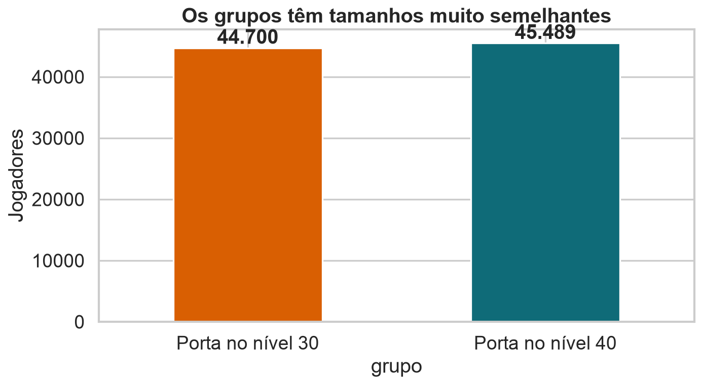{fig-alt="Barras com 44.700 jogadores no gate 30 e 45.489 no gate 40."}

<details class="code-fold" open><summary>Código do gráfico</summary>

```python
counts = df["grupo"].value_counts().reindex(order)
counts.plot.bar(color=[ORANGE, BLUE])
plt.ylabel("Jogadores")
plt.title("Os grupos têm tamanhos muito semelhantes")
```
</details>

## Três métricas, três histórias possíveis

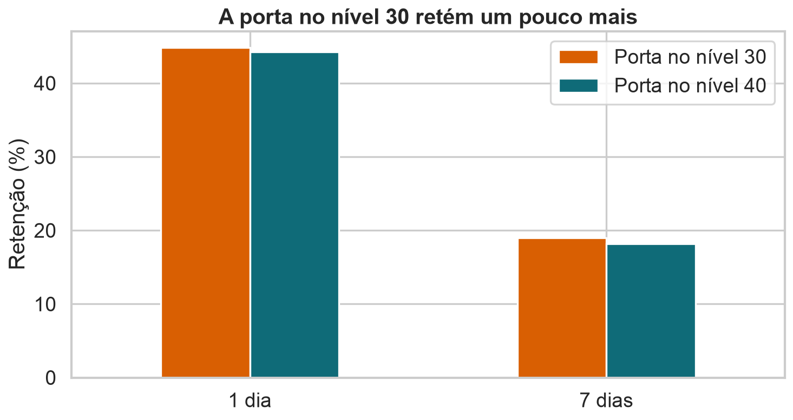{fig-alt="Barras de retenção em 1 e 7 dias mostrando taxas ligeiramente maiores para a porta no nível 30."}

<details class="code-fold" open><summary>Código do gráfico</summary>

```python
ret = df.groupby("grupo")[["retention_1", "retention_7"]].mean().mul(100)
ret.T.plot.bar(color=[ORANGE, BLUE])
plt.ylabel("Retenção (%)")
plt.title("A porta no nível 30 retém um pouco mais")
```
</details>

## A análise descritiva já orienta escolhas

| Métrica | Porta 30 | Porta 40 | Diferença 30 − 40 |
|---|---:|---:|---:|
| Retenção em 1 dia | 44,82% | 44,23% | +0,59 p.p. |
| Retenção em 7 dias | 19,02% | 18,20% | +0,82 p.p. |
| Média de rodadas | 52,46 | 51,30 | +1,16 |

Diferenças pequenas podem ser importantes — ou apenas ruído.

## Rodadas não seguem uma distribuição simples

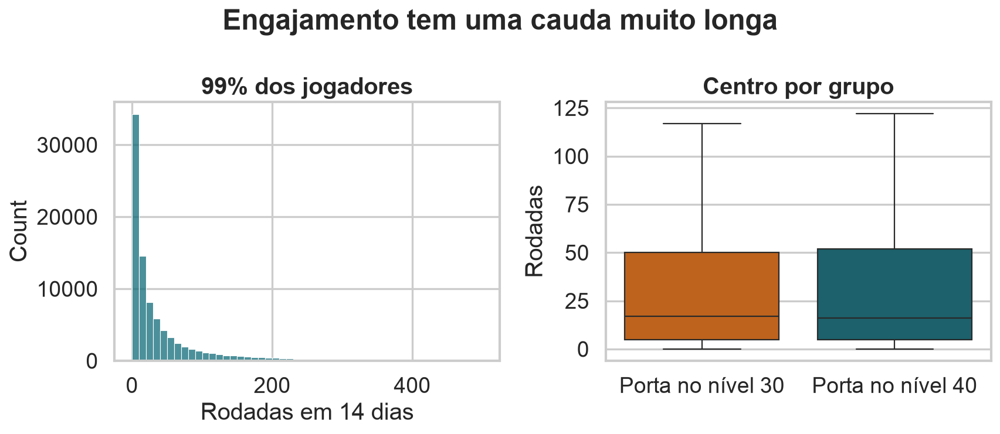{fig-alt="Histograma e boxplots mostrando forte assimetria à direita no número de rodadas."}

<details class="code-fold" open><summary>Código do gráfico</summary>

```python
sns.histplot(df.loc[df.sum_gamerounds <= 500, "sum_gamerounds"], bins=50)
sns.boxplot(data=df[df.sum_gamerounds <= df.sum_gamerounds.quantile(.999)],
            x="grupo", y="sum_gamerounds", showfliers=False)
```
</details>

## Defina uma métrica primária

Usaremos **retenção em 7 dias** como métrica primária.

Motivos:

- representa engajamento mais duradouro;
- é binária e interpretável;
- evita deixar a escolha depender do menor valor-p;
- torna as demais métricas secundárias.

## O efeito de interesse

$$
\Delta=p_{30}-p_{40}
$$

Estimativa observada:

$$
\widehat\Delta=0{,}1902-0{,}1820=0{,}0082
$$

A porta no nível 30 teve **0,82 p.p.** a mais de retenção em 7 dias.

## Duas hipóteses, dois mundos

$$
H_0:\Delta=0
\qquad\text{e}\qquad
H_A:\Delta\neq0
$$

- O mundo nulo descreve o que observaríamos sem efeito.
- O mundo alternativo exige escolher um efeito real específico ou estimá-lo.

## Permutação é natural sob $H_0$

Se a posição da porta não altera retenção, os rótulos `gate_30` e `gate_40` são trocáveis.

Embaralhar os rótulos:

- preserva todos os resultados;
- preserva os tamanhos dos grupos;
- remove a associação grupo–retenção.

## O mundo nulo por permutação

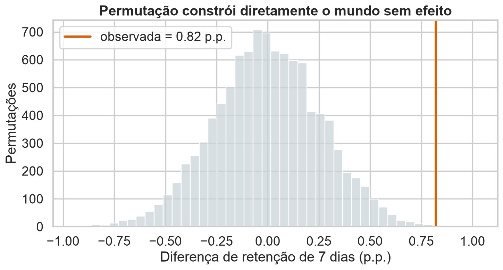{fig-alt="Distribuição de diferenças por permutação centrada em zero, com a diferença observada na cauda."}

<details class="code-fold" open><summary>Código do gráfico</summary>

```python
pooled = np.r_[y30, y40]
labels_perm = rng.permutation(labels)
t_perm = pooled[labels_perm == "gate_30"].mean() \
       - pooled[labels_perm == "gate_40"].mean()
```
</details>

## Bootstrap é natural sob $H_A$

Reamostrar separadamente dentro de cada grupo preserva:

- a taxa observada no `gate_30`;
- a taxa observada no `gate_40`;
- a diferença observada entre elas.

Por isso, o bootstrap usual fica centrado em $\widehat\Delta$, não em zero.

## O mundo alternativo por bootstrap

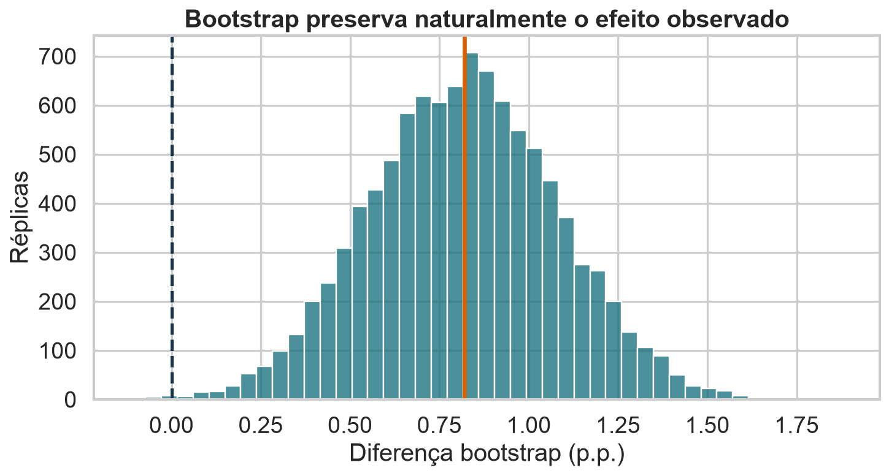{fig-alt="Distribuição bootstrap da diferença de retenção centrada no efeito observado e afastada de zero."}

<details class="code-fold" open><summary>Código do gráfico</summary>

```python
p30_b = rng.choice(y30, size=len(y30), replace=True).mean()
p40_b = rng.choice(y40, size=len(y40), replace=True).mean()
delta_b = p30_b - p40_b
```
</details>

## O bootstrap quantifica efeitos plausíveis

O intervalo percentil de 95% para $\Delta$ é aproximadamente:

$$
[0{,}31;1{,}33]\text{ p.p.}
$$

Ele responde melhor a:

> Quais tamanhos de efeito são compatíveis com a amostra?

## Bootstrap também pode construir $H_0$

::: {.statement}
Bootstrap não pertence exclusivamente a $H_A$.
:::

Para simular $H_0$, precisamos **impor a igualdade** antes de reamostrar. Uma forma é recentralizar os dois grupos para uma média comum.

## Recentrar remove o efeito observado

Para uma variável contínua:

$$
Y^{0}_{ij}=Y_{ij}-\bar Y_j+\bar Y_{pool}
$$

Cada grupo perde sua própria média e recebe a média combinada. Assim, a diferença entre as médias recentralizadas é zero.

## Código da recentralização

```python
pooled_mean = np.r_[y30, y40].mean()

y30_null = y30 - y30.mean() + pooled_mean
y40_null = y40 - y40.mean() + pooled_mean

t_null = rng.choice(y30_null, len(y30), replace=True).mean() \
       - rng.choice(y40_null, len(y40), replace=True).mean()
```

Para Bernoulli, simulamos de uma proporção combinada comum.

## Bootstrap recentralizado sob $H_0$

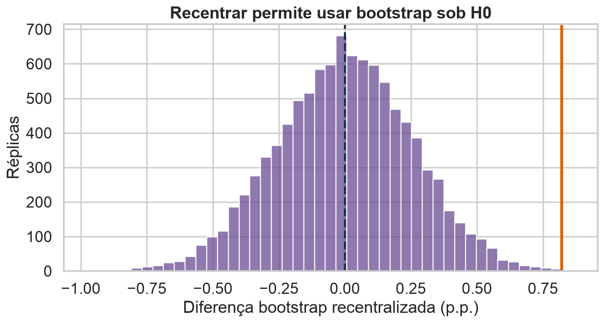{fig-alt="Distribuição bootstrap recentralizada em zero com a diferença observada na cauda."}

<details class="code-fold" open><summary>Código do gráfico</summary>

```python
pooled = (y30.sum() + y40.sum()) / (len(y30) + len(y40))
p30_null = rng.binomial(len(y30), pooled) / len(y30)
p40_null = rng.binomial(len(y40), pooled) / len(y40)
t_null = p30_null - p40_null
```
</details>

## A hipótese determina a simulação

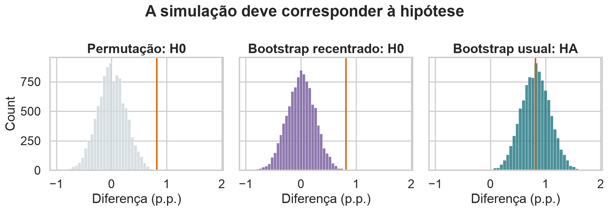{.wide-chart fig-alt="Três histogramas comparando permutação sob H0, bootstrap recentralizado sob H0 e bootstrap usual sob HA."}

<details class="code-fold" open><summary>Código do gráfico</summary>

```python
for values, title in [(perm, "Permutação: H0"),
                      (boot_null, "Bootstrap recentrado: H0"),
                      (boot_alt, "Bootstrap usual: HA")]:
    sns.histplot(values)
```
</details>

## Qual método usar?

| Objetivo | Construção mais natural |
|---|---|
| testar ausência de associação com rótulos trocáveis | permutação |
| testar $H_0$ sem permutabilidade, impondo um parâmetro | bootstrap recentralizado |
| estimar incerteza do efeito observado | bootstrap usual |
| simular poder para um efeito planejado | bootstrap/Monte Carlo sob alternativa definida |

## Poder começa com uma alternativa específica

Não existe “o poder do teste” sem dizer qual efeito é verdadeiro.

$$
\text{Poder}(\Delta^*)=P(\text{rejeitar }H_0\mid\Delta=\Delta^*)
$$

Cada $\Delta^*$ produz um poder diferente.

## Como simular poder com bootstrap

1. escolha taxas sob uma alternativa relevante;
2. gere duas amostras com o tamanho planejado;
3. aplique o teste completo;
4. registre se $H_0$ foi rejeitada;
5. repita e calcule a proporção de rejeições.

## Poder cresce com efeito e amostra

{fig-alt="Curvas de poder para três efeitos e diferentes números de jogadores por grupo."}

<details class="code-fold" open><summary>Código do gráfico</summary>

```python
for effect in effects:
    control = rng.binomial(n, p0, size=R) / n
    treatment = rng.binomial(n, p0 + effect, size=R) / n
    power = np.mean(test_rejects(treatment - control))
```
</details>

## Três maneiras de aumentar poder

- aumentar a amostra;
- reduzir a variabilidade com blocos ou covariáveis pré-tratamento;
- aceitar um $\alpha$ maior.

Aumentar o efeito não é uma opção estatística: ele pertence ao fenômeno e à intervenção.

## Alfa e poder estão em tensão

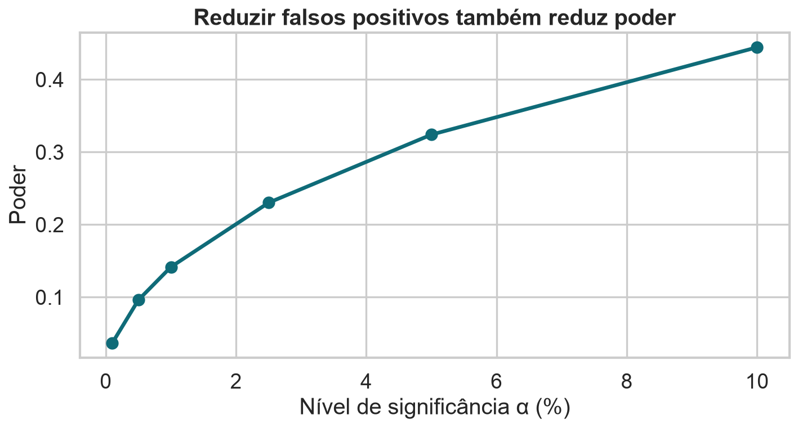{fig-alt="Curva mostrando aumento do poder conforme aumenta o nível de significância."}

<details class="code-fold" open><summary>Código do gráfico</summary>

```python
zcrit = norm.ppf(1 - alphas/2)
power = 1 - norm.cdf(zcrit-effect/se) + norm.cdf(-zcrit-effect/se)
plt.plot(100*alphas, power)
```
</details>

## Um efeito detectável não é necessariamente útil

Com muitos jogadores, podemos detectar diferenças minúsculas.

Planejamento exige definir o **menor efeito de interesse**:

$$
\Delta_{min}=\text{menor mudança que alteraria a decisão}
$$

O tamanho amostral deve ser planejado em torno dele.

## Agora temos mais de uma métrica

Cookie Cats oferece pelo menos três testes naturais:

1. retenção em 1 dia;
2. retenção em 7 dias;
3. rodadas em 14 dias.

Adicionar horas, segmentos ou cortes cria rapidamente dezenas de hipóteses.

## Cem testes fabricam surpresas

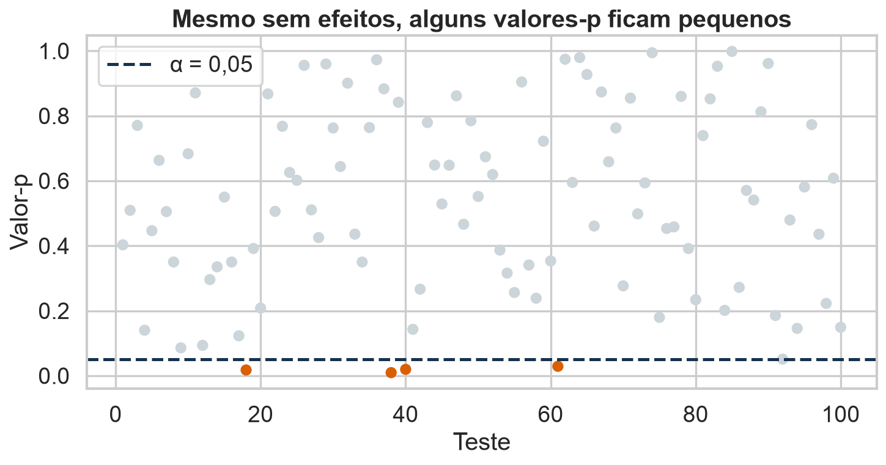{fig-alt="Cem valores-p sob hipóteses nulas, com alguns abaixo de 0,05 apenas por acaso."}

<details class="code-fold" open><summary>Código do gráfico</summary>

```python
p_values = rng.uniform(size=100)
plt.scatter(range(100), p_values, c=np.where(p_values < .05, ORANGE, LIGHT))
plt.axhline(.05, color=INK, ls="--")
```
</details>

## A família muda o erro

Se $m$ testes independentes usam nível $\alpha$:

$$
FWER=P(\text{ao menos um falso positivo})=1-(1-\alpha)^m
$$

Com $m=100$ e $\alpha=0{,}05$:

$$
FWER\approx99{,}4\%
$$

## A inflação cresce depressa

{fig-alt="Curva crescente da probabilidade de ao menos um falso positivo conforme aumenta o número de testes."}

<details class="code-fold" open><summary>Código do gráfico</summary>

```python
m = np.arange(1, 101)
fwer = 1 - (1 - .05)**m
plt.plot(m, fwer)
```
</details>

## Bonferroni controla a família

Teste cada hipótese com:

$$
\alpha^*=\frac{\alpha}{m}
$$

Equivalente: ajuste cada valor-p por $p_i^{adj}=\min(mp_i,1)$.

Funciona mesmo com dependência, mas pode perder muito poder.

## FDR responde a outra pergunta

Benjamini–Hochberg controla a proporção esperada de falsos entre os resultados declarados significativos:

$$
FDR=E\left[\frac{V}{\max(R,1)}\right]
$$

É apropriado quando buscamos várias descobertas, não uma única decisão crítica.

## O procedimento de Benjamini–Hochberg

1. ordene os valores-p;
2. encontre o maior $i$ com $p_{(i)}\leq(i/m)q$;
3. rejeite as hipóteses de posições $1$ a $i$.

$q$ é a taxa de falsas descobertas desejada.

## Bonferroni e BH não competem pela mesma meta

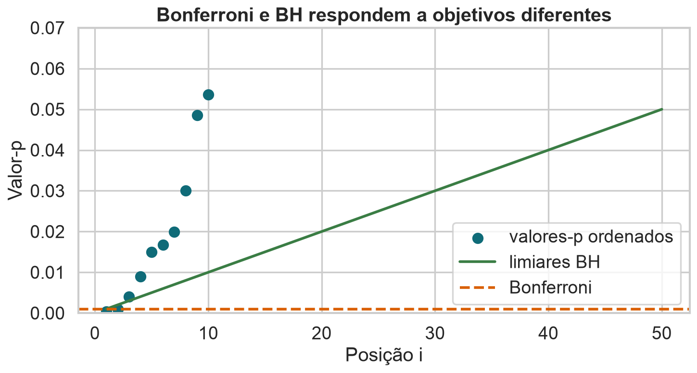{fig-alt="Valores-p ordenados comparados aos limiares de Bonferroni e Benjamini-Hochberg."}

<details class="code-fold" open><summary>Código do gráfico</summary>

```python
p = np.sort(p_values)
bh = .05 * np.arange(1, len(p)+1) / len(p)
plt.scatter(np.arange(1, len(p)+1), p)
plt.plot(np.arange(1, len(p)+1), bh, label="BH")
plt.axhline(.05/len(p), label="Bonferroni")
```
</details>

## Qual família devemos corrigir?

A família deve ser definida pela pergunta científica, não pelo arquivo de código.

- métricas usadas para uma única decisão pertencem à mesma família;
- análises confirmatórias e exploratórias podem formar famílias distintas;
- dividir artificialmente testes para evitar correção é p-hacking.

## Métrica primária reduz multiplicidade

Um plano claro para Cookie Cats poderia definir:

- **primária:** retenção em 7 dias;
- **secundária:** retenção em 1 dia;
- **exploratória:** rodadas e subgrupos;
- regra de decisão baseada na primária e métricas de proteção.

Não corrigimos uma hipótese que foi realmente definida como única antes do estudo.

## Selecionar significativos exagera efeitos

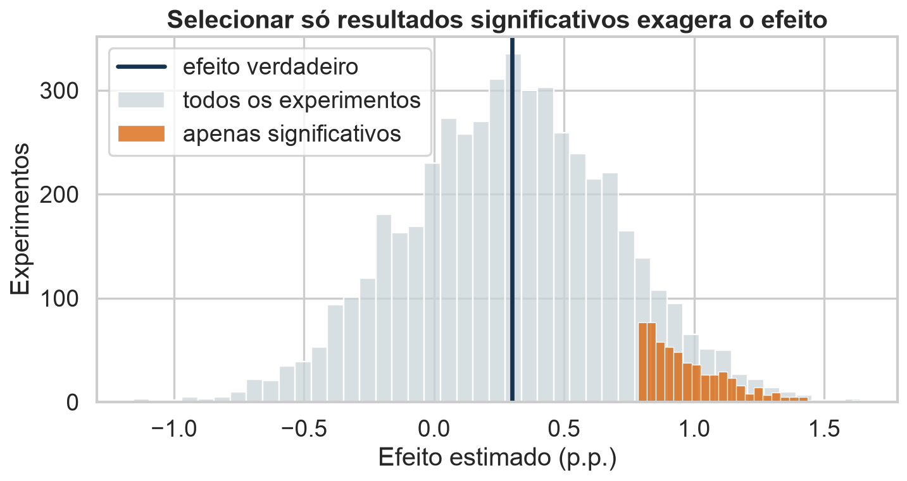{fig-alt="Distribuições mostrando que efeitos selecionados por significância são maiores que o efeito verdadeiro."}

<details class="code-fold" open><summary>Código do gráfico</summary>

```python
estimates = rng.normal(true_effect, se, 5000)
selected = estimates[estimates > 1.96*se]
sns.histplot(estimates)
sns.histplot(selected)
```
</details>

## Correção protege erro, não corrige desenho

Bonferroni ou BH não resolvem:

- escolha de hipóteses depois dos dados;
- parada opcional;
- exclusões seletivas;
- métricas pós-tratamento;
- falta de randomização;
- publicação apenas de resultados favoráveis.

## Um plano antes do experimento

Registre:

- métrica primária e família de testes;
- $\alpha$ ou $q$;
- menor efeito relevante;
- poder desejado e tamanho amostral;
- teste, cauda e regra de parada;
- exclusões, transformações e subgrupos.

## A decisão sobre Cookie Cats

Os dados favorecem manter a porta no nível 30 para retenção em 7 dias:

- efeito estimado: +0,82 p.p.;
- valor-p por permutação: cerca de 0,0023;
- IC bootstrap 95%: aproximadamente +0,31 a +1,33 p.p.

A decisão final ainda exige avaliar custo, receita e relevância prática.

## O que aprendemos

- permutação constrói $H_0$ diretamente quando há trocabilidade;
- bootstrap também constrói $H_0$ se recentralizarmos os dados;
- bootstrap usual é mais natural para $H_A$ e incerteza do efeito;
- poder depende de uma alternativa específica;
- múltiplos testes exigem definir família e objetivo do controle.

## Encerramento

::: {.statement}
Uma boa análise não busca apenas rejeitar $H_0$: ela planeja quais efeitos consegue detectar e quantas oportunidades teve de se enganar.
:::
