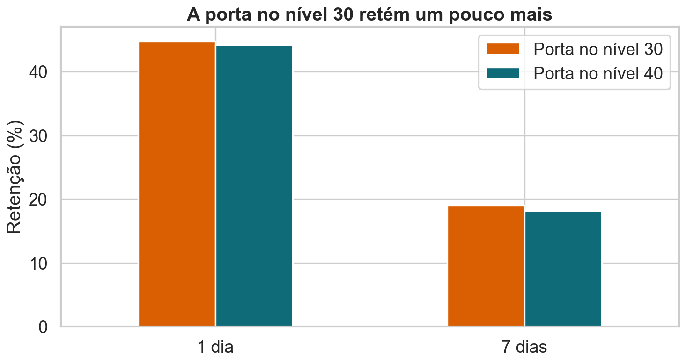
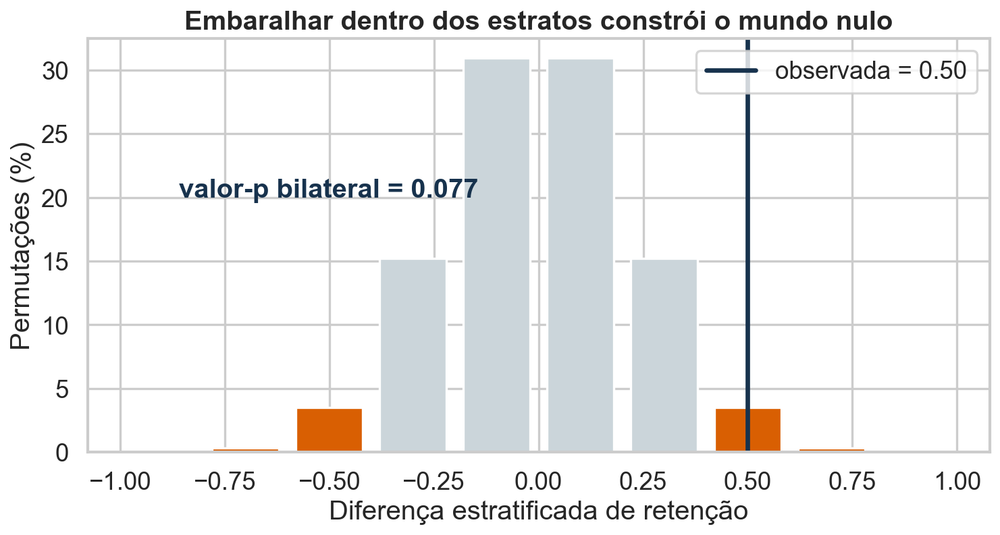
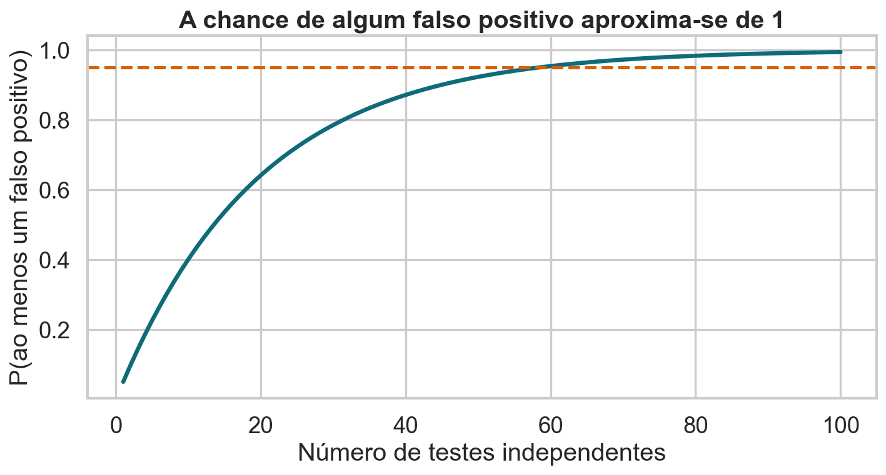
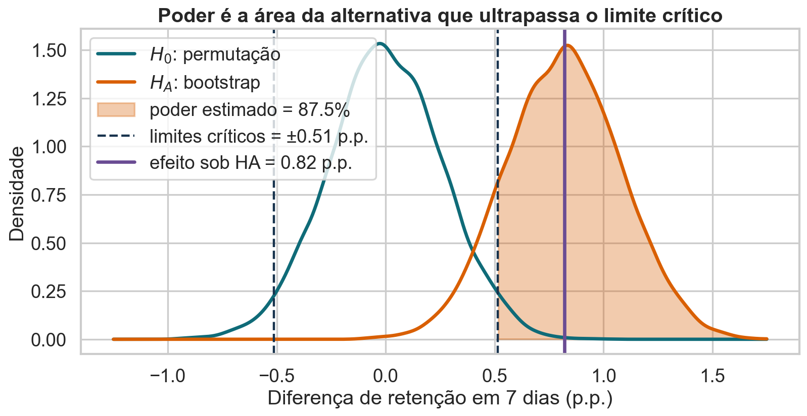
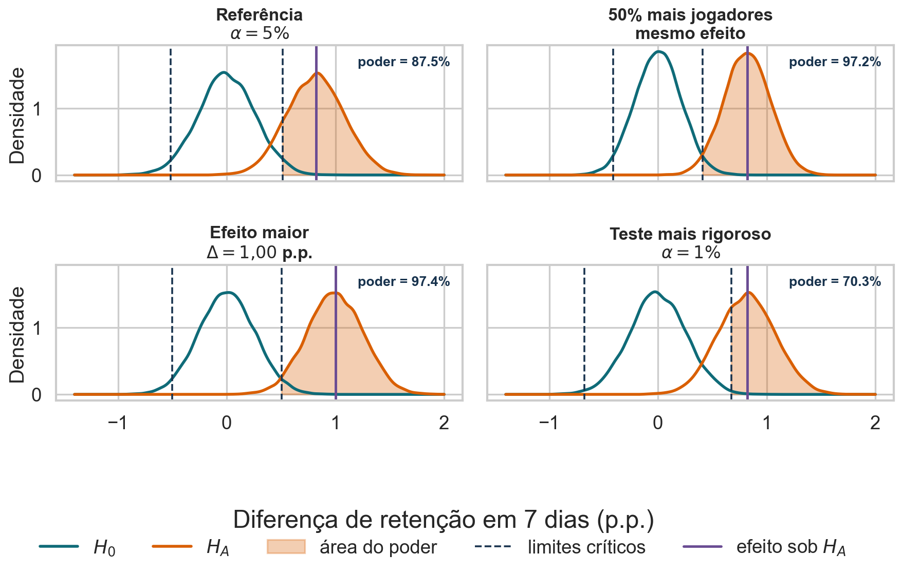

## Uma decisão com três desafios

::: {.statement}
Mover uma barreira do nível 30 para o nível 40 melhora a experiência dos jogadores?
:::

::: {.icd-grid}
::: {.icd-card}
**Estratos**

Como respeitar grupos definidos antes do experimento?
:::

::: {.icd-card}
**Múltiplas métricas**

Como evitar descobertas ocasionais?
:::

::: {.icd-card}
**Poder**

Qual a chance de detectar um efeito relevante?
:::
:::

## Roteiro da aula

1. construir um teste de permutação estratificado completo;
2. entender por que vários testes exigem uma regra conjunta;
3. comparar Bonferroni, Holm e Benjamini–Hochberg;
4. estimar poder com permutação sob $H_0$ e bootstrap sob $H_A$.

::: {.statement}
Uma única história conecta desenho experimental, decisão e planejamento.
:::

## A base Cookie Cats

- 90.189 jogadores que instalaram um jogo móvel;
- atribuição aleatória entre `gate_30` e `gate_40`;
- número de rodadas nos primeiros 14 dias;
- retenção após 1 e 7 dias;
- versão no Kaggle sob licença Apache 2.0.

Fonte: Kaggle, `matinmahmoudi/rounds-and-retention`.

## Intervenção e resultados

::: {.icd-grid}
::: {.icd-card}
**Controle**

Primeira barreira no nível 30.
:::

::: {.icd-card}
**Tratamento**

Primeira barreira no nível 40.
:::

::: {.icd-card}
**Resultados**

Retenção em 1 dia, retenção em 7 dias e rodadas.
:::
:::

A barreira interrompe o avanço até o jogador esperar ou realizar uma compra.

## Retenção observada

{fig-alt="Barras de retenção em 1 e 7 dias mostrando taxas ligeiramente maiores para a porta no nível 30."}

Os grupos têm 44.700 e 45.489 jogadores. As diferenças são pequenas, mas consistentes nas duas medidas de retenção.

<details class="code-fold"><summary>Código do gráfico</summary>

```python
ret = df.groupby("grupo")[["retention_1", "retention_7"]].mean().mul(100)
ret.T.plot.bar(color=[ORANGE, BLUE])
plt.ylabel("Retenção (%)")
```

</details>

## Métrica primária e efeito

Usaremos **retenção em 7 dias** como métrica primária.

$$
\Delta=p_{30}-p_{40}
$$

$$
\widehat\Delta=0{,}1902-0{,}1820=0{,}0082
$$

A porta no nível 30 apresentou retenção **0,82 ponto percentual** maior.

## Por que usar estratos?

Suponha que a equipe tenha randomizado separadamente jogadores de **Android** e **iOS**.

::: {.icd-grid}
::: {.icd-card}
**Motivo do desenho**

As plataformas podem ter taxas de retenção diferentes.
:::

::: {.icd-card}
**Regra da análise**

Se a atribuição ocorreu dentro da plataforma, a permutação também deve ocorrer dentro dela.
:::
:::

## Estratos devem existir antes do tratamento

::: {.icd-grid}
::: {.icd-card}
**Estrato válido**

Plataforma, região ou faixa de atividade medida antes da intervenção.
:::

::: {.icd-card}
**Estrato inadequado**

Rodadas ou retenção observadas depois que a versão foi atribuída.
:::
:::

Usar uma variável pós-tratamento pode retirar parte do efeito ou criar uma comparação enviesada.

## Exemplo didático estratificado

Em cada plataforma, cinco jogadores receberam cada versão. O valor 1 indica retenção em 7 dias.

| Plataforma | Porta 30 | Porta 40 |
|---|---|---|
| Android | 1, 1, 1, 1, 0 | 1, 0, 0, 0, 0 |
| iOS | 1, 1, 1, 0, 0 | 1, 0, 0, 0, 0 |

O exemplo é pequeno para permitir acompanhar cada etapa do teste.

## Diferenças dentro dos estratos

::: {.icd-grid}
::: {.icd-card}
**Android**

$$\widehat\Delta_A=0{,}80-0{,}20=0{,}60$$
:::

::: {.icd-card}
**iOS**

$$\widehat\Delta_I=0{,}60-0{,}20=0{,}40$$
:::
:::

As duas plataformas favorecem a porta no nível 30, mas com magnitudes diferentes.

## Estatística estratificada

Com $n_s$ observações no estrato $s$ e $n=\sum_s n_s$:

$$
T=\sum_s w_s\widehat\Delta_s,
\qquad w_s=\frac{n_s}{n}.
$$

Neste exemplo, os estratos têm o mesmo tamanho:

$$
T_{obs}=0{,}5(0{,}60)+0{,}5(0{,}40)=0{,}50.
$$

$T$ é a diferença média entre as versões, ajustada pela composição dos estratos.

## A hipótese nula respeita o desenho

$$
H_0:\text{a posição da barreira não altera a retenção}.
$$

Sob $H_0$, os rótulos são trocáveis **dentro de cada plataforma**.

- os resultados 0 e 1 permanecem fixos;
- cinco jogadores continuam em cada versão;
- Android não troca rótulos com iOS;
- recalculamos $T$ após cada troca.

## Uma permutação possível

| Plataforma | Porta 30 após troca | Porta 40 após troca | $\widehat\Delta_s^{(b)}$ |
|---|---|---|---:|
| Android | 1, 1, 1, 0, 0 | 1, 1, 0, 0, 0 | 0,20 |
| iOS | 1, 1, 0, 0, 0 | 1, 1, 0, 0, 0 | 0,00 |

$$
T^{(b)}=0{,}5(0{,}20)+0{,}5(0)=0{,}10.
$$

Esta permutação produziu uma diferença menor que $T_{obs}=0{,}50$.

## Algoritmo da permutação estratificada

1. calcule $T_{obs}$ com os rótulos originais;
2. embaralhe os rótulos separadamente em cada estrato;
3. calcule $T^{(b)}$ com os dados permutados;
4. repita $B$ vezes;
5. conte valores pelo menos tão extremos quanto $T_{obs}$.

$$
\widehat p=\frac{1+\sum_{b=1}^{B}I(|T^{(b)}|\geq|T_{obs}|)}{B+1}.
$$

$I(\cdot)$ vale 1 quando a condição é verdadeira e 0 caso contrário.

## Distribuição sob $H_0$

{fig-alt="Distribuição exata da estatística após permutações dentro de Android e iOS, com as caudas extremas destacadas."}

Existem $\binom{10}{5}^2=63.504$ atribuições possíveis. Cerca de 7,7% são tão extremas quanto a observada.

<details class="code-fold"><summary>Código do teste</summary>

```python
null = []
for _ in range(B):
    deltas = []
    for platform, group in data.groupby("platform"):
        labels_b = rng.permutation(group["version"])
        deltas.append(statistic(group["retention"], labels_b))
    null.append(np.average(deltas, weights=stratum_sizes))

p_value = (1 + np.sum(np.abs(null) >= abs(t_obs))) / (B + 1)
```

</details>

## Interpretação do exemplo

O efeito observado foi grande, mas a amostra tinha apenas 20 jogadores.

$$
p\approx0{,}077
$$

No nível de 5%, não rejeitamos $H_0$. Isso não prova ausência de efeito. O experimento fornece evidência insuficiente para uma decisão tão rigorosa.

::: {.statement}
Estratificar preserva o desenho. Não substitui uma amostra adequada.
:::

## Onde os rótulos devem ser trocados? {.quiz-question}

O experimento atribuiu versões separadamente em Android e iOS. Qual procedimento representa corretamente $H_0$?

- [Embaralhar os rótulos dentro de cada plataforma]{.correct data-explanation="A permutação deve reproduzir a forma como o experimento atribuiu os tratamentos."}
- [Embaralhar Android e iOS juntamente]{data-explanation="Isso permite atribuições que o desenho original não realizou."}
- [Embaralhar a retenção e manter os rótulos]{data-explanation="O teste mantém os resultados fixos e troca os rótulos permitidos pelo desenho."}

## De uma métrica para várias

Cookie Cats oferece três perguntas naturais:

1. a versão altera a retenção em 1 dia?
2. a versão altera a retenção em 7 dias?
3. a versão altera o número de rodadas?

Cada teste cria uma nova oportunidade de encontrar um resultado pequeno por acaso.

## Falsos positivos se acumulam

{fig-alt="Probabilidade de pelo menos um falso positivo conforme cresce o número de testes independentes."}

Com testes independentes no nível 5%, a chance de pelo menos um falso positivo é $1-(1-0{,}05)^m$: 14,3% com 3 testes e 40,1% com 10.

<details class="code-fold"><summary>Código do gráfico</summary>

```python
m = np.arange(1, 101)
fwer = 1 - (1 - .05)**m
plt.plot(m, fwer)
```

</details>

## Duas metas de controle

::: {.icd-grid}
::: {.icd-card}
**FWER**

*Family-wise error rate* (**taxa de erro familiar**)

Chance de cometer **ao menos um** falso positivo na família.

Adequada quando uma conclusão falsa tem custo alto.
:::

::: {.icd-card}
**FDR**

*False discovery rate* (**taxa de falsas descobertas**)

Fração falsa esperada entre as descobertas anunciadas.

Adequada quando buscamos muitas descobertas.
:::
:::

As duas metas respondem a perguntas diferentes.

## Bonferroni divide o orçamento de erro

Considere os valores-p ordenados

$$
0{,}003,\ 0{,}011,\ 0{,}018,\ 0{,}041,\ 0{,}200.
$$

::: {.icd-grid}
::: {.icd-card}
**Cálculo do limiar**

$$
\alpha^*=\frac{\alpha}{m}
=\frac{0{,}05}{5}=0{,}01
$$
:::

::: {.icd-card}
**Comparação**

$0{,}003\leq0{,}01$, mas os outros valores-p são maiores que $0{,}01$.

Rejeite apenas $H_{(1)}$.
:::
:::

Bonferroni controla FWER, mas aplica o mesmo limiar rígido a todos os testes.

## Holm é um Bonferroni sequencial

Holm compara $p_{(i)}$ com $\alpha/(m-i+1)$ e para no primeiro fracasso.

| $i$ | $p_{(i)}$ | limiar | decisão |
|---:|---:|---:|:---|
| 1 | 0,003 | $0{,}05/5=0{,}0100$ | rejeita e continua |
| 2 | 0,011 | $0{,}05/4=0{,}0125$ | rejeita e continua |
| 3 | 0,018 | $0{,}05/3=0{,}0167$ | não rejeita e para |

Logo, Holm rejeita $H_{(1)}$ e $H_{(2)}$. As demais hipóteses não são rejeitadas.

## Benjamini–Hochberg controla FDR

BH compara cada $p_{(i)}$ com $(i/m)q$. Aqui, $m=5$ e $q=0{,}05$.

| $i$ | $p_{(i)}$ | $(i/5)0{,}05$ | satisfaz? |
|---:|---:|---:|:---:|
| 1 | 0,003 | 0,010 | sim |
| 2 | 0,011 | 0,020 | sim |
| 3 | 0,018 | 0,030 | **sim** |
| 4 | 0,041 | 0,040 | não |
| 5 | 0,200 | 0,050 | não |

O maior índice aprovado é $k=3$. Portanto, BH rejeita $H_{(1)},H_{(2)}$ e $H_{(3)}$.

$i$ é a posição, $p_{(i)}$ é o valor-p ordenado, $m$ é o número de testes, $q$ é a FDR-alvo e $k$ é a última posição aprovada.

## Um exemplo, três decisões

Para $m=5$ e $\alpha=q=0{,}05$:

| valor-p | Bonferroni | Holm | BH |
|---:|:---:|:---:|:---:|
| 0,003 | rejeita | rejeita | rejeita |
| 0,011 | não | rejeita | rejeita |
| 0,018 | não | não | rejeita |
| 0,041 | não | não | não |
| 0,200 | não | não | não |

Bonferroni rejeita uma hipótese, Holm rejeita duas e BH rejeita três. A diferença vem da meta de controle.

## Escolha do procedimento

::: {.icd-grid}
::: {.icd-card}
**Poucas decisões confirmatórias**

Use Holm. Bonferroni pode servir como regra simples.
:::

::: {.icd-card}
**Muitas hipóteses exploratórias**

Use BH quando aceitar algumas descobertas falsas for razoável.
:::

::: {.icd-card}
**Uma decisão principal**

Defina uma métrica primária antes de observar os resultados.
:::
:::

## Uma métrica primária reduz multiplicidade

Um plano para Cookie Cats poderia definir:

- **primária:** retenção em 7 dias;
- **secundária:** retenção em 1 dia;
- **exploratória:** rodadas e análises de subgrupos.

Não corrigimos uma hipótese realmente definida como única antes do estudo. As análises adicionais devem ser identificadas como secundárias ou exploratórias.

## A pergunta sobre poder

::: {.statement}
Se a diferença verdadeira for relevante, qual é a chance de o teste rejeitar $H_0$?
:::

$$
\operatorname{Poder}(\Delta^*)
=P(\text{rejeitar }H_0\mid\Delta=\Delta^*).
$$

O poder sempre se refere a uma alternativa específica $\Delta^*$.

## Uma alternativa para Cookie Cats

Usaremos como cenário didático o efeito observado:

$$
\Delta^*=0{,}82\text{ p.p.}
$$

Isso não afirma que o efeito verdadeiro seja exatamente 0,82 p.p. O valor apenas define o mundo alternativo usado na simulação.

Os tamanhos dos grupos continuam 44.700 e 45.489 jogadores.

## $H_0$ por permutação

Sob ausência de efeito, embaralhamos `gate_30` e `gate_40` e recalculamos $\widehat\Delta$.

A distribuição de $|\widehat\Delta|$ fornece o limite crítico bilateral de 5%:

$$
c=Q_{0{,}95}(|\widehat\Delta^{perm}|)\approx0{,}51\text{ p.p.}
$$

Rejeitamos $H_0$ quando $|\widehat\Delta|\geq c$.

## $H_A$ por bootstrap

Reamostramos jogadores **separadamente em cada versão**.

Esse bootstrap preserva as taxas observadas e produz uma distribuição centrada perto de

$$
\Delta^*=0{,}82\text{ p.p.}
$$

Cada réplica representa um novo experimento possível quando essa alternativa é verdadeira.

## Simulação do poder

1. construa a distribuição nula por permutação;
2. obtenha o limite crítico $c$;
3. gere réplicas bootstrap sob $H_A$;
4. aplique a mesma regra $|\widehat\Delta^{(b)}|\geq c$;
5. calcule a fração de rejeições.

$$
\widehat{\operatorname{Poder}}
=\frac{1}{B}\sum_{b=1}^{B}
I(|\widehat\Delta^{(b)}_{HA}|\geq c).
$$

## Distribuições nula e alternativa

{.wide-chart fig-alt="Distribuições da diferença sob a hipótese nula por permutação e sob a alternativa por bootstrap, com limites críticos e área de poder."}

A área laranja além dos limites críticos representa experimentos que rejeitariam $H_0$. Neste cenário, o poder estimado é aproximadamente 88%.

<details class="code-fold"><summary>Código da simulação</summary>

```python
critical = np.quantile(np.abs(null_perm), .95)

boot_alt = np.array([
    rng.choice(y30, len(y30), replace=True).mean()
    - rng.choice(y40, len(y40), replace=True).mean()
    for _ in range(B)
])

power = np.mean(np.abs(boot_alt) >= critical)
```

</details>

## Leitura do gráfico

::: {.icd-grid}
::: {.icd-card}
**Curva azul**

Variação esperada sem efeito, construída por permutação.
:::

::: {.icd-card}
**Curva laranja**

Variação sob o efeito escolhido, construída por bootstrap.
:::

::: {.icd-card}
**Área sombreada**

Probabilidade de a alternativa ultrapassar o limite do teste.
:::
:::

A linha roxa marca o efeito de 0,82 p.p. usado para definir $H_A$.

## O que modifica o poder?

{.wide-chart fig-alt="Quatro painéis na mesma escala com as distribuições nula e alternativa: cenário de referência, 50% mais jogadores, efeito maior e teste mais rigoroso. As áreas sombreadas mostram o poder."}

Na mesma escala, aumentar a amostra ou o efeito eleva o poder de cerca de 88% para aproximadamente 97%. Reduzir $\alpha$ de 5% para 1% afasta os limites críticos e reduz o poder para cerca de 70%.

<details class="code-fold"><summary>Código da figura</summary>

```python
def simulate_difference(n_a, n_b, p_a, p_b, reps=20_000):
    return (
        rng.binomial(n_a, p_a, reps) / n_a
        - rng.binomial(n_b, p_b, reps) / n_b
    )

pooled = (y30.sum() + y40.sum()) / (n30 + n40)

large_null = simulate_difference(
    round(1.5*n30), round(1.5*n40), pooled, pooled
)
large_alt = simulate_difference(
    round(1.5*n30), round(1.5*n40), y30.mean(), y40.mean()
)

effect_alt = simulate_difference(
    n30, n40, y40.mean() + .010, y40.mean()
)

scenarios = [
    (null_perm, boot_alt, critical, observed, "Referência"),
    (large_null, large_alt,
     np.quantile(np.abs(large_null), .95), observed,
     "50% mais jogadores"),
    (null_perm, effect_alt, critical, .010, "Efeito maior"),
    (null_perm, boot_alt,
     np.quantile(np.abs(null_perm), .99), observed,
     "Teste mais rigoroso"),
]

fig, axes = plt.subplots(2, 2, sharex=True, sharey=True)
for ax, (null, alt, cutoff, effect, title) in zip(
    axes.flat, scenarios
):
    grid = np.linspace(-1.4, 2.0, 700)
    density_h0 = gaussian_kde(100 * null)(grid)
    density_ha = gaussian_kde(100 * alt)(grid)
    rejection = np.abs(grid) >= 100 * cutoff
    power = np.mean(np.abs(alt) >= cutoff)

    ax.plot(grid, density_h0, label="$H_0$")
    ax.plot(grid, density_ha, label="$H_A$")
    ax.fill_between(
        grid, 0, density_ha, where=rejection, alpha=.30
    )
    ax.axvline(-100 * cutoff, linestyle="--")
    ax.axvline(100 * cutoff, linestyle="--")
    ax.axvline(100 * effect, color="#6a4c93")
    ax.set_title(f"{title}\npoder = {power:.1%}")

plt.show()
```

</details>

## Decisão sobre Cookie Cats

{.wide-chart fig-alt="Distribuições da diferença de retenção sob a hipótese nula e sob a alternativa, com limites críticos, efeito observado e área correspondente ao poder."}

| Efeito estimado | Valor-p | IC bootstrap de 95% | Poder |
|---:|---:|---:|---:|
| +0,82 p.p. | 0,002 | +0,31 a +1,33 p.p. | aproximadamente 88% |

Os dados favorecem a porta no nível 30 para retenção em 7 dias. A decisão de produto ainda depende da relevância prática, da receita e dos custos da mudança.

## O que significa poder de 88%? {.quiz-question}

No cenário simulado com efeito de 0,82 p.p., qual interpretação está correta?

- [Cerca de 88% dos experimentos repetidos rejeitariam $H_0$]{.correct data-explanation="Poder é a probabilidade de rejeitar H0 quando a alternativa especificada é verdadeira."}
- [Há 88% de probabilidade de $H_A$ ser verdadeira]{data-explanation="O poder não fornece uma probabilidade posterior para a hipótese."}
- [88% dos jogadores são afetados pela mudança]{data-explanation="O valor se refere à repetição do procedimento de teste, não à fração de jogadores afetados."}

## O fio da aula

1. a permutação deve reproduzir o desenho de atribuição, inclusive os estratos;
2. vários testes criam várias oportunidades de falso positivo;
3. FWER e FDR representam metas diferentes;
4. o poder compara uma regra construída sob $H_0$ com resultados simulados sob $H_A$.

## Encerramento

::: {.statement}
Um teste bem planejado respeita o desenho, declara quantas perguntas fará e verifica quais efeitos consegue detectar.
:::
