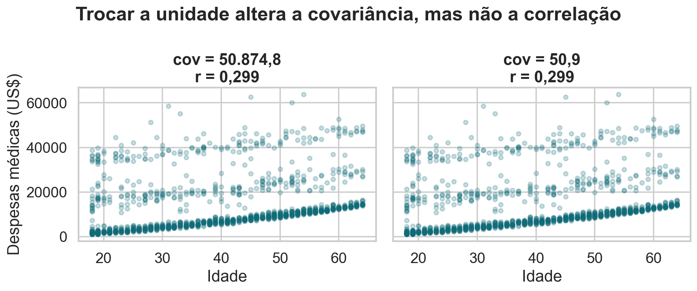
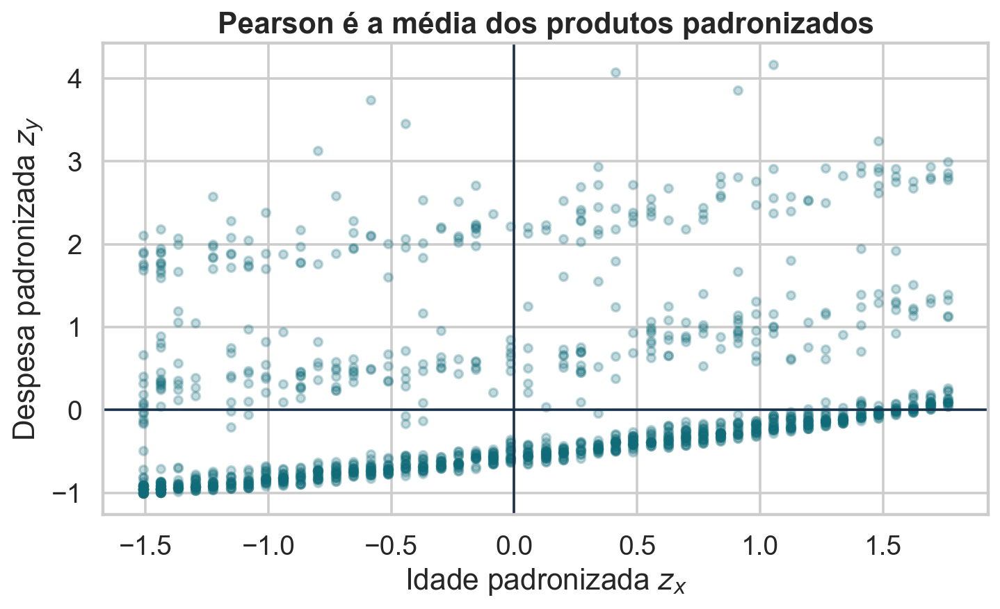
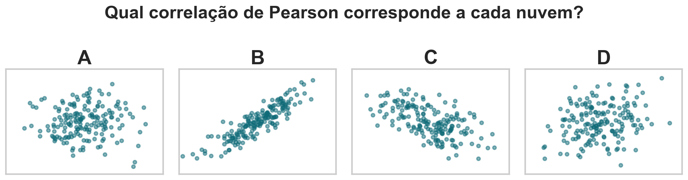
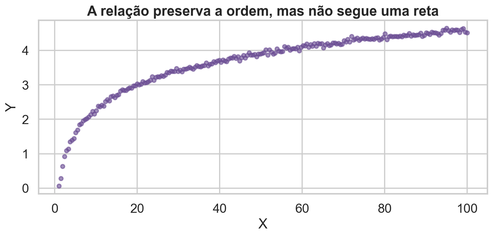

## Duas variáveis mudam juntas?

Idade, índice de massa corporal e despesas médicas parecem associados.

Mas precisamos separar quatro perguntas:

1. qual é a **direção** da associação?
2. qual é sua **intensidade**?
3. qual forma de relação a medida consegue enxergar?
4. a associação permanece quando condicionamos outras variáveis?

## Hoje

- descrever uma base de despesas médicas;
- construir covariância a partir de desvios em relação às médias;
- definir e interpretar a correlação de Pearson;
- comparar Pearson e Spearman;
- reconhecer não linearidade, pontos influentes e restrição de amplitude;
- distinguir correlação marginal, condicional e causalidade.

## Base de dados de apoio

Usaremos **Medical Insurance Cost**, disponível no Kaggle sob licença CC0.

- 1.338 beneficiários de seguro-saúde nos Estados Unidos;
- variáveis demográficas, corporais e de cobertura;
- despesas médicas individuais registradas em `charges`;
- estudo observacional: não há atribuição aleatória.

Fonte: Kaggle, `mosapabdelghany/medical-insurance-cost-dataset`.

## O que representa cada linha?

Cada linha representa uma pessoa segurada.

| coluna | significado |
|---|---|
| `age` | idade em anos |
| `sex` | sexo registrado |
| `bmi` | índice de massa corporal |
| `children` | dependentes cobertos |
| `smoker` | tabagismo: sim ou não |
| `region` | região dos Estados Unidos |
| `charges` | despesas médicas cobradas em US$ |

## Antes da correlação, audite a base

- 1.338 linhas e 7 colunas;
- nenhuma ausência nas colunas;
- idade entre 18 e 64 anos;
- IMC entre 15,96 e 53,13 kg/m²;
- despesas entre US$ 1.121,87 e US$ 63.770,43;
- 274 fumantes e 1.064 não fumantes.

Uma correlação só é interpretável depois que unidade, população e qualidade dos dados estão claras.

## A análise descritiva revela assimetria

{.wide-chart fig-alt="Quatro gráficos descrevendo idade, IMC, despesas médicas e tabagismo."}

As despesas têm forte cauda à direita. Médias, dispersões e correlações podem ser influenciadas pelas observações mais altas.

<details class="code-fold"><summary>Código do gráfico</summary>

```python
fig, axes = plt.subplots(2, 2, figsize=(11.5, 7.2))
sns.histplot(df, x="age", bins=24, ax=axes[0, 0])
sns.histplot(df, x="bmi", bins=28, ax=axes[0, 1])
sns.histplot(df, x="charges", bins=35, ax=axes[1, 0])
sns.countplot(df, x="fumante", ax=axes[1, 1])
```
</details>

## Médias escondem diferenças entre grupos

| grupo | pessoas | despesa média | mediana |
|---|---:|---:|---:|
| não fumantes | 1.064 | US$ 8.434 | US$ 7.345 |
| fumantes | 274 | US$ 32.050 | US$ 34.456 |

Tabagismo está fortemente associado a despesas. Ignorar esse agrupamento pode misturar relações diferentes.

## Uma nuvem pode conter mais de um regime

{fig-alt="Dispersão de idade e despesas médicas colorida por tabagismo."}

Existe tendência crescente com a idade, mas os fumantes ocupam outro patamar de despesas.

<details class="code-fold"><summary>Código do gráfico</summary>

```python
sns.scatterplot(data=df, x="age", y="charges",
                hue="fumante", alpha=.65)
```
</details>

## O problema estatístico

Para duas variáveis quantitativas $X$ e $Y$, queremos uma medida que registre:

- valores altos de $X$ acompanhados de valores altos de $Y$;
- valores baixos de $X$ acompanhados de valores baixos de $Y$;
- movimentos em direções opostas;
- intensidade da associação **linear**.

O gráfico de dispersão vem antes do coeficiente.

## Recordando a variância

Para uma amostra $x_1,\ldots,x_n$:

$$
s_X^2=\frac{1}{n-1}\sum_{i=1}^{n}(x_i-\bar x)^2.
$$

- $n$ é o tamanho da amostra;
- $\bar x$ é a média amostral;
- $x_i-\bar x$ é o desvio da observação $i$;
- $n-1$ corrige a perda de um grau de liberdade ao estimar $\bar x$.

A variância mede a dispersão de **uma** variável.

## De um desvio para dois

Para cada pessoa $i$, considere:

$$
(x_i-\bar x)(y_i-\bar y).
$$

- o produto é positivo quando os dois desvios têm o mesmo sinal;
- o produto é negativo quando os desvios têm sinais opostos;
- a magnitude cresce quando o ponto está distante das duas médias.

Somar esses produtos mede variação conjunta.

## Os quatro quadrantes da covariância

{.aula16-covariance-quadrants fig-alt="Dispersão dividida pelas médias, com desvios e sinais das contribuições à covariância nos quatro quadrantes."}

<details class="code-fold"><summary>Código do gráfico</summary>

```python
dx = x-x.mean()
dy = y-y.mean()
same = dx*dy >= 0
plt.scatter(x[same], y[same], label="produto positivo")
plt.scatter(x[~same], y[~same], label="produto negativo")
plt.axvline(x.mean()); plt.axhline(y.mean())
```
</details>

## A covariância soma as contribuições

Para pares $(x_i,y_i)$, a covariância amostral é:

$$
s_{XY}=\frac{1}{n-1}\sum_{i=1}^{n}(x_i-\bar x)(y_i-\bar y).
$$

- $s_{XY}>0$: as variáveis tendem a crescer juntas;
- $s_{XY}<0$: uma tende a crescer quando a outra diminui;
- $s_{XY}\approx0$: pouca associação **linear média**.

Covariância zero não implica independência.

## Um exemplo numérico completo

Considere $x=(1,2,3)$ e $y=(2,1,5)$:

$$
\bar x=2,\qquad \bar y=\frac83.
$$

$$
\sum_i(x_i-\bar x)(y_i-\bar y)
=(-1)\left(-\frac23\right)+0\left(-\frac53\right)+1\left(\frac73\right)=3.
$$

Logo,

$$
s_{XY}=\frac{3}{3-1}=1{,}5.
$$

## O sinal é útil, mas a magnitude não é comparável

A unidade da covariância é o produto das unidades:

$$
[s_{XY}]=[X]\,[Y].
$$

Idade em anos e despesas em dólares produzem `ano × dólar`. Se despesas forem expressas em milhares de dólares, a covariância é dividida por mil, embora a nuvem seja a mesma.

Precisamos retirar a escala.

## A covariância depende da unidade

{fig-alt="Mesma relação em duas unidades, com covariâncias diferentes e correlações iguais."}

A associação observada não mudou; apenas a unidade de $Y$ mudou.

<details class="code-fold"><summary>Código do gráfico</summary>

```python
cov_usd = np.cov(df.age, df.charges, ddof=1)[0, 1]
cov_k = np.cov(df.age, df.charges/1000, ddof=1)[0, 1]
r = df.age.corr(df.charges)
```
</details>

## Pearson normaliza a covariância

A correlação amostral de Pearson é:

$$
r_{XY}=\frac{s_{XY}}{s_Xs_Y}
=\frac{\sum_i(x_i-\bar x)(y_i-\bar y)}
{\sqrt{\sum_i(x_i-\bar x)^2}\sqrt{\sum_i(y_i-\bar y)^2}}.
$$

- $s_X$ e $s_Y$ são desvios-padrão amostrais;
- o numerador mede co-variação;
- o denominador remove unidades e escala;
- $r$ é adimensional.

## Por que $-1\leq r\leq1$?

Defina os vetores centrados:

$$
\mathbf{x}_c=(x_1-\bar x,\ldots,x_n-\bar x),
\qquad
\mathbf{y}_c=(y_1-\bar y,\ldots,y_n-\bar y).
$$

Então:

$$
r=\frac{\mathbf{x}_c^\top\mathbf{y}_c}
{\|\mathbf{x}_c\|\,\|\mathbf{y}_c\|}.
$$

Pela desigualdade de Cauchy–Schwarz,
$|\mathbf{x}_c^\top\mathbf{y}_c|\leq\|\mathbf{x}_c\|\|\mathbf{y}_c\|$; portanto $|r|\leq1$.

## Correlação é um cosseno

Na expressão anterior,

$$
r=\cos(\theta),
$$

onde $\theta$ é o ângulo entre os vetores centrados.

- $r=1$: vetores na mesma direção;
- $r=-1$: direções opostas;
- $r=0$: vetores ortogonais.

Essa geometria descreve associação linear, não causalidade.

## Padronizar torna as contribuições comparáveis

{fig-alt="Dispersão de idade e despesas após padronização."}

Com $z_{xi}=(x_i-\bar x)/s_X$ e $z_{yi}=(y_i-\bar y)/s_Y$:

$$
r=\frac{1}{n-1}\sum_{i=1}^n z_{xi}z_{yi}.
$$

<details class="code-fold"><summary>Código do gráfico</summary>

```python
zx = (df.age-df.age.mean())/df.age.std(ddof=1)
zy = (df.charges-df.charges.mean())/df.charges.std(ddof=1)
plt.scatter(zx, zy, alpha=.25)
```
</details>

## Como interpretar a magnitude?

| valor de $r$ | leitura linear |
|---:|---|
| próximo de $+1$ | forte associação positiva |
| próximo de $-1$ | forte associação negativa |
| próximo de $0$ | associação linear fraca |

Não há cortes universais para “fraco”, “moderado” ou “forte”. A relevância depende do domínio, da qualidade da medida e da decisão.

## Associe as nuvens às correlações {.quiz-question .quiz-visual}

{.quiz-figure-wide fig-alt="Quatro nuvens de pontos identificadas como A, B, C e D."}

Qual associação é a mais compatível com as figuras?

- [$A=0$; $B=0{,}90$; $C=-0{,}55$; $D=0{,}25$]{.correct data-explanation="B tem a tendência positiva mais estreita; C é negativa; D é positiva fraca; A não apresenta direção linear."}
- [$A=0{,}90$; $B=0$; $C=0{,}25$; $D=-0{,}55$]{data-explanation="B, e não A, é a nuvem positiva mais concentrada; C tem direção negativa."}
- [$A=0$; $B=-0{,}55$; $C=0{,}90$; $D=0{,}25$]{data-explanation="Os sinais de B e C foram invertidos."}
- [$A=0{,}25$; $B=0{,}90$; $C=0$; $D=-0{,}55$]{data-explanation="C mostra tendência negativa, enquanto D mostra tendência positiva fraca."}

## Na base, idade e despesas têm $r=0{,}299$

O sinal positivo indica que despesas tendem a crescer com a idade. A magnitude global é modesta porque:

- há grande dispersão vertical;
- fumantes e não fumantes ocupam patamares diferentes;
- a tendência não é descrita perfeitamente por uma única reta;
- Pearson resume tudo em um número.

O coeficiente não substitui a figura.

## Uma matriz organiza vários pares

{fig-alt="Mapa de calor das correlações entre idade, IMC, filhos e despesas."}

Cada célula descreve apenas uma relação linear par a par. A matriz não controla outras variáveis e não inclui categorias sem codificação.

<details class="code-fold"><summary>Código do gráfico</summary>

```python
numeric = df[["age", "bmi", "children", "charges"]]
sns.heatmap(numeric.corr(), annot=True, center=0,
            vmin=-1, vmax=1, cmap="vlag")
```
</details>

## Pearson procura uma reta

Pearson é grande quando os pontos se aproximam de uma relação afim:

$$
Y\approx a+bX.
$$

Ele pode ser pequeno quando:

- a relação é forte, mas curva;
- tendências opostas aparecem em subgrupos;
- a faixa de $X$ é restrita;
- ruído ou erro de medição domina;
- poucos pontos influentes alteram a nuvem.

## Relação forte não significa relação linear

{fig-alt="Relação parabólica forte com correlação de Pearson próxima de zero."}

Aqui $Y\approx X^2$, mas os braços esquerdo e direito cancelam a tendência linear.

<details class="code-fold"><summary>Código do gráfico</summary>

```python
x = np.linspace(-3, 3, 250)
y = x**2 + rng.normal(0, .45, len(x))
pearsonr(x, y).statistic
```
</details>

## Spearman troca valores por postos

O **posto** é a posição de uma observação depois de ordenar os valores do menor
para o maior.

Se $R_i=\operatorname{rank}(x_i)$ e $S_i=\operatorname{rank}(y_i)$, então:

$$
r_S=\operatorname{cor}(R,S).
$$

- $R_i$ é o posto de $x_i$ entre os valores de $X$;
- $S_i$ é o posto de $y_i$ entre os valores de $Y$;
- $r_S$ é simplesmente a correlação de Pearson calculada **nos postos**.

Assim, Spearman mede se as duas variáveis preservam uma ordenação semelhante.

## Exemplo: transforme os valores em postos

| pessoa $i$ | $x_i$ | posto $R_i$ | $y_i$ | posto $S_i$ | $d_i=R_i-S_i$ | $d_i^2$ |
|---:|---:|---:|---:|---:|---:|---:|
| 1 | 10 | 1 | 12 | 2 | −1 | 1 |
| 2 | 20 | 2 | 8 | 1 | 1 | 1 |
| 3 | 30 | 3 | 15 | 3 | 0 | 0 |
| 4 | 40 | 4 | 20 | 4 | 0 | 0 |

Os valores numéricos são substituídos por suas posições. Aqui,
$\sum_i d_i^2=2$: apenas as duas primeiras observações trocam de ordem.

## Sem empates, há uma fórmula equivalente

Quando não existem valores empatados:

$$
r_S=1-\frac{6\sum_{i=1}^{n}d_i^2}{n(n^2-1)},
\qquad d_i=R_i-S_i.
$$

No exemplo, $n=4$ e $\sum_i d_i^2=2$:

$$
r_S=1-\frac{6\cdot2}{4(4^2-1)}
=1-\frac{12}{60}=0{,}80.
$$

Quanto menores as diferenças entre os postos, mais próximo $r_S$ fica de 1.

## Pearson e Spearman respondem a perguntas diferentes

{fig-alt="Comparação de Pearson nos valores e Spearman nos postos para idade e despesas."}

Na base: Pearson $=0{,}30$ e Spearman $=0{,}53$. A ordenação por idade acompanha melhor a ordenação por despesas do que uma única reta acompanha os valores em dólares.

<details class="code-fold"><summary>Código do gráfico</summary>

```python
pearsonr(df.age, df.charges).statistic
spearmanr(df.age, df.charges).statistic
ranked = df[["age", "charges"]].rank(method="average")
```
</details>

## Empates exigem postos médios

Idade é registrada em anos inteiros, portanto muitas pessoas empatam.

Para valores $(18,18,19,21)$, os postos seriam:

$$
(1{,}5,1{,}5,3,4).
$$

Os dois valores 18 ocupam as posições 1 e 2 e recebem o posto médio $(1+2)/2=1{,}5$.

Bibliotecas como `scipy.stats.spearmanr` tratam empates dessa forma.

Com empates, use a definição geral $r_S=\operatorname{cor}(R,S)$; a fórmula
abreviada baseada apenas em $\sum d_i^2$ precisa de correções e não deve ser
aplicada diretamente.

## Pearson é sensível a pontos influentes

{fig-alt="Comparação da correlação antes e depois da adição de um ponto influente."}

Um único ponto distante pode aumentar ou reduzir $r$. Removê-lo só é defensável com justificativa substantiva ou erro documentado.

<details class="code-fold"><summary>Código do gráfico</summary>

```python
r0 = base[["bmi", "charges"]].corr().iloc[0, 1]
with_point = pd.concat([base, extra])
r1 = with_point.corr().iloc[0, 1]
```
</details>

## Restringir a amplitude também muda $r$

{fig-alt="Correlação idade-despesas na faixa completa e em uma faixa etária restrita."}

Selecionar apenas uma faixa estreita de idade remove parte da variação necessária para enxergar associação.

<details class="code-fold"><summary>Código do gráfico</summary>

```python
all_r = df.age.corr(df.charges)
restricted = df[df.age.between(35, 45)]
restricted_r = restricted.age.corr(restricted.charges)
```
</details>

## A correlação global pode misturar mecanismos

Para IMC e despesas, a correlação global é:

$$
r_{\text{global}}=0{,}20.
$$

Mas tabagismo altera drasticamente tanto o nível das despesas quanto a associação com IMC. Uma única correlação marginal combina:

- diferenças **entre** grupos;
- relações **dentro** de cada grupo;
- proporções dos grupos na amostra.

## Condicionar revela relações diferentes

{fig-alt="Relação entre IMC e despesas separada para fumantes e não fumantes."}

- não fumantes: $r=0{,}08$;
- fumantes: $r=0{,}81$.

<details class="code-fold"><summary>Código do gráfico</summary>

```python
df.groupby("smoker").apply(
    lambda g: g["bmi"].corr(g["charges"]),
    include_groups=False
)
```
</details>

## Marginal e condicional não são sinônimos

- **Correlação marginal:** calculada sem separar outras variáveis.
- **Correlação condicional:** calculada dentro de estratos definidos por uma terceira variável.
- **Correlação parcial:** associação linear restante após retirar componentes lineares explicados por covariáveis.

Condicionar pode esclarecer uma mistura, mas escolher condicionantes exige conhecimento causal: controlar uma variável inadequada também pode introduzir viés.

## O paradoxo de Simpson é o caso extremo

No paradoxo de Simpson:

- cada estrato apresenta uma associação em uma direção;
- os dados agregados apresentam associação oposta;
- uma variável de agrupamento altera a composição dos dados.

Não é uma contradição algébrica. São perguntas diferentes: comparação global versus comparação dentro de grupos comparáveis.

## Uma correlação não identifica um efeito

Mesmo com $r\neq0$, várias explicações permanecem:

$$
X\rightarrow Y,qquad
Y\rightarrow X,qquad
Z\rightarrow X\text{ e }Z\rightarrow Y,qquad
\text{seleção ou acaso}.
$$

Na base de seguros, idade, tabagismo, acesso à saúde e regras de cobrança podem estar associados simultaneamente. O coeficiente não decide o mecanismo.

## Correlações espúrias surgem com facilidade

Com muitas séries temporais, categorias ou transformações, algumas correlações altas aparecem por acaso.

Sinais de alerta:

- busca entre milhares de pares;
- tendências comuns no tempo;
- unidades agregadas;
- escolha do período após observar os dados;
- ausência de hipótese substantiva.

Visualização, validação externa e desenho do estudo importam mais que um número impressionante.

## Agregação muda a unidade da conclusão

Uma correlação entre médias de estados não implica a mesma relação entre indivíduos.

Esse erro é chamado **falácia ecológica**.

Se a unidade da linha muda de pessoa para município, estado ou país, mudam também:

- a variação disponível;
- os pesos das observações;
- possíveis confundidores;
- a interpretação científica.

## $r$ é uma estimativa, não um parâmetro conhecido

Na população, denotamos a correlação por $\rho$. Na amostra, calculamos $r$.

Uma nova amostra produziria outro valor. Para quantificar a incerteza, podemos:

- usar a transformação de Fisher sob condições paramétricas;
- construir intervalo por bootstrap;
- testar associação por permutação quando a hipótese de trocabilidade é adequada.

$H_0:\rho=0$ é uma hipótese sobre correlação linear, não sobre ausência de toda dependência.

## O bootstrap mostra a incerteza de $r$

{fig-alt="Distribuição bootstrap da correlação entre idade e despesas com intervalo de 95%."}

Para idade e despesas, o IC bootstrap de 95% é aproximadamente $[0{,}25;0{,}35]$.

<details class="code-fold"><summary>Código do gráfico</summary>

```python
boot = []
for _ in range(4000):
    sample = df.sample(len(df), replace=True)
    boot.append(sample.age.corr(sample.charges))
np.quantile(boot, [.025, .975])
```
</details>

## Pearson ou Spearman: qual será maior? {.quiz-question .quiz-visual}

{.quiz-figure fig-alt="Nuvem de pontos com associação crescente monotônica e curva."}

Sem calcular, qual resultado é mais plausível?

- [$r_S>r_P$, pois os postos preservam quase perfeitamente a ordem crescente]{.correct data-explanation="Spearman fica próximo de 1; Pearson é menor porque uma reta não acompanha perfeitamente a curvatura."}
- [$r_P>r_S$, pois Pearson sempre é maior em dados contínuos]{data-explanation="Não existe essa ordenação geral; aqui a monotonicidade favorece Spearman."}
- [$r_P=r_S=1$, pois toda relação crescente é linear]{data-explanation="A relação é crescente, mas curva; isso reduz Pearson."}
- [$r_P\approx r_S\approx0$, pois nenhum coeficiente detecta curvas]{data-explanation="Spearman detecta relações monotônicas mesmo quando não são lineares."}

## Um roteiro seguro para analisar correlação

1. defina unidade, população e significado das variáveis;
2. faça análise descritiva e procure ausências ou erros;
3. visualize a dispersão;
4. identifique grupos, curvas e pontos influentes;
5. escolha Pearson, Spearman ou outra medida conforme a pergunta;
6. quantifique a incerteza;
7. repita a análise em estratos substantivamente relevantes;
8. evite linguagem causal sem desenho causal.

## Bibliografia da aula

- Çetinkaya-Rundel e Hardin, *Introduction to Modern Statistics*, seções sobre correlação e regressão linear.
- James et al., [*An Introduction to Statistical Learning*](https://www.statlearning.com/), capítulo 3: regressão linear e associação entre variáveis.
- Freedman, Pisani e Purves, *Statistics*, capítulos sobre correlação, falácia de regressão e estudos observacionais.
- VanderPlas, *Python Data Science Handbook*, capítulos de visualização e análise exploratória.
- [Computational and Inferential Thinking, seção 15.1](https://inferentialthinking.com/chapters/15/1/Correlation.html).

## O que aprendemos

- covariância soma produtos de desvios, mas depende das unidades;
- Pearson normaliza a covariância e mede associação linear;
- Spearman mede associação monotônica usando postos;
- gráficos revelam curvas, grupos, amplitude e pontos influentes;
- correlação marginal pode esconder associações condicionais;
- correlação não implica causalidade.

## Próxima aula

::: {.statement}
A correlação resume o quanto duas variáveis se movem juntas. A regressão transforma essa associação em um modelo explícito para a resposta média de $Y$ em função de $X$.
:::
