## Da associação para uma média prevista

Na Aula 16, a correlação resumiu quanto duas variáveis variam juntas.

Agora queremos uma função que responda:

> Para uma pessoa com idade $x$, qual despesa média o modelo prevê?

A regressão transforma associação em uma regra explícita de previsão — ainda sem afirmar causalidade.

## Hoje

- definir regressão como modelo para a média condicional;
- distinguir resposta, preditor, valor ajustado, erro e resíduo;
- formular o critério de mínimos quadrados;
- derivar intercepto e inclinação por cálculo;
- relacionar inclinação, covariância e correlação;
- interpretar $R^2$ e diagnosticar resíduos;
- quantificar incerteza com bootstrap e permutação.

Não usaremos projeções, máxima verossimilhança ou gradiente descendente nesta aula.

## Base de dados de apoio

Continuaremos com **Medical Insurance Cost**, disponível no Kaggle sob licença CC0.

- 1.338 pessoas seguradas nos Estados Unidos;
- resposta: despesas médicas em `charges`;
- preditor inicial: idade em `age`;
- tabagismo será usado para diagnosticar heterogeneidade;
- dados observacionais, sem atribuição aleatória.

Fonte: Kaggle, `mosapabdelghany/medical-insurance-cost-dataset`.

## Unidade observacional e colunas

Cada linha representa uma pessoa segurada.

| papel nesta aula | coluna | significado |
|---|---|---|
| resposta $Y$ | `charges` | despesas médicas cobradas em US$ |
| preditor $X$ | `age` | idade em anos |
| diagnóstico de grupo | `smoker` | fumante ou não fumante |
| outras variáveis | `bmi`, `children`, `sex`, `region` | características não incluídas no modelo simples |

O que fica fora do modelo reaparece nos resíduos.

## Antes do modelo, audite os dados

- idade entre 18 e 64 anos;
- despesas entre US$ 1.121,87 e US$ 63.770,43;
- nenhuma ausência;
- uma linha exatamente duplicada, sem identificador para decidir sua origem;
- 274 fumantes e 1.064 não fumantes;
- despesas fortemente assimétricas à direita.

Mínimos quadrados não corrige problemas de coleta, seleção ou mensuração.

## A descrição já antecipa problemas

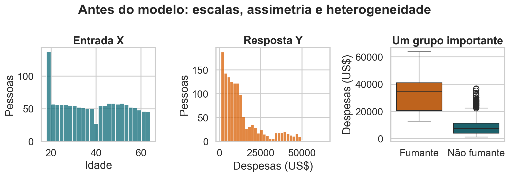{.wide-chart fig-alt="Distribuições de idade e despesas e boxplot das despesas por tabagismo."}

Uma reta global terá de resumir uma resposta assimétrica e dois grupos em patamares diferentes.

<details class="code-fold"><summary>Código do gráfico</summary>

```python
sns.histplot(df, x="age")
sns.histplot(df, x="charges")
sns.boxplot(df, x="fumante", y="charges")
```
</details>

## A nuvem sugere tendência, mas também heterogeneidade

{fig-alt="Dispersão de idade e despesas colorida por tabagismo."}

A idade está positivamente associada às despesas, mas fumantes e não fumantes formam regimes distintos. Começaremos deliberadamente com um modelo simples.

## Uma primeira ideia: médias locais

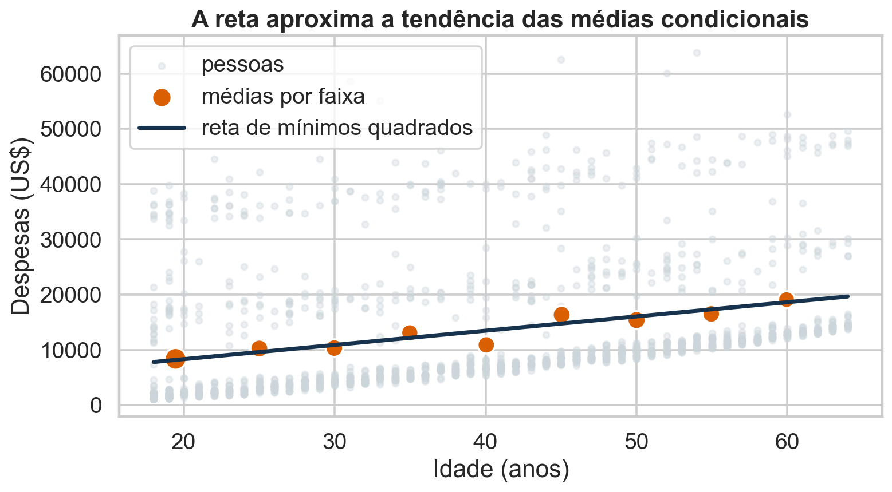{fig-alt="Médias das despesas em faixas de idade e reta de mínimos quadrados."}

As médias em pequenas faixas aproximam $E[Y\mid X=x]$. A reta impõe uma estrutura suave e parcimoniosa para essa tendência.

<details class="code-fold"><summary>Código do gráfico</summary>

```python
bins = pd.cut(df.age, bins=np.arange(17.5, 65.5, 5))
local = df.groupby(bins).agg(x=("age", "mean"), y=("charges", "mean"))
plt.scatter(local.x, local.y)
```
</details>

## O alvo estatístico é a média condicional

Para cada valor $x$, a quantidade

$$
m(x)=E[Y\mid X=x]
$$

é a média da distribuição de $Y$ entre unidades com $X=x$.

A regressão linear simples supõe que essa função pode ser aproximada por uma reta:

$$
m(x)=\beta_0+\beta_1x.
$$

## O modelo estatístico

Para a observação $i$:

$$
Y_i=\beta_0+\beta_1x_i+\varepsilon_i,
\qquad E[\varepsilon_i\mid X_i=x_i]=0.
$$

Equivalentemente:

$$
E[Y_i\mid X_i=x_i]=\beta_0+\beta_1x_i.
$$

O modelo é sobre a **média da resposta**, não sobre uma igualdade exata para cada pessoa.

## O que significa cada termo?

| símbolo | significado |
|---|---|
| $Y_i$ | resposta aleatória da observação $i$ |
| $x_i$ | valor observado do preditor |
| $\beta_0$ | intercepto populacional |
| $\beta_1$ | inclinação populacional |
| $\varepsilon_i$ | desvio aleatório em torno da média condicional |
| $E[\varepsilon_i\mid X_i=x_i]=0$ | o modelo não erra sistematicamente em cada valor de $X$ |

Os parâmetros $\beta_0$ e $\beta_1$ são desconhecidos.

## Erro não é sinônimo de engano

$\varepsilon_i$ representa tudo que faz $Y_i$ diferir da média condicional:

- variáveis não incluídas;
- heterogeneidade individual;
- ruído de mensuração;
- aleatoriedade do processo.

Ele não significa necessariamente que os dados foram medidos incorretamente.

Depois do ajuste, observamos **resíduos** $e_i$, não os erros populacionais $\varepsilon_i$.

## Uma reta produz valores ajustados

Para candidatos $b_0$ e $b_1$:

$$
\widehat y_i=b_0+b_1x_i.
$$

- $b_0$ e $b_1$ são estimativas calculadas na amostra;
- $\widehat y_i$ é o valor ajustado;
- a reta fornece uma previsão média para cada $x_i$;
- pessoas com a mesma idade recebem a mesma previsão neste modelo simples.

## O resíduo é uma distância vertical

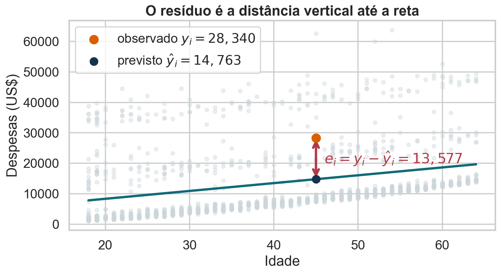{fig-alt="Ponto observado, valor previsto na reta e resíduo vertical."}

$$
e_i=y_i-\widehat y_i=y_i-b_0-b_1x_i.
$$

<details class="code-fold"><summary>Código do gráfico</summary>

```python
y_hat_i = b0+b1*x_i
e_i = y_i-y_hat_i
plt.plot([x_i, x_i], [y_hat_i, y_i])
```
</details>

## A perda reúne todos os resíduos

A soma dos erros ao quadrado é

$$
\operatorname{SSE}(b_0,b_1)
=\sum_{i=1}^{n}(y_i-b_0-b_1x_i)^2.
$$

O erro quadrático médio é

$$
\operatorname{MSE}(b_0,b_1)=\frac1n\operatorname{SSE}(b_0,b_1).
$$

Ambos têm o mesmo minimizador; dividir por $n$ apenas muda a escala da perda.

## Por que elevar ao quadrado?

- evita cancelamento entre resíduos positivos e negativos;
- penaliza mais intensamente erros grandes;
- produz uma função diferenciável e convexa;
- conecta regressão à média, que minimiza perda quadrática;
- possui solução algébrica no modelo linear.

O quadrado também aumenta a influência de valores extremos: não é uma escolha neutra.

## Retas diferentes produzem perdas diferentes

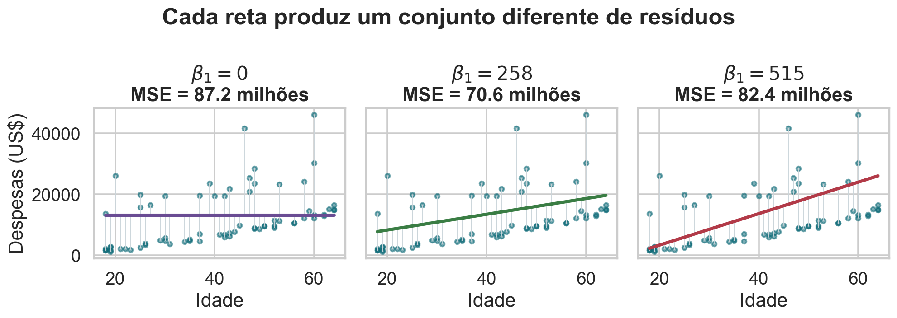{.wide-chart fig-alt="Três retas candidatas com resíduos verticais e erros médios distintos."}

<details class="code-fold"><summary>Código do gráfico</summary>

```python
for slope in [0, b1, 2*b1]:
    intercept = y.mean()-slope*x.mean()
    mse = np.mean((y-intercept-slope*x)**2)
```
</details>

## Qual reta escolher? {.quiz-question .quiz-visual}

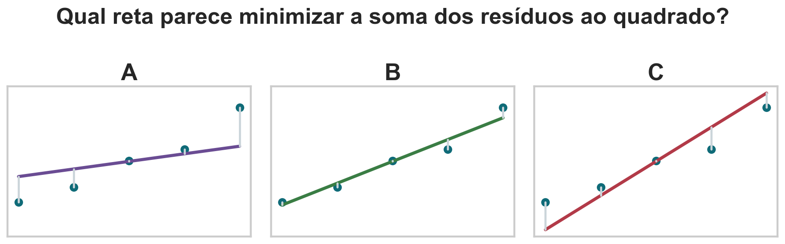{.quiz-figure-wide fig-alt="Três retas candidatas A, B e C com resíduos verticais."}

Qual reta parece minimizar a soma dos resíduos ao quadrado?

- [Reta B]{.correct data-explanation="Ela acompanha o centro dos pontos e equilibra resíduos positivos e negativos com menores distâncias."}
- [Reta A]{data-explanation="A inclinação é pequena e cria resíduos sistemáticos nos dois extremos."}
- [Reta C]{data-explanation="A inclinação é excessiva e também aumenta os resíduos nos extremos."}
- [As três têm necessariamente a mesma perda]{data-explanation="A perda muda com intercepto e inclinação; mínimos quadrados seleciona o menor valor."}

## O problema de mínimos quadrados

Definimos as estimativas por

$$
(\widehat\beta_0,\widehat\beta_1)
=\arg\min_{b_0,b_1}
\sum_{i=1}^{n}(y_i-b_0-b_1x_i)^2.
$$

- `arg min` devolve os valores dos argumentos que minimizam a função;
- $b_0,b_1$ são candidatos;
- $\widehat\beta_0,\widehat\beta_1$ são os candidatos vencedores.

Resolveremos o problema diretamente por cálculo.

## Derive primeiro em relação ao intercepto

$$
\frac{\partial\operatorname{SSE}}{\partial b_0}
=\sum_{i=1}^n 2(y_i-b_0-b_1x_i)(-1).
$$

Igualando a zero:

$$
\sum_i(y_i-b_0-b_1x_i)=0.
$$

Portanto, no mínimo, a soma dos resíduos é zero.

## A primeira condição determina o intercepto

Desenvolvendo a igualdade:

$$
\sum_i y_i-nb_0-b_1\sum_i x_i=0.
$$

Dividindo por $n$:

$$
\bar y-b_0-b_1\bar x=0
\quad\Longrightarrow\quad
b_0=\bar y-b_1\bar x.
$$

Toda reta candidata após otimizar o intercepto passa por $(\bar x,\bar y)$.

## Centralizar reduz o problema a uma inclinação

Substitua $b_0=\bar y-b_1\bar x$ no resíduo:

$$
y_i-b_0-b_1x_i
=(y_i-\bar y)-b_1(x_i-\bar x).
$$

Definindo $x_i^c=x_i-\bar x$ e $y_i^c=y_i-\bar y$:

$$
\operatorname{SSE}(b_1)=\sum_i(y_i^c-b_1x_i^c)^2.
$$

Centralizar não altera a inclinação; apenas incorpora o intercepto.

## Agora derive em relação à inclinação

$$
\frac{d\operatorname{SSE}}{db_1}
=-2\sum_i x_i^c(y_i^c-b_1x_i^c).
$$

Igualando a zero:

$$
\sum_i x_i^cy_i^c
=b_1\sum_i(x_i^c)^2.
$$

A segunda derivada é $2\sum_i(x_i^c)^2>0$ quando há variação em $X$, confirmando o mínimo único.

## A solução convencional

$$
\widehat\beta_1
=\frac{\sum_i(x_i-\bar x)(y_i-\bar y)}
{\sum_i(x_i-\bar x)^2},
\qquad
\widehat\beta_0=\bar y-\widehat\beta_1\bar x.
$$

A solução exige $\sum_i(x_i-\bar x)^2>0$: se todos os $x_i$ forem iguais, não há inclinação identificável.

## Inclinação é covariância dividida pela variância

Divida numerador e denominador por $n-1$:

$$
\widehat\beta_1
=\frac{s_{XY}}{s_X^2}
=\frac{\operatorname{Cov}(X,Y)}{\operatorname{Var}(X)}.
$$

- $s_{XY}$ mede variação conjunta;
- $s_X^2$ mede quanta variação em $X$ está disponível;
- a unidade de $\widehat\beta_1$ é `[unidade de Y]/[unidade de X]`.

## A ligação com a correlação

Como

$$
r=\frac{s_{XY}}{s_Xs_Y},
$$

temos

$$
\widehat\beta_1=r\frac{s_Y}{s_X}.
$$

Correlação fornece sinal e força padronizada; a razão $s_Y/s_X$ devolve as unidades necessárias à inclinação.

## Nos dados padronizados, inclinação é correlação

Se

$$
Z_X=\frac{X-\bar X}{s_X},
\qquad
Z_Y=\frac{Y-\bar Y}{s_Y},
$$

então ambos têm média zero e desvio-padrão um. A regressão de $Z_Y$ em $Z_X$ possui:

$$
\widehat\beta_0=0,
\qquad
\widehat\beta_1=r.
$$

Isso vale para regressão linear simples com intercepto.

## O ajuste na base de seguros

Para despesas em função da idade:

$$
\widehat{\text{despesa}}
=3165{,}89+257{,}72\times\text{idade}.
$$

| quantidade | valor |
|---|---:|
| intercepto | US$ 3.165,89 |
| inclinação | US$ 257,72 por ano |
| $R^2$ | 0,089 |
| RMSE | US$ 11.551,67 |

## Interprete os coeficientes no domínio

### Intercepto: $\widehat\beta_0=3165{,}89$

É a previsão quando idade $=0$, fora da faixa observada de 18 a 64 anos. Ele
posiciona a reta, mas não possui interpretação substantiva confiável aqui.

### Inclinação: $\widehat\beta_1=257{,}72$ US$/ano

Dentro do modelo, acrescentar um ano à idade está associado a um aumento médio
previsto de aproximadamente US$ 258 nas despesas.

Não é um efeito causal: tabagismo e outras variáveis não foram controlados.

## A reta passa pelo centro dos dados

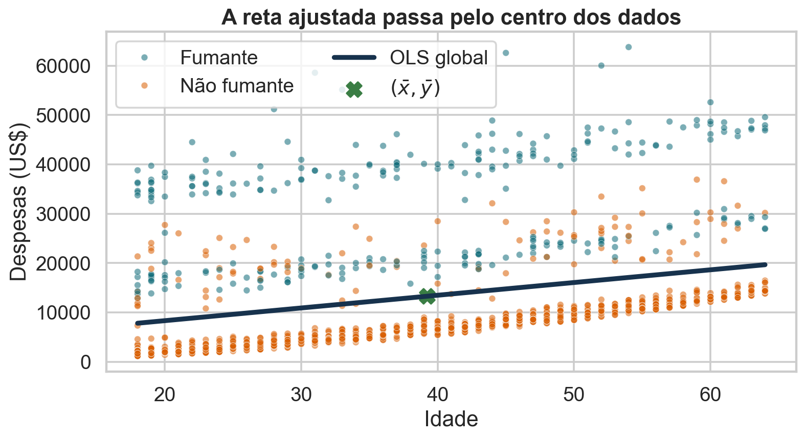{fig-alt="Reta global de mínimos quadrados, centro dos dados e pontos por tabagismo."}

<details class="code-fold"><summary>Código do gráfico</summary>

```python
b1 = np.sum((x-x.mean())*(y-y.mean())) / np.sum((x-x.mean())**2)
b0 = y.mean()-b1*x.mean()
yhat = b0+b1*x
```
</details>

## Ajuste médio não é previsão individual exata

Para uma pessoa de 40 anos:

$$
\widehat y=3165{,}89+257{,}72\times40
\approx 13\,475.
$$

O resultado está em dólares (US$). Essa é uma estimativa da **despesa média condicional segundo o modelo**. Uma pessoa específica pode ficar muito distante desse valor.

O resíduo observado será $e_i=y_i-13.475$.

## Há duas incertezas diferentes

- **Incerteza da média:** quão precisamente estimamos $E[Y\mid X=x]$?
- **Incerteza individual:** quão variável pode ser uma nova observação $Y$ em torno dessa média?

Intervalos de previsão individuais são mais largos que intervalos para a média, pois incluem a dispersão de $\varepsilon$.

Nesta aula, o bootstrap quantificará a incerteza dos coeficientes; a formulação paramétrica virá com a visão probabilística.

## $R^2$ compara com o modelo da média

O modelo-base ignora $X$ e prevê $\bar y$ para todos:

$$
\operatorname{SST}=\sum_i(y_i-\bar y)^2.
$$

O modelo ajustado deixa resíduos:

$$
\operatorname{SSE}=\sum_i(y_i-\widehat y_i)^2.
$$

$R^2$ compara quanto erro quadrático restou após usar a reta.

## Definição do coeficiente de determinação

$$
R^2=1-\frac{\operatorname{SSE}}{\operatorname{SST}}.
$$

- $R^2=1$: ajuste perfeito na amostra;
- $R^2=0$: não melhora a previsão constante $\bar y$;
- com intercepto e ajuste OLS nos mesmos dados, $0\leq R^2\leq1$;
- fora desse contexto — teste, modelo sem intercepto ou previsões fixas — $R^2$ pode ser negativo.

## A decomposição é visual

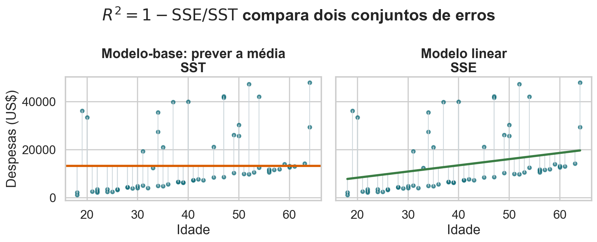{.wide-chart fig-alt="Erros em torno da média comparados a resíduos em torno da reta."}

Na regressão OLS com intercepto:

$$
\operatorname{SST}=\operatorname{SSR}+\operatorname{SSE},
$$

em que SSR é a soma de quadrados explicada pela regressão.

<details class="code-fold"><summary>Código do gráfico</summary>

```python
sst = np.sum((y-y.mean())**2)
sse = np.sum((y-yhat)**2)
r2 = 1-sse/sst
```
</details>

## Em regressão simples, $R^2=r^2$

Com um preditor e intercepto:

$$
R^2=r_{XY}^2.
$$

Na base:

$$
r_{\text{idade,despesa}}=0{,}299
\quad\Longrightarrow\quad
R^2=0{,}299^2\approx0{,}089.
$$

A idade captura cerca de 8,9% da variabilidade amostral das despesas sob o critério quadrático.

## $R^2$ não mede tudo que importa

Um $R^2$ alto não garante:

- causalidade;
- ausência de viés;
- boa previsão fora da amostra;
- resíduos bem comportados;
- relevância prática;
- forma funcional correta.

Um $R^2$ baixo pode coexistir com uma associação real e cientificamente relevante.

## Diagnósticos verificam o que a reta deixou para trás

Depois do ajuste, procure nos resíduos:

- curvatura: média condicional não linear;
- funil: variância não constante;
- grupos: variável omitida ou interação;
- dependência temporal/espacial;
- pontos influentes;
- caudas muito diferentes da distribuição assumida.

Resíduos deveriam parecer estrutura sem padrão sistemático.

## Aqui os resíduos ainda têm estrutura

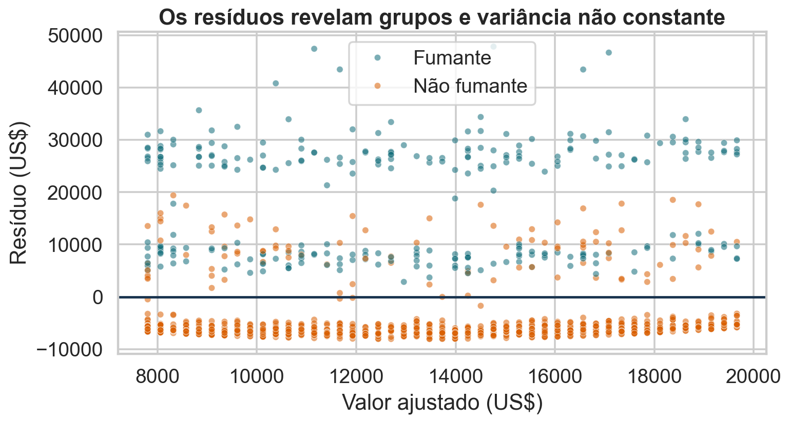{.wide-chart fig-alt="Resíduos contra valores ajustados coloridos por tabagismo."}

O tabagismo separa os resíduos em patamares. A variabilidade também cresce em partes da faixa ajustada.

<details class="code-fold"><summary>Código do gráfico</summary>

```python
resid = y-yhat
sns.scatterplot(x=yhat, y=resid, hue=df.fumante)
plt.axhline(0)
```
</details>

## Normalidade e homoscedasticidade não são fatos automáticos

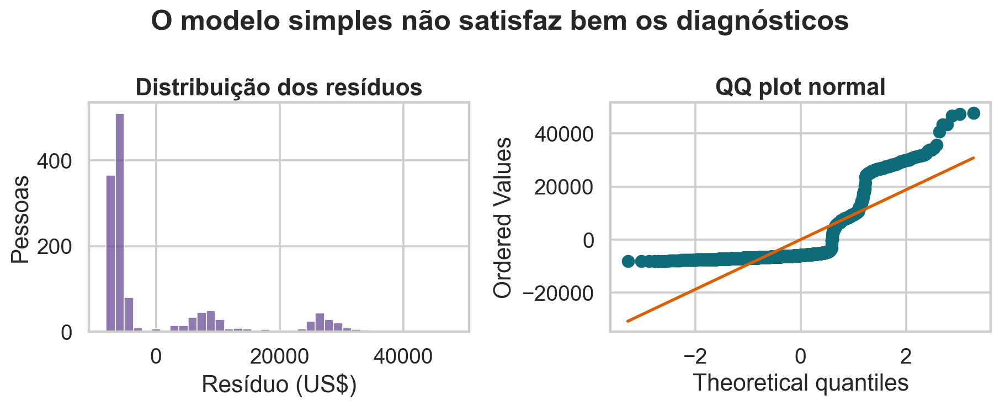{.wide-chart fig-alt="Histograma e QQ plot dos resíduos."}

Os resíduos são assimétricos e desviam da reta normal. Isso alerta contra inferência paramétrica ingênua no modelo simples.

<details class="code-fold"><summary>Código do gráfico</summary>

```python
sns.histplot(resid)
scipy.stats.probplot(resid, dist="norm", plot=ax)
```
</details>

## Condições para a leitura estatística

Para interpretar a reta como modelo da média e fazer inferência convencional, examinamos:

1. **linearidade:** $E[Y\mid X=x]=\beta_0+\beta_1x$;
2. **média condicional zero:** $E[\varepsilon\mid X]=0$;
3. **independência** entre unidades, conforme o desenho;
4. **variância constante** para fórmulas clássicas simples de erro-padrão;
5. **normalidade condicional** quando usamos resultados exatos em amostras pequenas.

Normalidade não é necessária para calcular OLS.

## Bootstrap de pares para a inclinação

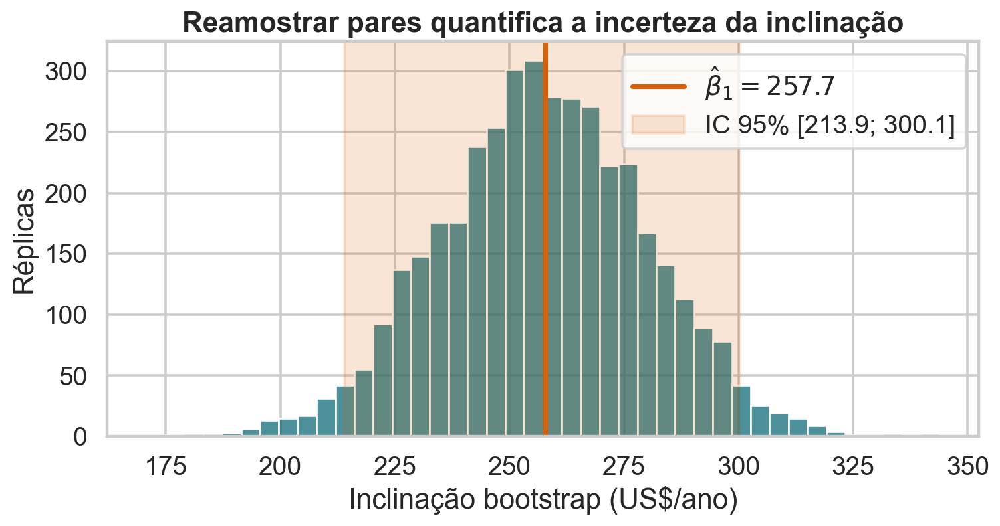{fig-alt="Distribuição bootstrap da inclinação com intervalo de 95%."}

Reamostramos linhas completas $(x_i,y_i)$ e reajustamos a reta. O IC percentil de 95% é aproximadamente US$ 214 a US$ 300 por ano.

<details class="code-fold"><summary>Código do gráfico</summary>

```python
for _ in range(4000):
    sample = df.sample(len(df), replace=True)
    slopes.append(ols(sample.age, sample.charges)[1])
```
</details>

## Permutação representa ausência de associação

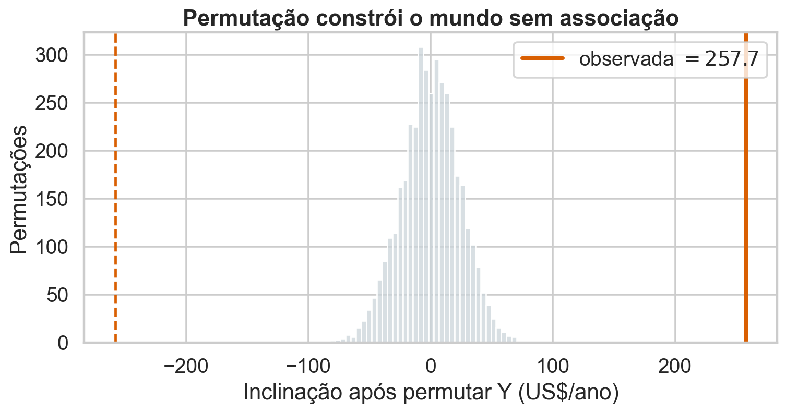{fig-alt="Distribuição nula de inclinações após permutar a resposta."}

Permutar $Y$ mantém idades e despesas, mas quebra seus pares. A inclinação observada fica muito distante da distribuição nula.

<details class="code-fold"><summary>Código do gráfico</summary>

```python
for _ in range(4000):
    y_perm = rng.permutation(y)
    null_slopes.append(ols(x, y_perm)[1])
```
</details>

## O que esta inferência permite dizer?

Os dados fornecem evidência de associação linear entre idade e despesas, e o bootstrap mostra que a inclinação é estimada com alguma precisão.

Mas:

- a amostra pode não representar toda a população-alvo;
- o modelo omite tabagismo e outras variáveis;
- os resíduos violam condições simples;
- associação estatística não identifica efeito causal.

A máxima verossimilhança dará uma interpretação probabilística aos mesmos coeficientes em uma aula posterior.

## Qual afirmação está correta? {.quiz-question}

Considere regressão linear simples ajustada por OLS com intercepto.

- [A reta passa por $(\bar x,\bar y)$ e os resíduos somam zero]{.correct data-explanation="Essas são consequências da condição de primeira ordem para o intercepto."}
- [$R^2$ mede a probabilidade de o modelo estar correto]{data-explanation="$R^2$ compara somas de quadrados; não é uma probabilidade do modelo."}
- [Normalidade é necessária para calcular $\widehat\beta_0$ e $\widehat\beta_1$]{data-explanation="OLS pode ser calculado sem normalidade; a condição aparece em formas específicas de inferência."}
- [A inclinação é causal sempre que seu valor-p é pequeno]{data-explanation="Significância estatística não substitui identificação causal."}

## Bibliografia da aula

- James et al., [*An Introduction to Statistical Learning*](https://www.statlearning.com/), capítulo 3.
- Çetinkaya-Rundel e Hardin, *Introduction to Modern Statistics*, regressão linear simples.
- Freedman, Pisani e Purves, *Statistics*, regressão, resíduos e interpretação observacional.
- Montgomery, Peck e Vining, *Introduction to Linear Regression Analysis*, capítulos 1 e 2.
- [Computational and Inferential Thinking, capítulo 15](https://inferentialthinking.com/chapters/15/Prediction.html).

## Síntese e próxima aula

- regressão linear modela a média condicional;
- OLS minimiza a soma dos resíduos ao quadrado;
- $\widehat\beta_1=s_{XY}/s_X^2=r(s_Y/s_X)$;
- a reta passa por $(\bar x,\bar y)$;
- $R^2$ compara a reta com prever apenas $\bar y$;
- resíduos revelam limitações do modelo.

::: {.statement}
Hoje resolvemos OLS por cálculo. Nas próximas aulas, veremos como uma distribuição probabilística leva à mesma solução por máxima verossimilhança e como algoritmos iterativos a encontram por gradiente descendente.
:::
