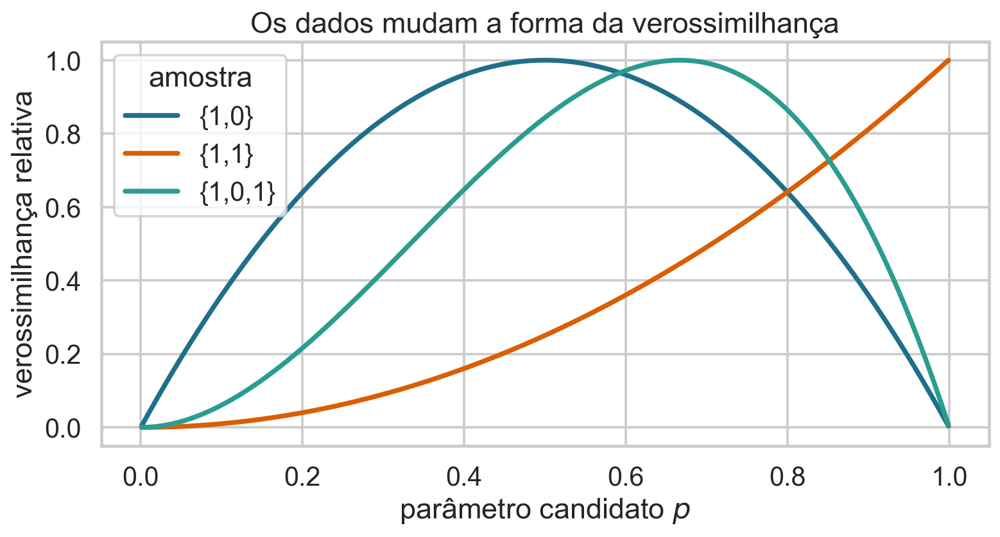
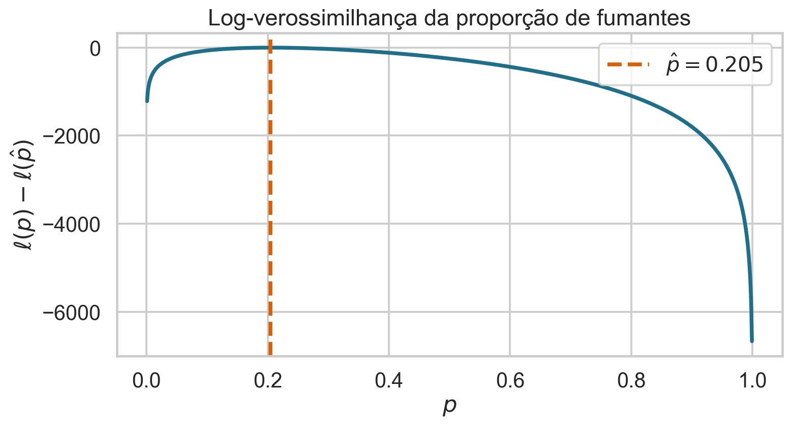
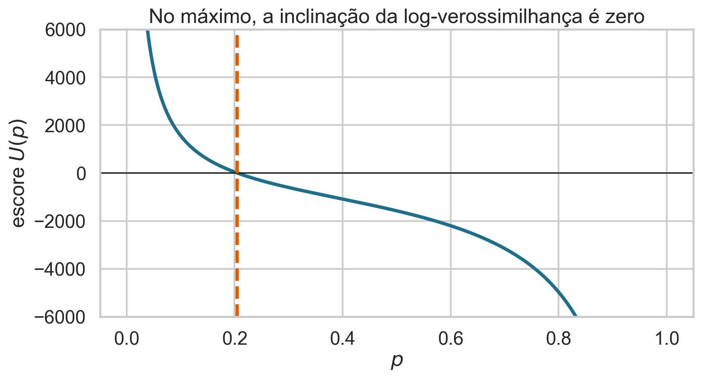
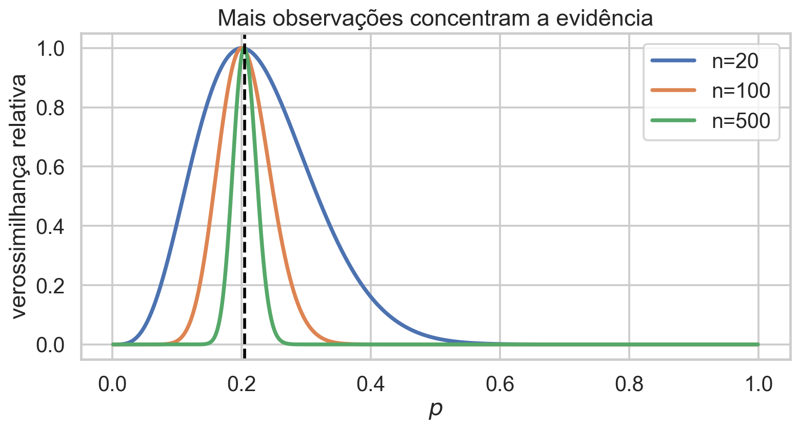
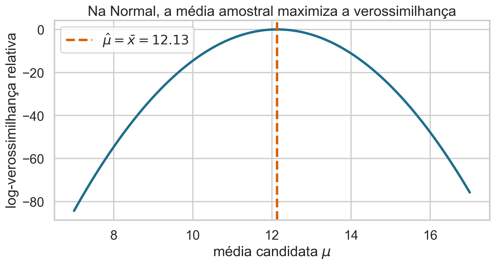

## Como os dados escolhem um parâmetro?

Sabemos que a média estima parâmetros de Bernoulli e Normal.

Mas por que essas fórmulas aparecem?

> A verossimilhança transforma um modelo probabilístico em um critério de estimação.

## Hoje

- distinguir probabilidade e verossimilhança;
- construir a verossimilhança de observações independentes;
- usar log-verossimilhança e função escore;
- derivar o estimador Bernoulli;
- interpretar curvatura e quantidade de informação;
- preparar a aplicação à regressão linear.

## Base de dados de apoio

Usaremos **Medical Insurance Cost**, disponível no Kaggle sob licença CC0.

- 1.338 pessoas seguradas;
- `smoker`: variável binária para construir o exemplo Bernoulli;
- 274 fumantes e 1.064 não fumantes;
- demais colunas serão retomadas na regressão.

## A pergunta estatística

Se $X_i=1$ indica uma pessoa fumante e $X_i=0$ uma não fumante, queremos estimar

$$p=P(X_i=1).$$

O parâmetro $p$ pertence ao modelo; os valores $x_1,\ldots,x_n$ pertencem aos dados.

## Um modelo é uma família de distribuições

$$X_i\sim\operatorname{Bernoulli}(p),\qquad 0\le p\le1.$$

Cada valor de $p$ define uma distribuição diferente.

O modelo estatístico é a coleção

$$\mathcal P=\{\operatorname{Bernoulli}(p):p\in[0,1]\}.$$

## O que a hipótese Bernoulli afirma?

- há somente dois resultados possíveis;
- $P(X_i=1)=p$ e $P(X_i=0)=1-p$;
- o mesmo $p$ descreve todas as unidades;
- a dependência entre unidades ainda precisa ser especificada.

Um modelo é um conjunto explícito de hipóteses, não apenas uma fórmula.

## Uma fórmula reúne os dois resultados

Para $x_i\in\{0,1\}$,

$$f(x_i;p)=p^{x_i}(1-p)^{1-x_i}.$$

- se $x_i=1$, então $f(1;p)=p$;
- se $x_i=0$, então $f(0;p)=1-p$.

## Probabilidade: parâmetro fixo, dado variável

Se $p=0{,}20$ é conhecido,

$$f(x;0{,}20)$$

descreve probabilidades para resultados possíveis $x$.

Aqui, perguntamos: “o que pode acontecer sob este modelo?”

## Verossimilhança: dado fixo, parâmetro variável

Depois de observar $x$,

$$L(p;x)=f(x;p)$$

é lida como função de $p$.

Agora perguntamos: “quais valores de $p$ tornam este dado mais compatível com o modelo?”

## A fórmula é igual; a leitura muda

| função | fixamos | variamos | integra/soma para 1? |
|---|---|---|---|
| probabilidade $f(x;p)$ | $p$ | $x$ | sim, sobre $x$ |
| verossimilhança $L(p;x)$ | $x$ | $p$ | não necessariamente |

Verossimilhança não é uma distribuição de probabilidade para o parâmetro.

## Comece com dois dados

Considere $x=(1,0)$ e independência condicional a $p$:

$$L(p;x)=P(X_1=1,X_2=0\mid p).$$

Independência permite fatorar a probabilidade conjunta.

## Independência transforma a conjunta em produto

$$
L(p;x)=P(X_1=1\mid p)P(X_2=0\mid p)=p(1-p).
$$

O produto reúne a compatibilidade de todas as observações com o mesmo parâmetro.

## Visualize os parâmetros candidatos

{.wide-chart fig-alt="Curvas de verossimilhança relativa para três pequenas amostras Bernoulli."}

O máximo muda quando os dados mudam.

<details class="code-fold"><summary>Código do gráfico</summary>

```python
L = p**sum(x) * (1-p)**(len(x)-sum(x))
```
</details>

## Um máximo não é uma probabilidade posterior

Para $x=(1,0)$, $p=0{,}5$ maximiza $p(1-p)$.

Isso não significa

$$P(p=0{,}5\mid x)=1.$$

Sem uma distribuição a priori e a regra de Bayes, não atribuímos probabilidades aos parâmetros.

## Quiz: qual amostra favorece $p$ maior? {.quiz-question}

- [$x=(1,1,1,0)$]{.correct data-explanation="Três sucessos em quatro observações produzem máximo em 3/4."}
- [$x=(1,0,0,0)$]{data-explanation="Seu máximo ocorre em 1/4."}
- [As duas favorecem o mesmo valor]{data-explanation="A proporção de sucessos observada é diferente."}

## Para $n$ observações independentes

Se $X_1,\ldots,X_n\overset{iid}{\sim}\operatorname{Bernoulli}(p)$,

$$
L(p;x_1,\ldots,x_n)=\prod_{i=1}^np^{x_i}(1-p)^{1-x_i}.
$$

`iid` significa independentes e identicamente distribuídas.

## Os dados entram por uma estatística

Agrupando os expoentes:

$$L(p)=p^{\sum_i x_i}(1-p)^{n-\sum_i x_i}.$$

Se $S=\sum_i x_i$, então

$$L(p)=p^S(1-p)^{n-S}.$$

Para estimar $p$, basta conhecer o número de sucessos $S$.

## Na base de seguros

Temos $n=1338$ e $S=274$ fumantes.

$$L(p)=p^{274}(1-p)^{1064}.$$

Produtos de muitos números menores que 1 tornam-se numericamente minúsculos.

## O log preserva o ponto de máximo

Como $\log$ é estritamente crescente,

$$\arg\max_p L(p)=\arg\max_p\log L(p).$$

Definimos a log-verossimilhança

$$\ell(p)=\log L(p).$$

## Produtos viram somas

$$
\ell(p)=S\log p+(n-S)\log(1-p).
$$

- o log evita underflow numérico;
- somas são mais simples de derivar;
- o máximo permanece no mesmo lugar.

## A evidência da base tem um máximo claro

{.wide-chart fig-alt="Log-verossimilhança relativa do parâmetro Bernoulli na base de seguros."}

O eixo vertical é relativo: subtrair o máximo não muda o estimador.

<details class="code-fold"><summary>Código do gráfico</summary>

```python
ell = S*np.log(p)+(n-S)*np.log(1-p)
```
</details>

## A função escore mede a inclinação

Definimos

$$U(p)=\frac{d\ell(p)}{dp}.$$

Para Bernoulli,

$$U(p)=\frac{S}{p}-\frac{n-S}{1-p}.$$

No máximo interior, procuramos $U(p)=0$.

## Derive cada termo

$$
\frac{d}{dp}[S\log p]=\frac{S}{p},
$$

$$
\frac{d}{dp}[(n-S)\log(1-p)]
=-\frac{n-S}{1-p}.
$$

O sinal negativo vem da regra da cadeia.

## Resolva a equação do escore

$$
\frac{S}{p}-\frac{n-S}{1-p}=0
$$

$$S(1-p)=p(n-S)$$

$$S-Sp=np-pS\quad\Longrightarrow\quad S=np.$$

## O estimador é a média amostral

$$
\widehat p=\frac{S}{n}=\frac1n\sum_{i=1}^nx_i=\bar x.
$$

Na base:

$$\widehat p=274/1338\approx0{,}205.$$

A conexão entre Bernoulli e média surgiu de um critério geral.

## Encontramos máximo ou mínimo?

A segunda derivada é

$$
\ell''(p)=-\frac{S}{p^2}-\frac{n-S}{(1-p)^2}<0
$$

para $0<p<1$ e amostras com sucessos e fracassos.

Logo, a log-verossimilhança é estritamente côncava e o ponto crítico é máximo.

## O escore troca de sinal no estimador

{.wide-chart fig-alt="Função escore Bernoulli cruzando zero no estimador."}

À esquerda de $\widehat p$, aumentar $p$ melhora o ajuste; à direita, piora.

<details class="code-fold"><summary>Código do gráfico</summary>

```python
score = S/p-(n-S)/(1-p)
plt.plot(p, score)
```
</details>

## Mais dados tornam o pico estreito

{.wide-chart fig-alt="Verossimilhanças relativas para três tamanhos amostrais."}

Com a mesma proporção observada, a localização permanece; a incerteza diminui.

<details class="code-fold"><summary>Código do gráfico</summary>

```python
for n in [20, 100, 500]:
    L = p**round(n*p_hat) * (1-p)**(n-round(n*p_hat))
    plt.plot(p, L/L.max())
```
</details>

## Curvatura representa informação local

Perto de $\widehat p$, uma log-verossimilhança mais curva penaliza rapidamente parâmetros vizinhos.

Uma medida observada é

$$J(\widehat p)=-\ell''(\widehat p).$$

Maior informação implica menor erro-padrão aproximado.

## Estimação não valida automaticamente o modelo

O MLE encontra o melhor parâmetro **dentro da família escolhida**.

Ele não demonstra que:

- as observações são independentes;
- todas compartilham o mesmo $p$;
- a amostra representa a população;
- Bernoulli é a descrição substantiva adequada.

## O princípio geral

Para um modelo $f(x;\theta)$ e dados independentes,

$$L(\theta;x)=\prod_{i=1}^nf(x_i;\theta),$$

$$\ell(\theta;x)=\sum_{i=1}^n\log f(x_i;\theta),$$

$$\widehat\theta_{MV}=\arg\max_{\theta\in\Theta}\ell(\theta;x).$$

## O que significa cada termo?

| símbolo | significado |
|---|---|
| $x=(x_1,\ldots,x_n)$ | amostra observada |
| $\theta$ | parâmetro ou vetor de parâmetros |
| $\Theta$ | espaço de valores permitidos |
| $f(x_i;\theta)$ | massa ou densidade do modelo |
| $L(\theta;x)$ | verossimilhança |
| $\ell(\theta;x)$ | log-verossimilhança |

## Densidade não é probabilidade pontual

Para variáveis contínuas,

$$P(X=x)=0,$$

mas a densidade $f(x;\theta)$ pode ser positiva.

Comparamos densidades dos dados observados sob parâmetros candidatos; probabilidades pertencem a intervalos.

## Outro exemplo: média de uma Normal

Se

$$X_i\overset{iid}{\sim}N(\mu,\sigma^2)$$

e $\sigma^2$ é conhecido, maximizar a verossimilhança em $\mu$ equivale a minimizar

$$\sum_i(x_i-\mu)^2.$$

## A média reaparece

{.wide-chart fig-alt="Log-verossimilhança normal em função da média candidata."}

O máximo ocorre em $\widehat\mu=\bar x$.

Essa é a ponte para a regressão: substituiremos a média constante por uma média que depende de $x$.

<details class="code-fold"><summary>Código do gráfico</summary>

```python
ell_mu = -np.sum((x[:, None]-mu[None, :])**2, axis=0)/(2*sigma**2)
plt.plot(mu, ell_mu-ell_mu.max())
```
</details>

## Quiz: por que usar log? {.quiz-question}

- [Porque preserva o máximo e transforma produtos em somas]{.correct data-explanation="A monotonicidade preserva o argmax e as propriedades do log simplificam a álgebra."}
- [Porque transforma qualquer máximo em probabilidade]{data-explanation="Log-verossimilhança também não é distribuição para o parâmetro."}
- [Porque elimina a necessidade de independência]{data-explanation="A fatoração ainda depende da estrutura probabilística assumida."}

## Quando a solução não é fechada

Nem toda equação de escore pode ser resolvida algebricamente.

Então usamos otimização numérica para encontrar

$$\arg\max_\theta\ell(\theta).$$

Gradiente descendente — ou ascendente — será estudado em uma aula posterior.

## Um roteiro de máxima verossimilhança

1. defina a unidade observacional;
2. escolha e justifique o modelo probabilístico;
3. escreva a densidade/massa de uma observação;
4. construa a conjunta com a dependência correta;
5. tome o log;
6. maximize e verifique o máximo;
7. diagnostique o modelo e quantifique incerteza.

## Bibliografia da aula

- Wasserman, *All of Statistics*, capítulos 9 e 10.
- Casella e Berger, *Statistical Inference*, capítulo 7.
- Blitzstein e Hwang, *Introduction to Probability*, exemplos Bernoulli e Binomial.
- James et al., *An Introduction to Statistical Learning*, seção sobre máxima verossimilhança.

## Síntese

- verossimilhança compara parâmetros com os dados fixos;
- independência produz um produto de contribuições;
- o log transforma produtos em somas;
- o escore zero fornece candidatos a máximo;
- para Bernoulli, $\widehat p=\bar x$;
- o MLE depende das hipóteses do modelo.

## Próxima aula

::: {.statement}
Na regressão, a média deixa de ser constante: $E[Y\mid X=x]=\beta_0+\beta_1x$. Sob erros normais, a máxima verossimilhança escolherá exatamente a reta de mínimos quadrados.
:::
