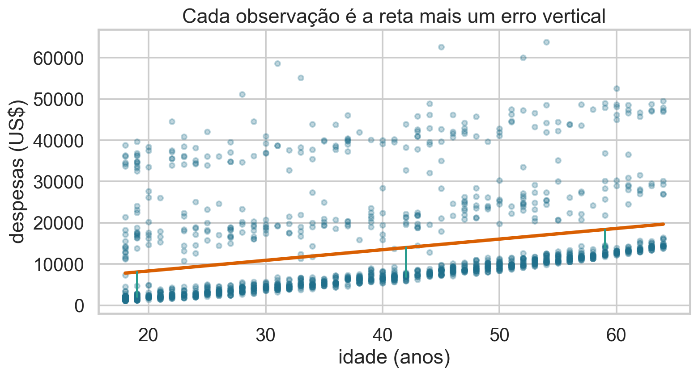
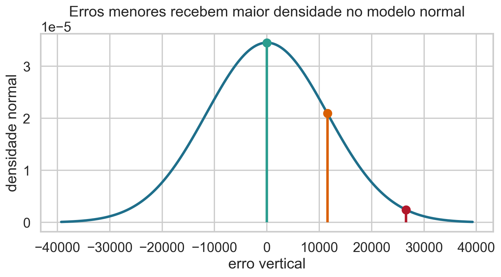
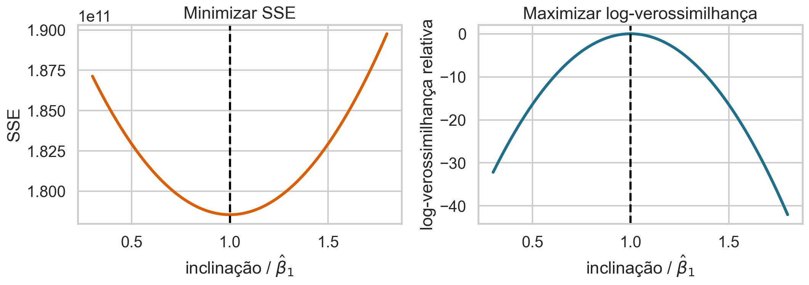
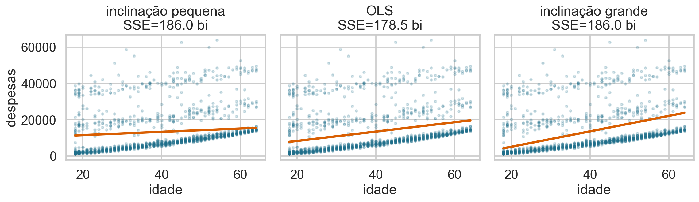
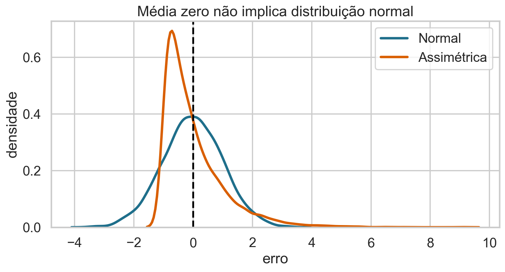
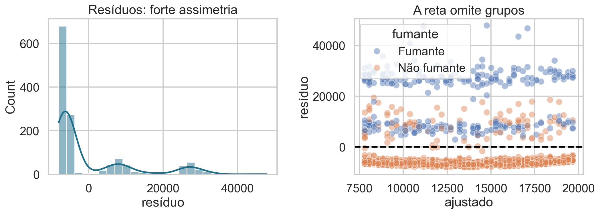

## Duas rotas, a mesma reta

Na Aula 17, minimizamos resíduos ao quadrado.

Na Aula 18, maximizamos a compatibilidade probabilística.

> Sob erros normais independentes e com variância constante, os dois critérios escolhem os mesmos coeficientes.

## Hoje

- formular a regressão como modelo probabilístico;
- interpretar a distribuição de $Y\mid X=x$;
- construir a verossimilhança gaussiana;
- provar a equivalência entre MLE e OLS;
- estimar a variância dos erros;
- esclarecer o papel — e o limite — da normalidade;
- diagnosticar o modelo na base de seguros.

## Base de dados de apoio

Continuaremos com **Medical Insurance Cost**:

- resposta $Y$: despesas médicas (`charges`);
- preditor $X$: idade (`age`);
- 1.338 observações;
- tabagismo será usado para diagnosticar estrutura omitida.

Continuidade permite comparar diretamente OLS e máxima verossimilhança.

## O resultado de mínimos quadrados

Na Aula 17, obtivemos

$$
(\widehat\beta_0,\widehat\beta_1)
=\arg\min_{b_0,b_1}\sum_i(y_i-b_0-b_1x_i)^2.
$$

Mas esse critério, sozinho, ainda não especifica uma distribuição para $Y\mid X$.

## A reta descreve a média condicional

$$E[Y_i\mid X_i=x_i]=\beta_0+\beta_1x_i.$$

Escrevemos

$$Y_i=\beta_0+\beta_1x_i+\varepsilon_i.$$

O erro $\varepsilon_i$ representa a variação individual em torno da média.

## Cada ponto é reta mais erro

{.wide-chart fig-alt="Reta ajustada e três erros verticais na base de seguros."}

$$\varepsilon_i=Y_i-(\beta_0+\beta_1x_i).$$

<details class="code-fold"><summary>Código do gráfico</summary>

```python
erro = y-(beta0+beta1*x)
```
</details>

## Média zero é uma condição sobre a reta

Assumimos

$$E[\varepsilon_i\mid X_i=x_i]=0.$$

Então

$$E[Y_i\mid X_i=x_i]=\beta_0+\beta_1x_i.$$

Sem essa condição, a reta pode errar sistematicamente em certas regiões de $X$.

## Média zero não significa erro zero

O modelo não afirma $\varepsilon_i=0$ para cada pessoa.

Afirma que, para um mesmo $x$, erros positivos e negativos se equilibram em média.

Previsão média e previsão individual continuam sendo objetos diferentes.

## Para obter uma verossimilhança, falta uma distribuição

Apenas $E[\varepsilon\mid X]=0$ não determina $f(y_i\mid x_i)$.

Uma escolha clássica é

$$\varepsilon_i\overset{iid}{\sim}N(0,\sigma^2).$$

Agora o modelo possui três parâmetros: $\theta=(\beta_0,\beta_1,\sigma^2)$.

## O modelo condicional equivalente

Se $\varepsilon_i\sim N(0,\sigma^2)$, então

$$
Y_i\mid X_i=x_i
\sim N(\beta_0+\beta_1x_i,\sigma^2).
$$

A média muda com $x_i$; a variância permanece constante.

## O que significa cada termo?

| símbolo | significado |
|---|---|
| $\beta_0+\beta_1x_i$ | média condicional de $Y_i$ |
| $\sigma^2$ | variância condicional comum |
| $\varepsilon_i$ | erro populacional não observado |
| $e_i=y_i-\widehat y_i$ | resíduo calculado após o ajuste |
| `iid` | erros independentes e com a mesma distribuição |

## A Normal atribui maior densidade a erros pequenos

{.wide-chart fig-alt="Densidade normal com três erros de magnitudes diferentes."}

Para $\sigma$ fixo, afastar-se de zero reduz a densidade exponencialmente.

<details class="code-fold"><summary>Código do gráfico</summary>

```python
density = np.exp(-error**2/(2*sigma**2))/(sigma*np.sqrt(2*np.pi))
plt.plot(error, density)
```
</details>

## A densidade de uma observação

$$
f(y_i\mid x_i;\beta_0,\beta_1,\sigma^2)
=\frac{1}{\sqrt{2\pi\sigma^2}}
\exp\left[-\frac{(y_i-\beta_0-\beta_1x_i)^2}{2\sigma^2}\right].
$$

O termo ao quadrado é exatamente o resíduo do candidato $(\beta_0,\beta_1)$.

## Leia a densidade por partes

- $y_i-\beta_0-\beta_1x_i$: erro vertical;
- elevar ao quadrado remove o sinal;
- dividir por $\sigma^2$ mede o erro em relação à dispersão esperada;
- a exponencial penaliza erros grandes;
- o fator frontal normaliza a densidade.

## Quiz: qual ponto é mais verossímil? {.quiz-question}

Sob a mesma reta e o mesmo $\sigma$, qual observação recebe maior densidade?

- [A que possui menor $|y_i-\widehat y_i|$]{.correct data-explanation="A densidade normal diminui com o quadrado da distância à média condicional."}
- [A que possui maior valor de $x_i$]{data-explanation="A posição em x não basta; importa o erro vertical em relação à reta."}
- [A que possui maior $y_i$]{data-explanation="Valores altos podem estar próximos ou distantes da média prevista."}

## Independência reúne as observações

Condicionalmente aos $x_i$,

$$
L(\beta_0,\beta_1,\sigma^2)
=\prod_{i=1}^n f(y_i\mid x_i;\beta_0,\beta_1,\sigma^2).
$$

Sem independência, a densidade conjunta não pode ser substituída automaticamente por esse produto.

## Substitua a densidade normal

$$
L=\prod_{i=1}^n
\frac{1}{\sqrt{2\pi\sigma^2}}
\exp\left[-\frac{(y_i-\beta_0-\beta_1x_i)^2}{2\sigma^2}\right].
$$

Temos um produto de constantes e exponenciais.

## O log transforma a expressão

$$
\ell(\beta_0,\beta_1,\sigma^2)
=-\frac n2\log(2\pi)-\frac n2\log(\sigma^2)
-\frac{1}{2\sigma^2}\sum_{i=1}^n(y_i-\beta_0-\beta_1x_i)^2.
$$

Agora a conexão com mínimos quadrados está visível.

## Separe o que depende dos coeficientes

Para $\sigma^2$ fixo, os dois primeiros termos são constantes em $\beta_0,\beta_1$.

Logo,

$$
\arg\max_{\beta_0,\beta_1}\ell
=\arg\max_{\beta_0,\beta_1}
\left[-\frac{1}{2\sigma^2}\operatorname{SSE}(\beta_0,\beta_1)\right].
$$

## Maximizar o negativo é minimizar a SSE

Como $1/(2\sigma^2)>0$,

$$
\arg\max_{\beta_0,\beta_1}\ell
=\arg\min_{\beta_0,\beta_1}
\sum_i(y_i-\beta_0-\beta_1x_i)^2.
$$

Portanto,

$$\widehat\beta_{MV}=\widehat\beta_{OLS}.$$

## As curvas confirmam a equivalência

{.wide-chart fig-alt="SSE e log-verossimilhança em função da inclinação relativa."}

O mínimo da esquerda e o máximo da direita ocorrem na mesma inclinação.

<details class="code-fold"><summary>Código do gráfico</summary>

```python
loglik = constante-SSE/(2*sigma**2)
```
</details>

## Retas ruins acumulam erros improváveis

{.wide-chart fig-alt="Três retas candidatas com somas de quadrados diferentes."}

Uma reta com erros grandes simultaneamente tem SSE maior e verossimilhança gaussiana menor.

<details class="code-fold"><summary>Código do gráfico</summary>

```python
for slope in candidate_slopes:
    prediction = intercept+slope*x
    sse = np.sum((y-prediction)**2)
```
</details>

## As derivadas são as mesmas de OLS

Para os coeficientes,

$$
\frac{\partial\ell}{\partial\beta_0}
=\frac{1}{\sigma^2}\sum_i(y_i-\beta_0-\beta_1x_i),
$$

$$
\frac{\partial\ell}{\partial\beta_1}
=\frac{1}{\sigma^2}\sum_ix_i(y_i-\beta_0-\beta_1x_i).
$$

## As equações normais reaparecem

Igualando as derivadas a zero:

$$\sum_i e_i=0,$$

$$\sum_i x_ie_i=0.$$

Essas são as mesmas condições de primeira ordem obtidas ao minimizar SSE.

## A solução dos coeficientes

$$
\widehat\beta_1=
\frac{\sum_i(x_i-\bar x)(y_i-\bar y)}
{\sum_i(x_i-\bar x)^2},
$$

$$\widehat\beta_0=\bar y-\widehat\beta_1\bar x.$$

A verossimilhança explica probabilisticamente uma solução já conhecida.

## A variância também é um parâmetro

Derivando $\ell$ em relação a $\sigma^2$ e igualando a zero:

$$
\widehat\sigma^2_{MV}
=\frac1n\sum_i(y_i-\widehat y_i)^2
=\frac{\operatorname{SSE}}{n}.
$$

Esse estimador maximiza a verossimilhança, mas é viesado em amostras finitas.

## Por que aparece $n-2$ na estimativa não viesada?

Estimamos dois coeficientes, $\beta_0$ e $\beta_1$.

Uma correção usual é

$$s^2=\frac{\operatorname{SSE}}{n-2}.$$

O denominador $n-2$ representa os graus de liberdade residuais no modelo linear simples.

## MLE e estimador não viesado não são sinônimos

$$\widehat\sigma^2_{MV}=\operatorname{SSE}/n$$

maximiza a verossimilhança.

$$s^2=\operatorname{SSE}/(n-2)$$

corrige o viés da variância sob o modelo normal.

Critérios de estimação diferentes podem produzir ajustes diferentes para o mesmo parâmetro.

## Então os resíduos precisam ser normais?

Resposta curta: **não para calcular OLS**.

Os coeficientes de mínimos quadrados existem sem normalidade. Para interpretar a reta como média condicional, a condição central é

$$E[\varepsilon\mid X]=0.$$

## Onde a normalidade é usada

Normalidade é necessária para:

- dizer que a função usada é a verossimilhança gaussiana correta;
- obter distribuições exatas $t$ e $F$ em amostras finitas;
- justificar intervalos de previsão normais sob o modelo completo.

Em amostras grandes, aproximações podem funcionar sob condições mais fracas.

## Média zero não implica normalidade

{.wide-chart fig-alt="Distribuição normal e distribuição assimétrica, ambas centradas em média zero."}

Há infinitas distribuições de erro com média zero. A Normal acrescenta forma, simetria e caudas específicas.

<details class="code-fold"><summary>Código do gráfico</summary>

```python
sns.kdeplot(normal_errors, label="Normal")
sns.kdeplot(skewed_errors, label="Assimétrica")
```
</details>

## Normalidade dos resíduos não é literal

O modelo supõe normalidade dos **erros condicionais**:

$$\varepsilon_i\mid X_i=x_i\sim N(0,\sigma^2).$$

Resíduos são estimativas correlacionadas dos erros e satisfazem restrições como $\sum_i e_i=0$.

Usamo-los como diagnóstico aproximado.

## E se os erros não forem normais?

- OLS ainda minimiza SSE.
- Sob $E[\varepsilon\mid X]=0$, os coeficientes podem continuar não viesados/consistentes.
- A verossimilhança normal passa a ser uma aproximação, não o modelo verdadeiro.
- erros-padrão clássicos e intervalos pequenos podem falhar;
- outliers e caudas pesadas ganham influência.

## Variância constante é outra hipótese

$$\operatorname{Var}(\varepsilon_i\mid X_i=x_i)=\sigma^2.$$

Heteroscedasticidade não impede calcular a reta OLS, mas altera sua eficiência e os erros-padrão usuais.

Normalidade e homoscedasticidade são condições distintas.

## Independência também é distinta

Erros podem ser aproximadamente normais e ainda depender no tempo, espaço, famílias ou escolas.

Se há dependência,

$$f(y_1,\ldots,y_n\mid X)\ne\prod_i f(y_i\mid x_i).$$

O desenho dos dados determina a verossimilhança conjunta apropriada.

## Quiz: qual afirmação está correta? {.quiz-question}

- [Normalidade não é necessária para calcular OLS, mas sustenta a verossimilhança gaussiana]{.correct data-explanation="A otimização quadrática existe sem uma distribuição; a leitura probabilística gaussiana exige a hipótese adicional."}
- [Resíduos somarem zero prova normalidade]{data-explanation="Isso decorre do intercepto em OLS, não da forma da distribuição."}
- [Heteroscedasticidade e não normalidade são a mesma coisa]{data-explanation="Uma trata da variância condicional; a outra, da forma completa da distribuição."}

## O modelo ajustado na base

$$
\widehat{charges}=3165{,}89+257{,}72\,age.
$$

$$\widehat\sigma_{MV}=11551{,}67\text{ US\$}.$$

A dispersão individual é enorme diante da variação média anual prevista.

## O diagnóstico contradiz o modelo simples

{.wide-chart fig-alt="Histograma assimétrico dos resíduos e resíduos separados por tabagismo."}

Os resíduos são assimétricos e separados pelo tabagismo: idade sozinha não descreve a média condicional.

<details class="code-fold"><summary>Código do gráfico</summary>

```python
sns.histplot(residuos, kde=True)
sns.scatterplot(x=ajustado, y=residuos, hue=fumante)
```
</details>

## O que o diagnóstico sugere?

- incluir tabagismo como preditor;
- avaliar interação entre idade e tabagismo;
- considerar transformação de `charges`;
- usar erros-padrão robustos se a variância não for constante;
- investigar observações extremas e processo de coleta.

Diagnóstico orienta revisão; não é ritual de aprovação automática.

## A equivalência é específica da Normal

A perda quadrática surge porque

$$-\log f_{N(0,\sigma^2)}(e)=\text{constante}+\frac{e^2}{2\sigma^2}.$$

Outras distribuições geram outras perdas:

- Laplace $\rightarrow$ perda absoluta;
- Bernoulli $\rightarrow$ log-loss;
- Poisson $\rightarrow$ deviance de contagens.

## Modelo probabilístico escolhe a perda

Máxima verossimilhança não é apenas uma técnica para “achar parâmetros”.

Ela conecta:

$$\text{hipótese distributiva}\longrightarrow
\text{função de perda}\longrightarrow
\text{estimador}.$$

Essa conexão será central em modelos lineares generalizados.

## Previsão sob o modelo normal

Para uma nova pessoa com idade $x_0$,

$$Y_{novo}\mid X=x_0\sim
N(\beta_0+\beta_1x_0,\sigma^2).$$

Há incerteza nos parâmetros e variação individual. Por isso, intervalo de previsão é mais largo que intervalo para a média.

## Limitações da leitura causal

Mesmo com verossimilhança perfeitamente especificada,

$$\beta_1$$

é uma associação condicional do modelo. Sem desenho causal e controle adequado de confundidores, não é o efeito de envelhecer sobre despesas.

## Um roteiro para regressão probabilística

1. formule $E[Y\mid X]$;
2. escolha uma distribuição condicional plausível;
3. declare independência e variância;
4. escreva a log-verossimilhança;
5. estime os parâmetros;
6. inspecione resíduos e influência;
7. revise média, variância ou distribuição quando necessário.

## Bibliografia da aula

- James et al., *An Introduction to Statistical Learning*, capítulo 3.
- Wasserman, *All of Statistics*, capítulos sobre MLE e regressão.
- Faraway, *Linear Models with R*, capítulos 2–4.
- Gelman, Hill e Vehtari, *Regression and Other Stories*, capítulos 6–11.
- Fox, *Applied Regression Analysis and Generalized Linear Models*, diagnóstico de regressão.

## Síntese

- erros normais produzem uma verossimilhança gaussiana;
- seu log é constante menos SSE escalada;
- maximizar a verossimilhança equivale a minimizar SSE;
- $\widehat\sigma^2_{MV}=\operatorname{SSE}/n$;
- normalidade não é necessária para calcular OLS;
- ela sustenta o modelo gaussiano e inferência exata;
- resíduos devem ser usados para questionar o modelo.

## Próxima aula

::: {.statement}
Conhecemos uma solução fechada. A seguir, veremos como algoritmos iterativos percorrem a função de perda quando a solução algébrica é inconveniente ou inexistente.
:::
