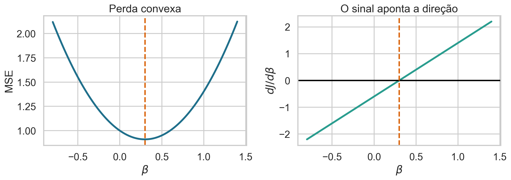
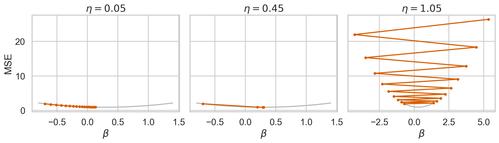
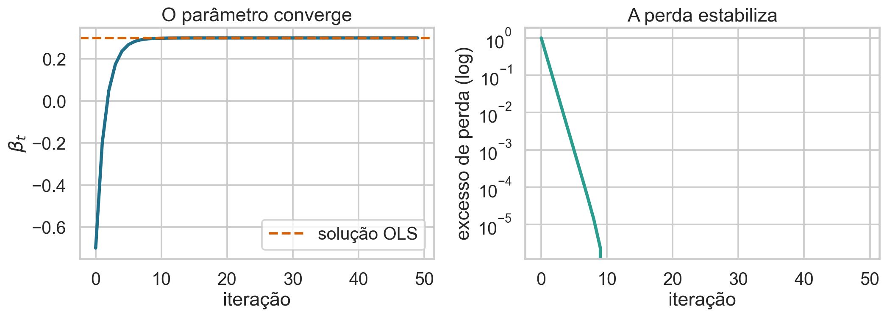
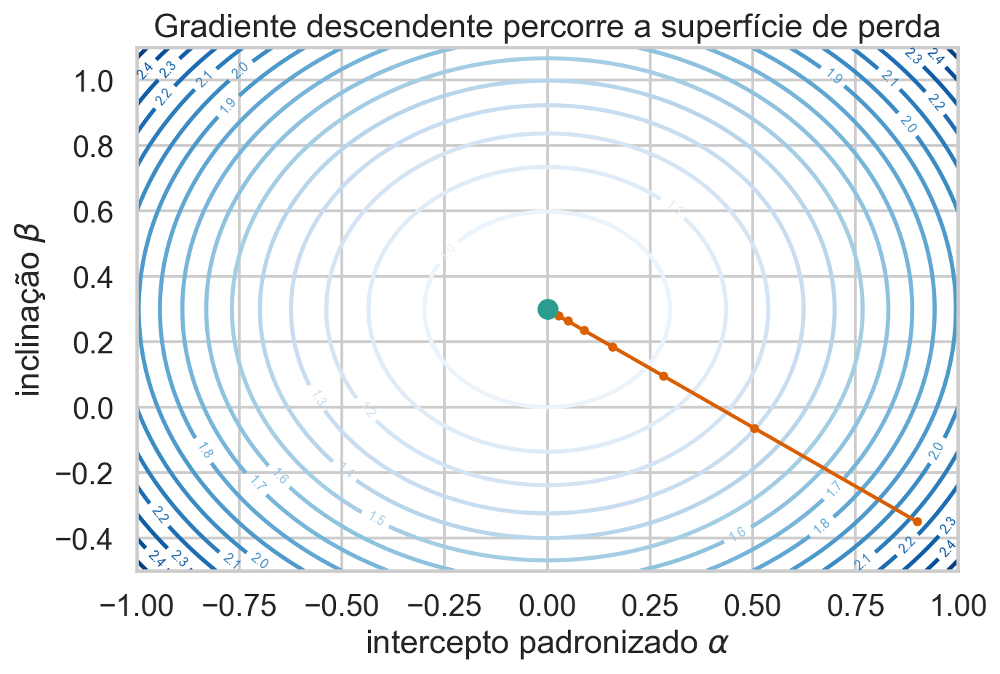
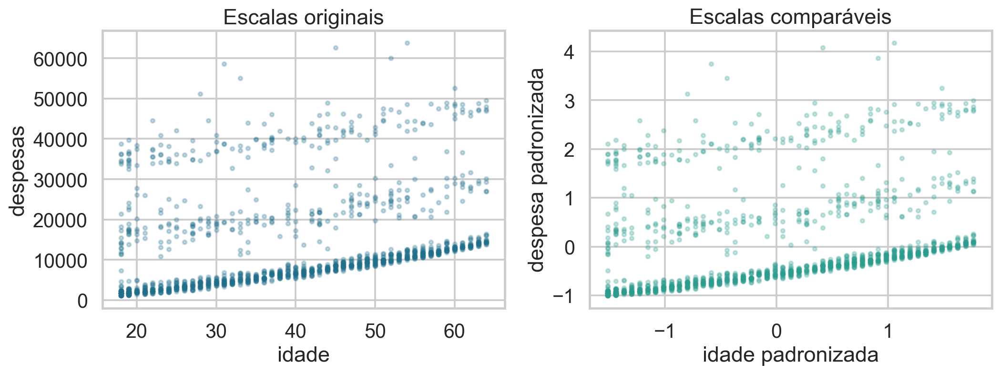
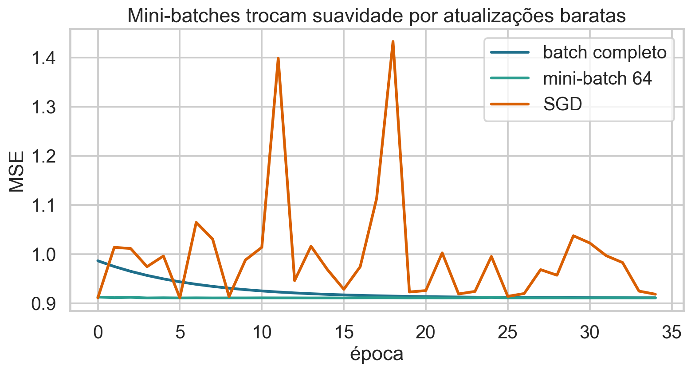
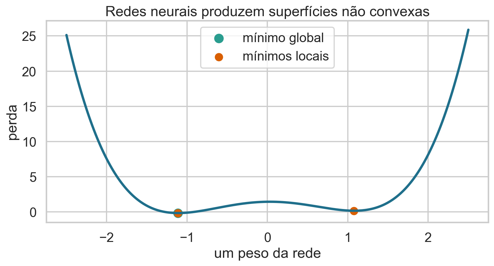

## Como um modelo aprende?

Nas aulas anteriores, encontramos parâmetros por álgebra.

Em modelos grandes, a solução fechada pode ser cara ou inexistente.

> Aprender passa a significar reduzir uma função de perda passo a passo.

## Hoje

- interpretar derivada e gradiente como direção de variação;
- construir gradiente descendente na regressão;
- compreender taxa de aprendizado e convergência;
- comparar batch, mini-batch e SGD;
- reconhecer a importância da padronização;
- conectar a mesma ideia ao treinamento de redes neurais.

## Base de dados de apoio

Continuaremos com **Medical Insurance Cost**, do Kaggle:

- resposta: despesas médicas;
- preditor: idade;
- 1.338 pessoas;
- comparação direta com OLS e MLE das Aulas 17–19.

Usaremos variáveis padronizadas para estudar o algoritmo.

## Três visões da mesma regressão

$$\widehat y_i=\beta_0+\beta_1x_i.$$

- Aula 17: minimize a soma de quadrados;
- Aula 19: maximize a verossimilhança gaussiana;
- Aula 20: percorra numericamente a perda até um mínimo.

O alvo é o mesmo; muda o caminho computacional.

## Por que não usar sempre a fórmula fechada?

- milhões ou bilhões de parâmetros;
- perdas sem solução algébrica;
- dados que chegam em fluxo;
- matrizes grandes demais para operações diretas;
- modelos não lineares, como redes neurais.

Otimização iterativa troca uma solução imediata por uma sequência de aproximações.

## Comece com regressão sem intercepto

Com dados padronizados, considere

$$\widehat y_i=\beta x_i.$$

A perda média é

$$J(\beta)=\frac1n\sum_{i=1}^n(y_i-\beta x_i)^2.$$

Há apenas um parâmetro para visualizar.

## O que significa cada termo?

| símbolo | significado |
|---|---|
| $\beta$ | inclinação candidata |
| $\widehat y_i=\beta x_i$ | previsão da observação $i$ |
| $y_i-\beta x_i$ | resíduo candidato |
| $J(\beta)$ | erro quadrático médio |
| $n$ | número de observações |

## A perda é uma função do parâmetro

Para cada valor candidato de $\beta$:

1. produzimos previsões;
2. calculamos resíduos;
3. elevamos ao quadrado;
4. calculamos a média.

O resultado é um ponto na curva $J(\beta)$.

## Perda e derivada contam a mesma história

{.wide-chart fig-alt="Perda quadrática convexa e sua derivada em função da inclinação."}

À esquerda do mínimo, a derivada é negativa; à direita, positiva.

<details class="code-fold"><summary>Código do gráfico</summary>

```python
loss = np.mean((y-beta*x)**2)
gradient = -2*np.mean(x*(y-beta*x))
```
</details>

## Derive a perda

$$
J(\beta)=\frac1n\sum_i(y_i-\beta x_i)^2.
$$

Pela regra da cadeia,

$$
\frac{dJ}{d\beta}
=-\frac2n\sum_i x_i(y_i-\beta x_i).
$$

O fator $x_i$ aparece porque $d(y_i-\beta x_i)/d\beta=-x_i$.

## O sinal indica para onde caminhar

- se $J'(\beta)<0$, aumentar $\beta$ reduz a perda;
- se $J'(\beta)>0$, diminuir $\beta$ reduz a perda;
- se $J'(\beta)=0$, encontramos um ponto estacionário.

Por isso caminhamos na direção **oposta** à derivada.

## A regra de atualização

$$
\beta_{t+1}=\beta_t-\eta\,J'(\beta_t).
$$

- $t$: índice da iteração;
- $\eta>0$: taxa de aprendizado;
- $J'(\beta_t)$: inclinação local da perda;
- $-J'$: direção de descida.

## Uma iteração completa

Dado $\beta_t$:

1. $\widehat y_i=\beta_tx_i$;
2. $e_i=y_i-\widehat y_i$;
3. $g_t=-2n^{-1}\sum_i x_ie_i$;
4. $\beta_{t+1}=\beta_t-\eta g_t$.

Repetimos até um critério de parada.

## O algoritmo

```text
escolha beta e eta
para t = 0, 1, 2, ...:
    previsao = beta * x
    gradiente = -2 * media(x * (y - previsao))
    beta_novo = beta - eta * gradiente
    pare se a mudança for suficientemente pequena
```

A atualização deve usar o gradiente calculado no estado atual.

## Quiz: qual é o próximo passo? {.quiz-question}

Se $J'(\beta_t)>0$, o que a atualização faz?

- [Diminui $\beta$]{.correct data-explanation="Subtrair uma quantidade positiva move o parâmetro para a esquerda."}
- [Aumenta $\beta$]{data-explanation="Isso ocorreria se o gradiente fosse negativo."}
- [Mantém $\beta$ necessariamente fixo]{data-explanation="O parâmetro só fica fixo quando o gradiente é zero ou a taxa é zero."}

## Convexidade simplifica a busca

Na regressão linear com perda quadrática,

$$
J''(\beta)=\frac2n\sum_i x_i^2\ge0.
$$

Se há variação em $x$, então $J''(\beta)>0$: a perda é estritamente convexa e possui um único mínimo.

## O mínimo coincide com OLS

Igualando o gradiente a zero:

$$
\sum_i x_i(y_i-\beta x_i)=0
$$

$$
\beta^*=\frac{\sum_i x_iy_i}{\sum_i x_i^2}.
$$

Gradiente descendente aproxima iterativamente essa solução.

## A taxa de aprendizado controla o passo

{.wide-chart fig-alt="Trajetórias para taxas de aprendizado pequena, adequada e excessiva."}

- pequena: segura, porém lenta;
- adequada: converge rapidamente;
- grande: oscila ou diverge.

<details class="code-fold"><summary>Código do gráfico</summary>

```python
for eta in [.05, .45, 1.05]:
    beta -= eta*gradient(beta)
```
</details>

## Taxa grande pode aumentar a perda

A direção $-\nabla J$ é local. Um passo muito longo pode atravessar o vale e terminar em uma região pior.

Não basta escolher a direção correta; precisamos controlar a distância percorrida.

## Critérios de parada

Podemos interromper quando:

- $\|\nabla J(\theta_t)\|<\varepsilon$;
- $|J_{t+1}-J_t|<\varepsilon$;
- $\|\theta_{t+1}-\theta_t\|<\varepsilon$;
- alcançamos o número máximo de iterações;
- a perda de validação deixa de melhorar.

## Convergência não é “perda igual a zero”

{.wide-chart fig-alt="Convergência do parâmetro para OLS e estabilização da perda."}

O algoritmo converge para a menor perda possível dentro do modelo, não para ajuste perfeito.

<details class="code-fold"><summary>Código do gráfico</summary>

```python
history.append((iteration, beta, loss))
```
</details>

## Agora inclua o intercepto

$$
J(\beta_0,\beta_1)=\frac1n\sum_i(y_i-\beta_0-\beta_1x_i)^2.
$$

O parâmetro vira um vetor

$$\theta=(\beta_0,\beta_1)^T.$$

A derivada vira um gradiente.

## O gradiente reúne derivadas parciais

$$
\nabla J(\theta)=
\begin{bmatrix}
\partial J/\partial\beta_0\\
\partial J/\partial\beta_1
\end{bmatrix}
=-\frac2n
\begin{bmatrix}
\sum_i e_i\\
\sum_i x_ie_i
\end{bmatrix}.
$$

Cada componente indica como a perda muda ao variar um parâmetro.

## Atualização vetorial

$$
\theta_{t+1}=\theta_t-\eta\nabla J(\theta_t).
$$

Explicitamente:

$$\beta_{0,t+1}=\beta_{0,t}+\frac{2\eta}{n}\sum_i e_i,$$

$$\beta_{1,t+1}=\beta_{1,t}+\frac{2\eta}{n}\sum_i x_ie_i.$$

## Atualize simultaneamente

Primeiro calcule ambos os gradientes usando $(\beta_{0,t},\beta_{1,t})$.

Depois atualize os dois parâmetros.

Atualizar $\beta_0$ e imediatamente usá-lo no gradiente de $\beta_1$ muda o algoritmo e introduz dependência da ordem.

## A superfície de perda tem um vale

{.wide-chart fig-alt="Curvas de nível da perda e caminho do gradiente nos dois parâmetros."}

O gradiente é perpendicular às curvas de nível e aponta para o crescimento mais rápido.

<details class="code-fold"><summary>Código do gráfico</summary>

```python
theta = theta-eta*gradient(theta)
path.append(theta.copy())
```
</details>

## Padronização melhora a geometria

{.wide-chart fig-alt="Idade e despesas nas escalas originais e padronizadas."}

Escalas muito diferentes produzem um vale alongado e exigem taxas menores. Padronizar torna os passos mais equilibrados.

<details class="code-fold"><summary>Código do gráfico</summary>

```python
xz = (x-x.mean())/x.std()
yz = (y-y.mean())/y.std()
```
</details>

## O resultado deve reproduzir OLS

Na regressão convexa, um teste básico é comparar:

$$\widehat\theta_{GD}\approx\widehat\theta_{OLS}.$$

Diferenças persistentes sugerem:

- gradiente incorreto;
- taxa inadequada;
- poucas iterações;
- padronização inconsistente;
- critério de parada prematuro.

## Custo de uma atualização batch

Calcular o gradiente com todos os $n$ pontos e $p$ parâmetros custa aproximadamente

$$O(np)$$

por iteração.

Com bases enormes, uma atualização completa pode ser cara mesmo quando cada operação é simples.

## Gradiente estocástico usa uma observação

No SGD, escolhemos $i_t$ e usamos

$$g_t=\nabla_\theta\ell_{i_t}(\theta_t),$$

$$\theta_{t+1}=\theta_t-\eta_tg_t.$$

$g_t$ é ruidoso, mas barato. Em média, pode apontar na direção do gradiente completo.

## Mini-batch é o compromisso moderno

Para um conjunto $B_t$ de tamanho $m$:

$$
g_t=\frac1m\sum_{i\in B_t}\nabla_\theta\ell_i(\theta_t).
$$

- $m=n$: batch completo;
- $m=1$: SGD;
- $1<m<n$: mini-batch.

## Batch, mini-batch e SGD

{.wide-chart fig-alt="Curvas de perda para gradiente batch, mini-batch e estocástico."}

Mini-batches aproveitam paralelismo e controlam parte do ruído.

<details class="code-fold"><summary>Código do gráfico</summary>

```python
for batch in batches:
    gradient = mean(individual_gradients[batch], axis=0)
```
</details>

## Época não é iteração

- **iteração:** uma atualização dos parâmetros;
- **batch:** observações usadas nessa atualização;
- **época:** uma passagem aproximadamente completa pelos dados.

Com mini-batch de tamanho $m$, uma época contém cerca de $n/m$ atualizações.

### Embaralhar evita padrões de ordem

Se os dados estiverem ordenados por grupo, tempo ou resposta, batches consecutivos podem produzir gradientes enviesados localmente.

Embaralhar a ordem a cada época ajuda cada mini-batch a representar melhor a amostra.

Dados temporais ou dependentes exigem mais cuidado.

## Taxa variável ao longo do treinamento

Uma estratégia comum é reduzir $\eta_t$:

$$\eta_t=\frac{\eta_0}{1+kt}.$$

Passos maiores exploram no início; passos menores estabilizam perto do mínimo.

Otimizadores modernos adaptam taxas por parâmetro.

## Quiz: qual alteração reduz o ruído? {.quiz-question}

- [Aumentar o tamanho do mini-batch]{.correct data-explanation="A média de mais gradientes individuais varia menos entre atualizações."}
- [Usar apenas uma observação]{data-explanation="Isso produz o gradiente mais ruidoso."}
- [Remover a função de perda]{data-explanation="O gradiente precisa de um objetivo definido."}

## Gradiente descendente e máxima verossimilhança

Podemos minimizar a log-verossimilhança negativa:

$$J(\theta)=-\ell(\theta).$$

Assim, gradiente ascendente em $\ell$ e gradiente descendente em $-\ell$ são equivalentes.

Para erros normais, $-\ell$ contém a SSE.

## Da regressão para uma unidade neural

Um neurônio linear calcula

$$z=w^Tx+b,$$

que é uma regressão com vários preditores.

Uma ativação produz

$$a=\phi(z).$$

Empilhar unidades cria uma rede neural.

## A rede também minimiza uma perda

Para pesos $W$ e vieses $b$,

$$J(W,b)=\frac1n\sum_i\ell(y_i,f(x_i;W,b)).$$

O treinamento repete:

1. propagação para frente;
2. cálculo da perda;
3. cálculo dos gradientes;
4. atualização dos parâmetros.

## Retropropagação calcula o gradiente

Backpropagation não é um otimizador.

Ela aplica eficientemente a regra da cadeia para obter

$$\nabla_WJ,\qquad \nabla_bJ.$$

Gradiente descendente, SGD ou Adam usam esses gradientes para atualizar a rede.

## A mesma regra reaparece

$$
W_{t+1}=W_t-\eta\nabla_WJ(W_t,b_t),
$$

$$
b_{t+1}=b_t-\eta\nabla_bJ(W_t,b_t).
$$

O princípio é o mesmo da regressão; mudam o número de parâmetros e a complexidade da superfície.

## Redes neurais não são convexas

{.wide-chart fig-alt="Exemplo conceitual de superfície não convexa com mínimos locais."}

Gradiente zero pode indicar mínimo local, sela ou região plana. Inicialização e otimizador passam a importar muito mais.

<details class="code-fold"><summary>Código do gráfico</summary>

```python
loss = (w**2-1.2)**2+0.15*w
plt.plot(w, loss)
```
</details>

## GPUs favorecem mini-batches

Redes neurais usam muitas multiplicações matriciais independentes.

GPUs executam essas operações em paralelo, e mini-batches organizam várias observações em matrizes.

O sucesso moderno combina:

- algoritmos de otimização;
- grandes bases de dados;
- hardware paralelo.

## Adam é uma extensão, não mágica

Adam combina:

- média móvel dos gradientes;
- média móvel dos gradientes ao quadrado;
- taxas efetivas diferentes por parâmetro.

Ainda assim, a atualização fundamental continua baseada em gradientes e exige validação, regularização e diagnóstico.

## Um roteiro de implementação segura

1. derive e teste o gradiente;
2. padronize variáveis quando necessário;
3. monitore perda de treino e validação;
4. compare com solução conhecida em casos simples;
5. ajuste taxa e batch;
6. fixe sementes para depuração;
7. documente critério de parada.

## Bibliografia da aula

- Data 100, *Principles and Techniques of Data Science*, otimização e gradiente.
- James et al., *An Introduction to Statistical Learning*, otimização em modelos preditivos.
- Goodfellow, Bengio e Courville, *Deep Learning*, capítulos 6 e 8.
- Géron, *Hands-On Machine Learning*, treinamento de modelos e redes neurais.
- Ruder, *An Overview of Gradient Descent Optimization Algorithms*.

## Síntese

- o gradiente aponta o crescimento local da perda;
- subtraí-lo produz uma etapa de descida;
- taxa de aprendizado controla estabilidade e velocidade;
- padronização melhora a geometria;
- mini-batches viabilizam grandes bases;
- backprop calcula gradientes em redes;
- os mesmos princípios escalam da regressão ao aprendizado profundo.

## Próxima aula

::: {.statement}
Gradiente descendente mostrou como ajustar parâmetros. As próximas aulas poderão usar esse mecanismo em modelos cuja resposta, perda e fronteira de decisão são mais complexas que uma reta.
:::
