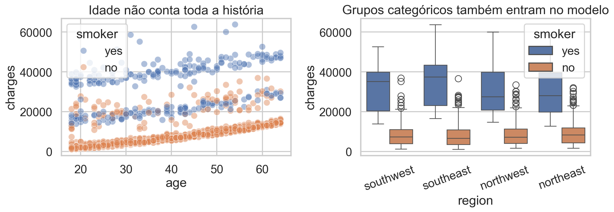
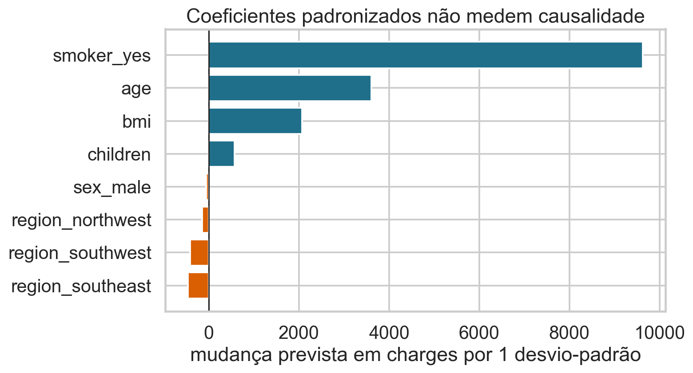
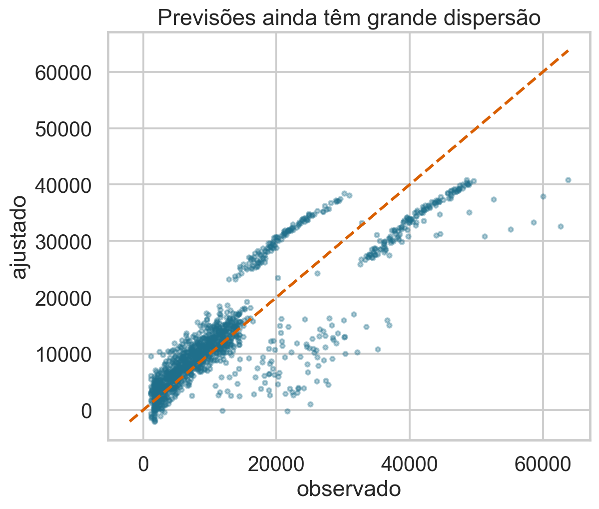
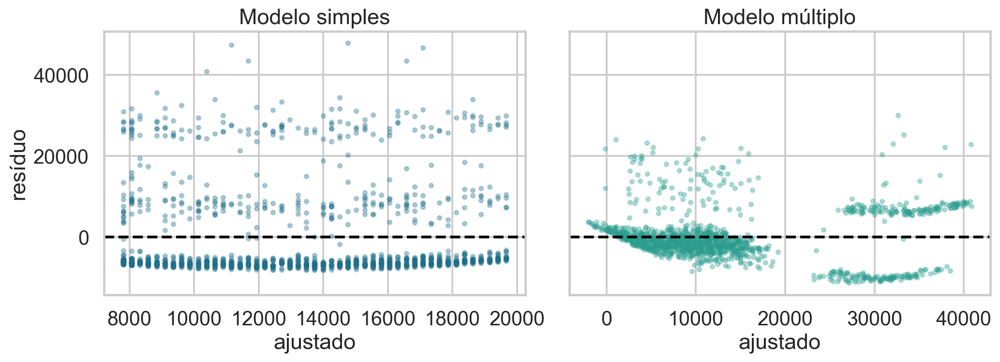
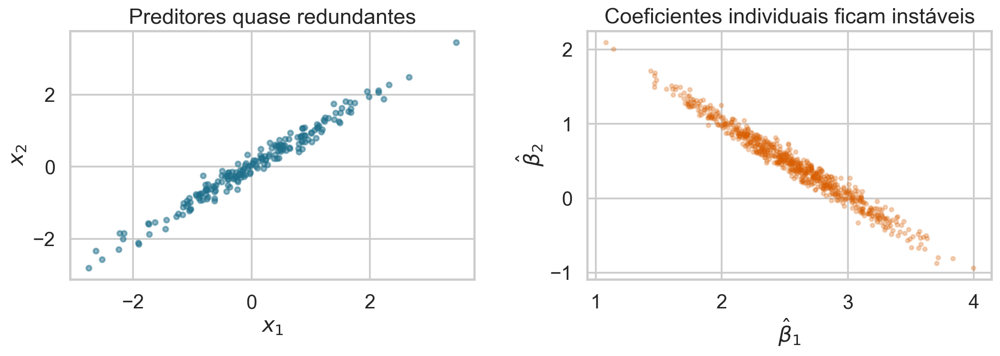
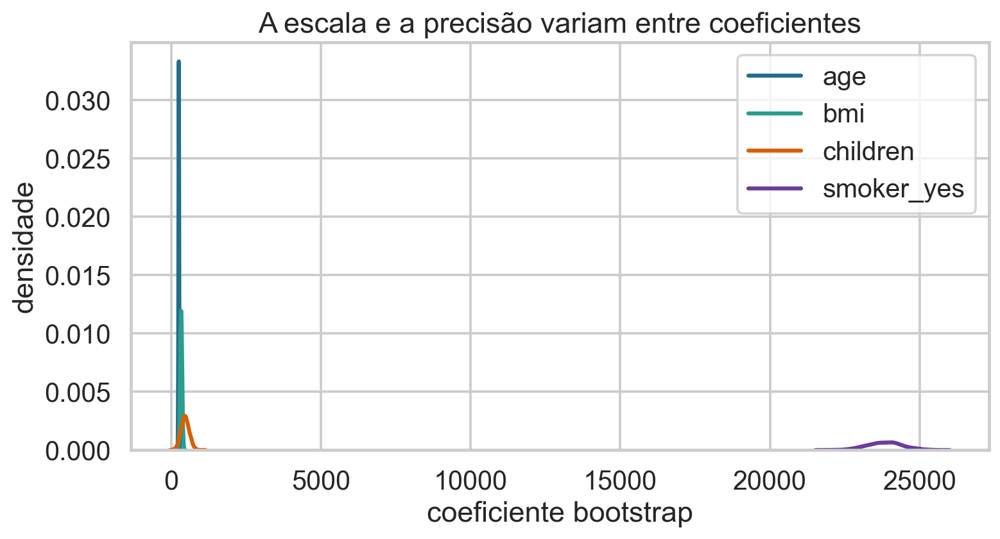
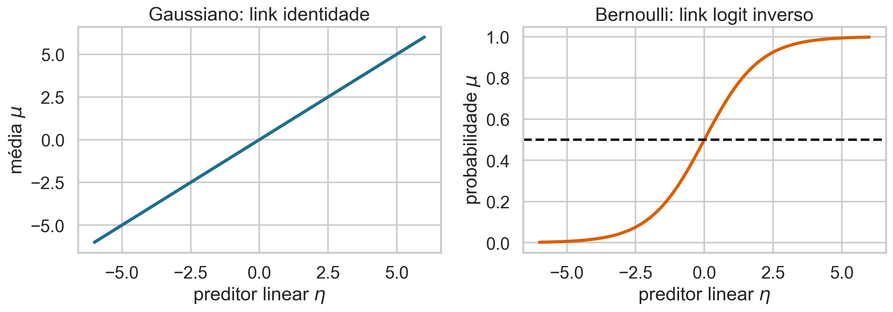

## Uma resposta, várias explicações

Idade está associada às despesas, mas não descreve toda a heterogeneidade.

> Regressão múltipla modela a média da resposta usando vários preditores simultaneamente.

## Hoje

- formular regressão múltipla em notação escalar e matricial;
- codificar preditores quantitativos e categóricos;
- interpretar coeficientes condicionais;
- derivar perda, gradiente e equações normais;
- discutir interação, colinearidade e diagnóstico;
- introduzir a estrutura dos modelos lineares generalizados.

## Base de dados de apoio

Usaremos **Medical Insurance Cost**, do Kaggle:

- 1.338 pessoas seguradas;
- resposta: `charges`;
- quantitativas: idade, IMC e número de filhos;
- categóricas: tabagismo, sexo e região;
- dados observacionais sob licença CC0.

## Antes do modelo, descreva a base

{.wide-chart fig-alt="Despesas por idade, tabagismo e região."}

Tabagismo separa patamares; região e outras características podem acrescentar informação.

<details class="code-fold"><summary>Código do gráfico</summary>

```python
sns.scatterplot(data=df, x="age", y="charges", hue="smoker")
sns.boxplot(data=df, x="region", y="charges", hue="smoker")
```
</details>

## Unidade observacional e objetivo

Cada linha representa uma pessoa.

Queremos aproximar

$$E[Y\mid X_1=x_1,\ldots,X_p=x_p].$$

O modelo descreve uma média condicional; não transforma associações observacionais em efeitos causais.

## Da reta ao hiperplano

Regressão simples:

$$E[Y\mid X=x]=\beta_0+\beta_1x.$$

Regressão múltipla:

$$E[Y\mid X=x]=\beta_0+\beta_1x_1+\cdots+\beta_px_p.$$

Com $p>2$, a superfície não pode ser visualizada diretamente, mas a álgebra permanece simples.

## O modelo estatístico

Para $i=1,\ldots,n$:

$$
Y_i=\beta_0+\sum_{j=1}^p\beta_jx_{ij}+\varepsilon_i,
\qquad E[\varepsilon_i\mid X_i]=0.
$$

$x_{ij}$ é o valor do preditor $j$ para a observação $i$.

### O que significa cada índice?

| símbolo | significado |
|---|---|
| $i$ | observação, de 1 a $n$ |
| $j$ | preditor, de 1 a $p$ |
| $x_{ij}$ | valor do preditor $j$ na observação $i$ |
| $\beta_j$ | coeficiente populacional do preditor $j$ |
| $\varepsilon_i$ | erro da observação $i$ |

## Interpretação condicional do coeficiente

$\beta_j$ é a mudança na média prevista de $Y$ associada a uma unidade adicional em $X_j$, **mantendo os demais preditores fixos**.

Essa é uma comparação definida pelo modelo. Ela pode não corresponder a uma intervenção possível ou causal.

### “Mantendo fixo” muda a pergunta

Na regressão simples, idade pode capturar diferenças associadas a outras variáveis.

Na regressão múltipla, o coeficiente de idade compara pessoas com os mesmos valores dos demais preditores incluídos.

Condicionar pode reduzir confundimento estatístico, mas não garante identificação causal.

## Preditor binário é uma diferença entre grupos

Defina

$$x_{fumante}=\begin{cases}1,&\text{fumante}\\0,&\text{não fumante.}\end{cases}$$

Então $\beta_{fumante}$ é a diferença média prevista entre fumantes e não fumantes com os demais preditores fixos.

## Categorias com mais de dois níveis

Para quatro regiões, usamos três indicadores e escolhemos uma referência.

Com `northeast` como referência, cada coeficiente regional compara seu grupo com `northeast`.

Com intercepto e quatro indicadores regionais,

$$1=D_{NE}+D_{NW}+D_{SE}+D_{SW}.$$

Uma coluna seria combinação linear exata das outras. Remover a referência evita essa **armadilha das dummies**.

## Matriz de projeto

Incluindo uma coluna de 1 para o intercepto:

$$
X=\begin{bmatrix}
1&x_{11}&\cdots&x_{1p}\\
\vdots&\vdots&\ddots&\vdots\\
1&x_{n1}&\cdots&x_{np}
\end{bmatrix}
\in\mathbb R^{n\times(p+1)}.
$$

Com $\beta\in\mathbb R^{p+1}$ e $y\in\mathbb R^n$,

$$E[y\mid X]=X\beta\in\mathbb R^n.$$

## Uma linha produz uma previsão

Para a observação $i$:

$$
\widehat y_i=x_i^T\widehat\beta
=\widehat\beta_0+\sum_{j=1}^p x_{ij}\widehat\beta_j.
$$

$x_i^T$ é a linha $i$ da matriz de projeto.

## Resíduos em forma vetorial

$$e=y-X\beta.$$

- $y$: valores observados;
- $X\beta$: valores previstos;
- $e$: vetor de resíduos candidatos.

A perda quadrática será o comprimento ao quadrado desse vetor.

## Norma euclidiana e SSE

$$
\|e\|_2^2=e^Te=\sum_{i=1}^ne_i^2.
$$

Logo,

$$
\operatorname{SSE}(\beta)=\|y-X\beta\|_2^2.
$$

Para um vetor, essa é a norma euclidiana; “norma de Frobenius” é a generalização matricial.

## O estimador OLS

$$
\widehat\beta
=\arg\min_{b\in\mathbb R^{p+1}}
\|y-Xb\|_2^2.
$$

O argumento mínimo é um vetor de $p+1$ coeficientes.

## Expanda a perda

$$
J(b)=(y-Xb)^T(y-Xb)
$$

$$
=y^Ty-2b^TX^Ty+b^TX^TXb.
$$

O termo $y^Ty$ não depende de $b$.

## O gradiente matricial

Usando $X^TX$ simétrica:

$$
\nabla_bJ(b)=-2X^Ty+2X^TXb
=-2X^T(y-Xb).
$$

O gradiente possui dimensão $(p+1)\times1$, igual ao vetor de parâmetros.

## Cada componente tem interpretação conhecida

Para $j=0,\ldots,p$:

$$
\frac{\partial J}{\partial b_j}
=-2\sum_{i=1}^n x_{ij}(y_i-\widehat y_i).
$$

Cada derivada soma resíduos ponderados pela coluna $j$ de $X$.

### O intercepto cabe na mesma fórmula

Na coluna $j=0$, $x_{i0}=1$. Portanto,

$$
\frac{\partial J}{\partial b_0}=-2\sum_ie_i.
$$

No ótimo com intercepto, $\sum_i e_i=0$.

## Gradiente descendente vetorizado

$$
b_{t+1}=b_t-\eta\nabla J(b_t)
=b_t+2\eta X^T(y-Xb_t).
$$

Se usarmos MSE em vez de SSE, aparece também o fator $1/n$.

A escolha apenas reescala a taxa de aprendizado.

## Implementação em poucas linhas

```python
prediction = X @ beta
residual = y-prediction
gradient = -(2/n) * X.T @ residual
beta = beta-eta*gradient
```

Vetorização substitui laços explícitos por operações matriciais otimizadas.

## Quiz: qual dimensão do gradiente? {.quiz-question}

Se $X$ tem dimensão $n\times(p+1)$, qual é a dimensão de $X^T(y-Xb)$?

- [$(p+1)\times1$]{.correct data-explanation="X transposta tem dimensão (p+1)×n e multiplica um vetor n×1."}
- [$n\times1$]{data-explanation="Essa é a dimensão do vetor de resíduos antes da multiplicação por X transposta."}
- [$n\times(p+1)$]{data-explanation="Essa é a dimensão de X, não do gradiente."}

## Equações normais

No mínimo,

$$X^T(y-X\widehat\beta)=0,$$

portanto

$$X^TX\widehat\beta=X^Ty.$$

Se $X^TX$ é invertível,

$$\widehat\beta=(X^TX)^{-1}X^Ty.$$

### Na prática, evite formar a inversa

Resolver diretamente o sistema linear ou usar decomposições numéricas é mais estável que calcular $(X^TX)^{-1}$ explicitamente.

Em Python:

```python
beta = np.linalg.lstsq(X, y, rcond=None)[0]
```

## O modelo ajustado

Com idade, IMC, filhos, tabagismo, sexo e região:

| termo | coeficiente aproximado |
|---|---:|
| idade | +256,86 US$/ano |
| IMC | +339,19 US$/unidade |
| filhos | +475,50 US$/filho |
| fumante | +23.848,54 US$ |

Todos são interpretações condicionais ao modelo.

## Coeficientes categóricos dependem da referência

Com `northeast` como referência:

- `northwest`: −352,96 US$;
- `southeast`: −1.035,02 US$;
- `southwest`: −960,05 US$.

Mudar a referência muda os coeficientes, mas não as previsões do modelo.

## Escalas diferentes dificultam comparação

{.wide-chart fig-alt="Coeficientes de uma regressão com preditores padronizados."}

Mesmo padronizados, coeficientes não são medidas automáticas de importância causal.

<details class="code-fold"><summary>Código do gráfico</summary>

```python
Xs = (X-X.mean())/X.std()
beta_std = np.linalg.lstsq(Xs, y, rcond=None)[0]
```
</details>

## Ajuste múltiplo melhora, mas não resolve tudo

{.wide-chart fig-alt="Valores observados contra valores ajustados pelo modelo múltiplo."}

Pontos sobre a diagonal seriam previsões perfeitas; ainda há grande dispersão.

<details class="code-fold"><summary>Código do gráfico</summary>

```python
prediction = X @ beta
plt.scatter(y, prediction)
```
</details>

## Compare os resíduos

{.wide-chart fig-alt="Resíduos do modelo simples e do modelo múltiplo."}

Incluir preditores reduz estrutura, mas a variância ainda não parece constante.

<details class="code-fold"><summary>Código do gráfico</summary>

```python
residual_simple = y-X_simple@beta_simple
residual_multiple = y-X@beta
```
</details>

## Interações permitem efeitos diferentes

Considere

$$
E[Y\mid age,smoker]
=\beta_0+\beta_1age+\beta_2smoker+\beta_3(age\times smoker).
$$

$\beta_3$ permite que a inclinação da idade seja diferente entre fumantes e não fumantes.

## Interprete a interação por grupos

Para não fumantes ($smoker=0$):

$$E[Y]=\beta_0+\beta_1age.$$

Para fumantes ($smoker=1$):

$$E[Y]=(\beta_0+\beta_2)+(\beta_1+\beta_3)age.$$

O termo principal de idade passa a ser a inclinação no grupo de referência.

## Não remova termos principais mecanicamente

Se o modelo contém $X_1X_2$, normalmente preservamos $X_1$ e $X_2$.

Esse princípio hierárquico mantém interpretações coerentes e evita impor que os grupos coincidam quando um preditor vale zero.

## Colinearidade não é redundância perfeita apenas

Preditores muito associados podem tornar coeficientes individuais instáveis, mesmo quando $X^TX$ ainda é invertível.

As previsões conjuntas podem permanecer razoáveis enquanto sinais e magnitudes dos coeficientes variam muito.

## Colinearidade amplia a incerteza

{.wide-chart fig-alt="Preditores colineares e instabilidade bootstrap dos coeficientes."}

Os coeficientes compensam um ao outro ao longo de uma direção de incerteza.

<details class="code-fold"><summary>Código do gráfico</summary>

```python
for sample in bootstrap_samples:
    beta = np.linalg.lstsq(X[sample], y[sample], rcond=None)[0]
```
</details>

## Bootstrap do vetor de coeficientes

Reamostramos linhas completas $(x_i,y_i)$ e ajustamos o modelo em cada réplica:

$$\widehat\beta^{*(1)},\ldots,\widehat\beta^{*(B)}.$$

Cada distribuição marginal descreve a incerteza de um coeficiente sob a mesma especificação.

## As precisões não são iguais

{.wide-chart fig-alt="Distribuições bootstrap de quatro coeficientes."}

Comparar larguras exige lembrar as unidades de cada coeficiente.

<details class="code-fold"><summary>Código do gráfico</summary>

```python
indices = rng.integers(0, n, n)
beta_boot = np.linalg.lstsq(X[indices], y[indices], rcond=None)[0]
```
</details>

## Mais preditores não garantem melhor generalização

Adicionar colunas nunca aumenta a SSE de treinamento.

Mas pode:

- aumentar variância dos coeficientes;
- capturar ruído;
- piorar previsão fora da amostra;
- dificultar interpretação.

Avaliação deve usar validação ou dados de teste.

## $R^2$ sempre aumenta ou permanece igual

Como a SSE de treino não cresce ao adicionar preditores,

$$R^2=1-\frac{SSE}{SST}$$

não diminui.

O $R^2$ ajustado penaliza o número de parâmetros, mas validação continua sendo mais direta para desempenho preditivo.

## Quiz: o que significa “controlar”? {.quiz-question}

Em uma regressão observacional, incluir uma variável como preditor:

- [Define uma comparação condicional no modelo]{.correct data-explanation="O coeficiente compara unidades com os demais preditores fixos, sob a forma funcional escolhida."}
- [Garante que eliminamos todo confundimento]{data-explanation="Confundidores não medidos e especificações inadequadas continuam possíveis."}
- [Transforma automaticamente associação em causalidade]{data-explanation="Identificação causal exige hipóteses e desenho adicionais."}

## Até aqui, resposta contínua e Normal

Nas Aulas 19 e 21, assumimos

$$Y_i\mid X_i=x_i\sim N(\mu_i,\sigma^2),$$

$$\mu_i=x_i^T\beta.$$

A média pode assumir qualquer valor real, compatível com uma resposta contínua sem limites rígidos.

## E se a resposta for binária?

Se $Y_i\in\{0,1\}$, então

$$E[Y_i\mid X_i]=P(Y_i=1\mid X_i)=\pi_i,$$

com

$$0\le\pi_i\le1.$$

Uma combinação linear $x_i^T\beta$ não está restrita a esse intervalo.

## Modelos lineares generalizados

Um GLM reúne três componentes:

1. **aleatório:** distribuição de $Y_i\mid X_i$ na família exponencial;
2. **sistemático:** preditor linear $\eta_i=x_i^T\beta$;
3. **ligação:** função $g$ tal que $g(\mu_i)=\eta_i$.

$\mu_i=E[Y_i\mid X_i]$.

## O modelo normal já é um GLM

- componente aleatório: $Y_i\mid X_i\sim N(\mu_i,\sigma^2)$;
- preditor linear: $\eta_i=x_i^T\beta$;
- link identidade: $g(\mu)=\mu$.

Então

$$\mu_i=\eta_i=x_i^T\beta.$$

## A ligação adapta a escala

{.wide-chart fig-alt="Link identidade gaussiano e inversa do link logit Bernoulli."}

O link conecta a média permitida pela distribuição ao preditor linear irrestrito.

<details class="code-fold"><summary>Código do gráfico</summary>

```python
identity = eta
inverse_logit = 1/(1+np.exp(-eta))
```
</details>

## Para Bernoulli, use o logit

Se $Y_i\mid X_i\sim\operatorname{Bernoulli}(\pi_i)$, definimos

$$
g(\pi_i)=\log\left(\frac{\pi_i}{1-\pi_i}\right)=x_i^T\beta.
$$

A inversa é

$$\pi_i=\frac{1}{1+e^{-x_i^T\beta}}.$$

## O que muda e o que permanece?

Permanece:

- matriz de projeto $X$;
- preditor linear $X\beta$;
- interpretação condicional;
- otimização por gradientes.

Muda:

- distribuição da resposta;
- função de ligação;
- verossimilhança e função de perda.

## Bibliografia da aula

- James et al., *An Introduction to Statistical Learning*, capítulos 3 e 4.
- Faraway, *Linear Models with R*, regressão múltipla.
- Gelman, Hill e Vehtari, *Regression and Other Stories*, regressão com múltiplos preditores.
- Fox, *Applied Regression Analysis and Generalized Linear Models*.
- McCullagh e Nelder, *Generalized Linear Models*, capítulos iniciais.

## Síntese

- regressão múltipla modela médias condicionais com vários preditores;
- $X\beta$ reúne todas as previsões;
- OLS minimiza $\|y-X\beta\|^2$;
- o gradiente é $-2X^T(y-X\beta)$;
- indicadores, interações e colinearidade exigem interpretação cuidadosa;
- o modelo normal com link identidade é um GLM;
- Bernoulli com link logit conduz à regressão logística.

## Próxima aula

::: {.statement}
Na regressão logística, manteremos o preditor linear $X\beta$, mas trocaremos a resposta Normal por Bernoulli e usaremos o link logit para produzir probabilidades válidas.
:::
