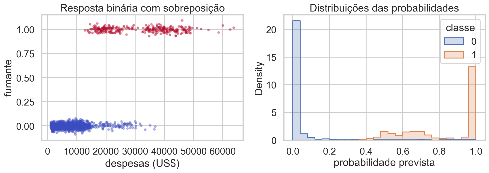
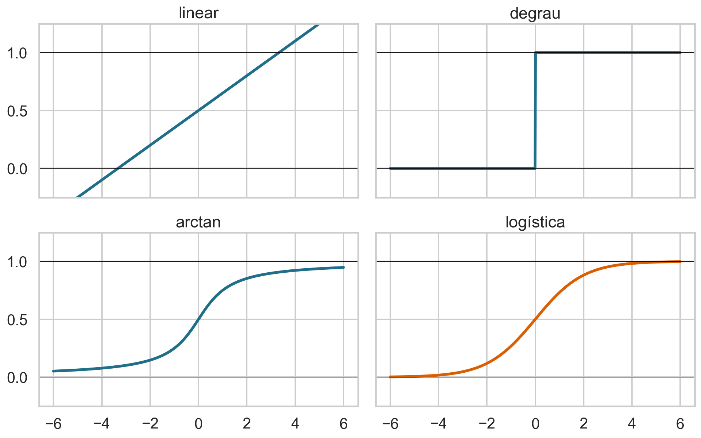
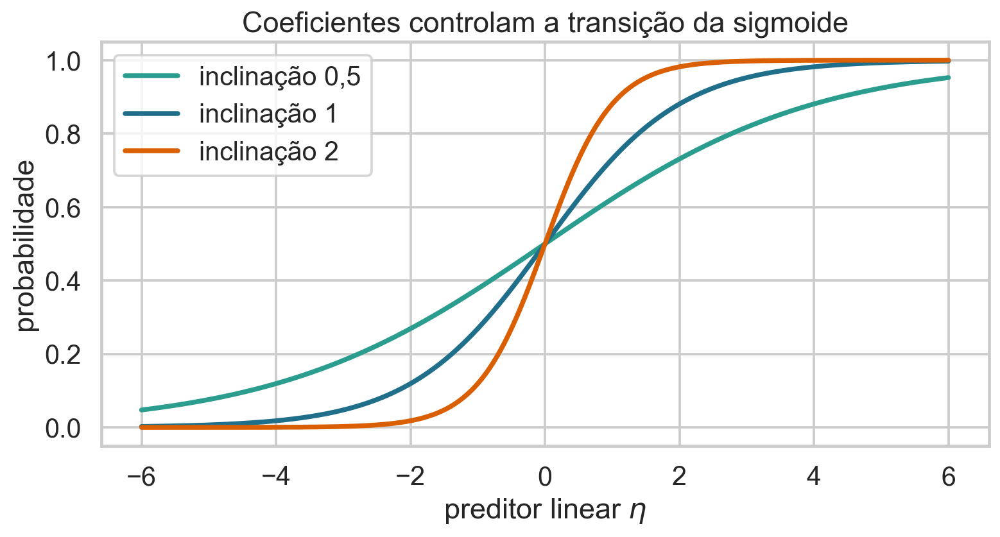
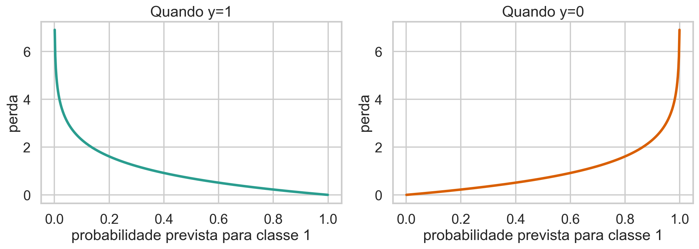
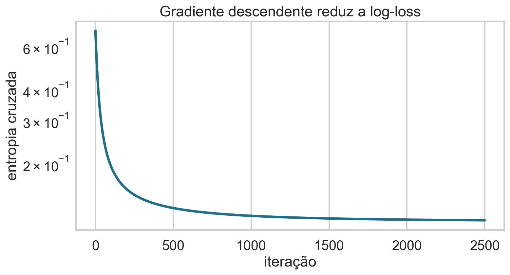
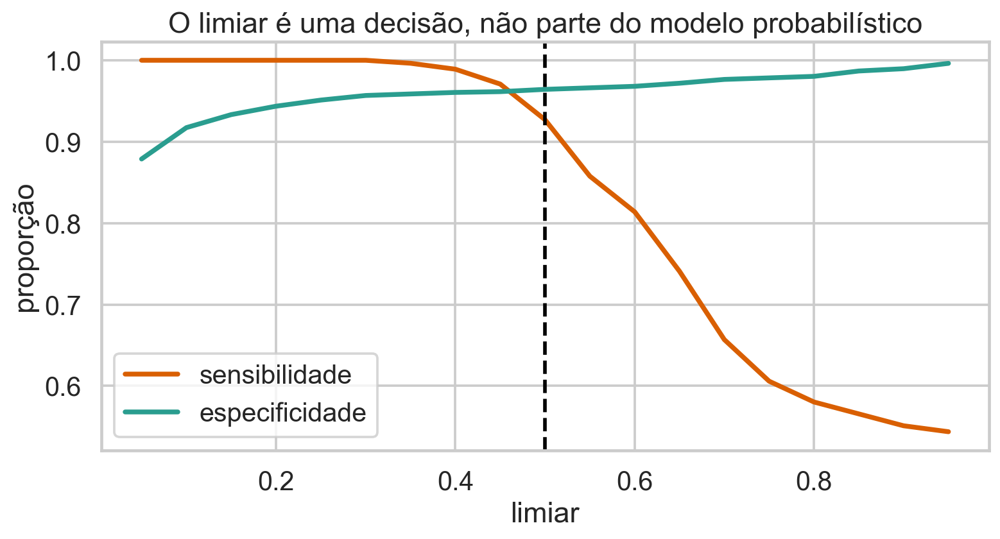
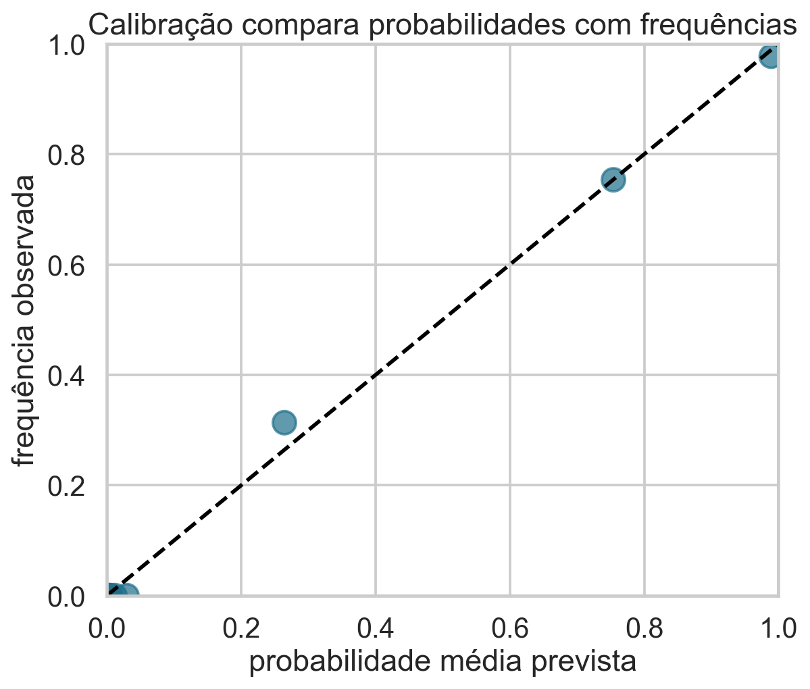

## Quando a resposta é uma classe

Queremos prever um resultado binário e quantificar sua incerteza.

> Regressão logística modela uma probabilidade condicional usando um preditor linear.

## Hoje

- distinguir probabilidade prevista e decisão de classe;
- construir a logística a partir da estrutura de um GLM;
- experimentar funções candidatas para mapear números reais em probabilidades;
- derivar a verossimilhança Bernoulli e a entropia cruzada;
- interpretar coeficientes, odds e razões de odds;
- avaliar discriminação, calibração e limiares.

## Base de dados de apoio

Continuaremos com **Medical Insurance Cost**, do Kaggle:

- resposta $Y$: fumante (`smoker=yes`);
- preditores: idade, IMC e despesas;
- 1.338 pessoas, das quais 274 fumantes;
- exemplo didático e descritivo, não um sistema para inferir comportamento pessoal.

## Uma tarefa supervisionada binária

Codificamos

$$Y_i=\begin{cases}1,&\text{fumante}\\0,&\text{não fumante.}\end{cases}$$

Queremos estimar

$$\pi_i=P(Y_i=1\mid X_i=x_i).$$

## A base apresenta sobreposição

{.wide-chart fig-alt="Resposta binária contra despesas e distribuições das probabilidades previstas."}

Classes não precisam ser perfeitamente separáveis para estimarmos probabilidades úteis.

<details class="code-fold"><summary>Código do gráfico</summary>
```python
plt.scatter(charges, smoker+jitter)
sns.histplot(data=probabilities, x="p", hue="classe")
```
</details>

## Classificação começa com probabilidade

O modelo produz $\widehat\pi_i\in[0,1]$.

Uma regra posterior pode declarar

$$\widehat y_i=\mathbb 1(\widehat\pi_i\ge c),$$

em que $c$ é um limiar escolhido segundo os custos da decisão.

## Por que não regressão linear?

Se usarmos

$$\widehat\pi_i=x_i^T\beta,$$

podemos obter valores menores que 0 ou maiores que 1. Além disso, a variância Bernoulli depende da média:

$$\operatorname{Var}(Y_i\mid X_i)=\pi_i(1-\pi_i).$$

## Retome os três componentes do GLM

1. **aleatório:** distribuição de $Y_i\mid X_i$;
2. **sistemático:** $\eta_i=x_i^T\beta$;
3. **ligação:** $g(\mu_i)=\eta_i$.

Para Bernoulli, $\mu_i=E[Y_i\mid X_i]=\pi_i$.

## O desafio é ligar $\mathbb R$ a $(0,1)$

O preditor linear

$$\eta=x^T\beta$$

pode assumir qualquer valor real. Precisamos de uma função inversa de ligação

$$h:\mathbb R\rightarrow(0,1),\qquad \pi=h(\eta).$$

### Podemos “plugar” uma função linear

$$h(\eta)=a+b\eta.$$

Vantagem: simples.

Problema: não respeita automaticamente $0\le h(\eta)\le1$.

Recortar previsões nos extremos destrói suavidade e não produz um modelo probabilístico coerente.

### Podemos “plugar” um degrau

$$h(\eta)=\mathbb 1(\eta\ge0).$$

Vantagem: sempre retorna 0 ou 1.

Problemas: não fornece probabilidades graduais e sua derivada é zero quase em toda parte.

### Podemos “plugar” qualquer CDF contínua

Uma função de distribuição acumulada satisfaz

$$0\le F(\eta)\le1,$$

é crescente e possui limites 0 e 1.

Exemplos:

- Normal: link probit;
- logística: link logit;
- valor extremo: link complementary log-log.

## Compare funções candidatas

{.wide-chart fig-alt="Funções linear, degrau, arctan e logística como mapas para probabilidade."}

A logística é suave, monotônica, limitada e possui interpretação em odds.

<details class="code-fold"><summary>Código do gráfico</summary>
```python
linear = .5+.15*eta
step = eta >= 0
arctan_link = .5+np.arctan(eta)/np.pi
logistic = 1/(1+np.exp(-eta))
```
</details>

## A função logística

$$
\sigma(\eta)=\frac{1}{1+e^{-\eta}}.
$$

- $\eta\to-\infty\Rightarrow\sigma(\eta)\to0$;
- $\eta=0\Rightarrow\sigma(\eta)=0{,}5$;
- $\eta\to+\infty\Rightarrow\sigma(\eta)\to1$.

## Coeficientes movem a sigmoide

{.wide-chart fig-alt="Curvas logísticas com diferentes inclinações."}

Maior magnitude da inclinação torna a transição mais rápida na escala do preditor.

<details class="code-fold"><summary>Código do gráfico</summary>
```python
for beta in [.5, 1, 2]:
    plt.plot(eta, 1/(1+np.exp(-beta*eta)))
```
</details>

## Odds transformam probabilidade

Para $0<\pi<1$,

$$\operatorname{odds}=\frac{\pi}{1-\pi}.$$

| $\pi$ | odds |
|---:|---:|
| 0,20 | 0,25 |
| 0,50 | 1 |
| 0,80 | 4 |

Odds comparam chance de sucesso e fracasso.

### Log-odds remove a restrição positiva

$$
\operatorname{logit}(\pi)=\log\left(\frac{\pi}{1-\pi}\right).
$$

O logit mapeia $(0,1)$ em toda a reta real.

Assim podemos impor uma relação linear nessa escala.

## O modelo logístico

$$Y_i\mid X_i=x_i\sim\operatorname{Bernoulli}(\pi_i),$$

$$\log\left(\frac{\pi_i}{1-\pi_i}\right)=x_i^T\beta.$$

Esses são o componente aleatório, a ligação e o preditor linear do GLM.

## Inverta o link

Se $\eta_i=x_i^T\beta$, então

$$e^{\eta_i}=\frac{\pi_i}{1-\pi_i}.$$

Resolvendo para $\pi_i$:

$$\pi_i=\frac{e^{\eta_i}}{1+e^{\eta_i}}=\frac1{1+e^{-\eta_i}}.$$

### O que significa cada termo?

| símbolo | significado |
|---|---|
| $Y_i$ | resposta binária |
| $\pi_i$ | probabilidade condicional de classe 1 |
| $x_i^T\beta$ | preditor linear |
| $g(\pi)=\operatorname{logit}(\pi)$ | função de ligação |
| $\sigma(\eta)$ | inversa do link |

## Quiz: por que não usar um degrau? {.quiz-question}

- [Porque ele não produz probabilidades graduais e dificulta otimização por gradientes]{.correct data-explanation="O degrau é descontínuo e sua derivada é zero quase sempre."}
- [Porque ele pode produzir valores maiores que 1]{data-explanation="O degrau retorna apenas 0 ou 1."}
- [Porque classificação nunca usa limiares]{data-explanation="Limiar é usado depois da probabilidade prevista."}

## Verossimilhança de uma observação

Para $y_i\in\{0,1\}$,

$$
P(Y_i=y_i\mid x_i)=\pi_i^{y_i}(1-\pi_i)^{1-y_i}.
$$

Se $y_i=1$, a contribuição é $\pi_i$; se $y_i=0$, é $1-\pi_i$.

## Verossimilhança conjunta

Sob independência condicional,

$$
L(\beta)=\prod_{i=1}^n
\pi_i^{y_i}(1-\pi_i)^{1-y_i},
$$

com

$$\pi_i=\sigma(x_i^T\beta).$$

## Log-verossimilhança

$$
\ell(\beta)=\sum_i
\left[y_i\log\pi_i+(1-y_i)\log(1-\pi_i)\right].
$$

Maximizá-la encontra os coeficientes que tornam os rótulos observados mais compatíveis com o modelo.

## Entropia cruzada é a perda negativa

$$
J(\beta)=-\frac1n\ell(\beta)
=-\frac1n\sum_i
\left[y_i\log\pi_i+(1-y_i)\log(1-\pi_i)\right].
$$

Também é chamada log-loss binária.

## A perda depende da classe observada

{.wide-chart fig-alt="Log-loss para observações das classes 1 e 0."}

Previsões confiantes e erradas recebem penalidade muito grande.

<details class="code-fold"><summary>Código do gráfico</summary>
```python
loss_y1 = -np.log(p)
loss_y0 = -np.log(1-p)
```
</details>

## A derivada da sigmoide

$$
\sigma'(\eta)=\sigma(\eta)[1-\sigma(\eta)].
$$

Essa identidade simplifica a regra da cadeia na derivação do gradiente.

## O gradiente tem forma familiar

Se $\pi=\sigma(X\beta)$,

$$
\nabla J(\beta)=\frac1nX^T(\pi-y).
$$

Compare com regressão linear:

$$\nabla J_{OLS}\propto X^T(\widehat y-y).$$

## Cada componente do gradiente

$$
\frac{\partial J}{\partial\beta_j}
=\frac1n\sum_i x_{ij}(\pi_i-y_i).
$$

O erro agora é probabilidade prevista menos classe observada, ponderado pelo atributo $j$.

## Gradiente descendente

$$
\beta_{t+1}=\beta_t-\eta\frac1nX^T(\pi_t-y),
$$

$$\pi_t=\sigma(X\beta_t).$$

Não há solução fechada análoga às equações normais; usamos otimização iterativa.

## A perda converge

{.wide-chart fig-alt="Entropia cruzada ao longo das iterações."}

Na formulação apresentada nesta aula, a perda é convexa nos coeficientes.

<details class="code-fold"><summary>Código do gráfico</summary>
```python
prob = sigmoid(X @ beta)
gradient = X.T @ (prob-y)/n
beta -= eta*gradient
```
</details>

## Interprete o intercepto

Quando todos os preditores valem zero,

$$\beta_0=\log\left(\frac{\pi_0}{1-\pi_0}\right).$$

Logo,

$$\pi_0=\sigma(\beta_0).$$

Centralizar preditores pode tornar esse cenário mais interpretável.

## Interprete um coeficiente em log-odds

Mantendo os demais preditores fixos, aumentar $X_j$ em uma unidade altera

$$\operatorname{logit}(\pi)$$

em $\beta_j$ unidades.

Essa escala é aditiva, mas pouco intuitiva.

## Exponencie para obter razão de odds

$$e^{\beta_j}$$

é o fator multiplicativo nas odds associado a uma unidade adicional de $X_j$, mantendo os demais fixos.

- $e^{\beta_j}>1$: odds aumentam;
- $e^{\beta_j}<1$: odds diminuem;
- $e^{\beta_j}=1$: odds não mudam.

## Odds ratio não é risco relativo

$$OR=\frac{\pi_1/(1-\pi_1)}{\pi_0/(1-\pi_0)},
\qquad
RR=\frac{\pi_1}{\pi_0}.
$$

Eles se aproximam quando o evento é raro, mas podem divergir muito para probabilidades altas.

## Efeito em probabilidade não é constante

$$
\frac{\partial\pi}{\partial x_j}
=\beta_j\pi(1-\pi).
$$

O mesmo $\beta_j$ produz mudança pequena perto de 0 ou 1 e maior perto de 0,5.

## O modelo da base

Com preditores padronizados:

$$
\operatorname{logit}(\widehat\pi)
=-3{,}61-1{,}22z_{age}-1{,}77z_{bmi}+4{,}12z_{charges}.
$$

Despesas são fortemente associadas ao rótulo, mas podem ocorrer depois do comportamento que tentamos prever.

### Predição não elimina cuidado temporal

Usar `charges` para inferir tabagismo pode ser descritivamente eficaz, porém inadequado para uma decisão anterior às despesas.

Features devem estar disponíveis no momento real da previsão e ser eticamente justificáveis.

## Probabilidade e classe são objetos distintos

O modelo produz $\widehat\pi$.

O limiar $c$ incorpora custos:

$$\widehat y=1\quad\text{se}\quad\widehat\pi\ge c.$$

Mudar $c$ não reestima o modelo.

## Limiar altera os erros

{.wide-chart fig-alt="Sensibilidade e especificidade em função do limiar."}

Não existe limiar universalmente correto; depende do custo de falsos positivos e falsos negativos.

<details class="code-fold"><summary>Código do gráfico</summary>
```python
prediction = probability >= threshold
sensitivity = TP/(TP+FN)
specificity = TN/(TN+FP)
```
</details>

## Matriz de confusão

| | previsto 0 | previsto 1 |
|---|---:|---:|
| real 0 | TN | FP |
| real 1 | FN | TP |

Cada métrica resume uma combinação diferente dessas quatro contagens.

## Métricas principais

$$\text{sensibilidade}=TP/(TP+FN),$$

$$\text{especificidade}=TN/(TN+FP),$$

$$\text{precisão}=TP/(TP+FP).$$

A acurácia pode esconder desempenho ruim em classes desbalanceadas.

## Discriminação não é calibração

- **discriminação:** ordenar positivos acima de negativos;
- **calibração:** previsões de 0,7 ocorrerem aproximadamente 70% das vezes.

Um modelo pode discriminar bem e produzir probabilidades mal calibradas.

## Avalie a calibração

{.wide-chart fig-alt="Probabilidades previstas contra frequências observadas."}

Pontos próximos da diagonal indicam concordância entre probabilidade e frequência.

<details class="code-fold"><summary>Código do gráfico</summary>
```python
calibration = data.groupby(probability_bins).agg(predicted=("p","mean"), observed=("y","mean"))
```
</details>

## Quiz: coeficiente positivo implica o quê? {.quiz-question}

- [As odds aumentam, mantendo os demais preditores fixos]{.correct data-explanation="A razão de odds por unidade é exp(beta), maior que 1 quando beta é positivo."}
- [A probabilidade aumenta sempre pela mesma quantidade]{data-explanation="O efeito em probabilidade depende do ponto da sigmoide."}
- [O efeito é necessariamente causal]{data-explanation="A interpretação do modelo é condicional e associativa sem hipóteses causais adicionais."}

## Separação pode impedir MLE finito

Se uma combinação de preditores separa perfeitamente as classes, a verossimilhança pode continuar aumentando quando $\|\beta\|\to\infty$.

Coeficientes enormes e falhas de convergência são sinais de separação completa ou quase completa.

## Casos não lineares

O preditor é linear nos parâmetros, mas pode incluir transformações:

$$\eta=\beta_0+\beta_1x+\beta_2x^2,$$

splines, interações ou outras features.

A sigmoide transforma qualquer $\eta$ em probabilidade válida.

## Multiclasse exige extensão

Para mais de duas classes:

- one-vs-rest ajusta um classificador por classe;
- regressão multinomial/softmax modela as classes conjuntamente.

Aula atual: Bernoulli e duas classes.

## O que permanece dos GLMs?

- componente aleatório: Bernoulli;
- componente sistemático: $X\beta$;
- ligação: logit;
- estimação: máxima verossimilhança;
- otimização: gradientes;
- diagnóstico: resíduos, calibração e desempenho fora da amostra.

## Bibliografia da aula

- James et al., *An Introduction to Statistical Learning*, capítulo 4.
- Gelman, Hill e Vehtari, *Regression and Other Stories*, regressão logística.
- Fox, *Applied Regression Analysis and Generalized Linear Models*.
- McCullagh e Nelder, *Generalized Linear Models*.
- Data 100, classificação e regressão logística.

## Síntese

- respostas binárias têm média igual a probabilidade;
- um link conecta essa média ao preditor linear;
- várias CDFs são possíveis; o logit oferece interpretação em odds;
- a verossimilhança Bernoulli produz entropia cruzada;
- o gradiente é $X^T(\pi-y)/n$;
- probabilidade, limiar e classe são etapas distintas;
- discriminação e calibração avaliam propriedades diferentes.

## Próxima aula

::: {.statement}
**Regularização:** como controlar a complexidade, estabilizar coeficientes e melhorar a generalização de modelos lineares e logísticos.
:::
