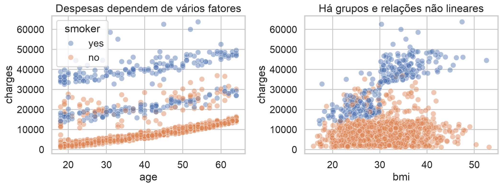
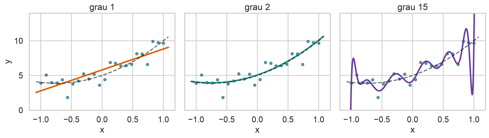
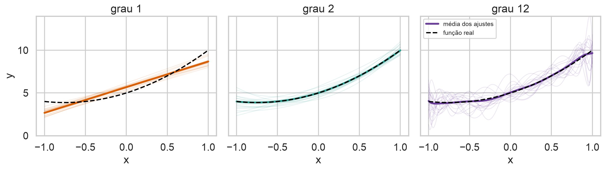
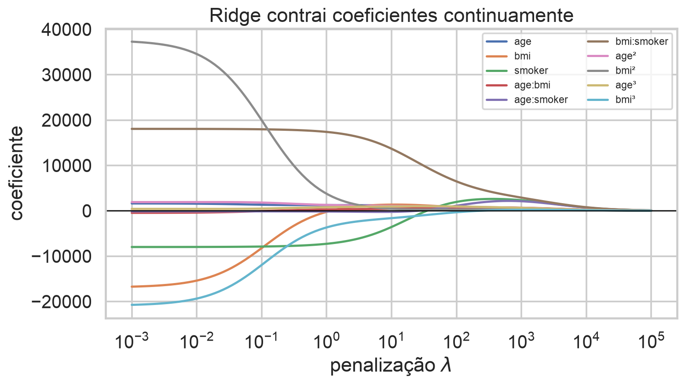
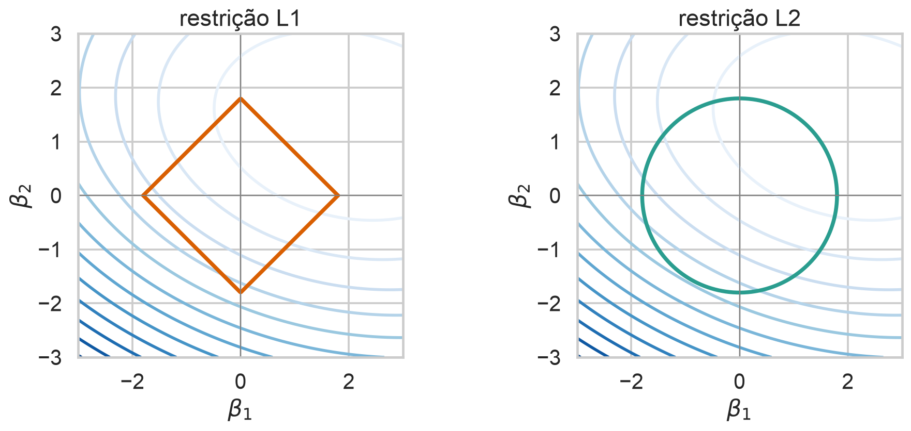
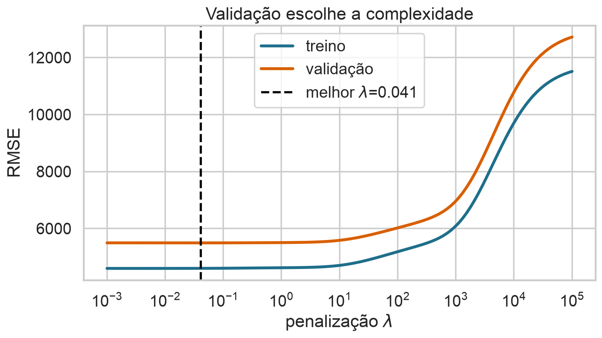
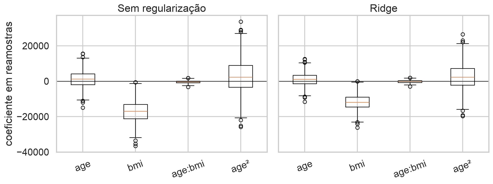

## Ajustar bem não basta

Um modelo pode explicar quase perfeitamente os dados de treinamento e falhar em novas observações.

> Regularização aceita algum viés para reduzir variância e melhorar generalização.

## Hoje

- decompor erro em ruído, viés e variância;
- distinguir erro de treino e erro de generalização;
- formular regularização como penalização ou restrição;
- comparar $L_0$, Ridge, Lasso e Elastic Net;
- escolher a intensidade da penalização por validação;
- entender por que escala, intercepto e vazamento importam.

## Base de dados de apoio

Continuaremos com **Medical Insurance Cost**, do Kaggle:

- 1.338 pessoas seguradas;
- resposta: despesas médicas (`charges`);
- atributos: idade, IMC, tabagismo, sexo, filhos e região;
- criaremos polinômios e interações para estudar complexidade.

## A base combina grupos e não linearidade

{.wide-chart fig-alt="Despesas médicas contra idade e IMC, separadas por tabagismo."}

Tabagismo separa patamares; idade e IMC ainda apresentam variação dentro dos grupos.

<details class="code-fold"><summary>Código do gráfico</summary>
```python
sns.scatterplot(data=df, x="age", y="charges", hue="smoker")
sns.scatterplot(data=df, x="bmi", y="charges", hue="smoker")
```
</details>

## Complexidade aumenta a flexibilidade

Partindo de $x$, podemos construir

$$x, x^2,ldots,x^d.$$

O modelo polinomial é linear nos parâmetros:

$$f_d(x)=\beta_0+\beta_1x+\cdots+\beta_dx^d.$$

$d$ é o grau; $eta_j$ é o coeficiente do termo $x^j$.

## Mais flexível não significa melhor

{.wide-chart fig-alt="Ajustes polinomiais de graus 1, 2 e 15 aos mesmos dados."}

O grau 15 acompanha oscilações da amostra que não pertencem à relação subjacente.

<details class="code-fold"><summary>Código do gráfico</summary>
```python
for degree in [1, 2, 15]:
    coef = np.polyfit(x, y, degree)
    plt.plot(grid, np.polyval(coef, grid))
```
</details>

## Erro de treino favorece complexidade

Se modelos estão aninhados,

$$\operatorname{SSE}_{d+1,\,treino}\leq \operatorname{SSE}_{d,\,treino}.$$

O modelo de grau $d+1$ pode reproduzir o de grau $d$ usando $eta_{d+1}=0$.

Logo, minimizar apenas erro de treino não escolhe a complexidade adequada.

## O alvo é o risco de generalização

Para uma nova observação $(X,Y)$ da mesma população,

$$R(f)=E\left[(Y-f(X))^2\right].$$

- $f$ é a regra ajustada;
- a esperança inclui novas amostras de treino e novos pontos;
- validação estima esse risco fora da amostra.

## Decomposição viés–variância

Em um ponto $x$, suponha $Y=f(x)+\varepsilon$, com $E[\varepsilon]=0$ e $\operatorname{Var}(\varepsilon)=\sigma^2$:

$$E[(Y-\widehat f(x))^2]=\sigma^2+\operatorname{Bias}[\widehat f(x)]^2+\operatorname{Var}[\widehat f(x)].$$

O ruído $sigma^2$ é irredutível; os outros termos dependem do procedimento de ajuste.

## De onde vem a decomposição?

Some e subtraia $E[\widehat f(x)]$:

$$Y-\widehat f=(f+\varepsilon-E[\widehat f])+(E[\widehat f]-\widehat f).$$

Ao elevar ao quadrado e tomar esperança, os termos cruzados têm esperança zero. Restam ruído, viés ao quadrado e variância.

## A flexibilidade troca viés por variância

{.wide-chart fig-alt="Vários ajustes polinomiais mostram viés alto, equilíbrio e variância alta."}

O grau 1 erra sistematicamente; o grau 12 muda muito entre amostras.

<details class="code-fold"><summary>Código do gráfico</summary>
```python
for repeticao in range(70):
    y = f(x) + rng.normal(0, sigma, len(x))
    previsoes.append(ajuste_polinomial(x, y, grau))
```
</details>

## Quiz: qual modelo generaliza? {.quiz-question}

- [O que equilibra erro de validação e estabilidade]{.correct data-explanation="Treino quase perfeito pode indicar alta variância; validação avalia generalização."}
- [Sempre o de menor erro de treino]{data-explanation="O erro de treino tende a favorecer modelos mais flexíveis."}
- [Sempre o de menor número de parâmetros]{data-explanation="Simplicidade excessiva pode produzir alto viés."}

## Regularizar muda o objetivo

Mínimos quadrados resolve

$$\widehat\beta=\arg\min_\beta \|y-X\beta\|_2^2.$$

Regularização resolve

$$\widehat\beta_\lambda=\arg\min_\beta\left\{\frac1n\|y-X\beta\|_2^2+\lambda P(\beta)\right\}.$$

$P(\beta)$ mede complexidade; $\lambda\ge0$ controla quanto ela custa.

## O parâmetro $\lambda$ governa o compromisso

- $\lambda=0$: recupera o ajuste não regularizado;
- $\lambda$ pequeno: contração leve;
- $\lambda$ grande: coeficientes fortemente reduzidos;
- $\lambda\to\infty$: as inclinações tendem a zero.

Não há um $\lambda$ universal: ele é um hiperparâmetro escolhido com dados de validação.

## Uma formulação equivalente usa restrição

Para certos pares $(\lambda,t)$,

$$\min_\beta \frac1n\|y-X\beta\|_2^2+\lambda P(\beta)$$

é equivalente a

$$\min_\beta \frac1n\|y-X\beta\|_2^2\quad\text{sujeito a }P(\beta)\le t.$$

Penalização cobra complexidade; restrição impõe um orçamento.

## A “norma” $L_0$ conta coeficientes

$$\|\beta\|_0=\sum_{j=1}^p\mathbb 1(\beta_j\neq0).$$

- $j$ indexa atributos;
- a indicadora vale 1 quando $eta_j$ é não nulo;
- o total é o número de atributos selecionados.

Apesar do nome usual, $L_0$ não é uma norma matemática.

## Seleção ideal é combinatória

$$\min_\beta \frac1n\|y-X\beta\|_2^2
\quad\text{sujeito a}\quad \|\beta\|_0\le k.$$

Há

$$\sum_{r=0}^{k}{p\choose r}$$

subconjuntos possíveis. A busca exata cresce rapidamente com $p$.

## Ridge usa a penalização $L_2$

$$\widehat\beta^{ridge}_\lambda=
\arg\min_\beta\left\{\frac1n\|y-X\beta\|_2^2+\lambda\sum_{j=1}^p\beta_j^2\right\}.$$

Ridge contrai coeficientes de forma contínua e estabiliza soluções com preditores correlacionados.

## O intercepto não deve ser penalizado

Se $X$ contém uma coluna de 1, usamos

$$P(\beta)=\sum_{j=1}^{p}\beta_j^2,$$

excluindo $eta_0$.

Penalizar o intercepto faria a média prevista depender artificialmente da origem escolhida para $Y$.

## Ridge possui solução fechada

Com atributos centrados e sem penalizar o intercepto,

$$\widehat\beta^{ridge}=(X^TX+n\lambda I)^{-1}X^Ty.$$

$I$ é a identidade. O termo $n\lambda I$ melhora o condicionamento mesmo quando $X^TX$ é quase singular.

## Ridge altera o gradiente

Para

$$J(\beta)=\frac1n\|y-X\beta\|_2^2+\lambda\|\beta\|_2^2,$$

$$\nabla J(\beta)=-\frac2nX^T(y-X\beta)+2\lambda\beta.$$

O termo $2\lambda\beta$ puxa cada coeficiente em direção a zero.

## Ridge distribui peso entre correlacionados

Quando dois atributos contêm informação semelhante, muitas combinações de coeficientes produzem previsões parecidas.

Ridge prefere uma combinação com menor soma de quadrados, reduzindo a instabilidade individual sem necessariamente remover um atributo.

## O caminho Ridge mostra contração

{.wide-chart fig-alt="Coeficientes Ridge em função da intensidade da penalização."}

Os coeficientes se aproximam suavemente de zero conforme $\lambda$ aumenta.

<details class="code-fold"><summary>Código do gráfico</summary>
```python
for alpha in alphas:
    beta = np.linalg.solve(X.T@X + alpha*np.eye(p), X.T@y)
```
</details>

## Lasso usa a penalização $L_1$

$$\widehat\beta^{lasso}_\lambda=
\arg\min_\beta\left\{\frac1n\|y-X\beta\|_2^2+\lambda\sum_{j=1}^p|\beta_j|\right\}.$$

Lasso pode produzir coeficientes exatamente iguais a zero: regulariza e seleciona atributos simultaneamente.

## Por que Lasso pode zerar coeficientes?

{.wide-chart fig-alt="Contornos da perda tocando regiões de restrição L1 e L2."}

Os cantos da região $L_1$ estão sobre os eixos; o primeiro contato frequentemente ocorre com algum $eta_j=0$.

<details class="code-fold"><summary>Código do gráfico</summary>
```python
plt.contour(beta1, beta2, loss)
plt.plot(l1_boundary)
plt.plot(l2_boundary)
```
</details>

## $L_1$ não é diferenciável em zero

Para $eta_j\neq0$,

$$\frac{d}{d\beta_j}|\beta_j|=\operatorname{sign}(\beta_j).$$

Em zero usamos subgradientes em $[-1,1]$. Algoritmos como descida coordenada e métodos proximais tratam esse ponto explicitamente.

## Ridge e Lasso respondem de modos distintos

| propriedade | Ridge ($L_2$) | Lasso ($L_1$) |
|---|---|---|
| contração | suave | suave com zeros exatos |
| correlacionados | distribui pesos | pode escolher um deles |
| otimização | diferenciável | não diferenciável em zero |
| uso comum | estabilidade | seleção e parcimônia |

## Elastic Net combina $L_1$ e $L_2$

$$P(\beta)=\alpha\|\beta\|_1+\frac{1-\alpha}{2}\|\beta\|_2^2,\qquad 0\le\alpha\le1.$$

- $alpha=0$: Ridge;
- $alpha=1$: Lasso;
- valores intermediários combinam seleção e estabilidade.

Agora há dois hiperparâmetros: intensidade $\lambda$ e mistura $\alpha$.

## Quiz: preditores muito correlacionados {.quiz-question}

- [Ridge tende a repartir o peso; Lasso pode selecionar apenas um]{.correct data-explanation="A geometria L2 favorece pesos distribuídos; L1 favorece soluções esparsas."}
- [Ridge sempre zera um deles]{data-explanation="Ridge normalmente contrai, mas não produz zeros exatos."}
- [Lasso sempre atribui coeficientes iguais aos dois]{data-explanation="Com correlação forte, a seleção do Lasso pode ser instável."}

## Padronizar é parte do modelo

Se um atributo está em reais e outro em milhares de reais, a mesma penalização sobre seus coeficientes não representa a mesma mudança preditiva.

Use, no conjunto de treino,

$$z_{ij}=\frac{x_{ij}-\bar x_{j,treino}}{s_{j,treino}}.$$

As mesmas médias e escalas transformam validação e teste.

## Ajustar a escala antes da divisão vaza informação

Médias, desvios, imputações e seleção de atributos devem ser aprendidos apenas no treino de cada partição.

Uma pipeline garante a ordem:

$$\text{treino}\rightarrow\text{transformação}\rightarrow\text{modelo}\rightarrow\text{validação}.$$

Usar toda a base para padronizar torna a validação ligeiramente otimista.

## Validação escolhe $\lambda$

{.wide-chart fig-alt="RMSE de treino e validação em função da penalização Ridge."}

Erro de treino cresce com a restrição; validação pode melhorar antes de piorar.

<details class="code-fold"><summary>Código do gráfico</summary>
```python
for alpha in alphas:
    beta = ridge(X_train, y_train, alpha)
    rmse_valid.append(rmse(y_valid, X_valid @ beta))
```
</details>

## Regularização melhora estabilidade

{.wide-chart fig-alt="Distribuições bootstrap de coeficientes sem regularização e com Ridge."}

Ridge reduz a dispersão dos coeficientes em reamostras, sobretudo em bases expandidas e correlacionadas.

<details class="code-fold"><summary>Código do gráfico</summary>
```python
for b in range(B):
    beta_ols[b] = ols(X[idx], y[idx])
    beta_ridge[b] = ridge(X[idx], y[idx], lambda_star)
```
</details>

## Regularização logística segue a mesma lógica

Para resposta binária,

$$\widehat\beta_\lambda=\arg\min_\beta
\left\{-\frac1n\ell(\beta)+\lambda P(\beta)\right\},$$

em que $\ell(\beta)$ é a log-verossimilhança Bernoulli. Penalização L2 ajuda especialmente em separação e colinearidade.

## Penalizar não corrige especificação ruim

Regularização não resolve automaticamente:

- variáveis omitidas importantes;
- vazamento ou mudança de distribuição;
- rótulos enviesados;
- relação funcional inadequada;
- interpretação causal injustificada.

Ela controla complexidade dentro do conjunto de atributos e do modelo escolhidos.

## Coeficientes regularizados mudam de interpretação

A estimativa é deliberadamente viesada em direção a zero. Intervalos e testes clássicos de mínimos quadrados não podem ser reutilizados ingenuamente após seleção ou penalização.

Para previsão, valide desempenho. Para inferência, declare o procedimento e use métodos compatíveis com a seleção.

## Quiz: onde escolher $\lambda$? {.quiz-question}

- [No conjunto de validação, preservando o teste final]{.correct data-explanation="O teste deve estimar o desempenho após todas as escolhas."}
- [No conjunto de teste, pois ele é mais realista]{data-explanation="Escolher pelo teste transforma-o em validação e contamina a avaliação final."}
- [Pelo menor erro de treinamento]{data-explanation="Isso tende a escolher penalização insuficiente."}

## Um fluxo seguro

1. defina treino e teste;
2. construa a pipeline de transformação;
3. compare valores de $\lambda$ no conjunto de validação;
4. reajuste a pipeline no treino completo;
5. avalie uma única vez no teste;
6. reporte métrica, incerteza e escolhas realizadas.

## O que levamos desta aula

- complexidade reduz viés, mas pode elevar variância;
- $L_2$ estabiliza e distribui peso;
- $L_1$ pode produzir soluções esparsas;
- Elastic Net combina os dois comportamentos;
- escala e validação fazem parte do procedimento;
- regularização ajuda a generalizar, não transforma associação em causalidade.

## Próxima aula

**Engenharia de atributos**

Como transformar dados brutos em representações úteis sem introduzir vazamento — e como essas escolhas interagem com a regularização.

## Bibliografia

- James et al., *An Introduction to Statistical Learning*, cap. 6.
- Hastie, Tibshirani e Friedman, *The Elements of Statistical Learning*, caps. 3 e 7.
- Deisenroth, Faisal e Ong, *Mathematics for Machine Learning*, cap. 9.
- Data 100, capítulos sobre feature engineering e regularização.
