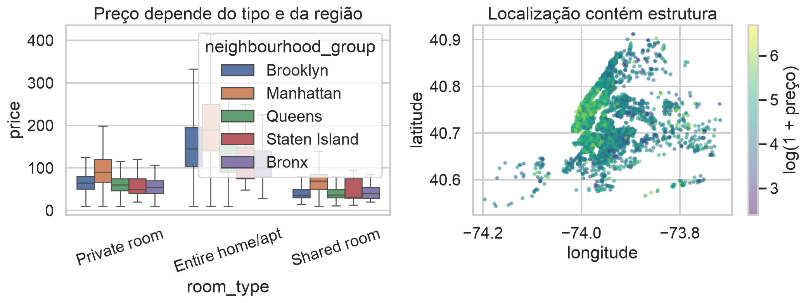
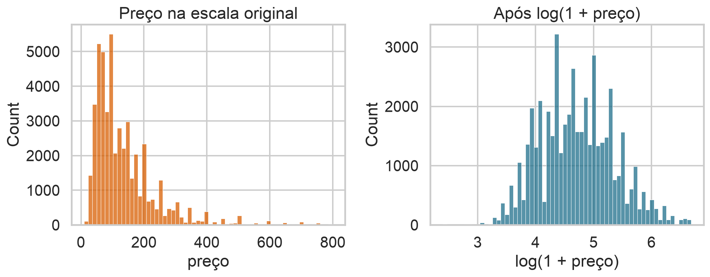
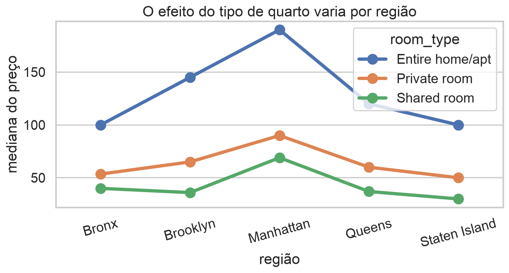
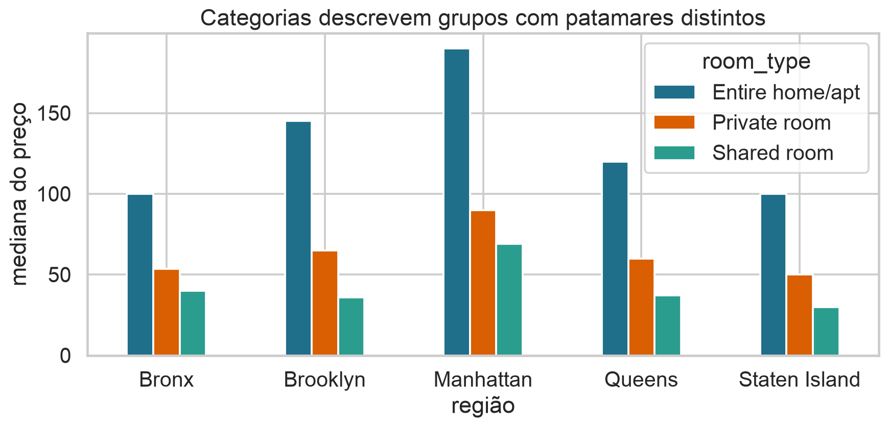
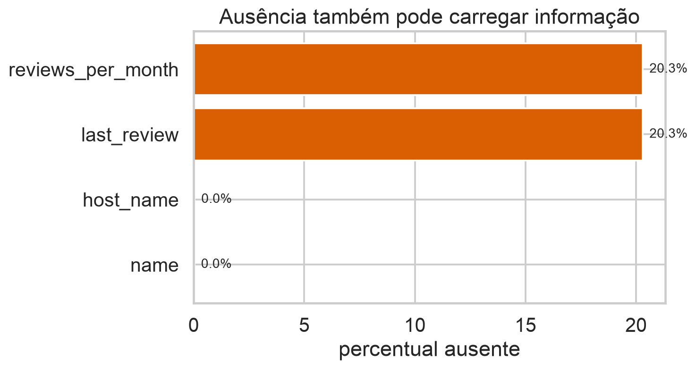
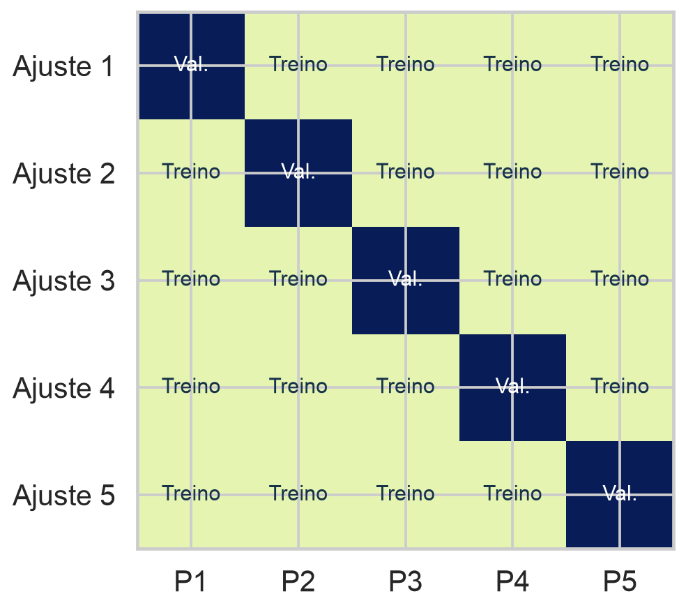
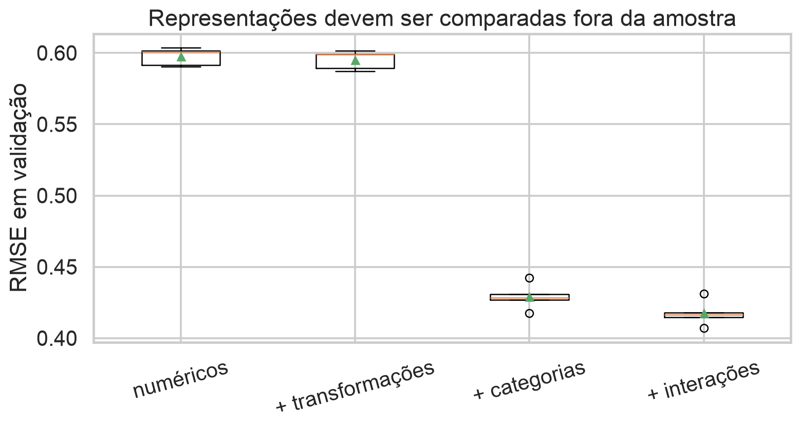

## Dados brutos raramente são a representação final

Modelos recebem números, mas tabelas reais contêm categorias, ausências, datas, textos, escalas inadequadas e relações não lineares.

> Engenharia de atributos transforma conhecimento sobre o problema em uma matriz que o modelo consegue explorar.

## Hoje

- formalizar transformações por uma função $\phi$;
- construir atributos numéricos, categóricos, temporais e textuais;
- tratar valores ausentes sem criar vazamento;
- organizar transformações em pipelines;
- separar treino, validação e teste;
- usar validação cruzada para comparar representações.

## Base de dados de apoio

Usaremos **New York City Airbnb Open Data**, do Kaggle:

- aproximadamente 49 mil anúncios de 2019;
- resposta: preço diário;
- localização, tipo de quarto, disponibilidade e avaliações;
- nomes de anúncios e datas permitem discutir texto e tempo.

## O que é cada linha?

Cada observação representa um anúncio. Colunas importantes:

| coluna | significado |
|---|---|
| `price` | preço diário anunciado |
| `room_type` | tipo de acomodação |
| `neighbourhood_group` | grande região de Nova York |
| `latitude`, `longitude` | localização |
| `reviews_per_month` | frequência de avaliações |
| `name` | título livre do anúncio |

## Preço depende de representação e contexto

{.wide-chart fig-alt="Preço por tipo de quarto e região, e mapa de anúncios colorido pelo log do preço."}

Tipo de quarto, região e posição espacial carregam informações complementares.

<details class="code-fold"><summary>Código do gráfico</summary>
```python
sns.boxplot(data=df, x="room_type", y="price", hue="neighbourhood_group")
plt.scatter(df.longitude, df.latitude, c=np.log1p(df.price))
```
</details>

## O modelo enxerga uma matriz

Uma transformação de atributos é uma função

$$\phi:\mathcal X\rightarrow\mathbb R^p,$$

que leva uma observação bruta $x\in\mathcal X$ ao vetor

$$\phi(x)=(\phi_1(x),\ldots,\phi_p(x))^T.$$

$p$ é o número de atributos produzidos.

## A relação continua linear nos parâmetros

Após transformar $x$,

$$\widehat y=\beta_0+\sum_{j=1}^p\beta_j\phi_j(x)=\beta_0+\phi(x)^T\beta.$$

O modelo pode ser não linear em $x$ e continuar linear em $\beta$.

Isso preserva os métodos de ajuste das aulas anteriores.

Para uma coluna que já possui significado e escala adequados,

$$\phi_j(x_j)=x_j.$$

Engenharia de atributos não exige alterar tudo. Cada transformação deve responder a uma necessidade substantiva ou estatística.

## Transformações podem corrigir assimetria

Para valores não negativos,

$$z=\log(1+x)$$

comprime diferenças grandes e preserva $x=0$.

Ela pode ser útil para preços, contagens e tempos de espera assimétricos.

## O log muda a geometria da resposta

{.wide-chart fig-alt="Distribuição do preço antes e depois da transformação log1p."}

O log reduz a dominância da cauda direita; não torna automaticamente o modelo correto.

<details class="code-fold"><summary>Código do gráfico</summary>
```python
sns.histplot(df["price"])
sns.histplot(np.log1p(df["price"]))
```
</details>

## Polinômios criam curvatura

Para um atributo $x$,

$$\phi(x)=(x,x^2,\ldots,x^d)^T.$$

Então

$$E[Y\mid x]=\beta_0+\beta_1x+\cdots+\beta_dx^d.$$

$d$ controla a flexibilidade e deve ser escolhido fora do treino.

## A matriz muda, não o algoritmo básico

Para grau 3,

$$
\Phi=
\begin{bmatrix}
1&x_1&x_1^2&x_1^3\\
\vdots&\vdots&\vdots&\vdots\\
1&x_n&x_n^2&x_n^3
\end{bmatrix}.
$$

Substituímos $X$ por $\Phi$ no ajuste linear.

## Interações permitem efeitos condicionais

Com duas variáveis,

$$E[Y\mid x_1,x_2]=\beta_0+\beta_1x_1+\beta_2x_2+\beta_3x_1x_2.$$

O efeito de $x_1$ é

$$\frac{\partial E[Y\mid x]}{\partial x_1}=\beta_1+\beta_3x_2.$$

Logo, ele depende do valor de $x_2$.

## Tipo de quarto interage com região

{.wide-chart fig-alt="Medianas de preço por região conectadas separadamente para cada tipo de quarto."}

As linhas não são paralelas: a diferença entre tipos de quarto varia entre regiões.

<details class="code-fold"><summary>Código do gráfico</summary>
```python
median = df.groupby(["neighbourhood_group", "room_type"]).price.median()
sns.pointplot(data=median.reset_index(), x="neighbourhood_group", y="price", hue="room_type")
```
</details>

## Categorias não são números comuns

Codificar regiões como Brooklyn = 1, Manhattan = 2 e Queens = 3 imporia:

- uma ordem inexistente;
- distâncias artificiais;
- o mesmo incremento entre categorias consecutivas.

Para categorias nominais, usamos indicadores.

## One-hot encoding cria indicadores

Para categorias $c_1,\ldots,c_K$,

$$z_k=\mathbb 1(x=c_k).$$

Cada coluna responde se a observação pertence à categoria $k$. Não há ordem ou distância implícita.

## Uma categoria vira referência

Com intercepto, as $K$ colunas one-hot somam 1 e geram dependência linear perfeita.

Usamos $K-1$ indicadores. A categoria omitida é a referência; mudar a referência altera coeficientes, mas não previsões ajustadas.

## Categorias descrevem patamares distintos

{.wide-chart fig-alt="Mediana do preço por região e tipo de quarto."}

Indicadores permitem que o modelo represente diferenças de nível entre esses grupos.

<details class="code-fold"><summary>Código do gráfico</summary>
```python
summary = df.groupby(["neighbourhood_group", "room_type"]).price.median()
summary.unstack().plot(kind="bar")
```
</details>

## Categorias ordinais preservam ordem

Uma variável como `baixo < médio < alto` possui ordenação, mas as distâncias continuam desconhecidas.

Opções:

- indicadores separados;
- escores ordenados, quando a distância é defensável;
- codificações monotônicas em modelos que as suportam.

Conhecimento de domínio decide a representação.

## Ausência é um processo, não apenas um vazio

Um valor pode faltar porque:

- não foi coletado;
- não se aplica;
- depende do comportamento observado;
- houve falha no sistema.

Antes de imputar, pergunte por que ele está ausente.

## Ausência de avaliações é frequente

{.wide-chart fig-alt="Percentual de valores ausentes em quatro colunas do Airbnb."}

`reviews_per_month` ausente coincide frequentemente com nenhum histórico de avaliações.

<details class="code-fold"><summary>Código do gráfico</summary>
```python
missing_rate = df[["last_review", "reviews_per_month", "name", "host_name"]].isna().mean()
```
</details>

## Imputação e indicador respondem perguntas distintas

Podemos construir

$$x_j^{imp}=\begin{cases}x_j,&\text{observado}\\m_j,&\text{ausente}\end{cases}$$

e

$$r_j=\mathbb 1(x_j\text{ está ausente}).$$

$m_j$ é, por exemplo, a mediana aprendida no treino; $r_j$ preserva o sinal de ausência.

Excluir observações pode ser razoável quando a ausência é rara e não sistemática.

Se a probabilidade de remoção depende da resposta ou do grupo, a amostra restante pode mudar. Sempre reporte quantas linhas e quais grupos foram afetados.

## Datas podem gerar atributos cíclicos

De uma data extraímos ano, mês, dia da semana ou tempo desde um evento.

Para mês $m\in\{1,\ldots,12\}$:

$$s=\sin(2\pi m/12),\qquad c=\cos(2\pi m/12).$$

Assim dezembro permanece próximo de janeiro.

## Texto começa com uma representação

Bag-of-words usa uma coluna por termo:

$$x_{ij}=\text{contagem do termo }j\text{ no documento }i.$$

TF-IDF reduz o peso de termos muito frequentes. Representações modernas usam embeddings, mas o princípio permanece: texto precisa virar vetor.

## Atributos simples de texto também ajudam

No título do anúncio podemos extrair:

- tamanho do texto;
- presença de palavras definidas pelo domínio;
- número de símbolos ou dígitos;
- idioma provável.

São atributos interpretáveis, mas podem capturar práticas de plataforma que mudam no tempo.

## Identificadores raramente generalizam

`id` e `host_id` podem permitir memorização sem aprender uma relação transferível.

Um identificador só deve entrar quando há uma justificativa para repetir entidades e quando a divisão de dados respeita essa estrutura.

## Quiz: codificando regiões {.quiz-question}

- [Usar indicadores e omitir uma referência quando há intercepto]{.correct data-explanation="Isso evita impor ordem e remove dependência linear perfeita."}
- [Atribuir números de 1 a 5 em ordem alfabética]{data-explanation="A codificação cria distâncias artificiais."}
- [Usar apenas o código postal como número contínuo]{data-explanation="Códigos postais são identificadores geográficos, não medidas lineares."}

## Vazamento transforma informação futura em atributo

Há vazamento quando uma feature usa informação indisponível no momento da previsão ou deriva direta ou indiretamente da resposta.

Exemplo: usar avaliações publicadas depois da data em que o preço deveria ser previsto.

O desempenho parece excelente, mas não pode ser reproduzido em produção.

## Transformações também aprendem parâmetros

Imputação aprende $m_j$; padronização aprende $\bar x_j$ e $s_j$; vocabulário aprende quais termos existem.

Esses parâmetros devem ser estimados apenas com dados de treinamento e depois aplicados sem reajuste à validação e ao teste.

## Pipeline mantém a ordem correta

$$x\xrightarrow{\text{imputar}}x^{imp}
\xrightarrow{\text{codificar}}z
\xrightarrow{\text{padronizar}}\widetilde z
\xrightarrow{\text{modelo}}\widehat y.$$

Uma pipeline reúne transformação e modelo em um único procedimento ajustável.

## Escolher atributos também é ajustar o modelo

Decidir usar log, polinômios, interações ou categorias altera a classe de funções considerada.

Logo, comparar representações pelo erro de treino é otimista. Precisamos medir cada pipeline em dados que não participaram de seu ajuste.

## Treino, validação e teste têm papéis distintos

- **treino:** estima transformações e parâmetros;
- **validação:** compara representações e hiperparâmetros;
- **teste:** estima o desempenho final após todas as escolhas.

Consultar repetidamente o teste o transforma em validação.

## Uma única validação depende da divisão

Com poucos dados, mudar quais observações ficaram na validação pode alterar a conclusão.

Validação cruzada reutiliza o conjunto de desenvolvimento em várias divisões, mantendo o teste separado.

## Validação cruzada em $K$ partes

Particione os índices de desenvolvimento em conjuntos disjuntos

$$I_1,\ldots,I_K,\qquad \bigcup_{k=1}^K I_k=\{1,\ldots,n\}.$$

Na repetição $k$, valide em $I_k$ e treine nos demais índices.

## Cada observação valida uma vez

{.wide-chart fig-alt="Matriz com cinco ajustes, cada um usando uma parte diferente para validação."}

Os modelos intermediários servem para estimar desempenho, não são o modelo final entregue.

<details class="code-fold"><summary>Código do gráfico</summary>
```python
folds = np.array_split(rng.permutation(n), 5)
for k in range(5):
    valid = folds[k]
    train = np.concatenate(folds[:k] + folds[k+1:])
```
</details>

## A perda de validação cruzada

Para pipeline candidata $m$,

$$\widehat R_{CV}(m)=\frac1K\sum_{k=1}^K
\frac1{|I_k|}\sum_{i\in I_k}L(y_i,\widehat f_m^{(-k)}(x_i)).$$

$\widehat f_m^{(-k)}$ é ajustada sem a parte $k$; $L$ é a perda escolhida.

## Todo o ajuste ocorre dentro de cada repetição

Em cada parte:

1. aprenda imputação, categorias e escala no treino;
2. transforme treino e validação com esses parâmetros;
3. ajuste o modelo no treino transformado;
4. calcule a perda na validação.

Pré-processar antes das partes causa vazamento.

## A média responde; a dispersão adverte

Além de $\widehat R_{CV}$, observe a variação das perdas entre partes.

Uma média pequena com grande dispersão indica que o desempenho depende fortemente das observações escolhidas ou de grupos específicos.

## Representações competem fora da amostra

{.wide-chart fig-alt="Distribuições de RMSE em cinco partes para quatro conjuntos crescentes de atributos."}

Categorias produzem o maior ganho; interações acrescentam uma melhora menor.

<details class="code-fold"><summary>Código do gráfico</summary>
```python
for feature_set in candidates:
    scores[feature_set] = evaluate_kfold(pipeline(feature_set), K=5)
```
</details>

## O resultado também ensina sobre o problema

- localização numérica isolada não representa todas as diferenças urbanas;
- tipo de quarto e região explicam grande parte do preço;
- transformações simples ajudam pouco neste conjunto;
- interações capturam diferenças condicionais adicionais.

Engenharia de atributos é uma hipótese testável sobre representação.

## Depois de escolher, reajuste no desenvolvimento

Escolhida a pipeline $m^*$:

1. reúna novamente todos os dados de desenvolvimento;
2. reajuste transformação e modelo do zero;
3. avalie uma única vez no teste;
4. reporte a métrica e todas as escolhas realizadas.

## Partições aleatórias exigem observações intercambiáveis

K-fold aleatório pressupõe que as partes representam aproximadamente o mesmo mecanismo gerador.

Se há tempo, pessoas repetidas, hospitais ou cidades, misturar observações relacionadas entre treino e validação pode produzir otimismo.

$K=5$ ou $10$ são escolhas comuns; valores maiores aproximam o tamanho do treino final, mas elevam o custo. Não há um $K$ ótimo universal.

## A estrutura dos dados define a divisão

- **temporal:** treinar no passado e validar no futuro;
- **grupos:** manter todas as observações de uma pessoa ou entidade na mesma parte;
- **classes raras:** preservar aproximadamente suas proporções;
- **dados espaciais:** considerar separação por regiões.

O esquema deve simular o uso real do modelo.

## Quiz: onde ajustar a imputação? {.quiz-question}

- [No treino de cada parte e depois aplicá-la à validação]{.correct data-explanation="A mediana ou outra regra é um parâmetro aprendido e não pode consultar a validação."}
- [Uma vez em toda a base antes de criar as partes]{data-explanation="Isso permite que cada validação influencie sua própria transformação."}
- [Separadamente na validação]{data-explanation="A validação deve receber a transformação aprendida no treino."}

## Quiz: anúncios repetidos por anfitrião {.quiz-question}

- [Manter anúncios do mesmo anfitrião na mesma parte]{.correct data-explanation="Isso evita que padrões específicos do anfitrião atravessem treino e validação."}
- [Distribuí-los igualmente entre todas as partes]{data-explanation="Isso pode tornar a avaliação otimista por dependência entre observações."}
- [Usar o identificador do anfitrião como variável contínua]{data-explanation="O número do identificador não possui escala quantitativa."}

## O que levamos desta aula

- $\phi(x)$ define o que o modelo consegue enxergar;
- transformações incorporam hipóteses e conhecimento de domínio;
- categorias, ausências, datas e textos exigem representações próprias;
- pipelines impedem inconsistência e vazamento;
- validação cruzada compara pipelines sem consumir o teste;
- a divisão deve reproduzir a dependência e o futuro relevantes.

## Próxima aula

**KNN e a prática de machine learning**

Usaremos distância, padronização, validação cruzada e métricas para percorrer um fluxo completo de modelagem.

## Bibliografia

- James et al., *An Introduction to Statistical Learning*, caps. 5 e 6.
- Kuhn e Johnson, *Feature Engineering and Selection*.
- Zheng e Casari, *Feature Engineering for Machine Learning*.
- Data 100, capítulos sobre feature engineering, validação e generalização.
