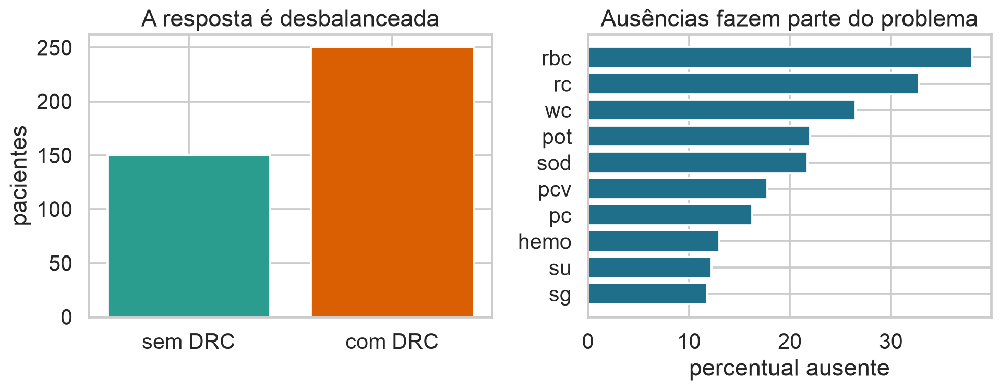
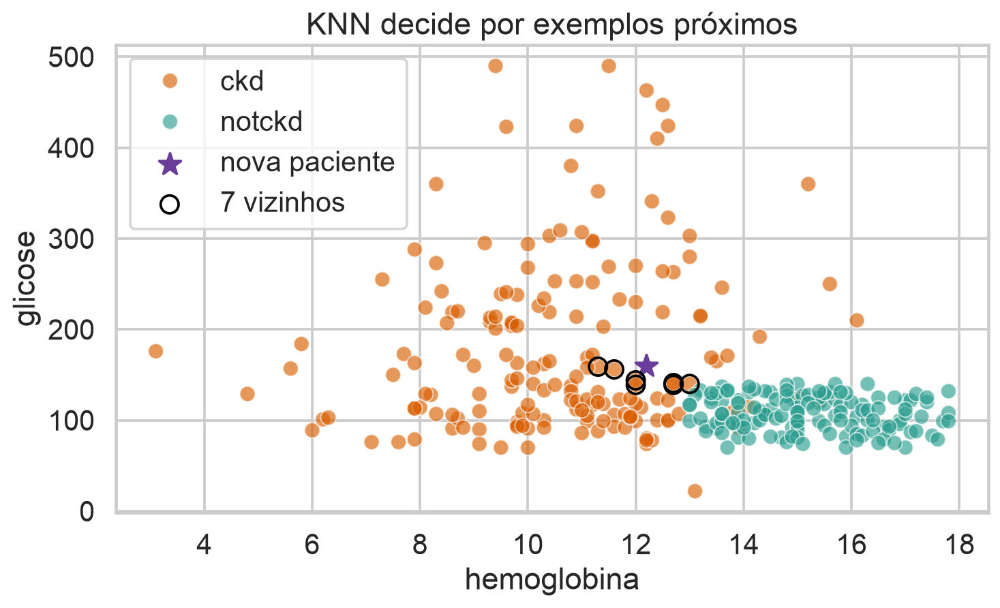
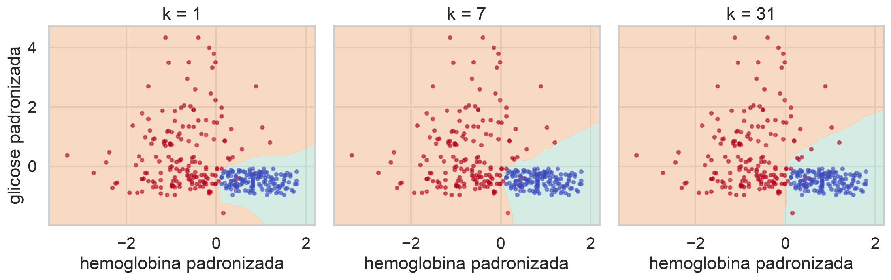
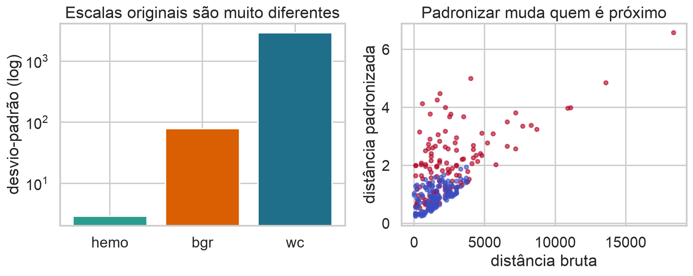
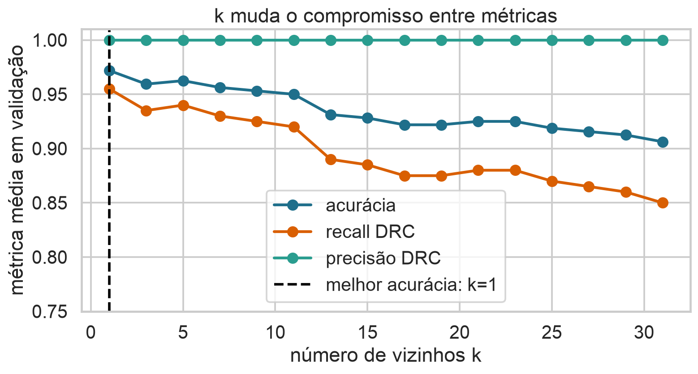
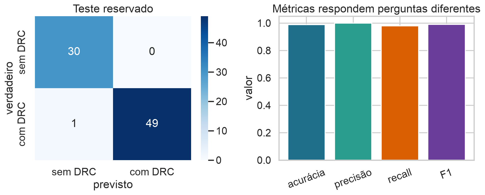
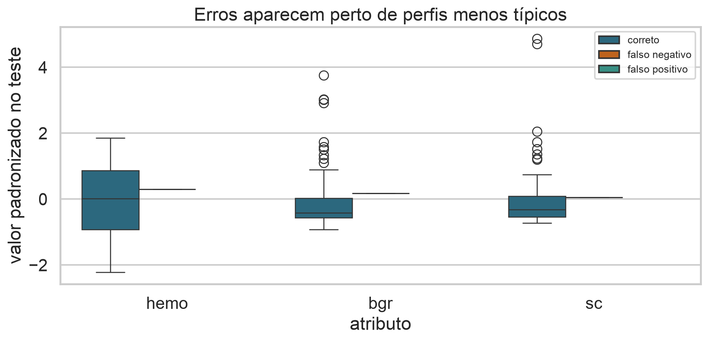

## Um algoritmo simples, uma prática exigente

KNN classifica uma observação olhando exemplos próximos.

> A matemática do modelo é curta; construir uma análise confiável exige decisões cuidadosas em toda a pipeline.

## Hoje

- formular classificação supervisionada;
- compreender KNN e suas hipóteses;
- tratar escalas, ausências e atributos categóricos;
- separar desenvolvimento e teste;
- escolher $k$ por validação cruzada;
- avaliar e interpretar erros.

## O problema de apoio

Podemos reconhecer perfis associados à doença renal crônica (DRC) a partir de medidas clínicas?

- entrada: exames e indicadores clínicos;
- resposta: DRC ou ausência de DRC;
- unidade: paciente;
- tarefa: classificação binária.

## Base de dados de apoio

O conjunto **Chronic Kidney Disease** contém 400 registros e 24 atributos preditores, com variáveis numéricas, categóricas e valores ausentes.

[Fonte no Kaggle](https://www.kaggle.com/datasets/mansoordaku/ckdisease)

::: {.callout-warning}
Uso exclusivamente didático. Um modelo clínico exigiria validação externa, governança, avaliação de vieses e supervisão profissional.
:::

## O que há nas colunas?

::: {.columns}
::: {.column width="50%"}
**Medidas numéricas**

idade, pressão arterial, glicose, ureia, creatinina, sódio, potássio e hemoglobina.
:::
::: {.column width="50%"}
**Indicadores categóricos**

hipertensão, diabetes, anemia, edema, apetite e aspectos celulares.
:::
:::

`classification` é a resposta: `ckd` ou `notckd`.

## Antes do modelo: descreva a base

{.wide-chart fig-alt="Distribuição da resposta e percentuais de dados ausentes."}

A resposta não é perfeitamente equilibrada e algumas variáveis têm muitas ausências.

<details class="code-fold"><summary>Código do gráfico</summary>
```python
df.classification.value_counts()
df.drop(columns=["id", "classification"]).isna().mean().sort_values()
```
</details>

## Formalizando a tarefa

Observamos um conjunto de treinamento

$$\mathcal D=\{(x_i,y_i)\}_{i=1}^{n},$$

em que $x_i\in\mathcal X$ descreve o paciente $i$ e $y_i\in\{0,1\}$ indica a classe.

Queremos construir $\hat f:\mathcal X\rightarrow\{0,1\}$ que generalize para novos pacientes.

## KNN aprende de forma diferente

KNN não estima antecipadamente uma equação paramétrica.

- armazena os exemplos de treinamento;
- calcula distâncias quando chega uma nova observação;
- decide usando os vizinhos mais próximos.

Por isso é chamado de método baseado em instâncias.

## A intuição em duas dimensões

{.wide-chart fig-alt="Paciente nova e seus sete vizinhos em hemoglobina e glicose."}

A estrela recebe a classe predominante entre os sete pontos circulados.

<details class="code-fold"><summary>Código do gráfico</summary>
```python
dist = np.linalg.norm((X - x_novo) / X.std(axis=0), axis=1)
vizinhos = np.argsort(dist)[:7]
```
</details>

## Distância euclidiana

Para $x=(x_1,\ldots,x_p)$ e $z=(z_1,\ldots,z_p)$,

$$d_2(x,z)=\sqrt{\sum_{j=1}^{p}(x_j-z_j)^2}.$$

- $p$: número de atributos;
- $x_j,z_j$: valores do atributo $j$;
- cada diferença mede separação em uma coordenada.

## Regra de classificação

Seja $N_k(x)$ o conjunto dos índices das $k$ observações de treinamento com menor distância até $x$. Para $y_i\in\{0,1\}$,

$$\hat p_k(x)=\frac{1}{k}\sum_{i\in N_k(x)}y_i$$

é a proporção local da classe 1. Com limiar $1/2$,

$$\hat f_k(x)=\mathbb 1\{\hat p_k(x)\geq 1/2\}.$$

## Exemplo à mão

Para $k=5$, suponha que os rótulos dos vizinhos sejam

$$1,\;1,\;0,\;1,\;0.$$

Então $\hat p_5(x)=3/5=0{,}60$ e a previsão é classe 1.

Esse valor é uma frequência local, não uma probabilidade automaticamente calibrada.

## Quiz: faça a previsão

::: {.quiz}
Para $k=7$, os vizinhos têm rótulos $0,1,1,0,1,1,0$. Qual é a previsão com limiar $0{,}5$?

- [ ] classe 0, pois há três zeros
- [x] classe 1, pois $4/7>0{,}5$
- [ ] não é possível prever
- [ ] depende da distância do oitavo vizinho
:::

## $k$ controla a flexibilidade

{.wide-chart fig-alt="Fronteiras do KNN para k igual a 1, 7 e 31."}

$k$ pequeno produz fronteiras irregulares; $k$ grande suaviza e pode apagar estruturas locais.

<details class="code-fold"><summary>Código do gráfico</summary>
```python
for k in [1, 7, 31]:
    model = KNeighborsClassifier(n_neighbors=k).fit(X, y)
    region = model.predict(grid)
```
</details>

## Viés e variância

- $k$ pequeno: baixo viés, alta variância;
- $k$ grande: maior viés, menor variância.

Escolher $k$ é escolher uma complexidade. O melhor valor não deve ser decidido olhando o conjunto de teste.

## A distância define “semelhança”

Dois pacientes só são próximos segundo a representação escolhida.

Sem uma transformação adequada, um atributo com números grandes pode dominar a distância mesmo sem ser mais informativo.

## Padronização

Para o atributo $j$,

$$z_{ij}=\frac{x_{ij}-\bar x_j}{s_j},$$

em que $\bar x_j$ e $s_j$ são média e desvio-padrão calculados **apenas no treinamento**.

Após a transformação, cada atributo numérico fica em escala comparável.

## Padronizar muda os vizinhos

{.wide-chart fig-alt="Escalas distintas e comparação das distâncias bruta e padronizada."}

A ordem de proximidade pode mudar substancialmente.

<details class="code-fold"><summary>Código do gráfico</summary>
```python
Z = (X - X.mean(axis=0)) / X.std(axis=0)
d_padronizada = np.linalg.norm(Z - z_novo, axis=1)
```
</details>

## Distâncias alternativas

A família de Minkowski é

$$d_q(x,z)=\left(\sum_{j=1}^{p}|x_j-z_j|^q\right)^{1/q}.$$

- $q=1$: Manhattan;
- $q=2$: euclidiana;
- a escolha expressa uma hipótese sobre proximidade.

## E atributos categóricos?

Uma opção simples é codificar categorias com indicadores 0/1.

Mas a distância resultante depende de quantas categorias cada variável gera. Métricas mistas, como Gower, podem ser mais naturais em outros problemas.

## Valores ausentes

KNN precisa de coordenadas comparáveis. Nesta aula:

- numéricas: imputação pela mediana;
- categóricas: categoria mais frequente;
- parâmetros da imputação aprendidos no treinamento.

Imputar não recupera informação ausente; é uma decisão de modelagem.

## Tudo deve estar na pipeline

$$X\xrightarrow{\text{imputar}}X'\xrightarrow{\text{codificar/padronizar}}Z\xrightarrow{\text{KNN}}\hat y.$$

A pipeline garante que cada etapa seja ajustada somente nos dados permitidos em cada divisão.

## Quiz: onde está o vazamento?

::: {.quiz}
Qual procedimento usa informação do teste antes da avaliação final?

- [ ] estratificar a divisão pela resposta
- [x] calcular média e desvio-padrão com a base completa
- [ ] escolher $k$ por validação no desenvolvimento
- [ ] relatar a matriz de confusão no teste
:::

## Separação desenvolvimento–teste

Dividimos os dados uma única vez:

$$\mathcal D=\mathcal D_{dev}\;\dot\cup\;\mathcal D_{test}.$$

- desenvolvimento: aprender transformações e escolher $k$;
- teste: estimar desempenho do procedimento pronto;
- estratificação: preserva aproximadamente as proporções das classes.

## Um baseline antes do KNN

Prever sempre a classe majoritária fornece

$$\operatorname{Acc}_{base}=\max\{\hat p,1-\hat p\},$$

em que $\hat p$ é a proporção da classe 1 no desenvolvimento.

Um modelo útil precisa ser comparado com alternativas simples.

## Validação cruzada no desenvolvimento

Particionamos $\mathcal D_{dev}$ em $V$ blocos. Para cada $k$:

1. treinamos em $V-1$ blocos;
2. avaliamos no bloco restante;
3. repetimos para todos os blocos;
4. calculamos a média da métrica.

## Escolhendo $k$

{.wide-chart fig-alt="Acurácia, recall e precisão em validação para diferentes valores de k."}

Nesta divisão, $k=1$ maximiza a acurácia média. Outra métrica poderia levar a outra escolha.

<details class="code-fold"><summary>Código do gráfico</summary>
```python
cv = StratifiedKFold(5, shuffle=True, random_state=7)
scores = cross_validate(pipeline, X_dev, y_dev, cv=cv,
                        scoring=["accuracy", "precision", "recall"])
```
</details>

## Matriz de confusão

::: {.columns}
::: {.column width="52%"}
|               | Prevê 0 | Prevê 1 |
|---------------|---------|---------|
| Verdadeiro 0  | VN      | FP      |
| Verdadeiro 1  | FN      | VP      |
:::
::: {.column width="48%"}
- VP: positivo detectado;
- FN: positivo perdido;
- FP: alarme incorreto;
- VN: negativo reconhecido.
:::
:::

## Acurácia

$$\operatorname{Acurácia}=\frac{VP+VN}{VP+VN+FP+FN}.$$

É a fração total de acertos. Pode esconder desempenho ruim na classe menos frequente ou mais importante.

## Precisão

$$\operatorname{Precisão}=\frac{VP}{VP+FP}.$$

Entre os casos previstos como positivos, qual fração realmente era positiva?

É relevante quando falsos positivos são caros.

## Recall ou sensibilidade

$$\operatorname{Recall}=\frac{VP}{VP+FN}.$$

Entre os positivos reais, qual fração foi detectada?

Em triagem, perder um caso pode ser mais grave do que investigar um alarme falso.

## Escore F1

$$F_1=2\frac{\operatorname{Precisão}\times\operatorname{Recall}}{\operatorname{Precisão}+\operatorname{Recall}}.$$

É a média harmônica entre precisão e recall. Resume duas dimensões, mas não substitui a matriz de confusão.

## Quiz: qual métrica priorizar?

::: {.quiz}
Em uma primeira triagem, perder uma pessoa doente é especialmente grave. Qual métrica merece atenção direta?

- [ ] especificidade apenas
- [ ] precisão apenas
- [x] recall da classe doente
- [ ] número de atributos
:::

## Resultado no teste reservado

{.wide-chart fig-alt="Matriz de confusão e métricas no teste reservado."}

O modelo acertou 79 de 80 casos, mas o único erro foi um falso negativo. A natureza do erro importa.

<details class="code-fold"><summary>Código do gráfico</summary>
```python
final.fit(X_dev, y_dev)
pred = final.predict(X_test)
confusion_matrix(y_test, pred)
```
</details>

## Analisar erros é parte do trabalho

{.wide-chart fig-alt="Perfis padronizados de observações corretas e incorretas."}

Procure padrões: subgrupos, ausências, regiões de sobreposição e casos atípicos.

<details class="code-fold"><summary>Código do gráfico</summary>
```python
erros = X_test.assign(verdadeiro=y_test, previsto=pred)
erros.query("verdadeiro != previsto")
```
</details>

## Incerteza não desapareceu

Com apenas 80 observações no teste, uma diferença de um acerto muda a acurácia em 1,25 ponto percentual.

Uma estimativa pontual precisa ser interpretada junto ao tamanho do teste, à população amostrada e à variabilidade esperada.

## KNN ponderado pela distância

Podemos dar mais peso aos vizinhos próximos:

$$\hat p(x)=\frac{\sum_{i\in N_k(x)}w_i(x)y_i}{\sum_{i\in N_k(x)}w_i(x)},\qquad
w_i(x)=\frac{1}{d(x,x_i)+\varepsilon}.$$

$\varepsilon>0$ evita divisão por zero.

## KNN também faz regressão

Para resposta numérica,

$$\hat f_k(x)=\frac{1}{k}\sum_{i\in N_k(x)}y_i.$$

A previsão é a média local das respostas. A noção de vizinhança e os cuidados de escala continuam os mesmos.

## A maldição da dimensionalidade

Em muitas dimensões:

- as distâncias tendem a se tornar parecidas;
- regiões locais ficam pouco povoadas;
- são necessárias mais observações para encontrar vizinhos realmente próximos.

Seleção e construção de atributos tornam-se decisivas.

## Aprender a própria distância

KNN usa uma representação e uma métrica definidas previamente. Métodos de **metric learning** aprendem uma transformação em que casos relevantes ficam próximos.

É uma conexão com embeddings modernos, não uma solução automática: o objetivo aprendido e os dados continuam determinando o significado de “parecido”.

## Custo computacional

Treinamento é barato, mas prever exige comparar uma nova observação com muitos exemplos.

- custo ingênuo por consulta: aproximadamente $O(np)$;
- armazenamento: aproximadamente $O(np)$;
- índices espaciais ajudam em baixa dimensão, mas perdem eficácia em alta dimensão.

## O fluxo completo

1. formular pergunta, população, unidade e resposta;
2. descrever e auditar os dados;
3. reservar teste;
4. construir pipeline;
5. escolher modelo e hiperparâmetros no desenvolvimento;
6. avaliar uma vez no teste;
7. interpretar erros e limites;
8. monitorar se houver implantação.

## O que pode dar errado depois?

- população futura diferente da amostra;
- mudança na coleta ou nos equipamentos;
- ausência com mecanismo diferente;
- uso do modelo fora do momento previsto;
- custos assimétricos ignorados;
- confiança indevida em uma única métrica.

## Checklist de uma análise defensável

- [ ] alvo e momento da previsão definidos;
- [ ] teste isolado;
- [ ] transformações dentro da pipeline;
- [ ] baseline relatado;
- [ ] métrica escolhida pelo problema;
- [ ] erros inspecionados;
- [ ] limitações e escopo documentados.

## Síntese

- KNN decide por vizinhanças no espaço de atributos;
- escala, representação e distância definem quem é próximo;
- $k$ controla flexibilidade;
- validação escolhe; teste estima generalização;
- métricas diferentes respondem perguntas diferentes;
- prática de ML é um procedimento, não apenas um algoritmo.

## Próxima aula

Na Aula 26, mudaremos a representação com PCA e construiremos fronteiras de margem com SVM.

## Bibliografia

- James et al., *An Introduction to Statistical Learning*, capítulos 2, 4 e 5.
- Géron, *Hands-On Machine Learning*, capítulos 2 e 3.
- Kuhn e Johnson, *Applied Predictive Modeling*, capítulos 4, 7 e 13.
- Hastie, Tibshirani e Friedman, *The Elements of Statistical Learning*, capítulos 2 e 13.
- Kaggle/UCI, *Chronic Kidney Disease Dataset*.
