## Dois métodos, uma pipeline

PCA reorganiza a representação; SVM constrói uma fronteira de decisão.

> Em ciência de dados, o ganho aparece quando representação, modelo e avaliação são tratados como um único procedimento.

## Hoje

- revisitar PCA por compressão e visualização;
- usar o gato como exemplo de aproximação de baixo posto;
- aplicar PCA a imagens do Fashion-MNIST;
- revisar margem, vetores de suporte e kernels;
- combinar PCA e SVM em uma pipeline validada;
- discutir custo, interpretação e limites.

## Comece com uma imagem conhecida

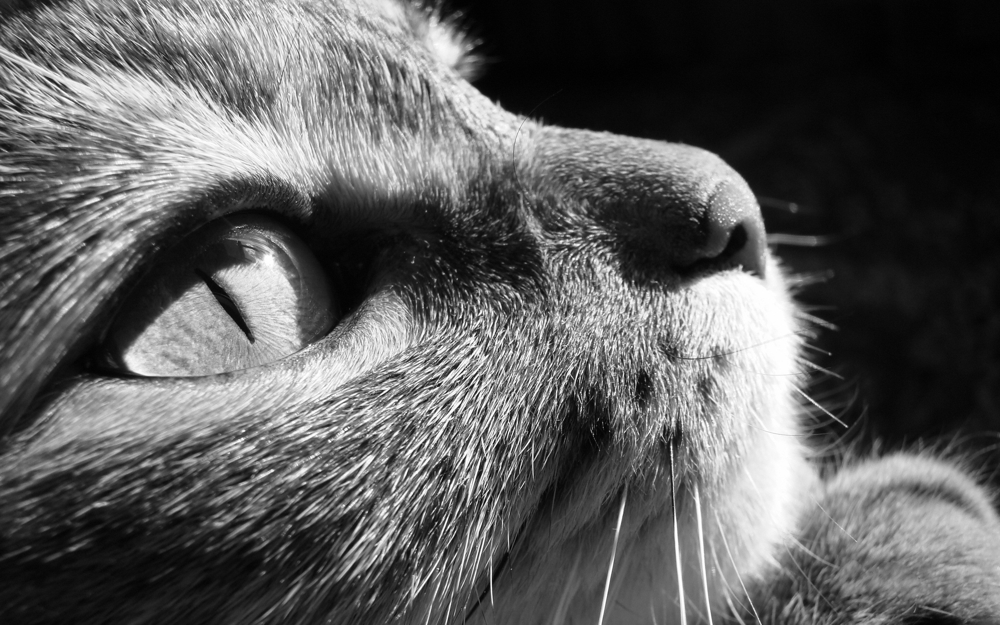{fig-alt="Fotografia de um gato usada como exemplo de compressão por baixo posto." width="72%"}

Em tons de cinza, a imagem é uma matriz $A\in\mathbb R^{m\times n}$: cada posição guarda a intensidade de um pixel.

## Aproximar a matriz comprime a imagem

Se

$$A=U\Sigma V^T,$$

a aproximação de posto $k$ é

$$A_k=U_k\Sigma_kV_k^T=\sum_{j=1}^k\sigma_ju_jv_j^T.$$

Guardamos apenas os $k$ padrões dominantes.

## O posto controla detalhe e armazenamento

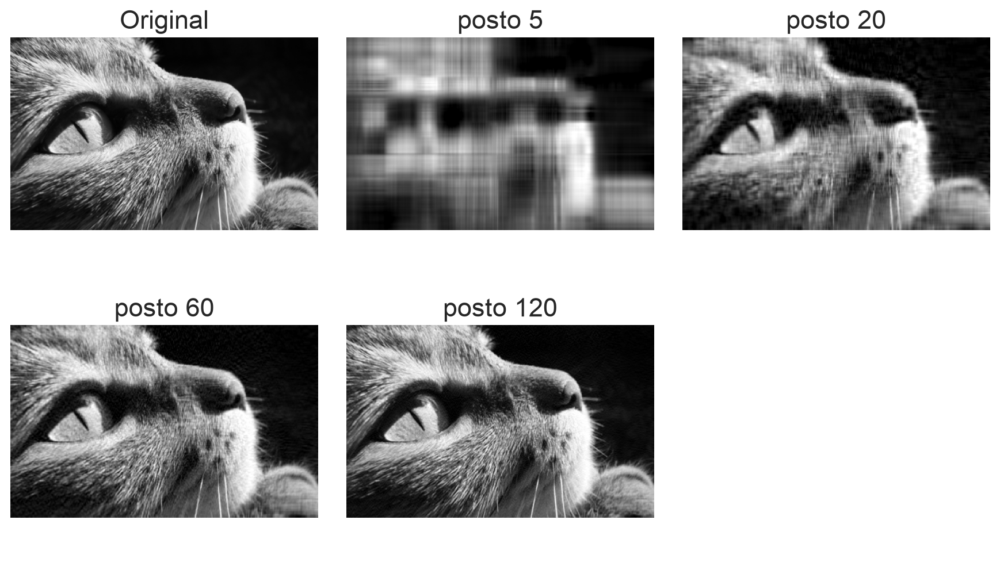{fig-alt="Gato original e aproximações de postos 5, 20, 60 e 120." width="76%"}

Poucos componentes preservam estrutura global; detalhes finos reaparecem conforme $k$ cresce.

<details class="code-fold"><summary>Código do gráfico</summary>
```python
U, s, Vt = np.linalg.svd(image, full_matrices=False)
Ak = (U[:, :k]*s[:k]) @ Vt[:k]
```
</details>

## Quanto realmente armazenamos?

A matriz original guarda $mn$ números. A aproximação guarda

$$mk+k+kn=k(m+n+1).$$

A fração de armazenamento é

$$r_k=\frac{k(m+n+1)}{mn}.$$

Compressão só ocorre quando $r_k<1$.

## Qualidade e compressão competem

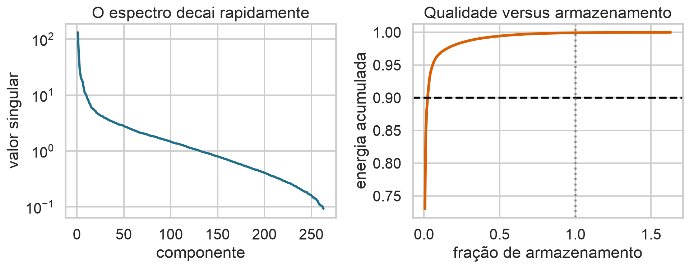{.wide-chart fig-alt="Decaimento dos valores singulares e energia acumulada contra fração de armazenamento."}

O espectro informa quantas direções são necessárias; a escolha final depende da perda aceitável na aplicação.

<details class="code-fold"><summary>Código do gráfico</summary>
```python
energy = np.cumsum(s**2)/np.sum(s**2)
storage = k*(m+n+1)/(m*n)
```
</details>

## PCA aplica a mesma ideia a observações

Agora $X\in\mathbb R^{n\times p}$ tem:

- $n$ observações nas linhas;
- $p$ atributos nas colunas;
- colunas centralizadas antes da decomposição.

PCA encontra novas direções ortogonais que concentram a variação da amostra.

## Uma revisão geométrica suficiente

Para $X_c=X-\mathbf 1\bar x^T$,

$$X_c=U\Sigma V^T.$$

As colunas de $V$ são direções principais; os escores são

$$Z=X_cV_k.$$

$Z\in\mathbb R^{n\times k}$ representa cada observação em $k$ componentes.

## Variância explicada ordena componentes

Para componente $j$,

$$\operatorname{PVE}_j=\frac{\sigma_j^2}{\sum_{\ell=1}^{r}\sigma_\ell^2}.$$

$\sigma_j$ é o valor singular; $r$ é o posto de $X_c$. A soma acumulada mede a variação preservada pelas primeiras $k$ direções.

## PCA não usa a resposta

PCA maximiza variação de $X$, não separação entre classes nem previsão de $Y$.

Uma direção de baixa variância pode ser muito útil para classificar. Portanto, “90% de variância” é um diagnóstico, não uma garantia preditiva.

## Base de dados de apoio

Usaremos **Fashion-MNIST**, disponível no Kaggle:

- imagens $28\times28$ em tons de cinza;
- 784 pixels usados como atributos;
- 10 classes de roupas e acessórios;
- amostra local balanceada com 6.000 imagens.

## As classes têm formas e ambiguidades reais

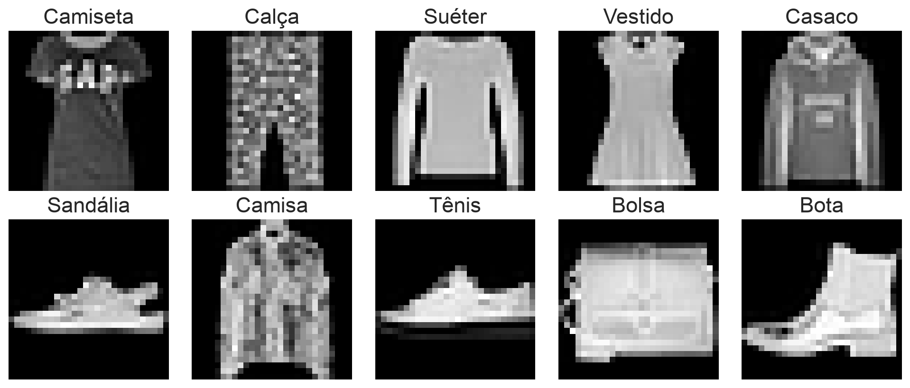{.wide-chart fig-alt="Uma imagem de cada uma das dez classes do Fashion-MNIST."}

Camisa, camiseta, suéter e casaco compartilham contornos; calçados e bolsa são mais distintos.

<details class="code-fold"><summary>Código do gráfico</summary>
```python
for label in range(10):
    plt.imshow(images[labels == label][0], cmap="gray")
```
</details>

## Imagem vira uma linha da matriz

Cada matriz $28\times28$ é vetorizada:

$$x_i\in\mathbb R^{784}.$$

Dividimos intensidades por 255 para obter valores em $[0,1]$. Como todos os atributos são pixels na mesma escala, centramos, mas não precisamos padronizar cada pixel por variância nesta aplicação.

## Escolher $k$ começa pelo espectro

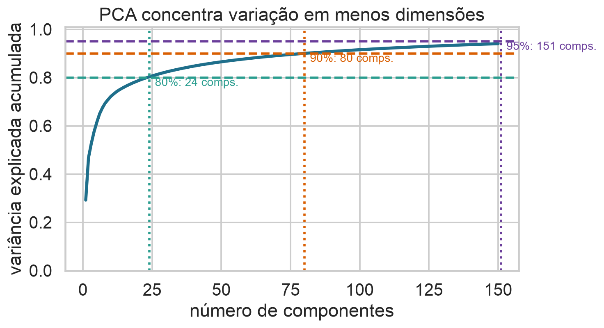{.wide-chart fig-alt="Variância explicada acumulada do PCA no Fashion-MNIST."}

A curva revela retornos decrescentes: cada componente adicional preserva menos variação inédita.

<details class="code-fold"><summary>Código do gráfico</summary>
```python
pca.fit(X_train)
cum = np.cumsum(pca.explained_variance_ratio_)
```
</details>

## Duas componentes servem para explorar

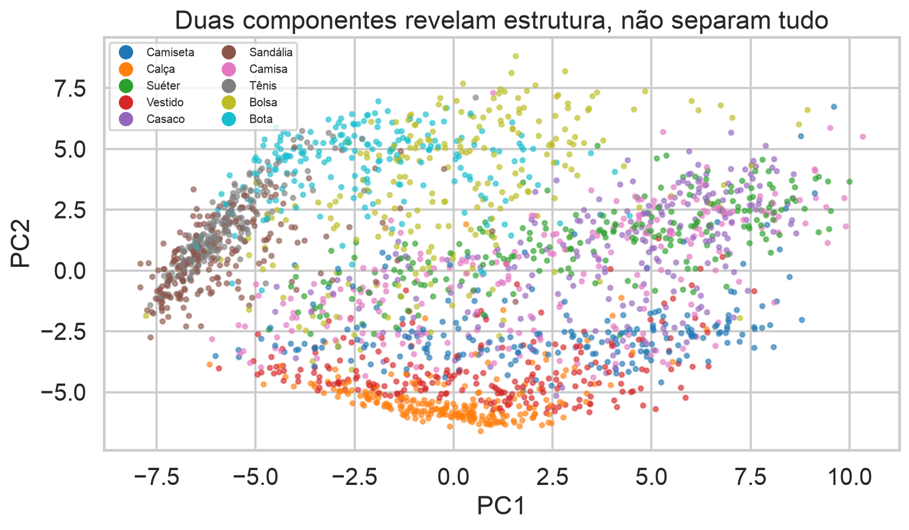{.wide-chart fig-alt="Projeção de imagens do Fashion-MNIST nas duas primeiras componentes, coloridas por classe."}

Algumas classes formam regiões, mas há muita sobreposição. Visualização em 2D não mede o desempenho disponível em 50 dimensões.

<details class="code-fold"><summary>Código do gráfico</summary>
```python
Z = PCA(n_components=2).fit_transform(X_train)
plt.scatter(Z[:, 0], Z[:, 1], c=y_train)
```
</details>

## Reconstrução torna a perda concreta

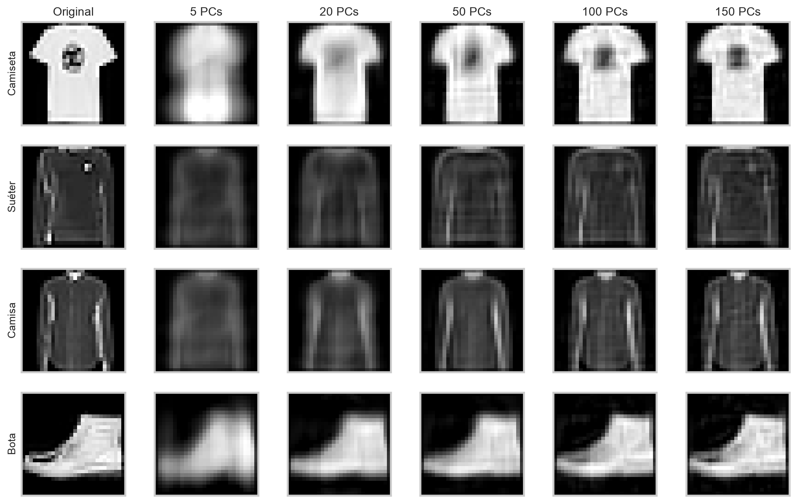{.wide-chart fig-alt="Quatro roupas reconstruídas com 5, 20, 50, 100 e 150 componentes."}

Com 50 componentes, a identidade visual já é preservada, embora detalhes de textura desapareçam.

<details class="code-fold"><summary>Código do gráfico</summary>
```python
Z = pca.transform(X)
X_reconstructed = pca.mean_ + Z[:, :k] @ pca.components_[:k]
```
</details>

## Quiz: PCA para classificação {.quiz-question}

- [O número de componentes deve ser validado com a pipeline de classificação]{.correct data-explanation="Variância explicada não mede diretamente separação nem erro preditivo."}
- [Sempre escolha exatamente 90% da variância]{data-explanation="O limiar é uma heurística, não um ótimo universal."}
- [Duas componentes bastam se o gráfico parecer razoável]{data-explanation="A projeção 2D pode ocultar informação útil em outras componentes."}

## Agora precisamos decidir uma classe

Após PCA, cada imagem é um ponto $z_i\in\mathbb R^k$.

SVM procura uma fronteira com boa separação geométrica. Na versão binária:

$$f(z)=w^Tz+b,$$

e a decisão é $\widehat y=\operatorname{sign}(f(z))$.

## A margem mede distância à fronteira

Os hiperplanos $w^Tz+b=1$ e $w^Tz+b=-1$ têm distância

$$\frac{2}{\|w\|_2}.$$

Maximizar a margem equivale a controlar $\|w\|_2$. Pontos longe da fronteira pouco alteram a solução.

## Vetores de suporte definem a solução

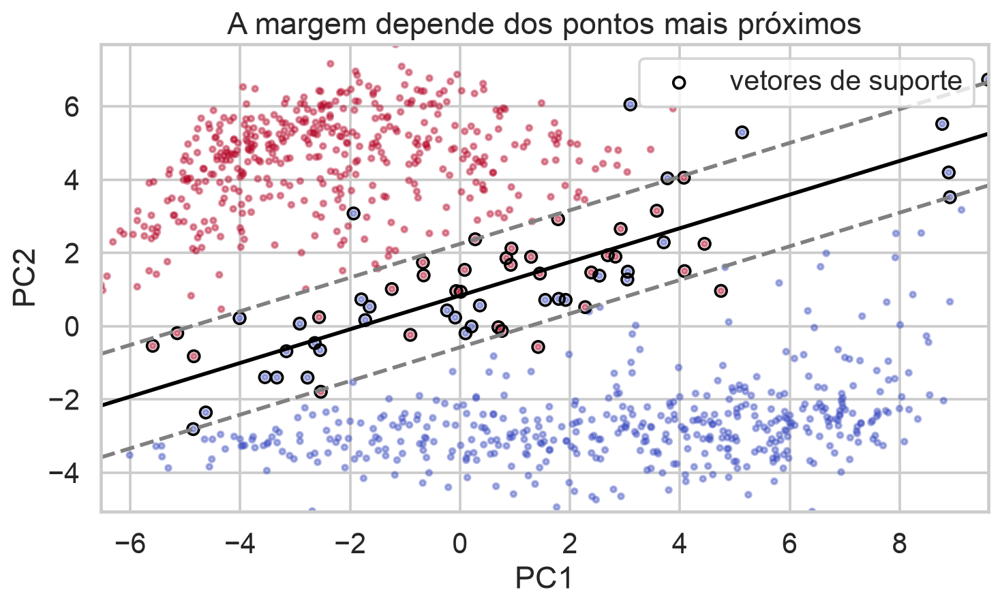{.wide-chart fig-alt="Fronteira linear, margens e vetores de suporte entre duas classes projetadas."}

Os círculos destacam observações na margem ou dentro dela: são os vetores de suporte.

<details class="code-fold"><summary>Código do gráfico</summary>
```python
model = SVC(kernel="linear", C=1).fit(Z, y)
margin = model.decision_function(grid)
support = model.support_vectors_
```
</details>

## A margem rígida quase nunca basta

Dados reais se sobrepõem e contêm ruído. A margem suave permite violações por variáveis $\xi_i\ge0$:

$$\min_{w,b,\xi}\frac12\|w\|_2^2+C\sum_{i=1}^n\xi_i$$

sujeito a $y_i(w^Tz_i+b)\ge1-\xi_i$.

## O que significam os termos?

- $w$ e $b$: definem a fronteira;
- $y_i\in\{-1,+1\}$: classe da observação $i$;
- $\xi_i$: tamanho da violação da margem;
- $C>0$: custo total dessas violações;
- $\|w\|_2^2/2$: penalização que favorece margem larga.

## Hinge loss oferece outra leitura

A perda de uma observação é

$$L_i=\max\{0,1-y_if(z_i)\}.$$

- margem correta e suficiente: $L_i=0$;
- correto, mas dentro da margem: $0<L_i<1$;
- classificado incorretamente: $L_i>1$.

$C$ troca margem por violações.

## $C$ controla flexibilidade

- $C$ grande: pune fortemente erros, produz fronteira mais sensível;
- $C$ pequeno: aceita violações e amplia a regularização;
- o efeito depende da escala e do kernel;
- $C$ é hiperparâmetro, não probabilidade.

Escolha-o por validação, não pelo treino.

## Escala altera distâncias e margens

Se um atributo varia entre 0 e 1 e outro entre 0 e 10.000, o segundo domina produtos internos e distâncias.

Padronização deve ser aprendida dentro de cada parte de validação. No Fashion-MNIST, todos os pixels já compartilham a mesma unidade e faixa.

## Kernels alteram a noção de similaridade

SVM pode usar um produto interno implícito

$$K(z_i,z_j)=\langle\phi(z_i),\phi(z_j)\rangle.$$

Não precisamos construir explicitamente $\phi(z)$. O kernel define quais padrões são considerados próximos.

## O kernel RBF cria fronteiras flexíveis

$$K(z_i,z_j)=\exp(-\gamma\|z_i-z_j\|_2^2).$$

- $\gamma$ pequeno: influência ampla e fronteira suave;
- $\gamma$ grande: influência local e fronteira complexa;
- `gamma="scale"` usa a dispersão observada como ponto de partida.

## $C$ e $\gamma$ devem ser escolhidos juntos

$C$ regula violações; $\gamma$ regula o alcance da similaridade.

Uma combinação pode compensar parcialmente a outra. Procurar cada parâmetro isoladamente pode perder boas regiões do espaço de hiperparâmetros.

## Multiclasse combina problemas binários

SVM é originalmente binário. Implementações multiclasse usam estratégias como:

- one-vs-rest: uma classe contra as demais;
- one-vs-one: um classificador para cada par;
- funções de decisão conjuntas.

No Fashion-MNIST, a implementação utilizada combina classificadores binários internamente.

## A saída não é probabilidade nativa

$f(z)$ mede posição relativa à fronteira, não uma probabilidade calibrada.

Quando probabilidades são necessárias, uma etapa adicional de calibração deve ser ajustada e validada. Isso aumenta custo e deve permanecer dentro da pipeline.

## PCA e SVM resolvem gargalos diferentes

PCA pode:

- reduzir ruído e redundância;
- diminuir memória e tempo;
- facilitar visualização;
- remover também informação discriminativa.

SVM usa a representação resultante para construir a decisão.

## A pipeline completa

$$X\xrightarrow{\text{centrar}}
X_c\xrightarrow{\text{PCA}_k}Z
\xrightarrow{\text{SVM}_{C,\gamma}}\widehat Y.$$

Os parâmetros de centralização, PCA e SVM são aprendidos apenas no treino de cada parte.

## Mais componentes não garantem desempenho

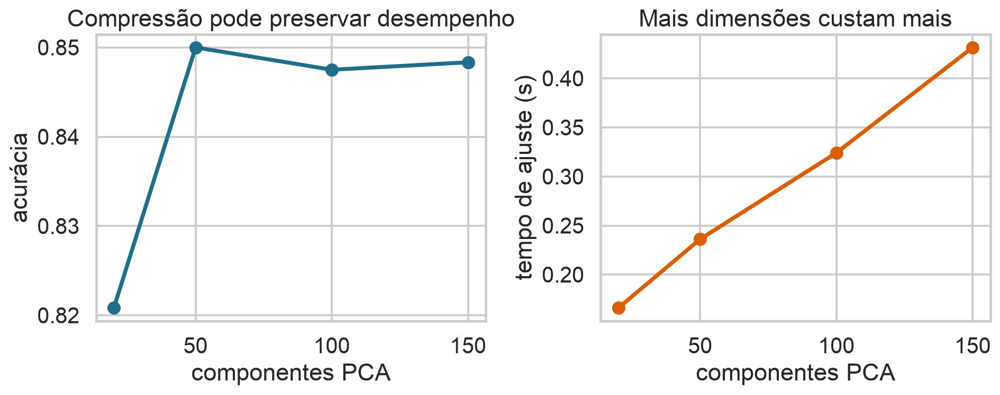{.wide-chart fig-alt="Acurácia e tempo do SVM para diferentes números de componentes PCA."}

Nesta amostra, 50 componentes atingem cerca de 85%; mais dimensões custam mais sem melhorar o teste.

<details class="code-fold"><summary>Código do gráfico</summary>
```python
Pipeline([("pca", PCA(n_components=k)),
          ("svm", SVC(C=10, kernel="rbf"))])
```
</details>

## Valide a pipeline inteira

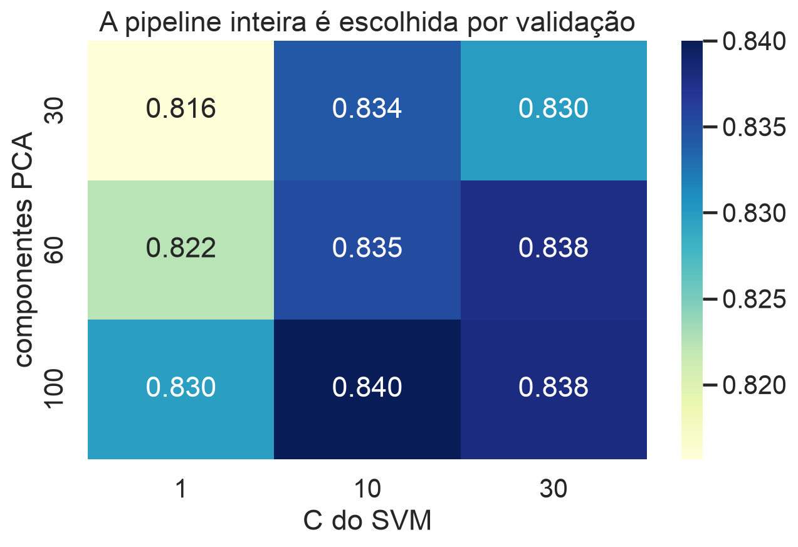{.wide-chart fig-alt="Acurácia de validação para combinações de componentes PCA e C do SVM."}

Cada célula reajusta PCA e SVM dentro das partes; projetar toda a base antes causaria vazamento.

<details class="code-fold"><summary>Código do gráfico</summary>
```python
for k in components_grid:
    for C in C_grid:
        score[k, C] = cross_validate(Pipeline([PCA(k), SVC(C=C)]))
```
</details>

## Acurácia esconde quais classes confundem

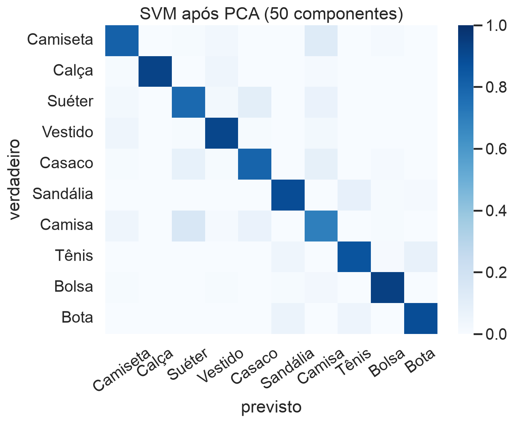{.wide-chart fig-alt="Matriz de confusão normalizada do SVM após PCA."}

Roupas superiores semelhantes concentram os erros; bolsa e calçados são mais fáceis nesta amostra.

<details class="code-fold"><summary>Código do gráfico</summary>
```python
cm = confusion_matrix(y_test, prediction, normalize="true")
sns.heatmap(cm, annot=False)
```
</details>

## Erros orientam a próxima iteração

Confundir camisa e camiseta sugere investigar:

- mais dados nessas classes;
- atributos de textura ou contorno;
- resolução e alinhamento;
- custo diferenciado entre erros;
- exemplos rotulados de forma ambígua.

Métrica não encerra a análise: ela direciona diagnóstico.

## Quando PCA ajuda

- muitos atributos correlacionados;
- custo alto de armazenamento ou ajuste;
- ruído em direções de baixa variância;
- necessidade de projeção exploratória;
- downstream sensível à dimensionalidade.

O benefício deve aparecer fora da amostra.

## Quando PCA pode atrapalhar

- componentes dificultam interpretação substantiva;
- a resposta depende de baixa variância;
- dados são esparsos e a projeção fica densa;
- poucos atributos já são informativos;
- custo do próprio PCA supera a economia.

PCA não é uma etapa obrigatória.

## Quando SVM é uma boa escolha

- amostras médias e muitos atributos;
- fronteiras complexas com kernels;
- representação bem escalada;
- necessidade de um classificador forte com poucos ajustes conceituais.

Para milhões de observações, SVM com RBF pode ficar caro.

## A conexão com ciência de dados

O caso reúne o ciclo completo:

1. representar dados brutos;
2. explorar e comprimir;
3. construir uma pipeline;
4. escolher hiperparâmetros por validação;
5. avaliar erros por classe;
6. relacionar custo técnico ao uso real.

## Quiz: PCA antes da divisão? {.quiz-question}

- [Não; PCA deve ser ajustado no treino de cada parte]{.correct data-explanation="As componentes dependem da distribuição dos dados e não podem consultar a validação."}
- [Sim; PCA não usa os rótulos]{data-explanation="Mesmo sem Y, PCA aprende médias e direções a partir de X."}
- [Somente quando usamos kernel linear]{data-explanation="O risco de vazamento independe do kernel posterior."}

## Quiz: mais componentes sempre ajudam? {.quiz-question}

- [Não; podem elevar custo e reintroduzir ruído sem melhorar generalização]{.correct data-explanation="O gráfico da aula mostra desempenho praticamente estável após 50 componentes."}
- [Sim; mais variância explicada implica mais acurácia]{data-explanation="PCA não otimiza a resposta."}
- [Sim, desde que C seja grande]{data-explanation="C grande não garante generalização e pode aumentar sensibilidade."}

## O que levamos desta aula

- PCA cria uma representação compacta por direções de variação;
- compressão e classificação têm objetivos diferentes;
- SVM decide por margem e vetores de suporte;
- kernels ampliam flexibilidade e custo;
- PCA, escala e SVM formam uma única pipeline;
- desempenho, tempo e padrão de erros devem ser avaliados juntos.

## Encerramento do módulo

Correlação, regressão, verossimilhança, otimização, regularização, engenharia de atributos, validação, KNN, PCA e SVM formam um vocabulário integrado.

O objetivo não é apenas conhecer algoritmos: é construir análises reproduzíveis que generalizem e respondam a uma pergunta real.

## Bibliografia

- James et al., *An Introduction to Statistical Learning*, caps. 9 e 12.
- Hastie, Tibshirani e Friedman, *The Elements of Statistical Learning*, caps. 12 e 14.
- Deisenroth, Faisal e Ong, *Mathematics for Machine Learning*, caps. 10 e 12.
- [Fashion-MNIST — Zalando Research](https://github.com/zalandoresearch/fashion-mnist).
- [Exemplo do gato na aula de ALC](https://heitorramos.github.io/Slides_ALC/Aula11.html#/qual-foi-a-taxa-de-compressão).
