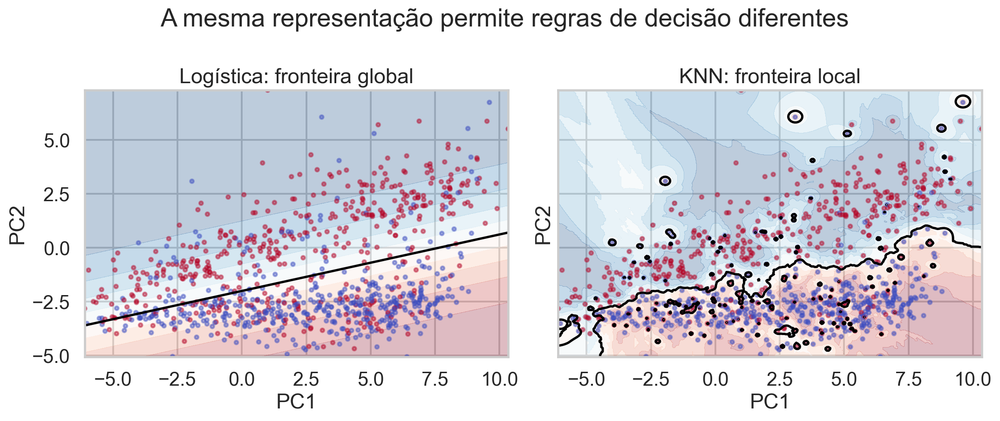
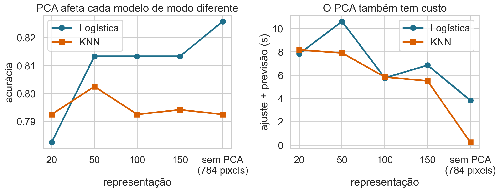
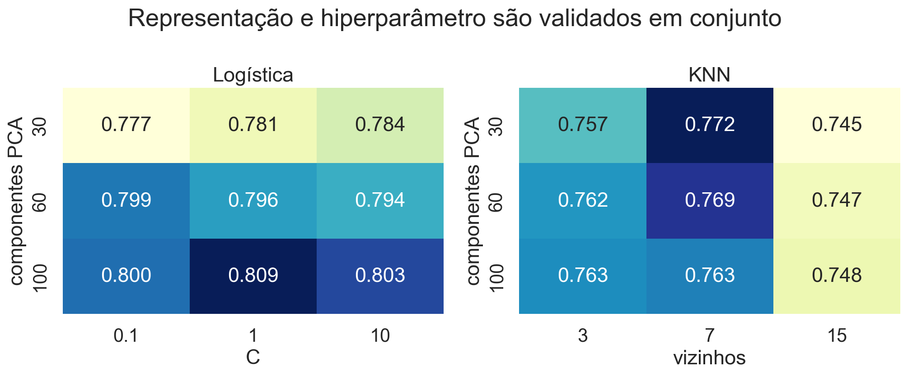

## Representação e decisão

PCA reorganiza a representação; regressão logística e KNN tomam decisões nessa nova representação.

> Em ciência de dados, o ganho aparece quando representação, modelo e avaliação são tratados como um único procedimento.

## Hoje

- revisitar PCA por compressão e visualização;
- usar o gato como exemplo de aproximação de baixo posto;
- aplicar PCA a imagens do Fashion-MNIST;
- comparar regressão logística e KNN sobre a mesma representação;
- combinar PCA e os classificadores em pipelines validadas;
- discutir custo, interpretação e limites.

## Comece com uma imagem conhecida

{fig-alt="Fotografia de um gato usada como exemplo de compressão por baixo posto." width="84%"}

Em tons de cinza, a imagem é uma matriz $A\in\mathbb R^{m\times n}$: cada posição guarda a intensidade de um pixel.

## Aproximar a matriz comprime a imagem

Se

$$A=U\Sigma V^T,$$

a aproximação de posto $k$ é

$$A_k=U_k\Sigma_kV_k^T=\sum_{j=1}^k\sigma_ju_jv_j^T.$$

Guardamos apenas os $k$ padrões dominantes.

## O posto controla detalhe e armazenamento

{fig-alt="Gato original e aproximações de postos 5, 20, 60 e 120." width="90%"}

Poucos componentes preservam estrutura global; detalhes finos reaparecem conforme $k$ cresce.

<details class="code-fold"><summary>Código do gráfico</summary>
```python
U, s, Vt = np.linalg.svd(image, full_matrices=False)
Ak = (U[:, :k]*s[:k]) @ Vt[:k]
```
</details>

## Quanto realmente armazenamos?

A matriz original guarda $mn$ números. A aproximação guarda

$$mk+k+kn=k(m+n+1).$$

A fração de armazenamento é

$$r_k=\frac{k(m+n+1)}{mn}.$$

Compressão só ocorre quando $r_k<1$.

## Qualidade e compressão competem

{.wide-chart fig-alt="Decaimento dos valores singulares e energia acumulada contra fração de armazenamento."}

O espectro informa quantas direções são necessárias; a escolha final depende da perda aceitável na aplicação.

<details class="code-fold"><summary>Código do gráfico</summary>
```python
energy = np.cumsum(s**2)/np.sum(s**2)
storage = k*(m+n+1)/(m*n)
```
</details>

## PCA aplica a mesma ideia a observações

Agora $X\in\mathbb R^{n\times p}$ tem:

- $n$ observações nas linhas;
- $p$ atributos nas colunas;
- colunas centralizadas antes da decomposição.

PCA encontra novas direções ortogonais que concentram a variação da amostra.

## Uma revisão geométrica suficiente

Para $X_c=X-\mathbf 1\bar x^T$,

$$X_c=U\Sigma V^T.$$

As colunas de $V$ são direções principais; os escores são

$$Z=X_cV_k.$$

$Z\in\mathbb R^{n\times k}$ representa cada observação em $k$ componentes.

## Variância explicada ordena componentes

Para componente $j$,

$$\operatorname{PVE}_j=\frac{\sigma_j^2}{\sum_{\ell=1}^{r}\sigma_\ell^2}.$$

$\sigma_j$ é o valor singular; $r$ é o posto de $X_c$. A soma acumulada mede a variação preservada pelas primeiras $k$ direções.

## PCA não usa a resposta

PCA maximiza variação de $X$, não separação entre classes nem previsão de $Y$.

Uma direção de baixa variância pode ser muito útil para classificar. Portanto, “90% de variância” é um diagnóstico, não uma garantia preditiva.

## Base de dados de apoio

Usaremos **Fashion-MNIST**, disponível no Kaggle:

- imagens $28\times28$ em tons de cinza;
- 784 pixels usados como atributos;
- 10 classes de roupas e acessórios;
- amostra local balanceada com 6.000 imagens.

## As classes têm formas e ambiguidades reais

{.wide-chart fig-alt="Uma imagem de cada uma das dez classes do Fashion-MNIST."}

Camisa, camiseta, suéter e casaco compartilham contornos; calçados e bolsa são mais distintos.

<details class="code-fold"><summary>Código do gráfico</summary>
```python
for label in range(10):
    plt.imshow(images[labels == label][0], cmap="gray")
```
</details>

## Imagem vira uma linha da matriz

Cada matriz $28\times28$ é vetorizada:

$$x_i\in\mathbb R^{784}.$$

Dividimos intensidades por 255 para obter valores em $[0,1]$. Como todos os atributos são pixels na mesma escala, centramos, mas não precisamos padronizar cada pixel por variância nesta aplicação.

## Escolher $k$ começa pelo espectro

{.wide-chart fig-alt="Variância explicada acumulada do PCA no Fashion-MNIST."}

A curva revela retornos decrescentes: cada componente adicional preserva menos variação inédita.

<details class="code-fold"><summary>Código do gráfico</summary>
```python
pca.fit(X_train)
cum = np.cumsum(pca.explained_variance_ratio_)
```
</details>

## Duas componentes servem para explorar

{.wide-chart fig-alt="Projeção de imagens do Fashion-MNIST nas duas primeiras componentes, coloridas por classe."}

Algumas classes formam regiões, mas há muita sobreposição. Visualização em 2D não mede o desempenho disponível em 50 dimensões.

<details class="code-fold"><summary>Código do gráfico</summary>
```python
Z = PCA(n_components=2).fit_transform(X_train)
plt.scatter(Z[:, 0], Z[:, 1], c=y_train)
```
</details>

## Reconstrução torna a perda concreta

{.wide-chart fig-alt="Quatro roupas reconstruídas com 5, 20, 50, 100 e 150 componentes."}

Com 50 componentes, a identidade visual já é preservada, embora detalhes de textura desapareçam.

<details class="code-fold"><summary>Código do gráfico</summary>
```python
Z = pca.transform(X)
X_reconstructed = pca.mean_ + Z[:, :k] @ pca.components_[:k]
```
</details>

## Quiz: PCA para classificação {.quiz-question}

- [O número de componentes deve ser validado com a pipeline de classificação]{.correct data-explanation="Variância explicada não mede diretamente separação nem erro preditivo."}
- [Sempre escolha exatamente 90% da variância]{data-explanation="O limiar é uma heurística, não um ótimo universal."}
- [Duas componentes bastam se o gráfico parecer razoável]{data-explanation="A projeção 2D pode ocultar informação útil em outras componentes."}

## Agora precisamos decidir uma classe

Após PCA, cada imagem é um ponto $z_i\in\mathbb R^k$.

Usaremos duas regras já conhecidas:

- **regressão logística:** aprende uma relação global entre componentes e probabilidades;
- **KNN:** decide pela classe das observações mais próximas.

## Logística transforma escore em probabilidade

No caso binário,

$$P(Y=1\mid Z=z)=\frac{1}{1+e^{-(\beta_0+\beta^Tz)}}.$$

$z$ contém os componentes da imagem; $\beta_0$ é o intercepto; $\beta$ reúne os coeficientes. A fronteira para limiar $0{,}5$ satisfaz $\beta_0+\beta^Tz=0$.

## No problema multiclasse

Para cada classe $c\in\{1,\ldots,C\}$, a versão multinomial usa

$$P(Y=c\mid Z=z)=\frac{e^{\beta_{0c}+\beta_c^Tz}}
{\sum_{j=1}^{C}e^{\beta_{0j}+\beta_j^Tz}}.$$

As probabilidades são positivas e somam 1. Prevemos a classe de maior probabilidade.

## KNN decide por vizinhança

Se $\mathcal N_K(z)$ contém os índices dos $K$ pontos de treino mais próximos de $z$,

$$\widehat y(z)=\operatorname{moda}\{y_i:i\in\mathcal N_K(z)\}.$$

$K$ é o número de vizinhos; $y_i$ é a classe do vizinho $i$. Não há uma equação global para a fronteira.

## $K$ controla a flexibilidade

::: {.columns}
::: {.column width="48%"}
### $K$ pequeno

- decisões muito locais;
- fronteira irregular;
- maior sensibilidade a ruído.
:::
::: {.column width="48%"}
### $K$ grande

- vizinhança mais ampla;
- fronteira mais suave;
- detalhes locais podem desaparecer.
:::
:::

## A mesma representação, duas decisões

{.wide-chart fig-alt="Fronteiras da regressão logística e do KNN para camiseta e camisa nas duas primeiras componentes principais."}

<details class="code-fold"><summary>Código do gráfico</summary>
```python
logistic = LogisticRegression().fit(Z2, y)
knn = KNeighborsClassifier(n_neighbors=15).fit(Z2, y)
```
</details>

## O que o gráfico evidencia?

- a logística impõe uma fronteira linear no espaço das componentes;
- o KNN acompanha padrões locais e pode criar regiões irregulares;
- nenhuma fronteira resolve toda a sobreposição entre camisa e camiseta;
- trocar o modelo não recupera informação descartada pelo PCA.

## Quiz: qual diferença é estrutural? {.quiz-question}

- [A logística aprende parâmetros globais; o KNN consulta vizinhos no momento da previsão]{.correct data-explanation="A natureza global ou local da regra muda a forma da fronteira e o custo de previsão."}
- [Somente a logística depende da escala]{data-explanation="O KNN depende diretamente das distâncias e também é sensível à escala."}
- [Somente o KNN pode tratar mais de duas classes]{data-explanation="Ambos possuem extensões multiclasse."}

## Distância define o que é vizinho

No KNN com distância euclidiana,

$$d(z_i,z)=\sqrt{\sum_{j=1}^{k}(z_{ij}-z_j)^2}.$$

$z_{ij}$ é o escore da imagem $i$ na componente $j$; $z_j$ é o escore da nova imagem. Componentes com maior dispersão contribuem mais para a distância.

## Escala continua importante

Todos os pixels do Fashion-MNIST compartilham unidade e faixa. Após PCA, as primeiras componentes têm maior variância por construção.

Manter essa escala dá mais peso às direções que explicam mais variação. Padronizar os escores responderia a outra hipótese: todas as componentes deveriam pesar igualmente.

## PCA e o classificador têm papéis distintos

PCA pode reduzir redundância, custo e ruído, mas também remover sinal discriminativo. Depois:

- a logística estima coeficientes e probabilidades;
- o KNN armazena o treino e consulta vizinhos.

O benefício do PCA precisa aparecer fora da amostra.

## Uma pipeline para cada modelo

$$X\xrightarrow{\text{centrar}}X_c
\xrightarrow{\text{PCA}_k}Z
\xrightarrow{\text{classificador}}\widehat Y.$$

O classificador pode ser $\operatorname{Logística}_C$ ou $\operatorname{KNN}_K$. Aqui, $C$ controla a regularização logística e $K$ é o número de vizinhos.

## Tudo é aprendido dentro do treino

Em cada divisão de validação:

1. calculamos a média dos pixels no treino;
2. estimamos as componentes no treino;
3. projetamos treino e validação nessas componentes;
4. ajustamos e avaliamos o classificador.

Projetar toda a base antes da validação causa vazamento.

## Mais componentes não garantem desempenho

{.wide-chart fig-alt="Acurácia e tempo total da regressão logística e do KNN para diferentes números de componentes PCA e para os 784 pixels."}

O ponto em 784 usa os pixels originais; os demais usam PCA.

<details class="code-fold"><summary>Código do gráfico</summary>
```python
Pipeline([("pca", PCA(n_components=k)),
          ("modelo", LogisticRegression())])
Pipeline([("pca", PCA(n_components=k)),
          ("modelo", KNeighborsClassifier(n_neighbors=7))])
```
</details>

## Leia desempenho e custo juntos

A regressão logística precisa ajustar coeficientes, enquanto o KNN transfere grande parte do custo para a previsão. Nesta amostra, o próprio PCA tem custo visível. Reduzir a dimensão pode:

- acelerar ou tornar a pipeline mais lenta, conforme o volume e a implementação;
- preservar a acurácia até certo ponto;
- prejudicar cada modelo em ritmos distintos.

Não existe um número de componentes ótimo sem especificar o modelo e a métrica.

## Valide a pipeline inteira

{.wide-chart fig-alt="Acurácia de validação para componentes PCA e hiperparâmetros da regressão logística e do KNN."}

Cada célula reajusta PCA e classificador dentro das partes de validação.

<details class="code-fold"><summary>Código do gráfico</summary>
```python
for k in components_grid:
    for value in hyperparameter_grid:
        score[k, value] = cross_validate(make_pipeline(PCA(k), model(value)))
```
</details>

## O que estamos escolhendo?

::: {.columns}
::: {.column width="48%"}
### Representação

$k$: quantas componentes serão entregues ao modelo.
:::
::: {.column width="48%"}
### Regra de decisão

$C$: regularização logística; ou $K$: tamanho da vizinhança no KNN.
:::
:::

A combinação escolhida é reajustada em todo o conjunto de desenvolvimento e só então avaliada no teste reservado.

## Acurácia esconde quais classes confundem

{.wide-chart fig-alt="Matriz de confusão normalizada do melhor classificador avaliado após a comparação com PCA."}

Roupas superiores semelhantes concentram os erros; bolsa e calçados são mais fáceis nesta amostra.

<details class="code-fold"><summary>Código do gráfico</summary>
```python
cm = confusion_matrix(y_test, prediction, normalize="true")
sns.heatmap(cm, annot=False)
```
</details>

## Erros orientam a próxima iteração

Confundir camisa e camiseta sugere investigar:

- mais dados nessas classes;
- atributos de textura ou contorno;
- resolução e alinhamento;
- custo diferenciado entre erros;
- exemplos rotulados de forma ambígua.

Métrica não encerra a análise: ela direciona diagnóstico.

## Quando PCA ajuda

- muitos atributos correlacionados;
- custo alto de armazenamento ou ajuste;
- ruído em direções de baixa variância;
- necessidade de projeção exploratória;
- downstream sensível à dimensionalidade.

O benefício deve aparecer fora da amostra.

## Quando PCA pode atrapalhar

- componentes dificultam interpretação substantiva;
- a resposta depende de baixa variância;
- dados são esparsos e a projeção fica densa;
- poucos atributos já são informativos;
- custo do próprio PCA supera a economia.

PCA não é uma etapa obrigatória.

## Logística ou KNN?

::: {.columns}
::: {.column width="48%"}
### Logística

- probabilidades explícitas;
- fronteira global e interpretável;
- treino mais caro, previsão rápida.
:::
::: {.column width="48%"}
### KNN

- regra local e flexível;
- quase nenhum treino;
- previsão e armazenamento mais caros.
:::
:::

## A dimensão afeta o KNN especialmente

Em alta dimensão, distâncias tendem a se tornar menos informativas: muitos pontos parecem igualmente distantes. É uma manifestação da **maldição da dimensionalidade**.

PCA pode ajudar o KNN ao remover direções redundantes, desde que preserve a estrutura local relevante para as classes.

## A conexão com ciência de dados

O caso reúne o ciclo completo:

1. representar dados brutos;
2. explorar e comprimir;
3. construir uma pipeline;
4. escolher hiperparâmetros por validação;
5. avaliar erros por classe;
6. relacionar custo técnico ao uso real.

## Quiz: PCA antes da divisão? {.quiz-question}

- [Não; PCA deve ser ajustado no treino de cada parte]{.correct data-explanation="As componentes dependem da distribuição dos dados e não podem consultar a validação."}
- [Sim; PCA não usa os rótulos]{data-explanation="Mesmo sem Y, PCA aprende médias e direções a partir de X."}
- [Somente quando usamos regressão logística]{data-explanation="O risco de vazamento independe do classificador posterior."}

## Quiz: mais componentes sempre ajudam? {.quiz-question}

- [Não; podem elevar custo e reintroduzir ruído sem melhorar generalização]{.correct data-explanation="O gráfico da aula mostra desempenho praticamente estável após 50 componentes."}
- [Sim; mais variância explicada implica mais acurácia]{data-explanation="PCA não otimiza a resposta."}
- [Sim, desde que C seja grande]{data-explanation="C grande não garante generalização e pode aumentar sensibilidade."}

## O que levamos desta aula

- PCA cria uma representação compacta por direções de variação;
- compressão e classificação têm objetivos diferentes;
- regressão logística e KNN constroem decisões de maneiras diferentes;
- PCA e o classificador formam uma única pipeline;
- desempenho, tempo e padrão de erros devem ser avaliados juntos.

## Encerramento do módulo

Correlação, regressão, verossimilhança, otimização, regularização, engenharia de atributos, validação, KNN, regressão logística e PCA formam um vocabulário integrado.

O objetivo não é apenas conhecer algoritmos: é construir análises reproduzíveis que generalizem e respondam a uma pergunta real.

## Bibliografia

- James et al., *An Introduction to Statistical Learning*, caps. 4 e 12.
- Hastie, Tibshirani e Friedman, *The Elements of Statistical Learning*, caps. 4, 13 e 14.
- Deisenroth, Faisal e Ong, *Mathematics for Machine Learning*, caps. 10 e 12.
- [Fashion-MNIST — Zalando Research](https://github.com/zalandoresearch/fashion-mnist).
- [Exemplo do gato na aula de ALC](https://heitorramos.github.io/Slides_ALC/Aula11.html#/qual-foi-a-taxa-de-compressão).
