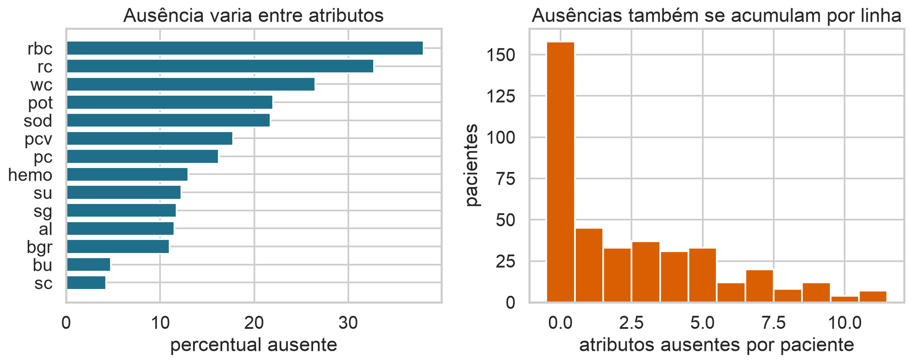
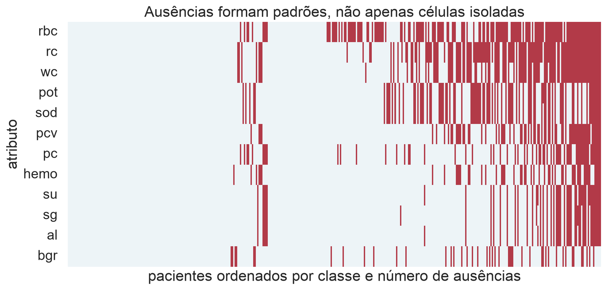
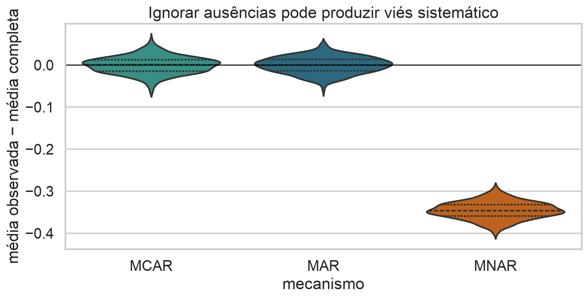
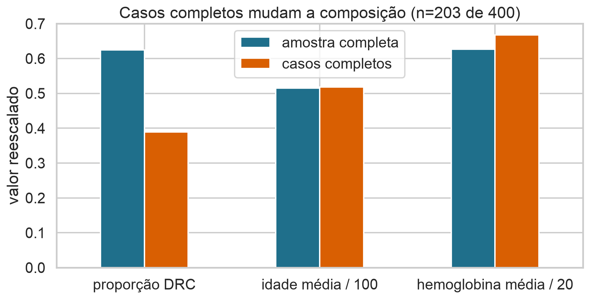
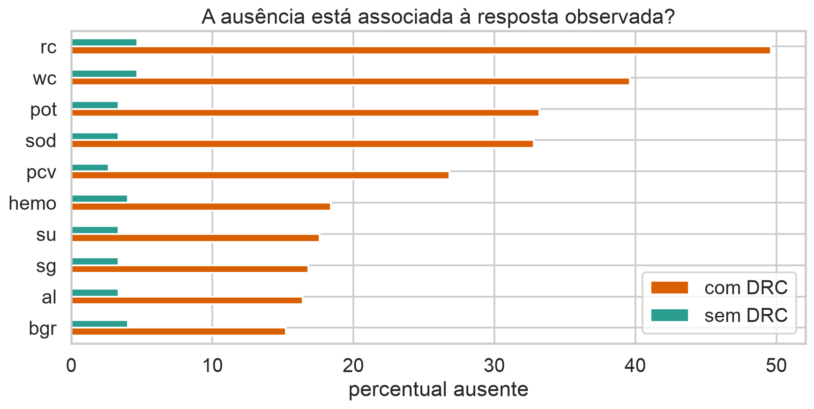
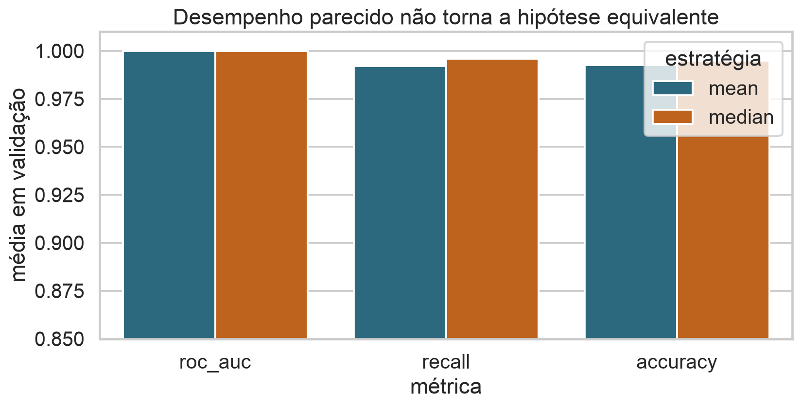
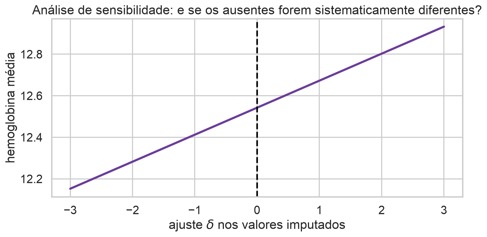

## Uma célula vazia não é “nada”

Um valor pode faltar por sorte, pelo desenho da coleta, pela condição da pessoa ou pelo próprio valor que não observamos.

> Tratar ausências exige modelar como os dados chegaram até nós.

## A pergunta da aula

Podemos simplesmente excluir todos os pacientes que têm algum exame ausente?

Para responder, precisamos separar três problemas:

- computação: o algoritmo aceita ausências?
- estatística: a análise permanece válida?
- substantivo: por que o valor não foi registrado?

## Base de dados de apoio

Retomamos os 400 registros da base **Chronic Kidney Disease**, usada na Aula 25.

- 24 atributos preditores;
- medidas numéricas e categóricas;
- ausência distribuída de forma desigual;
- resposta: DRC ou ausência de DRC.

[Fonte no Kaggle](https://www.kaggle.com/datasets/mansoordaku/ckdisease)

## Antes de corrigir, faça um inventário

{.wide-chart fig-alt="Percentual ausente por atributo e distribuição do número de ausências por paciente."}

Ausência deve ser descrita por coluna e por unidade observacional.

<details class="code-fold"><summary>Código do gráfico</summary>
```python
missing_col = df.isna().mean()
missing_row = df.isna().sum(axis=1)
```
</details>

## A estrutura importa

{.wide-chart fig-alt="Mapa binário dos padrões de ausência por atributo e paciente."}

Blocos vermelhos sugerem combinações recorrentes de exames não registrados.

<details class="code-fold"><summary>Código do gráfico</summary>
```python
matrix = df[cols].isna().astype(int)
sns.heatmap(matrix.T, cmap=["#edf4f7", "#b23a48"])
```
</details>

## O indicador de observação

Para uma variável $Y_i$, defina

$$R_i=\begin{cases}
1,&Y_i\text{ foi observado};\\
0,&Y_i\text{ está ausente}.
\end{cases}$$

O mecanismo de ausência é uma afirmação sobre a distribuição de $R$ condicionada aos dados completos.

## Dados completos e dados observados

Conceitualmente, existe uma matriz completa $Y=(Y_{obs},Y_{mis})$:

- $Y_{obs}$: valores que efetivamente vemos;
- $Y_{mis}$: valores existentes, mas não observados;
- $R$: padrão que determina qual parte aparece.

Não conhecemos $Y_{mis}$ — justamente por isso as hipóteses importam.

## MCAR: ausência completamente ao acaso

$$P(R\mid Y_{obs},Y_{mis},X)=P(R).$$

Depois de considerar o desenho, a chance de ausência não depende de valores observados nem ausentes.

Exemplo plausível: tubos são perdidos por uma falha aleatória de transporte.

## MAR: ausência ao acaso condicional

$$P(R\mid Y_{obs},Y_{mis},X)=P(R\mid Y_{obs},X).$$

Após condicionar no que observamos, a ausência não depende do valor ausente.

Exemplo: um exame é solicitado com frequência diferente segundo idade e sintomas registrados.

## MNAR: ausência não ignorável

$$P(R\mid Y_{obs},Y_{mis},X)$$

continua dependendo de $Y_{mis}$, mesmo após condicionarmos no observado.

Exemplo: pessoas com um sintoma mais intenso evitam responder exatamente à pergunta sobre esse sintoma.

## As siglas descrevem hipóteses, não dados

Não existe um teste definitivo que separe MAR de MNAR usando apenas os valores observados.

Conhecimento do processo de coleta, registros auxiliares e análises de sensibilidade são essenciais.

## Quiz: qual mecanismo é plausível?

::: {.quiz}
Um equipamento falha mais frequentemente quando a concentração real, não registrada, é muito alta. Qual mecanismo descreve melhor a situação?

- [ ] MCAR
- [ ] MAR, necessariamente
- [x] MNAR
- [ ] ausência estrutural sem relação com a medida
:::

## A simulação revela o problema

{.wide-chart fig-alt="Distribuição do erro da média após exclusão sob MCAR, MAR e MNAR."}

Nesta simulação, excluir ausentes sob MNAR desloca sistematicamente a média observada.

<details class="code-fold"><summary>Código do gráfico</summary>
```python
prob_missing = expit(-0.7 + 1.2*x)  # MNAR
observed_mean = x[rng.random(n) > prob_missing].mean()
```
</details>

## Excluir linhas é uma decisão estatística

A análise de casos completos usa apenas

$$\mathcal I_{cc}=\{i:R_{i1}=\cdots=R_{ip}=1\}.$$

Ela reduz o tamanho amostral e muda a população efetivamente analisada quando pertencer a $\mathcal I_{cc}$ não é independente do fenômeno estudado.

## O custo na base renal

{.wide-chart fig-alt="Comparação entre a amostra completa e o subconjunto de casos completos."}

Somente 203 dos 400 pacientes têm todos os atributos numéricos observados.

<details class="code-fold"><summary>Código do gráfico</summary>
```python
complete = df[numeric].notna().all(axis=1)
df.loc[complete].describe()
```
</details>

## Quando casos completos podem funcionar?

- sob MCAR, estimativas usuais permanecem não enviesadas, mas perdem precisão;
- em alguns modelos, condições mais fracas também bastam para parâmetros específicos;
- sob seleção relacionada ao desfecho ou aos valores ausentes, o viés pode ser severo.

“Funcionou no código” não estabelece validade.

## Imputação simples

Substituímos cada valor ausente por um único valor estimado, por exemplo:

$$\tilde x_{ij}=\begin{cases}
x_{ij},&R_{ij}=1;\\
\operatorname{mediana}(X_j^{obs}),&R_{ij}=0.
\end{cases}$$

É prática e reprodutível, mas trata valores imputados como se fossem conhecidos.

## Média ou mediana?

- média preserva o centro amostral da variável observada;
- mediana é menos sensível a valores extremos;
- ambas comprimem artificialmente a distribuição;
- nenhuma resolve automaticamente viés do mecanismo de ausência.

## Imputar a média reduz variabilidade

Se todos os ausentes recebem $\bar x_{obs}$, eles contribuem com desvio zero em relação ao centro imputado.

Consequências possíveis:

- variância subestimada;
- correlações distorcidas;
- incerteza excessivamente otimista.

## A imputação deve respeitar a variável

- numérica contínua: valores plausíveis no suporte;
- categórica: categorias existentes ou modelo apropriado;
- ordinal: preservar a ordem;
- contagem: evitar valores impossíveis;
- variável derivada: manter restrições lógicas.

## Indicadores de ausência

Podemos adicionar

$$M_j=\mathbb 1\{X_j\text{ está ausente}\}.$$

O modelo passa a distinguir um valor realmente típico de um valor colocado pela imputação.

Isso pode melhorar previsão, mas também explorar peculiaridades do processo de coleta.

## Ausência e resposta estão associadas?

{.wide-chart fig-alt="Percentuais ausentes por classe de doença renal."}

Diferenças observadas são pistas sobre o processo, não uma prova de MAR ou MNAR.

<details class="code-fold"><summary>Código do gráfico</summary>
```python
df.groupby("classification")[numeric].apply(lambda x: x.isna().mean())
```
</details>

## Ausência pode ser um preditor perigoso

Se um hospital solicita determinado exame apenas para casos graves, $M_j$ carrega informação clínica indireta.

O modelo pode funcionar localmente e falhar quando o protocolo de solicitação mudar.

> Prever bem o processo de coleta não é o mesmo que aprender uma relação estável com o fenômeno.

## Quiz: qual é o risco?

::: {.quiz}
Um indicador de exame ausente aumenta muito a acurácia. Qual conclusão é defensável?

- [ ] o mecanismo é MCAR
- [ ] o valor ausente foi recuperado corretamente
- [x] o processo de coleta contém informação preditiva que precisa ser investigada
- [ ] o modelo generalizará para qualquer hospital
:::

## Imputação dentro da pipeline

Em cada divisão de treinamento:

$$X_{treino}\xrightarrow{\text{ajusta imputador}}\hat\theta
\quad\Longrightarrow\quad
T_{\hat\theta}(X_{treino}),\;T_{\hat\theta}(X_{val}).$$

$\hat\theta$ contém medianas, modas ou parâmetros aprendidos apenas no treinamento.

## O vazamento discreto

Calcular a mediana com toda a base antes da validação permite que os folds de validação influenciem o treinamento.

Mesmo quando o efeito numérico parece pequeno, o procedimento avaliado deixou de representar o que aconteceria com dados futuros.

## Estratégias parecidas, hipóteses distintas

{.wide-chart fig-alt="Métricas de validação após imputação pela média ou mediana."}

Resultados próximos não demonstram que os dados imputados estejam corretos nem que a incerteza tenha sido representada.

<details class="code-fold"><summary>Código do gráfico</summary>
```python
pipe = Pipeline([("imputer", SimpleImputer(strategy="median")),
                 ("model", LogisticRegression())])
cross_validate(pipe, X, y, cv=folds)
```
</details>

## Imputação baseada em modelos

Em vez de uma constante, podemos estimar

$$P(X_j^{mis}\mid X_{-j}^{obs}),$$

em que $X_{-j}^{obs}$ representa outros atributos observados.

Regressões, vizinhos próximos e métodos iterativos podem produzir imputações condicionais.

## Uma única imputação omite incerteza

Se substituímos um valor por $\hat x$, análises posteriores normalmente o tratam como observado.

Mas deveríamos reconhecer duas fontes:

- incerteza da análise mesmo com dados completos;
- incerteza adicional sobre os valores que faltam.

## Imputação múltipla

Criamos $m$ bases plausíveis:

$$Y_{mis}^{(1)},Y_{mis}^{(2)},\ldots,Y_{mis}^{(m)},$$

analisamos cada uma e combinamos os resultados. As imputações devem variar para representar a incerteza sobre o que não foi observado.

## Regra de Rubin: estimativa combinada

Se $\hat Q_l$ é a estimativa na base imputada $l$,

$$\bar Q=\frac{1}{m}\sum_{l=1}^{m}\hat Q_l.$$

- $Q$: quantidade de interesse;
- $m$: número de imputações;
- $\bar Q$: estimativa combinada.

## Regra de Rubin: variância combinada

$$T=\bar U+\left(1+\frac{1}{m}\right)B,$$

com

$$\bar U=\frac1m\sum_{l=1}^{m}U_l,
\qquad B=\frac{1}{m-1}\sum_{l=1}^{m}(\hat Q_l-\bar Q)^2.$$

$\bar U$ mede variação dentro das análises; $B$, entre imputações.

## Imputar não significa inventar livremente

Um bom modelo de imputação deve:

- incluir variáveis relacionadas à ausência e ao valor ausente;
- respeitar suporte e relações substantivas;
- ser compatível com a análise final;
- produzir diagnósticos e múltiplas realizações plausíveis.

## E quando MNAR é plausível?

Precisamos especificar como os ausentes poderiam diferir dos valores previstos sob MAR.

Uma estratégia simples é o ajuste delta:

$$X_{mis}^{MNAR}=X_{mis}^{MAR}+\delta.$$

$\delta$ representa uma diferença substantivamente plausível.

## Análise de sensibilidade

{.wide-chart fig-alt="Média de hemoglobina sob diferentes ajustes nos valores imputados."}

A conclusão é robusta se permanecer semelhante em uma faixa defensável de $\delta$.

<details class="code-fold"><summary>Código do gráfico</summary>
```python
for delta in deltas:
    adjusted = imputed.where(observed, imputed + delta)
    estimates.append(adjusted.mean())
```
</details>

## Viés de seleção é o problema mais amplo

Mesmo sem células vazias, observamos apenas unidades com $S=1$:

$$P(Y,X\mid S=1)\neq P(Y,X).$$

$S$ indica inclusão na amostra. Usuários de uma plataforma, pacientes de um hospital e respondentes de uma pesquisa podem não representar a população-alvo.

## Ausência e seleção compartilham uma pergunta

> Quem ou o que deixou de ser observado — e por quê?

- ausência: faltam atributos de unidades presentes;
- seleção: faltam unidades inteiras;
- ambos exigem definir população-alvo e processo de observação.

## Qualidade vai além de ausência

Dimensões úteis:

- completude;
- validade de domínio;
- consistência entre campos;
- unicidade;
- precisão e resolução;
- atualidade;
- representatividade.

## Regras de validação

Exemplos de restrições auditáveis:

$$\text{idade}\in[0,120],\qquad
\text{data de alta}\geq\text{data de entrada}.$$

Também devemos verificar unidades, categorias inesperadas, duplicatas e relações lógicas entre colunas.

## Ausência estrutural não é dado perdido

“Número de gestações” pode ser não aplicável a parte da população. Codificar como zero, ausente ou categoria própria expressa significados diferentes.

Antes de imputar, diferencie:

- não coletado;
- desconhecido;
- não aplicável;
- censurado ou abaixo do limite de detecção.

## Documente as decisões

Para cada variável com ausência, registre:

- definição e unidade;
- códigos especiais;
- proporção e padrão de ausência;
- mecanismo plausível;
- estratégia adotada;
- diagnóstico e sensibilidade;
- impacto no resultado.

## Quiz: qual análise é mais completa?

::: {.quiz}
Qual sequência trata a ausência como problema estatístico e substantivo?

- [ ] preencher todas as células com zero e ajustar o modelo
- [ ] excluir linhas até o algoritmo executar
- [x] descrever padrões, investigar coleta, imputar na pipeline e testar sensibilidade
- [ ] escolher a imputação com maior acurácia no teste
:::

## Um fluxo defensável

1. definir população e quantidade de interesse;
2. distinguir códigos e tipos de não observação;
3. visualizar padrões por coluna, linha e grupo;
4. investigar o processo de coleta;
5. declarar hipóteses;
6. aplicar o método sem vazamento;
7. diagnosticar e testar sensibilidade;
8. comunicar limites.

## O que aprendemos com a base renal?

- casos completos descartam quase metade da base;
- padrões diferem entre atributos e classes;
- imputações simples podem prever bem, mas não provam validade;
- indicadores de ausência podem capturar protocolos locais;
- conclusões dependem de hipóteses que precisam ser explicitadas.

## Síntese

- MCAR, MAR e MNAR descrevem mecanismos de observação;
- exclusão e imputação são decisões estatísticas;
- a pipeline evita vazamento, não viés substantivo;
- imputação múltipla representa incerteza adicional;
- sensibilidade é indispensável quando MNAR é plausível;
- qualidade começa na compreensão de como o dado foi produzido.

## Bibliografia

- Little e Rubin, *Statistical Analysis with Missing Data*.
- van Buuren, *Flexible Imputation of Missing Data*.
- Hernán e Robins, *Causal Inference: What If*, capítulos sobre seleção.
- Kuhn e Johnson, *Feature Engineering and Selection*, capítulo sobre dados ausentes.
- National Academies, *The Prevention and Treatment of Missing Data in Clinical Trials*.
